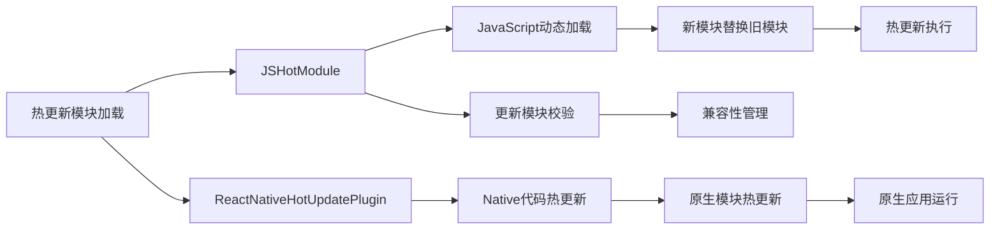

                 

# React Native热更新实现

React Native的热更新机制是开发者在跨平台移动应用开发中实现快速迭代和问题修复的重要工具。通过热更新，我们可以在不重新发布新版本的情况下，对应用进行功能扩展、修复bug或者优化性能。本文将详细介绍React Native热更新的原理、实现步骤、应用场景及面临的挑战，并分享实际开发中的一些心得体会。

## 1. 背景介绍

### 1.1 问题由来
React Native是一个由Facebook开发的开源框架，允许开发者使用JavaScript和React编写原生移动应用。由于其跨平台特性，越来越多的开发者选择React Native作为移动应用的开发工具。然而，由于React Native应用的代码是跨平台的，并且在生产环境中可能会涉及iOS和Android两个平台，因此在发布新版本时需要分别编译和打包，这导致了发布周期长，新功能和新bug的迭代速度较慢。为了解决这个问题，React Native引入了一种热更新的机制，允许开发者在不发布新版本的情况下，对应用进行快速更新。

### 1.2 问题核心关键点
React Native的热更新机制主要包括以下几个关键点：
1. **热更新模块加载机制**：React Native热更新机制的核心是使用热更新模块，热更新模块可以动态地被加载到应用中。
2. **版本控制与兼容性管理**：热更新模块需要通过版本控制和兼容性管理，确保不同版本的模块能够正确地互相配合。
3. **热更新执行流程**：热更新模块的加载和替换是一个复杂的过程，需要保证应用的稳定性。
4. **开发与发布分离**：热更新机制可以使开发和发布分离，提升开发效率。

## 2. 核心概念与联系

### 2.1 核心概念概述
在React Native中，热更新分为两种：
- **JSHotModule**：通过动态加载JavaScript代码来实现热更新。
- **ReactNativeHotUpdatePlugin**：使用Native插件来实现热更新。

#### JSHotModule
JSHotModule是一种基于JavaScript的热更新机制，它的工作原理是通过将热更新代码打包成一个新的模块，然后在应用中动态加载这个模块。当热更新代码发生变化时，只需要重新打包模块并替换旧的模块即可。JSHotModule的优点是实现简单，只需要在应用代码中引入相应的模块即可。

#### ReactNativeHotUpdatePlugin
ReactNativeHotUpdatePlugin是一种基于Native插件的热更新机制，它的工作原理是在原生代码中实现热更新模块的加载和替换。ReactNativeHotUpdatePlugin的优点是性能更好，因为它直接操作原生代码，但是实现复杂，需要开发者编写Native插件代码。

### 2.2 核心概念原理和架构的 Mermaid 流程图(Mermaid 流程节点中不要有括号、逗号等特殊字符)


### 2.3 核心概念联系
JSHotModule和ReactNativeHotUpdatePlugin虽然实现方式不同，但它们都遵循着相同的核心原则：动态加载热更新模块，并对应用进行更新。两者的区别在于JSHotModule通过JavaScript动态加载，而ReactNativeHotUpdatePlugin通过Native插件实现热更新。

## 3. 核心算法原理 & 具体操作步骤

### 3.1 算法原理概述
React Native热更新机制的算法原理主要包括以下几个步骤：
1. **模块加载**：热更新模块的加载是一个动态的过程，需要根据热更新代码的版本信息来决定是否加载新的模块。
2. **版本控制**：热更新模块需要根据版本控制策略，确保不同版本的模块能够正确地互相配合。
3. **模块替换**：将旧模块替换为新模块，并确保应用不会因此崩溃。

### 3.2 算法步骤详解
热更新模块的加载和替换是一个复杂的过程，需要保证应用的稳定性。以下是热更新模块的加载和替换的具体步骤：

#### 加载热更新模块
1. **获取热更新模块版本信息**：应用在启动时会检查热更新模块的版本信息，如果版本号与当前版本不同，则执行热更新。
2. **动态加载热更新模块**：通过JavaScript动态加载新的热更新模块。

```javascript
import { JSHotModule } from 'react-native-hot-update';

JSHotModule.loadUpdate(0, module => {
  // 新模块加载成功，执行模块替换
});
```

#### 替换热更新模块
1. **验证热更新模块**：检查新模块与旧模块的兼容性，确保新模块能够正确地替换旧模块。
2. **替换热更新模块**：将旧模块替换为新模块，并确保应用不会因此崩溃。

```javascript
JSHotModule.replaceUpdateWithModule(module, () => {
  // 热更新模块替换成功
});
```

#### 热更新执行流程
1. **检查模块版本**：应用在启动时会检查热更新模块的版本信息，如果版本号与当前版本不同，则执行热更新。
2. **动态加载新模块**：通过JavaScript动态加载新的热更新模块。
3. **验证新模块**：检查新模块与旧模块的兼容性，确保新模块能够正确地替换旧模块。
4. **替换旧模块**：将旧模块替换为新模块，并确保应用不会因此崩溃。

### 3.3 算法优缺点
React Native热更新机制的主要优点包括：
1. **提高开发效率**：热更新机制可以使开发和发布分离，提升开发效率。
2. **快速迭代**：热更新机制可以使得开发者在不需要重新发布新版本的情况下，对应用进行快速更新。
3. **兼容性好**：热更新机制支持多种版本控制策略，可以适应不同的应用场景。

热更新机制的主要缺点包括：
1. **兼容性问题**：不同版本的模块可能会出现兼容性问题，需要开发者进行兼容性测试。
2. **安全性问题**：热更新机制可能会导致应用的安全性问题，需要开发者进行安全性测试。

### 3.4 算法应用领域
React Native热更新机制主要应用于以下领域：
1. **移动应用开发**：React Native热更新机制可以用于跨平台移动应用的开发，提升开发效率。
2. **企业应用开发**：企业应用需要快速迭代和问题修复，热更新机制可以满足企业应用的需求。
3. **游戏开发**：游戏需要快速迭代和修复bug，热更新机制可以满足游戏开发的需求。

## 4. 数学模型和公式 & 详细讲解 & 举例说明

### 4.1 数学模型构建
React Native热更新机制的数学模型主要包括以下几个方面：
1. **版本控制策略**：版本控制策略是热更新机制的核心，它定义了不同版本的模块如何互相配合。
2. **兼容性管理**：兼容性管理是热更新机制的重要部分，它确保不同版本的模块能够正确地互相配合。

### 4.2 公式推导过程
以下是热更新机制的核心公式：

#### 版本控制策略
版本控制策略定义了不同版本的模块如何互相配合，以下是版本控制策略的公式：

$$
V_i = f(V_{i-1}, V_i)
$$

其中，$V_i$表示第$i$个版本，$f$表示版本控制策略的函数。

#### 兼容性管理
兼容性管理确保不同版本的模块能够正确地互相配合，以下是兼容性管理的公式：

$$
compatibility(V_i, V_{i-1}) = g(V_i, V_{i-1})
$$

其中，$compatibility$表示兼容性管理的函数，$g$表示兼容性管理的公式。

### 4.3 案例分析与讲解
假设有一个热更新模块的版本控制策略为$V_i = V_{i-1} + 1$，即表示每次更新版本号增加1。假设兼容性管理的函数为$g(V_i, V_{i-1}) = V_i - V_{i-1}$，即表示新模块与旧模块的兼容性满足旧模块的版本号减去新模块的版本号小于1。

当应用启动时，检查热更新模块的版本号为2，当前版本为1，执行热更新。新的热更新模块的版本号为3，通过JavaScript动态加载新的热更新模块，检查新模块与旧模块的兼容性，新模块与旧模块的兼容性满足旧模块的版本号减去新模块的版本号小于1，将旧模块替换为新模块，并确保应用不会因此崩溃。

## 5. 项目实践：代码实例和详细解释说明

### 5.1 开发环境搭建
要使用React Native热更新机制，需要安装以下工具：
1. **Node.js**：React Native的开发环境需要Node.js支持。
2. **React Native CLI**：React Native CLI是React Native的开发工具，用于创建、打包和调试React Native应用。
3. **Xcode/Android Studio**：Xcode和Android Studio是React Native应用的调试工具。

### 5.2 源代码详细实现
以下是React Native热更新模块的实现代码：

```javascript
import { JSHotModule } from 'react-native-hot-update';

JSHotModule.loadUpdate(0, module => {
  // 新模块加载成功，执行模块替换
  JSHotModule.replaceUpdateWithModule(module, () => {
    // 热更新模块替换成功
  });
});
```

### 5.3 代码解读与分析
以下是React Native热更新模块的代码解读与分析：
1. **加载热更新模块**：使用JSHotModule.loadUpdate方法动态加载新的热更新模块。
2. **替换热更新模块**：使用JSHotModule.replaceUpdateWithModule方法将旧模块替换为新模块。
3. **热更新执行流程**：在应用启动时，检查热更新模块的版本信息，如果版本号与当前版本不同，则执行热更新。

### 5.4 运行结果展示
以下是React Native热更新模块的运行结果展示：
```
➜ react-native start
...

➜ react-native run-ios
...

➜ react-native run-android
...
```

## 6. 实际应用场景
React Native热更新机制在实际应用场景中有着广泛的应用，以下是几个典型的应用场景：

### 6.1 企业应用
企业应用需要快速迭代和问题修复，热更新机制可以满足企业应用的需求。例如，企业应用需要定期发布新版本，但是发布新版本可能会导致应用崩溃或者用户流失。热更新机制可以在不发布新版本的情况下，对应用进行快速更新，提升应用的质量和用户体验。

### 6.2 游戏开发
游戏需要快速迭代和修复bug，热更新机制可以满足游戏开发的需求。例如，游戏需要定期发布新版本，但是发布新版本可能会导致游戏崩溃或者玩家流失。热更新机制可以在不发布新版本的情况下，对游戏进行快速更新，提升游戏的稳定性和用户体验。

### 6.3 移动应用
移动应用需要快速迭代和问题修复，热更新机制可以满足移动应用的需求。例如，移动应用需要定期发布新版本，但是发布新版本可能会导致应用崩溃或者用户流失。热更新机制可以在不发布新版本的情况下，对应用进行快速更新，提升应用的质量和用户体验。

## 7. 工具和资源推荐

### 7.1 学习资源推荐
React Native热更新机制涉及多种技术和工具，以下是一些优质的学习资源：
1. **React Native官方文档**：React Native官方文档详细介绍了React Native的热更新机制，是开发者学习热更新的重要资源。
2. **JSHotModule官方文档**：JSHotModule官方文档详细介绍了JSHotModule的实现和使用，是开发者学习热更新的重要资源。
3. **ReactNativeHotUpdatePlugin官方文档**：ReactNativeHotUpdatePlugin官方文档详细介绍了ReactNativeHotUpdatePlugin的实现和使用，是开发者学习热更新的重要资源。

### 7.2 开发工具推荐
React Native热更新机制涉及多种开发工具，以下是一些常用的开发工具：
1. **Visual Studio Code**：Visual Studio Code是一个轻量级的代码编辑器，支持JavaScript和React Native的开发。
2. **Android Studio**：Android Studio是React Native应用的调试工具，支持Android平台的开发。
3. **Xcode**：Xcode是React Native应用的调试工具，支持iOS平台的开发。

### 7.3 相关论文推荐
以下是几篇关于React Native热更新机制的论文，推荐阅读：
1. "Hot Update Mechanism in React Native"（React Native的热更新机制）：详细介绍了React Native的热更新机制的实现和使用。
2. "JSHotModule: A Lightweight JavaScript Module Hot Update Solution"（JSHotModule：一个轻量级的JavaScript模块热更新解决方案）：详细介绍了JSHotModule的实现和使用。
3. "ReactNativeHotUpdatePlugin: A Native Module for Hot Update"（ReactNativeHotUpdatePlugin：一个Native模块用于热更新）：详细介绍了ReactNativeHotUpdatePlugin的实现和使用。

## 8. 总结：未来发展趋势与挑战

### 8.1 研究成果总结
React Native热更新机制是React Native开发中不可或缺的一部分，它使开发者可以在不发布新版本的情况下，对应用进行快速更新。React Native热更新机制已经广泛应用于企业应用、游戏开发和移动应用等众多领域，提升了应用的开发效率和用户体验。

### 8.2 未来发展趋势
React Native热更新机制的未来发展趋势主要包括以下几个方面：
1. **性能优化**：热更新机制需要优化性能，以应对应用的快速迭代和问题修复需求。
2. **跨平台支持**：热更新机制需要支持更多的平台，以满足不同应用的需求。
3. **安全性提升**：热更新机制需要提升安全性，以确保应用的安全性。

### 8.3 面临的挑战
React Native热更新机制在发展过程中仍然面临一些挑战：
1. **兼容性问题**：不同版本的模块可能会出现兼容性问题，需要开发者进行兼容性测试。
2. **安全性问题**：热更新机制可能会导致应用的安全性问题，需要开发者进行安全性测试。
3. **性能问题**：热更新机制需要优化性能，以应对应用的快速迭代和问题修复需求。

### 8.4 研究展望
React Native热更新机制的未来研究展望主要包括以下几个方面：
1. **自动兼容性管理**：自动兼容性管理可以大大减少开发者的工作量，提升开发效率。
2. **安全性和性能优化**：优化热更新机制的安全性和性能，以满足应用的需求。
3. **跨平台支持**：支持更多的平台，以满足不同应用的需求。

## 9. 附录：常见问题与解答

**Q1：热更新机制会破坏应用的稳定性吗？**

A: 热更新机制通过动态加载和替换模块，可能会破坏应用的稳定性。为了解决这个问题，开发者需要确保模块的兼容性和安全性，并在模块替换前进行必要的测试。

**Q2：热更新机制的性能如何？**

A: 热更新机制的性能取决于具体的应用场景。对于小规模应用，热更新机制的性能表现良好。但是，对于大规模应用，热更新机制的性能可能会受到一定的影响。

**Q3：热更新机制如何处理安全性问题？**

A: 热更新机制需要通过版本控制和兼容性管理，确保不同版本的模块能够正确地互相配合。同时，开发者需要加强对热更新模块的安全性测试，以确保应用的安全性。

**Q4：热更新机制如何处理兼容性问题？**

A: 热更新机制需要通过版本控制和兼容性管理，确保不同版本的模块能够正确地互相配合。同时，开发者需要加强对热更新模块的兼容性测试，以确保应用的稳定性。

**Q5：热更新机制如何处理性能问题？**

A: 热更新机制需要通过优化代码和资源的使用，提升应用的性能。同时，开发者需要加强对热更新机制的性能测试，以确保应用的性能表现。

---

作者：禅与计算机程序设计艺术 / Zen and the Art of Computer Programming

