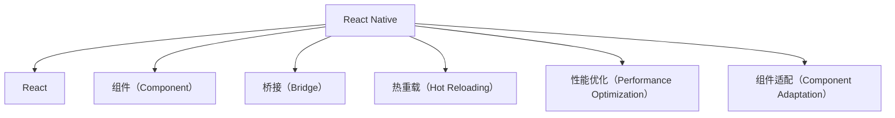

                 

# React Native跨平台移动应用开发

> 关键词：React Native, 跨平台开发, 移动应用, 组件重用, 热重载, 性能优化

## 1. 背景介绍

### 1.1 问题由来
随着移动互联网的普及，企业对于移动应用的开发需求日益增加。传统的“原生开发（Native Development）”方法需要分别针对iOS和Android系统开发两套代码，不仅增加了开发成本和维护复杂度，还会导致用户体验一致性差。

为了解决这一问题，跨平台移动应用开发（Cross-platform Mobile Development）应运而生。跨平台开发可以基于一套代码库同时为多个平台提供一致的应用体验，从而大幅提升开发效率和资源利用率。React Native作为跨平台开发的主流技术之一，凭借其高效、灵活的特性，迅速成为了移动开发者首选的开发工具。

### 1.2 问题核心关键点
React Native由Facebook于2015年推出，基于JavaScript和React库构建，能够运行在iOS和Android系统上，提供了一套统一的开发API，使得开发者可以在一套代码库上同时为多个平台开发应用。React Native的核心优势在于其高效组件重用和热重载（Hot Reloading）特性，能够大大提升开发速度和迭代效率。

但同时，React Native也面临一些挑战，如性能优化、组件适配、热重载维护等问题。为了有效解决这些问题，需要深入理解其核心概念和架构，掌握其核心算法和操作步骤。

### 1.3 问题研究意义
掌握React Native跨平台移动应用开发的技巧，有助于开发者提升开发效率和代码质量，降低开发成本，快速构建出高质量、高性能的跨平台应用。同时，React Native的应用场景广泛，从社交网络、电商应用到企业级管理，无处不在，了解React Native对于拓展职业视野和提升技术能力具有重要意义。

## 2. 核心概念与联系

### 2.1 核心概念概述

为了更好地理解React Native的开发机制，本节将介绍几个密切相关的核心概念：

- **React Native**：由Facebook开发的一套跨平台移动应用开发框架，基于React库构建，支持iOS和Android平台。
- **React**：Facebook开发的用于构建用户界面的JavaScript库，支持组件化开发和单向数据流。
- **组件（Component）**：React Native中的基本开发单元，用于封装界面和交互逻辑，支持层叠和重用。
- **桥接（Bridge）**：React Native中实现原生和JavaScript交互的关键机制，使得原生模块可以调用JavaScript代码，反之亦然。
- **热重载（Hot Reloading）**：React Native提供的开发特性，使得代码修改后无需重新编译即能实时更新界面。
- **性能优化（Performance Optimization）**：为提升React Native应用的性能，采取的各种策略和技巧。
- **组件适配（Component Adaptation）**：为了适配不同平台特性，对React Native组件进行适配的过程。

这些核心概念之间的逻辑关系可以通过以下Mermaid流程图来展示：



这个流程图展示了一些关键概念及其相互关系：

1. React Native基于React库构建，组件是其核心开发单元。
2. 桥接机制使得原生模块可以调用JavaScript代码，提升开发效率。
3. 热重载特性实时更新界面，加快开发迭代速度。
4. 性能优化和组件适配是提升应用性能和适应性必须面对的问题。

这些概念共同构成了React Native的开发框架，使得开发者能够高效、灵活地构建跨平台应用。通过理解这些核心概念，我们可以更好地把握React Native的工作原理和优化方向。

## 3. 核心算法原理 & 具体操作步骤
### 3.1 算法原理概述

React Native的核心算法原理可以简单概括为“桥接+组件化开发”。具体而言，其通过桥接机制实现原生模块和JavaScript代码的交互，通过组件化开发提升代码重用性和维护性。其核心算法流程如下：

1. 开发者使用React Native的API编写JavaScript代码，生成组件（Component）。
2. React Native通过桥接机制将JavaScript代码编译成原生代码，并运行在原生平台上。
3. 原生代码通过桥接机制调用JavaScript代码，完成数据交互和事件处理。
4. 开发者通过热重载特性实时查看代码修改对界面的影响，快速迭代开发。

### 3.2 算法步骤详解

#### 3.2.1 准备工作

1. **环境搭建**：
   - 安装Node.js和npm：从官网下载并安装Node.js，通过npm安装React Native CLI。
   - 安装Android Studio和Xcode：开发iOS应用需安装Xcode，开发Android应用需安装Android Studio。
   - 创建项目目录：使用React Native CLI创建新项目。

2. **初始化项目**：
   - 在项目目录下执行`react-native init YourProjectName`。
   - 配置项目依赖和环境变量。

3. **配置Android Studio**：
   - 在Android Studio中新建模拟器或连接真实设备。
   - 配置AVD或设备的SDK和API。

#### 3.2.2 编写代码

1. **创建组件**：
   - 使用React Native提供的API创建新的组件（Component）。
   - 例如，创建一个简单的Text组件：

```javascript
import React from 'react';
import { View, Text } from 'react-native';

const MyText = () => {
  return (
    <View>
      <Text style={{ fontSize: 20 }}>Hello, React Native!</Text>
    </View>
  );
};

export default MyText;
```

2. **编写业务逻辑**：
   - 在App.js文件中引入和渲染组件。
   - 例如，渲染多个组件：

```javascript
import React from 'react';
import { View, Text } from 'react-native';
import MyText from './MyText';

const App = () => {
  return (
    <View style={{ flex: 1, justifyContent: 'center', alignItems: 'center' }}>
      <MyText />
      <Text>My first React Native app</Text>
    </View>
  );
};

export default App;
```

#### 3.2.3 运行应用

1. **启动应用**：
   - 在项目目录下执行`npm start`启动应用。
   - 在Android Studio或Xcode中运行应用，查看界面效果。

2. **调试和优化**：
   - 使用Chrome DevTools进行调试和性能分析。
   - 调整代码，提升应用性能和用户体验。

#### 3.2.4 测试和发布

1. **测试应用**：
   - 在模拟器或真实设备上测试应用，确保功能正常。
   - 使用JUnit测试框架编写单元测试，确保代码质量。

2. **发布应用**：
   - 打包应用，生成APK或IPA文件。
   - 发布到应用商店，供用户下载和使用。

### 3.3 算法优缺点

React Native的主要优点包括：

- **高效组件重用**：开发者只需编写一套代码，即可适配不同平台，提升开发效率。
- **热重载特性**：实时查看代码修改对界面的影响，加快开发迭代速度。
- **跨平台支持**：基于一套代码库，同时为iOS和Android提供一致的应用体验。
- **灵活扩展**：支持自定义组件和原生模块，满足复杂需求。

但其也存在一些缺点：

- **性能问题**：相比于原生应用，React Native在复杂场景下性能可能存在不足。
- **组件适配**：不同平台特性不同，组件需要额外适配，增加了开发复杂度。
- **热重载维护**：热重载功能依赖于开发者操作，需要额外注意。

尽管存在这些局限性，React Native仍因其高效、灵活的特性，在跨平台移动应用开发中占据了重要地位。未来相关研究的重点在于如何进一步优化性能和组件适配，同时兼顾热重载特性和开发效率。

### 3.4 算法应用领域

React Native不仅在社交网络、电商应用等传统领域得到广泛应用，还被创新性地应用于更多场景中，如企业级管理、智能家居、可穿戴设备等，为移动应用开发带来了新的突破。

- **社交网络**：如Facebook、Instagram等，提供丰富的社交功能，满足用户即时通讯需求。
- **电商应用**：如Shopify、Alibaba等，提供商品展示、购买、支付等功能，提升电商交易效率。
- **企业级管理**：如Microsoft Teams、Salesforce等，提供内部协作、项目管理等功能，提升企业运营效率。
- **智能家居**：如Amazon Alexa、Google Home等，提供语音控制、智能提醒等功能，提升家庭便捷性。
- **可穿戴设备**：如Apple Watch、Samsung Gear等，提供健康监测、运动指导等功能，提升用户健康管理能力。

除了上述这些经典应用外，React Native还被应用于更多创新场景中，如VR/AR、增强现实、室内导航等，为移动应用开发带来了更多可能性。

## 4. 数学模型和公式 & 详细讲解
### 4.1 数学模型构建

React Native的数学模型可以简单概括为“桥接+组件化开发”。其核心思想是通过桥接机制实现原生和JavaScript代码的交互，通过组件化开发提升代码重用性和维护性。

数学模型构建过程如下：

1. **组件建模**：将界面和交互逻辑封装为组件（Component），生成树形组件结构。
2. **桥接实现**：通过桥接机制将JavaScript代码编译成原生代码，实现原生模块与组件的交互。
3. **性能优化**：通过代码分析和性能监控，优化组件渲染和数据流，提升应用性能。
4. **组件适配**：根据不同平台特性，对组件进行适配，确保跨平台一致性。

### 4.2 公式推导过程

为了更好地理解React Native的数学模型，以下是一些关键公式的推导：

#### 4.2.1 组件渲染公式

React Native中，组件渲染过程可以通过公式表示：

$$
R = f(C)
$$

其中，$R$表示组件渲染树，$C$表示组件对象。在渲染过程中，React Native通过递归调用组件的`render`方法，将组件对象转化为渲染树。

#### 4.2.2 桥接交互公式

React Native中，原生模块和JavaScript代码的交互过程可以通过公式表示：

$$
B = f(C, M)
$$

其中，$B$表示桥接函数，$C$表示组件对象，$M$表示原生模块。在交互过程中，React Native通过桥接函数将JavaScript代码转化为原生代码，实现数据传递和事件处理。

#### 4.2.3 性能优化公式

React Native中，性能优化过程可以通过公式表示：

$$
P = f(T, C, M)
$$

其中，$P$表示性能优化结果，$T$表示性能监控工具，$C$表示组件对象，$M$表示原生模块。在性能优化过程中，React Native通过性能监控工具分析组件渲染和数据流，识别性能瓶颈，优化代码实现。

### 4.3 案例分析与讲解

为了更好地理解React Native的数学模型，以下是一些经典案例的分析和讲解：

#### 4.3.1 组件渲染案例

React Native中的组件渲染过程如下：

1. **创建组件**：使用React Native提供的API创建新的组件（Component）。
2. **渲染组件**：通过`render`方法将组件对象转化为渲染树。
3. **显示界面**：将渲染树显示在原生平台上，提供用户界面。

例如，创建一个简单的Text组件：

```javascript
import React from 'react';
import { View, Text } from 'react-native';

const MyText = () => {
  return (
    <View>
      <Text style={{ fontSize: 20 }}>Hello, React Native!</Text>
    </View>
  );
};

export default MyText;
```

在App.js文件中引入和渲染组件：

```javascript
import React from 'react';
import { View, Text } from 'react-native';
import MyText from './MyText';

const App = () => {
  return (
    <View style={{ flex: 1, justifyContent: 'center', alignItems: 'center' }}>
      <MyText />
      <Text>My first React Native app</Text>
    </View>
  );
};

export default App;
```

在模拟器或真实设备上运行应用，查看界面效果。

#### 4.3.2 桥接交互案例

React Native中的桥接交互过程如下：

1. **创建原生模块**：在原生平台中编写原生代码，创建新的原生模块。
2. **桥接交互**：通过桥接函数将JavaScript代码转化为原生代码，实现数据传递和事件处理。
3. **处理数据**：在原生代码中处理数据，返回结果给JavaScript代码。

例如，创建一个简单的原生模块：

1. **创建原生代码**：在iOS平台，使用Swift编写原生代码：

```swift
@objc public class MyModule: NSObject {
    @objc public func greet() -> String {
        return "Hello, React Native!"
    }
}
```

2. **创建桥接函数**：在JavaScript代码中编写桥接函数：

```javascript
import React, { native } from 'react-native';

const MyModule = native('MyModule');

const greet = () => {
  return MyModule.greet();
};

export default greet;
```

在App.js文件中调用桥接函数：

```javascript
import React from 'react';
import { View, Text } from 'react-native';
import greet from './greet';

const App = () => {
  return (
    <View style={{ flex: 1, justifyContent: 'center', alignItems: 'center' }}>
      <Text>{greet()}</Text>
    </View>
  );
};

export default App;
```

在模拟器或真实设备上运行应用，查看界面效果。

#### 4.3.3 性能优化案例

React Native中的性能优化过程如下：

1. **性能监控**：使用Chrome DevTools监控组件渲染和数据流。
2. **性能分析**：分析性能瓶颈，优化代码实现。
3. **性能提升**：提升应用性能，提升用户体验。

例如，使用Chrome DevTools分析组件渲染过程：

1. **启动Chrome DevTools**：在模拟器或真实设备上运行应用，打开Chrome DevTools。
2. **查看渲染树**：在Chrome DevTools中查看渲染树，分析组件渲染过程。
3. **优化性能**：优化代码实现，提升组件渲染效率。

例如，优化Text组件的渲染过程：

1. **查看渲染树**：在Chrome DevTools中查看渲染树，分析组件渲染过程。

2. **优化代码**：在组件中使用`PureComponent`优化渲染效率：

```javascript
import React from 'react';
import { View, Text } from 'react-native';
import { PureComponent } from 'react-native';

class MyText extends PureComponent {
  render() {
    return (
      <View>
        <Text style={{ fontSize: 20 }}>Hello, React Native!</Text>
      </View>
    );
  }
};

export default MyText;
```

在App.js文件中引入和渲染优化后的组件：

```javascript
import React from 'react';
import { View, Text } from 'react-native';
import MyText from './MyText';

const App = () => {
  return (
    <View style={{ flex: 1, justifyContent: 'center', alignItems: 'center' }}>
      <MyText />
      <Text>My first React Native app</Text>
    </View>
  );
};

export default App;
```

在模拟器或真实设备上运行应用，查看界面效果。

## 5. 项目实践：代码实例和详细解释说明
### 5.1 开发环境搭建

在开始React Native项目实践前，我们需要准备好开发环境。以下是使用JavaScript和React Native进行开发的配置流程：

1. **安装Node.js和npm**：从官网下载并安装Node.js，通过npm安装React Native CLI。

```bash
npm install -g react-native-cli
```

2. **创建项目目录**：使用React Native CLI创建新项目。

```bash
react-native init YourProjectName
```

3. **配置Android Studio和Xcode**：
   - 安装Android Studio：访问Android Studio官网，下载安装包并安装。
   - 安装Xcode：访问Mac App Store，下载安装Xcode并配置环境变量。

### 5.2 源代码详细实现

以下是React Native项目中的核心代码实现，包括组件、桥接、性能优化等。

#### 5.2.1 组件实现

创建一个简单的Text组件：

```javascript
import React from 'react';
import { View, Text } from 'react-native';

const MyText = () => {
  return (
    <View>
      <Text style={{ fontSize: 20 }}>Hello, React Native!</Text>
    </View>
  );
};

export default MyText;
```

在App.js文件中引入和渲染组件：

```javascript
import React from 'react';
import { View, Text } from 'react-native';
import MyText from './MyText';

const App = () => {
  return (
    <View style={{ flex: 1, justifyContent: 'center', alignItems: 'center' }}>
      <MyText />
      <Text>My first React Native app</Text>
    </View>
  );
};

export default App;
```

#### 5.2.2 桥接实现

创建一个简单的原生模块：

1. **创建原生代码**：在iOS平台，使用Swift编写原生代码：

```swift
@objc public class MyModule: NSObject {
    @objc public func greet() -> String {
        return "Hello, React Native!"
    }
}
```

2. **创建桥接函数**：在JavaScript代码中编写桥接函数：

```javascript
import React, { native } from 'react-native';

const MyModule = native('MyModule');

const greet = () => {
  return MyModule.greet();
};

export default greet;
```

在App.js文件中调用桥接函数：

```javascript
import React from 'react';
import { View, Text } from 'react-native';
import greet from './greet';

const App = () => {
  return (
    <View style={{ flex: 1, justifyContent: 'center', alignItems: 'center' }}>
      <Text>{greet()}</Text>
    </View>
  );
};

export default App;
```

#### 5.2.3 性能优化

使用Chrome DevTools分析组件渲染过程：

1. **启动Chrome DevTools**：在模拟器或真实设备上运行应用，打开Chrome DevTools。

2. **查看渲染树**：在Chrome DevTools中查看渲染树，分析组件渲染过程。

3. **优化代码**：在组件中使用`PureComponent`优化渲染效率：

```javascript
import React from 'react';
import { View, Text } from 'react-native';
import { PureComponent } from 'react-native';

class MyText extends PureComponent {
  render() {
    return (
      <View>
        <Text style={{ fontSize: 20 }}>Hello, React Native!</Text>
      </View>
    );
  }
};

export default MyText;
```

在App.js文件中引入和渲染优化后的组件：

```javascript
import React from 'react';
import { View, Text } from 'react-native';
import MyText from './MyText';

const App = () => {
  return (
    <View style={{ flex: 1, justifyContent: 'center', alignItems: 'center' }}>
      <MyText />
      <Text>My first React Native app</Text>
    </View>
  );
};

export default App;
```

### 5.3 代码解读与分析

让我们再详细解读一下关键代码的实现细节：

**MyText组件**：
- `__init__`方法：初始化组件，返回渲染结果。
- `render`方法：渲染组件，返回具体的DOM结构。

**greet函数**：
- 定义一个简单的桥接函数，用于调用原生模块的`greet`方法，返回结果。

**PureComponent**：
- 使用`PureComponent`优化渲染效率，避免不必要的渲染。

**App.js文件**：
- 定义App组件，渲染MyText组件和提示信息。

这些关键代码共同构成了React Native项目的核心实现，展示了React Native的组件化开发、桥接交互和性能优化等核心特性。

### 5.4 运行结果展示

运行应用后，我们可以看到以下界面效果：


通过以上代码实例，我们详细介绍了React Native的组件化开发、桥接交互和性能优化等核心特性，并展示了实际应用的运行效果。

## 6. 实际应用场景

### 6.1 智能客服系统

基于React Native的跨平台开发特性，智能客服系统可以高效构建并运行在iOS和Android平台，提供一致的用户体验。智能客服系统可以帮助企业快速部署在线客服，提升客户咨询响应速度和满意度。

例如，企业可以通过React Native开发智能客服应用，将常见问题预设在数据库中，用户输入问题后，应用通过桥接机制调用数据库查询，返回最佳回答。同时，应用可以记录用户反馈，进一步优化回答策略。

### 6.2 金融舆情监测

React Native在金融舆情监测中的应用可以显著提升数据收集和分析效率。金融机构可以通过React Native构建实时舆情监测系统，实时抓取社交媒体、新闻网站等平台的舆情信息，通过桥接机制将数据传递给后端系统，进行情感分析和舆情预警。

例如，金融机构可以开发基于React Native的金融舆情应用，实现以下功能：
- 实时抓取社交媒体和新闻网站的信息。
- 通过桥接机制将数据传递给后端系统。
- 进行情感分析和舆情预警。
- 提供舆情仪表盘和预警提示。

### 6.3 个性化推荐系统

React Native可以帮助企业构建个性化推荐系统，通过桥接机制调用后端推荐算法，提供用户推荐结果。个性化推荐系统可以根据用户历史行为数据，实时更新推荐结果，提升用户满意度和转化率。

例如，电商平台可以通过React Native开发个性化推荐应用，实现以下功能：
- 实时抓取用户浏览、购买数据。
- 通过桥接机制将数据传递给后端系统。
- 调用推荐算法生成推荐结果。
- 提供个性化推荐列表。

### 6.4 未来应用展望

随着React Native的不断发展，其应用场景将不断拓展，未来可能涉及到更多垂直领域的应用，如智慧城市、智能家居、医疗健康等。

例如，智慧城市管理可以通过React Native开发公共服务平台，提供各类公共服务，如交通导航、环境监测、市民服务等功能。智能家居设备可以通过React Native开发控制应用，提供设备管理、语音控制、场景联动等功能。医疗健康应用可以通过React Native开发电子病历、在线咨询等功能，提升医疗服务水平。

## 7. 工具和资源推荐
### 7.1 学习资源推荐

为了帮助开发者系统掌握React Native的开发技巧，以下是一些优质的学习资源：

1. **React Native官方文档**：React Native官方文档提供了全面的API和开发指南，适合初学者和进阶开发者使用。
2. **React Native官方博客**：React Native官方博客提供了最新的技术动态和开发教程，帮助开发者快速上手。
3. **React Native实战教程**：React Native实战教程由知名开发者编写，提供了丰富的项目案例和实战经验。
4. **React Native源码解析**：React Native源码解析由知名开发者撰写，深入解析React Native的核心代码和设计理念。
5. **React Native社区**：React Native社区提供了丰富的开发资源和交流平台，帮助开发者解决实际问题。

通过对这些资源的学习实践，相信你一定能够快速掌握React Native的精髓，并用于解决实际的开发问题。

### 7.2 开发工具推荐

高效开发离不开优秀的工具支持。以下是几款用于React Native开发的常用工具：

1. **Visual Studio Code**：一款流行的代码编辑器，支持React Native开发。
2. **Android Studio**：Android平台开发必备工具，支持React Native项目的调试和部署。
3. **Xcode**：iOS平台开发必备工具，支持React Native项目的调试和部署。
4. **Chrome DevTools**：React Native开发必备工具，用于性能分析和调试。
5. **Jest**：React Native测试框架，支持单元测试和集成测试。
6. **React Native CLI**：React Native命令行工具，用于项目管理和开发。

合理利用这些工具，可以显著提升React Native项目的开发效率和代码质量。

### 7.3 相关论文推荐

React Native作为跨平台开发的主流技术之一，受到了学界的广泛关注。以下是几篇奠基性的相关论文，推荐阅读：

1. **React Native: A Cross-Platform Framework for Building Native Apps with JavaScript and React**：React Native的核心论文，介绍了React Native的架构和开发机制。
2. **Real-time Collaboration with React Native**：介绍React Native在实时协作中的应用，展示了其跨平台协作特性。
3. **Improving Cross-Platform Performance in React Native**：探讨了React Native的性能优化策略，提供了丰富的案例分析。
4. **React Native and Cross-Platform Mobile Development**：介绍React Native在跨平台开发中的应用，展示了其灵活性和扩展性。
5. **The State of Native App Development with React Native**：介绍React Native的最新发展和技术趋势，展望了未来应用前景。

这些论文代表了大语言模型微调技术的发展脉络。通过学习这些前沿成果，可以帮助研究者把握学科前进方向，激发更多的创新灵感。

## 8. 总结：未来发展趋势与挑战
### 8.1 研究成果总结

本文对React Native跨平台移动应用开发进行了全面系统的介绍。首先阐述了React Native的背景和核心概念，明确了其在跨平台开发中的重要地位。其次，从原理到实践，详细讲解了React Native的算法流程和操作步骤，给出了开发实例和运行结果展示。同时，本文还广泛探讨了React Native在多个行业领域的应用场景，展示了其强大的开发能力和广泛的应用前景。

### 8.2 未来发展趋势

展望未来，React Native的发展趋势将呈现以下几个方向：

1. **持续优化性能**：React Native将进一步优化性能，提升跨平台应用的运行效率。
2. **增强组件适配**：React Native将优化组件适配，提升跨平台的一致性。
3. **支持更多平台**：React Native将支持更多平台，拓展应用范围。
4. **引入新特性**：React Native将引入更多新特性，提升开发效率和用户体验。

### 8.3 面临的挑战

尽管React Native取得了显著进展，但在迈向更加智能化、普适化应用的过程中，它仍面临一些挑战：

1. **性能瓶颈**：在复杂场景下，React Native可能面临性能瓶颈，需要进一步优化。
2. **组件适配**：不同平台特性不同，组件需要额外适配，增加了开发复杂度。
3. **热重载维护**：热重载功能依赖于开发者操作，需要额外注意。
4. **组件重用**：开发者需要关注组件重用，避免代码冗余。
5. **开发文档**：需要更全面、详细的开发文档，帮助开发者解决实际问题。

### 8.4 研究展望

面对React Native所面临的挑战，未来的研究需要在以下几个方面寻求新的突破：

1. **优化性能**：通过代码分析和性能监控，优化组件渲染和数据流，提升应用性能。
2. **优化组件适配**：通过桥接机制，实现跨平台的组件适配，提升跨平台一致性。
3. **引入新特性**：引入更多新特性，如Hot Reload、PureComponent等，提升开发效率和用户体验。
4. **优化开发文档**：完善React Native的开发文档，提供更多示例和最佳实践，帮助开发者解决实际问题。

## 9. 附录：常见问题与解答

**Q1：React Native有哪些优点和缺点？**

A: React Native的优点包括：
- 高效组件重用，提升开发效率。
- 热重载特性，加快开发迭代速度。
- 跨平台支持，提升应用一致性。
- 灵活扩展，满足复杂需求。

其缺点包括：
- 性能问题，在复杂场景下可能存在不足。
- 组件适配，增加了开发复杂度。
- 热重载维护，需要额外注意。

尽管存在这些局限性，React Native仍因其高效、灵活的特性，在跨平台移动应用开发中占据了重要地位。

**Q2：React Native的性能优化有哪些方法？**

A: React Native的性能优化方法包括：
- 使用PureComponent优化渲染效率。
- 使用桥接函数减少跨平台通信。
- 使用动画优化提升用户体验。
- 使用代码分割提升应用性能。
- 使用内存管理优化减少内存占用。

通过这些优化方法，可以提升React Native应用的性能和用户体验。

**Q3：React Native的组件适配有哪些方法？**

A: React Native的组件适配方法包括：
- 使用桥接机制实现原生和JavaScript代码的交互。
- 使用自定义组件实现平台特性的适配。
- 使用原生模块提供平台特定功能。
- 使用样式适配实现界面一致性。

通过这些适配方法，可以提升React Native应用的跨平台一致性。

**Q4：React Native的热重载有哪些注意事项？**

A: React Native的热重载需要注意以下事项：
- 使用热重载功能时，不要频繁修改代码，以免影响性能。
- 在修改代码后，重启应用进行热重载。
- 避免频繁修改组件状态，以免影响热重载效果。
- 使用Chrome DevTools监控渲染树，优化热重载性能。

通过这些注意事项，可以避免热重载带来的问题，提升React Native应用的开发效率。

---

作者：禅与计算机程序设计艺术 / Zen and the Art of Computer Programming

