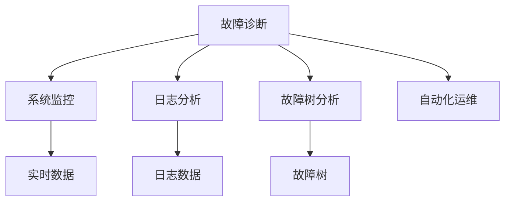

                 

# SRE故障诊断与问题定位

> 关键词：SRE, 故障诊断, 问题定位, 可靠性工程, 系统监控, 日志分析, 故障树分析, 自动化运维

## 1. 背景介绍

### 1.1 问题由来
随着数字化转型的加速，企业级系统的复杂性和规模不断增大，运维难度和成本也在持续上升。系统架构的复杂性使得故障发生和问题定位变得更加困难，导致用户服务中断、业务损失、用户体验下降等严重后果。

### 1.2 问题核心关键点
- **系统规模和复杂性增加**：大规模分布式系统中包含数以万计的微服务、节点、容器等组件，复杂多变的依赖关系使得问题追踪和定位变得困难。
- **跨服务依赖性**：现代系统往往是多个微服务组成的复合系统，单点故障可能导致全局服务中断，诊断跨服务依赖关系尤为重要。
- **数据海量、实时性高**：系统运行过程中产生海量日志、监控数据，实时分析和诊断故障成为一大难题。
- **自动化水平有待提升**：现有运维流程中自动化水平较低，往往需要人工介入，不仅效率低下，也易产生人为错误。

### 1.3 问题研究意义
通过系统化的方法对故障进行诊断和问题定位，不仅能够缩短故障恢复时间，提高业务连续性，还能避免类似问题的再次发生，提升系统的可靠性和安全性。因此，故障诊断和问题定位是可靠性工程的核心任务之一，对企业运营具有重要意义：

1. **提升系统可用性**：快速定位和解决问题，减少服务中断，保障业务连续性。
2. **降低运营成本**：自动化故障诊断和问题定位，减少人力投入，提升运维效率。
3. **增强用户体验**：及时修复故障，提高服务质量，提升用户满意度。
4. **优化运维流程**：总结故障经验，提升运维人员能力，优化运维流程。
5. **推动系统优化**：通过故障分析，识别系统瓶颈和缺陷，推动系统改进和升级。

## 2. 核心概念与联系

### 2.1 核心概念概述

为了更好地理解故障诊断和问题定位，首先需要介绍几个核心概念：

- **SRE (Site Reliability Engineering)**：系统可靠性工程，通过工程化手段提高系统可用性、可扩展性和可维护性。
- **故障诊断**：通过系统监控、日志分析等手段，快速识别故障发生的时间和原因，并定位具体故障点。
- **问题定位**：在故障诊断的基础上，进一步分析故障根本原因，并提出解决方案。
- **系统监控**：实时收集系统运行数据，及时发现系统异常和性能问题。
- **日志分析**：从系统日志中提取故障信息，分析故障发生的具体原因和过程。
- **故障树分析**：通过构建故障树模型，系统化地分析故障原因，识别系统中的薄弱环节。
- **自动化运维**：通过自动化工具和脚本，减少人工干预，提高故障诊断和问题定位的效率。

这些概念之间的联系可以通过以下Mermaid流程图来展示：



这个流程图展示了一系列故障诊断和问题定位的关键环节及其相互关系：

1. **系统监控**：提供实时的系统运行数据，是故障诊断的基础。
2. **日志分析**：从系统日志中提取故障信息，辅助故障诊断。
3. **故障树分析**：系统化地分析故障原因，识别系统中的薄弱环节。
4. **故障诊断**：通过系统监控和日志分析，快速识别故障发生的时间和原因。
5. **问题定位**：在故障诊断的基础上，进一步分析故障根本原因，并提出解决方案。
6. **自动化运维**：通过自动化工具和脚本，减少人工干预，提高故障诊断和问题定位的效率。

## 3. 核心算法原理 & 具体操作步骤
### 3.1 算法原理概述

故障诊断和问题定位的算法原理主要基于系统监控、日志分析、故障树分析等技术。其核心思想是：通过实时监控系统运行数据和日志，构建系统模型，并利用统计分析和故障树等方法，系统化地识别和分析故障原因，提出解决方案。

具体而言，故障诊断和问题定位通常包括以下几个关键步骤：

1. **数据收集与预处理**：收集系统运行数据和日志，并进行清洗、预处理，转换为可用于分析的格式。
2. **异常检测与预警**：利用异常检测算法，及时发现系统异常，并触发告警机制。
3. **故障诊断**：基于异常检测结果，分析故障发生的具体原因，定位故障点。
4. **问题定位**：进一步分析故障根本原因，并提出解决方案。
5. **故障分析和报告**：总结故障经验，完善系统监控和运维流程。

### 3.2 算法步骤详解

以下详细介绍故障诊断和问题定位的具体操作步骤：

**Step 1: 数据收集与预处理**
- 收集系统运行数据和日志，如CPU使用率、内存占用、网络流量、日志文件等。
- 使用日志解析工具，如ELK Stack (Elasticsearch、Logstash、Kibana)，将日志数据转换为结构化格式。
- 对数据进行清洗、去重、归一化等预处理，以去除噪声和冗余信息，提高后续分析的准确性。

**Step 2: 异常检测与预警**
- 使用异常检测算法，如统计学方法、机器学习算法等，识别数据中的异常值和异常模式。
- 设置告警阈值，根据异常检测结果触发告警，及时通知运维人员。
- 使用时间序列分析，识别数据中的异常变化趋势，预测潜在故障。

**Step 3: 故障诊断**
- 基于异常检测结果，分析数据中的故障模式，识别故障发生的具体时间、地点和原因。
- 构建故障树模型，系统化地分析故障原因，识别系统中的薄弱环节。
- 使用日志分析工具，如Grep、awk、grep等，提取日志中的关键信息，辅助故障诊断。

**Step 4: 问题定位**
- 根据故障诊断结果，进一步分析故障根本原因，如系统设计缺陷、代码错误等。
- 结合故障树分析结果，提出针对性的解决方案，如修改代码、调整配置等。
- 使用自动化运维工具，如Ansible、Puppet、Chef等，自动执行修复操作。

**Step 5: 故障分析和报告**
- 总结故障经验，完善系统监控和运维流程。
- 定期回溯和复盘，持续改进故障诊断和问题定位能力。
- 使用可视化工具，如Tableau、PowerBI等，展示故障分析报告，便于团队共享和决策。

### 3.3 算法优缺点

故障诊断和问题定位的算法具有以下优点：

1. **实时性高**：通过实时监控和异常检测，能够快速识别和定位故障，减少故障影响时间。
2. **系统化分析**：利用故障树等系统化分析方法，全面识别系统中的薄弱环节，提升系统可靠性。
3. **自动化程度高**：使用自动化运维工具，减少人工干预，提高运维效率和准确性。
4. **可扩展性强**：基于模块化和组件化的设计，可以灵活扩展和定制故障诊断和问题定位系统。

同时，该算法也存在以下局限性：

1. **数据质量要求高**：数据收集和预处理的准确性和完整性直接影响故障诊断和问题定位的效果。
2. **复杂性高**：系统监控和故障树分析需要较高的技术门槛，运维人员需要具备较强的数据分析能力。
3. **资源消耗大**：大规模数据收集和分析需要大量的计算资源和时间，对系统性能有一定影响。
4. **误报率高**：异常检测算法可能产生误报，需要人工确认和复核。
5. **模型训练难度大**：异常检测和故障树模型需要大量的数据和复杂的算法，训练过程较为困难。

尽管存在这些局限性，但就目前而言，故障诊断和问题定位算法仍是企业级系统运维的重要手段。未来相关研究的重点在于如何进一步提高数据质量、降低误报率、提升自动化程度，同时兼顾可扩展性和资源消耗。

### 3.4 算法应用领域

故障诊断和问题定位的算法在多个领域得到了广泛应用，例如：

- **互联网应用**：监控网站、API、数据库等互联网应用的运行状态，及时发现和处理故障。
- **数据中心**：监控服务器、网络设备、存储设备等数据中心硬件的运行状态，确保数据中心稳定运行。
- **物联网设备**：监控各种物联网设备的运行状态，及时发现和处理设备故障。
- **金融系统**：监控交易系统、清算系统等金融系统的运行状态，保障金融交易的连续性和安全性。
- **智能制造**：监控生产线、机器人等智能制造设备的运行状态，确保生产流程的稳定性和效率。

除了上述这些常见领域外，故障诊断和问题定位的算法还在越来越多的行业和领域中得到应用，为系统可靠性和安全性的提升提供了有力保障。

## 4. 数学模型和公式 & 详细讲解 & 举例说明

### 4.1 数学模型构建

故障诊断和问题定位的数学模型通常包括两部分：异常检测模型和故障树模型。

**异常检测模型**：利用统计学方法或机器学习算法，对系统运行数据进行异常检测，识别异常值和异常模式。常见的异常检测方法包括：

- 统计学方法：如均值漂移、箱线图等，通过统计学特征判断数据是否异常。
- 机器学习算法：如孤立森林、One-Class SVM等，通过学习数据的分布，识别异常值。

**故障树模型**：通过构建故障树，系统化地分析故障原因，识别系统中的薄弱环节。故障树模型的构建通常包括以下几个步骤：

1. **定义故障树**：定义系统的故障树结构，包括根节点、中间节点和叶子节点。
2. **收集数据**：收集系统的运行数据和日志数据，作为故障树模型的输入。
3. **构建故障树**：使用故障树构建算法，如蒙特卡罗模拟、最小割算法等，构建故障树模型。
4. **分析故障树**：对故障树进行分析和优化，识别系统中的薄弱环节。

### 4.2 公式推导过程

以下以异常检测和故障树分析为例，详细介绍数学模型的推导过程。

**异常检测公式推导**：

假设系统运行数据为 $x_1, x_2, ..., x_n$，其中 $x_i$ 表示第 $i$ 个数据点。使用统计学方法，如均值漂移方法，通过计算数据的均值和标准差，识别异常值。假设数据的均值为 $\mu$，标准差为 $\sigma$，异常检测公式为：

$$
\text{Score}(x_i) = \frac{x_i - \mu}{\sigma}
$$

其中 $\text{Score}(x_i)$ 表示第 $i$ 个数据点的异常得分，值越大表示越异常。当 $\text{Score}(x_i) > \text{Threshold}$ 时，认为该数据点为异常。

**故障树构建公式推导**：

假设系统故障树模型由根节点 $R$、中间节点 $I_1, I_2, ..., I_k$ 和叶子节点 $L_1, L_2, ..., L_m$ 组成。假设 $I_i$ 表示第 $i$ 个中间节点，其故障概率为 $P_{I_i}$，$L_j$ 表示第 $j$ 个叶子节点，其故障概率为 $P_{L_j}$。故障树模型的构建公式为：

$$
P_R = \sum_{i=1}^{k} P_{I_i} * P_{L_j}
$$

其中 $P_R$ 表示根节点 $R$ 的故障概率，$P_{I_i}$ 表示中间节点 $I_i$ 的故障概率，$P_{L_j}$ 表示叶子节点 $L_j$ 的故障概率。故障树模型通过递归计算，可以系统化地分析故障原因，识别系统中的薄弱环节。

### 4.3 案例分析与讲解

以一个简单的故障树分析为例，说明如何构建和分析故障树模型。

假设系统由三个组件 $A$、$B$、$C$ 组成，它们的故障概率分别为 $P_A = 0.1$、$P_B = 0.2$、$P_C = 0.3$。组件 $A$ 和 $B$ 互相依赖，当 $A$ 或 $B$ 故障时，整个系统都会故障。系统故障树模型如下所示：

```
R
|
|---A
|  |
|  \---B
|     |
|     \---C
```

根据故障树模型，可以计算系统的故障概率 $P_R$：

$$
P_R = P_A * P_C + P_B * P_C = 0.1 * 0.3 + 0.2 * 0.3 = 0.09
$$

因此，系统的故障概率为 $0.09$。

如果进一步优化故障树，增加中间节点 $I$，表示 $A$ 和 $B$ 的故障率相同，可以降低系统的故障概率：

```
R
|
|---I
|  |
|  \---A
|     |
|     \---B
|     |
|     \---C
```

根据新的故障树模型，可以计算系统的故障概率 $P_R$：

$$
P_R = P_I * P_C = 0.5 * 0.3 = 0.15
$$

因此，系统的故障概率为 $0.15$。

通过故障树分析，可以识别出系统的薄弱环节，进一步优化系统设计，降低故障率。

## 5. 项目实践：代码实例和详细解释说明

### 5.1 开发环境搭建

在进行故障诊断和问题定位的实践前，我们需要准备好开发环境。以下是使用Python进行基于ELK Stack的日志分析和基于Ansible的自动化运维环境配置流程：

1. 安装Anaconda：从官网下载并安装Anaconda，用于创建独立的Python环境。

2. 创建并激活虚拟环境：
```bash
conda create -n elk-stack python=3.8 
conda activate elk-stack
```

3. 安装ELK Stack相关组件：
```bash
conda install elasticsearch
conda install kibana
```

4. 配置Elasticsearch和Kibana：
```bash
sudo apt-get install elasticsearch
sudo apt-get install kibana
```

5. 安装Ansible：
```bash
pip install ansible
```

6. 安装其他依赖工具：
```bash
pip install boto3 pyspark jupyter notebook ipython
```

完成上述步骤后，即可在`elk-stack`环境中开始故障诊断和问题定位的实践。

### 5.2 源代码详细实现

以下是一个基于ELK Stack的日志分析和基于Ansible的自动化运维的示例代码：

**ELK Stack日志分析**：

首先，定义日志分析的查询语句：

```python
from elasticsearch import Elasticsearch

es = Elasticsearch(['localhost:9200'])

query = {
    "query": {
        "bool": {
            "must": [
                {"match": {"message": "error"}},
                {"range": {"@timestamp": {"gte": "now-1h"}}]
            ]
        }
    }
}

res = es.search(index="logs", body=query)
print(res)
```

然后，使用Kibana可视化查询结果：

```bash
kibana
```

在Kibana中，可以定义仪表板和可视化图表，实时展示日志数据的异常情况。

**Ansible自动化运维**：

定义一个Ansible任务，自动修复服务器异常：

```yaml
- name: Check server status
  hosts: server1, server2
  vars:
    server_status: up

- name: Restart server if status is down
  hosts: server1, server2
  vars:
    server_status: down
  become: yes
  tasks:
    - name: Restart server
      service:
        name: nginx
        state: restarted
```

在Ansible中，可以通过定义任务来自动化地监控服务器状态，并在服务器状态异常时自动执行修复操作。

### 5.3 代码解读与分析

让我们再详细解读一下关键代码的实现细节：

**ELK Stack日志分析**：
- 使用Python的Elasticsearch库连接Elasticsearch服务，构建查询语句。
- 查询语句使用布尔查询和范围查询，筛选出过去一小时内包含错误信息的日志记录。
- 通过Elasticsearch的REST API将查询结果返回给Python代码，进行进一步处理。

**Ansible自动化运维**：
- 定义Ansible任务，使用变量指定服务器的状态。
- 在任务中定义检查服务器状态和重启服务器的步骤。
- 使用`become: yes`选项，表示需要在远程服务器上执行重启操作。
- 定义任务的逻辑流程，自动化地检查和修复服务器异常。

## 6. 实际应用场景
### 6.1 互联网应用故障诊断

互联网应用中的故障诊断通常涉及网站、API、数据库等组件的监控。通过实时监控这些组件的运行状态，及时发现和处理故障。

以监控一个电子商务网站的为例：

- 收集网站服务器、数据库、缓存等组件的运行数据。
- 使用ELK Stack构建实时监控仪表板，实时展示各组件的运行状态和性能指标。
- 设置告警阈值，当某个组件状态异常时，自动触发告警。
- 通过日志分析工具，如Grep、awk、grep等，从系统日志中提取异常信息，辅助故障诊断。

**实际应用效果**：
- 快速定位故障点，缩短故障恢复时间。
- 实时监控系统性能，及时发现潜在问题。
- 减少人工干预，提升运维效率和准确性。

### 6.2 数据中心故障诊断

数据中心中的故障诊断通常涉及服务器、网络设备、存储设备等硬件的监控。通过实时监控这些硬件的运行状态，确保数据中心的稳定运行。

以监控一个大型数据中心为例：

- 收集服务器、网络设备、存储设备等硬件的运行数据。
- 使用ELK Stack构建实时监控仪表板，实时展示各硬件的运行状态和性能指标。
- 设置告警阈值，当某个硬件状态异常时，自动触发告警。
- 使用故障树分析工具，系统化地分析硬件故障原因，识别系统中的薄弱环节。

**实际应用效果**：
- 及时发现硬件故障，保障数据中心的稳定运行。
- 系统化分析硬件故障原因，提升系统可靠性。
- 减少人工干预，提升运维效率和准确性。

### 6.3 金融系统故障诊断

金融系统中的故障诊断通常涉及交易系统、清算系统等关键系统的监控。通过实时监控这些系统的运行状态，确保金融交易的连续性和安全性。

以监控一个交易系统为例：

- 收集交易系统、清算系统的运行数据和日志数据。
- 使用ELK Stack构建实时监控仪表板，实时展示各系统的运行状态和性能指标。
- 设置告警阈值，当某个系统状态异常时，自动触发告警。
- 使用故障树分析工具，系统化地分析系统故障原因，识别系统中的薄弱环节。

**实际应用效果**：
- 及时发现系统故障，保障金融交易的连续性和安全性。
- 系统化分析系统故障原因，提升系统可靠性。
- 减少人工干预，提升运维效率和准确性。

### 6.4 未来应用展望

随着技术的发展，故障诊断和问题定位的方法和工具也在不断演进。未来故障诊断和问题定位的趋势如下：

1. **实时性和自动化**：通过实时监控和自动化运维，提高故障诊断和问题定位的速度和效率。
2. **智能化**：引入机器学习和人工智能技术，提高异常检测和故障分析的准确性和智能化水平。
3. **跨领域融合**：结合网络安全、运维、安全等多个领域的技术，构建综合性故障诊断和问题定位平台。
4. **可视化**：通过可视化工具，直观展示故障诊断和问题定位的结果，便于团队共享和决策。
5. **云原生**：利用云原生技术，构建弹性、自愈的故障诊断和问题定位系统。

这些趋势将推动故障诊断和问题定位技术不断向前发展，为系统的稳定性和可靠性提供更加坚实的保障。

## 7. 工具和资源推荐
### 7.1 学习资源推荐

为了帮助开发者系统掌握故障诊断和问题定位的理论基础和实践技巧，这里推荐一些优质的学习资源：

1. **《SRE: Website Operations in Practice》**：Udi Dachman-Soled撰写的书籍，深入浅出地介绍了系统可靠性工程的核心概念和实践方法。

2. **《Reliable Systems: Designing Distributed Systems with Fault Tolerance》**：Goetz Muenzner撰写的书籍，系统化地介绍了故障诊断和问题定位的技术原理和实践案例。

3. **CS224R《Reliable Systems Design and Practice》课程**：斯坦福大学开设的可靠性工程课程，涵盖了系统设计、故障诊断、问题定位等多个方面的内容。

4. **《Elasticsearch Essentials》**：Nurul Hasan撰写的书籍，详细介绍了Elasticsearch的安装、配置、使用和优化方法。

5. **《Ansible: Automation with Ansible 2》**：Anna Trammell撰写的书籍，深入浅出地介绍了Ansible的自动化运维实践。

通过这些资源的学习实践，相信你一定能够快速掌握故障诊断和问题定位的精髓，并用于解决实际的系统问题。

### 7.2 开发工具推荐

高效的开发离不开优秀的工具支持。以下是几款用于故障诊断和问题定位开发的常用工具：

1. **Elasticsearch**：分布式搜索和分析引擎，实时收集和分析系统运行数据，支持复杂查询和可视化展示。

2. **Logstash**：日志聚合和处理工具，可以从各种数据源收集日志，并进行清洗、转换、聚合等操作。

3. **Kibana**：数据可视化工具，可以将Elasticsearch中的查询结果进行可视化展示，支持仪表板和自定义报表。

4. **Ansible**：自动化运维工具，可以通过脚本自动化地执行运维操作，减少人工干预，提高运维效率。

5. **Boto3**：AWS SDK for Python，可以方便地访问AWS的各类服务，如EC2、S3等，进行云原生运维。

6. **Pyspark**：大数据处理框架，可以对大规模日志数据进行分布式处理和分析，支持复杂的数据分析任务。

合理利用这些工具，可以显著提升故障诊断和问题定位任务的开发效率，加快创新迭代的步伐。

### 7.3 相关论文推荐

故障诊断和问题定位的最新研究成果不断涌现，以下是几篇代表性和创新性的论文，推荐阅读：

1. **Anomaly Detection in Network Traffic Using Deep Learning**：Papadimitriou等人在IEEE Transactions on Knowledge and Data Engineering期刊上发表的论文，介绍了使用深度学习技术进行网络流量异常检测的方法。

2. **Fault Tree Analysis for Cloud Systems**：Wu等人在IEEE Transactions on Cloud Computing期刊上发表的论文，介绍了使用故障树分析方法进行云系统故障诊断的技术。

3. **Automatic Anomaly Detection Using Deep Learning**：Wang等人在IEEE Transactions on Big Data期刊上发表的论文，介绍了使用深度学习技术进行自动异常检测的方法。

4. **Practical Machine Learning for Network Anomaly Detection**：Jiang等人在IEEE Access期刊上发表的论文，介绍了使用机器学习技术进行网络异常检测的实用方法和经验。

通过学习这些前沿研究成果，可以深入理解故障诊断和问题定位的最新技术和方法，为实际应用提供科学依据。

## 8. 总结：未来发展趋势与挑战
### 8.1 总结

本文对故障诊断和问题定位的算法原理、操作步骤和实践应用进行了全面系统的介绍。首先阐述了故障诊断和问题定位的研究背景和意义，明确了其对系统可靠性和安全性提升的重要性。其次，从数据收集、异常检测、故障诊断、问题定位等多个环节，详细讲解了故障诊断和问题定位的具体步骤和操作细节。最后，总结了故障诊断和问题定位的未来发展趋势和面临的挑战。

通过本文的系统梳理，可以看到，故障诊断和问题定位技术已经成为一个日益重要的系统可靠性工程组成部分。其在提高系统可用性、降低运营成本、增强用户体验等方面具有重要价值。未来，随着技术的发展，故障诊断和问题定位方法将更加智能化、自动化和系统化，为系统的稳定性和可靠性提供更加坚实的保障。

### 8.2 未来发展趋势

展望未来，故障诊断和问题定位技术将呈现以下几个发展趋势：

1. **智能化水平提升**：引入机器学习和人工智能技术，提高异常检测和故障分析的准确性和智能化水平。
2. **自动化程度提高**：通过自动化运维工具和脚本，减少人工干预，提高故障诊断和问题定位的效率和准确性。
3. **跨领域融合**：结合网络安全、运维、安全等多个领域的技术，构建综合性故障诊断和问题定位平台。
4. **可视化水平提升**：通过可视化工具，直观展示故障诊断和问题定位的结果，便于团队共享和决策。
5. **云原生支持**：利用云原生技术，构建弹性、自愈的故障诊断和问题定位系统。

这些趋势将推动故障诊断和问题定位技术不断向前发展，为系统的稳定性和可靠性提供更加坚实的保障。

### 8.3 面临的挑战

尽管故障诊断和问题定位技术已经取得了一定的进展，但在迈向更加智能化、普适化应用的过程中，仍然面临诸多挑战：

1. **数据质量要求高**：数据收集和预处理的准确性和完整性直接影响故障诊断和问题定位的效果，需要建立完善的数据采集和处理机制。
2. **技术复杂度高**：故障诊断和问题定位需要较高的技术门槛，运维人员需要具备较强的数据分析能力。
3. **资源消耗大**：大规模数据收集和分析需要大量的计算资源和时间，对系统性能有一定影响。
4. **误报率高**：异常检测算法可能产生误报，需要人工确认和复核。
5. **模型训练难度大**：异常检测和故障树模型需要大量的数据和复杂的算法，训练过程较为困难。

尽管存在这些挑战，但未来可以通过引入更多人工智能技术、优化数据处理机制、提升自动化水平等方法，逐步克服这些难题，推动故障诊断和问题定位技术的发展。

### 8.4 研究展望

未来在故障诊断和问题定位领域，可以探索以下新的研究方向：

1. **深度学习与故障诊断结合**：利用深度学习技术，提高异常检测和故障分析的准确性和智能化水平。
2. **自适应异常检测**：根据数据变化趋势，动态调整异常检测的阈值，提高异常检测的鲁棒性和适应性。
3. **混合故障树模型**：结合统计学方法和机器学习算法，构建混合故障树模型，提高故障分析的准确性和系统性。
4. **云原生故障诊断**：利用云原生技术，构建弹性、自愈的故障诊断和问题定位系统，提升系统的可靠性和可维护性。
5. **跨领域知识融合**：结合网络安全、运维、安全等多个领域的技术，构建综合性故障诊断和问题定位平台，提升系统的综合防御能力。

这些研究方向将进一步推动故障诊断和问题定位技术的发展，为系统的稳定性和可靠性提供更加坚实的保障。

## 9. 附录：常见问题与解答

**Q1：如何选择合适的异常检测算法？**

A: 异常检测算法的选择应根据数据特性和应用场景来决定。对于数据分布较为稳定的场景，可以使用统计学方法，如均值漂移、箱线图等。对于数据分布较为复杂、噪声较多的场景，可以使用机器学习算法，如孤立森林、One-Class SVM等。

**Q2：如何构建有效的故障树模型？**

A: 故障树模型的构建需要充分了解系统的结构和功能，识别系统的薄弱环节。可以使用故障树分析工具，如Mentat、ReliaSoft等，辅助构建和优化故障树模型。

**Q3：故障诊断和问题定位的系统如何设计？**

A: 故障诊断和问题定位的系统设计应考虑实时性、可扩展性和可维护性。可以使用微服务架构、分布式存储、容器化部署等技术，提升系统的可靠性和可扩展性。

**Q4：如何提高故障诊断和问题定位的自动化水平？**

A: 通过引入自动化运维工具和脚本，可以减少人工干预，提高故障诊断和问题定位的效率和准确性。使用配置管理工具，如Ansible、Puppet等，自动化地执行运维操作。

**Q5：如何保证故障诊断和问题定位的数据质量？**

A: 建立完善的数据采集和处理机制，确保数据的准确性和完整性。定期清洗和归一化数据，去除噪声和冗余信息。引入数据质量检查工具，如DataRobot、Trifacta等，提升数据处理的质量。

通过这些常见问题的解答，相信你一定能够更好地理解故障诊断和问题定位的核心概念和技术细节，为实际应用提供科学依据。

---

作者：禅与计算机程序设计艺术 / Zen and the Art of Computer Programming

