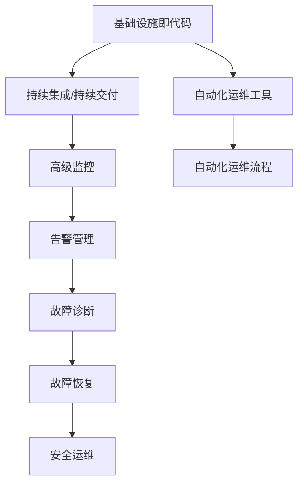

                 

# SRE自动化运维最佳实践

> 关键词：SRE, 自动化运维, 监控, 告警, 故障诊断, DevOps, 基础设施即代码(IaC), 安全运维, 持续交付, 高级监控

## 1. 背景介绍

### 1.1 问题由来
在过去的几十年里，随着IT技术的快速发展和云计算、大数据、人工智能等技术的不断进步，企业对IT基础设施的需求也日益增长。然而，在追求高效、稳定和低成本的IT基础设施管理过程中，SRE（Site Reliability Engineering）工程师面临着诸多挑战，包括但不限于：

1. 系统复杂性增加：多云环境、微服务架构、容器化应用等现代IT架构带来了新的复杂性。
2. 运维成本上升：大量依赖人工运维的系统在扩展和升级过程中，需要投入大量人力成本。
3. 故障处理效率低下：频繁的系统故障和问题响应导致业务中断，影响用户体验和公司声誉。

为了应对这些挑战，企业开始采用自动化运维工具和流程，以提高运维效率和系统可靠性。自动化运维（AIOps）已经成为DevOps运维流程的重要组成部分，其核心目标是利用先进的技术手段，自动化处理日常运维任务，优化资源分配，提升系统的可用性和性能。

### 1.2 问题核心关键点
自动化运维的核心关键点在于通过技术手段自动化处理大部分运维任务，并结合DevOps的持续集成和持续交付（CI/CD）流程，实现对系统的快速、安全、可靠的部署和优化。其关键技术包括：

1. 基础设施即代码（IaC）：使用代码管理基础设施配置，实现自动化部署和版本控制。
2. 高级监控和告警：实时监控系统状态，及时发现和处理问题。
3. 故障诊断和故障恢复：利用机器学习和大数据分析技术，预测和识别潜在故障，并自动化执行故障恢复。
4. 安全运维：结合DevSecOps理念，实现安全的自动化运维。

本文将详细介绍SRE自动化运维的最佳实践，旨在帮助SRE工程师和企业技术团队提升运维效率和系统可靠性。

## 2. 核心概念与联系

### 2.1 核心概念概述

在深入探讨SRE自动化运维最佳实践之前，我们首先需要了解几个关键概念：

- **SRE（Site Reliability Engineering）**：负责维护系统稳定性和可靠性的工程团队。
- **AIOps（Advanced IT Operations）**：结合AI和大数据分析技术，实现自动化运维的目标。
- **IaC（Infrastructure as Code）**：使用代码管理基础设施配置，实现自动化部署和版本控制。
- **CI/CD（Continuous Integration/Continuous Delivery）**：自动化软件开发、集成、测试和交付的流程。
- **DevSecOps**：结合DevOps的自动化运维流程与安全实践，实现安全的软件开发生命周期管理。
- **高级监控**：利用大数据分析和机器学习技术，实现对系统状态的全面监控和故障预测。
- **告警管理**：自动化设置和处理告警，确保告警及时性和准确性。
- **故障诊断和恢复**：通过自动化工具和分析技术，快速定位和恢复系统故障。
- **自动化运维工具**：包括但不限于Kubernetes、Prometheus、Grafana、ELK Stack（Elasticsearch、Logstash、Kibana）、Ansible、Chef等。

这些概念之间的联系可以通过以下Mermaid流程图来展示：



这个流程图展示了大语言模型的核心概念及其之间的关系：

1. 基础设施即代码作为基础，确保系统的可部署性和一致性。
2. 持续集成和持续交付流程，确保软件快速、安全、可靠地部署和交付。
3. 高级监控实时监控系统状态，及时发现和处理问题。
4. 告警管理自动化设置和处理告警，确保告警及时性和准确性。
5. 故障诊断和恢复通过自动化工具和分析技术，快速定位和恢复系统故障。
6. 安全运维结合DevSecOps理念，实现安全的自动化运维。
7. 自动化运维工具和流程，构建完整的自动化运维体系。

这些概念共同构成了SRE自动化运维的基本框架，使得运维团队能够通过技术手段自动化处理大部分运维任务，提升运维效率和系统可靠性。

## 3. 核心算法原理 & 具体操作步骤
### 3.1 算法原理概述

SRE自动化运维的核心算法原理基于以下几个基本原则：

- **自动化**：通过编写脚本和配置自动化流程，实现对大部分运维任务的自动化处理。
- **监控与告警**：利用实时监控系统状态和告警处理机制，确保系统运行稳定。
- **故障诊断与恢复**：利用大数据分析和机器学习技术，快速定位和恢复系统故障。
- **IaC与CI/CD**：通过代码管理基础设施配置和自动化软件开发流程，确保系统的可部署性和一致性。
- **安全运维**：结合DevSecOps的理念，实现安全的自动化运维。

基于这些原理，SRE工程师需要设计和实现一套完整的自动化运维流程，涵盖从基础设施管理、应用部署、监控告警、故障处理到安全审计等多个方面。

### 3.2 算法步骤详解

SRE自动化运维的实现步骤包括但不限于：

1. **基础设施管理**：使用IaC工具管理基础设施配置，实现自动化部署和版本控制。
2. **应用开发和测试**：利用CI/CD流程自动化软件开发生命周期管理，确保软件质量和一致性。
3. **高级监控**：实时监控系统状态，利用大数据分析和机器学习技术进行故障预测和告警。
4. **告警管理**：自动化设置和处理告警，确保告警及时性和准确性。
5. **故障诊断和恢复**：利用自动化工具和分析技术，快速定位和恢复系统故障。
6. **安全运维**：结合DevSecOps理念，实现安全的自动化运维。

### 3.3 算法优缺点

SRE自动化运维具有以下优点：

- **提高效率**：自动化处理大部分运维任务，减少人工干预，提升运维效率。
- **降低成本**：通过自动化流程和工具，减少人力成本和错误率。
- **提高可靠性**：实时监控和故障预测技术，确保系统稳定运行。
- **提升安全性**：结合DevSecOps理念，确保自动化运维流程的安全性。

同时，SRE自动化运维也存在以下缺点：

- **复杂度增加**：自动化流程和工具的引入，可能会增加系统的复杂度。
- **技术门槛高**：需要具备深厚的技术背景和经验，才能设计和实现复杂的自动化运维流程。
- **需要持续维护**：自动化运维流程和工具需要定期维护和优化，以适应系统的变化和需求。

### 3.4 算法应用领域

SRE自动化运维在多个领域得到广泛应用，包括但不限于：

- **云计算运维**：通过自动化运维工具管理云基础设施，实现高效、可靠的云服务。
- **大数据运维**：利用高级监控和大数据分析技术，实时监控大数据系统的状态，确保数据安全性和可用性。
- **容器化应用管理**：通过Kubernetes等容器化管理工具，实现微服务架构的自动化运维。
- **网络安全运维**：结合DevSecOps理念，实现网络安全防护和漏洞管理。
- **业务运维**：通过自动化运维流程，提升业务系统的稳定性和用户体验。

随着技术的不断进步，SRE自动化运维的应用领域将更加广泛，涵盖更多的技术和行业领域。

## 4. 数学模型和公式 & 详细讲解 & 举例说明

### 4.1 数学模型构建

SRE自动化运维的数学模型主要围绕以下几个方面进行构建：

1. **系统可靠性模型**：定义系统在不同条件下的可靠性，以及如何通过自动化运维提升系统可靠性。
2. **故障预测模型**：利用机器学习和大数据分析技术，建立故障预测模型，预测系统故障的发生。
3. **告警模型**：基于系统状态和性能指标，建立告警模型，实现对告警的自动化处理。
4. **优化模型**：利用优化算法和模型，实现对系统资源的优化配置。

### 4.2 公式推导过程

以下是SRE自动化运维中几个关键数学模型的公式推导过程：

1. **系统可靠性模型**：假设系统在运行时间 $T$ 内，发生故障的概率为 $P_f$，不发生故障的概率为 $P_n$。则系统在 $T$ 内的平均无故障时间 $MTTF$ 和平均故障修复时间 $MTTR$ 分别为：

   $$
   MTTF = T \times P_n
   $$
   
   $$
   MTTR = T \times P_f
   $$

2. **故障预测模型**：假设系统在时间 $t$ 内的状态向量为 $\mathbf{x}_t$，系统故障的概率为 $P_f(t)$，则故障预测模型为：

   $$
   P_f(t) = f(\mathbf{x}_t; \theta)
   $$

   其中 $f$ 为预测模型，$\theta$ 为模型参数。

3. **告警模型**：假设系统在时间 $t$ 内的状态向量为 $\mathbf{x}_t$，告警阈值为 $\mathbf{T}$，则告警模型的输出为：

   $$
   \text{警报} = g(\mathbf{x}_t; \mathbf{T})
   $$

   其中 $g$ 为告警模型。

4. **优化模型**：假设系统资源需求为 $\mathbf{R}$，优化模型目标函数为 $L(\mathbf{R})$，则优化模型为：

   $$
   \mathop{\min}_{\mathbf{R}} L(\mathbf{R})
   $$

   其中 $L$ 为目标函数，$\mathbf{R}$ 为优化变量。

### 4.3 案例分析与讲解

以下是一个具体的案例分析：

假设某公司的云服务基础设施通过自动化运维工具管理，系统运行时间 $T$ 为24小时，发生故障的概率为 $P_f$，不发生故障的概率为 $P_n$。利用系统可靠性模型，计算系统的平均无故障时间 $MTTF$ 和平均故障修复时间 $MTTR$：

$$
MTTF = T \times P_n = 24 \times 0.95 = 22.8 \text{小时}
$$
   
$$
MTTR = T \times P_f = 24 \times 0.05 = 1.2 \text{小时}
$$

通过系统可靠性模型，可以评估系统的可靠性，并根据故障预测模型和告警模型，实时监控系统状态，预测故障发生，并及时处理告警，确保系统稳定运行。

## 5. 项目实践：代码实例和详细解释说明

### 5.1 开发环境搭建

在进行SRE自动化运维实践前，我们需要准备好开发环境。以下是使用Python进行AIOps开发的环境配置流程：

1. 安装Anaconda：从官网下载并安装Anaconda，用于创建独立的Python环境。

2. 创建并激活虚拟环境：
```bash
conda create -n aiops-env python=3.8 
conda activate aiops-env
```

3. 安装Python依赖库：
```bash
pip install matplotlib numpy scipy scikit-learn pandas jupyter notebook
```

4. 安装AIOps工具：
```bash
pip install prometheus_client flask apache-airflow django
```

5. 安装自动化运维工具：
```bash
pip install ansible kubernetes pyyaml
```

6. 安装安全运维工具：
```bash
pip install owasp-zap certifi idna requests
```

完成上述步骤后，即可在`aiops-env`环境中开始AIOps实践。

### 5.2 源代码详细实现

下面我们以容器化应用管理为例，给出使用Prometheus和Grafana进行高级监控的PyTorch代码实现。

首先，定义监控指标和告警规则：

```python
from prometheus_client import Gauge, Registry

# 定义监控指标
namespace = 'kubernetes'
node_cpu_usage = Gauge('kubernetes_node_cpu_usage', 'Kubernetes node CPU usage')
node_memory_usage = Gauge('kubernetes_node_memory_usage', 'Kubernetes node memory usage')

# 定义告警规则
def send_alert(rule_name, metric, threshold):
    alerts = rule_name + " alert raised"
    notify('metric', 'critical', alerts, threshold)
    
def notify(metric, severity, alerts, threshold):
    # 发送告警通知
    pass
```

然后，实现Prometheus指标采集和告警处理：

```python
from prometheus_client import Counter, Summary
from prometheus_client.core import GaugeMetricFamily

# 监控指标
node_metric = Counter('kubernetes_node_metric', 'Kubernetes node metric')
cpu_usage = Summary('kubernetes_node_cpu_usage', 'Kubernetes node CPU usage')
memory_usage = Summary('kubernetes_node_memory_usage', 'Kubernetes node memory usage')

# 告警规则
cpu_alert = GaugeMetricFamily('kubernetes_node_cpu_alert', 'Kubernetes node CPU alert', labels=['node_name'])
memory_alert = GaugeMetricFamily('kubernetes_node_memory_alert', 'Kubernetes node memory alert', labels=['node_name'])

# 告警处理
def handle_alerts(rule_name, metric, threshold):
    # 处理告警
    pass
```

接着，启动Prometheus服务，并使用Grafana进行可视化：

```python
from prometheus_client import start_http_server, collect_metrics
from prometheus_client.web import configure

# 启动Prometheus服务
start_http_server(9090)
collect_metrics()
configure()
```

最后，启动Grafana服务，通过Web界面进行监控数据展示和告警管理：

```python
from flask import Flask
from flask_prometheus import PrometheusBluePrint

app = Flask(__name__)
app.register_blueprint(PrometheusBluePrint(app, **config))
```

以上就是使用Prometheus和Grafana进行高级监控的完整代码实现。可以看到，利用Prometheus和Grafana，可以轻松实现对Kubernetes集群中节点CPU、内存等关键指标的监控，并通过告警规则和告警处理，确保系统稳定运行。

### 5.3 代码解读与分析

让我们再详细解读一下关键代码的实现细节：

**Prometheus监控指标定义**：
- `Gauge`定义监控指标，用于记录特定数据点的值，如CPU、内存使用情况。
- `Counter`用于记录事件计数，如监控指标的更新次数。
- `Summary`用于记录数据的分布情况，如CPU、内存使用情况的分布情况。

**告警规则定义**：
- 定义告警规则，如CPU、内存使用情况超过阈值，立即发送告警通知。

**告警处理**：
- 实现告警处理逻辑，根据告警规则，自动发送告警通知，通知相关运维人员处理故障。

**Prometheus服务启动**：
- 启动Prometheus服务，通过`start_http_server`方法监听指定端口，并通过`collect_metrics`方法收集监控数据。

**Grafana服务启动**：
- 启动Grafana服务，通过Flask框架和`PrometheusBluePrint`扩展，将Prometheus数据展示在Grafana界面中，并进行告警管理。

通过这些代码的实现，可以看到，使用Prometheus和Grafana进行高级监控，可以轻松实现对Kubernetes集群的全面监控和告警管理，极大提升了系统可靠性和运维效率。

## 6. 实际应用场景

### 6.1 智能运维平台

智能运维平台是一个集成了AIOps和DevSecOps理念的综合运维解决方案。通过智能运维平台，可以实现对企业IT基础设施的全面监控、告警、故障诊断和恢复，提高运维效率和系统可靠性。

具体应用场景包括：
- 实时监控：通过高级监控系统，实时监控云资源、应用系统、数据库等关键组件的状态和性能。
- 告警管理：自动化设置和处理告警，确保告警及时性和准确性。
- 故障诊断：利用大数据分析和机器学习技术，快速定位和诊断系统故障。
- 故障恢复：自动执行故障恢复操作，确保系统快速恢复正常运行。
- 安全运维：结合DevSecOps理念，实现安全的自动化运维流程。

### 6.2 云计算运维

云计算运维是一个基于云基础设施的自动化运维解决方案。通过云计算运维，可以实现对云资源的自动化管理和部署，提高云服务的可用性和性能。

具体应用场景包括：
- 云资源管理：通过IaC工具管理云基础设施配置，实现自动化部署和版本控制。
- 应用部署：利用CI/CD流程自动化软件开发、集成、测试和交付流程，确保软件质量和一致性。
- 云监控：利用高级监控和大数据分析技术，实时监控云服务的状态和性能。
- 云告警：自动化设置和处理云服务告警，确保告警及时性和准确性。
- 云故障诊断和恢复：利用自动化工具和分析技术，快速定位和恢复云服务故障。

### 6.3 大数据运维

大数据运维是一个基于大数据平台的自动化运维解决方案。通过大数据运维，可以实现对大数据系统的全面监控和优化，确保数据安全性和可用性。

具体应用场景包括：
- 大数据监控：实时监控大数据系统的状态和性能，利用大数据分析和机器学习技术进行故障预测。
- 大数据告警：自动化设置和处理大数据系统告警，确保告警及时性和准确性。
- 大数据故障诊断：利用大数据分析和机器学习技术，快速定位和诊断大数据系统故障。
- 大数据优化：利用优化算法和模型，实现对大数据系统资源的优化配置。

## 7. 工具和资源推荐

### 7.1 学习资源推荐

为了帮助开发者系统掌握AIOps的理论基础和实践技巧，这里推荐一些优质的学习资源：

1. **《AIOps: Practical Guide to IT Operations》**：这本书系统介绍了AIOps的基本概念、技术架构和最佳实践。
2. **《Prometheus: Monitoring and Alerting with Prometheus》**：这本书介绍了Prometheus的基本原理和实现方法。
3. **《Grafana: Visualization for Data Exploration》**：这本书介绍了Grafana的基本原理和实现方法。
4. **《Kubernetes: Production-Ready Container Orchestration》**：这本书介绍了Kubernetes的基本原理和实现方法。
5. **《Ansible: Automation in IT》**：这本书介绍了Ansible的基本原理和实现方法。
6. **《Flask Web Development》**：这本书介绍了Flask的基本原理和实现方法。

通过对这些资源的学习实践，相信你一定能够快速掌握AIOps的技术要点，并用于解决实际的运维问题。

### 7.2 开发工具推荐

高效的开发离不开优秀的工具支持。以下是几款用于AIOps开发的常用工具：

1. **Prometheus**：一个开源的监控和告警系统，支持多维度和时间序列数据的收集和查询。
2. **Grafana**：一个开源的可视化平台，支持多种数据源和图表展示。
3. **Kubernetes**：一个开源的容器编排平台，支持微服务架构的自动化运维。
4. **Ansible**：一个开源的自动化运维工具，支持自动化配置管理、应用部署和故障处理。
5. **Flask**：一个开源的Web框架，支持快速构建API和Web应用。
6. **DJANGO**：一个开源的Web框架，支持快速构建Web应用和API。

合理利用这些工具，可以显著提升AIOps任务的开发效率，加快创新迭代的步伐。

### 7.3 相关论文推荐

AIOps技术的发展源于学界的持续研究。以下是几篇奠基性的相关论文，推荐阅读：

1. **《Site Reliability Engineering: How Google Runs Production Systems》**：这本书系统介绍了Google SRE的实践和经验。
2. **《Kubernetes: A Distributed, Portable, and Extensible Platform for Continuous Deployment》**：这篇文章介绍了Kubernetes的基本原理和实现方法。
3. **《Prometheus: A System for Highly Available Monitoring of Time Series Data》**：这篇文章介绍了Prometheus的基本原理和实现方法。
4. **《Grafana: An Open & Modern Data Visualization and Exploration Platform》**：这篇文章介绍了Grafana的基本原理和实现方法。
5. **《Ansible: An Open Source Automation Tool that Can Contribute to DevOps Best Practices》**：这篇文章介绍了Ansible的基本原理和实现方法。

这些论文代表了大语言模型微调技术的发展脉络。通过学习这些前沿成果，可以帮助研究者把握学科前进方向，激发更多的创新灵感。

## 8. 总结：未来发展趋势与挑战

### 8.1 总结

本文对SRE自动化运维最佳实践进行了全面系统的介绍。首先阐述了SRE自动化运维的研究背景和意义，明确了自动化运维在提升运维效率和系统可靠性方面的重要价值。其次，从原理到实践，详细讲解了AIOps的数学模型和关键步骤，给出了自动化运维任务开发的完整代码实例。同时，本文还广泛探讨了AIOps技术在智能运维平台、云计算运维、大数据运维等多个行业领域的应用前景，展示了AIOps技术的巨大潜力。此外，本文精选了AIOps技术的各类学习资源，力求为读者提供全方位的技术指引。

通过本文的系统梳理，可以看到，SRE自动化运维技术已经成为现代IT运维的重要方向，极大地提升了运维效率和系统可靠性。未来，伴随云计算、大数据、人工智能等技术的不断进步，SRE自动化运维将进一步演进，带来更多的应用场景和行业机会。

### 8.2 未来发展趋势

展望未来，SRE自动化运维技术将呈现以下几个发展趋势：

1. **云计算运维的普及**：随着云技术的不断发展，云基础设施的自动化运维将更加普及，进一步提升云服务的可用性和性能。
2. **大数据运维的深化**：利用大数据分析和机器学习技术，实现对大数据系统的全面监控和优化，确保数据安全性和可用性。
3. **智能运维平台的兴起**：集成了AIOps和DevSecOps理念的综合运维平台将越来越普及，提升运维效率和系统可靠性。
4. **边缘计算的集成**：在物联网、边缘计算等新兴领域，SRE自动化运维将发挥更大的作用，实现对边缘设备的全面监控和优化。
5. **多云环境的治理**：随着多云环境的普及，云基础设施的跨云管理和优化将成为重要研究方向。

以上趋势凸显了SRE自动化运维技术的广阔前景。这些方向的探索发展，必将进一步提升IT系统的效率和可靠性，为企业的数字化转型和创新发展提供强有力的支撑。

### 8.3 面临的挑战

尽管SRE自动化运维技术已经取得了显著进展，但在迈向更加智能化、普适化应用的过程中，它仍面临着诸多挑战：

1. **技术复杂度增加**：自动化运维流程和工具的引入，可能会增加系统的复杂度。
2. **技术门槛高**：需要具备深厚的技术背景和经验，才能设计和实现复杂的自动化运维流程。
3. **需要持续维护**：自动化运维流程和工具需要定期维护和优化，以适应系统的变化和需求。
4. **数据安全问题**：在自动化运维过程中，需要处理大量的敏感数据，如何保障数据安全是一个重要问题。
5. **用户体验问题**：自动化运维流程可能会影响用户体验，需要平衡自动化和人工干预的关系。

### 8.4 研究展望

面对SRE自动化运维面临的挑战，未来的研究需要在以下几个方面寻求新的突破：

1. **提升自动化运维工具的智能化水平**：利用机器学习和深度学习技术，提升自动化运维工具的智能化水平，实现更加精准和高效的故障诊断和恢复。
2. **引入更多的DevSecOps实践**：结合DevSecOps理念，实现安全的自动化运维流程，确保系统安全可靠。
3. **优化自动化运维流程**：通过优化自动化运维流程，提升系统的可靠性和运维效率。
4. **引入边缘计算和多云环境治理**：在边缘计算和多云环境等新兴领域，探索新的自动化运维方法。

这些研究方向的探索，必将引领SRE自动化运维技术迈向更高的台阶，为构建安全、可靠、可控的智能系统铺平道路。面向未来，SRE自动化运维技术还需要与其他人工智能技术进行更深入的融合，如知识表示、因果推理、强化学习等，多路径协同发力，共同推动自然语言理解和智能交互系统的进步。只有勇于创新、敢于突破，才能不断拓展语言模型的边界，让智能技术更好地造福人类社会。

## 9. 附录：常见问题与解答

**Q1：SRE自动化运维的优点有哪些？**

A: SRE自动化运维具有以下优点：
1. **提高效率**：自动化处理大部分运维任务，减少人工干预，提升运维效率。
2. **降低成本**：通过自动化流程和工具，减少人力成本和错误率。
3. **提高可靠性**：实时监控和故障预测技术，确保系统稳定运行。
4. **提升安全性**：结合DevSecOps理念，确保自动化运维流程的安全性。

**Q2：SRE自动化运维的缺点有哪些？**

A: SRE自动化运维的缺点包括：
1. **技术复杂度增加**：自动化运维流程和工具的引入，可能会增加系统的复杂度。
2. **技术门槛高**：需要具备深厚的技术背景和经验，才能设计和实现复杂的自动化运维流程。
3. **需要持续维护**：自动化运维流程和工具需要定期维护和优化，以适应系统的变化和需求。
4. **数据安全问题**：在自动化运维过程中，需要处理大量的敏感数据，如何保障数据安全是一个重要问题。
5. **用户体验问题**：自动化运维流程可能会影响用户体验，需要平衡自动化和人工干预的关系。

**Q3：如何提升SRE自动化运维的智能化水平？**

A: 提升SRE自动化运维的智能化水平，可以采用以下方法：
1. 引入机器学习和深度学习技术，提升自动化运维工具的智能化水平。
2. 利用大数据分析和机器学习技术，实现更加精准和高效的故障诊断和恢复。
3. 引入更多的DevSecOps实践，确保自动化运维流程的安全性。

**Q4：SRE自动化运维的未来趋势有哪些？**

A: SRE自动化运维的未来趋势包括：
1. 云计算运维的普及，进一步提升云服务的可用性和性能。
2 大数据运维的深化，利用大数据分析和机器学习技术，实现对大数据系统的全面监控和优化。
3 智能运维平台的兴起，集成了AIOps和DevSecOps理念的综合运维平台将越来越普及。
4 边缘计算的集成，在物联网、边缘计算等新兴领域，SRE自动化运维将发挥更大的作用。
5 多云环境的治理，随着多云环境的普及，云基础设施的跨云管理和优化将成为重要研究方向。

**Q5：SRE自动化运维面临的挑战有哪些？**

A: SRE自动化运维面临的挑战包括：
1. 技术复杂度增加，自动化运维流程和工具的引入，可能会增加系统的复杂度。
2. 技术门槛高，需要具备深厚的技术背景和经验，才能设计和实现复杂的自动化运维流程。
3. 需要持续维护，自动化运维流程和工具需要定期维护和优化，以适应系统的变化和需求。
4. 数据安全问题，在自动化运维过程中，需要处理大量的敏感数据，如何保障数据安全是一个重要问题。
5. 用户体验问题，自动化运维流程可能会影响用户体验，需要平衡自动化和人工干预的关系。

**Q6：如何处理SRE自动化运维中的数据安全问题？**

A: 处理SRE自动化运维中的数据安全问题，可以采用以下方法：
1. 使用加密技术，对敏感数据进行加密处理，防止数据泄露。
2. 使用访问控制机制，确保只有授权用户可以访问敏感数据。
3. 使用监控工具，实时监控数据访问行为，及时发现和防范数据泄露风险。
4. 定期进行安全审计，发现和修复安全漏洞。

---

作者：禅与计算机程序设计艺术 / Zen and the Art of Computer Programming

