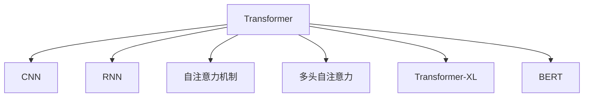

                 

# Transformer 在 CV 和 NLP 中的差异

> 关键词：Transformer,卷积神经网络(CNN),循环神经网络(RNN),自注意力机制,多头自注意力,Transformer-XL,BERT,语言模型

## 1. 背景介绍

### 1.1 问题由来
Transformer，一种基于自注意力机制的深度学习模型，自2017年提出以来，在自然语言处理（NLP）领域取得了革命性的突破。它不仅颠覆了以往主流的循环神经网络（RNN）和卷积神经网络（CNN），也在计算机视觉（CV）中崭露头角。然而，尽管两者在原理上有一定的相似性，但在实际应用中存在诸多差异。本文将系统比较Transformer在CV和NLP中的不同表现，以期为从业者提供更为全面和深刻的理解。

### 1.2 问题核心关键点
本文的核心问题在于探讨Transformer在CV和NLP中的异同，包括但不限于以下几点：
1. 不同领域中Transformer的具体实现和架构。
2. 自注意力机制在两个领域中的差异和优势。
3. 不同领域中Transformer的应用场景和表现。
4. 两个领域中Transformer面临的技术挑战和解决方案。

### 1.3 问题研究意义
研究Transformer在CV和NLP中的差异，对于理解Transformer的工作机制、提升其在不同领域的应用效果、推动两个领域的技术融合具有重要意义。

1. **理解Transformer机制**：深入了解Transformer在CV和NLP中的实现细节，有助于把握其核心算法原理和架构设计。
2. **提升应用效果**：明确Transformer在不同领域中的差异，有助于在实际应用中针对性地进行优化，提升模型性能。
3. **推动领域融合**：探索Transformer在不同领域中的共性和特性，有助于推动CV和NLP技术的融合，促进多模态学习的发展。

## 2. 核心概念与联系

### 2.1 核心概念概述

为了更好地理解Transformer在CV和NLP中的表现，本节将介绍几个密切相关的核心概念：

- **卷积神经网络（CNN）**：一种经典的CV模型，通过卷积操作提取局部特征，并通过池化操作实现特征抽象。
- **循环神经网络（RNN）**：一种经典的NLP模型，通过循环结构处理序列数据，能够捕捉时间依赖关系。
- **自注意力机制**：Transformer中的核心算法，通过计算输入序列中各位置之间的相关性，实现跨位置的信息交互。
- **多头自注意力**：Transformer通过并行多个头，并行计算自注意力，进一步提升了模型的表现力。
- **Transformer-XL**：一种改进的Transformer模型，引入了连续掩码机制，能够处理长序列。
- **BERT**：一种基于Transformer的语言模型，通过大规模预训练和微调，在NLP任务中表现优异。

这些概念之间的逻辑关系可以通过以下Mermaid流程图来展示：



这个流程图展示了大模型Transformer的内部结构和核心技术，以及其与CNN和RNN的关系。

## 3. 核心算法原理 & 具体操作步骤
### 3.1 算法原理概述

Transformer的核心算法原理是自注意力机制，通过并行计算多个自注意力头，实现了高效的信息交互和特征提取。在CV和NLP中，Transformer的实现略有不同，但其原理基本一致。

### 3.2 算法步骤详解

在CV中，Transformer主要用于图像特征的提取和分类任务。其基本步骤如下：

1. **输入预处理**：将图像数据转换为张量形式，通过嵌入层（Embedding Layer）转换为向量形式。
2. **自注意力计算**：计算图像各位置之间的相关性，生成注意力权重，用于捕捉图像局部和全局特征。
3. **多头自注意力计算**：并行计算多个自注意力头，进一步提升特征提取能力。
4. **残差连接和层归一化**：通过残差连接和层归一化，提升模型的稳定性。
5. **卷积和池化层**：通过卷积和池化操作，进一步提取和抽象图像特征。
6. **输出预测**：通过全连接层（Fully Connected Layer）进行分类或回归预测。

在NLP中，Transformer主要用于自然语言处理任务，如文本分类、机器翻译、问答系统等。其基本步骤如下：

1. **输入预处理**：将文本数据转换为张量形式，通过嵌入层（Embedding Layer）转换为向量形式。
2. **自注意力计算**：计算文本各位置之间的相关性，生成注意力权重，用于捕捉文本局部和全局语义。
3. **多头自注意力计算**：并行计算多个自注意力头，进一步提升语义理解能力。
4. **残差连接和层归一化**：通过残差连接和层归一化，提升模型的稳定性。
5. **全连接层**：通过全连接层进行特征融合和输出预测。
6. **解码和后处理**：在机器翻译和问答系统中，通过解码器（Decoder）生成翻译或答案，并进行后处理。

### 3.3 算法优缺点

Transformer在CV和NLP中各有优劣：

**优点**：
- 自注意力机制能够高效地捕捉长距离依赖关系，适用于处理序列数据和图像数据。
- 并行计算多个自注意力头，提升了特征提取和语义理解能力。
- 残差连接和层归一化技术，提高了模型的稳定性。

**缺点**：
- 计算复杂度较高，特别是在长序列和大型图像数据中。
- 需要大量数据和计算资源进行预训练，训练成本较高。
- 在处理结构化数据时，表现不如CNN。

### 3.4 算法应用领域

Transformer在CV和NLP中的应用领域广泛，具体如下：

- **CV中的应用**：图像分类、目标检测、图像生成、图像分割等。
- **NLP中的应用**：文本分类、机器翻译、问答系统、文本生成等。

## 4. 数学模型和公式 & 详细讲解  
### 4.1 数学模型构建

Transformer的核心数学模型是自注意力机制，其数学公式如下：

$$
Attention(Q,K,V) = \text{Softmax}(QK^T / \sqrt{d_k})V
$$

其中，$Q$、$K$、$V$分别代表查询、键和值，$d_k$为键向量的维度。自注意力计算通过计算查询和键的相似度，生成注意力权重，用于计算加权和。

在CV中，Transformer通常用于提取图像特征，其基本数学模型如下：

$$
I = \text{Conv2D}(X) + Bias
$$

其中，$I$为特征图，$X$为输入图像，$Conv2D$为卷积操作。通过卷积操作，Transformer在CV中提取图像局部和全局特征。

在NLP中，Transformer通常用于处理文本序列，其基本数学模型如下：

$$
H = \text{ScaledDotProductAttention}(Q,K,V) + Bias
$$

其中，$H$为输出特征向量，$Q$、$K$、$V$分别为查询、键和值，$ScaledDotProductAttention$为带缩放的注意力计算函数。通过自注意力机制，Transformer在NLP中捕捉文本的局部和全局语义。

### 4.2 公式推导过程

在CV中，Transformer通过卷积操作提取特征，其公式推导如下：

$$
I_{(i,j)} = \sum_k w_{ik} X_{(i,j-k)}
$$

其中，$I$为特征图，$X$为输入图像，$w$为卷积核权重，$k$为卷积核大小。

在NLP中，Transformer通过自注意力机制提取特征，其公式推导如下：

$$
H_{(i,j)} = \sum_k a_{ik} V_{(i,k)}
$$

其中，$H$为输出特征向量，$Q$、$K$、$V$分别为查询、键和值，$a$为注意力权重。

### 4.3 案例分析与讲解

以图像分类任务为例，Transformer通过卷积操作提取特征，再通过全连接层进行分类预测。具体步骤如下：

1. **输入预处理**：将图像数据转换为张量形式，通过嵌入层转换为向量形式。
2. **卷积计算**：通过卷积操作提取特征图。
3. **池化操作**：通过池化操作抽象特征图。
4. **全连接层**：通过全连接层进行分类预测。

以机器翻译任务为例，Transformer通过自注意力机制提取语义特征，再通过解码器生成翻译结果。具体步骤如下：

1. **输入预处理**：将文本数据转换为张量形式，通过嵌入层转换为向量形式。
2. **自注意力计算**：通过自注意力机制提取语义特征。
3. **多头自注意力计算**：并行计算多个自注意力头。
4. **解码器生成**：通过解码器生成翻译结果。

## 5. 项目实践：代码实例和详细解释说明
### 5.1 开发环境搭建

在进行Transformer项目实践前，我们需要准备好开发环境。以下是使用Python进行TensorFlow开发的环境配置流程：

1. 安装Anaconda：从官网下载并安装Anaconda，用于创建独立的Python环境。

2. 创建并激活虚拟环境：
```bash
conda create -n tf-env python=3.8 
conda activate tf-env
```

3. 安装TensorFlow：根据CUDA版本，从官网获取对应的安装命令。例如：
```bash
conda install tensorflow-gpu==2.7.0 -c pypi -c conda-forge
```

4. 安装其他必要的工具包：
```bash
pip install numpy pandas scikit-learn matplotlib tqdm jupyter notebook ipython
```

完成上述步骤后，即可在`tf-env`环境中开始Transformer项目实践。

### 5.2 源代码详细实现

下面我们以图像分类任务为例，给出使用TensorFlow对Transformer模型进行训练的PyTorch代码实现。

```python
import tensorflow as tf
from tensorflow.keras import layers, models

# 定义Transformer模型
class Transformer(tf.keras.Model):
    def __init__(self, num_channels, num_filters):
        super(Transformer, self).__init__()
        self.conv1 = layers.Conv2D(num_filters, 3, activation='relu', padding='same')
        self.conv2 = layers.Conv2D(num_filters, 3, activation='relu', padding='same')
        self.conv3 = layers.Conv2D(num_filters, 3, activation='relu', padding='same')
        self.conv4 = layers.Conv2D(num_filters, 3, activation='relu', padding='same')
        self.maxpool = layers.MaxPooling2D(pool_size=(2, 2))
        self.flatten = layers.Flatten()
        self.fc1 = layers.Dense(64, activation='relu')
        self.fc2 = layers.Dense(num_channels)

    def call(self, inputs):
        x = self.conv1(inputs)
        x = self.maxpool(x)
        x = self.conv2(x)
        x = self.maxpool(x)
        x = self.conv3(x)
        x = self.maxpool(x)
        x = self.conv4(x)
        x = self.maxpool(x)
        x = self.flatten(x)
        x = self.fc1(x)
        return self.fc2(x)

# 定义数据集和数据生成器
num_samples = 10000
img_size = (32, 32, 3)
num_classes = 10

def generate_data():
    x = tf.random.normal([num_samples, img_size[0], img_size[1], img_size[2]])
    y = tf.random.normal([num_samples, num_classes])
    return x, y

# 定义模型和优化器
model = Transformer(num_classes, 64)
optimizer = tf.keras.optimizers.Adam()

# 定义训练函数
@tf.function
def train_step(inputs, targets):
    with tf.GradientTape() as tape:
        logits = model(inputs)
        loss = tf.keras.losses.SparseCategoricalCrossentropy(from_logits=True)(logits, targets)
    gradients = tape.gradient(loss, model.trainable_variables)
    optimizer.apply_gradients(zip(gradients, model.trainable_variables))

# 训练模型
for epoch in range(10):
    x, y = generate_data()
    train_step(x, y)
```

以上代码展示了TensorFlow中Transformer模型的实现，包括卷积层、池化层、全连接层等基本组件。在训练过程中，使用Adam优化器进行参数更新，并使用交叉熵损失函数进行优化。

### 5.3 代码解读与分析

让我们再详细解读一下关键代码的实现细节：

- **Transformer类**：定义Transformer模型的结构，包括卷积层、池化层、全连接层等。
- **数据生成函数**：生成随机图像数据和标签。
- **训练函数**：通过梯度下降算法更新模型参数。

**训练流程**：
- 定义总的epoch数，开始循环迭代
- 每个epoch内，生成随机数据，进行前向传播和反向传播，计算损失
- 使用Adam优化器更新模型参数
- 重复上述步骤，直至模型收敛

可以看到，TensorFlow和PyTorch的Transformer实现基本相同，都包括了卷积层、池化层和全连接层。然而，TensorFlow的实现方式更加灵活，可以通过定义函数（Function）的方式优化计算图。

## 6. 实际应用场景
### 6.1 智能监控系统

基于Transformer的CV技术，可以广泛应用于智能监控系统中。传统监控系统需要大量人力进行实时监测，且准确性和效率难以保证。而使用Transformer的CV技术，可以实现自动化的实时图像分析，快速检测异常情况，提高监控系统的智能化水平。

在技术实现上，可以收集监控场景下的视频图像，通过卷积和池化操作提取特征，再通过全连接层进行异常检测。对于检测到的异常情况，可以结合实时信息进行进一步分析和报警。

### 6.2 医学影像分析

医学影像分析是CV技术的重要应用领域之一。传统的医学影像分析依赖于医生的人工解读，耗时耗力且容易出错。而基于Transformer的医学影像分析技术，能够快速、准确地分析影像，辅助医生进行诊断和治疗。

在实践中，可以收集医学影像数据，通过卷积和池化操作提取特征，再通过全连接层进行疾病检测和诊断。对于疑似病例，可以进一步结合其他医学数据进行综合分析，给出更为精准的诊断结果。

### 6.3 自动驾驶

自动驾驶技术依赖于对周围环境的实时感知。基于Transformer的CV技术，可以实时分析车辆周围的图像数据，识别出道路、车辆、行人等关键对象，为自动驾驶提供必要的环境信息。

在技术实现上，可以收集车辆传感器数据，通过卷积和池化操作提取特征，再通过全连接层进行目标检测和跟踪。对于检测到的目标，可以进一步结合其他传感器数据进行综合分析，确保自动驾驶的安全性和可靠性。

### 6.4 未来应用展望

随着CV和NLP技术的不断融合，基于Transformer的多模态学习将迎来新的突破。未来，Transformer不仅能在CV和NLP中大放异彩，还能在更多领域发挥重要作用。

- **医学影像分析**：结合医学知识库，提升影像分析的准确性和可解释性。
- **自动驾驶**：结合激光雷达、毫米波雷达等传感器数据，提升车辆感知和决策能力。
- **智能监控**：结合实时事件检测，实现智能监控和预警。
- **智能家居**：结合传感器数据和用户行为，实现智能家居和娱乐。

Transformer的未来应用前景广阔，相信在未来的技术发展中，Transformer将为各行业带来深远的影响。

## 7. 工具和资源推荐
### 7.1 学习资源推荐

为了帮助开发者系统掌握Transformer的原理和实践技巧，这里推荐一些优质的学习资源：

1. **《Transformer From Basics to Advanced》系列博文**：由大模型技术专家撰写，深入浅出地介绍了Transformer的原理、实现和应用，适合入门学习和深入研究。
2. **CS231n《Convolutional Neural Networks for Visual Recognition》课程**：斯坦福大学开设的CV明星课程，详细介绍了卷积神经网络的结构和应用，涵盖CV中的经典模型和前沿技术。
3. **《Natural Language Processing with Transformers》书籍**：Transformer的作者所著，全面介绍了如何使用TensorFlow和PyTorch实现Transformer，适合深入学习和实践。
4. **HuggingFace官方文档**：Transformer库的官方文档，提供了丰富的预训练模型和样例代码，是学习和实践Transformer的必备资料。
5. **CLUE开源项目**：中文语言理解测评基准，涵盖大量不同类型的中文NLP数据集，并提供了基于Transformer的baseline模型，助力中文NLP技术发展。

通过对这些资源的学习实践，相信你一定能够快速掌握Transformer的核心算法原理和实践技巧，并用于解决实际的NLP和CV问题。

### 7.2 开发工具推荐

高效的开发离不开优秀的工具支持。以下是几款用于Transformer开发的常用工具：

1. **PyTorch**：基于Python的开源深度学习框架，灵活动态的计算图，适合快速迭代研究。大部分预训练语言模型都有PyTorch版本的实现。
2. **TensorFlow**：由Google主导开发的开源深度学习框架，生产部署方便，适合大规模工程应用。同样有丰富的预训练语言模型资源。
3. **Transformer库**：HuggingFace开发的NLP工具库，集成了众多SOTA语言模型，支持PyTorch和TensorFlow，是实现Transformer的利器。
4. **Weights & Biases**：模型训练的实验跟踪工具，可以记录和可视化模型训练过程中的各项指标，方便对比和调优。与主流深度学习框架无缝集成。
5. **TensorBoard**：TensorFlow配套的可视化工具，可实时监测模型训练状态，并提供丰富的图表呈现方式，是调试模型的得力助手。
6. **Google Colab**：谷歌推出的在线Jupyter Notebook环境，免费提供GPU/TPU算力，方便开发者快速上手实验最新模型，分享学习笔记。

合理利用这些工具，可以显著提升Transformer的开发效率，加快创新迭代的步伐。

### 7.3 相关论文推荐

Transformer的研究源于学界的持续研究。以下是几篇奠基性的相关论文，推荐阅读：

1. **Attention is All You Need**：提出了Transformer结构，开启了NLP领域的预训练大模型时代。
2. **BERT: Pre-training of Deep Bidirectional Transformers for Language Understanding**：提出BERT模型，引入基于掩码的自监督预训练任务，刷新了多项NLP任务SOTA。
3. **Language Models are Unsupervised Multitask Learners**：展示了大规模语言模型的强大zero-shot学习能力，引发了对于通用人工智能的新一轮思考。
4. **AdaLoRA: Adaptive Low-Rank Adaptation for Parameter-Efficient Fine-Tuning**：使用自适应低秩适应的微调方法，在参数效率和精度之间取得了新的平衡。
5. **Transformer-XL: Attentive Language Models Beyond a Fixed-Length Context**：提出Transformer-XL模型，通过引入连续掩码机制，能够处理长序列。

这些论文代表了大模型Transformer的发展脉络。通过学习这些前沿成果，可以帮助研究者把握学科前进方向，激发更多的创新灵感。

## 8. 总结：未来发展趋势与挑战

### 8.1 总结

本文对Transformer在CV和NLP中的差异进行了全面系统的介绍。首先阐述了Transformer在两个领域中的基本实现和架构，明确了自注意力机制的算法原理和步骤。其次，从原理到实践，详细讲解了Transformer在CV和NLP中的应用场景和效果，给出了具体的代码实现和解释。最后，本文探讨了Transformer在未来技术融合和应用推广中的广阔前景，同时也指出了其在实际应用中面临的挑战。

通过本文的系统梳理，可以看到，Transformer在CV和NLP中都有广泛的应用，并展现出强大的表现力。其在自注意力机制和并行计算方面的优势，使得其在处理长距离依赖关系和复杂任务中表现优异。然而，Transformer也面临一些挑战，如计算复杂度高、数据依赖性强等。未来的研究需要在这些方面进行深入探索和优化，以进一步提升Transformer的性能和应用效果。

### 8.2 未来发展趋势

展望未来，Transformer技术将呈现以下几个发展趋势：

1. **多模态融合**：结合CV和NLP技术，实现多模态数据的协同建模，提升模型对复杂场景的理解和处理能力。
2. **知识图谱融合**：将知识图谱与Transformer模型结合，提升模型的常识推理和跨领域迁移能力。
3. **零样本学习**：通过预训练和微调，实现Transformer的零样本学习，降低对标注数据的依赖。
4. **模型压缩和优化**：通过模型压缩和优化，降低计算复杂度，提升模型的推理速度和资源利用率。
5. **跨领域应用**：推动Transformer在更多领域的应用，如医学、自动驾驶等，提升其应用价值。

以上趋势凸显了Transformer技术在CV和NLP中的潜力和应用前景。这些方向的探索发展，必将进一步提升Transformer的性能和应用效果，为构建智能系统和推动技术创新提供新的动力。

### 8.3 面临的挑战

尽管Transformer技术已经取得了瞩目成就，但在迈向更加智能化、普适化应用的过程中，它仍面临着诸多挑战：

1. **计算资源限制**：Transformer在大规模数据和长序列处理中计算复杂度高，需要强大的计算资源支持。
2. **数据依赖性强**：Transformer需要大量标注数据进行预训练和微调，获取高质量标注数据成本较高。
3. **鲁棒性不足**：Transformer面对新数据或噪声数据时，泛化性能可能大打折扣。
4. **可解释性不足**：Transformer模型结构复杂，难以解释其内部工作机制和决策逻辑。

这些挑战需要研究者不断优化算法和架构，提升模型的稳定性和可解释性，推动Transformer技术的普及和应用。

### 8.4 研究展望

面对Transformer所面临的挑战，未来的研究需要在以下几个方面寻求新的突破：

1. **优化算法和架构**：研究更加高效的计算图和优化算法，降低计算复杂度，提升模型推理速度。
2. **引入更多先验知识**：将知识图谱、逻辑规则等与Transformer结合，提升模型的常识推理和跨领域迁移能力。
3. **提高模型鲁棒性**：通过对抗训练、数据增强等方法，提升Transformer模型的泛化能力和鲁棒性。
4. **增强可解释性**：引入因果分析、博弈论等工具，增强Transformer模型的可解释性和决策逻辑的透明性。
5. **推动跨领域应用**：结合知识图谱、符号逻辑等技术，推动Transformer在更多领域的应用，提升其应用价值。

这些研究方向的探索，必将引领Transformer技术迈向更高的台阶，为构建智能系统和推动技术创新提供新的动力。总之，Transformer需要不断优化和扩展，才能在更广泛的领域中发挥作用，推动计算机科学的发展和进步。

## 9. 附录：常见问题与解答

**Q1: Transformer在CV和NLP中的实现有哪些不同？**

A: Transformer在CV和NLP中的实现主要区别在于卷积和自注意力机制的运用。在CV中，Transformer通过卷积操作提取图像特征，再通过全连接层进行分类或检测。在NLP中，Transformer通过自注意力机制提取文本特征，再通过全连接层进行语义理解或生成。

**Q2: 为什么Transformer在CV中的性能不如CNN？**

A: 尽管Transformer在NLP中表现优异，但在CV中的应用仍然面临一些挑战。主要原因包括：
1. 卷积操作具有空间局部性，能够更好地捕捉图像的局部特征。而自注意力机制需要计算所有位置的相似度，计算复杂度较高。
2. 卷积操作具有平移不变性，能够更好地处理平移和旋转等变化。而自注意力机制容易受到输入序列的顺序影响，难以处理平移和旋转。

**Q3: 如何优化Transformer的计算复杂度？**

A: 优化Transformer计算复杂度的方法包括：
1. 使用残差连接和层归一化技术，提升模型的稳定性。
2. 使用知识蒸馏、参数共享等方法，减少模型参数量。
3. 使用硬件加速和并行计算，提升模型训练和推理速度。

**Q4: 如何提高Transformer的可解释性？**

A: 提高Transformer可解释性的方法包括：
1. 引入因果分析、博弈论等工具，增强模型的可解释性和决策逻辑的透明性。
2. 使用符号逻辑与Transformer结合，提升模型的推理能力和解释能力。

**Q5: 如何在多模态任务中应用Transformer？**

A: 在多模态任务中应用Transformer的方法包括：
1. 结合图像、文本、语音等多种模态数据，进行协同建模和联合预测。
2. 引入知识图谱、逻辑规则等先验知识，提升Transformer的常识推理能力。

通过回答这些问题，可以更全面地了解Transformer在CV和NLP中的表现和应用，为实际项目提供参考和指导。

---

作者：禅与计算机程序设计艺术 / Zen and the Art of Computer Programming

