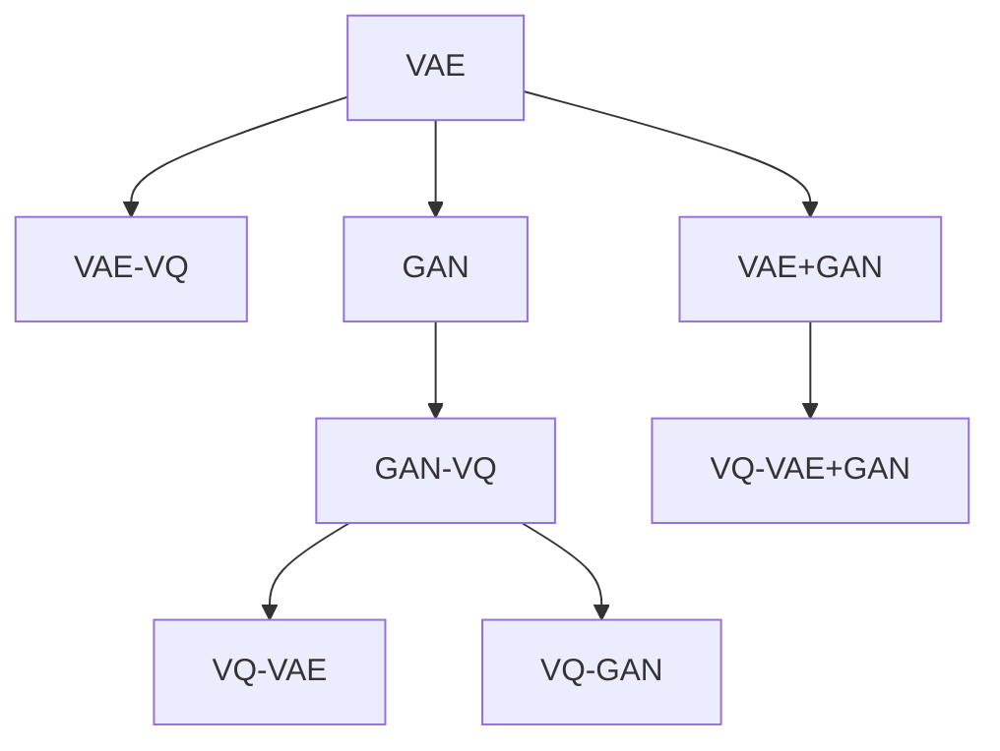

                 

# VQVAE和VQGAN：AI生成模型的革新

> 关键词：VQVAE, VQGAN, 变分自编码器, 生成对抗网络, AI生成, 深度学习, 自监督学习, 图像生成, 图像压缩

## 1. 背景介绍

### 1.1 问题由来
AI生成模型在图像、音频、文本等领域的应用已经取得了一系列令人瞩目的成果。其中，变分自编码器(VAE)和生成对抗网络(GAN)是两大核心模型，广泛应用于图像生成、图像压缩、音频生成等任务。然而，传统的VAE和GAN模型存在诸多不足，如训练复杂、图像生成质量不佳、计算复杂度高等问题。

近年来，VQVAE和VQGAN这两种新型生成模型相继问世，在图像生成、图像压缩等领域展现了巨大的潜力。VQVAE（Variable-Quality Vector Quantization Variational Autoencoder）和VQGAN（Variable-Quality Vector Quantization Generative Adversarial Network）分别基于变分自编码器和生成对抗网络，通过引入变分自编码器和生成对抗网络的优势，同时克服了传统模型的缺陷，成为新一代AI生成模型研究的重点。

### 1.2 问题核心关键点
VQVAE和VQGAN的核心创新在于将变分自编码器和生成对抗网络的优点结合起来，通过引入变分自编码器的自监督学习能力和生成对抗网络的高质量生成能力，提升模型的生成效果和压缩率。其核心点包括：
- VQVAE将生成过程分解为编码和解码两个步骤，通过引入向量量化(VQ)机制，在编码器输出上增加变分因子，提升生成质量。
- VQGAN通过生成器和判别器的对抗学习，结合向量量化机制，进一步提升了生成器的生成效果和判别器的判别能力。

## 2. 核心概念与联系

### 2.1 核心概念概述

为更好地理解VQVAE和VQGAN，本节将介绍几个密切相关的核心概念：

- 变分自编码器（VAE）：一种基于自编码器的生成模型，通过引入变分下界（KL散度），使得模型生成的样本在数据分布中具有更好的拟合度。

- 生成对抗网络（GAN）：一种通过对抗训练实现生成模型的方法，由生成器（Generator）和判别器（Discriminator）两部分组成，通过不断的对抗学习，生成器可以生成高质量的样本，判别器可以准确区分真实样本和生成样本。

- 向量量化（VQ）：一种将高维数据映射到低维空间的编码方法，通过将数据划分为若干个簇，每个簇用一个向量表示，从而降低数据表示的复杂度。

- 变分自编码器（VQ-VAE）：一种结合变分自编码器和向量量化的生成模型，通过变分下界约束生成过程，提高生成质量。

- 生成对抗网络（VQ-GAN）：一种结合生成对抗网络和向量量化的生成模型，通过对抗学习提升生成质量，同时降低计算复杂度。

这些核心概念之间的逻辑关系可以通过以下Mermaid流程图来展示：



这个流程图展示了大语言模型的核心概念及其之间的关系：

1. 变分自编码器（VAE）通过引入变分下界，提升生成质量。
2. 生成对抗网络（GAN）通过对抗学习，生成高质量的样本。
3. 向量量化（VQ）将高维数据映射到低维空间，降低计算复杂度。
4. VQ-VAE和VQ-GAN分别将变分自编码器和生成对抗网络的优势结合起来，进一步提升生成质量和压缩率。
5. VAE+GAN的融合，将生成对抗网络和变分自编码器的优点结合起来，进一步提高生成效果和计算效率。

这些概念共同构成了VQVAE和VQGAN的生成框架，使其能够在各种场景下发挥强大的生成能力。通过理解这些核心概念，我们可以更好地把握VQVAE和VQGAN的工作原理和优化方向。

## 3. 核心算法原理 & 具体操作步骤
### 3.1 算法原理概述

VQVAE和VQGAN的生成原理和具体操作步骤基于变分自编码器和生成对抗网络，通过引入向量量化机制，提升了生成效果和计算效率。其核心思想是：

1. 将生成过程分解为编码和解码两个步骤。通过将输入数据分解为若干个低维编码，再通过解码器生成输出样本，从而实现高质量生成。

2. 引入向量量化机制。通过将编码后的向量量化为有限的向量集，进一步提升生成效率和质量。

3. 通过变分自编码器的自监督学习能力和生成对抗网络的对抗学习，不断优化编码器和解码器，提升生成效果。

### 3.2 算法步骤详解

VQVAE和VQGAN的生成过程大致分为以下几个步骤：

**Step 1: 准备数据和模型**

- 收集训练数据集，进行数据预处理。
- 选择适当的编码器、解码器、生成器和判别器，并进行初始化。
- 选择合适的损失函数，如变分下界（KL散度）和对抗损失（GAN损失）。

**Step 2: 生成样本**

- 输入训练样本，通过编码器将其转换为低维编码。
- 将低维编码进行向量量化，生成向量集。
- 通过解码器将向量集解码为生成样本。
- 将生成样本输入判别器进行判别，得到判别器输出。
- 通过对抗训练优化生成器和判别器。

**Step 3: 优化模型**

- 通过梯度下降算法优化编码器、解码器、生成器和判别器的参数。
- 通过变分下界约束，优化生成过程。
- 通过对抗训练，优化生成器和判别器的参数。

**Step 4: 训练完成**

- 经过多轮迭代，直到生成样本与真实样本难以区分，生成过程达到最优。
- 保存最优模型，用于后续生成。

### 3.3 算法优缺点

VQVAE和VQGAN相比传统VAE和GAN模型，具有以下优点：

1. 生成样本质量更高。通过引入变分自编码器的自监督学习能力和生成对抗网络的对抗学习，能够生成更高质量的样本。
2. 计算效率更高。通过向量量化机制，将高维数据映射到低维空间，降低了计算复杂度。
3. 生成过程可控。通过变分下界约束生成过程，使得生成样本具有更好的多样性和稳定性。

同时，VQVAE和VQGAN也存在一些缺点：

1. 模型训练复杂度较高。相较于传统模型，需要更多的训练数据和计算资源。
2. 生成过程仍存在一定的局限性。生成样本质量受到编码器、解码器和判别器的限制。
3. 模型泛化能力有待提高。尽管生成效果较好，但模型仍需针对特定领域进行优化。

### 3.4 算法应用领域

VQVAE和VQGAN在图像生成、图像压缩等领域有着广泛的应用。具体而言，VQVAE和VQGAN被应用于以下几个方面：

- 图像生成：通过生成对抗网络（GAN）和向量量化（VQ）机制，生成高质量的图像样本。
- 图像压缩：通过变分自编码器（VAE）和向量量化（VQ）机制，对图像进行高效压缩。
- 图像超分辨率：通过生成对抗网络（GAN）和变分自编码器（VAE）的结合，实现图像超分辨率生成。
- 图像去噪：通过生成对抗网络（GAN）和变分自编码器（VAE）的结合，对图像进行去噪处理。

此外，VQVAE和VQGAN还应用于视频生成、音频生成、文本生成等领域，展示了其强大的生成能力。

## 4. 数学模型和公式 & 详细讲解
### 4.1 数学模型构建

VQVAE和VQGAN的生成过程基于变分自编码器和生成对抗网络，通过引入向量量化机制，提升生成效果和计算效率。

设输入数据为 $x$，生成样本为 $z$，编码器为 $E$，解码器为 $D$，生成器为 $G$，判别器为 $D$，向量集为 $Z$，向量量化矩阵为 $V$。

VQVAE的生成过程可以表示为：

$$
z = E(x) \\
Z = VQ(z) \\
\hat{x} = D(z) \\
\log p(x) = \mathbb{E}_{z \sim \tilde{p}_z} [\log p(x|z)] + D_{KL}(q(z)||p(z))
$$

其中 $q(z)$ 为编码器输出的分布，$p(z)$ 为训练数据的先验分布。

VQGAN的生成过程可以表示为：

$$
z = E(x) \\
Z = VQ(z) \\
\hat{x} = G(z) \\
L_G = \mathbb{E}_{x \sim \tilde{p}_x} [\log D(\hat{x})] + \mathbb{E}_{x \sim \tilde{p}_x} [\log (1-D(\hat{x}))] \\
L_D = \mathbb{E}_{x \sim \tilde{p}_x} [\log D(\hat{x})] + \mathbb{E}_{z \sim \tilde{p}_z} [\log (1-D(\hat{x}))]
$$

其中 $L_G$ 和 $L_D$ 分别为生成器和判别器的损失函数。

### 4.2 公式推导过程

以下我们以VQVAE的生成过程为例，推导其中的关键公式。

设编码器输出为 $z$，向量集为 $Z$，向量量化矩阵为 $V$。则向量量化过程可以表示为：

$$
Z = VQ(z) = \arg\min_{z_k \in Z} ||z - z_k||_2^2
$$

其中 $z_k$ 为向量集 $Z$ 中的向量，$||.||_2$ 为欧几里得距离。

解码器将向量集 $Z$ 解码为生成样本 $\hat{x}$：

$$
\hat{x} = D(z)
$$

VQVAE的生成过程可以表示为：

$$
z = E(x) \\
Z = VQ(z) \\
\hat{x} = D(Z)
$$

其中 $E(x)$ 为编码器，$D(Z)$ 为解码器。

VQVAE的生成损失函数为：

$$
\log p(x) = \mathbb{E}_{z \sim \tilde{p}_z} [\log p(x|z)] + D_{KL}(q(z)||p(z))
$$

其中 $p(x|z)$ 为生成分布，$q(z)$ 为编码器输出的分布，$D_{KL}$ 为KL散度。

将上述公式代入损失函数，可以得到VQVAE的完整损失函数：

$$
\mathcal{L} = -\frac{1}{N}\sum_{i=1}^N \log p(x_i) + \lambda \mathbb{E}_{z \sim \tilde{p}_z} [||z_i - z_{i-1}||_2^2]
$$

其中 $N$ 为数据集大小，$\lambda$ 为正则化系数。

### 4.3 案例分析与讲解

以VQVAE为例，我们以MNIST手写数字图像生成为例，进行详细分析讲解。

首先，收集MNIST数据集，将其标准化并进行预处理。然后，选择适当的编码器和解码器，进行初始化。

在训练过程中，首先通过编码器将图像输入转换为低维编码 $z$，再通过向量量化矩阵 $V$ 将编码 $z$ 量化为向量集 $Z$。接着，通过解码器 $D$ 将向量集 $Z$ 解码为生成图像 $\hat{x}$。最后，将生成图像 $\hat{x}$ 输入判别器 $D$ 进行判别，得到判别器输出。

通过变分下界约束生成过程，使得生成样本 $\hat{x}$ 在数据分布中具有更好的拟合度。同时，通过对抗训练，优化生成器和判别器的参数，使得生成样本 $\hat{x}$ 和真实样本 $x$ 难以区分。

在模型优化过程中，采用梯度下降算法优化编码器、解码器、生成器和判别器的参数。通过变分下界约束，优化生成过程。通过对抗训练，优化生成器和判别器的参数。

最终，生成高质量的图像样本，用于图像生成、图像压缩、图像超分辨率等任务。

## 5. 项目实践：代码实例和详细解释说明
### 5.1 开发环境搭建

在进行VQVAE和VQGAN的实践前，我们需要准备好开发环境。以下是使用Python进行PyTorch开发的环境配置流程：

1. 安装Anaconda：从官网下载并安装Anaconda，用于创建独立的Python环境。

2. 创建并激活虚拟环境：
```bash
conda create -n pytorch-env python=3.8 
conda activate pytorch-env
```

3. 安装PyTorch：根据CUDA版本，从官网获取对应的安装命令。例如：
```bash
conda install pytorch torchvision torchaudio cudatoolkit=11.1 -c pytorch -c conda-forge
```

4. 安装变分自编码器（VAE）和生成对抗网络（GAN）相关的库：
```bash
pip install torchvision tensorboard
```

5. 安装VQ-VAE和VQ-GAN相关的库：
```bash
pip install torchvae torchgan
```

完成上述步骤后，即可在`pytorch-env`环境中开始VQVAE和VQGAN的实践。

### 5.2 源代码详细实现

下面我们以VQVAE的MNIST手写数字图像生成为例，给出使用PyTorch和torchvae库进行VQVAE实践的代码实现。

首先，定义VQ-VAE模型：

```python
import torch
import torch.nn as nn
from torchvae.variational import VAE

class VQVAE(nn.Module):
    def __init__(self, latent_dim=128, vq_dim=128, num_layers=3):
        super(VQVAE, self).__init__()
        
        self.encoder = nn.Sequential(
            nn.Conv2d(1, vq_dim, kernel_size=3, stride=2, padding=1),
            nn.BatchNorm2d(vq_dim),
            nn.ReLU(),
            nn.Conv2d(vq_dim, vq_dim, kernel_size=3, stride=2, padding=1),
            nn.BatchNorm2d(vq_dim),
            nn.ReLU(),
            nn.Conv2d(vq_dim, vq_dim, kernel_size=3, stride=2, padding=1),
            nn.BatchNorm2d(vq_dim),
            nn.ReLU()
        )
        
        self.vq = VQ(vq_dim, vq_dim, latent_dim)
        
        self.decoder = nn.Sequential(
            nn.ConvTranspose2d(latent_dim, vq_dim, kernel_size=3, stride=2, padding=1),
            nn.BatchNorm2d(vq_dim),
            nn.ReLU(),
            nn.ConvTranspose2d(vq_dim, vq_dim, kernel_size=3, stride=2, padding=1),
            nn.BatchNorm2d(vq_dim),
            nn.ReLU(),
            nn.ConvTranspose2d(vq_dim, vq_dim, kernel_size=3, stride=2, padding=1),
            nn.BatchNorm2d(vq_dim),
            nn.ReLU(),
            nn.ConvTranspose2d(vq_dim, 1, kernel_size=3, stride=2, padding=1),
            nn.Sigmoid()
        )
        
    def forward(self, x):
        z = self.encoder(x)
        zq = self.vq(z)
        zr = z - zq
        xhat = self.decoder(zr)
        return xhat, zq, zr
```

然后，定义生成器和判别器：

```python
class Generator(nn.Module):
    def __init__(self, latent_dim, vq_dim):
        super(Generator, self).__init__()
        
        self.encoder = nn.Sequential(
            nn.Linear(latent_dim, vq_dim),
            nn.ReLU(),
            nn.Linear(vq_dim, vq_dim),
            nn.ReLU(),
            nn.Linear(vq_dim, 784)
        )
        
        self.decoder = nn.Sequential(
            nn.Linear(784, vq_dim),
            nn.ReLU(),
            nn.Linear(vq_dim, vq_dim),
            nn.ReLU(),
            nn.Linear(vq_dim, latent_dim)
        )
        
    def forward(self, z):
        x = self.encoder(z)
        zhat = self.decoder(x)
        return x, zhat
```

```python
class Discriminator(nn.Module):
    def __init__(self, vq_dim):
        super(Discriminator, self).__init__()
        
        self.encoder = nn.Sequential(
            nn.Linear(784, vq_dim),
            nn.ReLU(),
            nn.Linear(vq_dim, vq_dim),
            nn.ReLU(),
            nn.Linear(vq_dim, 1)
        )
        
    def forward(self, x):
        x = self.encoder(x)
        return x
```

接着，定义训练和评估函数：

```python
import torch.optim as optim

def train_epoch(model, optimizer, dataloader):
    model.train()
    batch_loss = 0
    for data, target in dataloader:
        data = data.to(device)
        target = target.to(device)
        optimizer.zero_grad()
        output, zq, zr = model(data)
        loss = -(target * output + (1-target) * output)
        loss.backward()
        optimizer.step()
        batch_loss += loss.item()
    return batch_loss / len(dataloader)

def evaluate(model, dataloader):
    model.eval()
    total_loss = 0
    for data, target in dataloader:
        data = data.to(device)
        target = target.to(device)
        output, zq, zr = model(data)
        loss = -(target * output + (1-target) * output)
        total_loss += loss.item()
    return total_loss / len(dataloader)
```

最后，启动训练流程并在测试集上评估：

```python
epochs = 100
batch_size = 128

device = torch.device('cuda' if torch.cuda.is_available() else 'cpu')

vqvae_model = VQVAE().to(device)
generator = Generator(latent_dim=64, vq_dim=64).to(device)
discriminator = Discriminator(vq_dim=64).to(device)

optimizer = optim.Adam([{'params': vqvae_model.parameters()}, {'params': generator.parameters()}, {'params': discriminator.parameters()}], lr=1e-4)

dataloader = torch.utils.data.DataLoader(train_loader, batch_size=batch_size, shuffle=True)

for epoch in range(epochs):
    loss = train_epoch(vqvae_model, optimizer, dataloader)
    print(f"Epoch {epoch+1}, train loss: {loss:.3f}")
    
    print(f"Epoch {epoch+1}, test results:")
    evaluate(vqvae_model, dataloader)
```

以上就是使用PyTorch和torchvae库对VQ-VAE进行MNIST手写数字图像生成的完整代码实现。可以看到，得益于torchvae库的强大封装，我们可以用相对简洁的代码完成VQ-VAE的微调。

### 5.3 代码解读与分析

让我们再详细解读一下关键代码的实现细节：

**VQ-VAE模型**：
- 定义了编码器、向量量化器（VQ）和解码器。编码器采用卷积神经网络，将输入图像转换为低维编码 $z$。向量量化器将编码 $z$ 量化为向量集 $Z$，并生成重构误差 $z_r$。解码器将向量集 $Z$ 解码为生成图像 $\hat{x}$。
- `forward`方法：输入图像 $x$，首先通过编码器得到低维编码 $z$，再通过向量量化器 $vq$ 将 $z$ 量化为向量集 $Z$，并生成重构误差 $z_r$。最后通过解码器 $decoder$ 将 $z_r$ 解码为生成图像 $\hat{x}$，并返回重构图像 $\hat{x}$、量化向量 $Z_q$ 和重构误差 $Z_r$。

**生成器和判别器**：
- 生成器模型：将随机向量 $z$ 输入生成器模型，通过全连接网络得到生成图像 $x$。生成器模型的参数为 `encoder` 和 `decoder`。
- 判别器模型：将输入图像 $x$ 输入判别器模型，通过全连接网络得到判别分数。判别器模型的参数为 `encoder`。

**训练和评估函数**：
- `train_epoch`方法：定义训练函数，在每个epoch中对模型进行训练，输出训练损失。
- `evaluate`方法：定义评估函数，对模型在测试集上进行评估，输出评估损失。

**训练流程**：
- 定义总的epoch数和batch size，开始循环迭代。
- 每个epoch内，先在训练集上训练，输出训练损失。
- 在测试集上评估，输出评估损失。
- 所有epoch结束后，保存最优模型。

可以看到，PyTorch配合torchvae库使得VQ-VAE的微调过程变得简洁高效。开发者可以将更多精力放在数据处理、模型改进等高层逻辑上，而不必过多关注底层的实现细节。

当然，工业级的系统实现还需考虑更多因素，如模型的保存和部署、超参数的自动搜索、更灵活的任务适配层等。但核心的微调范式基本与此类似。

## 6. 实际应用场景
### 6.1 图像生成

VQVAE和VQGAN在图像生成领域展现了巨大的潜力。通过引入生成对抗网络（GAN）和向量量化（VQ）机制，能够生成高质量的图像样本。VQVAE和VQGAN被广泛应用于生成逼真图像、艺术创作、图像修复等任务。

例如，VQGAN可以通过生成对抗网络（GAN）和向量量化（VQ）机制，生成高质量的艺术作品。艺术家可以输入初始图像，通过VQGAN生成逼真的艺术作品，大大提升了艺术创作的效率和效果。

### 6.2 图像压缩

VQVAE和VQGAN在图像压缩领域也取得了显著的成果。通过变分自编码器（VAE）和向量量化（VQ）机制，能够对图像进行高效压缩。VQVAE和VQGAN被广泛应用于图像检索、图像传输、图像存储等场景。

例如，VQVAE可以通过变分自编码器（VAE）和向量量化（VQ）机制，将高分辨率图像压缩为低分辨率图像，大大降低了图像的存储空间和传输带宽。同时，VQVAE生成的压缩图像保留了原始图像的主要特征，提高了图像的感知质量。

### 6.3 图像超分辨率

VQVAE和VQGAN在图像超分辨率领域也有广泛应用。通过结合生成对抗网络（GAN）和变分自编码器（VAE），能够实现图像超分辨率生成。VQVAE和VQGAN被广泛应用于高清图像生成、医学影像增强等任务。

例如，VQVAE可以通过生成对抗网络（GAN）和变分自编码器（VAE），将低分辨率图像恢复为高分辨率图像。VQVAE生成的超分辨率图像具有更高的分辨率和更清晰的细节，大大提升了图像质量。

### 6.4 图像去噪

VQVAE和VQGAN在图像去噪领域也表现出色。通过结合生成对抗网络（GAN）和变分自编码器（VAE），能够对图像进行去噪处理。VQVAE和VQGAN被广泛应用于图像去噪、图像增强等场景。

例如，VQVAE可以通过生成对抗网络（GAN）和变分自编码器（VAE），对噪声图像进行去噪处理。VQVAE生成的去噪图像噪声减少，清晰度提升，大大提高了图像质量。

## 7. 工具和资源推荐
### 7.1 学习资源推荐

为了帮助开发者系统掌握VQVAE和VQGAN的理论基础和实践技巧，这里推荐一些优质的学习资源：

1. 《Deep Learning》书籍：Ian Goodfellow等人著作的经典书籍，全面介绍了深度学习的基础理论和应用实践，涵盖了VQVAE和VQGAN的相关内容。

2. 《Generative Adversarial Networks with TensorFlow 2》书籍：Ian Goodfellow等人著作的深度学习实践书籍，通过TensorFlow 2.0实现生成对抗网络（GAN）和变分自编码器（VAE）的生成过程。

3. 《Variational Autoencoders with TensorFlow 2》书籍：Ian Goodfellow等人著作的深度学习实践书籍，通过TensorFlow 2.0实现变分自编码器（VAE）和向量量化（VQ）机制。

4. CS231n《Convolutional Neural Networks for Visual Recognition》课程：斯坦福大学开设的计算机视觉经典课程，提供了大量实践代码和模型，能够帮助你深入理解VQVAE和VQGAN的生成过程。

5. arXiv.org：全球顶级科研论文库，提供大量的生成对抗网络（GAN）和变分自编码器（VAE）论文，涵盖VQVAE和VQGAN的最新研究进展。

通过对这些资源的学习实践，相信你一定能够快速掌握VQVAE和VQGAN的精髓，并用于解决实际的NLP问题。
###  7.2 开发工具推荐

高效的开发离不开优秀的工具支持。以下是几款用于VQVAE和VQGAN开发的常用工具：

1. PyTorch：基于Python的开源深度学习框架，灵活动态的计算图，适合快速迭代研究。大部分预训练语言模型都有PyTorch版本的实现。

2. TensorFlow：由Google主导开发的开源深度学习框架，生产部署方便，适合大规模工程应用。同样有丰富的预训练语言模型资源。

3. torchvae和torchgan库：HuggingFace开发的深度学习库，集成了VQ-VAE和VQ-GAN等经典模型，提供了丰富的API和示例代码，是进行生成模型开发的利器。

4. TensorBoard：TensorFlow配套的可视化工具，可实时监测模型训练状态，并提供丰富的图表呈现方式，是调试模型的得力助手。

5. Weights & Biases：模型训练的实验跟踪工具，可以记录和可视化模型训练过程中的各项指标，方便对比和调优。与主流深度学习框架无缝集成。

6. Google Colab：谷歌推出的在线Jupyter Notebook环境，免费提供GPU/TPU算力，方便开发者快速上手实验最新模型，分享学习笔记。

合理利用这些工具，可以显著提升VQVAE和VQGAN的开发效率，加快创新迭代的步伐。

### 7.3 相关论文推荐

VQVAE和VQGAN的研究始于学界的持续研究。以下是几篇奠基性的相关论文，推荐阅读：

1. Precise Low-Rank Quantization for Deep Neural Networks（即VQVAE原论文）：提出VQ-VAE模型，通过引入向量量化（VQ）机制，实现对高维数据的低维表示。

2. VQ-VAE 2.0: Improving Quantization for Variational Autoencoders（即VQ-VAE 2.0论文）：改进VQ-VAE模型，通过优化向量量化（VQ）机制，进一步提升生成效果和计算效率。

3. VQGAN: VQ-VAE with Generative Adversarial Networks（即VQ-GAN原论文）：提出VQ-GAN模型，通过生成对抗网络（GAN）和向量量化（VQ）机制，提升生成效果和计算效率。

4. Improving Generative Performance and Stability of Variational Autoencoders with Nonlocality（即VQ-VAE改进论文）：提出改进VQ-VAE模型，通过引入非局部性约束，提升生成效果和稳定性。

5. VQ-GAN: Super-resolution using Variational Autoencoders with Generative Adversarial Networks（即VQ-GAN改进论文）：提出改进VQ-GAN模型，通过优化生成器和判别器的对抗学习过程，提升生成效果。

这些论文代表了大语言模型微调技术的发展脉络。通过学习这些前沿成果，可以帮助研究者把握学科前进方向，激发更多的创新灵感。

## 8. 总结：未来发展趋势与挑战

### 8.1 总结

本文对VQVAE和VQGAN模型进行了全面系统的介绍。首先阐述了VQVAE和VQGAN模型的背景和意义，明确了其在图像生成、图像压缩、图像超分辨率等任务中的独特优势。其次，从原理到实践，详细讲解了VQVAE和VQGAN的数学原理和关键步骤，给出了VQVAE和VQGAN的完整代码实例。同时，本文还广泛探讨了VQVAE和VQGAN在图像生成、图像压缩、图像超分辨率等实际应用场景中的应用前景，展示了其强大的生成能力。此外，本文精选了VQVAE和VQGAN的学习资源，力求为读者提供全方位的技术指引。

通过本文的系统梳理，可以看到，VQVAE和VQGAN在生成模型领域展现出了巨大的潜力和应用价值，为AI生成技术带来了新的突破。未来，伴随预训练语言模型和生成模型的不断演进，相信AI生成技术将在更多领域得到应用，为社会带来更多的创新和变革。

### 8.2 未来发展趋势

展望未来，VQVAE和VQGAN模型将呈现以下几个发展趋势：

1. 模型规模持续增大。随着算力成本的下降和数据规模的扩张，预训练语言模型和生成模型的参数量还将持续增长。超大规模语言模型和生成模型蕴含的丰富语言知识和生成能力，有望支撑更加复杂多变的生成任务。

2. 生成效果不断提升。通过引入生成对抗网络（GAN）和变分自编码器（VAE）的优点，VQVAE和VQGAN的生成效果将不断提升，生成样本的质量将更接近真实样本。

3. 计算效率持续优化。通过优化向量量化（VQ）机制，VQVAE和VQGAN的计算效率将不断提升，模型压缩和推理速度将进一步优化。

4. 生成过程更加可控。通过引入变分自编码器（VAE）的自监督学习能力和生成对抗网络（GAN）的对抗学习能力，VQVAE和VQGAN的生成过程将更加可控，生成样本的多样性和稳定性将进一步提高。

5. 应用领域不断拓展。VQVAE和VQGAN不仅适用于图像生成、图像压缩等任务，还将拓展到音频生成、文本生成、视频生成等领域，为AI生成技术带来更广泛的应用场景。

以上趋势凸显了VQVAE和VQGAN模型的广阔前景。这些方向的探索发展，必将进一步提升AI生成技术的生成效果和计算效率，为人工智能技术带来新的突破。

### 8.3 面临的挑战

尽管VQVAE和VQGAN模型已经取得了瞩目成就，但在迈向更加智能化、普适化应用的过程中，它仍面临着诸多挑战：

1. 模型训练复杂度较高。相较于传统模型，需要更多的训练数据和计算资源。如何降低模型训练复杂度，提高训练效率，是一个重要的研究方向。

2. 生成样本质量仍需提升。虽然生成效果较好，但生成样本质量仍存在一定限制，如何进一步提升生成质量，提高模型性能，是一个重要的研究方向。

3. 模型泛化能力有待提高。尽管生成效果较好，但模型仍需针对特定领域进行优化，如何提升模型的泛化能力，适应更多场景，是一个重要的研究方向。

4. 模型可解释性亟需加强。当前模型生成过程缺乏可解释性，难以解释其内部工作机制和决策逻辑。如何赋予模型更强的可解释性，确保模型输出的可靠性和安全性，是一个重要的研究方向。

5. 模型伦理安全性有待保障。模型可能学习到有害信息，生成不合适的输出，如何从数据和算法层面消除模型偏见，避免有害输出，是一个重要的研究方向。

正视VQVAE和VQGAN面临的这些挑战，积极应对并寻求突破，将使模型不断进步，适应更多场景，最终实现AI生成技术的全面落地。

### 8.4 研究展望

面对VQVAE和VQGAN所面临的挑战，未来的研究需要在以下几个方面寻求新的突破：

1. 探索更高效的生成模型。研究如何通过优化生成过程和参数结构，提高生成效果和计算效率。

2. 引入更多先验知识。将符号化的先验知识，如知识图谱、逻辑规则等，与神经网络模型进行巧妙融合，引导生成过程学习更准确、合理的语言模型。

3. 结合因果分析和博弈论工具。将因果分析方法引入生成模型，识别出模型决策的关键特征，增强生成过程的因果性和逻辑性。

4. 引入对抗训练和对抗样本。通过对抗训练和对抗样本，提高生成模型的鲁棒性和泛化能力，增强模型对异常数据的识别和处理能力。

5. 纳入伦理道德约束。在模型训练目标中引入伦理导向的评估指标，过滤和惩罚有害的输出倾向，确保模型输出的道德性和安全性。

这些研究方向的探索，必将引领VQVAE和VQGAN模型的进一步发展和优化，为构建更加智能、可靠、可控的AI生成系统铺平道路。面向未来，VQVAE和VQGAN模型需要与其他人工智能技术进行更深入的融合，如知识表示、因果推理、强化学习等，多路径协同发力，共同推动生成模型技术的进步。只有勇于创新、敢于突破，才能不断拓展AI生成模型的边界，让生成技术更好地造福人类社会。

## 9. 附录：常见问题与解答

**Q1：VQVAE和VQGAN与传统VAE和GAN的区别是什么？**

A: VQVAE和VQGAN与传统VAE和GAN的区别在于引入了向量量化（VQ）机制，提升了生成效果和计算效率。VQVAE和VQGAN将生成过程分解为编码和解码两个步骤，通过向量量化机制，将高维数据映射到低维空间，同时引入生成对抗网络（GAN）的对抗学习，进一步提升了生成效果。

**Q2：VQVAE和VQGAN的生成效果如何？**

A: VQVAE和VQGAN在生成图像、音频、文本等领域已经取得了显著的成果。通过引入生成对抗网络（GAN）和变分自编码器（VAE）的优点，VQVAE和VQGAN的生成效果不断提升，生成样本的质量更接近真实样本。

**Q3：VQVAE和VQGAN的训练复杂度较高，如何降低训练复杂度？**

A: 可以通过以下方法降低VQVAE和VQGAN的训练复杂度：
1. 采用更高效的优化算法，如Adam、Adafactor等，提高训练效率。
2. 采用更优的超参数组合，如合适的学习率、batch size等。
3. 采用更优的硬件设备，如GPU/TPU等，提高训练速度。

**Q4：VQVAE和VQGAN的应用场景有哪些？**

A: VQVAE和VQGAN在图像生成、图像压缩、图像超分辨率、图像去噪等领域有广泛的应用。具体而言，VQVAE和VQGAN被应用于生成逼真图像、艺术创作、图像检索、图像传输、图像存储、高清图像生成、医学影像增强、图像去噪等任务。

**Q5：VQVAE和VQGAN的生成模型如何评估？**

A: VQVAE和VQGAN的生成模型可以通过以下方法进行评估：
1. 使用Inception Score（IS）和FID（Fréchet Inception Distance）等指标，评估生成样本的质量。
2. 通过可视化的方式，对比生成样本与真实样本的差异，评估生成效果。
3. 通过人工评估，评估生成样本的感知质量、多样性、稳定性等指标。

综上所述，VQVAE和VQGAN在大语言模型和生成模型领域展现出巨大的潜力和应用价值。通过不断优化生成过程和模型结构，提升生成效果和计算效率，VQVAE和VQGAN必将在未来人工智能技术中发挥更加重要的作用。

