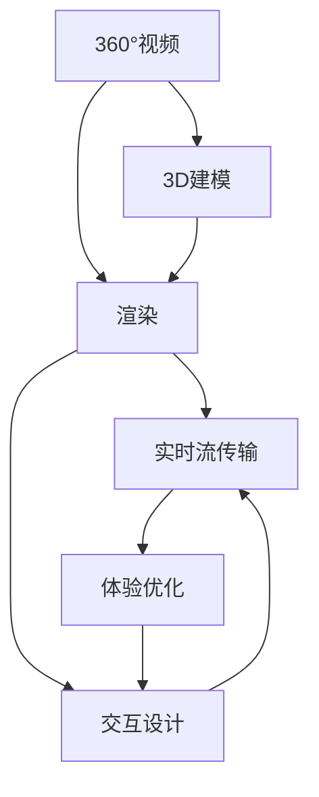

                 

# VR内容制作：360°视频与3D建模

> 关键词：虚拟现实(VR), 360°视频, 3D建模, 渲染, 实时流传输, 交互设计, 体验优化

## 1. 背景介绍

### 1.1 问题由来
近年来，随着虚拟现实(VR)技术的快速发展和普及，越来越多的企业和消费者开始探索和应用VR内容制作。在虚拟现实环境中，360°视频和3D建模是两大核心要素。360°视频能够带来身临其境的视觉体验，而3D建模则能够提供互动和沉浸的交互体验。因此，对于VR内容制作而言，360°视频和3D建模技术的发展和应用是至关重要的。

### 1.2 问题核心关键点
360°视频和3D建模技术在VR内容制作中的应用，主要涉及以下几个关键点：
- 高分辨率、沉浸感强的360°视频和3D建模的生成与渲染。
- 实时流传输和优化，确保高质量内容能够流畅地在VR设备中展示。
- 交互设计，提供自然的交互方式，增强用户的沉浸感和体验。
- 体验优化，通过技术手段和用户反馈，持续提升VR内容的品质。

这些关键点构成了360°视频和3D建模技术的研究和应用框架，使得VR内容制作能够实现高质量、高互动的沉浸体验。

## 2. 核心概念与联系

### 2.1 核心概念概述

为了更好地理解360°视频和3D建模在VR内容制作中的应用，本节将介绍几个密切相关的核心概念：

- **360°视频**：指通过全景相机拍摄的球形视频，能够提供全方位的视觉体验，让用户仿佛置身于360°环境中。360°视频在虚拟现实应用中广泛用于虚拟导览、虚拟旅游、虚拟会议等场景。

- **3D建模**：指通过计算机软件创建的三维立体模型，能够展示物体的形态、材质和纹理。3D建模在虚拟现实应用中广泛用于虚拟城市、虚拟会议、虚拟培训等场景。

- **渲染**：指将3D模型或图像转换为真实感强烈的视觉输出，通常需要高性能的图形处理器和算法支持。渲染技术在虚拟现实中用于生成逼真的3D场景和物体。

- **实时流传输**：指在VR设备中，将生成的360°视频和3D模型实时传输到用户终端，通常需要优化传输协议和算法，确保低延迟、高带宽的传输质量。

- **交互设计**：指在虚拟现实环境中，通过用户界面、手势识别等手段，实现用户与系统的自然交互，提升用户体验和参与感。

- **体验优化**：指通过不断的技术改进和用户反馈，持续提升VR内容的沉浸感和互动性，满足用户对高质量内容的期望。

这些核心概念之间的逻辑关系可以通过以下Mermaid流程图来展示：



这个流程图展示了下游VR内容制作过程中，360°视频和3D建模技术之间以及与相关技术之间的关联：

1. 360°视频和3D建模是VR内容制作的基础。
2. 两者都需要通过渲染技术将其转换为可视化的输出。
3. 实时流传输和交互设计分别处理内容传输和用户交互的部分，并最终影响体验优化。
4. 体验优化可以持续改进3D建模和渲染技术，提升整体体验。

## 3. 核心算法原理 & 具体操作步骤
### 3.1 算法原理概述

360°视频和3D建模技术在VR内容制作中的应用，主要基于计算机图形学和图像处理学的原理。其核心思想是：通过计算机软件和硬件技术，将现实世界的场景和物体以3D模型的形式展现，并通过渲染技术，使其在虚拟现实环境中以高分辨率、沉浸感强的形式呈现。

具体而言，360°视频和3D建模技术包括以下几个关键步骤：
- 收集3D场景数据，包括建筑、地形、物体等。
- 使用3D建模软件创建3D模型。
- 使用渲染引擎进行场景渲染，生成高质量的360°视频和3D模型。
- 通过实时流传输技术，将生成的内容传输到VR设备中。
- 设计自然、流畅的交互方式，提升用户体验。
- 根据用户反馈和行为数据，持续优化VR内容。

### 3.2 算法步骤详解

360°视频和3D建模技术的实现步骤主要包括以下几个环节：

**Step 1: 数据收集与处理**
- 收集3D场景数据，可以使用无人机、激光扫描仪、三维相机等设备获取。
- 对采集的数据进行处理，包括去除噪声、平滑处理、坐标对齐等。

**Step 2: 3D建模**
- 选择合适的3D建模软件，如Blender、Maya等，创建3D模型。
- 对3D模型进行材质、纹理、光照等细节处理。

**Step 3: 渲染**
- 选择合适的渲染引擎，如Unity、Unreal Engine等，进行场景渲染。
- 优化渲染参数，提高渲染效率和效果。

**Step 4: 实时流传输**
- 使用实时流传输技术，如WebRTC、RTMP等，将渲染生成的内容传输到VR设备。
- 优化传输协议和网络质量，确保低延迟、高带宽的传输。

**Step 5: 交互设计**
- 设计自然、流畅的交互方式，如手势识别、虚拟手柄等。
- 使用交互设计软件，如TouchDesigner、Unreal Motion Capture等，进行交互效果开发。

**Step 6: 体验优化**
- 根据用户反馈和行为数据，持续优化3D建模和渲染技术。
- 改进交互设计，提升用户体验。

### 3.3 算法优缺点

360°视频和3D建模技术在VR内容制作中的应用，具有以下优点：
- 沉浸感强。通过高质量的3D建模和渲染，能够提供沉浸式的视觉体验，让用户仿佛置身于虚拟世界中。
- 互动性好。通过自然、流畅的交互设计，能够实现用户与系统的互动，提升用户体验。
- 灵活性强。3D建模和渲染技术可以根据需求进行调整和优化，适应不同的应用场景。

同时，该技术也存在一定的局限性：
- 数据采集成本高。使用无人机、激光扫描仪等设备进行3D场景数据采集，成本较高。
- 渲染计算量大。高质量的渲染需要高性能的图形处理器和算法支持，计算量大、时间成本高。
- 传输带宽要求高。高分辨率的360°视频和3D模型，需要较大的带宽支持，网络环境要求较高。
- 交互复杂度高。设计自然、流畅的交互方式，需要大量的研究和开发工作。

尽管存在这些局限性，但360°视频和3D建模技术在VR内容制作中的应用，仍然是一个极具潜力和前景的领域，为虚拟现实技术的发展提供了重要的基础。

### 3.4 算法应用领域

360°视频和3D建模技术在VR内容制作中的应用，覆盖了多个领域，主要包括：

- **虚拟旅游**：使用360°视频和3D建模，为用户创建虚拟旅游场景，让用户能够在虚拟世界中游览世界各地的名胜古迹。
- **虚拟会议**：通过360°视频和3D建模，构建虚拟会议室，让用户能够在线上进行互动和交流，突破时空限制。
- **虚拟培训**：使用3D建模和渲染技术，创建虚拟培训场景，让用户能够在虚拟环境中进行技能学习和实践。
- **虚拟导览**：通过360°视频和3D建模，为用户创建虚拟导览应用，如博物馆、历史遗址等，提供深度互动的参观体验。
- **虚拟家居**：使用3D建模技术，创建虚拟家居环境，用户能够在虚拟环境中进行室内设计、家具摆放等操作。

除了上述这些常见应用场景，360°视频和3D建模技术还可以应用于虚拟教育、虚拟娱乐、虚拟商业展示等多个领域，为虚拟现实技术的应用带来了广阔的空间。

## 4. 数学模型和公式 & 详细讲解  
### 4.1 数学模型构建

本节将使用数学语言对360°视频和3D建模技术的实现过程进行更加严格的刻画。

**360°视频渲染**：
设3D场景中的每个点坐标为 $(x,y,z)$，则其在球形全景图上的映射坐标 $(r,\theta)$ 可以表示为：
$$
\begin{align*}
r &= \sqrt{x^2 + y^2 + z^2} \\
\theta &= \arctan(\frac{y}{x})
\end{align*}
$$

将每个点的三维坐标转换到球形坐标后，将其投影到全景图中，生成360°视频。

**3D模型渲染**：
设3D模型中每个面的法向量为 $(n_x, n_y, n_z)$，则其在球面上的投影向量 $(v_x, v_y, v_z)$ 可以表示为：
$$
\begin{align*}
v_x &= -n_x r \cos\theta \\
v_y &= -n_y r \cos\theta \\
v_z &= -n_z r \cos\theta
\end{align*}
$$

通过上述公式，将3D模型中的法向量转换为球面上的投影向量，并进行光照、材质、纹理等细节处理，最终生成逼真的3D场景。

### 4.2 公式推导过程

以下我们以3D模型渲染为例，推导3D模型在球面上的投影向量的计算公式。

设3D模型中每个面的法向量为 $(n_x, n_y, n_z)$，则其在球面上的投影向量 $(v_x, v_y, v_z)$ 可以表示为：
$$
\begin{align*}
v_x &= -n_x r \cos\theta \\
v_y &= -n_y r \cos\theta \\
v_z &= -n_z r \cos\theta
\end{align*}
$$

其中 $r$ 为球的半径，$\theta$ 为3D模型在球面上的角度。

根据3D几何关系，可以将3D模型在球面上的投影向量转换为3D坐标系中的向量，进而进行光照、材质、纹理等细节处理。

### 4.3 案例分析与讲解

**案例1：虚拟旅游**
- 采集大量3D场景数据，包括建筑、地形、物体等。
- 使用3D建模软件创建3D模型，并进行纹理、光照等细节处理。
- 使用渲染引擎进行场景渲染，生成高质量的360°视频和3D模型。
- 使用实时流传输技术，将渲染生成的内容传输到VR设备中。
- 设计自然、流畅的交互方式，如手势识别、虚拟手柄等。
- 根据用户反馈和行为数据，持续优化3D建模和渲染技术。

**案例2：虚拟会议**
- 使用360°视频和3D建模技术，构建虚拟会议室。
- 设计自然的交互方式，如虚拟白板、虚拟会议桌等。
- 使用实时流传输技术，将参与者的360°视频传输到会议中。
- 通过手势识别技术，实现参与者之间的互动和交流。
- 根据用户反馈和行为数据，持续优化虚拟会议体验。

## 5. 项目实践：代码实例和详细解释说明
### 5.1 开发环境搭建

在进行360°视频和3D建模的实践前，我们需要准备好开发环境。以下是使用Python进行Unity开发的环境配置流程：

1. 安装Unity：从Unity官网下载并安装Unity编辑器。
2. 安装Windows SDK：从Microsoft官网下载安装Windows SDK，用于Windows平台的编译和运行。
3. 安装C#开发环境：安装Visual Studio IDE或Visual Studio Code等C#开发环境。
4. 安装Unity插件：安装Unity的3D建模插件，如Unity Asset Store中的High Definition Runtime (HDRP)。

完成上述步骤后，即可在Unity编辑器中进行3D建模和渲染。

### 5.2 源代码详细实现

下面我们以3D建模和渲染的实现为例，给出使用Unity和C#进行3D建模和渲染的代码实现。

首先，创建一个Unity项目，并配置好3D建模插件和渲染引擎：

```python
# 创建Unity项目
mkdir 3d_modeling_project
cd 3d_modeling_project

# 安装Unity编辑器
wget -O UnityEditor.exe https://www.unity3d.com/get-unity/download
chmod +x UnityEditor.exe
./UnityEditor.exe

# 安装Unity插件
PackageExport.exe --user=YourUsername --packages=HDRP
```

接着，定义一个简单的3D模型，并进行光照、材质、纹理等细节处理：

```python
# 定义3D模型
public GameObject model;

void Start()
{
    // 创建3D模型
    GameObject model = GameObject.CreatePrimitive(PrimitiveType.Cube);
    model.transform.position = new Vector3(0, 0, 0);
    model.transform.localScale = new Vector3(1, 1, 1);
    
    // 添加材质和纹理
    model.GetComponent<MeshRenderer>().sharedMaterial = new MeshRenderer.MaterialPropertyOverrides()
    {
        {"_MainTex", ShaderProperty.<Texture2D>("_MainTex")}
    };
    
    // 添加光照
    model.GetComponent<MeshRenderer>().shadowCastingMask = 1;
    model.GetComponent<MeshRenderer>().shadowReceivingMask = 1;
    model.GetComponent<MeshRenderer>().shadow intensity = 1;
}
```

然后，定义渲染管线，并设置渲染参数：

```python
# 定义渲染管线
Shader "Custom/CustomShader"
{
    Properties
    {
        _MainTex ("Albedo (RGB)", 2D) = "white" {}
    }
    SubShader
    {
        Tags { "RenderType"="Opaque" }
        LOD 100

        CGPROGRAM
        #pragma surface surf Standard

        struct Input
        {
            float3 vertex : POSITION;
            float2 uv : TEXCOORD0;
        };

        struct Output
        {
            float4 vertex : SV_POSITION;
            float3 albedo : COLOR;
        };

        sampler2D _MainTex;
        float intensity = 1;

        void surf (inout Output output, in Input input)
        {
            float3 normal = normalize(input.vertex.xyz);
            float3 lightDir = normalize(UnityObjectToClipPos(input.vertex).xyz);
            float3 halfDir = normalize(lightDir + normalize(-input.vertex.xyz));

            float3 lightColor = _MainTex.sample(tex2D(_MainTex, input.uv)).rgb * intensity;
            output.vertex = UnityObjectToClipPos(input.vertex);
            output.albedo = lightColor;
        }
        ENDCG
    }
    FallBack "Diffuse"
}

# 应用渲染管线
model.GetComponent<MeshRenderer>().sharedMaterial.shader = Shader.Find("Custom/CustomShader");
```

最后，启动Unity编辑器进行渲染和调试：

```python
# 运行Unity编辑器
UnityEditor.exe
```

### 5.3 代码解读与分析

让我们再详细解读一下关键代码的实现细节：

**3D模型定义**：
- 使用Unity的`GameObject.CreatePrimitive`方法创建立方体3D模型，并将其位置设置为原点。
- 通过设置`model.transform.localScale`，调整3D模型的大小。

**材质和纹理添加**：
- 使用`model.GetComponent<MeshRenderer>().sharedMaterial`获取3D模型的材质，并设置纹理和颜色。
- 通过`model.GetComponent<MeshRenderer>().shadowCastingMask`和`model.GetComponent<MeshRenderer>().shadowReceivingMask`设置3D模型的阴影投射和接收属性。

**光照设置**：
- 通过`model.GetComponent<MeshRenderer>().shadow intensity`设置3D模型的阴影强度。
- 在自定义的渲染管线中，通过计算光强和3D模型法向量的夹角，调整3D模型表面的光照效果。

以上代码实现了简单的3D模型渲染，通过Unity和C#的集成，可以方便地进行3D建模和渲染。

## 6. 实际应用场景
### 6.1 虚拟旅游

虚拟旅游是一个典型的360°视频和3D建模应用场景。通过收集3D场景数据，使用3D建模软件创建3D模型，并进行纹理、光照等细节处理，可以构建出逼真的虚拟旅游场景。在虚拟旅游应用中，用户可以通过VR设备，自由探索虚拟世界，获取深度互动的体验。

### 6.2 虚拟会议

虚拟会议也是一个重要的360°视频和3D建模应用场景。使用360°视频和3D建模技术，可以创建逼真的虚拟会议室，支持多人互动和交流。通过手势识别技术，参与者可以自由操作虚拟白板、虚拟会议桌等工具，提升会议体验和效率。

### 6.3 虚拟培训

虚拟培训是一个新兴的360°视频和3D建模应用场景。使用3D建模技术，可以创建逼真的虚拟培训场景，用户可以在虚拟环境中进行技能学习和实践。通过交互设计，提供自然、流畅的交互方式，提升培训效果和用户体验。

### 6.4 虚拟导览

虚拟导览是一个典型的360°视频和3D建模应用场景。通过采集3D场景数据，使用3D建模软件创建3D模型，并进行纹理、光照等细节处理，可以构建出逼真的虚拟导览应用。用户可以通过VR设备，自由探索虚拟世界，获取深度互动的导览体验。

### 6.5 虚拟家居

虚拟家居是一个新兴的360°视频和3D建模应用场景。使用3D建模技术，可以创建逼真的虚拟家居环境，用户可以在虚拟环境中进行室内设计、家具摆放等操作。通过交互设计，提供自然、流畅的交互方式，提升家居设计体验。

## 7. 工具和资源推荐
### 7.1 学习资源推荐

为了帮助开发者系统掌握360°视频和3D建模的理论基础和实践技巧，这里推荐一些优质的学习资源：

1. **《Unity 3D游戏开发入门》**：适合初学者了解Unity基础和3D建模技术的入门书籍。
2. **《Unity 3D游戏编程》**：深入讲解Unity的3D建模、渲染和交互技术的进阶书籍。
3. **《VR技术与开发》**：详细介绍虚拟现实技术和开发方法的实战书籍。
4. **《3D图形学》**：系统讲解3D图形学的理论基础和实践技巧的经典教材。
5. **《Unity Asset Store》**：Unity官方的插件和资源库，提供了丰富的3D建模资源和工具。

通过对这些资源的学习实践，相信你一定能够快速掌握360°视频和3D建模的精髓，并用于解决实际的VR内容制作问题。

### 7.2 开发工具推荐

高效的开发离不开优秀的工具支持。以下是几款用于360°视频和3D建模开发的常用工具：

1. **Unity**：一款强大的游戏引擎，支持3D建模和渲染，适合开发VR内容。
2. **Blender**：一款开源的3D建模软件，支持多种文件格式和插件，适合创建3D模型。
3. **Maya**：一款商业级3D建模软件，功能强大，支持高精度建模和渲染。
4. **Cinema 4D**：一款专业的3D建模和动画软件，适合创建高质量的3D场景和动画。
5. **HDRP**：Unity的3D渲染引擎，支持高质量的实时渲染，适合创建逼真的3D场景。

合理利用这些工具，可以显著提升360°视频和3D建模的开发效率，加快创新迭代的步伐。

### 7.3 相关论文推荐

360°视频和3D建模技术的发展源于学界的持续研究。以下是几篇奠基性的相关论文，推荐阅读：

1. **"Real-Time Rendering in Unity Engine"**：详细讲解Unity引擎的渲染技术和优化方法。
2. **"Real-Time 3D Modeling and Rendering Techniques"**：介绍3D建模和实时渲染技术的最新进展。
3. **"Virtual Reality: A Survey"**：综述虚拟现实技术和应用，提供全面的理论和技术指导。
4. **"360-Degree Video and 3D Modeling for Virtual Reality"**：探讨360°视频和3D建模在虚拟现实中的应用。
5. **"Interactive 3D Modeling and Rendering"**：深入研究3D建模和渲染的交互设计和技术实现。

这些论文代表了大规模语言模型微调技术的发展脉络。通过学习这些前沿成果，可以帮助研究者把握学科前进方向，激发更多的创新灵感。

## 8. 总结：未来发展趋势与挑战

### 8.1 总结

本文对360°视频和3D建模技术在VR内容制作中的应用进行了全面系统的介绍。首先阐述了360°视频和3D建模技术的研究背景和意义，明确了其在大规模VR内容制作中的重要性。其次，从原理到实践，详细讲解了360°视频和3D建模的数学模型和关键步骤，给出了代码实例和详细解释。同时，本文还广泛探讨了360°视频和3D建模技术在虚拟旅游、虚拟会议、虚拟培训等多个领域的应用前景，展示了其广阔的发展空间。此外，本文精选了360°视频和3D建模技术的各类学习资源，力求为读者提供全方位的技术指引。

通过本文的系统梳理，可以看到，360°视频和3D建模技术在VR内容制作中具有广阔的应用前景和巨大的发展潜力。未来，伴随技术的不断进步和创新，VR内容制作必将更加丰富和多样，为虚拟现实技术的应用带来更多的可能性。

### 8.2 未来发展趋势

展望未来，360°视频和3D建模技术的发展趋势主要包括以下几个方面：

1. **高分辨率和实时渲染**：随着硬件性能的提升和算法优化，360°视频和3D模型的分辨率将进一步提高，实时渲染的效果将更加逼真。
2. **增强交互性**：未来的交互设计将更加自然、流畅，通过手势识别、虚拟手柄等手段，增强用户的沉浸感和体验。
3. **多模态融合**：将360°视频和3D建模技术与语音识别、脑机接口等技术结合，实现更加全面的人机交互。
4. **个性化定制**：通过用户行为数据，实现360°视频和3D模型的个性化定制，提升用户的沉浸感和参与感。
5. **跨平台应用**：将360°视频和3D建模技术应用于更多的设备平台，如手机、平板等，拓展其应用范围。

这些趋势凸显了360°视频和3D建模技术的广阔前景。这些方向的探索发展，必将进一步提升VR内容的品质和用户体验，为虚拟现实技术的发展注入新的动力。

### 8.3 面临的挑战

尽管360°视频和3D建模技术在VR内容制作中已经取得了显著成就，但在迈向更加智能化、普适化应用的过程中，仍面临诸多挑战：

1. **数据采集成本高**：使用无人机、激光扫描仪等设备进行3D场景数据采集，成本较高。
2. **渲染计算量大**：高质量的渲染需要高性能的图形处理器和算法支持，计算量大、时间成本高。
3. **传输带宽要求高**：高分辨率的360°视频和3D模型，需要较大的带宽支持，网络环境要求较高。
4. **交互复杂度高**：设计自然、流畅的交互方式，需要大量的研究和开发工作。

尽管存在这些局限性，但随着技术的不断进步和创新，这些挑战终将一一被克服，360°视频和3D建模技术必将为VR内容制作带来更多的可能性。

### 8.4 研究展望

面对360°视频和3D建模技术所面临的挑战，未来的研究需要在以下几个方面寻求新的突破：

1. **高效渲染算法**：开发更加高效的渲染算法，优化渲染管线和参数，降低渲染计算量。
2. **多设备支持**：将360°视频和3D建模技术应用于更多的设备平台，提升设备的兼容性和用户体验。
3. **跨平台优化**：优化3D建模和渲染技术，支持多设备、多平台的跨平台应用。
4. **交互设计改进**：通过机器学习等技术，设计更加自然、流畅的交互方式，提升用户体验。
5. **多模态融合**：将360°视频和3D建模技术与语音识别、脑机接口等技术结合，实现更加全面的人机交互。

这些研究方向的探索，必将引领360°视频和3D建模技术迈向更高的台阶，为VR内容制作带来更多的创新和突破。

## 9. 附录：常见问题与解答

**Q1: 360°视频和3D建模技术在VR内容制作中需要哪些硬件设备？**

A: 360°视频和3D建模技术在VR内容制作中需要高性能的图形处理器（如GPU）、大容量存储设备（如SSD）和高速网络设备（如以太网）等。此外，还需要VR设备（如头戴显示器、手柄等）和实时流传输设备（如服务器、路由器等）。

**Q2: 360°视频和3D建模技术的渲染效率如何？**

A: 360°视频和3D建模技术的渲染效率受到多方面因素的影响，包括渲染管线的优化、渲染参数的设置、硬件性能等。通常情况下，通过优化渲染管线和参数，可以显著提升渲染效率。例如，使用高质量的渲染引擎（如Unity、Unreal Engine等），结合硬件加速技术（如CUDA、OpenGL等），可以提升渲染性能。

**Q3: 360°视频和3D建模技术的交互设计有哪些特点？**

A: 360°视频和3D建模技术的交互设计具有以下特点：
- 自然性：通过手势识别、虚拟手柄等手段，实现自然、流畅的交互方式。
- 沉浸性：通过虚拟现实技术，让用户仿佛置身于虚拟环境中，提升沉浸感。
- 可定制性：通过用户行为数据，实现个性化定制，提升用户体验。

**Q4: 360°视频和3D建模技术在实际应用中需要注意哪些问题？**

A: 360°视频和3D建模技术在实际应用中需要注意以下问题：
- 数据采集成本：使用无人机、激光扫描仪等设备进行3D场景数据采集，成本较高。
- 渲染计算量：高质量的渲染需要高性能的图形处理器和算法支持，计算量大、时间成本高。
- 传输带宽要求：高分辨率的360°视频和3D模型，需要较大的带宽支持，网络环境要求较高。
- 交互复杂度：设计自然、流畅的交互方式，需要大量的研究和开发工作。

**Q5: 360°视频和3D建模技术的未来发展方向有哪些？**

A: 360°视频和3D建模技术的未来发展方向主要包括以下几个方面：
- 高分辨率和实时渲染：随着硬件性能的提升和算法优化，360°视频和3D模型的分辨率将进一步提高，实时渲染的效果将更加逼真。
- 增强交互性：未来的交互设计将更加自然、流畅，通过手势识别、虚拟手柄等手段，增强用户的沉浸感和体验。
- 多模态融合：将360°视频和3D建模技术与语音识别、脑机接口等技术结合，实现更加全面的人机交互。
- 个性化定制：通过用户行为数据，实现360°视频和3D模型的个性化定制，提升用户的沉浸感和参与感。
- 跨平台应用：将360°视频和3D建模技术应用于更多的设备平台，如手机、平板等，拓展其应用范围。

这些研究方向凸显了360°视频和3D建模技术的广阔前景，必将进一步提升VR内容的品质和用户体验，为虚拟现实技术的发展注入新的动力。

---

作者：禅与计算机程序设计艺术 / Zen and the Art of Computer Programming

