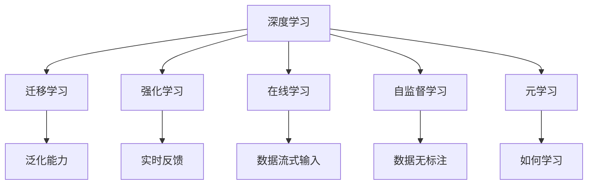

                 

# VUCA时代,快速学习成为制胜关键

## 1. 背景介绍

### 1.1 问题由来

我们正处在一个复杂、易变、不确定、模糊（VUCA）的时代。无论是企业还是个人，都在努力适应快速变化的商业环境。技术的迭代、市场的竞争、消费者行为的变化等因素，使得各个领域都在寻求新方法以提升竞争力和抗风险能力。

在这纷繁复杂的时代，快速学习和持续提升的能力变得愈发重要。特别是在科技和业务融合程度愈加紧密的今天，仅凭传统教育体系和经验积累已难以满足高要求的竞争环境。更快捷、高效、灵活的学习方式成为企业和个人的刚需。

### 1.2 问题核心关键点

在VUCA时代，快速学习面临以下几个核心挑战：

- **变化速度快**：科技革新、市场动态、消费者偏好等都处于快速变化中，要求学习者能够迅速捕捉变化，快速掌握新知识。
- **信息过载**：海量信息的涌现使得信息筛选、筛选与判断变得困难。
- **个性化需求**：不同用户和组织的学习需求和目标存在差异，需要针对性地提供定制化学习方案。
- **深度学习**：仅靠表层知识难以应对复杂问题，需深度理解和应用领域知识。
- **实践能力**：理论知识的积累最终要转化为实践能力，提高实际工作效能。

### 1.3 问题研究意义

探讨快速学习的理论和实践方法，对于提升组织和个人在VUCA环境中的竞争力和适应力具有重要意义：

1. **提升敏捷性**：快速学习和适应能力能够帮助组织快速响应市场变化，抓住商业机会。
2. **增强创新能力**：深度理解和应用知识可以激发新的创意和解决方案，促进技术创新和商业模式的变革。
3. **优化决策质量**：基于数据和专业知识做出更准确、更快速的决策，降低决策风险。
4. **提高效率**：高效的学习方法可以显著缩短知识获取时间，减少决策周期，提升整体工作效率。

## 2. 核心概念与联系

### 2.1 核心概念概述

要理解在VUCA时代如何快速学习，首先需要明确几个核心概念：

- **深度学习（Deep Learning）**：一种基于神经网络的学习方法，能处理高维度、复杂数据结构，自适应地发现数据中的深层特征。
- **迁移学习（Transfer Learning）**：利用已有知识在新任务上快速学习，减少重复训练。
- **强化学习（Reinforcement Learning）**：通过试错反馈不断优化模型，在动态环境中持续提升表现。
- **在线学习（Online Learning）**：数据不断流式地输入模型，模型实时调整参数。
- **自监督学习（Self-supervised Learning）**：在没有标注数据的情况下，利用数据自身特性进行学习。
- **元学习（Meta-learning）**：通过学习如何学习，提高学习新任务的效率。
- **泛化能力（Generalization）**：模型能在新数据上保持良好性能。

这些概念共同构成了VUCA时代快速学习的框架，通过互相结合和优化，可以提升学习效率和质量。

### 2.2 核心概念原理和架构的 Mermaid 流程图



通过这些关键技术，可以在快速变化的环境中，灵活高效地获取和应用知识。

## 3. 核心算法原理 & 具体操作步骤

### 3.1 算法原理概述

在VUCA时代，快速学习需要结合多种算法和技术，实现高效、个性化的知识获取和应用。以下是一些核心算法原理：

- **深度学习**：通过多层神经网络捕捉复杂非线性关系，提取深层次特征。
- **迁移学习**：利用已有知识在新任务上快速学习，减少新任务训练时间。
- **强化学习**：通过反馈不断优化模型，适应动态环境。
- **在线学习**：实时调整模型参数，适应数据变化。
- **自监督学习**：利用未标注数据进行学习，获取隐含的知识。
- **元学习**：学习如何快速学习，提高学习效率。

### 3.2 算法步骤详解

快速学习可以按照以下步骤进行：

**Step 1: 数据准备与预处理**

1. 收集和整理数据集。
2. 进行数据清洗和标准化处理。
3. 应用特征工程，提取有用的特征。

**Step 2: 选择模型和算法**

1. 根据任务需求选择适合的深度学习模型。
2. 选择迁移学习、强化学习、在线学习等算法。
3. 选择自监督学习技术，如无监督预训练。

**Step 3: 训练和优化**

1. 应用训练集进行模型训练，最小化损失函数。
2. 利用验证集调整超参数，优化模型性能。
3. 应用正则化技术，防止过拟合。
4. 应用集成学习，提高泛化能力。

**Step 4: 评估和部署**

1. 在测试集上评估模型性能。
2. 部署模型到实际应用环境。
3. 实时监控模型表现，持续优化。

**Step 5: 反馈与迭代**

1. 收集实际应用中的反馈信息。
2. 根据反馈信息调整模型和算法。
3. 进行迭代优化，提升模型表现。

### 3.3 算法优缺点

快速学习的算法具有以下优点：

- **高效性**：能够快速适应数据变化，优化模型表现。
- **灵活性**：可以根据不同任务需求选择不同的算法和技术。
- **自适应性**：能够处理动态变化的环境。

同时，快速学习也存在以下缺点：

- **数据依赖性强**：需要高质量、大量数据进行训练。
- **计算资源消耗大**：深度学习模型的训练和优化需要大量计算资源。
- **复杂度高**：多算法结合增加了模型设计的复杂性。
- **稳定性不足**：模型在新的、未见过的数据上表现可能不稳定。

### 3.4 算法应用领域

快速学习在多个领域都有广泛应用，例如：

- **人工智能**：提升机器学习模型的性能，加速模型迭代。
- **金融科技**：实时分析和预测市场变化，提升投资回报率。
- **医疗健康**：快速诊断和处理患者数据，提高医疗服务效率。
- **自动驾驶**：实时优化驾驶策略，提升行车安全。
- **游戏开发**：根据玩家行为实时调整游戏参数，提升游戏体验。

## 4. 数学模型和公式 & 详细讲解

### 4.1 数学模型构建

基于深度学习的快速学习模型通常包括多层神经网络，其中最典型的是卷积神经网络（CNN）和循环神经网络（RNN）。

以CNN为例，模型输入为 $x$，输出为 $y$，模型参数为 $\theta$。假设使用交叉熵损失函数 $\mathcal{L}$，则模型训练目标为：

$$
\min_{\theta} \mathcal{L}(y,\hat{y}) = \min_{\theta} -\frac{1}{N} \sum_{i=1}^N y_i \log \hat{y}_i
$$

其中 $y_i$ 为真实标签，$\hat{y}_i$ 为模型预测值。

### 4.2 公式推导过程

**Step 1: 损失函数推导**

- **交叉熵损失**：$$\mathcal{L}(y,\hat{y}) = -\frac{1}{N} \sum_{i=1}^N y_i \log \hat{y}_i$$
- **均方误差损失**：$$\mathcal{L}(y,\hat{y}) = \frac{1}{N} \sum_{i=1}^N (y_i - \hat{y}_i)^2$$

**Step 2: 梯度下降法推导**

- **梯度下降更新**：$$\theta_k \leftarrow \theta_k - \eta \nabla_{\theta_k} \mathcal{L}$$
- **批量梯度下降**：$$\theta_k \leftarrow \theta_k - \eta \frac{1}{m} \sum_{i=1}^m \nabla_{\theta_k} \mathcal{L}(x_i)$$

其中 $\eta$ 为学习率，$m$ 为批量大小。

**Step 3: 正则化推导**

- **L2正则**：$$\mathcal{L}_{\text{reg}}(\theta) = \frac{\lambda}{2} \sum_{k=1}^{K} \theta_k^2$$
- **Dropout**：$$\mathcal{L}_{\text{drop}} = \frac{1}{N} \sum_{i=1}^N \sum_{j=1}^n [y_{ij} \log \hat{y}_{ij} + (1-y_{ij}) \log (1-\hat{y}_{ij})]$$

其中 $\lambda$ 为正则化系数，$n$ 为样本数。

### 4.3 案例分析与讲解

以图像识别任务为例，使用CNN模型进行快速学习：

- **数据准备**：准备图像数据集，进行预处理（如归一化、裁剪等）。
- **模型选择**：选择LeNet、AlexNet等CNN模型。
- **模型训练**：应用交叉熵损失，使用SGD优化器进行训练。
- **参数调整**：调整学习率、正则化参数等，优化模型性能。
- **评估与优化**：在测试集上评估模型性能，应用集成学习提高泛化能力。

## 5. 项目实践：代码实例和详细解释说明

### 5.1 开发环境搭建

在进行快速学习项目开发前，需要准备合适的开发环境。以下是基于Python的开发环境配置流程：

1. 安装Anaconda：从官网下载并安装Anaconda，用于创建独立的Python环境。
2. 创建并激活虚拟环境：
   ```bash
   conda create -n pytorch-env python=3.8 
   conda activate pytorch-env
   ```
3. 安装PyTorch：根据CUDA版本，从官网获取对应的安装命令。例如：
   ```bash
   conda install pytorch torchvision torchaudio cudatoolkit=11.1 -c pytorch -c conda-forge
   ```
4. 安装TensorFlow：
   ```bash
   pip install tensorflow
   ```
5. 安装各类工具包：
   ```bash
   pip install numpy pandas scikit-learn matplotlib tqdm jupyter notebook ipython
   ```

完成上述步骤后，即可在`pytorch-env`环境中开始快速学习项目开发。

### 5.2 源代码详细实现

以下是使用PyTorch进行图像识别任务快速学习的代码实现：

```python
import torch
import torch.nn as nn
import torch.optim as optim
from torch.utils.data import DataLoader, Dataset
from torchvision import transforms, models

class ImageDataset(Dataset):
    def __init__(self, data_dir, transform=None):
        self.data_dir = data_dir
        self.transform = transform
        self.class_names = ['airplane', 'automobile', 'bird', 'cat', 'deer', 'dog', 'frog', 'horse', 'ship', 'truck']
        self.data = [os.path.join(self.data_dir, c) for c in self.class_names]
        self.file_names = []
        for class_idx, class_name in enumerate(self.class_names):
            for filename in os.listdir(self.data[class_idx]):
                if filename.endswith('.jpg'):
                    self.file_names.append(os.path.join(self.data[class_idx], filename))
        self.file_names = random.sample(self.file_names, len(self.file_names))

    def __len__(self):
        return len(self.file_names)

    def __getitem__(self, idx):
        img_path = self.file_names[idx]
        img = Image.open(img_path)
        if self.transform is not None:
            img = self.transform(img)
        return img

class ImageNetDataset(ImageDataset):
    def __init__(self, data_dir, transform=None):
        super().__init__(data_dir, transform)
        self.class_names = ['n0', 'n1', 'n2', 'n3', 'n4', 'n5', 'n6', 'n7', 'n8', 'n9']
        self.data = [os.path.join(self.data_dir, c) for c in self.class_names]
        self.file_names = []
        for class_idx, class_name in enumerate(self.class_names):
            for filename in os.listdir(self.data[class_idx]):
                if filename.endswith('.jpg'):
                    self.file_names.append(os.path.join(self.data[class_idx], filename))
        self.file_names = random.sample(self.file_names, len(self.file_names))

    def __getitem__(self, idx):
        img_path = self.file_names[idx]
        img = Image.open(img_path)
        if self.transform is not None:
            img = self.transform(img)
        return img

class Net(nn.Module):
    def __init__(self):
        super().__init__()
        self.conv1 = nn.Conv2d(3, 6, 5)
        self.pool = nn.MaxPool2d(2, 2)
        self.conv2 = nn.Conv2d(6, 16, 5)
        self.fc1 = nn.Linear(16 * 5 * 5, 120)
        self.fc2 = nn.Linear(120, 84)
        self.fc3 = nn.Linear(84, 10)

    def forward(self, x):
        x = self.pool(F.relu(self.conv1(x)))
        x = self.pool(F.relu(self.conv2(x)))
        x = x.view(-1, 16 * 5 * 5)
        x = F.relu(self.fc1(x))
        x = F.relu(self.fc2(x))
        x = self.fc3(x)
        return x

# 定义超参数
lr = 0.001
batch_size = 64
epochs = 10
transform = transforms.Compose([transforms.ToTensor()])

# 加载数据集
train_dataset = ImageDataset('/path/to/train', transform)
test_dataset = ImageDataset('/path/to/test', transform)

# 定义模型和优化器
model = Net()
criterion = nn.CrossEntropyLoss()
optimizer = optim.SGD(model.parameters(), lr=lr, momentum=0.9)

# 训练模型
for epoch in range(epochs):
    for batch_idx, (data, target) in enumerate(train_loader):
        optimizer.zero_grad()
        output = model(data)
        loss = criterion(output, target)
        loss.backward()
        optimizer.step()

    # 在测试集上评估模型
    with torch.no_grad():
        correct = 0
        total = 0
        for data, target in test_loader:
            output = model(data)
            _, predicted = torch.max(output.data, 1)
            total += target.size(0)
            correct += (predicted == target).sum().item()

    print('Epoch %d, Loss: %.4f, Accuracy: %.2f %%' % (epoch+1, loss, 100 * correct / total))

# 测试集上评估模型性能
with torch.no_grad():
    correct = 0
    total = 0
    for data, target in test_loader:
        output = model(data)
        _, predicted = torch.max(output.data, 1)
        total += target.size(0)
        correct += (predicted == target).sum().item()

    print('Test Accuracy: %.2f %%' % (100 * correct / total))
```

### 5.3 代码解读与分析

以下是关键代码的解读：

**ImageDataset类**：
- `__init__`方法：初始化数据路径、分类标签、数据列表。
- `__len__`方法：返回数据集的样本数量。
- `__getitem__`方法：对单个样本进行处理，将图像转换为Tensor，并应用数据转换函数。

**Net类**：
- `__init__`方法：定义模型结构，包括卷积层、池化层、全连接层。
- `forward`方法：定义前向传播过程，将输入通过卷积、池化、全连接层进行特征提取和分类。

**训练流程**：
- `for epoch in range(epochs)`: 外层循环控制训练的轮数。
- `for batch_idx, (data, target) in enumerate(train_loader)`: 内层循环对数据集进行批量处理，前向传播计算输出和损失。
- `optimizer.zero_grad()`: 梯度清零。
- `loss.backward()`: 反向传播计算梯度。
- `optimizer.step()`: 更新模型参数。

**评估流程**：
- `with torch.no_grad()`: 关闭梯度计算，避免在评估过程中更新参数。
- `correct = 0`: 初始化正确预测计数。
- `total = 0`: 初始化总样本数计数。
- 在每个batch上进行前向传播，计算预测值和目标值之间的准确率。
- 最后打印测试集上的准确率。

## 6. 实际应用场景

### 6.1 智能推荐系统

在智能推荐系统中，快速学习可以显著提升推荐系统的实时性和个性化程度。通过分析用户的浏览记录、兴趣标签、社交网络等数据，构建实时推荐模型，能够快速更新用户画像，匹配最新的推荐需求。

### 6.2 金融分析

金融领域数据量庞大且动态性强，快速学习可以实时分析市场变化，预测金融趋势，提升投资决策的准确性和效率。

### 6.3 医疗诊断

医疗领域需要快速诊断和处理患者数据，快速学习能够实时提取患者信息，提供初步诊断和治疗建议，帮助医生快速决策。

### 6.4 自动驾驶

自动驾驶系统需要实时感知和理解周围环境，快速学习能够实时优化决策模型，提高行驶安全和稳定性。

### 6.5 聊天机器人

聊天机器人需要实时响应用户输入，快速学习能够根据用户对话历史，快速生成个性化的回答，提升用户体验。

## 7. 工具和资源推荐

### 7.1 学习资源推荐

为了帮助开发者系统掌握快速学习的理论基础和实践技巧，以下是一些优质的学习资源：

1. 《深度学习》：Ian Goodfellow等人著作的经典书籍，全面介绍了深度学习的原理和应用。
2. Coursera《深度学习专项课程》：由吴恩达教授开设的深度学习课程，系统讲解了深度学习的基础理论和实践方法。
3. TensorFlow官方文档：详细介绍了TensorFlow的使用方法和最佳实践。
4. PyTorch官方文档：提供了PyTorch的全面介绍和使用指南。
5. Kaggle平台：提供大量数据集和竞赛，是学习和实践深度学习的好地方。
6. GitHub：搜索和学习开源项目，学习社区的最佳实践。

### 7.2 开发工具推荐

高效的开发离不开优秀的工具支持。以下是几款用于快速学习开发的常用工具：

1. PyTorch：基于Python的开源深度学习框架，灵活动态的计算图，适合快速迭代研究。
2. TensorFlow：由Google主导开发的开源深度学习框架，生产部署方便，适合大规模工程应用。
3. Jupyter Notebook：交互式开发环境，支持代码单元格和实时运行结果。
4. VSCode：支持多种编程语言的代码编辑器，方便代码编写和调试。
5. Git：版本控制系统，支持代码协作和版本控制。
6. Docker：容器化技术，方便模型部署和维护。

### 7.3 相关论文推荐

快速学习的相关论文已经得到了大量研究人员的关注，以下是一些奠基性的相关论文，推荐阅读：

1. AlexNet: ImageNet Classification with Deep Convolutional Neural Networks：介绍卷积神经网络的经典论文。
2. ResNet: Deep Residual Learning for Image Recognition：提出残差网络，解决了深度神经网络训练过程中的梯度消失问题。
3. GANs for Image-to-Image Translation：介绍生成对抗网络，用于图像生成和转换。
4. Deep Reinforcement Learning for Healthcare Analytics：介绍强化学习在医疗数据分析中的应用。
5. Online Learning in Deep Neurual Networks：介绍在线学习理论基础和应用。

这些论文代表了快速学习领域的最新进展，通过学习这些前沿成果，可以帮助研究者把握学科前进方向，激发更多的创新灵感。

## 8. 总结：未来发展趋势与挑战

### 8.1 总结

本文对VUCA时代如何快速学习进行了全面系统的介绍。首先阐述了快速学习的重要性，明确了快速学习在适应快速变化环境中的独特价值。其次，从原理到实践，详细讲解了深度学习、迁移学习、强化学习等算法，给出了快速学习任务开发的完整代码实例。同时，本文还广泛探讨了快速学习方法在智能推荐、金融分析、医疗诊断等多个领域的应用前景，展示了快速学习范式的巨大潜力。此外，本文精选了快速学习技术的各类学习资源，力求为读者提供全方位的技术指引。

通过本文的系统梳理，可以看到，在VUCA时代，快速学习成为了企业和个人提升竞争力和适应力的重要手段。未来，伴随深度学习、强化学习、在线学习等技术的持续演进，快速学习将不断拓展应用范围，带来更多的创新和突破。

### 8.2 未来发展趋势

展望未来，快速学习技术将呈现以下几个发展趋势：

1. **自动化学习**：通过自动化学习工具，减少人工干预，提高学习效率。
2. **自适应学习**：学习算法能够根据环境变化，自适应调整模型参数和策略。
3. **多模态学习**：将图像、声音、文本等多模态数据融合，提高学习效果。
4. **分布式学习**：通过分布式计算，提高学习效率，减少资源消耗。
5. **元学习**：通过学习如何快速学习，提高学习新任务的效率。
6. **迁移学习**：利用已有知识在新任务上快速学习，减少重复训练。
7. **在线学习**：数据流式输入，实时调整模型参数。
8. **多任务学习**：同时训练多个相关任务，提高泛化能力。

以上趋势凸显了快速学习技术的广阔前景。这些方向的探索发展，必将进一步提升学习效率和质量，为构建智能系统提供强大动力。

### 8.3 面临的挑战

尽管快速学习技术已经取得了瞩目成就，但在迈向更加智能化、普适化应用的过程中，它仍面临着诸多挑战：

1. **数据质量**：快速学习依赖大量高质量数据，数据质量差会影响学习效果。
2. **计算资源**：深度学习模型需要大量计算资源，硬件瓶颈成为限制。
3. **模型复杂度**：模型结构复杂，难以调试和维护。
4. **泛化能力**：模型在新数据上表现可能不稳定，泛化能力不足。
5. **稳定性**：模型在动态环境中的稳定性有待提高。
6. **安全性**：模型可能学习到有害信息，需要保障数据和模型安全。

### 8.4 研究展望

面对快速学习面临的挑战，未来的研究需要在以下几个方面寻求新的突破：

1. **数据增强**：提高数据质量，增加数据多样性。
2. **模型压缩**：优化模型结构，减少计算资源消耗。
3. **迁移学习**：利用已有知识，提高学习效率。
4. **自适应学习**：根据环境变化，调整学习策略。
5. **多模态融合**：提高多模态数据的学习效果。
6. **强化学习**：利用实时反馈，优化模型表现。
7. **在线学习**：实时调整模型参数，提高学习效率。
8. **元学习**：学习如何快速学习，提高学习效率。
9. **安全性**：过滤有害信息，保障数据和模型安全。

这些研究方向的探索，必将引领快速学习技术迈向更高的台阶，为构建智能系统提供更强大的支持。面向未来，快速学习技术还需要与其他人工智能技术进行更深入的融合，如知识表示、因果推理、强化学习等，多路径协同发力，共同推动快速学习技术的进步。只有勇于创新、敢于突破，才能不断拓展快速学习的边界，让智能技术更好地服务于社会。

## 9. 附录：常见问题与解答

**Q1: 快速学习和传统学习的区别是什么？**

A: 快速学习通过实时数据分析和模型调整，能够快速适应环境变化，而传统学习需要经过多次迭代训练，适应性较慢。

**Q2: 如何在VUCA环境中保持模型稳定性？**

A: 应用正则化技术、Dropout、对抗训练等手段，防止模型过拟合。同时，持续收集新数据，进行在线学习，不断更新模型参数。

**Q3: 如何提高快速学习模型的泛化能力？**

A: 应用集成学习、多任务学习、迁移学习等技术，提高模型在新数据上的泛化能力。

**Q4: 如何优化快速学习算法的计算资源消耗？**

A: 应用模型压缩、稀疏化存储等技术，减少模型参数量和内存占用。同时，采用分布式学习，提高计算效率。

**Q5: 如何在快速学习中保证数据安全？**

A: 应用数据脱敏、访问鉴权等手段，保护数据隐私和安全。同时，对模型输出进行审查和监控，防止有害信息输出。

通过以上系统介绍，相信读者对VUCA时代如何快速学习有更深刻的理解和实践指导。未来，快速学习技术将不断发展和演进，为构建智能系统提供更强大的支撑。面向未来，我们应不断探索和创新，不断推动快速学习技术的进步。

