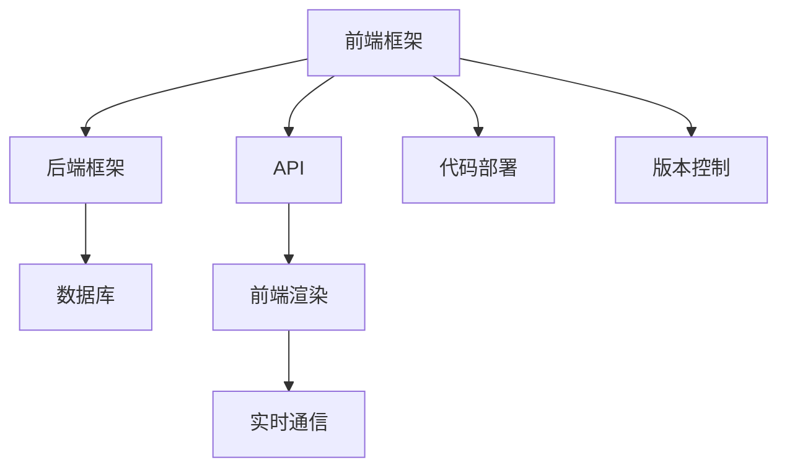

                 

# Web 全栈开发：构建动态网站

## 1. 背景介绍

### 1.1 问题由来
随着互联网技术的发展，Web应用场景日益丰富，从简单的静态页面到复杂的动态应用，从简单的Web应用到全面的云计算服务，Web开发逐渐演进为全栈开发。全栈开发不仅要求开发者掌握前端、后端、数据库等关键技术，还要具备设计、测试、部署等综合能力，以构建完整、高效、灵活的Web应用。

全栈开发的应用范围广泛，从简单的博客系统、在线商城到复杂的社交网络、大数据平台，全栈开发都能提供一站式解决方案。随着前端技术的发展，如JavaScript、Vue、React等，Web应用越来越多地呈现出动态化、交互式等特点，对后端开发也提出了更高的要求。

### 1.2 问题核心关键点
全栈开发的核心在于如何将前端和后端技术无缝结合，构建出高效、可靠、易维护的动态网站。关键点包括：
- 前端框架的选择：选择合适的框架能够提升开发效率，如Vue、React、Angular等。
- 后端框架的选择：选择合适的后端框架能够提升开发效率，如Node.js、Django、Ruby on Rails等。
- 数据库的选择：选择合适的数据库能够提升系统性能，如MySQL、PostgreSQL、MongoDB等。
- 前端和后端通信：采用合适的通信方式能够提高系统效率，如RESTful API、GraphQL、WebSockets等。
- 代码部署与维护：采用合适的部署方式能够提高系统可维护性，如容器化、CI/CD、DevOps等。

## 2. 核心概念与联系

### 2.1 核心概念概述

为更好地理解全栈开发的过程，本节将介绍几个密切相关的核心概念：

- MVC架构：Model-View-Controller 是一种流行的Web应用架构，将数据处理、UI渲染、用户交互分离开来，便于开发、测试、维护。
- RESTful API：基于REST原则设计的Web API，支持CRUD操作，易于与其他系统集成。
- GraphQL：一种用于API的查询语言，支持灵活的查询方式，提升系统灵活性。
- WebSockets：一种用于实现实时通信的协议，支持服务器推送和客户端事件驱动，提升交互性。
- Docker：一种容器化技术，支持应用、服务、数据库等在内的全栈部署，便于部署、迁移和扩展。
- Git：一种版本控制系统，支持代码的协作开发和版本控制，便于团队管理和代码回滚。

这些核心概念之间的逻辑关系可以通过以下Mermaid流程图来展示：



这个流程图展示的全栈开发的核心概念及其之间的关系：

1. 前端框架与后端框架协同工作，处理用户交互和数据展示。
2. 后端框架与数据库协同工作，处理数据存储和业务逻辑。
3. RESTful API、GraphQL、WebSockets等通信技术提升数据交互效率。
4. Docker、Git等部署和版本控制技术提升系统部署和管理效率。

## 3. 核心算法原理 & 具体操作步骤
### 3.1 算法原理概述

全栈开发的核心在于前端和后端的无缝结合，通过API将数据从后端传递到前端，最终呈现给用户。这一过程涉及多个组件的协同工作，通过合理的架构设计，能够提升系统性能和可维护性。

具体来说，全栈开发的过程包括：
- 前端框架的搭建：选择合适的框架，设计界面布局和组件功能。
- 后端框架的搭建：选择合适的框架，设计数据模型和业务逻辑。
- API的搭建：设计API接口，实现前后端的通信。
- 数据库的搭建：选择合适的数据库，设计数据表结构和关系。
- 实时通信的搭建：选择合适的通信方式，实现实时推送和交互。
- 代码部署和版本控制的搭建：选择合适的工具，实现代码的自动部署和版本控制。

### 3.2 算法步骤详解

以下是全栈开发的基本步骤，以及每个步骤的具体操作：

**Step 1: 前端框架选择**
- 选择合适的框架：根据项目需求和团队技术栈，选择适合的前端框架，如Vue、React、Angular等。
- 搭建框架：使用脚手架工具或现有项目作为模板，快速搭建前端框架。

**Step 2: 后端框架选择**
- 选择合适的框架：根据项目需求和团队技术栈，选择适合的Web框架，如Node.js、Django、Ruby on Rails等。
- 搭建框架：配置Web框架，安装必要的依赖库，设计数据模型和业务逻辑。

**Step 3: API接口设计**
- 设计接口：根据前端需求，设计RESTful API或GraphQL接口，支持CRUD操作。
- 实现接口：编写API接口的代码，处理请求和响应，提供数据服务。

**Step 4: 数据库搭建**
- 选择合适的数据库：根据项目需求和数据特点，选择适合的数据库，如MySQL、PostgreSQL、MongoDB等。
- 搭建数据库：安装数据库软件，创建数据表和索引，设计数据模型和关系。

**Step 5: 实时通信搭建**
- 选择合适的通信方式：根据项目需求和交互特点，选择合适的通信方式，如RESTful API、GraphQL、WebSockets等。
- 实现通信：编写通信代码，处理实时消息的推送和接收，提升系统交互性。

**Step 6: 代码部署与版本控制**
- 选择合适的部署方式：根据项目需求和资源条件，选择合适的部署方式，如Docker、Kubernetes、CI/CD等。
- 实现部署：配置部署环境，编写自动化部署脚本，实现应用的快速部署和升级。
- 版本控制：使用Git进行代码版本控制，记录变更历史，便于协作开发和回滚修复。

**Step 7: 测试与调试**
- 编写测试用例：根据需求和设计，编写前端和后端的测试用例，覆盖关键功能。
- 自动化测试：使用测试框架和工具，自动化执行测试用例，确保系统稳定性。
- 调试问题：根据测试结果，定位和修复系统问题，提升系统可靠性。

### 3.3 算法优缺点

全栈开发的优势在于能够更好地整合前后端技术，提升开发效率和系统性能，具体优点包括：
- 前后端协同：前后端协同开发，便于理解需求和设计实现，减少沟通成本。
- 数据统一管理：统一的数据模型和管理方式，便于数据一致性和安全性控制。
- 性能优化：合理的架构设计，能够提升系统性能和响应速度，满足高并发和高负载要求。
- 可维护性高：统一的代码和部署方式，便于版本管理和系统维护，提升系统稳定性和可靠性。

同时，全栈开发也存在一些缺点：
- 技术难度高：需要掌握前后端多门技术，技术栈复杂。
- 学习成本高：需要投入大量时间和精力学习新技术和工具，存在学习曲线。
- 部署复杂：多组件协同工作，部署和调试过程较为复杂。
- 扩展困难：代码量大、组件多，扩展和重构难度大。

尽管存在这些局限性，但全栈开发仍然是Web应用开发的主流范式。未来相关研究的重点在于如何进一步简化开发流程，提升开发效率，同时兼顾可维护性和扩展性等因素。

### 3.4 算法应用领域

全栈开发在Web应用开发中具有广泛的应用，覆盖了几乎所有类型的Web应用，例如：

- 博客系统：前端显示文章列表、阅读详情、评论互动，后端处理文章发布、评论管理等业务逻辑。
- 在线商城：前端展示商品列表、商品详情、购物车，后端处理订单、支付等业务逻辑。
- 社交网络：前端显示动态消息、好友关系、用户互动，后端处理用户注册、消息推送等业务逻辑。
- 大数据平台：前端展示数据可视化图表、数据查询接口，后端处理数据存储、处理和分析。
- 游戏平台：前端展示游戏界面、用户互动、游戏逻辑，后端处理游戏数据、用户行为等业务逻辑。

除了这些经典应用外，全栈开发也被创新性地应用到更多场景中，如智能客服、在线教育、智慧医疗、智能家居等，为各类行业提供了一站式的解决方案。随着全栈开发技术的不断进步，相信能够支撑更多领域的应用创新，推动Web应用技术的持续发展。

## 4. 数学模型和公式 & 详细讲解 & 举例说明

### 4.1 数学模型构建

本节将使用数学语言对全栈开发的基本架构进行更加严格的刻画。

假设Web应用由前端、后端和数据库组成，前端通过API获取数据，后端处理数据逻辑，数据库存储数据。我们定义以下变量：

- $F$：前端框架，负责用户界面和交互逻辑。
- $B$：后端框架，负责业务逻辑和数据处理。
- $D$：数据库，负责数据存储和管理。
- $A$：API接口，负责前后端的通信。

则全栈开发的基本数学模型为：

$$
F \xrightarrow{A} B \xrightarrow{A} D
$$

其中 $\xrightarrow{A}$ 表示数据通过API接口传递。

### 4.2 公式推导过程

以下我们推导一个简单的全栈开发模型：

假设用户在前端界面上输入一条查询，前端将查询通过API传递到后端，后端处理查询后返回结果，最后通过API传递到前端，在前端展示查询结果。整个过程可以表示为：

$$
F \xrightarrow{A} B \xrightarrow{A} D \xrightarrow{A} F
$$

其中：
- $F$ 表示前端框架，接收用户输入和展示查询结果。
- $B$ 表示后端框架，处理用户查询并返回结果。
- $D$ 表示数据库，存储查询结果并返回给后端。

### 4.3 案例分析与讲解

以博客系统为例，分析全栈开发的实现过程。

**前端框架**：
- 选择Vue框架，搭建博客文章列表、文章详情、评论互动等功能。

**后端框架**：
- 选择Node.js框架，搭建文章发布、评论管理、用户注册等功能。

**API接口**：
- 设计RESTful API接口，支持文章列表查询、文章详情展示、评论添加、评论删除等操作。

**数据库**：
- 选择MongoDB数据库，存储文章和评论数据。

**实时通信**：
- 使用WebSockets技术，实现实时评论更新和推送功能。

**代码部署与版本控制**：
- 使用Docker容器技术，实现应用的快速部署和扩展。
- 使用Git进行代码版本控制，记录变更历史，便于协作开发和修复。

## 5. 项目实践：代码实例和详细解释说明
### 5.1 开发环境搭建

在进行全栈开发实践前，我们需要准备好开发环境。以下是使用Node.js和Vue.js进行全栈开发的环境配置流程：

1. 安装Node.js：从官网下载并安装Node.js，用于运行JavaScript和npm工具。

2. 安装npm：在Node.js环境下，安装npm包管理工具。

3. 创建并激活虚拟环境：
```bash
nvm install 14
nvm use 14
```

4. 安装Vue CLI：使用npm安装Vue CLI，快速搭建Vue项目。
```bash
npm install -g @vue/cli
```

5. 初始化Vue项目：
```bash
vue create my-blog
cd my-blog
```

6. 安装依赖：
```bash
npm install axios express mongoose
```

完成上述步骤后，即可在虚拟环境中开始全栈开发实践。

### 5.2 源代码详细实现

下面以博客系统为例，给出使用Node.js和Vue.js进行全栈开发的PyTorch代码实现。

首先，定义博客系统的数据模型：

```javascript
const mongoose = require('mongoose');
const Schema = mongoose.Schema;

const blogSchema = new Schema({
    title: String,
    content: String,
    author: String,
    comments: [{ user: String, text: String, date: Date }],
});

const Blog = mongoose.model('Blog', blogSchema);

module.exports = Blog;
```

然后，定义博客系统的后端路由：

```javascript
const express = require('express');
const router = express.Router();
const Blog = require('../models/Blog');

router.get('/api/blogs', (req, res) => {
    Blog.find((err, blogs) => {
        if (err) {
            res.status(500).send('Server error');
        } else {
            res.json(blogs);
        }
    });
});

router.post('/api/blogs', (req, res) => {
    const newBlog = new Blog(req.body);
    newBlog.save((err, blog) => {
        if (err) {
            res.status(500).send('Server error');
        } else {
            res.json(blog);
        }
    });
});

router.get('/api/blogs/:id', (req, res) => {
    const id = req.params.id;
    Blog.findById(id, (err, blog) => {
        if (err) {
            res.status(500).send('Server error');
        } else if (!blog) {
            res.status(404).send('Blog not found');
        } else {
            res.json(blog);
        }
    });
});

router.put('/api/blogs/:id', (req, res) => {
    const id = req.params.id;
    const newBlog = req.body;
    Blog.findByIdAndUpdate(id, newBlog, (err, blog) => {
        if (err) {
            res.status(500).send('Server error');
        } else if (!blog) {
            res.status(404).send('Blog not found');
        } else {
            res.json(blog);
        }
    });
});

router.delete('/api/blogs/:id', (req, res) => {
    const id = req.params.id;
    Blog.findByIdAndDelete(id, (err, blog) => {
        if (err) {
            res.status(500).send('Server error');
        } else if (!blog) {
            res.status(404).send('Blog not found');
        } else {
            res.json(blog);
        }
    });
});

module.exports = router;
```

接着，定义博客系统的Vue组件：

```javascript
<template>
    <div>
        <h1>My Blog</h1>
        <ul>
            <li v-for="blog in blogs" :key="blog._id">
                <h2>{{ blog.title }}</h2>
                <p>{{ blog.content }}</p>
                <p>By {{ blog.author }}</p>
                <p v-for="comment in blog.comments" :key="comment._id">
                    <h3>{{ comment.user }}: {{ comment.date }}</h3>
                    <p>{{ comment.text }}</p>
                </p>
                <button @click="deleteBlog(blog._id)">Delete</button>
                <button @click="updateBlog(blog._id, comment.text)">Comment</button>
            </li>
        </ul>
        <form @submit.prevent="submitBlog">
            <input v-model="newBlog.title" placeholder="Title">
            <input v-model="newBlog.content" placeholder="Content">
            <input v-model="newBlog.author" placeholder="Author">
            <button>Submit</button>
        </form>
    </div>
</template>

<script>
import axios from 'axios';
import BlogService from '../services/BlogService';

export default {
    data() {
        return {
            blogs: [],
            newBlog: {
                title: '',
                content: '',
                author: '',
            },
        };
    },
    created() {
        this.getBlogs();
    },
    methods: {
        getBlogs() {
            axios.get('/api/blogs')
                .then(response => {
                    this.blogs = response.data;
                })
                .catch(error => {
                    console.error(error);
                });
        },
        submitBlog() {
            const data = {
                title: this.newBlog.title,
                content: this.newBlog.content,
                author: this.newBlog.author,
            };
            axios.post('/api/blogs', data)
                .then(response => {
                    this.newBlog = {
                        title: '',
                        content: '',
                        author: '',
                    };
                    this.getBlogs();
                })
                .catch(error => {
                    console.error(error);
                });
        },
        deleteBlog(id) {
            axios.delete(`/api/blogs/${id}`)
                .then(response => {
                    this.getBlogs();
                })
                .catch(error => {
                    console.error(error);
                });
        },
        updateBlog(id, text) {
            const data = {
                _id: id,
                $set: {
                    comments: {
                        $push: {
                            user: 'Admin',
                            text: text,
                            date: new Date(),
                        },
                    },
                },
            };
            axios.put(`/api/blogs/${id}`, data)
                .then(response => {
                    this.getBlogs();
                })
                .catch(error => {
                    console.error(error);
                });
        },
    },
    created() {
        this.getBlogs();
    },
};
</script>
```

最后，启动Web应用并在浏览器中查看结果：

```bash
npm run serve
```

打开浏览器，访问http://localhost:8080，即可看到博客系统的界面和功能。

### 5.3 代码解读与分析

让我们再详细解读一下关键代码的实现细节：

**数据模型定义**：
- 使用Mongoose定义了博客文章的数据模型，包括标题、内容、作者、评论等字段。

**后端路由定义**：
- 定义了RESTful API接口，支持博客列表查询、博客创建、博客详情展示、博客更新、博客删除等操作。
- 使用Express框架处理请求和响应，返回JSON格式的数据。

**Vue组件定义**：
- 使用Vue CLI创建了博客系统的前端组件，展示博客列表、博客详情、评论、提交新博客、评论等功能。
- 使用Axios发送HTTP请求，实现前后端的数据交互。

**代码部署与版本控制**：
- 使用npm和node.js管理前端和后端的依赖，通过Mongoose连接MongoDB数据库。
- 使用Git进行代码版本控制，记录变更历史，便于协作开发和修复。

可以看到，Node.js和Vue.js的结合能够快速构建一个完整的博客系统，适合中小型Web应用开发。

## 6. 实际应用场景
### 6.1 智能客服系统

全栈开发在智能客服系统中具有广泛的应用，能够快速构建一套高效、稳定、易维护的客服系统。

智能客服系统要求响应速度快、处理能力强、易于维护，适合采用全栈开发的方式。前端使用React等框架，后端使用Node.js等框架，能够快速搭建一套包含对话管理、意图识别、知识库查询等功能的应用。

**前端框架**：
- 使用React框架，搭建客户交互界面和聊天窗口。
- 使用Redux等状态管理库，管理对话状态和消息流。

**后端框架**：
- 使用Node.js框架，搭建对话管理、意图识别、知识库查询等功能。
- 使用WebSocket技术，实现实时对话和消息推送。

**API接口**：
- 设计RESTful API接口，支持对话管理、意图识别、知识库查询等操作。
- 使用Axios发送HTTP请求，实现前后端的数据交互。

**数据库**：
- 使用MySQL或MongoDB数据库，存储对话历史、知识库数据等。

**实时通信**：
- 使用WebSocket技术，实现实时对话和消息推送。

**代码部署与版本控制**：
- 使用Docker容器技术，实现应用的快速部署和扩展。
- 使用Git进行代码版本控制，记录变更历史，便于协作开发和修复。

### 6.2 金融舆情监测

全栈开发在金融舆情监测系统中具有广泛的应用，能够快速构建一套高效、稳定、易维护的舆情监测系统。

金融舆情监测系统要求数据处理能力强、实时性高、安全性好，适合采用全栈开发的方式。前端使用Vue等框架，后端使用Node.js等框架，能够快速搭建一套包含数据采集、情感分析、舆情预警等功能的应用。

**前端框架**：
- 使用Vue框架，搭建数据展示、情感分析结果展示等功能。
- 使用D3.js等数据可视化库，展示舆情变化趋势。

**后端框架**：
- 使用Node.js框架，搭建数据采集、情感分析、舆情预警等功能。
- 使用WebSockets技术，实现实时舆情更新和推送。

**API接口**：
- 设计RESTful API接口，支持数据采集、情感分析、舆情预警等操作。
- 使用Axios发送HTTP请求，实现前后端的数据交互。

**数据库**：
- 使用MySQL或MongoDB数据库，存储舆情数据、分析结果等。

**实时通信**：
- 使用WebSocket技术，实现实时舆情更新和推送。

**代码部署与版本控制**：
- 使用Docker容器技术，实现应用的快速部署和扩展。
- 使用Git进行代码版本控制，记录变更历史，便于协作开发和修复。

### 6.3 个性化推荐系统

全栈开发在个性化推荐系统中具有广泛的应用，能够快速构建一套高效、稳定、易维护的推荐系统。

个性化推荐系统要求算法复杂度高、数据处理量大、推荐效果高，适合采用全栈开发的方式。前端使用Vue等框架，后端使用Node.js等框架，能够快速搭建一套包含用户画像、推荐算法、推荐结果展示等功能的应用。

**前端框架**：
- 使用Vue框架，搭建推荐结果展示、用户互动等功能。
- 使用Vue路由等组件库，实现页面导航和状态管理。

**后端框架**：
- 使用Node.js框架，搭建用户画像、推荐算法等功能。
- 使用GraphQL技术，提供灵活的数据查询接口。

**API接口**：
- 设计GraphQL接口，支持用户画像查询、推荐算法调用、推荐结果展示等操作。
- 使用Axios发送HTTP请求，实现前后端的数据交互。

**数据库**：
- 使用MySQL或MongoDB数据库，存储用户画像、推荐数据等。

**实时通信**：
- 使用WebSockets技术，实现实时推荐结果更新和推送。

**代码部署与版本控制**：
- 使用Docker容器技术，实现应用的快速部署和扩展。
- 使用Git进行代码版本控制，记录变更历史，便于协作开发和修复。

### 6.4 未来应用展望

随着全栈开发技术的不断发展，未来将在更多领域得到应用，为各行各业带来变革性影响。

在智慧医疗领域，全栈开发将用于构建医疗咨询、远程诊疗、电子病历等功能，提高医疗服务的智能化水平，辅助医生诊疗，加速新药开发进程。

在智能教育领域，全栈开发将用于构建在线教育平台、智能作业批改、学习数据分析等功能，因材施教，促进教育公平，提高教学质量。

在智慧城市治理中，全栈开发将用于构建城市事件监测、舆情分析、应急指挥等功能，提高城市管理的自动化和智能化水平，构建更安全、高效的未来城市。

此外，在企业生产、社会治理、文娱传媒等众多领域，全栈开发的应用也将不断涌现，为传统行业数字化转型升级提供新的技术路径。相信随着技术的日益成熟，全栈开发必将在构建人机协同的智能时代中扮演越来越重要的角色。

## 7. 工具和资源推荐
### 7.1 学习资源推荐

为了帮助开发者系统掌握全栈开发的技术基础和实践技巧，这里推荐一些优质的学习资源：

1. 《JavaScript高级程序设计》（3rd Edition）：作者Nicholas C. Zakas，详细讲解了JavaScript语言特性和开发实践，适合初学者和进阶开发者。
2. 《深入理解Node.js》：作者James Craig，深入讲解了Node.js的核心特性和开发实践，适合Node.js开发者。
3. 《Vue.js实战》：作者晏威，详细讲解了Vue.js的框架特性和开发实践，适合Vue.js开发者。
4. 《React权威指南》（3rd Edition）：作者Nicholas C. Zakas，详细讲解了React框架的特性和开发实践，适合React开发者。
5. 《深入理解Vue.js》：作者Stephen Grider，详细讲解了Vue.js的框架特性和开发实践，适合Vue.js开发者。
6. 《Node.js设计模式》：作者Roberto Verzani，讲解了Node.js开发中的设计模式和实践经验，适合Node.js开发者。
7. 《JavaScript设计模式》（2nd Edition）：作者Michael Feathers，讲解了JavaScript中的经典设计模式，适合开发者学习设计模式。

通过对这些资源的学习实践，相信你一定能够快速掌握全栈开发的核心技术，并用于解决实际的Web应用问题。

### 7.2 开发工具推荐

高效的开发离不开优秀的工具支持。以下是几款用于全栈开发开发的常用工具：

1. VS Code：一款轻量级、功能强大的代码编辑器，支持多种语言和框架，适合开发前后端应用。
2. WebStorm：一款专业的Web开发工具，支持Vue、React、Angular等前端框架，适合前端开发者。
3. IntelliJ IDEA：一款专业的Java开发工具，支持Spring Boot、Spring MVC等后端框架，适合后端开发者。
4. Postman：一款API测试工具，支持多种API接口测试，适合前后端开发调试。
5. Docker：一款容器化技术，支持应用、服务、数据库等在内的全栈部署，便于部署、迁移和扩展。
6. Git：一款版本控制系统，支持代码的协作开发和版本控制，便于团队管理和代码回滚。

合理利用这些工具，可以显著提升全栈开发的开发效率，加快创新迭代的步伐。

### 7.3 相关论文推荐

全栈开发在Web应用开发中具有广泛的应用，以下几篇奠基性的相关论文，推荐阅读：

1. "Architectural patterns and principles for large-scale enterprise architectures"（大规模企业架构的模式和原则）：作者Richard T. CSSA，提出了全栈开发中常用的架构模式和原则。
2. "Designing data-intensive applications"（设计数据密集型应用）：作者Samuel R. Brown，详细讲解了全栈开发中的数据管理和性能优化。
3. "Web Application Architecture"（Web应用架构）：作者Sami A.A.M. Samarai，讲解了全栈开发中的架构设计和开发实践。
4. "Build scalable web applications"（构建可扩展的Web应用）：作者Amir Kalyon，讲解了全栈开发中的可扩展性和性能优化。
5. "Microservices Architecture"（微服务架构）：作者Christian Borges，讲解了全栈开发中的微服务架构和设计模式。

这些论文代表了大全栈开发技术的发展脉络。通过学习这些前沿成果，可以帮助研究者把握学科前进方向，激发更多的创新灵感。

## 8. 总结：未来发展趋势与挑战

### 8.1 总结

本文对全栈开发的过程进行了全面系统的介绍。首先阐述了全栈开发的背景和优势，明确了全栈开发在Web应用开发中的重要地位。其次，从原理到实践，详细讲解了全栈开发的数学模型和关键步骤，给出了全栈开发任务开发的完整代码实例。同时，本文还广泛探讨了全栈开发在智能客服、金融舆情、个性化推荐等多个行业领域的应用前景，展示了全栈开发范式的巨大潜力。此外，本文精选了全栈开发技术的各类学习资源，力求为读者提供全方位的技术指引。

通过本文的系统梳理，可以看到，全栈开发技术在Web应用开发中具有广泛的应用前景，能够更好地整合前后端技术，提升开发效率和系统性能，满足不同场景下的需求。未来，伴随全栈开发技术的不断进步，相信能够支撑更多领域的应用创新，推动Web应用技术的持续发展。

### 8.2 未来发展趋势

展望未来，全栈开发技术将呈现以下几个发展趋势：

1. 前端框架的集成和优化：前端框架的集成和优化将进一步提升全栈开发的开发效率和用户体验。如React、Vue等框架的整合，将提供更加灵活和高效的前端开发方式。
2. 后端框架的深度定制：后端框架的深度定制将进一步提升全栈开发的性能和安全性。如Django、Spring Boot等框架的深度定制，将提供更加稳定和可靠的后端开发环境。
3. 微服务架构的广泛应用：微服务架构的广泛应用将进一步提升全栈开发的应用范围和系统性能。如通过微服务架构实现服务的解耦和复用，提升系统的可维护性和扩展性。
4. 容器化和自动化部署的普及：容器化和自动化部署的普及将进一步提升全栈开发的部署效率和可扩展性。如Docker、Kubernetes等容器化技术，将提供更加便捷和灵活的部署方式。
5. 云计算和云服务的深度集成：云计算和云服务的深度集成将进一步提升全栈开发的应用场景和业务能力。如通过云服务提供弹性计算、大数据处理等能力，提升全栈应用的业务处理能力。

以上趋势凸显了全栈开发技术的广阔前景。这些方向的探索发展，必将进一步提升Web应用的性能和可维护性，为各行各业带来更多的创新和发展机遇。

### 8.3 面临的挑战

尽管全栈开发技术已经取得了瞩目成就，但在迈向更加智能化、普适化应用的过程中，它仍面临着诸多挑战：

1. 技术栈复杂：全栈开发需要掌握多门技术和框架，技术栈复杂，学习成本高。
2. 系统复杂度高：全栈开发涉及前后端多组件协同工作，系统复杂度高，维护成本高。
3. 性能优化困难：全栈开发涉及前后端多组件协同工作，性能优化困难，需要综合考虑。
4. 扩展性不足：全栈开发涉及前后端多组件协同工作，扩展性不足，容易产生瓶颈。
5. 安全性和稳定性：全栈开发涉及前后端多组件协同工作，安全性和稳定性风险高。

尽管存在这些局限性，但全栈开发仍然是Web应用开发的主流范式。未来相关研究的重点在于如何进一步简化开发流程，提升开发效率，同时兼顾可维护性和扩展性等因素。

### 8.4 研究展望

面对全栈开发所面临的种种挑战，未来的研究需要在以下几个方面寻求新的突破：

1. 前端框架的自动化：探索前端框架的自动化开发和部署，降低开发和部署成本，提升开发效率。
2. 后端框架的模型化：探索后端框架的模型化开发和部署，降低开发和部署成本，提升开发效率。
3. 微服务架构的自动化：探索微服务架构的自动化开发和部署，降低开发和部署成本，提升开发效率。
4. 云计算和云服务的深度集成：探索云计算和云服务的深度集成，提升全栈应用的业务处理能力和可扩展性。
5. 性能优化技术：探索性能优化技术，提升全栈应用的性能和稳定性。
6. 安全性和稳定性：探索安全性和稳定性技术，降低全栈应用的安全性和稳定性风险。

这些研究方向的探索，必将引领全栈开发技术迈向更高的台阶，为构建人机协同的智能时代中扮演越来越重要的角色。面向未来，全栈开发技术还需要与其他人工智能技术进行更深入的融合，如知识表示、因果推理、强化学习等，多路径协同发力，共同推动自然语言理解和智能交互系统的进步。只有勇于创新、敢于突破，才能不断拓展全栈开发技术的边界，让智能技术更好地造福人类社会。

## 9. 附录：常见问题与解答

**Q1：全栈开发和前后端分离有什么优缺点？**

A: 全栈开发和前后端分离各有优缺点：

- 全栈开发的优点：
  - 前后端协同开发，便于理解需求和设计实现，减少沟通成本。
  - 数据统一管理，便于数据一致性和安全性控制。
  - 性能优化，合理的架构设计，提升系统性能和响应速度。
  - 可维护性高，统一的代码和部署方式，便于版本管理和系统维护。

- 全栈开发的缺点：
  - 技术栈复杂，需要掌握前后端多门技术，技术栈复杂。
  - 系统复杂度高，涉及前后端多组件协同工作，系统复杂度高，维护成本高。
  - 性能优化困难，涉及前后端多组件协同工作，性能优化困难，需要综合考虑。
  - 扩展性不足，涉及前后端多组件协同工作，扩展性不足，容易产生瓶颈。
  - 安全性和稳定性，涉及前后端多组件协同工作，安全性和稳定性风险高。

- 前后端分离的优点：
  - 前后端分离开发，便于前后端开发团队各自专注于擅长的领域。
  - 前后端分离部署，便于前后端应用独立部署和扩展。
  - 前后端分离测试，便于前后端独立测试和调试。

- 前后端分离的缺点：
  - 前后端协同沟通成本高，需要前后端协同配合完成系统开发。
  - 数据管理和一致性控制复杂，需要前后端协同设计和实现。

根据项目需求和技术栈，选择合适的开发方式，可以提升开发效率和系统性能。

**Q2：全栈开发需要掌握哪些技术？**

A: 全栈开发需要掌握以下技术：

- 前端开发：HTML、CSS、JavaScript、Vue、React、Angular等前端技术。
- 后端开发：Node.js、Express、Django、Ruby on Rails等后端技术。
- 数据库开发：MySQL、PostgreSQL、MongoDB等数据库技术。
- RESTful API：RESTful API接口设计、实现和测试技术。
- GraphQL：GraphQL接口设计、实现和测试技术。
- WebSockets：WebSocket通信技术。
- Docker：Docker容器化技术。
- Git：Git版本控制技术。

掌握这些技术，可以构建高效、稳定、易维护的全栈应用。

**Q3：全栈开发和微服务架构有什么区别？**

A: 全栈开发和微服务架构的区别在于：

- 全栈开发：全栈开发是将前端和后端技术整合在一起，构建出一站式解决方案。适合中小型Web应用开发。
- 微服务架构：微服务架构是将应用拆分成多个独立的服务，每个服务独立部署和扩展。适合大型分布式系统开发。

全栈开发适合中小型Web应用开发，微服务架构适合大型分布式系统开发。

**Q4：如何选择合适的全栈框架？**

A: 选择合适的全栈框架，需要考虑以下几个因素：

- 项目需求：根据项目需求选择合适的框架，如博客系统、在线商城、社交网络等。
- 技术栈：根据团队技术栈选择合适的框架，如JavaScript、Python、Ruby等。
- 性能要求：根据性能要求选择合适的框架，如Node.js、Django等。
- 可维护性：根据可维护性要求选择合适的框架，如Vue、React等。
- 扩展性：根据扩展性要求选择合适的框架，如Spring Boot、Ruby on Rails等。

根据项目需求和技术栈，选择合适的全栈框架，可以提升开发效率和系统性能。

**Q5：全栈开发和前后端分离应该如何选择？**

A: 全栈开发和前后端分离的选择，需要考虑以下几个因素：

- 项目规模：对于中小型Web应用，可以选择全栈开发；对于大型分布式系统，可以选择微服务架构。
- 团队结构：对于小型团队，可以选择全栈开发；对于大型团队，可以选择前后端分离。
- 开发效率：对于快速迭代的项目，可以选择全栈开发；对于复杂项目，可以选择前后端分离。
- 系统复杂度：对于系统复杂度高的项目，可以选择前后端分离；对于系统复杂度低的项目，可以选择全栈开发。
- 可维护性：对于需要前后端协同的工作，可以选择全栈开发；对于需要独立部署和扩展的工作，可以选择微服务架构。

根据项目需求和技术栈，选择合适的开发方式，可以提升开发效率和系统性能。

---

作者：禅与计算机程序设计艺术 / Zen and the Art of Computer Programming

