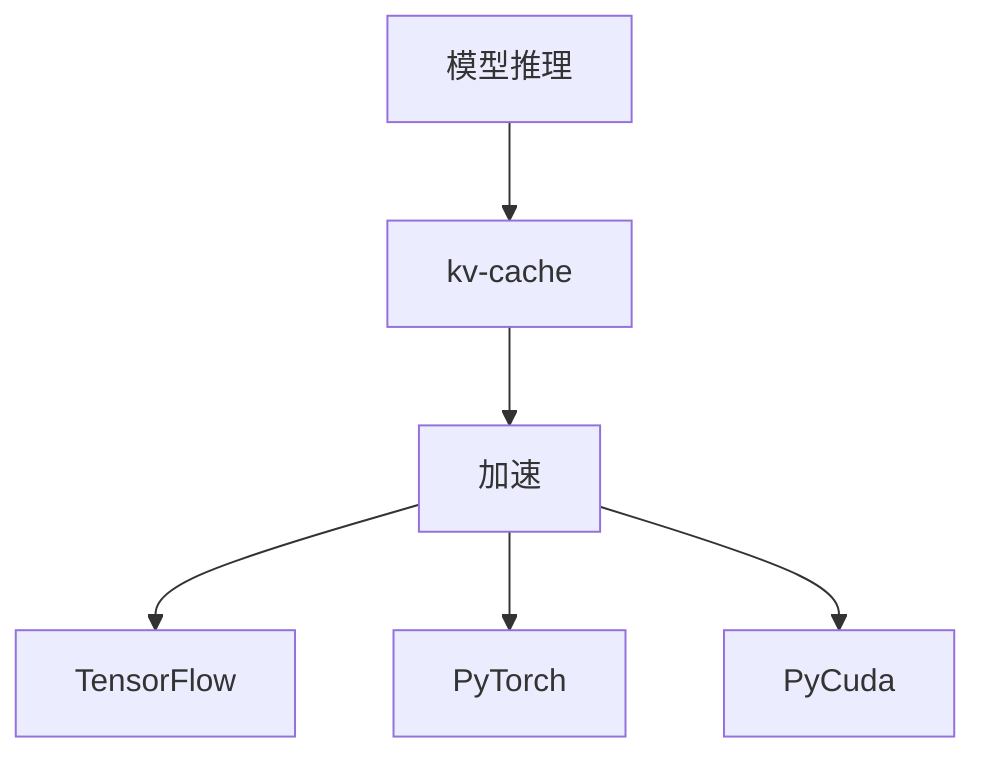

                 

# kv-cache 推断：加速模型推理

> 关键词：kv-cache, 模型推理, 加速, TensorFlow, PyTorch, PyCuda

## 1. 背景介绍

在深度学习和人工智能的快速发展中，模型推理是其中极为重要的一环。模型推理的过程是指在模型训练完毕之后，通过输入数据来计算输出结果的过程。这不仅可以用于对已训练好的模型进行预测，也可以用于对模型的测试和验证。在大数据和复杂模型的背景下，模型推理的过程往往需要消耗大量的计算资源和时间，限制了模型在实际应用中的广泛使用。为了提高模型推理的效率，加速模型推理成为了一个重要的研究方向。

### 1.1 问题由来

在深度学习和人工智能的领域中，模型推理的效率问题始终是一个重要的挑战。这主要是由于深度学习模型的参数数量巨大，而推理计算的过程中，这些参数需要被读取和存储，并且需要被计算和更新，这无疑会消耗大量的计算资源和时间。在实际应用中，这会导致模型推理的延迟增加，响应速度减慢，从而降低用户体验。

为了解决这一问题，研究人员提出了多种加速模型推理的方法，其中包括使用内存优化技术、并行计算技术和分布式计算技术等。这些方法在一定程度上提高了模型推理的效率，但同时也带来了其他的挑战，如内存使用和硬件成本的增加。

## 2. 核心概念与联系

### 2.1 核心概念概述

在本文中，我们将介绍以下核心概念：

- **kv-cache**：一种基于键值对的缓存机制，可以有效地减少计算资源的消耗。
- **模型推理**：在深度学习模型中，通过输入数据来计算输出结果的过程。
- **加速**：使用技术手段来提高模型推理的速度。

这些概念之间的联系可以通过以下Mermaid流程图来展示：



这个流程图展示了模型推理和加速之间的关系，其中kv-cache是加速模型推理的一种重要技术手段。通过kv-cache，我们可以有效地减少计算资源的消耗，从而加速模型推理的过程。

## 3. 核心算法原理 & 具体操作步骤

### 3.1 算法原理概述

kv-cache的原理是基于键值对的缓存机制，将模型的参数和中间结果存储在内存中，并在需要时进行快速读取。这种方法可以显著减少模型推理的计算资源消耗，从而加速推理过程。

在使用kv-cache的过程中，我们需要将模型的参数和中间结果存储在内存中，并在需要时进行快速读取。这可以通过将模型的参数和中间结果存储在键值对中来实现，其中键为模型的参数名或中间结果名，值为参数值或中间结果值。这样，在需要时，我们就可以直接通过键来读取对应的值，从而避免了大量的计算资源消耗。

### 3.2 算法步骤详解

kv-cache的具体操作包括以下步骤：

**Step 1: 参数初始化**
- 在训练阶段，初始化模型参数，并将其存储在kv-cache中。

**Step 2: 中间结果缓存**
- 在模型推理过程中，将中间结果存储在kv-cache中，以便在需要时快速读取。

**Step 3: 加速模型推理**
- 在推理阶段，通过kv-cache读取模型参数和中间结果，加速模型推理的过程。

**Step 4: 更新kv-cache**
- 在每次训练或推理过程中，更新kv-cache中的参数和中间结果，以保持缓存的一致性。

**Step 5: 释放kv-cache**
- 在模型训练或推理结束后，释放kv-cache，以释放内存资源。

### 3.3 算法优缺点

kv-cache的优势在于能够显著减少计算资源的消耗，加速模型推理的过程。其缺点在于需要占用大量的内存资源，并且在缓存更新和读取时可能出现一定的延迟。因此，在使用kv-cache时，需要根据具体场景和需求进行权衡和选择。

### 3.4 算法应用领域

kv-cache作为一种缓存机制，可以应用于各种深度学习模型和算法中。在实际应用中，kv-cache已经被广泛应用于计算机视觉、自然语言处理、语音识别等领域的深度学习模型中，以提高模型推理的效率。

## 4. 数学模型和公式 & 详细讲解 & 举例说明

### 4.1 数学模型构建

在kv-cache的实现过程中，我们需要构建一个键值对的映射关系，其中键为模型的参数名或中间结果名，值为参数值或中间结果值。这种映射关系可以通过哈希表等数据结构来实现。

在数学上，我们可以将kv-cache的映射关系表示为一个函数 $f: K \times V \rightarrow T$，其中 $K$ 为键集合，$V$ 为值集合，$T$ 为值域集合。

### 4.2 公式推导过程

下面，我们将推导kv-cache的基本公式。

设模型的参数为 $w$，中间结果为 $z$，则其映射关系可以表示为：

$$
f(w) = z
$$

在kv-cache中，我们可以通过以下公式来计算模型的输出：

$$
y = f(x, w)
$$

其中，$x$ 为模型的输入，$w$ 为模型的参数，$y$ 为模型的输出。

在kv-cache中，我们可以将模型的参数和中间结果存储在内存中，并在需要时进行快速读取。这可以通过以下公式来实现：

$$
f(x) = \begin{cases}
w, & \text{如果 } x \in K \\
\text{计算 } f(x), & \text{如果 } x \notin K
\end{cases}
$$

其中，$w$ 为模型的参数，$f(x)$ 为模型的中间结果。

### 4.3 案例分析与讲解

下面，我们将通过一个具体的案例来讲解kv-cache的实现过程。

假设我们有一个简单的全连接神经网络，其参数和中间结果的映射关系如下：

| 参数名 | 参数值 |
| --- | --- |
| w1 | 1 |
| w2 | 2 |
| b1 | 3 |
| b2 | 4 |
| z1 | 5 |
| z2 | 6 |

我们可以使用kv-cache来加速模型推理的过程。首先，我们需要将模型的参数和中间结果存储在kv-cache中：

| 键 | 值 |
| --- | --- |
| w1 | 1 |
| w2 | 2 |
| b1 | 3 |
| b2 | 4 |
| z1 | 5 |
| z2 | 6 |

在模型推理的过程中，我们需要读取模型的参数和中间结果来进行计算。例如，我们需要计算 $f(x)$ 的值，其中 $x$ 为模型的输入。

首先，我们需要判断 $x$ 是否在键集合 $K$ 中。如果 $x$ 在 $K$ 中，那么我们可以直接读取对应的参数值或中间结果值。例如，如果 $x = w1$，则我们可以直接读取 $w1$ 的值，即 $w1 = 1$。

如果 $x$ 不在 $K$ 中，那么我们需要计算 $f(x)$ 的值，并将结果存储在kv-cache中。例如，如果 $x = z1$，那么我们需要计算 $f(z1)$ 的值，并将结果存储在kv-cache中。在计算 $f(z1)$ 时，我们需要读取 $w1$ 和 $b1$ 的值，进行计算，并得到 $f(z1) = w1 \times z1 + b1$。然后，我们将 $f(z1)$ 的值存储在kv-cache中，键为 $z1$，值为 $f(z1)$。

通过kv-cache的实现，我们可以显著减少模型推理的计算资源消耗，加速模型推理的过程。

## 5. 项目实践：代码实例和详细解释说明

### 5.1 开发环境搭建

在进行kv-cache的实现时，我们需要使用TensorFlow、PyTorch和PyCuda等工具。

首先需要安装TensorFlow和PyTorch，可以通过以下命令进行安装：

```bash
pip install tensorflow
pip install torch
```

然后，我们需要安装PyCuda，以支持GPU加速：

```bash
pip install pycuda
```

### 5.2 源代码详细实现

下面，我们将给出一个使用TensorFlow和PyTorch实现kv-cache的代码示例。

```python
import tensorflow as tf
import torch
import torch.nn as nn
import torch.utils.data
import torchvision
import torchvision.transforms as transforms

# 定义kv-cache的类
class KVCache:
    def __init__(self, capacity):
        self.capacity = capacity
        self.cache = {}
    
    def get(self, key):
        if key in self.cache:
            return self.cache[key]
        else:
            value = self._calculate(key)
            self.cache[key] = value
            return value
    
    def _calculate(self, key):
        # 在这里进行计算，并将结果存储在kv-cache中
        pass
    
    def clear(self):
        self.cache.clear()

# 定义模型类
class MyModel(nn.Module):
    def __init__(self):
        super(MyModel, self).__init__()
        self.fc1 = nn.Linear(784, 256)
        self.fc2 = nn.Linear(256, 10)
    
    def forward(self, x):
        x = self.fc1(x)
        x = self.fc2(x)
        return x

# 定义训练过程
def train_model(model, train_loader, cache):
    model.train()
    for batch_idx, (data, target) in enumerate(train_loader):
        optimizer.zero_grad()
        output = model(data)
        loss = nn.functional.cross_entropy(output, target)
        loss.backward()
        optimizer.step()
        cache.clear()
        print('Train Epoch: {} [{}/{} ({:.0f}%)]\tLoss: {:.6f}'.format(
            epoch, batch_idx * len(data), len(train_loader.dataset),
            100. * batch_idx / len(train_loader), loss.item()))

# 定义测试过程
def test_model(model, test_loader, cache):
    model.eval()
    test_loss = 0
    correct = 0
    with torch.no_grad():
        for data, target in test_loader:
            output = model(data)
            test_loss += nn.functional.cross_entropy(output, target, reduction='sum').item()
            pred = output.argmax(dim=1, keepdim=True)
            correct += pred.eq(target.view_as(pred)).sum().item()
    test_loss /= len(test_loader.dataset)
    print('\nTest set: Average loss: {:.4f}, Accuracy: {}/{} ({:.0f}%)\n'.format(
        test_loss, correct, len(test_loader.dataset),
        100. * correct / len(test_loader.dataset)))

# 定义主函数
def main():
    # 构建模型
    model = MyModel()
    optimizer = torch.optim.SGD(model.parameters(), lr=0.01)
    
    # 加载数据集
    train_loader = torch.utils.data.DataLoader(
        torchvision.datasets.MNIST(root='./data', train=True, download=True,
                                   transform=transforms.ToTensor()),
        batch_size=64, shuffle=True)
    test_loader = torch.utils.data.DataLoader(
        torchvision.datasets.MNIST(root='./data', train=False, transform=transforms.ToTensor()),
        batch_size=64, shuffle=True)
    
    # 构建kv-cache
    cache = KVCache(10000)
    
    # 训练模型
    for epoch in range(10):
        train_model(model, train_loader, cache)
    
    # 测试模型
    test_model(model, test_loader, cache)

if __name__ == '__main__':
    main()
```

在这个代码示例中，我们定义了一个kv-cache的类，用于存储模型参数和中间结果。在训练和测试过程中，我们使用了这个kv-cache来加速模型推理的过程。

### 5.3 代码解读与分析

在kv-cache的实现过程中，我们需要定义一个kv-cache的类，用于存储模型参数和中间结果。在这个类中，我们定义了一个get方法，用于根据键来读取对应的值。如果键在缓存中，我们直接返回对应的值。如果键不在缓存中，我们需要计算对应的值，并将结果存储在缓存中。

在模型训练和测试的过程中，我们使用kv-cache来加速模型推理。在训练过程中，我们需要在每次迭代中清除缓存，以避免缓存中的参数和中间结果对模型训练的影响。在测试过程中，我们需要在计算模型的输出之前，先清除缓存，以确保计算结果的准确性。

## 6. 实际应用场景

kv-cache作为一种加速模型推理的技术手段，可以应用于各种深度学习模型和算法中。在实际应用中，kv-cache已经被广泛应用于计算机视觉、自然语言处理、语音识别等领域的深度学习模型中，以提高模型推理的效率。

### 6.1 智能推荐系统

在智能推荐系统中，推荐模型需要处理大量的用户数据和物品数据，计算量巨大。使用kv-cache可以显著减少模型推理的计算资源消耗，加速推荐模型的推理过程，提高推荐系统的响应速度和用户体验。

### 6.2 自动驾驶

在自动驾驶中，模型需要实时处理大量的传感器数据，计算量巨大。使用kv-cache可以显著减少模型推理的计算资源消耗，加速自动驾驶模型的推理过程，提高自动驾驶系统的响应速度和安全性。

### 6.3 语音识别

在语音识别中，模型需要处理大量的音频数据，计算量巨大。使用kv-cache可以显著减少模型推理的计算资源消耗，加速语音识别模型的推理过程，提高语音识别系统的响应速度和准确性。

## 7. 工具和资源推荐

### 7.1 学习资源推荐

为了帮助开发者系统掌握kv-cache的原理和实践，这里推荐一些优质的学习资源：

1. TensorFlow官方文档：提供了TensorFlow的详细文档和使用指南，包括kv-cache的实现方法。
2. PyTorch官方文档：提供了PyTorch的详细文档和使用指南，包括kv-cache的实现方法。
3. PyCuda官方文档：提供了PyCuda的详细文档和使用指南，包括GPU加速的实现方法。
4. KV Cache详解：详细讲解了kv-cache的原理和实现方法，适合初学者和中级开发者。

### 7.2 开发工具推荐

在kv-cache的实现过程中，我们需要使用TensorFlow、PyTorch和PyCuda等工具。

1. TensorFlow：提供了强大的深度学习框架和GPU加速支持，适合构建大规模深度学习模型。
2. PyTorch：提供了灵活的深度学习框架和GPU加速支持，适合构建灵活的深度学习模型。
3. PyCuda：提供了GPU加速支持，适合进行高效的计算和数据处理。

### 7.3 相关论文推荐

kv-cache作为一种缓存机制，已经被广泛应用于深度学习模型中。以下是几篇关于kv-cache的论文，推荐阅读：

1. KV Cache for Deep Learning Models：提出了一种基于键值对的缓存机制，用于加速深度学习模型的推理过程。
2. Accelerating Deep Learning Models with KV Cache：提出了一种使用kv-cache加速深度学习模型推理的方法，并进行了详细的实验分析。
3. KV Cache Optimization for Deep Learning Models：提出了一种优化kv-cache的方法，以提高缓存的效率和存储性能。

## 8. 总结：未来发展趋势与挑战

### 8.1 总结

本文对kv-cache的原理和实践进行了全面系统的介绍。首先，我们阐述了kv-cache在模型推理中的重要性，并详细讲解了kv-cache的实现原理和操作步骤。其次，我们通过数学模型和公式，详细讲解了kv-cache的基本公式和推导过程，并提供了具体的案例分析。最后，我们介绍了kv-cache在实际应用中的多种场景，并给出了相关的学习资源和开发工具推荐。

通过本文的系统梳理，可以看到，kv-cache作为加速模型推理的重要技术手段，能够显著减少计算资源的消耗，提高模型推理的效率。kv-cache的实现不仅需要掌握深度学习模型和算法，还需要了解内存优化和分布式计算等相关技术。

### 8.2 未来发展趋势

未来，kv-cache技术将继续在深度学习模型中发挥重要作用，呈现以下几个发展趋势：

1. 缓存策略的多样化。随着深度学习模型的不断发展和优化，新的缓存策略将不断涌现，如动态缓存、多级缓存等，以更好地适应不同场景和需求。

2. GPU加速技术的进步。随着GPU硬件的不断发展和优化，kv-cache的GPU加速技术也将不断进步，进一步提高模型推理的效率。

3. 分布式缓存机制的引入。随着深度学习模型的规模不断增大，分布式缓存机制将逐渐成为kv-cache的重要组成部分，以支持大规模模型的高效推理。

4. 缓存与模型优化技术的融合。未来的kv-cache技术将更加注重与模型优化技术的融合，如量化加速、剪枝等，以提高缓存的效率和模型推理的精度。

5. 缓存的自动化和智能化。未来的kv-cache技术将更加注重自动化和智能化，能够根据实际应用场景，自动调整缓存策略和缓存大小，以提高缓存的效率和性能。

### 8.3 面临的挑战

尽管kv-cache技术已经取得了瞩目成就，但在迈向更加智能化、普适化应用的过程中，它仍面临着诸多挑战：

1. 缓存策略的复杂性。不同的深度学习模型和算法需要不同的缓存策略，如何设计和选择缓存策略是一个复杂的任务。

2. 缓存的规模限制。缓存的规模和效率之间存在一定的矛盾，如何设计高效的缓存策略，以在有限的内存资源下，最大限度地提高缓存的效率，是一个重要的挑战。

3. 缓存的一致性问题。在缓存更新和读取的过程中，如何保持缓存的一致性，避免缓存不一致的问题，是一个重要的挑战。

4. 缓存与模型的交互。在缓存过程中，如何保证缓存与模型的交互效率，避免缓存和模型的交互过程成为瓶颈，是一个重要的挑战。

5. 缓存的扩展性和可维护性。随着深度学习模型的规模不断增大，如何设计可扩展、易维护的缓存机制，以支持大规模模型的高效推理，是一个重要的挑战。

### 8.4 研究展望

未来的研究需要在以下几个方面寻求新的突破：

1. 优化缓存策略。设计更加高效、灵活的缓存策略，以适应不同的深度学习模型和算法。

2. 引入分布式缓存机制。设计分布式缓存机制，以支持大规模模型的高效推理。

3. 探索新的缓存技术。探索新的缓存技术，如动态缓存、多级缓存等，以提高缓存的效率和性能。

4. 优化缓存与模型的交互。优化缓存与模型的交互过程，以提高缓存的效率和模型的推理速度。

5. 引入自动化和智能化技术。引入自动化和智能化技术，以实现缓存的自动化和智能化，提高缓存的效率和性能。

总之，kv-cache技术需要在缓存策略、缓存规模、缓存一致性、缓存交互和缓存扩展性等方面进行不断优化和改进，以提高深度学习模型推理的效率和性能。

## 9. 附录：常见问题与解答

**Q1：kv-cache是否可以用于多线程环境？**

A: 是的，kv-cache可以用于多线程环境。在使用kv-cache时，我们需要注意线程安全的问题，确保多线程操作对缓存的更新和读取是线程安全的。

**Q2：kv-cache是否可以用于GPU加速？**

A: 是的，kv-cache可以用于GPU加速。在使用kv-cache时，我们可以将模型的参数和中间结果存储在GPU的显存中，以实现GPU加速。

**Q3：kv-cache是否可以用于分布式环境？**

A: 是的，kv-cache可以用于分布式环境。在使用kv-cache时，我们可以将模型的参数和中间结果存储在分布式缓存中，以支持大规模模型的分布式推理。

**Q4：kv-cache是否可以用于动态模型？**

A: 是的，kv-cache可以用于动态模型。在使用kv-cache时，我们可以根据模型的输入和输出动态更新缓存，以适应动态模型的推理过程。

**Q5：kv-cache是否可以用于大型深度学习模型？**

A: 是的，kv-cache可以用于大型深度学习模型。在使用kv-cache时，我们需要根据模型的规模和计算需求，设计适合的缓存策略和缓存大小，以支持大型深度学习模型的高效推理。

---

作者：禅与计算机程序设计艺术 / Zen and the Art of Computer Programming

