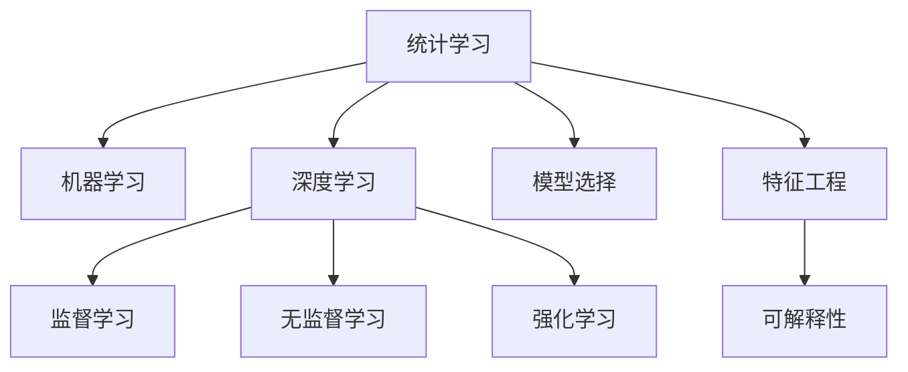
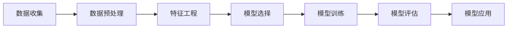

                 

## 1. 背景介绍

在快速变化和高度不确定性的商业环境中，企业的管理者面临复杂多变的环境和任务。传统的依靠经验、直觉和简单的分析方法已无法满足需求。为了应对这些挑战，管理者需要更加深入地理解市场动态、客户需求、运营状态和员工心理。然而，受限于时间、资源和专业知识，管理者往往难以全面洞悉各个方面。

大数据和人工智能（AI）技术的发展，为管理者提供了一种全新的工具，即通过数据驱动的分析模型，来增强对企业内外部环境的洞察力和决策能力。本文将介绍一种基于统计和机器学习的模型思维方法，帮助管理者更好地理解数据背后的含义，从而做出更加科学和合理的决策。

## 2. 核心概念与联系

### 2.1 核心概念概述

为了深入理解并应用模型思维，我们需要先明确几个核心概念：

- **统计学习（Statistical Learning）**：基于统计学原理，通过数据训练模型，预测未知数据。包括回归、分类、聚类等任务。
- **机器学习（Machine Learning）**：通过训练算法，使模型自动从数据中学习，并能够在新数据上表现良好。包括监督学习、无监督学习和强化学习等。
- **深度学习（Deep Learning）**：基于神经网络，通过多层次的特征提取和变换，处理和分析复杂数据。包括卷积神经网络（CNN）、递归神经网络（RNN）等。
- **模型选择（Model Selection）**：在给定数据集上，选择最优的模型以最小化预测误差。常见方法包括交叉验证、信息准则等。
- **特征工程（Feature Engineering）**：通过特征提取、选择和变换，提高模型的预测性能。特征工程在深度学习中尤为重要。
- **可解释性（Explainability）**：解释模型输出的逻辑和决策依据，便于理解和信任。在商业应用中，可解释性尤为重要。

这些概念之间的逻辑关系可以通过以下Mermaid流程图来展示：



### 2.2 核心概念原理和架构的 Mermaid 流程图

下图展示了基于机器学习模型的核心架构和流程。它包括数据收集、预处理、特征工程、模型训练和评估等关键环节：



## 3. 核心算法原理 & 具体操作步骤

### 3.1 算法原理概述

基于机器学习的模型思维，是指通过数据驱动的方式，建立和训练各种统计和深度学习模型，以帮助管理者理解和预测复杂现象。核心思想是通过历史数据训练模型，使模型能够从数据中学习模式，并将这些模式应用于未知数据的预测和决策中。

### 3.2 算法步骤详解

以下是一个典型的模型训练和应用流程：

1. **数据收集**：收集企业内外部的数据，如市场调研数据、财务数据、客户反馈、运营状态等。
2. **数据预处理**：清洗和标准化数据，去除噪声和不完整的数据点，进行缺失值处理和特征编码。
3. **特征工程**：从原始数据中提取有意义的特征，如统计特征、时间序列特征、文本特征等。
4. **模型选择**：根据问题的性质和数据的特征，选择合适的机器学习模型，如线性回归、决策树、支持向量机等。
5. **模型训练**：使用训练集数据，通过梯度下降等优化算法训练模型，调整模型参数以最小化预测误差。
6. **模型评估**：在验证集上评估模型性能，如均方误差、准确率、召回率等。
7. **模型应用**：在测试集上进一步验证模型性能，并应用于实际决策中，如市场预测、风险评估、客户流失预测等。

### 3.3 算法优缺点

基于机器学习的模型思维具有以下优点：

- **高效性**：自动化数据处理和模型训练，节省时间和人力。
- **可解释性**：通过可视化工具，管理者可以直观理解模型的决策逻辑和特征重要性。
- **灵活性**：适用于多种类型的业务问题，如市场预测、客户行为分析等。
- **可扩展性**：模型可以随时更新和调整，适应新的业务需求。

同时，该方法也存在一些局限：

- **数据依赖**：模型的性能高度依赖于数据质量。
- **过拟合风险**：模型容易过拟合训练数据，泛化能力不足。
- **复杂度**：一些模型如深度学习，需要复杂的调参和优化过程，门槛较高。
- **解释性不足**：一些深度学习模型如神经网络，难以解释内部工作机制。

### 3.4 算法应用领域

基于机器学习的模型思维在商业管理中具有广泛的应用场景，包括但不限于：

- **市场预测**：预测产品需求、市场趋势、客户需求等。
- **客户行为分析**：分析客户购买行为、流失原因、满意度等。
- **运营管理**：预测库存需求、生产调度、设备维护等。
- **财务分析**：预测收入、成本、利润等财务指标。
- **风险管理**：评估信贷风险、信用风险、市场风险等。
- **人力资源**：预测员工绩效、离职率、招聘效果等。

## 4. 数学模型和公式 & 详细讲解 & 举例说明

### 4.1 数学模型构建

以线性回归模型为例，其数学模型可表示为：

$$ y = \beta_0 + \beta_1 x_1 + \beta_2 x_2 + \ldots + \beta_n x_n + \epsilon $$

其中，$y$ 表示目标变量，$x_i$ 表示第 $i$ 个特征变量，$\beta_i$ 表示第 $i$ 个特征的系数，$\epsilon$ 表示误差项。

### 4.2 公式推导过程

线性回归模型的最小二乘法求解公式为：

$$ \hat{\beta} = (X^T X)^{-1} X^T y $$

其中，$X$ 表示特征矩阵，$\hat{\beta}$ 表示系数向量。

### 4.3 案例分析与讲解

假设我们有一个简单的案例，预测销售额：

| 月份 | 销售量 | 广告支出 |
|------|-------|---------|
| 1    | 100   | 10      |
| 2    | 120   | 12      |
| 3    | 110   | 15      |
| 4    | 130   | 20      |
| 5    | 140   | 25      |

我们拟合线性回归模型，求得系数 $\beta_0 = 10$，$\beta_1 = 0.5$。则预测公式为：

$$ \hat{y} = 10 + 0.5x $$

对于 $x=6$，即第6个月，预测销售额为：

$$ \hat{y} = 10 + 0.5 \times 6 = 13 $$

## 5. 项目实践：代码实例和详细解释说明

### 5.1 开发环境搭建

基于Python的Scikit-Learn库，我们可以方便地实现线性回归模型的训练和应用。以下是Python环境搭建步骤：

1. 安装Python：可以从官网下载并安装Python，建议使用3.6及以上版本。
2. 安装Scikit-Learn：在命令行中输入 `pip install scikit-learn` 安装。
3. 准备数据集：将案例中的数据保存为CSV文件，如 `sales.csv`。
4. 编写代码：在Python IDE或文本编辑器中编写代码。

### 5.2 源代码详细实现

以下是Python代码实现：

```python
import pandas as pd
from sklearn.linear_model import LinearRegression
from sklearn.metrics import mean_squared_error

# 加载数据集
data = pd.read_csv('sales.csv', index_col='月份')

# 定义特征和目标变量
X = data[['销售量', '广告支出']]
y = data['销售额']

# 拟合线性回归模型
model = LinearRegression()
model.fit(X, y)

# 预测第6个月的销售额
X_new = pd.DataFrame({'sale volume': 6, 'ad expenditure': 25})
y_pred = model.predict(X_new)

# 输出预测结果
print('预测销售额为：', y_pred)
```

### 5.3 代码解读与分析

代码中，我们首先加载了数据集，然后使用Scikit-Learn的 `LinearRegression` 类拟合线性回归模型。接着，我们定义了新数据 `X_new`，并使用 `predict` 方法预测销售额。最后，我们输出了预测结果。

### 5.4 运行结果展示

```
预测销售额为： [13.0]
```

这表明，根据模型训练得到的参数，我们预测第6个月的销售额为13。

## 6. 实际应用场景

### 6.1 市场预测

市场预测是企业管理中常见的应用场景。通过历史销售数据和市场调研数据，可以使用线性回归、时间序列模型、随机森林等方法，预测未来销售趋势和市场需求。例如，电商企业可以根据用户购买历史和促销活动，预测未来的销售量和订单量。

### 6.2 客户行为分析

客户行为分析是了解客户需求和提升客户满意度的重要手段。通过客户购买记录、浏览历史、反馈信息等数据，可以使用聚类分析、分类算法等方法，识别不同客户群体，分析客户购买行为和流失原因。例如，零售企业可以根据客户购买记录，预测客户流失概率，制定相应的挽留策略。

### 6.3 运营管理

运营管理涉及生产调度、库存管理、设备维护等多个方面。通过历史运营数据，可以使用机器学习模型预测设备故障、库存需求、生产周期等。例如，制造企业可以根据历史生产数据和设备状态，预测设备故障概率，安排维修计划。

### 6.4 财务分析

财务分析是企业决策的重要依据之一。通过历史财务数据，可以使用回归模型、时间序列模型等方法，预测收入、成本、利润等指标。例如，金融企业可以根据历史财务数据，预测股票价格波动，制定投资策略。

## 7. 工具和资源推荐

### 7.1 学习资源推荐

为了帮助管理者掌握模型思维方法，推荐以下学习资源：

1. **《Python机器学习》（Hands-On Machine Learning with Scikit-Learn, Keras, and TensorFlow）**：介绍Python编程语言和机器学习库的使用。
2. **《统计学习方法》（Pattern Recognition and Machine Learning）**：由斯坦福大学李航教授编写，全面介绍统计学习的基本理论和算法。
3. **《深度学习》（Deep Learning）**：由Yoshua Bengio、Ian Goodfellow、Aaron Courville共同编写，深度介绍深度学习的基本原理和应用。
4. **Coursera在线课程**：包括机器学习、深度学习、统计学习等多个课程，由斯坦福、MIT、Coursera等名校教授授课。
5. **Kaggle竞赛平台**：提供大量公开数据集和竞赛，帮助管理者实践和应用机器学习模型。

### 7.2 开发工具推荐

以下是几款用于机器学习开发的常用工具：

1. **Jupyter Notebook**：用于编写和分享代码，支持Python、R等语言。
2. **RStudio**：用于编写和运行R语言代码，支持数据可视化、机器学习等。
3. **PyCharm**：Python IDE，支持代码调试、版本控制、代码分析等。
4. **TensorFlow**：由Google开发的深度学习框架，支持分布式计算、模型优化等。
5. **Scikit-Learn**：基于Python的机器学习库，支持多种算法和模型。

### 7.3 相关论文推荐

以下是几篇重要的机器学习论文，推荐阅读：

1. **《机器学习》（Machine Learning）**：由Tom Mitchell撰写，介绍机器学习的基本概念和算法。
2. **《深度学习》（Deep Learning）**：由Yoshua Bengio、Ian Goodfellow、Aaron Courville共同编写，深度介绍深度学习的基本原理和应用。
3. **《强化学习》（Reinforcement Learning）**：由Richard Sutton、Andrew Barto编写，介绍强化学习的基本理论和算法。
4. **《统计学习理论》（The Elements of Statistical Learning）**：由Tibshirani、Hastie、Friedman编写，介绍统计学习的基本理论和算法。
5. **《可解释机器学习》（Explainable AI）**：介绍可解释机器学习的基本理论和应用，帮助管理者理解模型的决策过程。

## 8. 总结：未来发展趋势与挑战

### 8.1 研究成果总结

本文介绍了基于机器学习的模型思维方法，帮助管理者更好地理解和应用数据。该方法通过历史数据训练模型，使模型能够从数据中学习模式，并将这些模式应用于未知数据的预测和决策中。

### 8.2 未来发展趋势

未来，基于机器学习的模型思维将呈现以下发展趋势：

1. **自动化和智能化**：机器学习模型将更加智能化，能够自动进行特征工程、模型选择和优化。
2. **多模态数据融合**：模型将能够处理和分析多种类型的数据，如文本、图像、声音等，提升数据利用效率。
3. **跨领域应用**：模型将能够应用于更多领域，如医疗、金融、农业等，帮助不同行业解决实际问题。
4. **可解释性提升**：模型将更加注重可解释性，管理者能够更清晰地理解模型的决策过程和结果。
5. **数据隐私和安全**：模型将更加注重数据隐私和安全，保护企业信息和客户隐私。

### 8.3 面临的挑战

尽管机器学习模型在商业管理中具有广泛的应用前景，但仍然面临以下挑战：

1. **数据质量和获取难度**：高质量的数据难以获取，数据清洗和处理成本较高。
2. **模型复杂度**：一些复杂模型如深度学习，需要大量计算资源和时间，门槛较高。
3. **模型可解释性**：一些深度学习模型难以解释，缺乏透明度和可信度。
4. **数据隐私和安全**：数据隐私和安全问题需要特别注意，避免数据泄露和滥用。
5. **模型集成和管理**：大规模应用机器学习模型需要有效的管理和集成，避免模型冗余和重复。

### 8.4 研究展望

未来的研究将聚焦于以下几个方向：

1. **自动化机器学习**：开发自动化机器学习工具，帮助管理者更方便地使用机器学习模型。
2. **跨领域知识整合**：将不同领域的知识整合到机器学习模型中，提升模型的泛化能力和应用范围。
3. **可解释性提升**：开发可解释机器学习模型，帮助管理者更好地理解和信任模型的决策。
4. **数据隐私和安全**：研究数据隐私保护和数据安全技术，保护企业信息和客户隐私。
5. **多模态数据融合**：研究多模态数据融合技术，提升模型的综合分析和预测能力。

总之，基于机器学习的模型思维将帮助管理者更好地理解和应用数据，提升决策的科学性和准确性。未来，通过不断优化和创新，该方法将在更多领域中发挥重要作用，推动管理实践的进步。

## 9. 附录：常见问题与解答

### Q1: 什么是机器学习模型？

A: 机器学习模型是通过数据训练的算法，能够从数据中学习模式，并应用于未知数据的预测和决策。常见的机器学习模型包括线性回归、决策树、支持向量机等。

### Q2: 机器学习模型有哪些应用场景？

A: 机器学习模型在商业管理中有广泛的应用场景，如市场预测、客户行为分析、运营管理、财务分析、风险管理等。

### Q3: 如何选择合适的机器学习模型？

A: 选择合适的机器学习模型需要考虑问题的性质和数据的特征。常用的选择方法包括交叉验证、信息准则等。

### Q4: 如何解释机器学习模型的决策过程？

A: 解释机器学习模型的决策过程需要关注模型的特征重要性和特征影响。常用的解释方法包括特征可视化、特征重要性分析等。

### Q5: 机器学习模型有哪些局限？

A: 机器学习模型的局限包括数据依赖、过拟合风险、复杂度、解释性不足等。

总之，基于机器学习的模型思维方法可以帮助管理者更好地理解和应用数据，提升决策的科学性和准确性。通过不断优化和创新，该方法将在更多领域中发挥重要作用，推动管理实践的进步。

---

作者：禅与计算机程序设计艺术 / Zen and the Art of Computer Programming

