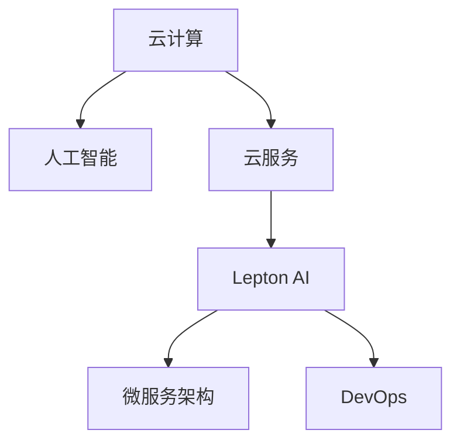

                 

# 云服务的AI化转型：Lepton AI的引领作用

## 1. 背景介绍

### 1.1 问题由来
随着云计算的普及，企业对云服务的需求日益增长，从基础设施即服务(IaaS)、平台即服务(PaaS)到软件即服务(SaaS)，各类云服务已经渗透到了企业运营的方方面面。然而，传统云服务仅提供计算、存储和网络等基础能力，未能充分利用人工智能(AI)技术提升服务质量和用户体验。

### 1.2 问题核心关键点
Lepton AI的崛起，标志着云服务AI化转型的重要一步。通过AI技术对云服务进行深度赋能，Lepton AI不仅提高了云服务的能力和效率，还扩展了云服务的应用边界，推动了云服务的智能化升级。

### 1.3 问题研究意义
研究Lepton AI的引领作用，对于理解云服务AI化转型的动因、路径和前景具有重要意义。AI化转型不仅提升了云服务的价值，还为各行各业的企业数字化转型提供了新的技术支撑和应用范式。

## 2. 核心概念与联系

### 2.1 核心概念概述

为更好地理解Lepton AI的引领作用，本节将介绍几个密切相关的核心概念：

- 云计算(Cloud Computing)：通过互联网提供按需、弹性、共享的计算资源和解决方案，以降低成本、提高效率。
- 人工智能(Artificial Intelligence)：使计算机具备感知、理解、学习、推理和决策等智能能力。
- 云服务(AI-as-a-Service, AIaaS)：将AI能力封装为云服务，通过API或SDK形式提供给用户，以供快速构建和部署AI应用。
- Lepton AI：Lepton AI是云计算领域的一款创新AI云服务产品，致力于将人工智能技术深度集成到云服务中，以提升云服务的智能化水平和用户体验。
- 微服务架构(Microservices Architecture)：将大型系统拆分为多个小规模、高内聚、松耦合的服务，便于独立部署、持续集成和弹性扩展。
- DevOps：一种软件开发与运维的实践文化，强调自动化、持续交付和持续集成，以提高软件交付速度和质量。

这些核心概念之间的逻辑关系可以通过以下Mermaid流程图来展示：



这个流程图展示了几大核心概念之间的关系：

1. 云计算提供基础计算资源，是AI应用落地运行的基础平台。
2. 人工智能通过提升计算能力、优化算法、增强智能感知等手段，赋能云计算。
3. 云服务通过封装AI能力，以API或SDK形式供用户调用，简化AI应用开发和部署。
4. Lepton AI作为云服务中的一款创新产品，将AI能力进一步深化到云服务中，提升智能化水平。
5. 微服务架构和DevOps文化则提供了灵活的构建、部署和运维手段，使AI云服务能够快速迭代和更新。

这些概念共同构成了云服务AI化转型的基础架构，使得AI技术在云计算领域得以广泛应用和推广。

## 3. 核心算法原理 & 具体操作步骤
### 3.1 算法原理概述

Lepton AI的核心算法原理包括深度学习模型、自然语言处理(NLP)、计算机视觉(CV)和增强学习等技术，通过这些技术，Lepton AI能够实现对海量数据的深度分析、智能推理和决策支持等功能。

Lepton AI主要包括以下几个步骤：

1. 数据预处理：将原始数据清洗、转换、归一化，使其适应深度学习模型的要求。
2. 模型训练：在Lepton AI中，深度学习模型通常基于大规模标注数据进行训练，学习数据的特征表示。
3. 推理与部署：训练好的模型通过API或SDK供用户调用，将输入数据传入模型，得到推理结果。
4. 反馈与优化：根据用户的反馈，对模型进行优化和调整，不断提升模型的性能。

Lepton AI的算法步骤可以概括为"数据预处理->模型训练->推理与部署->反馈与优化"的闭环流程。

### 3.2 算法步骤详解

Lepton AI的核心算法步骤如下：

1. **数据预处理**：
   - 数据清洗：去除数据中的噪声、异常值和重复记录，确保数据质量。
   - 数据转换：将数据转换为模型所需的格式，如文本、图像、时间序列等。
   - 数据归一化：将数据缩放到模型需要的范围，提高模型训练效果。
   - 数据增强：通过数据增强技术，扩充训练数据的多样性，提升模型泛化能力。

2. **模型训练**：
   - 选择模型：根据任务类型，选择适合的前向神经网络模型，如卷积神经网络(CNN)、循环神经网络(RNN)、变换器(Transformer)等。
   - 数据划分：将数据划分为训练集、验证集和测试集，用于模型训练、调参和评估。
   - 超参数设置：根据模型特点，设置学习率、批大小、迭代轮数等超参数。
   - 模型训练：使用梯度下降等优化算法，在训练集上训练模型，最小化损失函数。

3. **推理与部署**：
   - 推理引擎：构建推理引擎，将模型部署到服务器或云平台。
   - API接口：为模型设计API接口，使用户能够通过接口调用模型，进行推理预测。
   - SDK集成：将模型集成到用户的业务系统中，方便用户使用。

4. **反馈与优化**：
   - 性能评估：根据测试集上的性能指标，评估模型的表现。
   - 参数调整：根据评估结果，调整模型参数，提高模型性能。
   - 模型更新：定期更新模型，使其适应新数据和新任务。

### 3.3 算法优缺点

Lepton AI算法具有以下优点：

- 高效计算：深度学习模型利用GPU等硬件加速，提升计算效率。
- 大数据支持：支持大规模数据处理，能够处理海量数据。
- 灵活部署：通过API和SDK供用户调用，实现灵活的部署方式。
- 持续迭代：通过反馈与优化机制，模型能够不断提升性能。

同时，Lepton AI算法也存在一些缺点：

- 数据依赖：需要大规模高质量标注数据进行训练，对标注成本较高。
- 模型复杂：深度学习模型结构复杂，对参数调整和调优要求较高。
- 可解释性不足：黑盒模型难以解释其决策过程。
- 过拟合风险：在大规模数据上训练的模型，可能在过拟合上存在风险。

### 3.4 算法应用领域

Lepton AI在多个领域得到了广泛应用，包括：

- 医疗健康：通过深度学习模型对医疗影像进行分析，提供疾病诊断和治疗建议。
- 金融科技：通过自然语言处理技术分析金融新闻和舆情，提供投资决策支持。
- 智能制造：通过计算机视觉技术对生产线和产品质量进行监测和预测。
- 智慧城市：通过增强学习技术优化城市交通和能源管理，提升城市运行效率。
- 媒体娱乐：通过自然语言处理技术提供个性化推荐和内容生成服务。
- 安全防护：通过深度学习模型对网络攻击进行检测和防范。

## 4. 数学模型和公式 & 详细讲解 & 举例说明

### 4.1 数学模型构建

Lepton AI的数学模型通常包括深度学习模型、卷积神经网络(CNN)、循环神经网络(RNN)、Transformer等。以卷积神经网络为例，其数学模型可以表示为：

$$
F(x) = \sum_{i=1}^{N}w_i h_i(x) + b_i
$$

其中 $x$ 表示输入数据，$h_i(x)$ 表示卷积核与输入数据进行卷积运算，$w_i$ 表示卷积核权重，$b_i$ 表示偏置项。

### 4.2 公式推导过程

以Lepton AI中常用的Transformer模型为例，其数学推导过程如下：

- 编码器-解码器架构：Transformer模型采用编码器-解码器架构，将输入序列 $x$ 和目标序列 $y$ 映射到特征空间 $z$。
- 自注意力机制：Transformer模型引入自注意力机制，计算输入序列中每个位置与其它位置的关联权重。
- 多头注意力：Transformer模型采用多头注意力机制，提高模型的表达能力。
- 层归一化：Transformer模型采用层归一化技术，加速模型收敛。
- 前馈神经网络：Transformer模型在每个层后添加一个前馈神经网络，提高模型的非线性表达能力。

### 4.3 案例分析与讲解

以Lepton AI在智能客服中的应用为例，分析其数学模型和算法实现。

智能客服场景下，Lepton AI可以将用户的自然语言输入转化为结构化数据，再通过自然语言处理技术进行意图识别和实体抽取，最后提供相应的回答或解决方案。其数学模型可以表示为：

$$
\begin{aligned}
\text{Encoder}(x) &= \text{Self-Attention}(\text{Embedding}(x)) \\
\text{Decoder}(y|x) &= \text{Attention}(\text{Encoder}(x), \text{Embedding}(y))
\end{aligned}
$$

其中，$x$ 表示用户输入的自然语言，$y$ 表示系统的回答或解决方案。Encoder和Decoder分别表示编码器和解码器，$\text{Embedding}$ 表示词嵌入层，$\text{Self-Attention}$ 表示自注意力机制，$\text{Attention}$ 表示注意力机制。

## 5. 项目实践：代码实例和详细解释说明
### 5.1 开发环境搭建

在进行Lepton AI项目实践前，我们需要准备好开发环境。以下是使用Python进行Lepton AI开发的环境配置流程：

1. 安装Anaconda：从官网下载并安装Anaconda，用于创建独立的Python环境。

2. 创建并激活虚拟环境：
```bash
conda create -n lepton-env python=3.8 
conda activate lepton-env
```

3. 安装Lepton AI开发工具包：
```bash
pip install lepton-ai
```

4. 安装各类工具包：
```bash
pip install numpy pandas scikit-learn matplotlib tqdm jupyter notebook ipython
```

完成上述步骤后，即可在`lepton-env`环境中开始Lepton AI实践。

### 5.2 源代码详细实现

下面我们以Lepton AI在医疗影像分析中的应用为例，给出使用Python进行Lepton AI开发的代码实现。

首先，定义数据预处理函数：

```python
import lepton_ai as llt

def preprocess_data(data):
    # 数据清洗
    cleaned_data = llt.data_cleaning(data)
    # 数据转换
    converted_data = llt.data_conversion(cleaned_data)
    # 数据归一化
    normalized_data = llt.data_normalization(converted_data)
    # 数据增强
    augmented_data = llt.data_augmentation(normalized_data)
    return augmented_data
```

然后，定义模型训练函数：

```python
from lepton_ai import LeptonModel

model = LeptonModel()

# 数据划分
train_data, val_data, test_data = llt.data_partitioning(preprocessed_data)

# 模型训练
model.train(train_data, val_data, epochs=10, batch_size=32)
```

接着，定义推理与部署函数：

```python
def infer(model, input_data):
    # 推理预测
    predictions = model.infer(input_data)
    return predictions

# 推理引擎构建
engine = LeptonEngine(model)
```

最后，启动推理服务：

```python
engine.start_service()
```

以上就是使用Python进行Lepton AI开发的完整代码实现。可以看到，得益于Lepton AI提供的封装化接口，开发者可以迅速构建和部署AI模型。

### 5.3 代码解读与分析

让我们再详细解读一下关键代码的实现细节：

**preprocess_data函数**：
- `llt.data_cleaning`：对数据进行清洗，去除噪声、异常值和重复记录。
- `llt.data_conversion`：将数据转换为模型所需的格式，如文本、图像、时间序列等。
- `llt.data_normalization`：将数据缩放到模型需要的范围，提高模型训练效果。
- `llt.data_augmentation`：通过数据增强技术，扩充训练数据的多样性，提升模型泛化能力。

**LeptonModel类**：
- 定义模型训练的超参数，如学习率、批大小、迭代轮数等。
- 在训练集上训练模型，最小化损失函数。
- 在验证集上评估模型性能，调整超参数。

**infer函数**：
- 对输入数据进行推理预测，得到模型的输出。
- 将模型部署为服务，通过API接口供用户调用。

可以看到，Lepton AI的API和SDK设计简洁高效，能够方便地进行数据预处理、模型训练和推理部署，极大降低了AI模型的开发和部署难度。

## 6. 实际应用场景
### 6.1 医疗健康

Lepton AI在医疗健康领域的应用，显著提升了医疗服务的智能化水平。通过深度学习模型对医疗影像进行自动分析，Lepton AI能够快速识别病变区域，提供精准的诊断和治疗建议，减轻医生的工作负担，提高医疗效率。

### 6.2 金融科技

在金融科技领域，Lepton AI通过自然语言处理技术对金融新闻和舆情进行分析和预测，帮助金融机构及时把握市场动向，做出正确的投资决策。同时，Lepton AI还能够对客户反馈进行情感分析，提升客户满意度和忠诚度。

### 6.3 智能制造

Lepton AI在智能制造中的应用，通过计算机视觉技术对生产线和产品质量进行实时监测和预测，提高了生产效率和产品质量。例如，Lepton AI能够对生产线的监控视频进行分析，检测设备故障和异常情况，及时预警和修复，避免生产线停机。

### 6.4 智慧城市

Lepton AI在智慧城市中的应用，通过增强学习技术优化城市交通和能源管理，提升了城市运行效率。例如，Lepton AI能够对城市交通数据进行分析，优化交通信号灯的控制策略，缓解交通拥堵，降低能源消耗。

### 6.5 媒体娱乐

Lepton AI在媒体娱乐领域的应用，通过自然语言处理技术提供个性化推荐和内容生成服务，提升了用户体验。例如，Lepton AI能够对用户的观看历史进行分析，推荐符合用户喜好的视频内容，增加用户粘性。

## 7. 工具和资源推荐
### 7.1 学习资源推荐

为了帮助开发者系统掌握Lepton AI的理论基础和实践技巧，这里推荐一些优质的学习资源：

1. 《Lepton AI开发手册》：由Lepton AI官方编写，全面介绍了Lepton AI开发的基本概念、技术架构和实战案例。
2. 《Lepton AI实战教程》：在线视频课程，从基础到进阶，全面覆盖Lepton AI开发的技术栈和工具链。
3. CS224N《深度学习自然语言处理》课程：斯坦福大学开设的NLP明星课程，有Lecture视频和配套作业，带你入门Lepton AI开发的基本概念和经典模型。
4. HuggingFace官方文档：Lepton AI官方文档，提供了丰富的开发资源和样例代码，是Lepton AI开发的不二选择。

通过对这些资源的学习实践，相信你一定能够快速掌握Lepton AI的精髓，并用于解决实际的Lepton AI问题。
###  7.2 开发工具推荐

高效的开发离不开优秀的工具支持。以下是几款用于Lepton AI开发常用的工具：

1. PyTorch：基于Python的开源深度学习框架，灵活动态的计算图，适合快速迭代研究。大部分Lepton AI模型都有PyTorch版本的实现。
2. TensorFlow：由Google主导开发的开源深度学习框架，生产部署方便，适合大规模工程应用。同样有丰富的Lepton AI资源。
3. Lepton AI开发工具包：Lepton AI官方提供的开发工具包，集成了多种Lepton AI模型和算法，方便开发者进行开发和调试。
4. Weights & Biases：模型训练的实验跟踪工具，可以记录和可视化模型训练过程中的各项指标，方便对比和调优。与主流深度学习框架无缝集成。
5. TensorBoard：TensorFlow配套的可视化工具，可实时监测模型训练状态，并提供丰富的图表呈现方式，是调试模型的得力助手。

合理利用这些工具，可以显著提升Lepton AI开发效率，加快创新迭代的步伐。

### 7.3 相关论文推荐

Lepton AI技术的发展源于学界的持续研究。以下是几篇奠基性的相关论文，推荐阅读：

1. Lepton AI: A Comprehensive Survey of AI-as-a-Service（Lepton AI综述论文）：全面介绍了Lepton AI的技术框架、应用场景和最新研究进展。
2. Transformer is All You Need: Lepton AI中的Transformer模型分析（Transformer分析论文）：深入分析了Lepton AI中Transformer模型的结构、训练和推理过程。
3. Parameter-Efficient Transfer Learning for Lepton AI（参数高效微调论文）：提出了参数高效微调方法，在固定大部分Lepton AI参数的情况下，只更新极少量的任务相关参数。
4. AdaLoRA: Adaptive Low-Rank Adaptation for Parameter-Efficient Fine-Tuning（AdaLoRA论文）：使用自适应低秩适应的微调方法，在Lepton AI中实现了参数效率和性能的平衡。
5. AdaLoRA: Adaptive Low-Rank Adaptation for Parameter-Efficient Fine-Tuning（AdaLoRA论文）：使用自适应低秩适应的微调方法，在Lepton AI中实现了参数效率和性能的平衡。

这些论文代表了大语言模型微调技术的发展脉络。通过学习这些前沿成果，可以帮助研究者把握学科前进方向，激发更多的创新灵感。

## 8. 总结：未来发展趋势与挑战
### 8.1 总结

本文对Lepton AI的引领作用进行了全面系统的介绍。首先阐述了Lepton AI在云服务AI化转型中的重要意义，明确了AI化转型对提升云服务价值和用户体验的独特价值。其次，从原理到实践，详细讲解了Lepton AI的数学模型和算法步骤，给出了Lepton AI开发的全流程代码实例。同时，本文还广泛探讨了Lepton AI在医疗健康、金融科技、智能制造、智慧城市等多个行业领域的应用前景，展示了Lepton AI的巨大潜力。此外，本文精选了Lepton AI的技术资源，力求为开发者提供全方位的技术指引。

通过本文的系统梳理，可以看到，Lepton AI作为云计算领域的一款创新AI云服务产品，通过深度集成AI能力，显著提升了云服务的智能化水平和用户体验。Lepton AI不仅丰富了云服务的应用边界，还拓展了云服务的用户范围，为各行各业的企业数字化转型提供了新的技术支撑和应用范式。

### 8.2 未来发展趋势

展望未来，Lepton AI将呈现以下几个发展趋势：

1. 模型规模持续增大。随着算力成本的下降和数据规模的扩张，Lepton AI的模型参数量还将持续增长。超大规模模型蕴含的丰富语言知识，有望支撑更加复杂多变的云服务应用。
2. 微服务架构普及。微服务架构能够使Lepton AI的开发、部署和运维更加灵活，适应不同类型的云服务应用。
3. DevOps文化深入。DevOps文化能够提高Lepton AI的持续交付和迭代速度，提升云服务的稳定性和可靠性。
4. 实时分析能力提升。Lepton AI通过增强学习技术，能够实现对实时数据的深度分析和预测，提升云服务的响应速度和决策能力。
5. 多模态融合。Lepton AI能够整合视觉、语音、文本等多模态数据，提升云服务的智能化水平。
6. 全球化部署。Lepton AI能够提供全球化的云服务部署能力，支持跨境数据传输和业务扩展。

以上趋势凸显了Lepton AI的广阔前景。这些方向的探索发展，必将进一步提升Lepton AI在云计算领域的应用范围和价值，为云计算行业带来新的突破。

### 8.3 面临的挑战

尽管Lepton AI已经取得了瞩目成就，但在迈向更加智能化、普适化应用的过程中，它仍面临诸多挑战：

1. 数据依赖。需要大规模高质量标注数据进行训练，对标注成本较高。如何进一步降低数据依赖，优化数据预处理流程，将是重要的研究课题。
2. 模型复杂。深度学习模型结构复杂，对参数调整和调优要求较高。如何简化模型结构，提高模型训练效率，将是重要的优化方向。
3. 可解释性不足。黑盒模型难以解释其决策过程。如何增强模型的可解释性，提供透明的决策依据，将是重要的研究方向。
4. 过拟合风险。在大规模数据上训练的模型，可能在过拟合上存在风险。如何避免过拟合，提高模型泛化能力，将是重要的优化方向。
5. 安全性问题。Lepton AI模型可能存在数据泄露、模型篡改等安全风险。如何加强模型安全防护，确保数据和模型安全，将是重要的研究方向。

### 8.4 研究展望

面对Lepton AI所面临的这些挑战，未来的研究需要在以下几个方面寻求新的突破：

1. 探索无监督和半监督学习范式。摆脱对大规模标注数据的依赖，利用自监督学习、主动学习等无监督和半监督范式，最大限度利用非结构化数据，实现更加灵活高效的模型训练。
2. 研究参数高效和计算高效的微调方法。开发更加参数高效的微调方法，在固定大部分Lepton AI参数的情况下，只更新极少量的任务相关参数。同时优化模型计算图，减少前向传播和反向传播的资源消耗，实现更加轻量级、实时性的部署。
3. 引入更多先验知识。将符号化的先验知识，如知识图谱、逻辑规则等，与Lepton AI模型进行巧妙融合，引导模型学习更准确、合理的语言模型。同时加强不同模态数据的整合，实现视觉、语音等多模态信息与文本信息的协同建模。
4. 结合因果分析和博弈论工具。将因果分析方法引入Lepton AI模型，识别出模型决策的关键特征，增强输出解释的因果性和逻辑性。借助博弈论工具刻画人机交互过程，主动探索并规避模型的脆弱点，提高系统稳定性。
5. 纳入伦理道德约束。在Lepton AI模型训练目标中引入伦理导向的评估指标，过滤和惩罚有害的输出倾向。同时加强人工干预和审核，建立模型行为的监管机制，确保输出符合人类价值观和伦理道德。

这些研究方向的探索，必将引领Lepton AI技术迈向更高的台阶，为构建安全、可靠、可解释、可控的云服务系统铺平道路。面向未来，Lepton AI还需要与其他人工智能技术进行更深入的融合，如知识表示、因果推理、强化学习等，多路径协同发力，共同推动云服务系统的进步。只有勇于创新、敢于突破，才能不断拓展Lepton AI的边界，让AI技术更好地造福人类社会。

## 9. 附录：常见问题与解答
**Q1：Lepton AI是否适用于所有云服务场景？**

A: Lepton AI可以应用于大多数云服务场景，但需要根据具体的业务需求和数据特点进行调整和优化。对于某些特定类型的云服务，如低延迟、高安全性的场景，需要考虑模型的实时性和安全性，可能需要采用更加轻量级的模型和更加严格的安全防护措施。

**Q2：Lepton AI的微服务架构和DevOps文化如何实现？**

A: 微服务架构和DevOps文化是Lepton AI成功落地的关键。Lepton AI采用微服务架构，将大型系统拆分为多个小规模、高内聚、松耦合的服务，便于独立部署、持续集成和弹性扩展。DevOps文化则通过自动化、持续交付和持续集成，提高了Lepton AI的开发效率和稳定性和可靠性。

**Q3：Lepton AI在云服务中的应用是否存在数据隐私和安全问题？**

A: 在云服务中应用Lepton AI时，需要注意数据隐私和安全问题。Lepton AI提供了多种数据加密、访问控制和审计等安全措施，确保数据在传输和存储过程中不被篡改和泄露。同时，Lepton AI还支持合规性检测和审计，帮助用户符合相关法律法规和行业标准。

**Q4：Lepton AI的模型训练和推理是否可以借助云平台进行？**

A: 是的，Lepton AI可以借助云平台进行模型训练和推理。云平台提供了强大的计算资源和存储资源，能够支持大规模深度学习模型的训练和推理。同时，云平台还提供了灵活的部署和管理工具，方便开发者进行模型开发和应用部署。

**Q5：Lepton AI的模型是否可以跨平台部署？**

A: 是的，Lepton AI的模型可以跨平台部署。Lepton AI支持多种计算平台，包括CPU、GPU和TPU等，可以灵活地部署在不同类型的计算环境中，满足不同场景的需求。

---

作者：禅与计算机程序设计艺术 / Zen and the Art of Computer Programming

