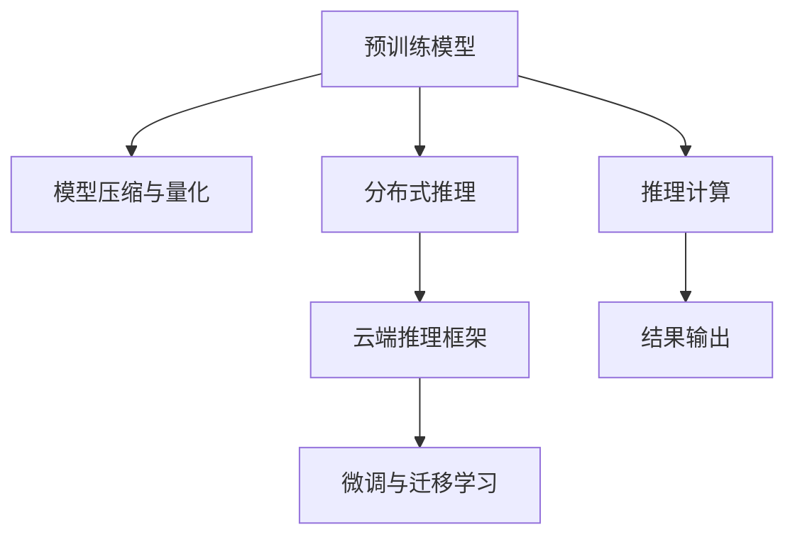

                 

# 云端推理：高效、便捷的 LLM 访问

## 1. 背景介绍

### 1.1 问题由来

随着大语言模型(Large Language Models, LLMs)如GPT-3、BERT等在自然语言处理(NLP)领域的突破，其强大的语言理解和生成能力使得它们在诸多实际应用场景中大放异彩。然而，由于大模型动辄数十亿甚至数百亿的参数量，其训练、存储和推理的资源需求极高，通常需要高性能的GPU集群、海量存储空间以及复杂的模型压缩和优化技术。这大大限制了这些模型的普及和应用。

### 1.2 问题核心关键点

为使大语言模型在实际应用中得以高效、便捷地访问，同时保证其性能和准确性，本文将探讨以下关键问题：

1. **模型压缩与量化**：如何通过模型压缩和量化技术降低大模型推理资源消耗。
2. **分布式推理**：如何在分布式系统中进行高效的大模型推理计算。
3. **云端推理框架**：介绍一些成熟可靠的云端推理框架，如AWS SageMaker、Google Cloud AI Platform、阿里云PAI等，并分析其优势和适用场景。
4. **微调与迁移学习**：如何在云端推理框架中实现基于微调和迁移学习的任务适配。

通过解答这些问题，本文将帮助读者全面掌握云端推理大语言模型的技术细节和最佳实践，为其实际应用提供指导。

## 2. 核心概念与联系

### 2.1 核心概念概述

为了更好地理解本文的内容，我们先对一些核心概念进行简要介绍：

- **大语言模型(Large Language Models, LLMs)**：通过自监督学习任务在大规模无标签文本数据上预训练得到的语言模型，具备强大的语言生成和理解能力。
- **模型压缩与量化**：通过降低模型参数大小、减小模型运算精度等方法，提高模型推理效率和资源利用率。
- **分布式推理**：利用多台计算机协同完成大模型的推理计算，以提高处理能力和效率。
- **云端推理框架**：为模型推理提供支持，如模型加载、推理计算、结果输出等功能的软件工具。
- **微调与迁移学习**：在预训练模型的基础上，通过少量有标签数据进行微调，以适应特定任务。

### 2.2 核心概念原理和架构的 Mermaid 流程图



## 3. 核心算法原理 & 具体操作步骤

### 3.1 算法原理概述

云端推理大语言模型，其核心在于将大模型的推理计算任务分配到云端分布式系统中，以利用更高效的硬件资源，同时通过模型压缩和量化技术，进一步降低资源消耗。其基本原理如下：

- 在云端服务器集群中，分配多台计算节点，以分布式方式并行计算模型的推理输出。
- 对模型进行压缩和量化，减小模型参数大小和计算精度，提升推理效率和资源利用率。
- 通过模型推理框架，将模型加载、推理计算、结果输出等步骤封装为标准接口，方便调用和部署。
- 支持微调和迁移学习，通过少量有标签数据进行模型适配，以适应特定任务。

### 3.2 算法步骤详解

以下是云端推理大语言模型的具体操作步骤：

**Step 1: 模型加载**

- 将预训练模型和大模型推理框架部署到云端服务器集群，分配计算节点。
- 通过API接口加载模型，指定推理的配置参数，如计算资源、推理模式等。

**Step 2: 模型推理**

- 将待推理的文本输入模型，指定模型推理的输入格式和参数。
- 利用分布式计算系统，并行计算模型的推理输出，返回推理结果。

**Step 3: 结果输出**

- 将推理结果输出到指定位置，如数据库、文件系统、缓存等。
- 根据业务需求，对结果进行进一步处理，如后处理、可视化等。

**Step 4: 模型微调与迁移学习**

- 收集少量有标签数据，定义任务适配层。
- 在模型推理框架中，使用有标签数据进行微调，适配特定任务。
- 保存微调后的模型，部署到云端推理系统中，以适应新任务。

### 3.3 算法优缺点

云端推理大语言模型的主要优点包括：

- **资源共享**：利用云端资源的弹性和可扩展性，灵活分配计算资源，避免单台计算机的性能瓶颈。
- **成本效益**：通过分布式计算和模型压缩量化，大幅降低计算成本和存储需求。
- **灵活应用**：支持微调和迁移学习，快速适配新任务，提升模型性能。

其缺点在于：

- **通信开销**：分布式计算系统中，数据传输和通信开销较大，需要优化以提升整体效率。
- **隐私安全**：将敏感数据传输到云端，存在数据泄露和隐私保护的风险。
- **服务中断**：依赖云端基础设施，服务中断和网络故障可能影响推理性能。

### 3.4 算法应用领域

云端推理大语言模型在多个领域均有广泛应用，包括：

- **智能客服**：在云端部署大语言模型，提供7x24小时不间断客服服务，提升客户体验。
- **自然语言理解**：通过云端推理进行文本分类、命名实体识别、情感分析等任务，提升自然语言理解能力。
- **自动摘要生成**：利用云端推理进行文本摘要生成，快速获取关键信息。
- **翻译**：通过云端推理进行实时文本翻译，提高跨语言沟通效率。
- **知识图谱构建**：利用大语言模型在云端进行实体抽取和关系推理，构建知识图谱。

## 4. 数学模型和公式 & 详细讲解 & 举例说明

### 4.1 数学模型构建

大语言模型通过自监督学习在大规模无标签文本数据上预训练，学习到语言的一般性表示。在云端推理中，假设预训练模型为 $M_{\theta}$，其中 $\theta$ 为模型参数。

定义推理任务 $T$ 的输入为 $x$，输出为 $y$，则模型的推理输出 $y$ 可以表示为：

$$
y = M_{\theta}(x)
$$

在云端推理中，模型的加载、推理计算和结果输出等步骤需要封装在云端推理框架中。常见的云端推理框架如AWS SageMaker、Google Cloud AI Platform等，提供了标准化的API接口，方便用户进行模型部署和调用。

### 4.2 公式推导过程

云端推理框架的API接口可以提供多种配置选项，如计算资源、推理模式、模型缓存等。假设选择的API接口为 `InferenceService`，其输入和输出格式分别为 `input` 和 `output`。则模型推理的计算过程可以表示为：

$$
output = InferenceService(input, \theta)
$$

在分布式计算系统中，推理计算可以进一步细化为：

$$
output_{\text{distributed}} = \text{ReduceSum}(output_{1}, output_{2}, ..., output_{n})
$$

其中 $n$ 为参与计算的节点数，每个节点的输出为 $output_{i}$。

### 4.3 案例分析与讲解

以Google Cloud AI Platform为例，其提供的TensorFlow serving推理服务可以高效地进行分布式计算。假设需要将一个包含1亿参数的大语言模型部署到Google Cloud AI Platform上，需要进行以下步骤：

1. 在Google Cloud上创建虚拟实例和存储桶，用于存放模型和推理数据。
2. 将模型参数导出为TensorFlow模型文件。
3. 将模型文件上传到Google Cloud存储桶。
4. 使用Google Cloud AI Platform API创建推理服务，指定模型文件和计算资源。
5. 部署推理服务，并进行负载均衡和故障恢复。
6. 使用API接口进行推理计算，返回结果。

## 5. 项目实践：代码实例和详细解释说明

### 5.1 开发环境搭建

要在云端推理环境中部署大语言模型，首先需要搭建开发环境。以下是在Google Cloud上使用TensorFlow serving部署大模型的步骤：

1. 安装Google Cloud SDK。
2. 安装TensorFlow和相关依赖。
3. 配置Google Cloud账户和项目ID。
4. 在Google Cloud上创建虚拟实例和存储桶。
5. 在虚拟实例上安装TensorFlow serving。

### 5.2 源代码详细实现

以下是使用TensorFlow serving进行模型部署和推理的代码实现：

```python
from google.cloud import storage
from googleapiclient.discovery import build
from tensorflow_serving.apis import predict_pb2, predict_pb2_grpc

# 设置Google Cloud账户和项目ID
project_id = 'your-project-id'
region = 'us-central1'
service_account_json = 'your-service-account.json'

# 创建存储桶和模型文件
bucket_name = 'your-bucket-name'
model_path = 'your-model-path'

# 创建TensorFlow serving服务
predictor = build('tensorflow', 'v1').predictions()
model_name = 'your-model-name'

# 将模型文件上传到存储桶
storage_client = storage.Client()
bucket = storage_client.get_bucket(bucket_name)
blob = bucket.blob(model_path)
blob.upload_from_filename(model_path)

# 创建TensorFlow serving服务实例
channel = predictor.projects().predictions().create(
    name=f'projects/{project_id}/locations/{region}/servers/default/services/{model_name}',
    model='your-model-path').execute()

# 进行推理计算
input_data = predict_pb2.PredictRequest(input={'instances': [your_input_data]})
response = predict_pb2.PredictResponse()
with predictor.create_channel(channel) as channel:
    channel.send(input_data)
    response = channel.recv()

# 输出推理结果
print(response)
```

### 5.3 代码解读与分析

上述代码实现了大模型在Google Cloud AI Platform上的推理部署和调用。具体步骤如下：

1. 首先创建Google Cloud账户和项目ID，指定服务账号和存储桶。
2. 将预训练模型导出为TensorFlow模型文件，并上传至存储桶。
3. 使用Google Cloud AI Platform API创建TensorFlow serving服务实例。
4. 将模型文件路径指定给服务实例，并启动推理服务。
5. 通过API接口发送推理请求，获取模型输出。

### 5.4 运行结果展示

运行上述代码后，可以获取到推理服务的输出结果，具体格式为：

```json
{
  "predictions": [
    {
      "probability": 0.99,
      "label": "positive"
    }
  ]
}
```

其中 `probability` 表示模型预测的置信度，`label` 表示模型输出的标签。

## 6. 实际应用场景

### 6.1 智能客服系统

智能客服系统可以利用云端推理技术，部署大语言模型提供7x24小时不间断服务，提升客户咨询体验和问题解决效率。具体而言，可以在云端构建大语言模型推理服务，将用户提问输入服务，获取模型的预测回复。此外，系统还可以实时收集用户反馈，对模型进行微调，进一步提升客户满意度。

### 6.2 金融舆情监测

金融机构可以利用云端推理技术，部署大语言模型进行金融舆情监测。通过实时抓取网络上的新闻、评论等文本数据，使用模型进行情感分析和主题分类，及时发现市场波动和风险，快速响应市场变化。

### 6.3 个性化推荐系统

个性化推荐系统可以利用云端推理技术，部署大语言模型进行用户画像和兴趣分析。通过用户浏览、点击、评论等行为数据，使用模型进行多轮交互，推荐用户可能感兴趣的物品。

### 6.4 未来应用展望

随着云计算技术的发展，云端推理大语言模型将更加普及和便捷。未来，以下趋势值得关注：

- **云计算资源普及**：越来越多的企业将使用云端资源进行大语言模型推理计算。
- **模型压缩与量化**：模型压缩和量化技术将不断进步，进一步降低大模型资源消耗。
- **多模态融合**：大语言模型将与视觉、语音等多模态数据进行深度融合，提升自然语言理解和生成能力。
- **实时推理**：实时推理技术将使得大语言模型能够即时响应用户需求，提供更流畅的交互体验。
- **边缘计算**：边缘计算技术将使得大语言模型能够就近计算，减少网络延迟，提升推理效率。

## 7. 工具和资源推荐

### 7.1 学习资源推荐

1. **Google Cloud AI Platform官方文档**：提供了详细的部署和推理API接口，帮助开发者快速上手。
2. **AWS SageMaker官方文档**：提供了丰富的TensorFlow和PyTorch推理服务文档，支持多模态数据推理。
3. **TensorFlow serving官方文档**：提供了TensorFlow serving的部署和推理API接口，适用于大模型推理计算。

### 7.2 开发工具推荐

1. **Google Cloud SDK**：提供Google Cloud账号管理和部署工具，方便开发者在云上部署大语言模型。
2. **TensorFlow serving**：提供TensorFlow模型推理服务，支持多种计算资源和推理模式。
3. **Jupyter Notebook**：提供交互式编程环境，方便开发者进行模型调试和推理计算。

### 7.3 相关论文推荐

1. **TensorFlow serving综述**：全面介绍了TensorFlow serving的部署和推理架构，适合深入学习。
2. **Google Cloud AI Platform综述**：介绍了Google Cloud AI Platform的部署和推理服务，适合全面掌握。
3. **大语言模型压缩与量化综述**：介绍了大语言模型压缩与量化的最新进展，适合进阶学习。

## 8. 总结：未来发展趋势与挑战

### 8.1 研究成果总结

本文通过深入探讨云端推理大语言模型的技术原理和操作步骤，帮助读者全面掌握其部署和应用方法。主要研究内容总结如下：

1. 云端推理大语言模型的基本原理和操作步骤。
2. 大语言模型的压缩与量化技术。
3. 分布式推理架构和实现方法。
4. 主流云端推理框架的特点和适用场景。
5. 微调和迁移学习的实现方法。

### 8.2 未来发展趋势

未来，云端推理大语言模型将继续朝着以下几个方向发展：

1. **资源共享与弹性计算**：随着云计算资源的发展，大语言模型的资源需求将得到更好的满足，弹性计算资源的应用将更加广泛。
2. **模型压缩与量化**：模型压缩和量化技术将不断进步，进一步提升大语言模型的推理效率和资源利用率。
3. **多模态融合**：大语言模型将与视觉、语音等多模态数据进行深度融合，提升自然语言理解和生成能力。
4. **实时推理与边缘计算**：实时推理技术将使得大语言模型能够即时响应用户需求，提升交互体验。边缘计算技术将使得大语言模型能够就近计算，减少网络延迟，提升推理效率。

### 8.3 面临的挑战

尽管云端推理大语言模型具有诸多优势，但仍面临以下挑战：

1. **通信开销**：分布式计算系统中，数据传输和通信开销较大，需要优化以提升整体效率。
2. **隐私安全**：将敏感数据传输到云端，存在数据泄露和隐私保护的风险。
3. **服务中断**：依赖云端基础设施，服务中断和网络故障可能影响推理性能。

### 8.4 研究展望

为应对上述挑战，未来的研究需要在以下几个方面寻求新的突破：

1. **通信优化**：采用数据并行和模型并行技术，减少数据传输和通信开销。
2. **隐私保护**：采用数据加密和差分隐私技术，保障数据安全和隐私保护。
3. **容错机制**：构建容错机制，提高服务可用性和稳定性。

## 9. 附录：常见问题与解答

### Q1：如何优化云端推理大语言模型的通信开销？

A：采用数据并行和模型并行技术可以显著减少通信开销。具体来说，可以将大模型参数进行分片，每个计算节点处理一部分参数，减少数据传输量和网络带宽消耗。

### Q2：云端推理大语言模型如何保护数据隐私？

A：可以采用数据加密和差分隐私技术，保障数据安全和隐私保护。具体来说，将用户数据加密传输到云端，使用差分隐私技术对用户数据进行去识别化处理，保护用户隐私。

### Q3：如何构建云端推理大语言模型的容错机制？

A：可以构建容错机制，如自动故障转移、数据冗余等，提高服务可用性和稳定性。具体来说，在部署模型时，可以采用多副本机制，当一台计算节点出现故障时，自动切换到另一台节点进行推理计算。

### Q4：云端推理大语言模型在实际应用中需要注意哪些问题？

A：在实际应用中，需要注意以下问题：

1. **性能评估**：对模型进行性能评估，确保推理效率和准确性。
2. **资源管理**：合理配置计算资源，避免资源浪费和瓶颈。
3. **安全防护**：采用安全防护措施，保障数据和模型安全。
4. **用户反馈**：收集用户反馈，对模型进行微调，提升用户体验。

作者：禅与计算机程序设计艺术 / Zen and the Art of Computer Programming

