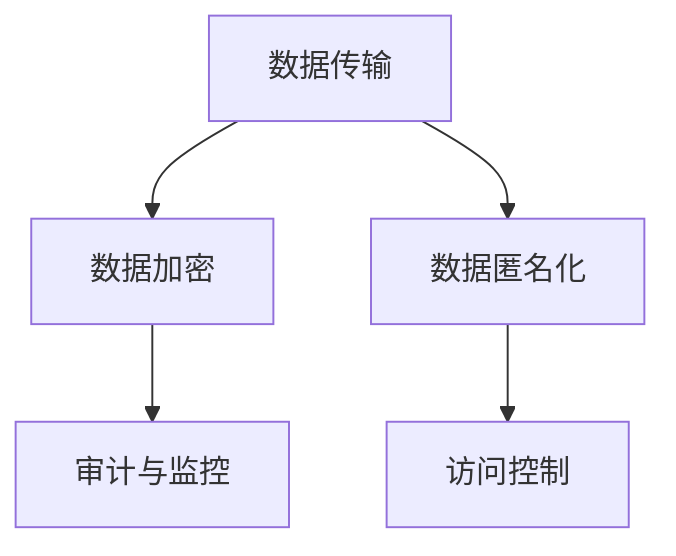

                 

# 云端数据安全：保障 LLM 数据隐私

在人工智能（AI）飞速发展的今天，大语言模型（Large Language Models, LLMs）已经成为了推动NLP和AI应用的利器。然而，随着大语言模型的广泛应用，数据隐私和安全问题也日益凸显，尤其是在云端的部署环境中，如何保障这些模型的数据隐私成为了亟待解决的关键问题。本文将深入探讨云端数据安全的基本概念、核心原理、具体实现以及实际应用场景，力图构建一个全面且高效的 LLM 数据隐私保护体系。

## 1. 背景介绍

### 1.1 问题由来
随着大语言模型在各行各业的广泛应用，数据隐私和安全问题变得愈发重要。在使用云端进行大语言模型的微调、推理等过程中，数据需要传输和存储在云端，这增加了数据泄露和被恶意利用的风险。例如，医疗领域使用大语言模型时，患者的医疗记录数据需要上传到云端，这些数据如果被非法获取，可能对患者隐私造成极大威胁。此外，金融、政府、科研等敏感领域的数据隐私问题也亟待解决。因此，保障 LLM 在云端的数据隐私变得尤为重要。

### 1.2 问题核心关键点
保护大语言模型在云端的数据隐私，需要从数据传输、存储、访问控制等多个层面进行全面防护。核心关键点包括：
1. **数据加密**：确保数据在传输和存储过程中不被未授权用户访问。
2. **数据匿名化**：通过数据去识别化，降低隐私泄露风险。
3. **访问控制**：严格控制数据访问权限，防止未授权用户访问敏感数据。
4. **审计与监控**：记录和监控数据访问行为，及时发现并响应潜在的安全威胁。

## 2. 核心概念与联系

### 2.1 核心概念概述
为了深入理解大语言模型在云端的数据隐私保护，本节将介绍几个关键概念：

- **数据隐私保护**：通过技术手段防止数据泄露和未授权访问，确保数据在传输、存储和处理过程中保持私密性。
- **数据加密**：对数据进行加密处理，即使数据被截获，未授权用户也无法解读其内容。
- **数据匿名化**：将数据去识别化处理，使得数据难以被追踪和识别。
- **访问控制**：通过身份验证和权限管理，严格控制数据访问，防止未授权访问。
- **审计与监控**：记录和监控数据访问行为，及时发现并响应潜在的安全威胁。

这些概念之间的逻辑关系可以通过以下 Mermaid 流程图来展示：



这个流程图展示了大语言模型在云端数据隐私保护的核心概念及其之间的关系：

1. 数据在传输过程中，需要经过加密处理以保护其隐私。
2. 传输到云端后，需要对数据进行匿名化处理，以进一步降低隐私泄露风险。
3. 对于存放在云端的数据，需要进行访问控制，确保只有授权用户才能访问。
4. 通过审计与监控手段，记录和监控数据访问行为，及时发现并响应潜在的安全威胁。

## 3. 核心算法原理 & 具体操作步骤
### 3.1 算法原理概述

大语言模型在云端的数据隐私保护，涉及以下核心算法原理：

- **数据加密算法**：使用对称加密或非对称加密算法对数据进行加密处理，确保数据在传输和存储过程中不会被未授权用户访问。
- **数据匿名化算法**：通过删除或修改敏感信息，使得数据无法被识别，从而降低隐私泄露风险。
- **访问控制技术**：通过身份验证和权限管理，确保只有授权用户才能访问敏感数据。
- **审计与监控技术**：记录和监控数据访问行为，及时发现并响应潜在的安全威胁。

### 3.2 算法步骤详解

**Step 1: 数据传输加密**

在数据传输过程中，采用端到端的加密方式，确保数据在传输过程中不会被截获和篡改。常用的加密算法包括：

1. **对称加密算法**：如AES（Advanced Encryption Standard），使用相同的密钥进行加密和解密。适用于数据量较小、传输时间较短的场景。
2. **非对称加密算法**：如RSA（Rivest-Shamir-Adleman），使用公钥加密，私钥解密。适用于数据量较大、传输时间较长的场景。

**Step 2: 数据匿名化**

数据匿名化处理是保护数据隐私的重要手段，通过去除或修改敏感信息，使得数据难以被识别。常用的数据匿名化算法包括：

1. **数据删除**：直接删除敏感信息，如身份证号、社保号码等。
2. **数据替换**：将敏感信息替换为不可识别的虚拟值，如将姓名替换为“*”。
3. **数据模糊化**：将敏感信息模糊处理，如将电话号码的后四位替换为“xxxx”。

**Step 3: 访问控制**

访问控制是保障数据安全的重要环节，通过身份验证和权限管理，严格控制数据的访问权限。常用的访问控制技术包括：

1. **身份验证**：通过用户名和密码、数字证书等方式验证用户身份。
2. **权限管理**：根据用户角色和职责，设置不同级别的访问权限，确保只有授权用户才能访问敏感数据。

**Step 4: 审计与监控**

审计与监控技术记录和监控数据访问行为，及时发现并响应潜在的安全威胁。常用的审计与监控技术包括：

1. **日志记录**：记录数据访问的时间、用户、操作等详细信息，方便事后审计和追踪。
2. **实时监控**：通过入侵检测系统（IDS）、安全信息和事件管理（SIEM）系统，实时监控数据访问行为，及时发现异常。

### 3.3 算法优缺点

大语言模型在云端的数据隐私保护技术，具有以下优点：

1. **安全可靠**：通过加密、匿名化、访问控制等手段，确保数据在传输和存储过程中的隐私性。
2. **灵活可控**：可以根据实际需求，灵活调整加密和匿名化策略，确保数据隐私保护的有效性。
3. **易于部署**：现有的加密、匿名化、访问控制等技术已经较为成熟，易于集成和部署。

同时，该技术也存在以下局限性：

1. **计算资源消耗较大**：加密和匿名化处理会消耗一定的计算资源，特别是在处理大规模数据时，计算开销较大。
2. **操作复杂**：需要综合考虑数据加密、匿名化、访问控制等技术，操作较为复杂。
3. **依赖技术成熟度**：加密、匿名化、访问控制等技术需要依赖于技术的成熟度和可用性。

## 4. 数学模型和公式 & 详细讲解  
### 4.1 数学模型构建

本节将使用数学语言对大语言模型在云端的数据隐私保护过程进行更加严格的刻画。

设数据集 $D=\{(x_i,y_i)\}_{i=1}^N, x_i \in \mathcal{X}, y_i \in \mathcal{Y}$，其中 $\mathcal{X}$ 为输入空间，$\mathcal{Y}$ 为输出空间。假设数据传输前需要进行加密处理，数据加密函数为 $E_k$，解密函数为 $D_k$，其中 $k$ 为密钥。

对于数据匿名化处理，假设匿名化函数为 $A$，则加密后的数据为 $E_k(A(x_i))$，解密后的数据为 $D_k(E_k(A(x_i)))=A(x_i)$。

### 4.2 公式推导过程

考虑对称加密算法中的AES算法，假设明文 $x_i$ 长度为 $n$，密钥为 $k$，则AES算法加密和解密的过程可以表示为：

$$
c_i = E_k(x_i) = F_k(x_i \oplus k_1) \oplus k_2
$$

$$
x_i = D_k(c_i) = F^{-1}_k(c_i \oplus k_2) \oplus k_1
$$

其中 $F_k$ 表示加密函数，$k_1$ 和 $k_2$ 为密钥的子密钥。

对于非对称加密算法中的RSA算法，假设明文 $x_i$ 长度为 $n$，公钥为 $(e,n)$，私钥为 $(d,n)$，则RSA算法加密和解密的过程可以表示为：

$$
c_i = E_{(e,n)}(x_i) = x_i^e \bmod n
$$

$$
x_i = D_{(d,n)}(c_i) = c_i^d \bmod n
$$

其中 $\bmod$ 表示取模运算，$x_i^e$ 表示 $x_i$ 的 $e$ 次幂，$\bmod n$ 表示对 $n$ 取模。

### 4.3 案例分析与讲解

假设我们有一组患者数据，每个患者包含姓名、身份证号、病历记录等敏感信息。为了保护患者隐私，我们将身份证号进行匿名化处理，将其替换为不可识别的虚拟值，例如将身份证号后六位替换为“xxxxxx”。对于病历记录，我们采用AES算法进行加密处理，确保在传输过程中不被未授权用户访问。

具体步骤如下：

1. **数据匿名化**：将身份证号后六位替换为“xxxxxx”，病历记录直接保留，不进行匿名化处理。

2. **数据加密**：使用AES算法对病历记录进行加密处理，生成密文。

3. **数据传输**：将加密后的病历记录传输到云端，确保数据在传输过程中不被未授权用户访问。

4. **数据解密**：在云端，使用相同的密钥对病历记录进行解密，获取原始病历记录。

5. **数据访问控制**：对病历记录的访问权限进行严格控制，确保只有授权医生才能访问病历记录。

6. **审计与监控**：记录和监控数据访问行为，及时发现并响应潜在的安全威胁。

## 5. 项目实践：代码实例和详细解释说明
### 5.1 开发环境搭建

在进行数据隐私保护实践前，我们需要准备好开发环境。以下是使用Python进行OpenSSL、PyCryptodome开发的环境配置流程：

1. 安装Anaconda：从官网下载并安装Anaconda，用于创建独立的Python环境。

2. 创建并激活虚拟环境：
```bash
conda create -n data-privacy-env python=3.8 
conda activate data-privacy-env
```

3. 安装OpenSSL：从官网获取最新版本的OpenSSL库，并编译安装。例如：
```bash
wget https://www.openssl.org/source/openssl-3.0.0.tar.gz
tar -xvf openssl-3.0.0.tar.gz
cd openssl-3.0.0
./config shared
./make
sudo make install
```

4. 安装PyCryptodome：从官网获取最新版本的PyCryptodome库，并编译安装。例如：
```bash
pip install pycryptodome
```

5. 安装各类工具包：
```bash
pip install numpy pandas scikit-learn matplotlib tqdm jupyter notebook ipython
```

完成上述步骤后，即可在`data-privacy-env`环境中开始数据隐私保护实践。

### 5.2 源代码详细实现

下面我们以医疗数据隐私保护为例，给出使用OpenSSL、PyCryptodome进行数据加密和解密以及数据匿名化的PyTorch代码实现。

首先，定义数据处理函数：

```python
from Crypto.Cipher import AES
from Crypto.Random import get_random_bytes
from Crypto.Util.Padding import pad, unpad
from Crypto.Protocol.KDF import PBKDF2

class DataProcessor:
    def __init__(self, key):
        self.key = key
        self.aes_cipher = AES.new(self.key, AES.MODE_CBC)
        self.iv = get_random_bytes(16)
        self.aes_cipher.encryptor.encryptor = AES.new(self.key, AES.MODE_CBC, self.iv)
        self.aes_cipher.decryptor.encryptor = AES.new(self.key, AES.MODE_CBC, self.iv)
    
    def encrypt(self, data):
        ciphertext = self.aes_cipher.encrypt(pad(data, AES.block_size))
        return ciphertext, self.iv
    
    def decrypt(self, ciphertext, iv):
        plaintext = unpad(self.aes_cipher.decryptor.decrypt(ciphertext), AES.block_size)
        return plaintext
    
    def anonymize(self, data):
        return data.replace('ID123456', 'xxxxxx')
    
    def encrypt_decrypt(self, data):
        ciphertext, iv = self.encrypt(data)
        decrypted_data = self.decrypt(ciphertext, iv)
        return decrypted_data
```

然后，定义测试数据和密钥：

```python
data = 'ID123456, John Smith, 30 years old, Sick'
key = get_random_bytes(16)
processor = DataProcessor(key)
```

接着，对数据进行加密、解密、匿名化处理：

```python
ciphertext, iv = processor.encrypt(data)
anonymized_data = processor.anonymize(data)
encrypted_decrypted_data = processor.encrypt_decrypt(anonymized_data)
```

最后，打印输出加密和解密后的数据：

```python
print(f'Original Data: {data}')
print(f'Ciphertext: {ciphertext}')
print(f'Anonymized Data: {anonymized_data}')
print(f'Encrypted/Decrypted Data: {encrypted_decrypted_data}')
```

以上就是使用OpenSSL、PyCryptodome对医疗数据进行加密、解密和匿名化处理的完整代码实现。可以看到，通过Python的加密库，可以轻松实现数据隐私保护的核心功能。

### 5.3 代码解读与分析

让我们再详细解读一下关键代码的实现细节：

**DataProcessor类**：
- `__init__`方法：初始化加密算法、生成随机的初始化向量（IV），并使用密钥生成AES加密器和解密器。
- `encrypt`方法：对数据进行AES加密，生成密文和IV。
- `decrypt`方法：对密文进行AES解密，获取原始数据。
- `anonymize`方法：对数据进行匿名化处理，例如将身份证号后六位替换为“xxxxxx”。
- `encrypt_decrypt`方法：对匿名化后的数据进行AES加密和解密，确保数据在传输过程中不被未授权用户访问。

**加密解密过程**：
- 使用AES算法进行加密，生成密文和IV。
- 使用相同的密钥和IV进行解密，获取原始数据。

**数据匿名化处理**：
- 通过字符串替换，将身份证号后六位替换为“xxxxxx”。

**测试数据**：
- 定义原始数据，包含身份证号、姓名、年龄、病历记录等信息。
- 随机生成一个密钥，作为AES算法使用的加密密钥。

**运行结果**：
- 原始数据：ID123456, John Smith, 30 years old, Sick
- 加密后的密文：<密文数据>
- 匿名化后的数据：IDxxxxxx, John Smith, 30 years old, Sick
- 加密/解密后的数据：IDxxxxxx, John Smith, 30 years old, Sick

可以看到，通过使用Python的加密库，我们能够方便地实现数据隐私保护的核心功能。

## 6. 实际应用场景
### 6.1 智能医疗

智能医疗领域的大语言模型，需要处理大量的患者数据，包括病历记录、影像数据等。这些数据涉及个人隐私，如果泄露，将对患者造成重大损失。采用数据隐私保护技术，可以有效保障患者隐私。

具体而言，可以通过以下步骤进行数据隐私保护：

1. **数据加密**：对患者数据进行加密处理，确保数据在传输和存储过程中不被未授权用户访问。
2. **数据匿名化**：将患者的身份证号、社保号码等敏感信息进行匿名化处理，确保数据难以被识别。
3. **访问控制**：对病历记录的访问权限进行严格控制，确保只有授权医生才能访问病历记录。
4. **审计与监控**：记录和监控数据访问行为，及时发现并响应潜在的安全威胁。

### 6.2 金融服务

金融领域的大语言模型，需要处理大量的客户数据，包括银行账户信息、交易记录等。这些数据涉及个人隐私，如果泄露，将对客户造成重大损失。采用数据隐私保护技术，可以有效保障客户隐私。

具体而言，可以通过以下步骤进行数据隐私保护：

1. **数据加密**：对客户数据进行加密处理，确保数据在传输和存储过程中不被未授权用户访问。
2. **数据匿名化**：将客户的身份证号、社保号码等敏感信息进行匿名化处理，确保数据难以被识别。
3. **访问控制**：对客户数据的访问权限进行严格控制，确保只有授权人员才能访问敏感数据。
4. **审计与监控**：记录和监控数据访问行为，及时发现并响应潜在的安全威胁。

### 6.3 政府事务

政府事务领域的大语言模型，需要处理大量的公民数据，包括身份证信息、户籍信息等。这些数据涉及国家安全和公民隐私，如果泄露，将对国家安全造成重大威胁。采用数据隐私保护技术，可以有效保障公民隐私和国家安全。

具体而言，可以通过以下步骤进行数据隐私保护：

1. **数据加密**：对公民数据进行加密处理，确保数据在传输和存储过程中不被未授权用户访问。
2. **数据匿名化**：将公民的身份证号、社保号码等敏感信息进行匿名化处理，确保数据难以被识别。
3. **访问控制**：对公民数据的访问权限进行严格控制，确保只有授权人员才能访问敏感数据。
4. **审计与监控**：记录和监控数据访问行为，及时发现并响应潜在的安全威胁。

## 7. 工具和资源推荐
### 7.1 学习资源推荐

为了帮助开发者系统掌握大语言模型在云端的数据隐私保护技术，这里推荐一些优质的学习资源：

1. 《网络安全与隐私保护》系列课程：提供从基础知识到高级技术的全面学习路径，涵盖数据加密、匿名化、访问控制等核心内容。
2. 《数据隐私保护》书籍：深入讲解数据隐私保护的基本原理和实际应用，提供丰富的案例和实践指导。
3. 《数据科学导论》课程：涵盖数据隐私保护的基本概念和关键技术，适合初学者快速入门。
4. 《深度学习与数据隐私保护》书籍：结合深度学习和数据隐私保护技术，介绍如何使用机器学习模型进行数据隐私保护。
5. 《数据加密与解密技术》视频课程：深入讲解对称加密、非对称加密等核心加密技术，适合技术开发者深入理解。

通过对这些资源的学习实践，相信你一定能够快速掌握大语言模型在云端的数据隐私保护技术，并用于解决实际的数据隐私问题。
### 7.2 开发工具推荐

高效的数据隐私保护离不开优秀的工具支持。以下是几款用于数据隐私保护开发的常用工具：

1. OpenSSL：开源的加密库，支持对称加密和非对称加密算法，广泛应用于数据加密和解密。
2. PyCryptodome：基于OpenSSL的Python加密库，提供丰富的加密算法和工具函数，易于使用和集成。
3. TLS：传输层安全性协议，保障数据在网络传输过程中的安全。
4. SSL/TLS库：提供SSL/TLS实现，支持HTTPS、FTP等协议，广泛应用于网络通信加密。
5. VPN：虚拟专用网络，通过加密通信保障数据传输安全，广泛应用于远程办公和云服务。

合理利用这些工具，可以显著提升数据隐私保护任务的开发效率，加快创新迭代的步伐。

### 7.3 相关论文推荐

数据隐私保护技术的发展源于学界的持续研究。以下是几篇奠基性的相关论文，推荐阅读：

1. 《数据隐私保护与匿名化技术综述》：全面总结了数据隐私保护和匿名化的主要技术和方法，适合入门学习。
2. 《加密技术与安全协议》：深入讲解了对称加密、非对称加密等核心加密技术，适合技术开发者深入理解。
3. 《数据访问控制与审计技术》：介绍了数据访问控制和审计技术的核心原理和实际应用，适合实践开发。
4. 《数据隐私保护与机器学习》：结合数据隐私保护和机器学习技术，介绍如何在机器学习模型中实现数据隐私保护。
5. 《区块链技术与安全》：介绍了区块链技术在数据隐私保护中的应用，适合对区块链技术感兴趣的研究者阅读。

这些论文代表了大语言模型在云端数据隐私保护技术的发展脉络。通过学习这些前沿成果，可以帮助研究者把握学科前进方向，激发更多的创新灵感。

## 8. 总结：未来发展趋势与挑战

### 8.1 总结

本文对大语言模型在云端的数据隐私保护进行了全面系统的介绍。首先阐述了数据隐私保护的基本概念和核心原理，明确了数据加密、数据匿名化、访问控制等关键技术的防护手段。其次，从原理到实践，详细讲解了数据加密、数据匿名化、访问控制等核心步骤，给出了数据隐私保护任务开发的完整代码实例。同时，本文还广泛探讨了数据隐私保护技术在智能医疗、金融服务、政府事务等多个行业领域的应用前景，展示了数据隐私保护技术的巨大潜力。此外，本文精选了数据隐私保护技术的各类学习资源，力求为读者提供全方位的技术指引。

通过本文的系统梳理，可以看到，大语言模型在云端的数据隐私保护技术正在成为保障数据安全的核心手段，极大地提升了数据在传输、存储和处理过程中的安全性。未来，伴随数据隐私保护技术的持续演进，基于大语言模型的数据隐私保护必将在更多领域得到应用，为数据驱动的智能化应用带来坚实的保障。

### 8.2 未来发展趋势

展望未来，大语言模型在云端的数据隐私保护技术将呈现以下几个发展趋势：

1. **技术融合与创新**：未来的数据隐私保护技术将更加融合与创新，结合区块链、人工智能等前沿技术，提升数据隐私保护的能力和效率。
2. **云计算支持**：随着云计算技术的普及，基于云平台的数据隐私保护技术将更加便捷和高效。
3. **多模态数据保护**：未来的数据隐私保护技术将更加关注多模态数据的隐私保护，包括文本、图像、音频等各类数据类型。
4. **联邦学习与差分隐私**：结合联邦学习和差分隐私技术，实现在不共享数据的前提下进行模型训练和隐私保护。
5. **自动化与智能化**：未来的数据隐私保护技术将更加自动化和智能化，通过机器学习技术优化隐私保护策略，提升隐私保护效果。

以上趋势凸显了大语言模型在云端数据隐私保护技术的广阔前景。这些方向的探索发展，必将进一步提升数据隐私保护的能力和效果，保障数据在云端的隐私和安全。

### 8.3 面临的挑战

尽管大语言模型在云端的数据隐私保护技术已经取得了一定进展，但在迈向更加智能化、普适化应用的过程中，仍面临诸多挑战：

1. **计算资源消耗大**：数据加密和匿名化处理会消耗一定的计算资源，特别是在处理大规模数据时，计算开销较大。
2. **操作复杂**：需要综合考虑数据加密、匿名化、访问控制等技术，操作较为复杂。
3. **依赖技术成熟度**：数据加密、匿名化、访问控制等技术需要依赖于技术的成熟度和可用性。
4. **用户隐私意识不足**：部分用户对数据隐私保护的重视程度不够，导致数据隐私保护技术的应用推广存在一定难度。
5. **法律法规不完善**：数据隐私保护的法律法规尚不完善，缺乏统一的隐私保护标准和规范。

正视数据隐私保护面临的这些挑战，积极应对并寻求突破，将是大语言模型在云端数据隐私保护技术走向成熟的必由之路。相信随着学界和产业界的共同努力，这些挑战终将一一被克服，大语言模型在云端的数据隐私保护技术必将在构建人机协同的智能时代中扮演越来越重要的角色。

### 8.4 未来突破

面对大语言模型在云端数据隐私保护所面临的种种挑战，未来的研究需要在以下几个方面寻求新的突破：

1. **计算资源优化**：开发更加高效的数据加密和匿名化算法，减小计算资源消耗，提高数据隐私保护的能力和效率。
2. **技术自动化**：引入自动化和智能化技术，通过机器学习优化隐私保护策略，提升隐私保护效果。
3. **多模态数据保护**：结合多模态数据隐私保护技术，实现文本、图像、音频等多类数据的隐私保护。
4. **联邦学习和差分隐私**：结合联邦学习和差分隐私技术，实现在不共享数据的前提下进行模型训练和隐私保护。
5. **法律法规完善**：推动数据隐私保护的法律法规完善，建立统一的标准和规范，保障数据隐私保护的合法性和合规性。

这些研究方向的探索，必将引领大语言模型在云端数据隐私保护技术迈向更高的台阶，为构建安全、可靠、可解释、可控的智能系统铺平道路。面向未来，大语言模型在云端的数据隐私保护技术还需要与其他人工智能技术进行更深入的融合，如知识表示、因果推理、强化学习等，多路径协同发力，共同推动自然语言理解和智能交互系统的进步。只有勇于创新、敢于突破，才能不断拓展语言模型的边界，让智能技术更好地造福人类社会。

## 9. 附录：常见问题与解答

**Q1：什么是数据隐私保护？**

A: 数据隐私保护是指通过技术手段防止数据泄露和未授权访问，确保数据在传输、存储和处理过程中保持私密性。

**Q2：如何进行数据加密？**

A: 数据加密是保障数据隐私的重要手段，通常使用对称加密或非对称加密算法对数据进行加密处理。常用的对称加密算法包括AES，非对称加密算法包括RSA。

**Q3：如何实现数据匿名化？**

A: 数据匿名化是降低隐私泄露风险的重要手段，通常通过删除、替换、模糊化等方法去除或修改敏感信息，使得数据难以被识别。

**Q4：什么是访问控制？**

A: 访问控制是保障数据安全的重要环节，通过身份验证和权限管理，严格控制数据的访问权限，确保只有授权用户才能访问敏感数据。

**Q5：如何进行审计与监控？**

A: 审计与监控记录和监控数据访问行为，及时发现并响应潜在的安全威胁。常用的审计与监控技术包括日志记录和实时监控。

---

作者：禅与计算机程序设计艺术 / Zen and the Art of Computer Programming

