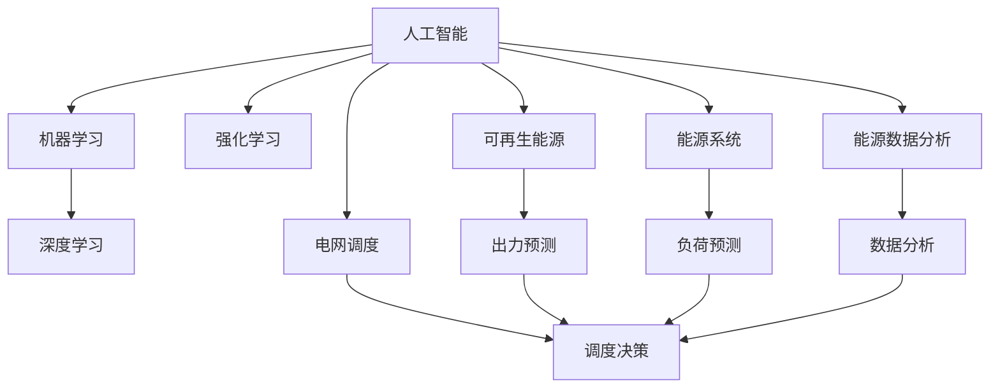

                 

# 人工智能在新能源开发中的应用：优化能源系统

> 关键词：人工智能,新能源,能源系统,优化,机器学习,深度学习,能源数据分析

## 1. 背景介绍

### 1.1 问题由来
随着全球能源需求的日益增长，传统化石燃料的使用带来的环境污染和资源枯竭问题愈发严重。新能源，特别是可再生能源（如太阳能、风能、水能等）的开发和利用，成为未来能源系统发展的方向。然而，新能源的间歇性、不稳定性等特性，使得其大规模接入电网带来了诸多挑战。

能源系统的优化，需要综合考虑新能源出力的随机性、负荷预测的不确定性、电网调度管理的复杂性等因素。传统能源系统优化方法主要依赖经验规则和专家知识，难以应对复杂的非线性动态特性。人工智能（AI）技术，尤其是机器学习（ML）和深度学习（DL），以其强大的数据处理和模型学习能力，为新能源系统优化提供了新的可能性。

### 1.2 问题核心关键点
人工智能在新能源系统中的应用，主要涉及以下几个关键点：
- 数据驱动的决策：利用大数据分析技术，获取新能源和负荷的历史和实时数据，为优化决策提供科学依据。
- 预测与决策：结合机器学习和深度学习算法，对新能源出力和负荷进行准确预测，优化电网调度和管理。
- 自适应控制：通过强化学习（RL）等技术，构建智能自适应控制策略，提升系统响应速度和鲁棒性。
- 优化算法：开发高效优化算法，如遗传算法（GA）、粒子群优化（PSO）、蚁群优化（ACO）等，实现新能源系统的智能优化。
- 安全与稳定：确保人工智能系统在电网稳定运行、数据隐私保护、安全防护等方面的安全性。

这些核心关键点共同构成了人工智能在新能源系统优化中的研究基础，助力实现能源系统的智能化和可持续发展。

## 2. 核心概念与联系

### 2.1 核心概念概述

为更好地理解人工智能在新能源系统中的应用，本节将介绍几个密切相关的核心概念：

- 人工智能（Artificial Intelligence, AI）：一种通过模拟人脑进行信息处理和决策的技术，包含机器学习（ML）、深度学习（DL）、自然语言处理（NLP）等子领域。
- 机器学习（Machine Learning, ML）：利用数据训练算法模型，使模型自动获取数据的规律和特征，实现预测、分类、聚类等任务。
- 深度学习（Deep Learning, DL）：一种基于神经网络结构的机器学习方法，具有强大的数据表达和处理能力，广泛应用于图像、语音、文本等数据领域。
- 强化学习（Reinforcement Learning, RL）：通过智能体与环境交互，学习最大化奖励的策略，用于解决动态环境下的决策问题。
- 可再生能源（Renewable Energy, RE）：如太阳能、风能、水能等，具有环保、可再生的特点，但其出力具有不确定性。
- 能源系统（Energy System）：包括发电、输电、配电和用电等环节，是实现能源高效利用和优化管理的重要组成部分。
- 电网调度（Grid Dispatch）：根据能源系统状态，调整发电机和负荷的出力，维持系统稳定运行和优化目标。
- 能源数据分析（Energy Data Analysis）：利用大数据分析技术，挖掘能源数据中的规律和特征，支持决策优化。

这些核心概念之间的逻辑关系可以通过以下Mermaid流程图来展示：



这个流程图展示了一些关键概念的关联关系：

1. 人工智能技术涵盖机器学习、深度学习和强化学习等多个子领域，共同支撑能源系统优化的各个环节。
2. 可再生能源的出力和负荷预测是电网调度的基础。
3. 数据分析为决策提供支持。
4. 智能调度决策是能源系统优化的核心。

## 3. 核心算法原理 & 具体操作步骤
### 3.1 算法原理概述

人工智能在新能源系统中的应用，核心在于利用机器学习和深度学习算法对新能源出力和负荷进行预测，通过优化算法实现智能调度决策。其核心算法原理包括：

1. 数据预处理：对新能源出力和负荷的历史数据进行清洗、归一化等预处理，为模型训练提供高质量数据。
2. 预测模型：利用时间序列预测算法、深度学习模型等，对新能源出力和负荷进行准确预测，为调度决策提供依据。
3. 调度优化：结合线性规划（LP）、混合整数线性规划（MILP）等优化算法，对新能源接入和负荷分配进行优化，实现系统最优运行。
4. 自适应控制：通过强化学习算法，构建自适应控制策略，提升系统响应速度和鲁棒性。
5. 安全防护：通过数据加密、模型监控等技术，确保系统的安全性。

### 3.2 算法步骤详解

人工智能在新能源系统优化中的操作步骤一般包括以下几个关键步骤：

**Step 1: 数据采集与预处理**
- 收集新能源出力和负荷的历史数据，包括发电时间、发电量、负载时间、负载量等。
- 对数据进行清洗、归一化、去除异常值等预处理操作，确保数据质量。

**Step 2: 构建预测模型**
- 选择合适的预测模型，如时间序列预测模型ARIMA、深度学习模型如LSTM、GRU等。
- 使用历史数据训练模型，评估模型的预测性能。
- 结合模型预测结果和实际情况，对模型进行调参和优化。

**Step 3: 调度优化模型构建**
- 构建优化模型，如线性规划、混合整数线性规划等。
- 设定优化目标，如最大化系统可靠性、最小化系统损耗等。
- 将预测模型输出的数据作为优化模型的输入。

**Step 4: 自适应控制策略设计**
- 设计强化学习策略，如Q-learning、Deep Q-learning等。
- 将优化模型输出的决策结果作为强化学习模型的输入，不断迭代更新控制策略。

**Step 5: 系统集成与测试**
- 将预测模型、优化模型和自适应控制策略集成到能源系统中。
- 在仿真环境中对系统进行测试，评估系统的优化效果和鲁棒性。

**Step 6: 部署与监控**
- 将优化后的系统部署到实际环境中，进行长时间运行测试。
- 实时监控系统状态，及时发现和解决运行中的问题。

### 3.3 算法优缺点

人工智能在新能源系统中的应用具有以下优点：
1. 数据驱动决策：通过大数据分析，提供科学依据，提高决策的准确性和可靠性。
2. 精准预测：深度学习模型能够处理非线性、高维度数据，提高预测的精度和鲁棒性。
3. 智能优化：通过优化算法，实现系统最优运行，提高系统效率和稳定性。
4. 自适应控制：强化学习算法能够根据环境变化，动态调整控制策略，提高系统响应速度和鲁棒性。
5. 安全防护：通过数据加密、模型监控等技术，确保系统的安全性。

然而，人工智能在新能源系统中的应用也存在一些缺点：
1. 数据质量要求高：数据预处理和清洗需要高精度和大量资源。
2. 模型复杂度高：深度学习模型和优化算法计算量大，对硬件要求高。
3. 解释性不足：部分算法模型如深度学习模型，难以解释其内部工作机制，不利于人工干预和调试。
4. 安全性问题：模型可能存在潜在的安全漏洞，数据隐私保护和模型攻击防御仍需进一步研究。

尽管存在这些缺点，但人工智能在新能源系统中的应用已经取得了显著成效，未来仍有巨大的发展潜力。

### 3.4 算法应用领域

人工智能在新能源系统中的应用，主要涉及以下几个领域：

- 新能源出力预测：利用时间序列预测和深度学习模型，对太阳能、风能等新能源的出力进行准确预测，为调度决策提供依据。
- 负荷预测与优化：对用户的用电负荷进行预测和优化，平衡新能源接入和负荷分配，提高系统效率。
- 智能调度与控制：结合优化算法和强化学习算法，实现智能调度决策和自适应控制，提升系统响应速度和稳定性。
- 数据分析与可视化：利用大数据分析技术，挖掘能源数据中的规律和特征，支持决策优化和可视化展示。
- 仿真与测试：构建能源系统的仿真环境，对优化模型和控制策略进行测试和验证。
- 实际应用与部署：将优化模型和自适应控制策略集成到实际系统中，进行长时间运行测试和监控。

这些应用领域展示了人工智能技术在新能源系统中的广泛应用前景。

## 4. 数学模型和公式 & 详细讲解  
### 4.1 数学模型构建

人工智能在新能源系统中的应用，涉及多种数学模型。以下将以时间序列预测模型和优化模型为例，详细讲解数学模型的构建。

**时间序列预测模型**
假设新能源出力 $y_t$ 可以表示为：
$$ y_t = \alpha + \beta t + \sum_{i=1}^k \gamma_i y_{t-i} + \epsilon_t $$
其中 $t$ 表示时间步长，$\alpha, \beta, \gamma_i$ 为模型参数，$\epsilon_t$ 为误差项。

通过对模型进行最小二乘法求解，可以估计出模型参数。预测未来的新能源出力时，可以代入当前时间步长 $t$，得到：
$$ \hat{y}_{t+1} = \alpha + \beta (t+1) + \sum_{i=1}^k \gamma_i \hat{y}_{t-i+1} $$

**线性规划模型**
线性规划模型可以表示为：
$$ \min \quad \sum_{i=1}^n c_i x_i $$
$$ \text{subject to} $$
$$ \sum_{j=1}^m a_{ij} x_i \geq b_i, \quad i=1,\ldots,n $$
$$ x_i \geq 0, \quad i=1,\ldots,n $$
其中 $x_i$ 为决策变量，$c_i$ 为成本系数，$a_{ij}$ 为约束条件系数，$b_i$ 为约束条件右侧值。

通过求解上述线性规划问题，可以实现系统优化目标。例如，最小化系统成本，最大化系统可靠性等。

### 4.2 公式推导过程

**时间序列预测模型的推导**
对于时间序列预测模型，其最小二乘法求解公式为：
$$ \hat{\beta} = (X^TX)^{-1}X^Ty $$
$$ \hat{\alpha} = \bar{y} - \hat{\beta} \bar{t} $$
其中 $X = \begin{bmatrix} 1 & t_1 & \cdots & t_k \end{bmatrix}^T$，$y = \begin{bmatrix} y_1 & y_2 & \cdots & y_{n-1} \end{bmatrix}^T$，$\bar{y} = \frac{1}{n} \sum_{i=1}^n y_i$，$\bar{t} = \frac{1}{n} \sum_{i=1}^n t_i$。

**线性规划模型的推导**
线性规划模型的求解通常使用单纯形法或内点法。以单纯形法为例，其求解步骤如下：

1. 初始可行解：选择初始基本可行解。
2. 计算单位阶梯：计算单位阶梯方向，更新可行解。
3. 迭代计算：重复步骤2，直至收敛。

具体的计算过程可以参考线性规划相关书籍或文献。

### 4.3 案例分析与讲解

**案例：智能电网调度**
假设某智能电网系统，需要优化新能源接入和负荷分配，以最大化系统可靠性。可以构建以下线性规划模型：
$$ \min \quad \sum_{i=1}^n c_i x_i $$
$$ \text{subject to} $$
$$ \sum_{j=1}^m a_{ij} x_i \geq b_i, \quad i=1,\ldots,n $$
$$ x_i \geq 0, \quad i=1,\ldots,n $$

其中，$x_i$ 表示第 $i$ 个新能源发电站的接入量，$c_i$ 为第 $i$ 个发电站的接入成本，$a_{ij}$ 表示第 $j$ 个负荷节点的容量限制，$b_i$ 表示第 $i$ 个负荷节点的容量需求。

通过求解上述线性规划问题，可以得到最优的新能源接入量，以最大化系统可靠性。

## 5. 项目实践：代码实例和详细解释说明
### 5.1 开发环境搭建

在进行人工智能在新能源系统中的应用实践前，我们需要准备好开发环境。以下是使用Python进行TensorFlow开发的环境配置流程：

1. 安装Anaconda：从官网下载并安装Anaconda，用于创建独立的Python环境。

2. 创建并激活虚拟环境：
```bash
conda create -n tensorflow-env python=3.8 
conda activate tensorflow-env
```

3. 安装TensorFlow：根据CUDA版本，从官网获取对应的安装命令。例如：
```bash
conda install tensorflow tensorflow-cpu -c conda-forge
```

4. 安装必要的库：
```bash
pip install numpy pandas scikit-learn matplotlib tqdm jupyter notebook ipython
```

完成上述步骤后，即可在`tensorflow-env`环境中开始项目实践。

### 5.2 源代码详细实现

下面我们以基于深度学习的时间序列预测模型为例，给出TensorFlow代码实现。

首先，定义时间序列预测模型的超参数：

```python
import tensorflow as tf

epochs = 100
batch_size = 128
learning_rate = 0.001
hidden_units = 64
```

然后，定义时间序列预测模型的输入和输出：

```python
def create_model(input_shape, hidden_units):
    model = tf.keras.models.Sequential([
        tf.keras.layers.Input(shape=input_shape),
        tf.keras.layers.Bidirectional(tf.keras.layers.LSTM(hidden_units, return_sequences=True)),
        tf.keras.layers.Bidirectional(tf.keras.layers.LSTM(hidden_units)),
        tf.keras.layers.Dense(1)
    ])
    model.compile(loss='mse', optimizer=tf.keras.optimizers.Adam(learning_rate))
    return model
```

接着，定义数据预处理和模型训练函数：

```python
def preprocess_data(data):
    # 对数据进行归一化
    data_mean = data.mean(axis=0)
    data_std = data.std(axis=0)
    data = (data - data_mean) / data_std
    
    # 对数据进行滑动窗口划分
    window_size = 24
    features = []
    targets = []
    for i in range(len(data) - window_size):
        features.append(data[i:i+window_size, :])
        targets.append(data[i+window_size, 0])
    features = np.array(features)
    targets = np.array(targets)
    return features, targets

def train_model(model, features, targets):
    model.fit(features, targets, batch_size=batch_size, epochs=epochs, verbose=1)
    return model
```

最后，启动训练流程并测试模型：

```python
features, targets = preprocess_data(data)

model = create_model((None, 3), hidden_units)
model = train_model(model, features, targets)

# 对测试数据进行预测
test_features, test_targets = preprocess_data(test_data)
test_predictions = model.predict(test_features)
```

以上就是使用TensorFlow进行时间序列预测模型的代码实现。可以看到，TensorFlow的高级API使得模型的构建和训练变得简洁高效。

### 5.3 代码解读与分析

让我们再详细解读一下关键代码的实现细节：

**create_model函数**：
- 定义了一个包含两个LSTM层的深度学习模型，用于时间序列预测。
- 使用Bidirectional封装，使得模型具有双向特征提取能力。
- 最后一层为全连接层，输出预测值。
- 使用Adam优化器进行模型训练，损失函数为均方误差（MSE）。

**preprocess_data函数**：
- 对原始数据进行归一化和滑动窗口划分，生成模型的训练输入和输出。
- 利用Numpy数组封装输入和输出，方便TensorFlow的模型训练。

**train_model函数**：
- 对模型进行训练，指定训练次数和批次大小。
- 使用verbose参数控制训练过程中的输出。

**模型训练和测试**：
- 利用preprocess_data函数处理数据，并调用train_model函数进行模型训练。
- 在测试集上对模型进行预测，并输出预测结果。

通过以上步骤，我们可以高效地构建和训练时间序列预测模型，用于新能源出力的预测和调度优化。

## 6. 实际应用场景
### 6.1 智能电网调度

基于人工智能的新能源系统优化，在智能电网调度中具有广泛的应用前景。智能电网调度系统需要实时监测新能源出力和负荷变化，动态调整调度策略，以确保系统稳定运行和优化目标的实现。

在实际应用中，可以通过时间序列预测模型对新能源出力和负荷进行预测，结合优化算法和自适应控制策略，构建智能电网调度系统。例如，可以利用深度学习模型预测太阳能和风能的出力，使用线性规划模型优化电网调度，结合强化学习策略进行实时调整，确保系统在多变环境下的高效稳定运行。

### 6.2 能源数据分析

能源数据分析是新能源系统优化中的重要环节，通过对能源数据进行挖掘和分析，可以发现潜在的问题和优化机会。

在实际应用中，可以利用大数据分析技术，对新能源出力、负荷、天气等因素进行综合分析，提取有价值的信息。例如，可以使用机器学习模型预测天气变化对新能源出力的影响，结合负荷预测结果，优化电网调度策略。同时，利用可视化工具展示分析结果，为决策者提供直观的参考依据。

### 6.3 智能配电管理

智能配电管理是新能源系统优化的另一个重要应用场景。配电管理需要实时监测和优化电网的负荷分配，确保电力供应的稳定性。

在实际应用中，可以通过机器学习模型对负荷进行预测，结合优化算法和自适应控制策略，优化电网的负荷分配。例如，利用深度学习模型预测用户用电负荷的变化趋势，结合优化算法进行动态分配，确保电力供应的稳定性和可靠性。同时，利用强化学习策略进行实时调整，提升系统响应速度和鲁棒性。

### 6.4 未来应用展望

人工智能在新能源系统中的应用前景广阔，未来将涵盖更多领域和环节。以下是几个未来应用展望：

- 动态电网规划：结合机器学习和深度学习算法，对新能源分布和负荷需求进行预测，构建动态电网规划方案，提升电网规划的准确性和科学性。
- 智能运维管理：利用传感器数据和机器学习模型，实时监测设备状态和运行情况，预测设备故障，进行智能运维管理，提升系统可靠性和运维效率。
- 虚拟电厂管理：通过人工智能技术，将分散的能源资源整合为虚拟电厂，实现能源的高效管理和优化调度，提高能源利用率。
- 智能储能管理：结合机器学习和强化学习算法，优化储能系统的充放电策略，实现能源的高效存储和利用，提升系统稳定性和可靠性。
- 综合能源管理：利用人工智能技术，整合多种能源资源，构建综合能源管理系统，实现能源的高效管理和优化调度，提升能源利用效率和系统稳定性。

## 7. 工具和资源推荐
### 7.1 学习资源推荐

为了帮助开发者系统掌握人工智能在新能源系统中的应用，这里推荐一些优质的学习资源：

1. 《深度学习》书籍：Ian Goodfellow等人合著，全面介绍了深度学习的基本概念、算法和应用。
2. 《机器学习实战》书籍：Peter Harrington所著，结合实际案例，介绍了机器学习的基本概念和实现方法。
3. 《强化学习》书籍：Richard S. Sutton和Andrew G. Barto合著，介绍了强化学习的基本概念、算法和应用。
4. TensorFlow官方文档：TensorFlow官方文档，提供了丰富的API文档和教程，是TensorFlow开发的必备资源。
5. Keras官方文档：Keras官方文档，提供了简单易用的API，支持快速构建深度学习模型。
6. PyTorch官方文档：PyTorch官方文档，提供了先进的深度学习框架，支持灵活的模型构建和训练。

通过对这些资源的学习实践，相信你一定能够快速掌握人工智能在新能源系统中的应用精髓，并用于解决实际的能源优化问题。

### 7.2 开发工具推荐

高效的开发离不开优秀的工具支持。以下是几款用于人工智能在新能源系统中的应用开发的常用工具：

1. TensorFlow：由Google主导开发的开源深度学习框架，支持分布式计算，适合大规模工程应用。
2. PyTorch：Facebook开发的开源深度学习框架，灵活性高，支持动态计算图，适合快速迭代研究。
3. Jupyter Notebook：支持Python和其他语言，提供可视化的开发环境，适合数据科学和机器学习开发。
4. Google Colab：谷歌提供的免费在线Jupyter Notebook环境，支持GPU计算，适合快速实验和演示。
5. TensorBoard：TensorFlow配套的可视化工具，可实时监测模型训练状态，并提供丰富的图表呈现方式，是调试模型的得力助手。
6. Weights & Biases：模型训练的实验跟踪工具，可以记录和可视化模型训练过程中的各项指标，方便对比和调优。

合理利用这些工具，可以显著提升人工智能在新能源系统中的应用开发效率，加快创新迭代的步伐。

### 7.3 相关论文推荐

人工智能在新能源系统中的应用研究源于学界的持续研究。以下是几篇奠基性的相关论文，推荐阅读：

1. 《A Deep Learning Approach to Predict Solar Power Generation》：利用深度学习模型对太阳能出力进行预测，提高调度决策的准确性。
2. 《Optimal Power Flow Using Deep Reinforcement Learning》：利用深度强化学习算法，优化电力系统的运行，提高系统的稳定性和可靠性。
3. 《Energy System Optimization with Multi-objective Evolutionary Algorithms》：利用进化算法优化能源系统的运行，平衡多个优化目标。
4. 《Energy Data Analytics with Machine Learning》：利用机器学习技术，挖掘能源数据中的规律和特征，支持决策优化。
5. 《A Comprehensive Review of Artificial Intelligence in Energy》：综述人工智能技术在能源系统中的应用，为相关研究提供了全面的视角。

这些论文代表了大数据、机器学习和深度学习在新能源系统优化中的最新进展，值得深入学习和参考。

## 8. 总结：未来发展趋势与挑战

### 8.1 总结

本文对人工智能在新能源系统中的应用进行了全面系统的介绍。首先阐述了人工智能技术在新能源系统优化中的研究背景和意义，明确了时间序列预测、优化算法、自适应控制等核心技术的应用。其次，从原理到实践，详细讲解了人工智能在新能源系统中的应用流程，包括数据预处理、模型训练、优化决策等关键环节，给出了具体的代码实例和分析解读。同时，本文还广泛探讨了人工智能在新能源系统优化中的各种应用场景，展示了其广阔的应用前景。

通过本文的系统梳理，可以看到，人工智能技术在新能源系统中的应用已经取得了显著成效，大大提升了系统的智能化水平和运行效率。未来，伴随技术不断进步，人工智能在新能源系统中的应用将更加广泛和深入，为能源系统的可持续发展提供强大支持。

### 8.2 未来发展趋势

展望未来，人工智能在新能源系统中的应用将呈现以下几个发展趋势：

1. 深度学习算法的进步：深度学习算法的不断进步，将进一步提高时间序列预测和负荷预测的准确性，提升系统优化效果。
2. 强化学习的应用推广：强化学习算法在新能源系统中的应用将越来越广泛，提升系统的自适应能力和响应速度。
3. 多模态数据的融合：结合多模态数据（如天气、交通、物联网数据等），构建更全面、更准确的预测和优化模型。
4. 分布式计算的优化：利用分布式计算技术，提升模型训练和优化速度，支持大规模数据处理和模型训练。
5. 实时系统的构建：通过实时数据流处理技术，构建实时运行的系统，提高系统的动态响应能力和稳定性。
6. 人机协同决策：利用人工智能技术，构建智能决策支持系统，辅助决策者进行复杂的多目标优化决策。

这些趋势凸显了人工智能在新能源系统优化中的重要地位，预示着未来人工智能技术在新能源系统中的深入应用和广泛应用。

### 8.3 面临的挑战

尽管人工智能在新能源系统中的应用已经取得了显著成效，但在迈向更加智能化、普适化应用的过程中，仍面临诸多挑战：

1. 数据质量问题：新能源出力和负荷数据的质量直接影响模型预测和优化效果，数据清洗和预处理需要高精度和大量资源。
2. 模型复杂性：深度学习模型和优化算法计算量大，对硬件资源要求高，模型训练和优化过程复杂。
3. 解释性不足：部分算法模型如深度学习模型，难以解释其内部工作机制，不利于人工干预和调试。
4. 安全性问题：模型可能存在潜在的安全漏洞，数据隐私保护和模型攻击防御仍需进一步研究。
5. 环境适应性：不同地理、气候条件下的能源系统优化问题仍需进一步研究和解决。
6. 多目标优化：能源系统的优化目标多样，需要考虑环境、经济、社会等多个方面的因素，多目标优化的复杂度较高。

这些挑战需要学界和产业界共同努力，积极应对并寻求突破，以进一步推动人工智能在新能源系统中的应用。

### 8.4 研究展望

面向未来，人工智能在新能源系统中的应用研究需要在以下几个方面寻求新的突破：

1. 多模态数据融合技术：将多种数据源（如天气、交通、物联网数据等）进行融合，构建更全面、更准确的预测和优化模型。
2. 自适应模型构建：根据环境变化，动态调整模型参数和结构，提升系统的适应性和鲁棒性。
3. 智能决策支持系统：利用人工智能技术，构建智能决策支持系统，辅助决策者进行复杂的多目标优化决策。
4. 实时数据流处理：利用实时数据流处理技术，构建实时运行的系统，提高系统的动态响应能力和稳定性。
5. 模型压缩与优化：通过模型压缩、稀疏化等技术，优化模型结构，提升模型推理速度和资源利用效率。
6. 安全与隐私保护：研究数据隐私保护和模型安全防护技术，确保系统的安全性和稳定性。

这些研究方向和技术的探索，必将引领人工智能在新能源系统中的应用技术迈向更高的台阶，为构建智能、高效、稳定的能源系统铺平道路。

## 9. 附录：常见问题与解答

**Q1：人工智能在新能源系统中如何处理数据质量问题？**

A: 数据质量问题在人工智能在新能源系统中的应用中非常重要。解决数据质量问题的方法包括：
1. 数据清洗：去除数据中的噪声、异常值和不一致性，确保数据的准确性和完整性。
2. 数据归一化：对数据进行归一化处理，使得数据符合模型输入的要求，避免模型训练过程中的异常现象。
3. 数据增强：通过数据增强技术，扩充训练集，提高模型的泛化能力。
4. 数据融合：结合多种数据源，构建更全面、更准确的数据模型，提升模型的预测和优化效果。

**Q2：人工智能在新能源系统中如何提高模型的解释性？**

A: 提高模型的解释性对于人工智能在新能源系统中的应用至关重要。提高模型解释性的方法包括：
1. 模型简化：通过简化模型结构，降低模型的复杂度，提高模型的可解释性。
2. 特征可视化：利用特征可视化技术，展示模型的输入和输出之间的关系，帮助理解模型的工作机制。
3. 解释模型：使用可解释性强的模型，如决策树、线性回归等，提高模型的可解释性。
4. 模型监测：通过模型监测技术，实时跟踪模型的运行状态和性能，及时发现和解决问题。

**Q3：人工智能在新能源系统中如何保障系统的安全性？**

A: 保障系统的安全性是人工智能在新能源系统中的应用中必须解决的问题。保障系统安全性的方法包括：
1. 数据加密：对数据进行加密处理，保护数据隐私和安全。
2. 模型安全：研究模型攻击防御技术，确保模型的安全性。
3. 权限控制：设置访问权限，控制系统的访问和操作，防止未授权访问和操作。
4. 异常检测：通过异常检测技术，及时发现和处理异常行为，保障系统的稳定性和可靠性。

**Q4：人工智能在新能源系统中如何优化实时系统的构建？**

A: 构建实时系统是人工智能在新能源系统中的应用中的重要环节。优化实时系统的构建方法包括：
1. 实时数据流处理：利用实时数据流处理技术，实现数据的实时采集和处理，提高系统的响应速度。
2. 分布式计算：利用分布式计算技术，实现模型的并行计算和优化，提升系统的高效性和稳定性。
3. 系统优化：优化系统的架构和设计，提高系统的稳定性和可靠性。
4. 实时监控：通过实时监控技术，及时发现和处理系统异常，保障系统的稳定性和安全性。

**Q5：人工智能在新能源系统中如何提升系统的环境适应性？**

A: 提升系统的环境适应性是人工智能在新能源系统中的应用中的关键问题。提升系统环境适应性的方法包括：
1. 多模态数据融合：结合多种数据源，构建更全面、更准确的数据模型，提升系统的环境适应性。
2. 动态模型构建：根据环境变化，动态调整模型参数和结构，提升系统的适应性和鲁棒性。
3. 环境模拟：通过环境模拟技术，构建仿真环境，测试和验证模型的环境适应性。
4. 模型优化：通过模型优化技术，提升模型的泛化能力和适应性。

这些方法可以提升人工智能在新能源系统中的应用效果和系统的环境适应性，确保系统在复杂环境下的高效稳定运行。

---

作者：禅与计算机程序设计艺术 / Zen and the Art of Computer Programming

