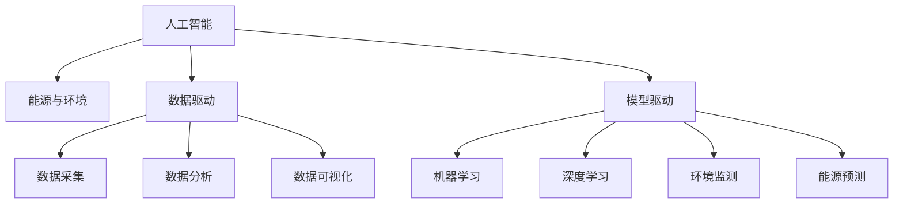

                 

# 人工智能在能源和环境中的应用

## 1. 背景介绍

### 1.1 问题由来

在当今世界，能源和环境问题正变得越来越严峻。全球变暖、能源枯竭、环境污染等挑战对人类的生存和发展构成了严重威胁。与此同时，随着信息技术的发展，人工智能(AI)技术已经成为解决这些问题的有力工具。AI在能源和环境领域的应用，能够实现高效能、低成本、环境友好的资源利用，有力推动可持续发展。

AI在能源领域的应用，包括智能电网、能源管理、能源预测等方面。通过AI技术，可以实现能源供需预测、智能调度、能源消耗优化等目标，有效提升能源利用效率，降低能源消耗和浪费。

AI在环境领域的应用，包括环境监测、污染源识别、垃圾分类等方面。通过AI技术，可以实现对自然灾害的预测、环境污染的识别与治理、垃圾分类与回收等，实现环境保护与资源循环利用，推动生态文明建设。

### 1.2 问题核心关键点

AI在能源和环境中的应用，主要是通过数据驱动和模型驱动的方式实现的。其中，数据驱动包括数据采集、数据分析和数据可视化，以获取环境状况和能源利用数据。模型驱动则包括使用机器学习和深度学习模型进行数据分析和预测，以辅助决策和管理。

AI在能源和环境中的应用，涉及到数据管理、数据分析、模型训练和部署等多个环节。具体而言，包括：

1. **数据采集与处理**：从各种传感器、环境监测站、能源监测设备等获取实时数据。
2. **数据分析与建模**：使用机器学习和深度学习模型，对采集到的数据进行分析，建立环境状况和能源利用模型。
3. **模型训练与优化**：使用历史数据训练模型，并根据实时数据进行优化。
4. **模型部署与监控**：将训练好的模型部署到实际应用环境中，并对其进行实时监控和优化。

这些关键点共同构成了AI在能源和环境应用的核心框架，其应用效果直接决定了模型性能和实际应用效果。

## 2. 核心概念与联系

### 2.1 核心概念概述

为更好地理解AI在能源和环境中的应用，本节将介绍几个密切相关的核心概念：

- **人工智能(AI)**：通过模拟人脑的思维和决策过程，使机器具备类似于人类的智能功能。
- **能源与环境**：指包括能源生产和消费、环境保护和治理等领域。
- **数据驱动**：利用大量数据进行分析和决策，以指导实际应用。
- **模型驱动**：通过构建和训练模型，以预测和优化决策。
- **机器学习(ML)**：利用算法和统计模型，对数据进行学习和预测。
- **深度学习(DL)**：利用深度神经网络，处理复杂的数据和任务。
- **环境监测**：对环境状况进行实时监测，如空气质量、水质、噪音等。
- **能源预测**：对能源消耗和供应进行预测，如电力负荷、燃料需求等。

这些概念之间的逻辑关系可以通过以下Mermaid流程图来展示：



这个流程图展示了AI在能源和环境领域应用的几个核心环节：

1. 数据驱动和模型驱动：AI在能源和环境中的应用主要依赖于数据和模型。
2. 数据采集、数据分析和数据可视化：获取实时数据并进行初步处理。
3. 机器学习和深度学习：对数据进行分析，构建环境状况和能源利用模型。
4. 环境监测和能源预测：使用模型进行环境状况和能源供需预测，辅助决策。

## 3. 核心算法原理 & 具体操作步骤

### 3.1 算法原理概述

AI在能源和环境中的应用，主要基于数据驱动和模型驱动两种方式。数据驱动方式利用实时数据进行分析和预测，模型驱动方式则通过建立和训练模型，辅助决策和管理。

以环境监测为例，数据驱动方式下，首先通过传感器和监测站采集环境数据，然后利用数据分析和可视化工具对数据进行处理和展示。在模型驱动方式下，使用机器学习或深度学习模型，对环境数据进行分析，构建环境状况模型，进行污染源识别和预测。

以能源预测为例，数据驱动方式下，通过能源监测设备获取能源消耗数据，并进行数据分析和可视化。在模型驱动方式下，使用机器学习或深度学习模型，对能源消耗数据进行分析，构建能源供需模型，进行能源预测和优化。

### 3.2 算法步骤详解

#### 3.2.1 数据驱动方式

1. **数据采集**：通过传感器、监测站等设备，实时采集环境或能源数据。
2. **数据清洗**：对采集到的数据进行清洗和预处理，去除噪声和异常值。
3. **数据分析**：对清洗后的数据进行统计分析，如均值、方差、标准差等。
4. **数据可视化**：使用可视化工具，将分析结果进行展示，便于观察和分析。

#### 3.2.2 模型驱动方式

1. **模型选择**：根据任务需求选择合适的模型，如线性回归、决策树、随机森林、深度神经网络等。
2. **数据准备**：将采集到的数据进行格式化和预处理，生成训练数据集和测试数据集。
3. **模型训练**：使用训练数据集对模型进行训练，优化模型参数。
4. **模型评估**：使用测试数据集对训练好的模型进行评估，验证模型效果。
5. **模型部署**：将训练好的模型部署到实际应用环境中，进行实时预测和优化。

### 3.3 算法优缺点

AI在能源和环境中的应用，具有以下优点：

- **高效能**：通过数据驱动和模型驱动方式，能够快速获取和处理大量数据，辅助决策和管理。
- **低成本**：利用AI技术进行数据分析和预测，能够大幅降低人工成本。
- **环境友好**：通过优化能源利用和环境保护，能够实现绿色低碳发展。

同时，也存在以下局限性：

- **数据依赖**：AI的应用依赖于数据的质量和数量，数据获取难度较大。
- **模型复杂**：模型训练和优化需要较长的计算时间和计算资源，模型复杂度高。
- **结果不确定**：AI预测和决策存在一定的不确定性，需结合人工经验进行验证和调整。

### 3.4 算法应用领域

AI在能源和环境中的应用，涵盖了能源管理、环境监测、垃圾分类、智能电网等多个领域。具体而言：

1. **能源管理**：利用AI技术进行能源需求预测、能源优化调度、能源消耗优化等，提升能源利用效率。
2. **环境监测**：利用AI技术进行环境状况监测、污染源识别、环境灾害预警等，实现环境治理。
3. **垃圾分类**：利用AI技术进行垃圾识别和分类，提升垃圾处理效率，减少环境污染。
4. **智能电网**：利用AI技术进行电力负荷预测、电力分配优化等，提升电网运行效率。

这些应用领域展示了AI在能源和环境中的广泛应用，为实现绿色低碳发展提供了强有力的技术支持。

## 4. 数学模型和公式 & 详细讲解 & 举例说明

### 4.1 数学模型构建

AI在能源和环境中的应用，通常涉及到时间序列预测和分类预测两种模型。以环境监测为例，常用的数学模型包括：

- **时间序列模型**：如ARIMA模型、LSTM模型、GRU模型等，用于预测环境状况随时间的变化趋势。
- **分类模型**：如SVM模型、随机森林模型、深度神经网络模型等，用于识别污染源和环境灾害。

### 4.2 公式推导过程

以ARIMA模型为例，其基本公式为：

$$
Y_t = c + \sum_{i=1}^p\alpha_i Y_{t-i} + \sum_{i=1}^q\beta_i\Delta Y_{t-i} + \epsilon_t
$$

其中，$Y_t$ 为时间序列第 $t$ 个数据，$c$ 为截距项，$\alpha_i$ 为自回归系数，$\beta_i$ 为差分系数，$\epsilon_t$ 为随机误差项。

ARIMA模型通过自回归和差分的方式，对时间序列数据进行建模和预测。通过调整模型的自回归和差分参数，可以适应不同的数据特征和时间趋势。

### 4.3 案例分析与讲解

以空气质量预测为例，可以使用ARIMA模型进行环境监测。具体步骤如下：

1. **数据采集**：通过空气质量监测站，实时采集空气质量数据。
2. **数据预处理**：对采集到的数据进行清洗和预处理，去除异常值和噪声。
3. **模型训练**：使用历史空气质量数据训练ARIMA模型，优化模型参数。
4. **模型预测**：利用训练好的模型，对未来的空气质量进行预测。

## 5. 项目实践：代码实例和详细解释说明

### 5.1 开发环境搭建

在项目实践前，需要准备好开发环境。以下是使用Python进行PyTorch开发的环境配置流程：

1. 安装Anaconda：从官网下载并安装Anaconda，用于创建独立的Python环境。
2. 创建并激活虚拟环境：
```bash
conda create -n pytorch-env python=3.8 
conda activate pytorch-env
```

3. 安装PyTorch：根据CUDA版本，从官网获取对应的安装命令。例如：
```bash
conda install pytorch torchvision torchaudio cudatoolkit=11.1 -c pytorch -c conda-forge
```

4. 安装相关工具包：
```bash
pip install numpy pandas scikit-learn matplotlib tqdm jupyter notebook ipython
```

完成上述步骤后，即可在`pytorch-env`环境中开始项目实践。

### 5.2 源代码详细实现

以空气质量预测为例，以下是使用PyTorch进行ARIMA模型训练的代码实现：

```python
import numpy as np
import pandas as pd
from statsmodels.tsa.arima_model import ARIMA
from sklearn.metrics import mean_squared_error
from torch import nn, optim

# 数据预处理
data = pd.read_csv('air_quality.csv')
data = data.dropna().reset_index(drop=True)
data['date'] = pd.to_datetime(data['date'], format='%Y-%m-%d')
data.set_index('date', inplace=True)

# 模型训练
def train_arima():
    model = ARIMA(data['aqi'], order=(1, 1, 1))
    model_fit = model.fit(disp=0)
    return model_fit

# 模型预测
def predict_arima(model_fit, data):
    forecast = model_fit.forecast(steps=24)[0]
    return forecast

# 模型评估
def evaluate_arima(model_fit, data):
    forecast = predict_arima(model_fit, data)
    mse = mean_squared_error(data['aqi'], forecast)
    return mse

# 训练模型
model_fit = train_arima()

# 预测未来24小时空气质量
forecast = predict_arima(model_fit, data)

# 评估模型效果
mse = evaluate_arima(model_fit, data)
print('MSE:', mse)
```

### 5.3 代码解读与分析

上述代码实现了使用ARIMA模型进行空气质量预测的完整流程，具体步骤如下：

1. **数据预处理**：使用pandas库对采集到的空气质量数据进行清洗和预处理，去除异常值和噪声。
2. **模型训练**：使用statsmodels库中的ARIMA模型进行模型训练，得到优化后的模型参数。
3. **模型预测**：使用训练好的模型，对未来的空气质量进行预测。
4. **模型评估**：使用均方误差(MSE)评估模型的预测效果。

通过上述代码实现，可以迅速搭建和验证空气质量预测的模型，进行实时预测和优化。

## 6. 实际应用场景

### 6.1 智能电网

智能电网是AI在能源领域的重要应用之一，能够实现电力负荷预测、电力分配优化、电网故障监测等功能。通过智能电网，可以提升电网运行效率，降低能源消耗和浪费。

具体而言，可以收集电网的历史负荷数据和实时负荷数据，构建电力负荷预测模型。使用机器学习或深度学习模型，对历史数据进行分析和建模，建立电力负荷预测模型。通过实时数据输入模型，预测未来的电力负荷，进行智能调度和优化，提升电网运行效率。

### 6.2 环境监测

环境监测是AI在环境领域的重要应用之一，能够实现环境状况监测、污染源识别、环境灾害预警等功能。通过环境监测，可以实时了解环境状况，及时采取措施进行治理。

具体而言，可以收集环境监测站的历史数据和实时数据，构建环境状况模型。使用机器学习或深度学习模型，对历史数据进行分析和建模，建立环境状况模型。通过实时数据输入模型，预测未来的环境状况，进行污染源识别和预警，及时采取措施进行治理。

### 6.3 垃圾分类

垃圾分类是AI在环境领域的重要应用之一，能够实现垃圾识别和分类，提升垃圾处理效率，减少环境污染。

具体而言，可以收集垃圾分类器拍摄的图片数据和标签数据，构建垃圾分类模型。使用深度学习模型，对图片数据进行分析和建模，建立垃圾分类模型。通过实时数据输入模型，预测垃圾种类，进行自动分类，提升垃圾处理效率。

### 6.4 未来应用展望

随着AI技术的不断发展，未来AI在能源和环境中的应用将更加广泛和深入。预计未来几年，AI将在以下领域取得重要突破：

1. **能源智能化管理**：通过AI技术进行能源需求预测、能源优化调度、能源消耗优化等，提升能源利用效率。
2. **环境智能治理**：利用AI技术进行环境状况监测、污染源识别、环境灾害预警等，实现环境治理。
3. **垃圾智能分类**：利用AI技术进行垃圾识别和分类，提升垃圾处理效率，减少环境污染。
4. **智能交通管理**：通过AI技术进行交通流量预测、交通信号优化、智能停车等，提升交通运行效率。
5. **智慧农业**：利用AI技术进行土壤监测、作物病虫害预测、智能灌溉等，提升农业生产效率。

这些领域的突破，将进一步推动AI在能源和环境中的应用，为实现绿色低碳发展提供强有力的技术支持。

## 7. 工具和资源推荐

### 7.1 学习资源推荐

为了帮助开发者系统掌握AI在能源和环境中的应用，这里推荐一些优质的学习资源：

1. **深度学习与Python编程**：通过学习深度学习基础知识和Python编程，掌握AI技术的基本原理和实现方法。
2. **机器学习实战**：通过实践项目，理解机器学习和深度学习的实际应用，提升动手能力。
3. **智能电网技术与应用**：了解智能电网的基本概念和技术原理，学习智能电网的应用场景和实践案例。
4. **环境监测与治理**：了解环境监测的基本方法和技术手段，学习环境监测的应用场景和实践案例。
5. **垃圾分类与回收**：了解垃圾分类的基本原理和应用方法，学习垃圾分类和回收的实践案例。

通过对这些资源的学习实践，相信你一定能够迅速掌握AI在能源和环境领域的基本应用，并应用于实际问题解决。

### 7.2 开发工具推荐

高效的开发离不开优秀的工具支持。以下是几款用于AI在能源和环境应用开发的常用工具：

1. **PyTorch**：基于Python的开源深度学习框架，灵活动态的计算图，适合快速迭代研究。大部分AI应用都有PyTorch版本的实现。
2. **TensorFlow**：由Google主导开发的开源深度学习框架，生产部署方便，适合大规模工程应用。同样有丰富的AI应用资源。
3. **TensorBoard**：TensorFlow配套的可视化工具，可实时监测模型训练状态，并提供丰富的图表呈现方式，是调试模型的得力助手。
4. **Weights & Biases**：模型训练的实验跟踪工具，可以记录和可视化模型训练过程中的各项指标，方便对比和调优。与主流深度学习框架无缝集成。
5. **Jupyter Notebook**：开源的交互式笔记本，方便进行数据处理和模型训练，支持多种编程语言。

合理利用这些工具，可以显著提升AI在能源和环境应用开发的效率，加快创新迭代的步伐。

### 7.3 相关论文推荐

AI在能源和环境中的应用，涉及多个前沿研究方向。以下是几篇奠基性的相关论文，推荐阅读：

1. **《深度学习在智能电网中的应用》**：介绍深度学习在智能电网中的应用，包括负荷预测、故障诊断等。
2. **《基于深度学习的空气质量预测模型》**：介绍深度学习在空气质量预测中的应用，包括LSTM模型、CNN模型等。
3. **《智能垃圾分类技术》**：介绍深度学习在垃圾分类中的应用，包括卷积神经网络、注意力机制等。
4. **《基于机器学习的能源需求预测模型》**：介绍机器学习在能源需求预测中的应用，包括ARIMA模型、支持向量机等。
5. **《环境监测与治理中的机器学习》**：介绍机器学习在环境监测中的应用，包括时间序列预测、分类预测等。

这些论文代表了大模型在能源和环境领域的应用发展脉络。通过学习这些前沿成果，可以帮助研究者把握学科前进方向，激发更多的创新灵感。

## 8. 总结：未来发展趋势与挑战

### 8.1 研究成果总结

本文对AI在能源和环境中的应用进行了全面系统的介绍。首先，阐述了AI在能源和环境领域的应用背景和意义，明确了数据驱动和模型驱动两种应用方式。其次，从原理到实践，详细讲解了数据驱动和模型驱动的数学模型和算法步骤，给出了代码实例和详细解释。同时，本文还广泛探讨了AI在能源和环境领域的应用场景，展示了AI技术的巨大潜力。

通过本文的系统梳理，可以看到，AI在能源和环境中的应用，已经成为推动绿色低碳发展的重要技术手段。这些技术的广泛应用，能够有效提升能源利用效率，改善环境状况，实现可持续发展。

### 8.2 未来发展趋势

展望未来，AI在能源和环境中的应用将呈现以下几个发展趋势：

1. **智能化水平提升**：随着算力和数据量的增加，AI模型的复杂度将不断提高，智能化水平将进一步提升。
2. **跨领域融合加速**：AI技术将与其他技术进行更深入的融合，如物联网、区块链、5G等，实现更广泛的应用场景。
3. **数据隐私保护加强**：随着数据规模的扩大，数据隐私和安全问题将更加凸显。如何在保护隐私的前提下，进行数据共享和分析，将是重要的研究方向。
4. **模型解释性增强**：AI模型日益复杂，如何增强模型的可解释性，使其决策过程透明可理解，将是一个重要的研究方向。
5. **多模态信息融合**：AI技术将融合多模态数据，如文本、图像、语音等，实现更全面、准确的信息建模和预测。

以上趋势凸显了AI在能源和环境领域的应用前景。这些方向的探索发展，必将进一步提升AI系统的性能和应用范围，为实现绿色低碳发展提供强有力的技术支持。

### 8.3 面临的挑战

尽管AI在能源和环境中的应用已经取得了一定进展，但在迈向更加智能化、普适化应用的过程中，仍面临诸多挑战：

1. **数据获取难度大**：数据采集和处理是AI应用的基础，但部分领域数据获取难度较大，且数据质量难以保障。
2. **模型复杂度高**：AI模型日趋复杂，训练和优化需要较高的计算资源，且模型效果存在一定的不确定性。
3. **结果不确定性高**：AI模型存在一定的不确定性，结果可能与实际情况有所偏差，需要进行人工验证和调整。
4. **隐私和安全问题**：AI模型处理大量数据，存在数据隐私和安全问题，需要进行数据脱敏和加密等技术手段。
5. **跨领域应用难度大**：不同领域的数据和任务具有较大差异，如何实现跨领域的知识迁移和应用，将是重要的研究方向。

### 8.4 研究展望

面对AI在能源和环境应用所面临的挑战，未来的研究需要在以下几个方面寻求新的突破：

1. **数据获取和处理**：探索高效的数据采集和处理方法，降低数据获取难度和成本，提升数据质量。
2. **模型简化与优化**：开发更加轻量级、高效的AI模型，降低计算资源消耗，提升模型效果。
3. **模型解释性增强**：开发更加可解释的AI模型，提高模型的透明度和可理解性，增强模型的可信度。
4. **跨领域应用**：探索跨领域的知识迁移和应用方法，实现多领域融合，提升AI技术的应用范围和效果。
5. **隐私和安全保护**：探索数据隐私保护和安全的措施，确保数据和模型的安全。

这些研究方向将推动AI在能源和环境领域的应用，实现绿色低碳发展目标。只有勇于创新、敢于突破，才能不断拓展AI在能源和环境领域的应用边界，为实现可持续发展的目标提供有力支持。

## 9. 附录：常见问题与解答

**Q1: AI在能源和环境领域的应用主要包括哪些方面？**

A: AI在能源和环境领域的应用主要包括能源管理、环境监测、垃圾分类、智能电网等方面。具体来说，能源管理可以通过AI技术进行能源需求预测、能源优化调度、能源消耗优化等，提升能源利用效率。环境监测可以利用AI技术进行环境状况监测、污染源识别、环境灾害预警等，实现环境治理。垃圾分类可以通过AI技术进行垃圾识别和分类，提升垃圾处理效率。智能电网可以通过AI技术进行电力负荷预测、电力分配优化等，提升电网运行效率。

**Q2: 数据驱动和模型驱动在AI应用中有何区别？**

A: 数据驱动和模型驱动是AI在能源和环境应用中的两种主要方式。数据驱动方式利用大量数据进行分析和预测，通过数据本身发现规律和趋势。模型驱动方式则是通过构建和训练模型，对数据进行分析预测，通过模型进行逻辑推理和决策。数据驱动方式主要依赖于数据的质量和数量，模型驱动方式则需要在数据和模型上进行双重优化。

**Q3: 如何提高AI在能源和环境应用中的模型效果？**

A: 提高AI在能源和环境应用中的模型效果，可以从以下几个方面入手：
1. 数据采集和处理：获取高质量的数据，并进行清洗和预处理。
2. 模型选择和优化：选择合适的模型，并进行参数调整和优化。
3. 模型训练和评估：进行模型训练，并使用测试集评估模型效果。
4. 模型部署和监控：将训练好的模型部署到实际应用环境中，并进行实时监控和优化。
5. 多模型融合：将多个模型进行融合，提升模型效果和稳定性。

**Q4: 如何进行AI在能源和环境应用中的数据隐私保护？**

A: 进行AI在能源和环境应用中的数据隐私保护，可以从以下几个方面入手：
1. 数据匿名化：将数据中的个人信息进行匿名化处理，防止个人信息泄露。
2. 数据加密：对数据进行加密处理，确保数据传输和存储的安全。
3. 访问控制：对数据访问进行严格控制，确保数据访问的安全。
4. 数据去重：对数据进行去重处理，防止重复数据对模型造成干扰。
5. 隐私保护技术：采用差分隐私、联邦学习等隐私保护技术，保护数据隐私。

**Q5: AI在能源和环境应用中面临的主要挑战有哪些？**

A: AI在能源和环境应用中面临的主要挑战包括：
1. 数据获取难度大：部分领域数据获取难度较大，且数据质量难以保障。
2. 模型复杂度高：AI模型日趋复杂，训练和优化需要较高的计算资源，且模型效果存在一定的不确定性。
3. 结果不确定性高：AI模型存在一定的不确定性，结果可能与实际情况有所偏差，需要进行人工验证和调整。
4. 隐私和安全问题：AI模型处理大量数据，存在数据隐私和安全问题，需要进行数据脱敏和加密等技术手段。
5. 跨领域应用难度大：不同领域的数据和任务具有较大差异，如何实现跨领域的知识迁移和应用，将是重要的研究方向。

以上问题将需要在未来的研究中不断探索和解决，以进一步推动AI在能源和环境领域的应用。

---

作者：禅与计算机程序设计艺术 / Zen and the Art of Computer Programming

