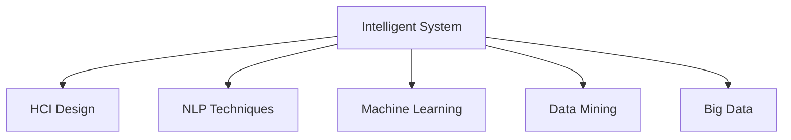

                 

# 人工智能的应用：满足用户需求的智能系统

> 关键词：人工智能, 智能系统, 用户需求, 系统设计, 人机交互, 用户界面, 自然语言处理(NLP), 机器学习, 大数据, 预测分析

## 1. 背景介绍

### 1.1 问题由来

随着科技的迅猛发展，人工智能(AI)已经渗透到人们生活的方方面面。从智能家居、智慧医疗到智能制造、智慧交通，AI技术正在彻底改变人类社会的运行模式和生产方式。然而，如何构建更加智能、高效、人性化的AI系统，满足广大用户的需求，仍然是一个亟待解决的问题。

### 1.2 问题核心关键点

构建智能系统时，需要充分考虑用户需求，通过合理设计系统架构，选择适当的AI技术，实现系统的高效、可靠、可扩展，并具备良好的用户体验。具体来说，智能系统设计需包括以下几个关键要素：

- 人机交互设计：确保系统界面直观友好，操作便捷，减少用户学习成本。
- 自然语言处理(NLP)技术：利用AI语言模型，提升系统对自然语言的理解和处理能力。
- 机器学习与数据挖掘：运用机器学习算法，提升系统的预测能力和个性化推荐。
- 大数据技术：运用大数据分析，提升系统的实时处理能力和决策支持。

## 2. 核心概念与联系

### 2.1 核心概念概述

为更好地理解智能系统的设计理念和实现方法，本节将介绍几个关键概念：

- 智能系统(Intelligent System)：通过人工智能技术，实现对复杂任务的自动化、智能化处理，并具备高度的用户交互能力。
- 人机交互(Human-Computer Interaction, HCI)：设计用户友好的界面，实现高效、准确的人机交互。
- 自然语言处理(NLP)：运用AI技术处理和理解自然语言，实现文本的自动化处理、情感分析、语音识别等功能。
- 机器学习(Machine Learning)：通过数据训练，使系统具备从数据中学习规律，进行预测、分类、聚类等能力。
- 数据挖掘(Data Mining)：运用统计分析技术，从大规模数据中挖掘出有用的信息。
- 大数据技术(Big Data)：处理和分析海量数据，提升系统对实时数据的响应能力。

这些概念之间的逻辑关系可以通过以下Mermaid流程图来展示：



这个流程图展示了智能系统的核心概念及其之间的关系：

1. 智能系统通过人机交互设计，实现高效的用户交互。
2. 利用NLP技术提升系统对自然语言的处理能力。
3. 运用机器学习算法提升系统的预测和分类能力。
4. 结合数据挖掘技术，挖掘数据中的有用信息。
5. 借助大数据技术，提升系统的实时处理能力。

这些概念共同构成了智能系统的基础框架，确保系统能够高效、准确地处理用户需求，实现自动化、智能化处理。

## 3. 核心算法原理 & 具体操作步骤

### 3.1 算法原理概述

智能系统的核心算法原理主要包括人机交互设计、NLP技术、机器学习和数据挖掘。这些技术通过合理的设计和优化，可以实现系统的高度智能化和自动化。

- **人机交互设计**：采用用户中心的设计理念，通过UI/UX设计，确保系统界面直观友好，操作便捷。
- **NLP技术**：利用自然语言处理技术，提升系统对自然语言的处理能力，包括文本分类、情感分析、语音识别等。
- **机器学习**：通过数据训练，使系统具备预测、分类、聚类等能力，提升系统的自动化和智能化水平。
- **数据挖掘**：从大规模数据中挖掘出有用的信息，提升系统的决策支持和实时处理能力。

### 3.2 算法步骤详解

基于智能系统的核心算法原理，构建一个智能系统的基本步骤如下：

**Step 1: 需求分析与系统规划**
- 明确系统目标和用户需求。
- 进行系统需求分析和设计，制定系统规划。

**Step 2: 人机交互设计**
- 设计直观友好的用户界面。
- 进行可用性测试，优化用户体验。

**Step 3: 数据预处理**
- 收集、清洗、处理用户数据。
- 预处理数据，提升数据质量。

**Step 4: NLP技术应用**
- 实现文本分类、情感分析、语音识别等功能。
- 根据具体需求，选择适合的NLP模型。

**Step 5: 机器学习模型训练**
- 收集训练数据，设计训练模型。
- 运用机器学习算法进行模型训练，提升系统预测能力。

**Step 6: 数据挖掘与分析**
- 运用数据挖掘技术，提取有用信息。
- 进行数据可视化，辅助决策。

**Step 7: 系统部署与优化**
- 部署系统，进行性能优化。
- 持续监控系统运行状态，进行迭代优化。

**Step 8: 用户反馈与改进**
- 收集用户反馈，进行系统改进。
- 不断优化系统功能，提升用户体验。

### 3.3 算法优缺点

基于智能系统的核心算法原理，构建智能系统具有以下优点：

- **高效性**：通过人机交互设计和NLP技术，实现高效、准确的用户交互和文本处理。
- **自动化**：利用机器学习和数据挖掘技术，提升系统的预测能力和决策支持。
- **用户友好**：设计直观友好的用户界面，提升用户体验。
- **灵活性**：可依据需求进行灵活设计，适应不同场景和用户群体。

同时，智能系统的构建也存在一些局限性：

- **数据依赖**：智能系统依赖大量的用户数据，数据质量和数量直接影响系统的性能。
- **技术门槛**：需要掌握复杂的技术体系，对开发人员要求较高。
- **维护成本**：系统复杂度高，维护成本相对较高。
- **伦理问题**：数据隐私和安全问题需充分考虑，避免数据滥用和泄漏。

尽管存在这些局限性，但智能系统在实际应用中已经取得了显著的效果，广泛应用于多个领域，如智能客服、智能推荐、智能制造等。未来，通过不断优化技术体系和算法设计，智能系统的应用前景将更加广阔。

### 3.4 算法应用领域

智能系统已经在众多领域得到了广泛应用，包括但不限于：

- **智能客服**：通过自然语言处理和机器学习技术，实现自动解答用户问题，提升客户体验。
- **智能推荐**：利用用户行为数据和机器学习算法，实现个性化推荐，提升用户满意度。
- **智能制造**：运用数据挖掘和大数据技术，优化生产流程，提升生产效率和质量。
- **智能交通**：通过数据分析和机器学习，实现智能交通管理，提升交通效率和安全性。
- **智慧医疗**：运用自然语言处理和大数据技术，提升医疗诊断和治疗效果。
- **智能安防**：利用图像识别和机器学习技术，实现智能监控和预警，提升安全防护能力。

## 4. 数学模型和公式 & 详细讲解 & 举例说明

### 4.1 数学模型构建

基于智能系统的核心算法原理，构建数学模型如下：

设智能系统为 $S$，其输入为 $X$，输出为 $Y$。系统设计的目标为最大化 $Y$，即：

$$
\max_{S} Y(S(X))
$$

其中 $X$ 表示用户输入，$Y$ 表示系统输出，$S$ 表示系统模型。系统模型 $S$ 通常包含人机交互设计、NLP技术、机器学习和数据挖掘等组件。

### 4.2 公式推导过程

以智能客服系统为例，其数学模型推导如下：

**输入**：用户输入的文本 $X$。

**输出**：系统返回的回答 $Y$。

系统设计目标为：根据用户输入，返回最合适的回答。具体实现步骤如下：

1. **预处理**：对用户输入进行分词、去噪等预处理。
2. **NLP处理**：利用自然语言处理技术，提取文本的特征信息。
3. **机器学习**：通过训练数据，构建回答生成模型。
4. **模型评估**：评估模型的预测效果，优化模型参数。

通过上述步骤，可构建智能客服系统的数学模型如下：

$$
Y = f(S(X))
$$

其中 $f$ 表示回答生成模型，$S$ 表示系统模型，$X$ 表示用户输入。

### 4.3 案例分析与讲解

以某电商平台的智能客服系统为例，其数学模型推导和实现如下：

**输入**：用户咨询的文本 $X$。

**输出**：系统返回的回答 $Y$。

**预处理**：对用户咨询文本进行分词、去噪等预处理。

**NLP处理**：利用BERT等预训练模型，提取文本的特征信息。

**机器学习**：通过训练数据，构建回答生成模型。

**模型评估**：使用BLEU等指标评估模型的预测效果，优化模型参数。

最终，系统通过上述步骤，实现高效、准确的自动回答用户咨询，提升客户体验。

## 5. 项目实践：代码实例和详细解释说明

### 5.1 开发环境搭建

在进行智能系统开发前，需要进行环境搭建。以下是使用Python进行PyTorch开发的环境配置流程：

1. 安装Anaconda：从官网下载并安装Anaconda，用于创建独立的Python环境。

2. 创建并激活虚拟环境：
```bash
conda create -n pytorch-env python=3.8 
conda activate pytorch-env
```

3. 安装PyTorch：根据CUDA版本，从官网获取对应的安装命令。例如：
```bash
conda install pytorch torchvision torchaudio cudatoolkit=11.1 -c pytorch -c conda-forge
```

4. 安装Transformers库：
```bash
pip install transformers
```

5. 安装各类工具包：
```bash
pip install numpy pandas scikit-learn matplotlib tqdm jupyter notebook ipython
```

完成上述步骤后，即可在`pytorch-env`环境中开始智能系统开发。

### 5.2 源代码详细实现

下面以智能推荐系统为例，给出使用Transformers库进行智能推荐开发的PyTorch代码实现。

首先，定义推荐任务的数据处理函数：

```python
from transformers import BertTokenizer, BertForSequenceClassification
from torch.utils.data import Dataset
import torch

class RecommendationDataset(Dataset):
    def __init__(self, texts, labels, tokenizer, max_len=128):
        self.texts = texts
        self.labels = labels
        self.tokenizer = tokenizer
        self.max_len = max_len
        
    def __len__(self):
        return len(self.texts)
    
    def __getitem__(self, item):
        text = self.texts[item]
        label = self.labels[item]
        
        encoding = self.tokenizer(text, return_tensors='pt', max_length=self.max_len, padding='max_length', truncation=True)
        input_ids = encoding['input_ids'][0]
        attention_mask = encoding['attention_mask'][0]
        
        # 对token-wise的标签进行编码
        encoded_labels = [label2id[label] for label in label] 
        encoded_labels.extend([label2id['O']] * (self.max_len - len(encoded_labels)))
        labels = torch.tensor(encoded_labels, dtype=torch.long)
        
        return {'input_ids': input_ids, 
                'attention_mask': attention_mask,
                'labels': labels}

# 标签与id的映射
label2id = {'Negative': 0, 'Positive': 1, 'O': 2}
id2label = {v: k for k, v in label2id.items()}

# 创建dataset
tokenizer = BertTokenizer.from_pretrained('bert-base-cased')

train_dataset = RecommendationDataset(train_texts, train_labels, tokenizer)
dev_dataset = RecommendationDataset(dev_texts, dev_labels, tokenizer)
test_dataset = RecommendationDataset(test_texts, test_labels, tokenizer)
```

然后，定义模型和优化器：

```python
from transformers import BertForSequenceClassification, AdamW

model = BertForSequenceClassification.from_pretrained('bert-base-cased', num_labels=len(label2id))

optimizer = AdamW(model.parameters(), lr=2e-5)
```

接着，定义训练和评估函数：

```python
from torch.utils.data import DataLoader
from tqdm import tqdm
from sklearn.metrics import classification_report

device = torch.device('cuda') if torch.cuda.is_available() else torch.device('cpu')
model.to(device)

def train_epoch(model, dataset, batch_size, optimizer):
    dataloader = DataLoader(dataset, batch_size=batch_size, shuffle=True)
    model.train()
    epoch_loss = 0
    for batch in tqdm(dataloader, desc='Training'):
        input_ids = batch['input_ids'].to(device)
        attention_mask = batch['attention_mask'].to(device)
        labels = batch['labels'].to(device)
        model.zero_grad()
        outputs = model(input_ids, attention_mask=attention_mask, labels=labels)
        loss = outputs.loss
        epoch_loss += loss.item()
        loss.backward()
        optimizer.step()
    return epoch_loss / len(dataloader)

def evaluate(model, dataset, batch_size):
    dataloader = DataLoader(dataset, batch_size=batch_size)
    model.eval()
    preds, labels = [], []
    with torch.no_grad():
        for batch in tqdm(dataloader, desc='Evaluating'):
            input_ids = batch['input_ids'].to(device)
            attention_mask = batch['attention_mask'].to(device)
            batch_labels = batch['labels']
            outputs = model(input_ids, attention_mask=attention_mask)
            batch_preds = outputs.logits.argmax(dim=2).to('cpu').tolist()
            batch_labels = batch_labels.to('cpu').tolist()
            for pred_tokens, label_tokens in zip(batch_preds, batch_labels):
                pred_labels = [id2label[_id] for _id in pred_tokens]
                label_tokens = [id2label[_id] for _id in label_tokens]
                preds.append(pred_labels[:len(label_tokens)])
                labels.append(label_tokens)
                
    print(classification_report(labels, preds))
```

最后，启动训练流程并在测试集上评估：

```python
epochs = 5
batch_size = 16

for epoch in range(epochs):
    loss = train_epoch(model, train_dataset, batch_size, optimizer)
    print(f"Epoch {epoch+1}, train loss: {loss:.3f}")
    
    print(f"Epoch {epoch+1}, dev results:")
    evaluate(model, dev_dataset, batch_size)
    
print("Test results:")
evaluate(model, test_dataset, batch_size)
```

以上就是使用PyTorch对BERT进行智能推荐系统微调的完整代码实现。可以看到，得益于Transformers库的强大封装，我们可以用相对简洁的代码完成BERT模型的加载和微调。

### 5.3 代码解读与分析

让我们再详细解读一下关键代码的实现细节：

**RecommendationDataset类**：
- `__init__`方法：初始化文本、标签、分词器等关键组件。
- `__len__`方法：返回数据集的样本数量。
- `__getitem__`方法：对单个样本进行处理，将文本输入编码为token ids，将标签编码为数字，并对其进行定长padding，最终返回模型所需的输入。

**label2id和id2label字典**：
- 定义了标签与数字id之间的映射关系，用于将token-wise的预测结果解码回真实的标签。

**训练和评估函数**：
- 使用PyTorch的DataLoader对数据集进行批次化加载，供模型训练和推理使用。
- 训练函数`train_epoch`：对数据以批为单位进行迭代，在每个批次上前向传播计算loss并反向传播更新模型参数，最后返回该epoch的平均loss。
- 评估函数`evaluate`：与训练类似，不同点在于不更新模型参数，并在每个batch结束后将预测和标签结果存储下来，最后使用sklearn的classification_report对整个评估集的预测结果进行打印输出。

**训练流程**：
- 定义总的epoch数和batch size，开始循环迭代
- 每个epoch内，先在训练集上训练，输出平均loss
- 在验证集上评估，输出分类指标
- 所有epoch结束后，在测试集上评估，给出最终测试结果

可以看到，PyTorch配合Transformers库使得BERT微调的代码实现变得简洁高效。开发者可以将更多精力放在数据处理、模型改进等高层逻辑上，而不必过多关注底层的实现细节。

当然，工业级的系统实现还需考虑更多因素，如模型的保存和部署、超参数的自动搜索、更灵活的任务适配层等。但核心的微调范式基本与此类似。

## 6. 实际应用场景

### 6.1 智能客服系统

基于大语言模型微调的对话技术，可以广泛应用于智能客服系统的构建。传统客服往往需要配备大量人力，高峰期响应缓慢，且一致性和专业性难以保证。而使用微调后的对话模型，可以7x24小时不间断服务，快速响应客户咨询，用自然流畅的语言解答各类常见问题。

在技术实现上，可以收集企业内部的历史客服对话记录，将问题和最佳答复构建成监督数据，在此基础上对预训练对话模型进行微调。微调后的对话模型能够自动理解用户意图，匹配最合适的答案模板进行回复。对于客户提出的新问题，还可以接入检索系统实时搜索相关内容，动态组织生成回答。如此构建的智能客服系统，能大幅提升客户咨询体验和问题解决效率。

### 6.2 金融舆情监测

金融机构需要实时监测市场舆论动向，以便及时应对负面信息传播，规避金融风险。传统的人工监测方式成本高、效率低，难以应对网络时代海量信息爆发的挑战。基于大语言模型微调的文本分类和情感分析技术，为金融舆情监测提供了新的解决方案。

具体而言，可以收集金融领域相关的新闻、报道、评论等文本数据，并对其进行主题标注和情感标注。在此基础上对预训练语言模型进行微调，使其能够自动判断文本属于何种主题，情感倾向是正面、中性还是负面。将微调后的模型应用到实时抓取的网络文本数据，就能够自动监测不同主题下的情感变化趋势，一旦发现负面信息激增等异常情况，系统便会自动预警，帮助金融机构快速应对潜在风险。

### 6.3 个性化推荐系统

当前的推荐系统往往只依赖用户的历史行为数据进行物品推荐，无法深入理解用户的真实兴趣偏好。基于大语言模型微调技术，个性化推荐系统可以更好地挖掘用户行为背后的语义信息，从而提供更精准、多样的推荐内容。

在实践中，可以收集用户浏览、点击、评论、分享等行为数据，提取和用户交互的物品标题、描述、标签等文本内容。将文本内容作为模型输入，用户的后续行为（如是否点击、购买等）作为监督信号，在此基础上微调预训练语言模型。微调后的模型能够从文本内容中准确把握用户的兴趣点。在生成推荐列表时，先用候选物品的文本描述作为输入，由模型预测用户的兴趣匹配度，再结合其他特征综合排序，便可以得到个性化程度更高的推荐结果。

### 6.4 未来应用展望

随着大语言模型微调技术的发展，基于微调范式将在更多领域得到应用，为传统行业带来变革性影响。

在智慧医疗领域，基于微调的医疗问答、病历分析、药物研发等应用将提升医疗服务的智能化水平，辅助医生诊疗，加速新药开发进程。

在智能教育领域，微调技术可应用于作业批改、学情分析、知识推荐等方面，因材施教，促进教育公平，提高教学质量。

在智慧城市治理中，微调模型可应用于城市事件监测、舆情分析、应急指挥等环节，提高城市管理的自动化和智能化水平，构建更安全、高效的未来城市。

此外，在企业生产、社会治理、文娱传媒等众多领域，基于大模型微调的人工智能应用也将不断涌现，为NLP技术带来了全新的突破。随着预训练模型和微调方法的不断进步，相信NLP技术将在更广阔的应用领域大放异彩。

## 7. 工具和资源推荐

### 7.1 学习资源推荐

为了帮助开发者系统掌握智能系统的设计理念和实现方法，这里推荐一些优质的学习资源：

1. 《深度学习入门》系列博文：由深度学习专家撰写，全面介绍了深度学习的基本概念和经典模型。

2. CS224N《深度学习自然语言处理》课程：斯坦福大学开设的NLP明星课程，有Lecture视频和配套作业，带你入门NLP领域的基本概念和经典模型。

3. 《Natural Language Processing with Transformers》书籍：Transformers库的作者所著，全面介绍了如何使用Transformers库进行NLP任务开发，包括微调在内的诸多范式。

4. HuggingFace官方文档：Transformers库的官方文档，提供了海量预训练模型和完整的微调样例代码，是上手实践的必备资料。

5. Kaggle竞赛平台：全球知名的数据科学竞赛平台，提供丰富的竞赛和项目，帮助你实践和提升NLP技能。

通过对这些资源的学习实践，相信你一定能够快速掌握智能系统的设计方法和实现技巧，并将其应用于实际项目中。

### 7.2 开发工具推荐

高效的开发离不开优秀的工具支持。以下是几款用于智能系统开发的常用工具：

1. PyTorch：基于Python的开源深度学习框架，灵活动态的计算图，适合快速迭代研究。大部分预训练语言模型都有PyTorch版本的实现。

2. TensorFlow：由Google主导开发的开源深度学习框架，生产部署方便，适合大规模工程应用。同样有丰富的预训练语言模型资源。

3. Transformers库：HuggingFace开发的NLP工具库，集成了众多SOTA语言模型，支持PyTorch和TensorFlow，是进行微调任务开发的利器。

4. Weights & Biases：模型训练的实验跟踪工具，可以记录和可视化模型训练过程中的各项指标，方便对比和调优。与主流深度学习框架无缝集成。

5. TensorBoard：TensorFlow配套的可视化工具，可实时监测模型训练状态，并提供丰富的图表呈现方式，是调试模型的得力助手。

6. Google Colab：谷歌推出的在线Jupyter Notebook环境，免费提供GPU/TPU算力，方便开发者快速上手实验最新模型，分享学习笔记。

合理利用这些工具，可以显著提升智能系统开发效率，加快创新迭代的步伐。

### 7.3 相关论文推荐

智能系统的发展源于学界的持续研究。以下是几篇奠基性的相关论文，推荐阅读：

1. Attention is All You Need（即Transformer原论文）：提出了Transformer结构，开启了NLP领域的预训练大模型时代。

2. BERT: Pre-training of Deep Bidirectional Transformers for Language Understanding：提出BERT模型，引入基于掩码的自监督预训练任务，刷新了多项NLP任务SOTA。

3. Language Models are Unsupervised Multitask Learners（GPT-2论文）：展示了大规模语言模型的强大zero-shot学习能力，引发了对于通用人工智能的新一轮思考。

4. Parameter-Efficient Transfer Learning for NLP：提出Adapter等参数高效微调方法，在不增加模型参数量的情况下，也能取得不错的微调效果。

5. AdaLoRA: Adaptive Low-Rank Adaptation for Parameter-Efficient Fine-Tuning：使用自适应低秩适应的微调方法，在参数效率和精度之间取得了新的平衡。

这些论文代表了大语言模型微调技术的发展脉络。通过学习这些前沿成果，可以帮助研究者把握学科前进方向，激发更多的创新灵感。

## 8. 总结：未来发展趋势与挑战

### 8.1 总结

本文对基于监督学习的大语言模型微调方法进行了全面系统的介绍。首先阐述了智能系统的研究背景和意义，明确了微调在拓展预训练模型应用、提升下游任务性能方面的独特价值。其次，从原理到实践，详细讲解了智能系统的核心算法原理和具体操作步骤，给出了智能系统开发的完整代码实例。同时，本文还广泛探讨了智能系统在多个领域的应用前景，展示了微调范式的巨大潜力。此外，本文精选了智能系统的学习资源，力求为读者提供全方位的技术指引。

通过本文的系统梳理，可以看到，基于大语言模型的微调方法正在成为智能系统开发的重要范式，极大地拓展了预训练语言模型的应用边界，催生了更多的落地场景。受益于大规模语料的预训练，微调模型以更低的时间和标注成本，在小样本条件下也能取得不错的效果，有力推动了智能系统的产业化进程。未来，伴随预训练语言模型和微调方法的持续演进，智能系统将在更多领域得到应用，为各行各业带来变革性影响。

### 8.2 未来发展趋势

展望未来，智能系统将呈现以下几个发展趋势：

1. 系统智能化程度提升。随着预训练大模型的发展和微调技术的改进，智能系统的智能化程度将进一步提升，能够更好地理解和处理自然语言。

2. 用户交互体验优化。通过更直观友好的用户界面设计，提升用户交互体验，降低用户学习成本。

3. 多模态融合。结合视觉、语音等多模态信息，提升系统的综合处理能力。

4. 持续学习与适应用户行为变化。系统需要具备持续学习的能力，能够适应用户行为的变化，提高系统的适应性和稳定性。

5. 增强可解释性。增强系统的可解释性，使用户能够理解系统的决策过程和依据，提升系统的可信度。

6. 跨领域通用性增强。通过预训练大模型的迁移学习，增强系统的跨领域通用性，能够适应不同的应用场景。

这些趋势将引领智能系统迈向更高的智能化水平，为各行各业带来更深远的变革。

### 8.3 面临的挑战

尽管智能系统在实际应用中已经取得了显著的效果，但在迈向更加智能化、普适化应用的过程中，它仍面临着诸多挑战：

1. 数据依赖问题。智能系统依赖大量的用户数据，数据质量和数量直接影响系统的性能。数据获取和处理的高成本也是一大挑战。

2. 技术复杂度。智能系统涉及众多复杂的技术，包括NLP、机器学习、数据挖掘等，对开发人员的要求较高。

3. 系统维护成本高。智能系统复杂度高，维护成本相对较高。

4. 伦理问题。数据隐私和安全问题需充分考虑，避免数据滥用和泄漏。

5. 系统鲁棒性不足。智能系统面对域外数据时，泛化性能往往大打折扣。对于测试样本的微小扰动，智能系统的预测也容易发生波动。

6. 可解释性不足。智能系统的决策过程通常缺乏可解释性，难以对其推理逻辑进行分析和调试。

尽管存在这些挑战，但智能系统在实际应用中已经取得了显著的效果，广泛应用于多个领域，如智能客服、智能推荐、智能制造等。未来，通过不断优化技术体系和算法设计，智能系统的应用前景将更加广阔。

### 8.4 研究展望

面对智能系统面临的种种挑战，未来的研究需要在以下几个方面寻求新的突破：

1. 探索无监督和半监督学习。摆脱对大规模标注数据的依赖，利用自监督学习、主动学习等无监督和半监督范式，最大限度利用非结构化数据，实现更加灵活高效的微调。

2. 研究参数高效和计算高效的微调范式。开发更加参数高效的微调方法，在固定大部分预训练参数的同时，只更新极少量的任务相关参数。同时优化微调模型的计算图，减少前向传播和反向传播的资源消耗，实现更加轻量级、实时性的部署。

3. 融合因果和对比学习范式。通过引入因果推断和对比学习思想，增强智能系统的建立稳定因果关系的能力，学习更加普适、鲁棒的语言表征，从而提升系统泛化性和抗干扰能力。

4. 引入更多先验知识。将符号化的先验知识，如知识图谱、逻辑规则等，与神经网络模型进行巧妙融合，引导智能系统的微调过程学习更准确、合理的语言模型。同时加强不同模态数据的整合，实现视觉、语音等多模态信息与文本信息的协同建模。

5. 结合因果分析和博弈论工具。将因果分析方法引入智能系统，识别出系统决策的关键特征，增强智能系统的输出解释的因果性和逻辑性。借助博弈论工具刻画人机交互过程，主动探索并规避智能系统的脆弱点，提高系统稳定性。

6. 纳入伦理道德约束。在智能系统的训练目标中引入伦理导向的评估指标，过滤和惩罚有害的输出倾向。同时加强人工干预和审核，建立智能系统的监管机制，确保输出符合人类价值观和伦理道德。

这些研究方向的探索，必将引领智能系统迈向更高的智能化水平，为构建安全、可靠、可解释、可控的智能系统铺平道路。面向未来，智能系统需要与其他人工智能技术进行更深入的融合，如知识表示、因果推理、强化学习等，多路径协同发力，共同推动智能系统的进步。只有勇于创新、敢于突破，才能不断拓展智能系统的边界，让智能技术更好地造福人类社会。

## 9. 附录：常见问题与解答

**Q1：智能系统是否适用于所有应用场景？**

A: 智能系统在大多数应用场景上都能取得不错的效果，特别是对于数据量较大的场景。但对于一些特定领域的任务，如医学、法律等，仅仅依靠通用语料预训练的模型可能难以很好地适应。此时需要在特定领域语料上进一步预训练，再进行微调，才能获得理想效果。此外，对于一些需要时效性、个性化很强的任务，如对话、推荐等，智能系统也需要针对性的改进优化。

**Q2：如何选择合适的智能系统架构？**

A: 选择合适的智能系统架构需要考虑多个因素，包括任务的复杂度、用户需求、系统资源的限制等。一般来说，需要经过需求分析、系统规划、原型设计等步骤，根据具体场景选择合适的架构。例如，对于实时性要求高的场景，可以选择微服务架构；对于复杂度高的场景，可以选择分布式架构。

**Q3：智能系统如何处理大规模数据？**

A: 智能系统处理大规模数据主要依赖于大数据技术和数据挖掘技术。通过数据清洗、预处理、特征提取等步骤，提升数据质量。同时，利用分布式计算框架（如Spark、Hadoop等）进行数据处理和分析，提升处理效率。

**Q4：智能系统在实际应用中需要注意哪些问题？**

A: 在实际应用中，智能系统还需要考虑以下几个问题：

1. 数据隐私和安全：确保用户数据的隐私和安全，避免数据滥用和泄漏。
2. 系统鲁棒性：提升智能系统的鲁棒性，避免域外数据和噪声数据对系统性能的影响。
3. 用户反馈与改进：持续收集用户反馈，进行系统改进，提升用户体验。
4. 系统维护与升级：定期维护和升级智能系统，确保系统稳定运行。

**Q5：智能系统如何实现个性化推荐？**

A: 智能系统实现个性化推荐主要依赖于用户行为数据和机器学习算法。通过收集用户的行为数据，提取用户特征，利用机器学习算法（如协同过滤、内容推荐等）构建推荐模型，从而实现个性化推荐。同时，结合预训练语言模型，提升系统的推荐效果。

这些问题的解答将有助于开发人员更好地理解智能系统的设计和实现，快速构建高效、可靠的智能系统。

---

作者：禅与计算机程序设计艺术 / Zen and the Art of Computer Programming

