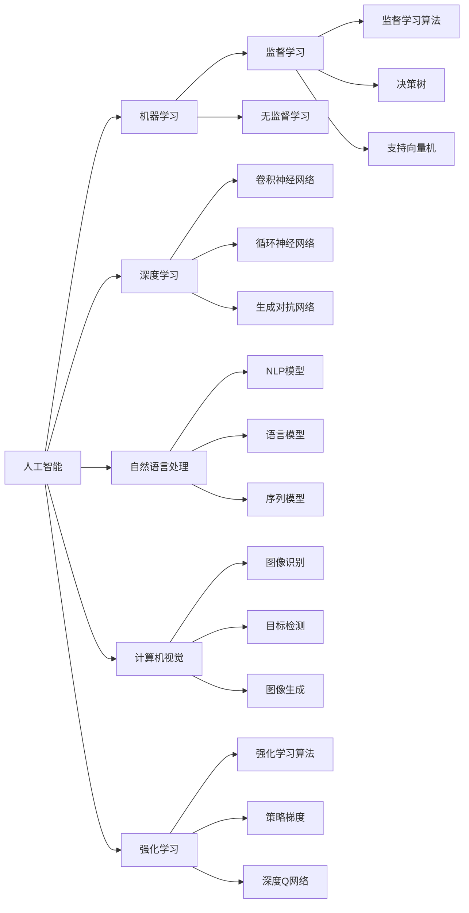
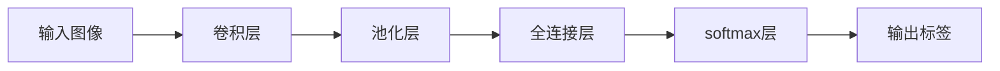

                 

# 人工智能：社会影响与思考

在飞速发展的科技浪潮中，人工智能(AI)已悄然走入人们的日常生活，成为改变世界的重要力量。AI不仅在技术上取得了长足的进步，更在社会、经济、伦理等多个方面产生了深远的影响。本文将系统探讨AI的社会影响，并从多个角度展开深入思考。

## 1. 背景介绍

### 1.1 人工智能的发展历程
人工智能的发展经历了多个阶段，从最初的逻辑推理、专家系统，到机器学习、深度学习，再到当前的深度强化学习，AI技术逐渐从理论走向应用，从学术走向产业化。从1950年代图灵机的概念提出，到1980年代神经网络的研究兴起，再到2010年代深度学习的突破，AI已进入快速发展的黄金期。

### 1.2 AI技术的广泛应用
AI技术已经渗透到各行各业，从医疗、金融、教育到制造业、农业、物流，AI的应用触手可及。医疗领域，AI辅助诊断、智能推荐系统提升了诊疗效率；金融领域，AI风控、算法交易提升了风险管理能力；教育领域，AI个性化教学、智能作业批改提升了教学质量。AI技术正改变着人类的工作方式、生活方式，甚至思维模式。

## 2. 核心概念与联系

### 2.1 核心概念概述

在深入探讨AI的社会影响前，我们先简要介绍几个核心概念：

- 人工智能(Artificial Intelligence, AI)：模拟人类智能活动的计算机技术，通过算法和模型实现自主学习、推理、决策等能力。
- 机器学习(Machine Learning, ML)：通过数据训练模型，使其具备预测、分类、回归等能力。
- 深度学习(Deep Learning, DL)：基于多层神经网络的机器学习技术，通过模拟人脑神经元网络实现特征提取与分类。
- 强化学习(Reinforcement Learning, RL)：通过奖励信号指导模型决策，使模型在环境中不断优化行为策略。
- 自然语言处理(Natural Language Processing, NLP)：让计算机理解、处理和生成人类语言的技术。
- 计算机视觉(Computer Vision, CV)：使计算机具备图像识别、目标检测、场景理解等视觉感知能力。

这些概念之间相互关联，构成了AI技术的核心框架。NLP、CV、DL、ML和RL技术各司其职，共同构建了AI技术的基础能力。

### 2.2 核心概念联系（Mermaid 流程图）



此流程图展示了核心概念之间的联系。监督学习、无监督学习、卷积神经网络、循环神经网络、生成对抗网络、序列模型等技术构成了机器学习和深度学习的基石。同时，计算机视觉和自然语言处理技术，使AI具备了视觉感知和语言处理能力。

## 3. 核心算法原理 & 具体操作步骤

### 3.1 算法原理概述

AI的核心算法原理包括监督学习、无监督学习和强化学习。这三种方法各有所长，适用于不同的应用场景。

- **监督学习**：通过有标签数据训练模型，使其具备预测、分类等能力。监督学习广泛应用于图像分类、语音识别、推荐系统等场景。
- **无监督学习**：无需标签数据，通过数据自身特征学习模型，用于聚类、降维、异常检测等。
- **强化学习**：通过奖励信号指导模型学习最优策略，常用于游戏、机器人控制、自动驾驶等场景。

### 3.2 算法步骤详解

以监督学习为例，其一般步骤如下：

1. **数据预处理**：收集标注数据，进行数据清洗、归一化、划分训练集、验证集和测试集。
2. **模型选择与训练**：选择合适的算法和模型架构，使用训练集进行模型训练，并根据验证集调整模型超参数。
3. **模型评估与优化**：在测试集上评估模型性能，使用交叉验证等技术优化模型。
4. **模型部署与迭代**：将优化后的模型部署到实际应用中，并根据反馈进行迭代优化。

### 3.3 算法优缺点

**监督学习的优点**：
- **精确度高**：利用标注数据，能够直接训练出高精度的预测模型。
- **泛化能力强**：训练数据量大，模型具备良好的泛化能力。

**监督学习的缺点**：
- **数据依赖性强**：对标注数据质量要求高，数据获取成本高。
- **过拟合风险高**：在标注数据不足时，模型容易过拟合。

**无监督学习的优点**：
- **数据需求低**：无需标注数据，适用于数据稀缺场景。
- **发现新知识**：通过数据自组织，可以发现数据中的隐含结构和新知识。

**无监督学习的缺点**：
- **结果解释性差**：模型结果难以解释，缺乏明确的输出解释。
- **应用场景有限**：适用范围受限于数据的特性和模型架构。

**强化学习的优点**：
- **自主学习**：能够通过奖励信号自主学习最优策略，适应性强。
- **动态调整**：在实际应用中，能够动态调整行为策略。

**强化学习的缺点**：
- **奖励设计复杂**：奖励设计需要考虑多个维度，复杂度高。
- **环境探索**：在未知环境中，探索行为难以控制。

### 3.4 算法应用领域

AI算法在不同的领域有不同的应用，以下为几个典型应用场景：

- **医疗**：AI在医疗领域的应用包括智能诊断、药物发现、患者监护等，提高了诊疗效率和精准度。
- **金融**：AI在金融领域的应用包括风险管理、算法交易、智能投顾等，提升了金融决策的科学性和可靠性。
- **教育**：AI在教育领域的应用包括智能辅导、作业批改、教学评估等，改善了教育资源的分配和利用效率。
- **制造业**：AI在制造业的应用包括智能质检、设备维护、供应链优化等，提升了生产效率和质量控制水平。
- **物流**：AI在物流领域的应用包括路径规划、货物追踪、仓储管理等，提高了物流的效率和准确性。

## 4. 数学模型和公式 & 详细讲解

### 4.1 数学模型构建

以监督学习为例，其数学模型可以表示为：

$$
\hat{y} = f(x; \theta)
$$

其中，$\hat{y}$表示模型预测结果，$x$表示输入数据，$f(x; \theta)$表示模型函数，$\theta$表示模型参数。在训练过程中，模型的目标是使预测结果$\hat{y}$尽可能接近真实标签$y$。

### 4.2 公式推导过程

以线性回归模型为例，其公式推导如下：

$$
\hat{y} = \theta^T x + b
$$

其中，$\theta$表示权重向量，$x$表示输入数据，$b$表示偏置项。模型的目标是最小化预测误差，即：

$$
\mathop{\min}_{\theta} \sum_{i=1}^n (y_i - \hat{y}_i)^2
$$

使用梯度下降算法求解最优参数$\theta$：

$$
\theta \leftarrow \theta - \eta \nabla_{\theta} L(\theta)
$$

其中，$\eta$表示学习率，$L(\theta)$表示损失函数，$\nabla_{\theta} L(\theta)$表示损失函数对参数$\theta$的梯度。

### 4.3 案例分析与讲解

以图像分类为例，其模型结构如图：



该模型由卷积层、池化层、全连接层和softmax层组成。输入图像通过卷积和池化提取特征，然后经过全连接层和softmax层，输出分类结果。使用交叉熵损失函数进行模型训练，目标是最小化分类误差。

## 5. 项目实践：代码实例和详细解释说明

### 5.1 开发环境搭建

在项目实践中，开发环境搭建至关重要。以下是使用Python和TensorFlow搭建深度学习项目的基本步骤：

1. **安装Python**：安装Python 3.8或更高版本。
2. **安装TensorFlow**：使用pip安装TensorFlow。
3. **安装相关库**：安装numpy、pandas、scikit-learn等常用库。
4. **配置开发环境**：设置虚拟环境，配置conda或virtualenv，确保环境一致性。

### 5.2 源代码详细实现

以图像分类为例，以下是使用TensorFlow实现卷积神经网络的代码：

```python
import tensorflow as tf
from tensorflow.keras import layers, models

# 定义模型
model = models.Sequential([
    layers.Conv2D(32, (3,3), activation='relu', input_shape=(28,28,1)),
    layers.MaxPooling2D((2,2)),
    layers.Conv2D(64, (3,3), activation='relu'),
    layers.MaxPooling2D((2,2)),
    layers.Conv2D(64, (3,3), activation='relu'),
    layers.Flatten(),
    layers.Dense(64, activation='relu'),
    layers.Dense(10, activation='softmax')
])

# 编译模型
model.compile(optimizer='adam',
              loss='sparse_categorical_crossentropy',
              metrics=['accuracy'])

# 训练模型
model.fit(train_images, train_labels, epochs=5, validation_data=(test_images, test_labels))
```

### 5.3 代码解读与分析

上述代码定义了一个包含三个卷积层和两个全连接层的卷积神经网络。卷积层通过滑动窗口提取特征，池化层进行特征降维，全连接层进行分类。模型使用Adam优化器和交叉熵损失函数进行训练，在训练过程中调整模型参数以最小化损失函数。

### 5.4 运行结果展示

训练结束后，可以使用以下代码进行模型评估：

```python
test_loss, test_acc = model.evaluate(test_images, test_labels)
print('Test accuracy:', test_acc)
```

运行结果显示模型在测试集上的准确率。

## 6. 实际应用场景

### 6.1 智能医疗

AI在医疗领域的应用包括智能诊断、药物发现、患者监护等，提高了诊疗效率和精准度。例如，IBM的Watson系统可以分析大量医学文献，辅助医生进行诊断和决策，提高了肿瘤诊断的准确率。

### 6.2 金融风险管理

AI在金融领域的应用包括风险管理、算法交易、智能投顾等，提升了金融决策的科学性和可靠性。例如，AI算法可以实时监控市场变化，自动生成投资策略，减少了人为操作失误。

### 6.3 教育个性化学习

AI在教育领域的应用包括智能辅导、作业批改、教学评估等，改善了教育资源的分配和利用效率。例如，Knewton系统可以根据学生学习情况，动态调整教学内容和难度，提高了学习效果。

### 6.4 智能交通

AI在交通领域的应用包括路径规划、交通流量预测、自动驾驶等，提升了交通管理效率和安全性。例如，谷歌的Waymo自动驾驶汽车可以通过AI算法，实时调整行驶路径，避免交通拥堵和事故。

### 6.5 农业精准管理

AI在农业领域的应用包括智能灌溉、病虫害检测、产量预测等，提高了农业生产效率和资源利用率。例如，农业无人机可以通过AI算法，实时监控农田状况，优化灌溉和施肥，减少资源浪费。

## 7. 工具和资源推荐

### 7.1 学习资源推荐

为了深入学习AI技术，以下是一些推荐的在线资源：

- **Coursera**：提供了由斯坦福大学、MIT等名校开设的AI课程，涵盖机器学习、深度学习、自然语言处理等方向。
- **Kaggle**：全球最大的数据科学竞赛平台，提供丰富的数据集和竞赛机会，促进数据科学人才的交流与成长。
- **arXiv**：全球最大的预印本服务器，涵盖计算机科学、物理学、数学等多个领域，是获取最新研究成果的重要来源。

### 7.2 开发工具推荐

以下是一些常用的AI开发工具：

- **TensorFlow**：谷歌开发的开源深度学习框架，支持分布式计算，适合大规模模型训练。
- **PyTorch**：Facebook开源的深度学习框架，具有灵活性和易用性，支持动态图计算。
- **Scikit-Learn**：基于Python的机器学习库，提供简单易用的API，适用于各类机器学习任务。
- **Keras**：高层次深度学习API，支持TensorFlow、Theano等多种后端，适合快速原型开发。

### 7.3 相关论文推荐

以下是几篇经典AI论文，推荐阅读：

- **Convolutional Neural Networks for Deep Learning**：Yann LeCun等，深度学习领域经典之作，介绍了卷积神经网络的基本原理和应用。
- **ImageNet Classification with Deep Convolutional Neural Networks**：Alex Krizhevsky等，提出了AlexNet模型，开启了深度学习在计算机视觉领域的革命。
- **Attention is All You Need**：Ashish Vaswani等，提出了Transformer模型，彻底改变了自然语言处理领域。

## 8. 总结：未来发展趋势与挑战

### 8.1 研究成果总结

AI技术在多个领域取得了显著进展，但仍然面临一些挑战：

- **数据依赖性**：AI模型需要大量数据进行训练，数据获取成本高、标注困难。
- **模型复杂性**：深度学习模型结构复杂，训练和部署成本高。
- **伦理和安全性**：AI模型可能存在偏见和有害输出，如何保证其公平性和安全性是重要课题。
- **计算资源**：大规模模型训练和推理需要高性能计算资源，硬件成本高。

### 8.2 未来发展趋势

未来AI技术将呈现以下趋势：

- **联邦学习**：数据分布在多个设备和网络中，难以集中存储，联邦学习可以分布式训练模型，保护数据隐私。
- **自监督学习**：通过无标签数据进行预训练，减少对标注数据的依赖，提高模型泛化能力。
- **迁移学习**：通过已有模型进行微调，快速适应新任务，减少重复训练成本。
- **对抗性训练**：通过引入对抗样本，增强模型鲁棒性，防止攻击和误判。
- **可解释AI**：通过可解释模型和解释技术，增强AI系统的透明性和可信度。

### 8.3 面临的挑战

未来AI技术仍面临一些挑战：

- **计算资源瓶颈**：大规模模型训练和推理需要高性能计算资源，硬件成本高。
- **伦理和安全性问题**：AI模型可能存在偏见和有害输出，如何保证其公平性和安全性是重要课题。
- **跨领域应用**：AI模型在跨领域应用中，泛化性能和适应性仍需提升。
- **模型可解释性**：AI模型通常是"黑盒"系统，难以解释其内部工作机制和决策逻辑。

### 8.4 研究展望

未来AI技术的研究方向包括：

- **跨领域知识整合**：将符号化的先验知识与神经网络模型结合，提升模型准确性和解释性。
- **自适应学习**：通过增强模型自适应能力，提升其在未知数据上的表现。
- **多模态学习**：将视觉、语音、文本等不同模态数据进行融合，提升模型的综合感知能力。
- **分布式计算**：通过分布式计算和模型压缩技术，降低模型训练和推理成本。

## 9. 附录：常见问题与解答

**Q1：AI的商业应用前景如何？**

A: AI技术已经在多个领域取得商业成功，未来前景广阔。例如，IBM的Watson已经应用于多个行业，提高了诊断和治疗效率。智能投顾系统也已经在金融领域广泛应用，提升了投资决策的科学性和可靠性。

**Q2：AI技术在医疗领域的应用有哪些？**

A: AI技术在医疗领域的应用包括智能诊断、药物发现、患者监护等，提高了诊疗效率和精准度。例如，IBM的Watson系统可以分析大量医学文献，辅助医生进行诊断和决策，提高了肿瘤诊断的准确率。

**Q3：AI在金融领域的应用有哪些？**

A: AI在金融领域的应用包括风险管理、算法交易、智能投顾等，提升了金融决策的科学性和可靠性。例如，AI算法可以实时监控市场变化，自动生成投资策略，减少了人为操作失误。

**Q4：AI技术在教育领域的应用有哪些？**

A: AI在教育领域的应用包括智能辅导、作业批改、教学评估等，改善了教育资源的分配和利用效率。例如，Knewton系统可以根据学生学习情况，动态调整教学内容和难度，提高了学习效果。

**Q5：AI技术在农业领域的应用有哪些？**

A: AI在农业领域的应用包括智能灌溉、病虫害检测、产量预测等，提高了农业生产效率和资源利用率。例如，农业无人机可以通过AI算法，实时监控农田状况，优化灌溉和施肥，减少资源浪费。

---

作者：禅与计算机程序设计艺术 / Zen and the Art of Computer Programming

