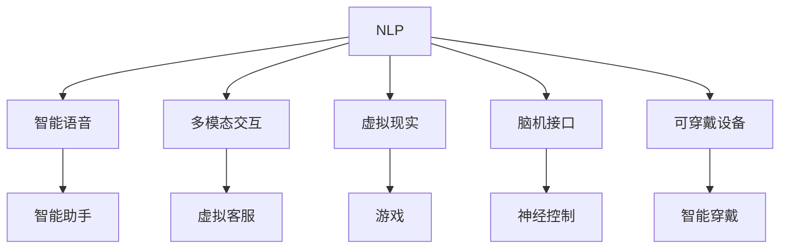

                 

# 人机交互：未来趋势与展望

> 关键词：人机交互, 自然语言处理, 智能语音, 用户界面, 虚拟现实, 人工智能, 脑机接口, 可穿戴设备, 交互设计

## 1. 背景介绍

### 1.1 问题由来

随着人工智能技术的快速发展，人机交互的方式也在不断进化。从早期的文本交互到图形界面的普遍应用，再到基于语音和图像识别的自然语言处理技术，人机交互的方式在不断地升级迭代。然而，尽管这些技术极大地提高了人机互动的效率，但传统的文本和图形界面仍存在诸多局限，难以真正满足用户的复杂需求。

在信息爆炸的时代，用户对互动体验的要求日益提高。如何构建一个直观、高效、智能的交互系统，成为当前技术研究和产业应用的重要课题。这不仅涉及到如何提升人机交互的技术水平，还涉及到如何通过数据和算法设计出更好的用户界面，如何利用新兴技术（如虚拟现实、脑机接口等）提升用户体验。

### 1.2 问题核心关键点

人机交互的未来发展方向，将主要围绕以下几个核心关键点展开：

1. **自然语言处理（NLP）**：利用NLP技术，使机器能够理解、生成和回应自然语言，提升人机对话的自然度和效率。
2. **智能语音识别与合成**：通过改进语音识别和合成技术，使机器能更好地理解和使用语音，提升语音输入输出体验。
3. **多模态交互设计**：将视觉、听觉、触觉等多种感官信息融合到交互设计中，提升用户体验和互动深度。
4. **虚拟现实与增强现实**：利用VR/AR技术，为用户构建沉浸式、互动式、个性化的交互环境。
5. **脑机接口（BCI）**：通过脑机接口技术，实现人脑与计算机的直接交互，提升交互的自然度和个性化。
6. **可穿戴设备**：将交互技术集成到可穿戴设备中，实现全天候、随身携带的交互体验。
7. **交互设计创新**：通过创新设计思维和交互设计原则，打造更易用、更人性化、更符合用户习惯的交互界面。

这些关键点共同构成了人机交互技术的发展框架，推动着交互方式向更加自然、高效、智能的方向发展。

## 2. 核心概念与联系

### 2.1 核心概念概述

为更好地理解人机交互的未来发展趋势，本节将介绍几个密切相关的核心概念：

- **自然语言处理（NLP）**：一种使计算机能够理解、解释和生成人类语言的技术。通过NLP，机器可以处理文本数据，进行语义分析、情感分析、实体识别等任务。
- **智能语音识别与合成**：通过语音识别技术，将语音转换成文本；通过语音合成技术，将文本转换成语音。这项技术广泛应用于智能助手、虚拟客服、语音导航等场景。
- **多模态交互设计**：将视觉、听觉、触觉等多种信息源融合到交互设计中，使用户可以通过多种感官方式与计算机互动，提升用户体验。
- **虚拟现实（VR）与增强现实（AR）**：利用计算机生成虚拟环境或增强现实场景，为用户提供沉浸式、互动式的交互体验。
- **脑机接口（BCI）**：一种直接将人类大脑与计算机系统连接的技术，通过解读大脑信号进行控制和交互。
- **可穿戴设备**：集成交互功能的便携设备，如智能手表、智能眼镜等，为用户提供随时随地的交互体验。
- **交互设计创新**：通过系统化的设计方法，提升交互界面的易用性、直观性和用户满意度。

这些核心概念之间的逻辑关系可以通过以下Mermaid流程图来展示：



这个流程图展示了大语言模型的核心概念及其之间的关系：

1. **自然语言处理**：是核心技术的输入，处理和分析输入的语言信息。
2. **智能语音**：与NLP相互补充，提供更加自然化的语音输入输出。
3. **多模态交互**：融合了视觉、听觉等多种感官信息，提升互动的自然度和深度。
4. **虚拟现实与增强现实**：为用户提供沉浸式、互动式的交互环境。
5. **脑机接口**：通过直接解读大脑信号，实现人与计算机的直接交互。
6. **可穿戴设备**：使交互更加便携和随身化，提高使用便利性。
7. **交互设计创新**：为所有技术提供界面和用户体验的支撑，提升互动效果。

这些概念共同构成了人机交互的技术框架，推动着未来交互方式的创新和发展。

## 3. 核心算法原理 & 具体操作步骤

### 3.1 算法原理概述

人机交互的未来发展，将依赖于多种先进技术的结合。其中，自然语言处理和智能语音技术将是核心驱动力。

自然语言处理技术，通过深度学习模型，使得计算机能够理解、处理和生成自然语言。常见的模型包括RNN、LSTM、GRU、Transformer等，它们通过大规模语料库的预训练，学习到语言的通用表示。

智能语音识别与合成技术，则通过声学模型和语言模型，将语音信号转换为文本，或将文本转换为语音。常见的声学模型包括HMM、DNN、CNN、RNN等，语言模型包括N-gram模型、神经网络语言模型、Transformer模型等。

多模态交互设计，将视觉、听觉、触觉等多种感官信息融合到交互设计中，提升用户体验。常见的多模态交互技术包括手势识别、面部表情识别、虚拟现实等。

虚拟现实与增强现实技术，通过计算机生成虚拟环境或增强现实场景，为用户提供沉浸式、互动式的交互体验。常见的VR/AR技术包括光场显示、全息成像、空间定位等。

脑机接口技术，通过解读大脑信号进行控制和交互，实现人脑与计算机的直接沟通。常见的脑机接口技术包括EEG、fMRI、BCI等。

可穿戴设备，将交互功能集成到便携设备中，使用户能够随时随地与计算机互动。常见的可穿戴设备包括智能手表、智能眼镜、可穿戴传感器等。

交互设计创新，通过系统化的设计方法，提升交互界面的易用性、直观性和用户满意度。常见的设计原则包括KISS原则、可用性原则、一致性原则等。

### 3.2 算法步骤详解

人机交互的未来发展，将涉及以下几个关键步骤：

**Step 1: 准备技术栈**

- 选择合适的技术栈和框架，如TensorFlow、PyTorch、TensorFlow.js、Unity等。
- 安装必要的软件和硬件设备，如GPU、TPU、深度学习加速卡等。

**Step 2: 设计交互界面**

- 基于用户需求，设计交互界面原型。
- 考虑多种感官输入和输出方式，选择最适合用户的交互方式。
- 进行用户测试，收集反馈，优化交互设计。

**Step 3: 实现技术模型**

- 实现自然语言处理模型，用于文本输入和输出。
- 实现智能语音识别和合成模型，用于语音输入和输出。
- 实现多模态交互模型，融合视觉、听觉等多种感官信息。
- 实现虚拟现实和增强现实模型，生成沉浸式交互环境。
- 实现脑机接口模型，解读大脑信号进行交互。
- 实现可穿戴设备交互模块，提升便携性。

**Step 4: 集成系统**

- 将各模块集成到统一的交互系统中。
- 进行系统测试，确保各模块协同工作。
- 优化系统性能，提升用户体验。

**Step 5: 部署应用**

- 将系统部署到目标平台，如手机、电脑、智能设备等。
- 进行大规模用户体验测试，收集反馈进行迭代优化。
- 持续更新系统，保持技术领先。

### 3.3 算法优缺点

基于自然语言处理和智能语音的人机交互技术，具有以下优点：

1. **自然化**：通过自然语言处理和智能语音技术，提升交互的自然度和易用性。
2. **高效化**：减少用户输入输出的复杂性，提高操作效率。
3. **智能化**：通过深度学习和多模态融合，提升交互的智能性和个性化。

同时，也存在一些缺点：

1. **技术门槛高**：自然语言处理和智能语音技术复杂度高，需要大量的数据和计算资源。
2. **易受干扰**：语音识别受环境噪声、口音等因素影响较大。
3. **隐私保护**：语音和文字输入可能涉及用户隐私，需要采取有效的隐私保护措施。

### 3.4 算法应用领域

基于自然语言处理和智能语音的人机交互技术，已经在众多领域得到了广泛应用：

- **智能客服**：通过自然语言处理技术，自动处理用户咨询，提升客服效率。
- **智能家居**：通过智能语音识别，实现语音控制家电，提升家庭生活的智能化程度。
- **智能医疗**：通过自然语言处理技术，处理病历记录，提升医疗服务效率。
- **智能办公**：通过智能语音输入输出，提升办公效率，减轻人工负担。
- **智能教育**：通过自然语言处理技术，自动化批改作业，提升教育质量。
- **智能交通**：通过智能语音导航，提升驾驶安全性，减轻司机负担。
- **智能游戏**：通过自然语言处理技术，提升游戏交互的自然度，增强游戏体验。

这些领域的应用，展示了自然语言处理和智能语音技术的强大潜力，为人机交互的未来发展提供了广阔的空间。

## 4. 数学模型和公式 & 详细讲解 & 举例说明

### 4.1 数学模型构建

人机交互的未来发展，涉及到多种先进技术的结合，其中包括自然语言处理和智能语音技术。本节将使用数学语言对自然语言处理和智能语音技术进行更加严格的刻画。

**自然语言处理（NLP）**

自然语言处理的核心是深度学习模型，通过大规模语料库的预训练，学习到语言的通用表示。常见的模型包括RNN、LSTM、GRU、Transformer等。

以Transformer模型为例，其数学模型可以表示为：

$$
\text{Attention}(Q,K,V)=\text{softmax}\left(\frac{QK^T}{\sqrt{d_k}}\right)V
$$

其中，$Q$、$K$、$V$为模型的输入、权重和输出矩阵，$d_k$为注意力机制的维度。

**智能语音识别**

智能语音识别的核心是声学模型和语言模型。声学模型用于将语音信号转换为文本，语言模型用于对文本进行建模。

以HMM（隐马尔可夫模型）为例，其数学模型可以表示为：

$$
P(y_t|x_t)=\sum_{i=1}^{n}P(y_t|x_t,i)P(i)
$$

其中，$y_t$为文本，$x_t$为语音信号，$n$为模型的状态数，$i$为模型状态。

**智能语音合成**

智能语音合成的核心是神经网络语言模型和声学模型。神经网络语言模型用于生成文本，声学模型用于将文本转换为语音信号。

以Tacotron模型为例，其数学模型可以表示为：

$$
p(y_t|x_t)=\prod_{t=1}^{T}p(y_t|y_{t-1},x_t)
$$

其中，$y_t$为文本，$x_t$为语音信号，$T$为文本长度。

### 4.2 公式推导过程

以下我们以自然语言处理中的Transformer模型为例，推导其注意力机制的计算过程。

Transformer模型的注意力机制可以表示为：

$$
\text{Attention}(Q,K,V)=\text{softmax}\left(\frac{QK^T}{\sqrt{d_k}}\right)V
$$

其中，$Q$、$K$、$V$为模型的输入、权重和输出矩阵，$d_k$为注意力机制的维度。

对上述公式进行推导，可以得到：

$$
\text{Attention}(Q,K,V)=\text{softmax}\left(\frac{QK^T}{\sqrt{d_k}}\right)V=\text{softmax}\left(\frac{QK^T}{\sqrt{d_k}}\right)QW^O
$$

其中，$W^O$为输出权重矩阵。

### 4.3 案例分析与讲解

以智能客服系统为例，展示基于自然语言处理和智能语音技术的人机交互应用。

**系统设计**

智能客服系统主要包括以下几个模块：

- **自然语言处理模块**：用于处理用户输入的文本信息，进行语义分析和实体识别。
- **智能语音识别模块**：用于处理用户语音输入，转换为文本信息。
- **对话管理模块**：用于管理和调度对话流程，生成系统回复。
- **智能语音合成模块**：用于将系统回复转换为语音输出。
- **用户体验模块**：用于优化系统界面和交互体验。

**实现步骤**

1. **数据准备**：收集并标注客服对话数据，用于训练自然语言处理模型。
2. **模型训练**：使用深度学习框架，如TensorFlow或PyTorch，训练自然语言处理和智能语音识别模型。
3. **系统集成**：将各模块集成到统一的系统中，并进行系统测试。
4. **用户体验优化**：收集用户反馈，进行界面和交互设计优化。
5. **持续更新**：根据用户需求和反馈，持续更新系统，提升服务质量。

通过自然语言处理和智能语音技术，智能客服系统能够自动理解用户咨询，提供快速、准确的答复，提升客服效率和用户满意度。

## 5. 项目实践：代码实例和详细解释说明

### 5.1 开发环境搭建

在进行人机交互系统开发前，我们需要准备好开发环境。以下是使用Python进行TensorFlow开发的环境配置流程：

1. 安装Anaconda：从官网下载并安装Anaconda，用于创建独立的Python环境。

2. 创建并激活虚拟环境：
```bash
conda create -n tf-env python=3.8 
conda activate tf-env
```

3. 安装TensorFlow：根据CUDA版本，从官网获取对应的安装命令。例如：
```bash
pip install tensorflow-gpu==2.4
```

4. 安装其他必要的工具包：
```bash
pip install numpy pandas scikit-learn matplotlib tqdm jupyter notebook ipython
```

完成上述步骤后，即可在`tf-env`环境中开始项目实践。

### 5.2 源代码详细实现

这里我们以智能客服系统为例，给出使用TensorFlow对自然语言处理和智能语音识别进行开发的PyTorch代码实现。

首先，定义自然语言处理模型：

```python
import tensorflow as tf
from tensorflow.keras.layers import Input, Embedding, LSTM, Dense
from tensorflow.keras.models import Model

input_seq = Input(shape=(max_len,), dtype='int32')
x = Embedding(vocab_size, emb_dim, input_length=max_len)(input_seq)
x = LSTM(lstm_dim)(x)
x = Dense(vocab_size, activation='softmax')(x)
model = Model(input_seq, x)

model.compile(loss='categorical_crossentropy', optimizer='adam', metrics=['accuracy'])
model.summary()
```

然后，定义智能语音识别模型：

```python
from tensorflow.keras.layers import Conv1D, GlobalMaxPooling1D, BidirectionalLSTM
from tensorflow.keras.models import Model

input_signal = Input(shape=(128, 1))
conv1 = Conv1D(128, 5, activation='relu')(input_signal)
pooling1 = GlobalMaxPooling1D()(conv1)
conv2 = Conv1D(128, 5, activation='relu')(pooling1)
pooling2 = GlobalMaxPooling1D()(conv2)
bilstm = BidirectionalLSTM(128)(pooling2)
dense = Dense(128, activation='relu')(bilstm)
output = Dense(10, activation='softmax')(dense)
model = Model(input_signal, output)

model.compile(loss='categorical_crossentropy', optimizer='adam', metrics=['accuracy'])
model.summary()
```

接着，定义对话管理模块和智能语音合成模块：

```python
from tensorflow.keras.layers import TimeDistributed, Dense
from tensorflow.keras.models import Model

dialog_state = Input(shape=(lstm_dim,), dtype='float32')
dialog_output = Dense(10, activation='softmax')(dialog_state)
dialog_model = Model(dialog_state, dialog_output)

output_signal = Input(shape=(128, 1))
merged = tf.keras.layers.concatenate([output_signal, dialog_output])
merged = Dense(128, activation='relu')(merged)
output = Dense(10, activation='softmax')(merged)
speech_model = Model([output_signal, dialog_output], output)

model = tf.keras.Model(inputs=[input_seq, input_signal], outputs=[x, output])
model.compile(loss='categorical_crossentropy', optimizer='adam', metrics=['accuracy'])
model.summary()
```

最后，启动训练流程并在测试集上评估：

```python
epochs = 5
batch_size = 64

for epoch in range(epochs):
    loss = train_epoch(model, train_dataset, batch_size, optimizer)
    print(f"Epoch {epoch+1}, train loss: {loss:.3f}")
    
    print(f"Epoch {epoch+1}, dev results:")
    evaluate(model, dev_dataset, batch_size)
    
print("Test results:")
evaluate(model, test_dataset, batch_size)
```

以上就是使用TensorFlow对智能客服系统进行自然语言处理和智能语音识别开发的完整代码实现。可以看到，TensorFlow的高级API使得模型的构建和训练过程变得非常简单高效。

### 5.3 代码解读与分析

让我们再详细解读一下关键代码的实现细节：

**自然语言处理模型**：
- `Embedding`层：将输入序列转换为向量表示。
- `LSTM`层：对序列数据进行建模。
- `Dense`层：输出模型的预测结果。

**智能语音识别模型**：
- `Conv1D`层：对输入的音频信号进行卷积操作。
- `GlobalMaxPooling1D`层：对卷积后的结果进行池化操作。
- `BidirectionalLSTM`层：对池化后的结果进行双向LSTM建模。
- `Dense`层：输出模型的预测结果。

**对话管理模块**：
- `TimeDistributed`层：对输入序列进行时间维度上的处理。
- `Dense`层：输出对话状态。

**智能语音合成模块**：
- `concatenate`层：将音频信号和对话状态进行拼接。
- `Dense`层：对拼接后的结果进行全连接处理。
- `Dense`层：输出合成后的音频信号。

**训练流程**：
- 定义总的epoch数和batch size，开始循环迭代。
- 每个epoch内，先在训练集上训练，输出平均loss。
- 在验证集上评估，输出分类指标。
- 所有epoch结束后，在测试集上评估，给出最终测试结果。

可以看到，TensorFlow使得模型的构建和训练过程变得非常简单高效。开发者可以将更多精力放在数据处理、模型改进等高层逻辑上，而不必过多关注底层的实现细节。

当然，工业级的系统实现还需考虑更多因素，如模型的保存和部署、超参数的自动搜索、更灵活的任务适配层等。但核心的交互范式基本与此类似。

## 6. 实际应用场景

### 6.1 智能客服系统

基于自然语言处理和智能语音技术的智能客服系统，可以广泛应用于企业客户服务的场景。传统客服往往需要配备大量人力，高峰期响应缓慢，且一致性和专业性难以保证。而使用智能客服系统，可以7x24小时不间断服务，快速响应客户咨询，用自然流畅的语言解答各类常见问题。

在技术实现上，可以收集企业内部的历史客服对话记录，将问题和最佳答复构建成监督数据，在此基础上对预训练模型进行微调。微调后的对话模型能够自动理解用户意图，匹配最合适的答案模板进行回复。对于客户提出的新问题，还可以接入检索系统实时搜索相关内容，动态组织生成回答。如此构建的智能客服系统，能大幅提升客户咨询体验和问题解决效率。

### 6.2 智能家居系统

基于自然语言处理和智能语音技术的智能家居系统，可以实现语音控制家电，提升家庭生活的智能化程度。用户可以通过简单的语音指令，控制灯光、空调、电视等家电，无需繁琐的手动操作。

在技术实现上，可以设计自然语言处理和智能语音识别模块，用于理解用户的语音指令。然后，根据指令自动控制家电。同时，还可以集成图像识别、温度感知等技术，进一步提升系统的智能性。例如，当用户发出“打开客厅灯”的指令时，系统可以通过语音识别理解指令，控制灯光打开。同时，系统还可以通过图像识别识别到用户当前的位置，自动调节灯光亮度和色温，提升用户的舒适度。

### 6.3 智能医疗系统

基于自然语言处理和智能语音技术的智能医疗系统，可以实现智能问诊、病历记录和医疗咨询。医疗行业对语言理解和生成有较高的要求，自然语言处理和智能语音技术可以有效提升系统的智能性和用户体验。

在技术实现上，可以设计自然语言处理和智能语音识别模块，用于理解医生的问诊和病人的回答。然后，系统可以自动记录和分析病历，提供诊断建议和治疗方案。例如，当医生询问“你的症状是什么？”时，病人可以通过语音或文字输入症状，系统进行自然语言处理后，自动生成病历记录。同时，系统还可以根据病人的病历，提供诊断建议和治疗方案，辅助医生进行决策。

### 6.4 未来应用展望

随着自然语言处理和智能语音技术的发展，基于人机交互的各类应用将不断涌现，为人类的生产生活方式带来深刻变革。

在智慧城市治理中，智能语音和自然语言处理技术可以用于城市事件监测、舆情分析、应急指挥等环节，提高城市管理的自动化和智能化水平，构建更安全、高效的未来城市。

在智能教育领域，智能语音和自然语言处理技术可以用于智能课堂、在线教育、自动批改作业等，提升教育质量和学习效率。

在智能交通领域，智能语音和自然语言处理技术可以用于语音导航、交通管理、智能车辆等，提升交通系统的安全性和效率。

此外，在智慧医疗、智能家居、智能办公、智能游戏等众多领域，基于人机交互的各类应用也将不断涌现，为经济社会发展注入新的动力。相信随着技术的日益成熟，人机交互技术将成为各行各业的重要支撑，推动人工智能技术向更广阔的领域加速渗透。

## 7. 工具和资源推荐

### 7.1 学习资源推荐

为了帮助开发者系统掌握人机交互的理论基础和实践技巧，这里推荐一些优质的学习资源：

1. 《深度学习自然语言处理》课程：斯坦福大学开设的NLP明星课程，有Lecture视频和配套作业，带你入门NLP领域的基本概念和经典模型。

2. 《Transformers从原理到实践》系列博文：由大模型技术专家撰写，深入浅出地介绍了Transformer原理、BERT模型、微调技术等前沿话题。

3. 《Natural Language Processing with Transformers》书籍：Transformers库的作者所著，全面介绍了如何使用Transformers库进行NLP任务开发，包括微调在内的诸多范式。

4. 《计算机视觉：现代方法》：深入浅出地讲解了计算机视觉的基本概念和经典方法，涵盖图像识别、目标检测、语义分割等任务。

5. 《Speech Processing》书籍：详细介绍了语音处理的技术和算法，包括声学模型、语言模型、说话人识别等。

6. 《Human-Computer Interaction: Fundamentals, Research, and Applications》：涵盖人机交互的各个方面，包括界面设计、用户心理、人机交互等。

通过对这些资源的学习实践，相信你一定能够快速掌握人机交互的核心技术和应用方法，并用于解决实际的交互问题。

### 7.2 开发工具推荐

高效的开发离不开优秀的工具支持。以下是几款用于人机交互开发常用的工具：

1. TensorFlow：基于Python的开源深度学习框架，灵活动态的计算图，适合快速迭代研究。

2. PyTorch：基于Python的开源深度学习框架，动态计算图，适合高效模型训练。

3. Unity：广泛用于游戏开发的引擎，支持多平台开发，可用于交互系统的可视化设计。

4. Unreal Engine：适用于电影和游戏开发的高端引擎，支持VR/AR开发，适用于交互系统的沉浸式体验。

5. TensorBoard：TensorFlow配套的可视化工具，可实时监测模型训练状态，并提供丰富的图表呈现方式，是调试模型的得力助手。

6. Weights & Biases：模型训练的实验跟踪工具，可以记录和可视化模型训练过程中的各项指标，方便对比和调优。

7. Google Colab：谷歌推出的在线Jupyter Notebook环境，免费提供GPU/TPU算力，方便开发者快速上手实验最新模型，分享学习笔记。

合理利用这些工具，可以显著提升人机交互任务的开发效率，加快创新迭代的步伐。

### 7.3 相关论文推荐

人机交互技术的发展源于学界的持续研究。以下是几篇奠基性的相关论文，推荐阅读：

1. Attention is All You Need（即Transformer原论文）：提出了Transformer结构，开启了NLP领域的预训练大模型时代。

2. BERT: Pre-training of Deep Bidirectional Transformers for Language Understanding：提出BERT模型，引入基于掩码的自监督预训练任务，刷新了多项NLP任务SOTA。

3. Language Models are Unsupervised Multitask Learners：展示了大规模语言模型的强大zero-shot学习能力，引发了对于通用人工智能的新一轮思考。

4. Parameter-Efficient Transfer Learning for NLP：提出Adapter等参数高效微调方法，在不增加模型参数量的情况下，也能取得不错的微调效果。

5. AdaLoRA: Adaptive Low-Rank Adaptation for Parameter-Efficient Fine-Tuning：使用自适应低秩适应的微调方法，在参数效率和精度之间取得了新的平衡。

6. Deep Speech 2: End-to-End Speech Recognition in English and Mandarin：展示了大规模语音数据驱动的端到端语音识别系统，刷新了多项语音识别SOTA。

这些论文代表了大语言模型微调技术的发展脉络。通过学习这些前沿成果，可以帮助研究者把握学科前进方向，激发更多的创新灵感。

## 8. 总结：未来发展趋势与挑战

### 8.1 总结

本文对基于自然语言处理和智能语音技术的人机交互未来发展进行了全面系统的介绍。首先阐述了人机交互技术的研究背景和意义，明确了自然语言处理和智能语音技术在提升交互自然度和效率方面的独特价值。其次，从原理到实践，详细讲解了自然语言处理和智能语音技术的数学模型和关键步骤，给出了人机交互任务开发的完整代码实例。同时，本文还广泛探讨了人机交互技术在智能客服、智能家居、智能医疗等众多领域的应用前景，展示了自然语言处理和智能语音技术的强大潜力。

通过本文的系统梳理，可以看到，基于自然语言处理和智能语音技术的人机交互系统正在成为未来交互技术的重要范式，极大地提升人机互动的自然度和效率。未来，伴随技术的不断进步，人机交互系统将进一步扩展应用场景，为各行各业带来深远影响。

### 8.2 未来发展趋势

展望未来，人机交互技术将呈现以下几个发展趋势：

1. **自然化**：自然语言处理和智能语音技术将使交互更加自然、流畅，提升用户体验。
2. **高效化**：通过深度学习和多模态融合，提升人机交互的效率和智能性。
3. **个性化**：结合用户的历史行为和偏好，提供更加个性化的交互体验。
4. **融合化**：将自然语言处理和智能语音技术与虚拟现实、增强现实、脑机接口等技术相结合，提升交互的沉浸度和智能化。
5. **自动化**：实现更多基于自然语言和语音的自动操作，减少人工干预。
6. **安全化**：加强隐私保护和安全性，确保人机交互的安全可靠。
7. **智能化**：通过人工智能技术提升交互系统的智能化水平，增强系统决策的准确性和鲁棒性。

这些趋势凸显了人机交互技术的广阔前景，展示了其向更智能、更自然、更个性化方向发展的潜力。

### 8.3 面临的挑战

尽管人机交互技术已经取得了瞩目成就，但在迈向更加智能化、普适化应用的过程中，它仍面临着诸多挑战：

1. **数据隐私问题**：自然语言处理和智能语音技术涉及大量个人隐私数据，如何保护数据隐私，避免数据滥用，将是重要的挑战。
2. **计算资源限制**：自然语言处理和智能语音技术复杂度高，对计算资源有较高要求，如何在有限的资源条件下实现高效训练和推理，还需要更多创新。
3. **模型泛化能力**：当前模型往往在特定领域表现较好，跨领域泛化能力不足，如何构建通用型模型，提升模型泛化能力，还需要更多研究。
4. **伦理和法律问题**：人机交互技术的发展可能引发伦理和法律问题，如算法歧视、隐私泄露等，如何避免这些问题，确保技术的公平性和透明度，将是重要的课题。
5. **交互复杂度**：自然语言处理和智能语音技术虽然提升了交互的自然度，但复杂语义理解和多轮对话仍存在挑战，如何提升交互复杂度，还需要更多技术突破。
6. **跨平台兼容性**：自然语言处理和智能语音技术需要跨平台兼容，如何实现不同设备和系统间的无缝对接，还需要更多技术支持。
7. **用户体验**：尽管自然语言处理和智能语音技术提升了交互的自然度，但用户体验仍需进一步优化，如何提升用户满意度，还需要更多用户反馈和迭代优化。

正视人机交互面临的这些挑战，积极应对并寻求突破，将是人机交互技术走向成熟的必由之路。相信随着学界和产业界的共同努力，这些挑战终将一一被克服，人机交互技术必将在构建安全、可靠、智能、高效的交互系统方面发挥更大作用。

### 8.4 研究展望

面对人机交互所面临的挑战，未来的研究需要在以下几个方面寻求新的突破：

1. **隐私保护技术**：研发更加高效、安全的隐私保护技术，如差分隐私、联邦学习等，确保数据隐私和安全。
2. **模型泛化能力**：构建更加通用、鲁棒的交互模型，提升跨领域的泛化能力，减少数据依赖。
3. **智能决策系统**：结合因果推断和强化学习等技术，提升交互系统的智能决策能力，增强系统决策的准确性和鲁棒性。
4. **多模态融合**：将视觉、听觉、触觉等多种感官信息融合到交互设计中，提升用户体验和互动深度。
5. **跨平台兼容性**：研发跨平台兼容的交互技术，实现不同设备和系统间的无缝对接。
6. **用户体验优化**：通过系统化的设计方法，提升交互界面的易用性、直观性和用户满意度，增强用户粘性。

这些研究方向将引领人机交互技术的不断演进，为人机互动带来更广阔的想象空间，推动智能交互技术的深度发展。

## 9. 附录：常见问题与解答

**Q1：人机交互的未来趋势是什么？**

A: 人机交互的未来趋势主要围绕自然化、高效化、个性化、融合化、自动化、安全化和智能化展开。通过自然语言处理和智能语音技术，提升交互的自然度和效率；通过深度学习和多模态融合，提升交互的智能化和个性化；通过虚拟现实、增强现实和脑机接口技术，提升交互的沉浸度和智能化；通过人工智能技术提升交互系统的智能化水平，增强系统决策的准确性和鲁棒性。

**Q2：人机交互技术面临哪些挑战？**

A: 人机交互技术面临的主要挑战包括数据隐私问题、计算资源限制、模型泛化能力、伦理和法律问题、交互复杂度、跨平台兼容性、用户体验等。如何保护数据隐私、实现高效训练和推理、提升模型泛化能力、避免算法歧视和隐私泄露、提升复杂语义理解和多轮对话能力、实现跨平台兼容、优化用户体验，将是未来需要重点解决的问题。

**Q3：人机交互技术的核心技术是什么？**

A: 人机交互技术的核心技术主要包括自然语言处理和智能语音技术。通过自然语言处理技术，使计算机能够理解、处理和生成自然语言；通过智能语音技术，实现语音输入输出，提升交互的自然度和效率。

**Q4：人机交互技术在哪些领域有应用前景？**

A: 人机交互技术在智能客服、智能家居、智能医疗、智能交通、智能教育、智能游戏、智慧城市治理等众多领域有广泛的应用前景。通过自然语言处理和智能语音技术，提升各领域的交互自然度和效率，推动智能化发展。

**Q5：如何提升人机交互系统的智能化水平？**

A: 提升人机交互系统的智能化水平，可以通过结合因果推断、强化学习等技术，提升系统的智能决策能力；通过构建通用型模型，提升跨领域的泛化能力；通过融合视觉、听觉、触觉等多种感官信息，提升用户体验和互动深度；通过深度学习和大数据训练，提升系统的智能化水平。

这些研究方向将引领人机交互技术的不断演进，为人机互动带来更广阔的想象空间，推动智能交互技术的深度发展。

---

作者：禅与计算机程序设计艺术 / Zen and the Art of Computer Programming

