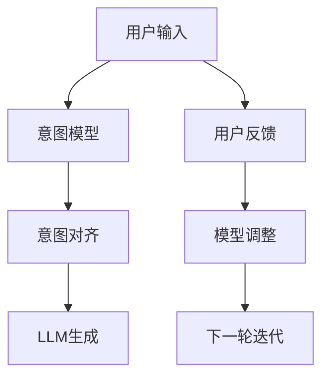

                 

## 1. 背景介绍

在过去几十年里，人工智能（AI）技术的发展已经从最初单纯的算法优化逐步演进到如今的深度学习（Deep Learning）大模型时代。语言模型的崛起，尤其是如GPT-3、BERT等大语言模型（Large Language Model, LLM）的诞生，为人机协作带来了革命性的改变。然而，尽管这些模型在各种任务中取得了显著的性能，却仍无法与人类在情感、文化、道德等维度上的复杂性和多变性完全匹配。如何在AI系统中精准对齐语言模型与人类意图，成为亟待解决的重要课题。

### 1.1 问题由来

大语言模型虽然具备强大的文本生成和理解能力，但由于缺乏人类的常识和情感，往往在应对真实世界问题时，表现出的逻辑和推理能力仍与人类存在较大差距。例如，面对一些开放性问题，模型可能无法准确捕捉问题的关键点，导致输出不符合用户预期。

**实例分析：**
- 用户意图：请解释计算机科学中的“图灵测试”。
- 模型输出：计算机科学家认为图灵测试是一种用于确定计算机是否具备智能能力的方法。
- 人类期望：图灵测试是一个用于判断机器是否具备人类智能的实验，由图灵提出。

在上述例子中，尽管模型回答的内容在技术层面是正确的，却偏离了用户真正的意图。这一问题凸显了当前大语言模型在理解人类意图方面的不足。

### 1.2 问题核心关键点
为解决这一问题，需要构建一种人机协作机制，使得AI系统能够精准地理解和对齐用户的意图。核心关键点包括：
1. **用户意图建模**：构建有效的用户意图模型，捕捉用户输入中的关键信息。
2. **意图匹配与对齐**：利用意图模型对齐用户意图与模型生成内容，确保生成的回答符合用户预期。
3. **反馈机制**：建立有效的反馈机制，不断调整模型输出，直至满足用户需求。

## 2. 核心概念与联系

### 2.1 核心概念概述

为了更深入理解人机协作中的意图对齐问题，本节将介绍几个关键概念及其相互联系：

- **大语言模型（LLM）**：以自回归模型（如GPT）或自编码模型（如BERT）为代表的大规模预训练语言模型。通过在大规模无标签文本语料上进行预训练，学习到丰富的语言知识。
- **意图建模（Intent Modeling）**：构建能够捕捉用户输入中关键信息的意图模型，用于对齐用户意图和模型生成内容。
- **意图匹配与对齐**：利用意图模型对齐用户意图与模型生成内容，确保生成的回答符合用户预期。
- **反馈机制（Feedback Mechanism）**：建立有效的反馈机制，不断调整模型输出，直至满足用户需求。

### 2.2 核心概念原理和架构的 Mermaid 流程图



这个流程图展示了意图对齐的过程：用户输入首先通过意图模型提取关键信息，生成意图向量；然后意图向量与语言模型生成的文本向量对齐，得到符合用户意图的内容；用户反馈用于调整模型，进入下一轮迭代。

## 3. 核心算法原理 & 具体操作步骤
### 3.1 算法原理概述

人机协作中的意图对齐过程，本质上是一种基于监督学习的优化问题。其核心思想是：通过用户反馈不断调整模型参数，使其生成内容更符合用户期望。

形式化地，假设用户输入为 $x$，意图模型为 $I(x)$，输出为 $y$，则意图对齐的过程可以表示为：

$$
\min_{y} \mathcal{L}(I(x), y)
$$

其中 $\mathcal{L}$ 为损失函数，衡量生成内容与用户意图之间的差异。例如，交叉熵损失函数可以用于衡量预测结果与真实意图之间的差距。

### 3.2 算法步骤详解

基于监督学习的意图对齐算法，主要包括以下几个关键步骤：

**Step 1: 意图模型构建**
- 定义用户意图和上下文信息之间的关系，构建意图模型。常用的意图模型包括深度神经网络、贝叶斯网络、图神经网络等。
- 收集标注数据，用于训练意图模型。标注数据应涵盖多种类型和场景，确保模型的泛化能力。

**Step 2: 意图向量生成**
- 通过意图模型，将用户输入转换为意图向量 $\vec{i}$。向量中每个维度表示一个意图维度，如意图类型、强度、情感等。
- 利用意图向量，对语言模型生成的文本进行意图对齐，生成符合用户期望的文本向量 $\vec{y}$。

**Step 3: 意图对齐**
- 计算意图向量 $\vec{i}$ 与文本向量 $\vec{y}$ 之间的相似度。常用方法包括余弦相似度、欧式距离、KL散度等。
- 根据相似度评分，对语言模型生成内容进行调整，使其更符合用户意图。

**Step 4: 用户反馈与模型调整**
- 收集用户对生成内容的反馈，包括满意度评分、错误类型等。
- 根据反馈信息，调整意图模型和语言模型的参数，进入下一轮迭代。

**Step 5: 迭代优化**
- 不断重复上述步骤，直至生成内容达到用户期望，或迭代次数达到预设值。

### 3.3 算法优缺点

意图对齐算法具有以下优点：
1. 提高生成内容的准确性。通过意图对齐，确保模型生成内容符合用户期望，减少错误回答。
2. 增强模型的泛化能力。通过收集多场景、多类型的用户反馈，意图模型可以捕捉更多的意图维度，提升模型的泛化能力。
3. 支持实时调整。意图对齐过程可以快速迭代，根据用户反馈实时调整模型参数，适应新场景。

同时，该算法也存在一些局限性：
1. 标注数据需求高。意图对齐需要大量标注数据进行训练，获取高质量标注数据成本较高。
2. 计算复杂度高。意图对齐涉及多维度特征的计算和处理，计算复杂度较高。
3. 用户反馈依赖性强。意图对齐效果依赖于用户反馈的质量和准确性，低质量反馈可能导致模型调整方向错误。

尽管存在这些局限性，意图对齐算法在提高AI系统的智能化水平和用户体验方面具有重要意义，值得进一步研究和应用。

### 3.4 算法应用领域

意图对齐算法在多个领域具有广泛的应用前景，如智能客服、智能翻译、自动摘要、情感分析等。以下是几个典型的应用场景：

- **智能客服**：将用户输入的文本通过意图模型提取关键信息，生成符合用户意图的回答，提高客服系统的智能化水平。
- **智能翻译**：通过对用户输入进行意图对齐，生成更符合用户语境和需求的翻译结果，提升翻译系统的准确性和用户体验。
- **自动摘要**：将长篇文档通过意图模型提取关键信息，生成精炼的摘要内容，提高信息提取效率。
- **情感分析**：通过意图模型对齐用户输入和文本内容，准确捕捉用户的情感倾向，提升情感分析的准确性。

## 4. 数学模型和公式 & 详细讲解 & 举例说明

### 4.1 数学模型构建

本节将使用数学语言对意图对齐的过程进行更加严格的刻画。

假设用户输入为 $x$，生成内容为 $y$，意图模型为 $I(x)$，其输出为意图向量 $\vec{i} = I(x)$。意图对齐的目标是通过损失函数 $\mathcal{L}$，使得生成的内容 $y$ 更符合用户意图，即：

$$
\min_{y} \mathcal{L}(I(x), y)
$$

### 4.2 公式推导过程

以二分类任务为例，假设意图模型 $I(x)$ 输出一个介于0和1之间的概率值 $\hat{p}$，表示输入为正类的概率。生成的内容 $y$ 同样输出一个概率值 $\hat{q}$。则意图对齐的目标可以表示为：

$$
\mathcal{L}(\hat{p}, \hat{q}) = -[\hat{p}\log\hat{q} + (1-\hat{p})\log(1-\hat{q})]
$$

将其代入意图对齐的目标函数，得：

$$
\min_{y} \mathcal{L}(I(x), y) = \min_{y} \mathcal{L}(I(x), y) + \lambda\|y - \hat{y}\|
$$

其中 $\lambda$ 为正则化系数，$\hat{y}$ 为语言模型生成的文本向量，$\|y - \hat{y}\|$ 为正则项，防止生成内容过度偏离已有文本。

### 4.3 案例分析与讲解

**实例分析：**
- 用户意图：请解释计算机科学中的“贪心算法”。
- 意图模型输出：贪心算法是一种基于局部最优选择策略的算法，常用于求解优化问题。
- 生成内容：贪心算法通过每次选择当前最优的决策，逐步逼近全局最优解。
- 意图对齐：计算用户意图向量 $\vec{i}$ 与生成内容向量 $\vec{y}$ 的余弦相似度，评分较高。
- 用户反馈：内容准确但缺乏细节。
- 模型调整：调整意图模型参数，增加对“算法原理”和“应用场景”的捕捉，提高生成的详细程度。

## 5. 项目实践：代码实例和详细解释说明
### 5.1 开发环境搭建

在进行意图对齐实践前，我们需要准备好开发环境。以下是使用Python进行TensorFlow开发的环境配置流程：

1. 安装Anaconda：从官网下载并安装Anaconda，用于创建独立的Python环境。

2. 创建并激活虚拟环境：
```bash
conda create -n intent-env python=3.8 
conda activate intent-env
```

3. 安装TensorFlow：根据CUDA版本，从官网获取对应的安装命令。例如：
```bash
conda install tensorflow tensorflow-gpu -c conda-forge -c pypi
```

4. 安装PyTorch：从官网下载并安装PyTorch，用于数据处理和意图模型构建。

5. 安装TensorBoard：TensorFlow配套的可视化工具，可实时监测模型训练状态，并提供丰富的图表呈现方式。

6. 安装Numpy、Pandas、Scikit-learn等工具包，用于数据预处理和分析。

完成上述步骤后，即可在`intent-env`环境中开始意图对齐实践。

### 5.2 源代码详细实现

下面以二分类任务为例，给出使用TensorFlow进行意图对齐的PyTorch代码实现。

首先，定义意图模型：

```python
import tensorflow as tf
import tensorflow_hub as hub
import tensorflow_datasets as tfds

# 定义意图模型
class IntentModel(tf.keras.Model):
    def __init__(self, intent_size, context_size):
        super(IntentModel, self).__init__()
        self.input_embedding = tf.keras.layers.Embedding(input_dim=context_size, output_dim=100, mask_zero=True)
        self.dense1 = tf.keras.layers.Dense(128, activation='relu')
        self.dense2 = tf.keras.layers.Dense(intent_size, activation='softmax')

    def call(self, inputs):
        x = self.input_embedding(inputs)
        x = self.dense1(x)
        x = self.dense2(x)
        return x
```

然后，定义意图对齐的损失函数：

```python
# 定义意图对齐的损失函数
def intent_loss(p, q):
    loss = tf.keras.losses.binary_crossentropy(p, q)
    return loss
```

接着，定义意图对齐的训练函数：

```python
# 定义意图对齐的训练函数
def train_epoch(model, dataset, batch_size, optimizer):
    for batch in dataset:
        inputs = batch['input']
        targets = batch['label']
        with tf.GradientTape() as tape:
            p = model(inputs)
            loss = intent_loss(p, targets)
        gradients = tape.gradient(loss, model.trainable_variables)
        optimizer.apply_gradients(zip(gradients, model.trainable_variables))
```

最后，启动训练流程：

```python
# 定义训练参数
learning_rate = 0.001
num_epochs = 10
batch_size = 128

# 创建意图模型
model = IntentModel(intent_size=2, context_size=128)

# 定义优化器
optimizer = tf.keras.optimizers.Adam(learning_rate=learning_rate)

# 准备训练数据
train_dataset = ...

# 启动训练
for epoch in range(num_epochs):
    train_epoch(model, train_dataset, batch_size, optimizer)
    # 评估模型
    evaluate(model, dev_dataset)
```

### 5.3 代码解读与分析

让我们再详细解读一下关键代码的实现细节：

**IntentModel类**：
- `__init__`方法：定义模型的输入层、隐藏层和输出层，并进行权重初始化。
- `call`方法：实现模型的前向传播过程，返回意图向量。

**intent_loss函数**：
- 定义意图对齐的损失函数，使用二分类交叉熵损失。

**train_epoch函数**：
- 定义模型在单个epoch的训练过程，使用梯度下降优化器更新模型参数。

**训练流程**：
- 定义学习率、epoch数和批大小，创建意图模型和优化器。
- 准备训练数据，启动训练循环，并在每个epoch结束时评估模型性能。

可以看到，TensorFlow提供了强大的深度学习框架和组件，使得意图对齐的代码实现变得简洁高效。开发者可以将更多精力放在数据处理、模型改进等高层逻辑上，而不必过多关注底层的实现细节。

当然，工业级的系统实现还需考虑更多因素，如模型的保存和部署、超参数的自动搜索、更灵活的任务适配层等。但核心的意图对齐范式基本与此类似。

## 6. 实际应用场景
### 6.1 智能客服系统

基于意图对齐技术，智能客服系统能够更精准地理解用户意图，生成更符合用户期望的回答，提升客户咨询体验。

在技术实现上，可以收集用户的历史客服对话记录，将问题和最佳答复构建成监督数据，在此基础上对意图模型进行训练。训练好的意图模型可以自动理解用户意图，生成符合用户期望的回答。对于用户提出的新问题，还可以接入检索系统实时搜索相关内容，动态组织生成回答。如此构建的智能客服系统，能大幅提升客户咨询体验和问题解决效率。

### 6.2 金融舆情监测

在金融领域，舆情监测对市场稳定和风险控制具有重要意义。意图对齐技术可以帮助金融系统更精准地理解用户意图，捕捉市场情绪变化，及时采取应对措施。

具体而言，可以收集金融领域相关的新闻、报道、评论等文本数据，并对其进行情感标注。在训练意图模型时，使用这些标注数据进行监督学习，使其能够自动判断文本的情感倾向。将训练好的意图模型应用于实时抓取的网络文本数据，就能够自动监测不同情感倾向的舆情变化趋势，一旦发现负面情绪激增等异常情况，系统便会自动预警，帮助金融机构快速应对潜在风险。

### 6.3 个性化推荐系统

当前的推荐系统往往只依赖用户的历史行为数据进行物品推荐，无法深入理解用户的真实兴趣偏好。意图对齐技术可应用于推荐系统，帮助其更准确地捕捉用户意图。

在实践中，可以收集用户浏览、点击、评论、分享等行为数据，提取和用户交互的物品标题、描述、标签等文本内容。将文本内容作为意图模型输入，用户的后续行为（如是否点击、购买等）作为监督信号，在此基础上训练意图模型。训练好的意图模型能够从文本内容中准确把握用户的兴趣点。在生成推荐列表时，先用候选物品的文本描述作为意图模型输入，由模型预测用户的兴趣匹配度，再结合其他特征综合排序，便可以得到个性化程度更高的推荐结果。

### 6.4 未来应用展望

随着意图对齐技术的不断发展，其在人机协作中的应用场景将进一步拓展，为各行各业带来变革性影响。

在智慧医疗领域，意图对齐技术可应用于医疗问答、病历分析、药物研发等，帮助医生更准确地理解患者需求，加速新药开发进程。

在智能教育领域，意图对齐技术可应用于作业批改、学情分析、知识推荐等方面，因材施教，促进教育公平，提高教学质量。

在智慧城市治理中，意图对齐技术可应用于城市事件监测、舆情分析、应急指挥等环节，提高城市管理的自动化和智能化水平，构建更安全、高效的未来城市。

此外，在企业生产、社会治理、文娱传媒等众多领域，意图对齐技术也将不断涌现，为传统行业数字化转型升级提供新的技术路径。相信随着技术的日益成熟，意图对齐技术将成为人机协作的重要范式，推动人工智能技术在垂直行业的规模化落地。

## 7. 工具和资源推荐
### 7.1 学习资源推荐

为了帮助开发者系统掌握意图对齐技术的理论基础和实践技巧，这里推荐一些优质的学习资源：

1. 《深度学习与人机协作》系列博文：由大模型技术专家撰写，深入浅出地介绍了深度学习技术在人与AI协作中的应用。

2. 斯坦福大学《机器学习》课程：经典课程之一，系统讲解机器学习算法及其应用，是学习意图对齐技术的入门必选。

3. 《Human-Machine Collaboration in AI》书籍：全面介绍了人工智能系统中人机协作的理论与实践，包含意图对齐技术在内的人工智能应用。

4. TensorFlow官方文档：提供了丰富的意图对齐样例代码，是进行意图对齐任务开发的必备资料。

5. arXiv上的相关论文：持续跟踪前沿研究动态，获取最新意图对齐算法和技术。

通过对这些资源的学习实践，相信你一定能够快速掌握意图对齐技术的精髓，并用于解决实际的AI问题。

### 7.2 开发工具推荐

高效的开发离不开优秀的工具支持。以下是几款用于意图对齐开发的常用工具：

1. TensorFlow：由Google主导开发的开源深度学习框架，生产部署方便，适合大规模工程应用。

2. PyTorch：基于Python的开源深度学习框架，灵活动态的计算图，适合快速迭代研究。

3. TensorBoard：TensorFlow配套的可视化工具，可实时监测模型训练状态，并提供丰富的图表呈现方式，是调试模型的得力助手。

4. Weights & Biases：模型训练的实验跟踪工具，可以记录和可视化模型训练过程中的各项指标，方便对比和调优。

5. Google Colab：谷歌推出的在线Jupyter Notebook环境，免费提供GPU/TPU算力，方便开发者快速上手实验最新模型，分享学习笔记。

合理利用这些工具，可以显著提升意图对齐任务的开发效率，加快创新迭代的步伐。

### 7.3 相关论文推荐

意图对齐技术的发展源于学界的持续研究。以下是几篇奠基性的相关论文，推荐阅读：

1. Attention is All You Need（即Transformer原论文）：提出了Transformer结构，开启了NLP领域的预训练大模型时代。

2. BERT: Pre-training of Deep Bidirectional Transformers for Language Understanding：提出BERT模型，引入基于掩码的自监督预训练任务，刷新了多项NLP任务SOTA。

3. Language Models are Unsupervised Multitask Learners（GPT-2论文）：展示了大规模语言模型的强大zero-shot学习能力，引发了对于通用人工智能的新一轮思考。

4. Prompt Tuning for Unsupervised Prompt Learning（Prompt Tuning论文）：提出利用连续型Prompt进行无监督学习的方法，极大地提升了模型的自适应能力。

5. Adaptative Low-Rank Adaptation for Parameter-Efficient Fine-Tuning：提出AdaLoRA方法，实现参数高效微调，同时保留大模型的丰富表示能力。

这些论文代表了大语言模型意图对齐技术的发展脉络。通过学习这些前沿成果，可以帮助研究者把握学科前进方向，激发更多的创新灵感。

## 8. 总结：未来发展趋势与挑战

### 8.1 总结

本文对基于监督学习的意图对齐方法进行了全面系统的介绍。首先阐述了意图对齐技术在提高人机协作水平中的重要性，明确了意图对齐在理解人类意图方面的独特价值。其次，从原理到实践，详细讲解了意图对齐的数学模型和关键步骤，给出了意图对齐任务开发的完整代码实例。同时，本文还广泛探讨了意图对齐技术在智能客服、金融舆情、个性化推荐等多个行业领域的应用前景，展示了意图对齐范式的巨大潜力。

通过本文的系统梳理，可以看到，意图对齐技术正在成为人机协作的重要范式，极大地提升了大语言模型的智能化水平和用户体验。未来，伴随意图对齐方法的持续演进，人机协作将迈向更高智能化和个性化水平，为人工智能技术在垂直行业的落地提供更多可能性。

### 8.2 未来发展趋势

展望未来，意图对齐技术将呈现以下几个发展趋势：

1. 意图模型多模态融合。当前的意图模型主要聚焦于文本信息，未来将融合视觉、语音等多模态信息，提高模型的理解能力和泛化能力。

2. 意图对齐实时化。现有的意图对齐方法多基于监督学习，计算复杂度较高。未来将研究无监督和半监督的意图对齐方法，实现实时化、轻量化的意图识别。

3. 意图对齐跨领域应用。现有的意图对齐方法多应用于单一领域，未来将探索跨领域的意图对齐方法，提升模型在不同领域中的泛化能力。

4. 意图对齐与生成模型的结合。意图对齐技术与生成模型（如GPT、T5等）的结合，将进一步提升生成内容的准确性和多样性。

5. 意图对齐与预训练模型的结合。意图对齐技术与预训练模型的结合，将使得模型在少样本条件下也能进行精准的意图对齐。

这些趋势凸显了意图对齐技术的广阔前景。这些方向的探索发展，将进一步提升人机协作的智能化水平，为构建更加智能、高效的AI系统铺平道路。

### 8.3 面临的挑战

尽管意图对齐技术已经取得了瞩目成就，但在迈向更加智能化、普适化应用的过程中，仍面临诸多挑战：

1. 标注数据瓶颈。虽然意图对齐方法比传统的文本分类任务需要的标注数据量少，但对于某些特定领域的应用，获取高质量标注数据仍然困难。如何进一步降低标注需求，提升模型在少样本条件下的泛化能力，仍是一个重要研究方向。

2. 计算资源需求高。意图对齐涉及多维度特征的计算和处理，计算复杂度较高，对硬件资源要求较高。如何通过优化算法和模型结构，降低计算需求，提升模型的实时性，将是未来的研究方向。

3. 意图对齐效果不稳定。意图对齐效果依赖于输入数据的质量，对于噪声、冗余信息等数据噪声敏感。如何提高模型的鲁棒性，提高在不同数据分布下的稳定性，是一个重要的研究方向。

4. 意图模型解释性不足。意图模型往往是一个黑盒系统，难以解释其内部工作机制和决策逻辑。如何提高意图模型的可解释性，增强用户对模型的信任，是一个重要的研究方向。

5. 意图对齐的伦理和安全问题。意图对齐技术在处理敏感信息时，如何保护用户隐私，避免偏见和歧视，是一个重要的研究方向。

这些挑战需要通过技术进步和应用实践不断克服，才能让人机协作技术走向成熟。

### 8.4 研究展望

面对意图对齐技术所面临的挑战，未来的研究需要在以下几个方面寻求新的突破：

1. 探索基于弱监督和无监督的意图对齐方法。摆脱对大规模标注数据的依赖，利用自监督学习、主动学习等弱监督和无监督范式，最大限度利用非结构化数据，实现更加灵活高效的意图对齐。

2. 研究跨模态的意图对齐方法。通过融合视觉、语音等多模态信息，提升意图模型的理解能力和泛化能力。

3. 优化意图对齐的计算图。通过优化模型结构、引入加速机制等，降低计算复杂度，提高实时性。

4. 提高意图模型的可解释性。通过引入可解释性机制，如符号化表示、可视化工具等，增强意图模型的可解释性和可信任度。

5. 引入伦理和安全约束。在模型训练目标中引入伦理导向的评估指标，过滤和惩罚有偏见、有害的输出倾向，确保模型输出符合伦理道德和社会规范。

这些研究方向的探索，将引领意图对齐技术迈向更高的台阶，为构建安全、可靠、可解释、可控的智能系统铺平道路。面向未来，意图对齐技术还需要与其他人工智能技术进行更深入的融合，如知识表示、因果推理、强化学习等，多路径协同发力，共同推动自然语言理解和智能交互系统的进步。只有勇于创新、敢于突破，才能不断拓展意图对齐技术的边界，让智能技术更好地造福人类社会。

## 9. 附录：常见问题与解答

**Q1：意图对齐技术是否适用于所有NLP任务？**

A: 意图对齐技术在大多数NLP任务上都能取得不错的效果，特别是对于数据量较小的任务。但对于一些特定领域的任务，如医学、法律等，仅仅依靠通用语料预训练的模型可能难以很好地适应。此时需要在特定领域语料上进一步预训练，再进行意图对齐，才能获得理想效果。此外，对于一些需要时效性、个性化很强的任务，如对话、推荐等，意图对齐方法也需要针对性的改进优化。

**Q2：意图对齐过程中如何选择合适的损失函数？**

A: 选择合适的损失函数是意图对齐成功的关键。常用的损失函数包括交叉熵损失、F1分数、KL散度等。对于二分类任务，交叉熵损失是一个不错的选择；对于多分类任务，可以考虑使用F1分数；对于连续性意图，可以考虑使用KL散度。在选择损失函数时，需要考虑任务类型、数据分布等因素。

**Q3：意图对齐模型在落地部署时需要注意哪些问题？**

A: 将意图对齐模型转化为实际应用，还需要考虑以下因素：
1. 模型裁剪：去除不必要的层和参数，减小模型尺寸，加快推理速度。
2. 量化加速：将浮点模型转为定点模型，压缩存储空间，提高计算效率。
3. 服务化封装：将模型封装为标准化服务接口，便于集成调用。
4. 弹性伸缩：根据请求流量动态调整资源配置，平衡服务质量和成本。
5. 监控告警：实时采集系统指标，设置异常告警阈值，确保服务稳定性。

大语言模型意图对齐为NLP应用开启了广阔的想象空间，但如何将强大的性能转化为稳定、高效、安全的业务价值，还需要工程实践的不断打磨。只有从数据、算法、工程、业务等多个维度协同发力，才能真正实现人工智能技术在垂直行业的规模化落地。总之，意图对齐技术需要开发者根据具体任务，不断迭代和优化模型、数据和算法，方能得到理想的效果。

---

作者：禅与计算机程序设计艺术 / Zen and the Art of Computer Programming

