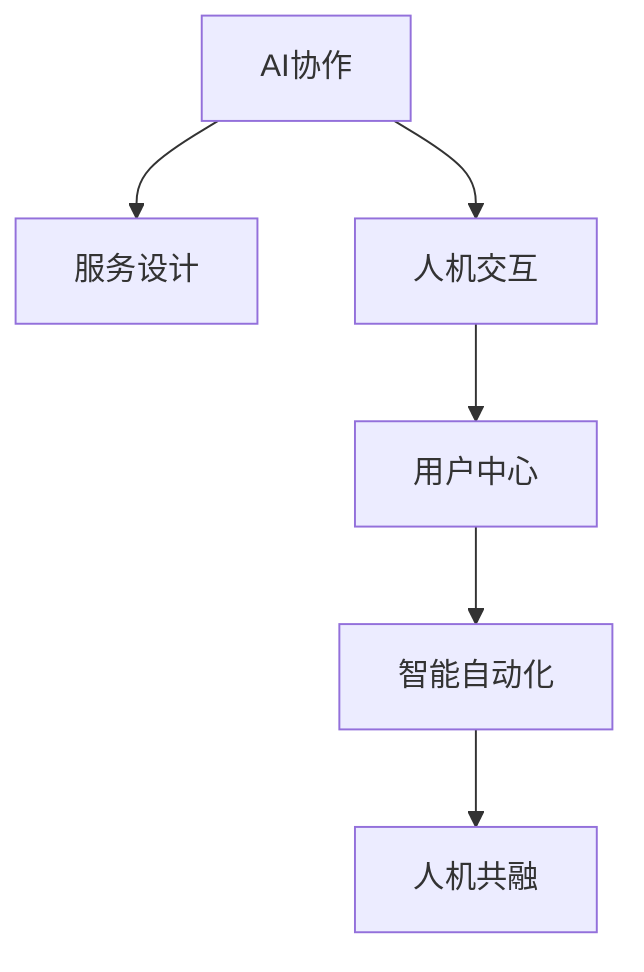

                 

# 人类-AI协作：为人类服务的设计

> 关键词：AI协作,服务设计,人机交互,用户中心,智能自动化,人机共融

## 1. 背景介绍

随着人工智能（AI）技术的迅猛发展，AI正在深入到各个行业和领域，为人类服务已成为不可避免的趋势。AI的强大计算能力和学习能力，使其在处理复杂任务、提高效率、创新生产方式等方面展现出巨大潜力。然而，如何让AI真正服务于人类，为人类创造价值，而非成为人类的竞争对手，是一个值得深思的问题。本文将从设计视角出发，探讨如何设计AI系统，使其能够与人类协作，为人类提供优质的服务。

## 2. 核心概念与联系

### 2.1 核心概念概述

为更好地理解AI系统与人类协作的设计理念，我们首先需要梳理几个核心概念：

- **AI协作**：指AI系统与人类共同完成某一任务的过程。AI系统通过处理数据、推理决策等方式，协助人类解决复杂问题，提高工作效率。

- **服务设计**：旨在提供满足用户需求的产品或服务，注重用户体验、可用性、可访问性等方面的设计原则。服务设计强调从用户需求出发，系统地解决问题，最终实现用户价值。

- **人机交互**：研究如何让AI系统与人类进行高效、自然、人性化的沟通，提升系统的易用性和亲和力。

- **用户中心**：在产品设计和开发过程中，始终将用户需求放在首位，通过调研、测试等方法，确保产品能够真正满足用户的需求和期望。

- **智能自动化**：指通过AI技术实现任务自动化的过程，涵盖信息自动化、决策自动化、控制自动化等多个方面。

- **人机共融**：在人类与AI协作的共生环境中，人与AI系统之间形成和谐、互补、可持续的互动关系。

这些概念之间的逻辑关系可以通过以下Mermaid流程图来展示：



这个流程图展示了几大核心概念之间的联系：

1. AI协作是服务设计的核心内容，即通过AI系统提升服务质量。
2. 人机交互是人机共融的基础，即确保AI系统的易用性和亲和力。
3. 用户中心是服务设计和人机交互的出发点，即确保系统设计能够满足用户需求。
4. 智能自动化是AI协作和用户中心的具体体现，即通过自动化技术提高工作效率。
5. 人机共融是人机交互和智能自动化的终极目标，即实现人与AI系统的和谐共生。

## 3. 核心算法原理 & 具体操作步骤
### 3.1 算法原理概述

AI系统与人类协作的设计原则，主要体现在以下几个方面：

- **用户需求驱动**：AI系统设计应以用户需求为中心，通过调研、用户反馈等方式，明确用户的需求和期望，设计出满足用户需求的AI解决方案。
- **智能与人工结合**：AI系统应具备智能自动化的能力，同时保留人工干预的空间，确保系统决策的透明性和可解释性。
- **人机互动优化**：通过优化人机交互界面和流程，提高系统易用性和亲和力，实现自然、人性化的交互体验。
- **持续学习与迭代**：AI系统应具备持续学习的能力，通过不断接收新数据和用户反馈，优化系统性能，提升服务质量。

### 3.2 算法步骤详解

AI系统与人类协作的设计步骤包括：

1. **需求分析**：通过用户调研、竞品分析等方式，明确用户需求和系统目标。
2. **系统设计**：设计AI系统的功能和架构，包括决策模型、数据处理、人机交互等方面。
3. **算法实现**：基于选定的算法和模型，实现AI系统的核心功能。
4. **测试与优化**：通过用户测试、A/B测试等方式，评估系统性能，根据反馈进行优化。
5. **部署与迭代**：将优化后的系统部署到实际环境中，持续接收用户反馈，进行迭代优化。

### 3.3 算法优缺点

AI系统与人类协作的设计，具有以下优点：

- **提升工作效率**：AI系统能够处理大量重复性和高强度的工作，释放人类劳动力，提升工作效率。
- **增强决策质量**：通过AI系统的数据分析和推理能力，能够提供更为科学、精准的决策支持。
- **促进创新**：AI系统能够发现人类无法观察到的模式和规律，为创新提供新的思路和方法。

同时，这种设计方法也存在一些局限性：

- **依赖数据质量**：AI系统的性能很大程度上依赖于输入数据的质量，数据偏差可能导致系统误判。
- **伦理与安全问题**：AI系统可能存在偏见、歧视等问题，如何确保其决策的公正性和安全性是一大挑战。
- **易用性问题**：复杂算法和系统架构可能导致用户体验不佳，需要设计良好的用户界面和交互流程。

### 3.4 算法应用领域

AI系统与人类协作的设计理念，广泛应用于以下几个领域：

- **智能客服**：通过AI系统实现自动接听、问题解答等客服功能，提升客户体验和服务效率。
- **医疗健康**：利用AI系统进行疾病诊断、药物推荐、健康管理等，提高医疗服务的准确性和效率。
- **智能制造**：通过AI系统实现生产自动化、质量控制、供应链管理等，提升制造业的智能化水平。
- **金融服务**：利用AI系统进行风险评估、信用评分、投资策略等，优化金融决策和服务质量。
- **智慧城市**：通过AI系统实现交通管理、环境监测、公共安全等，提升城市管理智能化水平。

这些应用领域展示了AI系统在各个行业中的广泛应用，为人类提供了高效、智能的服务支持。

## 4. 数学模型和公式 & 详细讲解 & 举例说明

### 4.1 数学模型构建

为设计一个高效的AI系统，我们需要构建一个数学模型来描述其行为。假设AI系统接收用户输入 $x$，通过算法处理得到输出 $y$，模型目标是最大化用户满意度 $u$。数学模型可以表示为：

$$
\max_{y} u(x, y)
$$

其中 $u$ 为满意度函数，$y$ 为系统输出，$x$ 为用户输入。

### 4.2 公式推导过程

根据上述模型，我们可以推导出几个关键公式：

1. **输入输出映射**：
$$
y = f(x)
$$
其中 $f$ 为输入输出映射函数，表示AI系统如何从用户输入 $x$ 生成输出 $y$。

2. **满意度函数**：
$$
u = g(y, x)
$$
其中 $g$ 为满意度函数，表示用户对输出 $y$ 的满意程度。

3. **目标优化**：
$$
\max_{y} u(x, y) = \max_{y} g(y, x)
$$
即目标是通过最大化满意度函数 $g$，找到最优的输出 $y$。

### 4.3 案例分析与讲解

以智能客服系统为例，我们可以进一步分析模型和公式的实际应用。假设用户输入为问题 $x$，系统输出为回答 $y$，满意度函数可以定义为回答的准确度和用户的满意度。如果回答正确，满意度为1；如果回答错误，满意度为0。则满意度函数可以表示为：

$$
u = \begin{cases} 
1 & \text{如果回答正确} \\
0 & \text{如果回答错误} \\
\end{cases}
$$

在实际应用中，我们可以通过构建具体的输入输出映射函数和满意度函数，来实现对智能客服系统的设计。例如，可以使用规则基系统、决策树、神经网络等算法，来构建输入输出映射函数。同时，通过用户反馈和机器学习算法，优化满意度函数，提高系统的服务质量。

## 5. 项目实践：代码实例和详细解释说明
### 5.1 开发环境搭建

在进行AI系统设计时，首先需要搭建好开发环境。以下是使用Python进行TensorFlow开发的示例：

1. 安装Anaconda：从官网下载并安装Anaconda，用于创建独立的Python环境。
2. 创建并激活虚拟环境：
```bash
conda create -n tf-env python=3.8 
conda activate tf-env
```

3. 安装TensorFlow：根据CUDA版本，从官网获取对应的安装命令。例如：
```bash
conda install tensorflow -c pytorch -c conda-forge
```

4. 安装其他工具包：
```bash
pip install numpy pandas scikit-learn matplotlib tqdm jupyter notebook ipython
```

完成上述步骤后，即可在`tf-env`环境中开始开发。

### 5.2 源代码详细实现

下面以智能客服系统为例，给出使用TensorFlow实现的自然语言处理（NLP）代码实现。

首先，定义NLP模型和用户输入输出映射函数：

```python
import tensorflow as tf
from tensorflow.keras import layers

class NLPModel(tf.keras.Model):
    def __init__(self, vocab_size, embedding_dim, hidden_units):
        super(NLPModel, self).__init__()
        self.embedding = layers.Embedding(vocab_size, embedding_dim)
        self.gru = layers.GRU(hidden_units, return_sequences=True)
        self.fc = layers.Dense(1, activation='sigmoid')

    def call(self, inputs):
        x = self.embedding(inputs)
        x = self.gru(x)
        x = self.fc(x[:, -1, :])
        return x
```

然后，定义训练和评估函数：

```python
def train_model(model, dataset, epochs, batch_size, learning_rate):
    model.compile(optimizer=tf.keras.optimizers.Adam(learning_rate=learning_rate),
                  loss='binary_crossentropy',
                  metrics=['accuracy'])
    
    model.fit(dataset, epochs=epochs, batch_size=batch_size)
    
def evaluate_model(model, dataset, batch_size):
    loss, accuracy = model.evaluate(dataset, batch_size=batch_size)
    print(f'Accuracy: {accuracy:.2f}')
```

最后，启动训练流程并在测试集上评估：

```python
epochs = 10
batch_size = 32
learning_rate = 0.001

# 假设训练集和测试集已经准备就绪
train_model(model, train_dataset, epochs, batch_size, learning_rate)
evaluate_model(model, test_dataset, batch_size)
```

以上就是一个简单的智能客服系统的NLP模型实现。可以看到，TensorFlow提供了一系列的API，使得模型构建和训练过程变得非常直观和高效。

### 5.3 代码解读与分析

让我们再详细解读一下关键代码的实现细节：

**NLPModel类**：
- `__init__`方法：定义模型的组件，包括嵌入层、GRU层和全连接层。
- `call`方法：实现模型的前向传播过程。

**train_model函数**：
- 使用TensorFlow的编译器，设置优化器、损失函数和评估指标。
- 使用`fit`方法进行模型训练，循环迭代训练集。

**evaluate_model函数**：
- 使用`evaluate`方法计算模型在测试集上的损失和准确率。

**训练流程**：
- 定义总迭代次数、批大小和学习率，开始循环迭代。
- 在训练集上训练模型，输出每个epoch的损失和准确率。
- 在测试集上评估模型，输出最终测试准确率。

可以看到，TensorFlow提供的高层API使得模型构建和训练过程变得非常简单和直观。开发者可以将更多精力放在模型优化和算法设计上，而不必过多关注底层实现细节。

当然，工业级的系统实现还需考虑更多因素，如模型的保存和部署、超参数的自动搜索、更灵活的任务适配层等。但核心的AI系统设计基本与此类似。

## 6. 实际应用场景
### 6.1 智能客服系统

基于AI系统与人类协作的设计理念，智能客服系统能够24小时不间断服务，快速响应客户咨询，用自然流畅的语言解答各类常见问题。

在技术实现上，可以收集企业内部的历史客服对话记录，将问题和最佳答复构建成监督数据，在此基础上对预训练NLP模型进行微调。微调后的模型能够自动理解用户意图，匹配最合适的答案模板进行回复。对于客户提出的新问题，还可以接入检索系统实时搜索相关内容，动态组织生成回答。如此构建的智能客服系统，能大幅提升客户咨询体验和问题解决效率。

### 6.2 医疗健康

AI系统在医疗健康领域的应用，可以通过分析患者的历史数据和实时监测数据，提供个性化的健康管理和疾病诊断服务。

例如，利用深度学习算法构建疾病预测模型，结合基因组数据和临床数据，预测患者未来可能患上的疾病类型。或者通过自然语言处理技术，分析患者的病历记录和症状描述，提供初步的诊断建议。这些功能可以大大提升医疗服务的智能化水平，辅助医生诊疗，加速新药开发进程。

### 6.3 智能制造

AI系统在智能制造领域的应用，可以通过自动化生产线和智能设备，实现生产自动化、质量控制、供应链管理等功能。

例如，利用机器视觉技术进行产品检测和质量控制，通过自然语言处理技术进行生产计划和调度，通过物联网技术进行设备和材料的管理。这些功能可以大幅提升制造业的智能化水平，降低生产成本，提高产品质量和生产效率。

### 6.4 金融服务

AI系统在金融服务领域的应用，可以通过风险评估、信用评分、投资策略等功能，优化金融决策和服务质量。

例如，利用机器学习算法进行信用评分，结合用户的历史交易数据和行为数据，预测用户的信用风险。或者通过自然语言处理技术，分析金融新闻和市场报告，提供投资建议和风险预警。这些功能可以大大提升金融服务的智能化水平，降低金融风险，提高投资回报率。

### 6.5 智慧城市

AI系统在智慧城市领域的应用，可以通过智能交通、环境监测、公共安全等功能，提升城市管理的智能化水平。

例如，利用机器学习算法进行交通流量预测，通过自然语言处理技术进行事件监测和舆情分析，通过物联网技术进行环境监测和资源管理。这些功能可以大幅提升城市管理的智能化水平，提高城市运行效率，提升居民生活质量。

## 7. 工具和资源推荐
### 7.1 学习资源推荐

为帮助开发者系统掌握AI系统与人类协作的设计理念，这里推荐一些优质的学习资源：

1. 《深度学习》系列书籍：由多位深度学习专家合著，系统讲解深度学习原理和应用。
2. 《人机交互设计》课程：斯坦福大学开设的交互设计课程，涵盖人机交互原理和设计方法。
3. 《人工智能伦理》书籍：探讨AI技术的伦理和社会影响，提供系统的伦理框架。
4. 《服务设计》课程：IDEO开设的服务设计课程，涵盖服务设计原理和实践案例。
5. 《智能自动化》课程：MIT开设的自动化课程，讲解自动化技术的原理和应用。

通过对这些资源的学习实践，相信你一定能够全面掌握AI系统与人类协作的设计理念，并用于解决实际的AI问题。

### 7.2 开发工具推荐

高效的开发离不开优秀的工具支持。以下是几款用于AI系统设计的常用工具：

1. TensorFlow：基于Python的开源深度学习框架，灵活动态的计算图，适合快速迭代研究。
2. PyTorch：基于Python的开源深度学习框架，灵活性高，易于使用。
3. TensorBoard：TensorFlow配套的可视化工具，可实时监测模型训练状态，提供丰富的图表呈现方式。
4. Weights & Biases：模型训练的实验跟踪工具，可以记录和可视化模型训练过程中的各项指标，方便对比和调优。
5. Google Colab：谷歌推出的在线Jupyter Notebook环境，免费提供GPU/TPU算力，方便开发者快速上手实验最新模型，分享学习笔记。

合理利用这些工具，可以显著提升AI系统设计的开发效率，加快创新迭代的步伐。

### 7.3 相关论文推荐

AI系统与人类协作的设计理念，源于学界的持续研究。以下是几篇奠基性的相关论文，推荐阅读：

1. "A Survey on Human-Centered AI Design"（人机协作设计综述）：系统总结了人机协作设计的主要理论和方法。
2. "Designing for Human-AI Collaboration"（设计人机协作）：探讨了人机协作设计的基本原则和设计方法。
3. "Human-AI Collaboration in Smart Healthcare"（智能医疗人机协作）：介绍了AI系统在智能医疗中的应用和设计思路。
4. "Human-AI Collaboration in Manufacturing"（智能制造人机协作）：介绍了AI系统在智能制造中的应用和设计思路。
5. "Human-AI Collaboration in Financial Services"（金融服务人机协作）：介绍了AI系统在金融服务中的应用和设计思路。
6. "Human-AI Collaboration in Smart Cities"（智慧城市人机协作）：介绍了AI系统在智慧城市中的应用和设计思路。

这些论文代表了大语言模型微调技术的发展脉络。通过学习这些前沿成果，可以帮助研究者把握学科前进方向，激发更多的创新灵感。

## 8. 总结：未来发展趋势与挑战
### 8.1 总结

本文对AI系统与人类协作的设计理念进行了全面系统的介绍。首先阐述了AI系统与人类协作的设计背景和意义，明确了系统设计应以用户需求为中心，确保系统决策的透明性和可解释性，提升系统的易用性和亲和力，实现智能自动化和持续优化。通过系统的数学建模和算法实现，展示了AI系统与人类协作设计的可行性。同时，本文还探讨了AI系统在智能客服、医疗健康、智能制造、金融服务、智慧城市等多个领域的应用前景，展示了AI系统在各个行业中的广泛应用，为人类提供了高效、智能的服务支持。

通过本文的系统梳理，可以看到，AI系统与人类协作的设计理念正在成为AI系统设计的主流趋势，为AI系统提供了以人为本的设计思路，推动了AI系统在各个行业中的普及和应用。

### 8.2 未来发展趋势

展望未来，AI系统与人类协作的设计理念将呈现以下几个发展趋势：

1. **多模态交互**：未来AI系统将不仅限于文本交互，将引入语音、图像等多模态交互方式，提升人机交互的丰富性和多样性。
2. **智能推荐**：通过AI系统的数据分析和推荐算法，提供个性化的服务，满足用户的个性化需求。
3. **自适应学习**：AI系统将具备自适应学习能力，能够根据用户行为和反馈，动态调整模型参数，提升服务质量。
4. **可解释性增强**：AI系统将更加注重可解释性，提供透明和可信的决策过程，增强用户的信任和接受度。
5. **伦理与社会责任**：AI系统将更加注重伦理和社会责任，避免偏见和歧视，确保系统决策的公正性和安全性。

这些趋势展示了AI系统与人类协作设计的未来方向，将进一步提升系统的智能化水平和用户体验，推动AI技术的广泛应用。

### 8.3 面临的挑战

尽管AI系统与人类协作的设计理念在不断成熟，但在迈向更加智能化、普适化应用的过程中，它仍面临着诸多挑战：

1. **数据隐私与安全**：AI系统需要大量的用户数据进行训练和优化，如何保护用户隐私和数据安全，是一大难题。
2. **模型透明性与可解释性**：AI系统的决策过程难以解释，如何提高模型的透明性和可解释性，增强用户的信任感。
3. **跨领域知识整合**：AI系统需要整合多领域的知识，才能在特定领域取得好的性能，但不同领域的知识如何整合，仍然是一个挑战。
4. **持续优化与迭代**：AI系统需要不断接收新的数据和反馈，进行持续优化和迭代，但如何确保系统的稳定性和可靠性，是一大挑战。
5. **社会影响与伦理问题**：AI系统在提升效率的同时，也可能带来一些社会问题和伦理问题，如何避免负面影响，是一大挑战。

这些挑战需要学术界、产业界和政策制定者共同努力，才能确保AI系统与人类协作设计理念的持续发展和应用。

### 8.4 研究展望

未来的研究需要在以下几个方面寻求新的突破：

1. **多模态交互技术**：开发更加丰富和多样的多模态交互技术，提升人机交互的自然性和亲和力。
2. **智能推荐算法**：研究和开发智能推荐算法，提供更加个性化的服务，满足用户的个性化需求。
3. **自适应学习机制**：开发自适应学习机制，使AI系统能够根据用户行为和反馈，动态调整模型参数，提升服务质量。
4. **模型可解释性技术**：研究和开发模型可解释性技术，提高模型的透明性和可解释性，增强用户的信任感。
5. **伦理与社会责任研究**：加强AI系统的伦理和社会责任研究，确保系统决策的公正性和安全性，避免负面影响。

这些研究方向将进一步推动AI系统与人类协作设计的进步，为人类提供更加高效、智能、安全的服务支持。

## 9. 附录：常见问题与解答

**Q1：AI系统与人类协作是否适用于所有应用场景？**

A: AI系统与人类协作的设计理念，适用于大多数应用场景。但在一些特定领域，如医疗、金融等，需要考虑伦理和安全问题，确保系统决策的透明性和公正性。

**Q2：如何确保AI系统的决策透明性和可解释性？**

A: 确保AI系统的决策透明性和可解释性，可以通过以下方法：
1. 设计可解释性较强的模型，如决策树、规则基系统等。
2. 提供决策过程的可视化界面，使用户能够理解系统的决策依据。
3. 引入用户反馈机制，通过用户评价和纠正，逐步优化系统决策。

**Q3：AI系统与人类协作的设计过程中，如何平衡效率和用户体验？**

A: 平衡效率和用户体验，可以通过以下方法：
1. 设计简洁明了的交互界面，提升用户体验。
2. 提供多样化的交互方式，满足不同用户的需求。
3. 优化系统性能，提升系统的处理效率。
4. 引入智能推荐和自适应学习机制，提高系统的个性化服务能力。

**Q4：AI系统与人类协作的设计过程中，如何确保数据隐私和安全？**

A: 确保数据隐私和安全，可以通过以下方法：
1. 采用差分隐私技术，保护用户隐私。
2. 使用加密技术，保护数据传输和存储的安全性。
3. 设计数据访问控制机制，限制数据的使用权限。

这些方法可以确保AI系统与人类协作设计的可靠性和安全性，保障用户的权益和利益。

**Q5：AI系统与人类协作的设计过程中，如何处理跨领域知识整合问题？**

A: 处理跨领域知识整合问题，可以通过以下方法：
1. 引入领域专家的知识，进行领域适应性训练。
2. 使用知识图谱技术，整合不同领域的知识。
3. 开发通用性较强的算法，提高系统的跨领域适应能力。

这些方法可以确保AI系统在特定领域取得好的性能，提升系统的通用性和适应性。

---

作者：禅与计算机程序设计艺术 / Zen and the Art of Computer Programming

