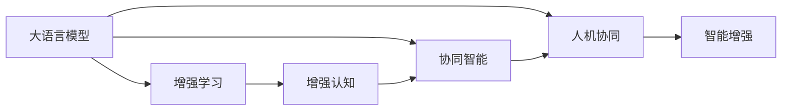

                 

## 1. 背景介绍

### 1.1 问题由来

近年来，人工智能(AI)技术迅猛发展，已经在多个领域取得了显著成果。然而，单纯依赖AI技术，难以在所有场景下实现高效、可靠的智能应用。人类智慧与AI能力的有机结合，已经成为推动技术进步和应用发展的关键。

大语言模型（LLM）等新兴AI技术的出现，使得计算机能够理解、生成、推理自然语言，为人类与计算机的交流提供了新的方式。同时，数据分析、深度学习等技术的不断进步，使得机器能够从海量数据中学习和提取知识，辅助人类进行复杂决策。

在教育、医疗、金融、智能制造等领域，人类智慧与AI技术的结合已经展现出巨大潜力。通过将AI技术嵌入人类工作流程中，可以大幅提升工作效率、降低错误率，从而创造出更多社会价值。

### 1.2 问题核心关键点

增强人类智慧与AI能力的融合发展，是当前AI技术研究与应用的重要趋势。这种融合不仅仅是技术上的结合，还包括伦理、社会、经济等多个层面的协作与互动。

具体而言，可以从以下几个方面理解人类-AI协作的核心关键点：

1. **技术融合**：利用AI技术提高人类认知、决策和执行能力，使人类智慧与AI技术在复杂任务中互相补充。
2. **伦理考量**：确保AI技术在提升人类能力的同时，不会引发伦理问题，如偏见、隐私侵害等。
3. **社会影响**：评估AI技术对就业、教育、社会结构等社会层面的影响，确保技术进步惠及全人类。
4. **经济效益**：通过AI技术与人类智慧的结合，提高生产效率，创造新的经济增长点。

本文将重点探讨如何通过AI技术增强人类智慧，实现人机协同的深度融合，以及这一过程中面临的挑战与机遇。

## 2. 核心概念与联系

### 2.1 核心概念概述

为更好地理解人类-AI协作，本节将介绍几个密切相关的核心概念：

1. **大语言模型（LLM）**：一种基于深度学习技术的自然语言处理（NLP）模型，能够理解并生成人类语言，如图灵奖得主Yann LeCun等人提出的GPT系列模型。
2. **增强学习（RL）**：通过智能体与环境互动，不断学习优化策略，实现复杂决策任务的AI技术，如AlphaGo。
3. **增强认知（Augmented Cognition, AC）**：通过增强现实（AR）、虚拟现实（VR）、脑机接口（BCI）等技术，提升人类感知、认知和决策能力。
4. **协同智能（Collaborative Intelligence）**：多智能体系统在共同目标下的协作，如机器人团队、人机协同医疗等。
5. **人机协同（Human-Computer Collaboration, HCC）**：人机之间协同工作，实现高效、可靠、创新的任务处理。
6. **智能增强（Intelligence Augmentation）**：利用AI技术辅助人类智能，提升工作效率、降低错误率。

这些概念之间相互关联，共同构成人类-AI协作的总体框架。通过理解这些核心概念，我们可以更好地把握人机协同发展的方向。

### 2.2 核心概念原理和架构的 Mermaid 流程图



此流程图展示了核心概念之间的相互关系。大语言模型通过自然语言处理技术，增强认知技术通过增强现实等手段提升人类感知，协同智能通过多智能体系统实现复杂任务处理，人机协同通过系统集成实现高效协作，智能增强通过辅助决策和执行提升人类工作能力。

## 3. 核心算法原理 & 具体操作步骤

### 3.1 算法原理概述

人类-AI协作的算法原理基于两个基本假设：

1. **互补性原则**：AI技术在特定任务上具有优势，能够弥补人类智慧的不足，提高任务执行效率和准确性。
2. **协同性原则**：人类智慧与AI技术在协作过程中实现互补与互信，共同完成任务。

在具体实现上，可以采用以下算法原理：

1. **任务分解**：将复杂任务分解为多个子任务，分别利用AI技术和人类智慧进行处理，最终整合结果。
2. **信息共享**：在任务执行过程中，通过数据共享和通信机制，实现人类与AI系统之间的信息流通和协同。
3. **反馈机制**：建立任务执行结果的反馈机制，使得人类和AI系统能够相互监督和优化，不断提高协作效率。

### 3.2 算法步骤详解

基于上述算法原理，人类-AI协作的操作步骤一般包括以下几个关键步骤：

**Step 1: 任务建模与分解**

- 明确任务目标，定义任务输入输出关系。
- 将任务分解为多个子任务，分别确定适合AI技术处理的部分和人类智慧处理的部分。

**Step 2: AI技术部署**

- 选择合适的AI技术，如大语言模型、增强学习、协同智能等。
- 将AI技术嵌入任务处理流程中，定义接口和交互方式。

**Step 3: 协同机制设计**

- 设计任务执行过程中的信息共享和通信机制。
- 建立任务执行结果的反馈和优化机制。

**Step 4: 协同执行**

- 启动任务执行过程，各子任务并行或串行进行。
- 实时监控任务执行状态，根据反馈进行优化。

**Step 5: 结果整合与评估**

- 整合各子任务的结果，生成最终输出。
- 对任务执行结果进行评估，对比预期结果，进行优化改进。

### 3.3 算法优缺点

人类-AI协作的算法具有以下优点：

1. **高效性**：利用AI技术处理复杂、高强度任务，大幅提升工作效率。
2. **准确性**：通过AI技术的精确计算和模式识别，提高任务执行的准确性。
3. **可扩展性**：AI技术可以根据任务需求进行灵活调整，适应不同复杂度的任务。

同时，该算法也存在一些局限性：

1. **依赖数据**：AI技术的表现很大程度上依赖于训练数据的数量和质量，数据不足可能影响效果。
2. **伦理风险**：AI技术的决策过程可能存在偏见，需要仔细设计和审核。
3. **交互复杂**：人类与AI系统之间的交互设计需要精心设计，确保沟通流畅。
4. **动态调整困难**：任务执行过程中，实时调整AI系统参数具有挑战性。

### 3.4 算法应用领域

人类-AI协作的算法已经在多个领域得到广泛应用，例如：

1. **医疗诊断**：利用AI技术辅助医生进行影像分析、病历评估等，提升诊断准确性和效率。
2. **智能制造**：通过AI技术优化生产流程、设备维护，提高生产效率和质量。
3. **智能交通**：利用AI技术进行交通流量预测、智能导航，提升交通管理水平。
4. **金融分析**：利用AI技术进行数据挖掘、风险评估，提升金融决策的精准度。
5. **教育辅助**：利用AI技术进行个性化学习推荐、智能答疑，提升教育质量。

## 4. 数学模型和公式 & 详细讲解 & 举例说明

### 4.1 数学模型构建

以医疗诊断为例，假设有一个病患的影像数据，包含多个器官的图像，需要判断是否存在肿瘤。可以构建如下数学模型：

- **输入**：$X = (x_1, x_2, ..., x_n)$，其中 $x_i$ 表示第 $i$ 个器官的图像数据。
- **标签**：$Y = (y_1, y_2, ..., y_n)$，其中 $y_i$ 表示第 $i$ 个器官是否存在肿瘤（0或1）。
- **模型**：$M_{\theta}$，其中 $\theta$ 为模型参数，可以是卷积神经网络（CNN）、循环神经网络（RNN）等深度学习模型。

### 4.2 公式推导过程

在给定输入 $X$ 和标签 $Y$ 的情况下，模型的预测结果 $\hat{Y} = M_{\theta}(X)$。为了评估模型性能，可以使用交叉熵损失函数：

$$
L(\theta) = -\frac{1}{N}\sum_{i=1}^N \sum_{j=1}^C y_{ij} \log M_{\theta}(x_i)_j
$$

其中 $C$ 为类别数（2在此例中表示有肿瘤和无肿瘤两种情况），$y_{ij}$ 为标签向量 $Y$ 中第 $i$ 个样本第 $j$ 个类别的标签（0或1）。

### 4.3 案例分析与讲解

以AlphaGo为例，分析其增强学习的原理和步骤：

**Step 1: 任务建模**

- **游戏规则**：围棋的规则和胜利条件。
- **游戏状态**：棋盘状态和玩家的当前行动。

**Step 2: 策略优化**

- **值函数**：评估当前游戏状态的胜率。
- **策略网络**：选择下一步最佳行动。

**Step 3: 训练与测试**

- **训练数据**：历史围棋对局数据。
- **测试数据**：新的围棋对局数据。

**Step 4: 实时决策**

- **游戏环境**：真实的围棋对局环境。
- **智能体**：AlphaGo程序。

**Step 5: 结果评估**

- **胜负统计**：统计AlphaGo的胜负次数。
- **学习曲线**：绘制学习过程中胜率的提升曲线。

## 5. 项目实践：代码实例和详细解释说明

### 5.1 开发环境搭建

在进行人类-AI协作的实践时，需要搭建一个集成了AI技术的开发环境。以下是一些常用工具：

1. **Python**：常用的编程语言，支持多种AI库和框架。
2. **PyTorch**：深度学习框架，支持多种模型和优化算法。
3. **TensorFlow**：另一个流行的深度学习框架，支持分布式训练。
4. **OpenCV**：计算机视觉库，用于图像处理和分析。
5. **ROS**：机器人操作系统，支持多机器人协同。

在搭建开发环境时，需要考虑以下几个方面：

- **版本管理**：使用Python虚拟环境（如virtualenv）管理不同项目的依赖。
- **数据存储**：使用数据库或文件系统存储输入输出数据。
- **计算资源**：使用GPU或TPU加速计算。

### 5.2 源代码详细实现

以医疗影像分类为例，使用PyTorch框架实现一个简单的CNN模型：

```python
import torch
import torch.nn as nn
import torch.optim as optim
from torch.utils.data import DataLoader
from torchvision import datasets, transforms

class CNNModel(nn.Module):
    def __init__(self):
        super(CNNModel, self).__init__()
        self.conv1 = nn.Conv2d(1, 16, kernel_size=3, stride=1, padding=1)
        self.conv2 = nn.Conv2d(16, 32, kernel_size=3, stride=1, padding=1)
        self.fc1 = nn.Linear(32*28*28, 128)
        self.fc2 = nn.Linear(128, 2)  # 肿瘤存在与否

    def forward(self, x):
        x = torch.relu(self.conv1(x))
        x = torch.max_pool2d(x, 2)
        x = torch.relu(self.conv2(x))
        x = torch.max_pool2d(x, 2)
        x = x.view(-1, 32*28*28)
        x = torch.relu(self.fc1(x))
        x = torch.sigmoid(self.fc2(x))
        return x

model = CNNModel()
criterion = nn.BCELoss()
optimizer = optim.Adam(model.parameters(), lr=0.001)

# 数据加载和预处理
train_data = datasets.MNIST('mnist_data/', train=True, download=True, transform=transforms.ToTensor())
test_data = datasets.MNIST('mnist_data/', train=False, download=True, transform=transforms.ToTensor())
train_loader = DataLoader(train_data, batch_size=64, shuffle=True)
test_loader = DataLoader(test_data, batch_size=64, shuffle=False)

# 训练过程
for epoch in range(10):
    model.train()
    for images, labels in train_loader:
        outputs = model(images)
        loss = criterion(outputs, labels)
        optimizer.zero_grad()
        loss.backward()
        optimizer.step()

    model.eval()
    correct = 0
    total = 0
    with torch.no_grad():
        for images, labels in test_loader:
            outputs = model(images)
            _, predicted = torch.max(outputs.data, 1)
            total += labels.size(0)
            correct += (predicted == labels).sum().item()

    print('Epoch [{}/{}], Loss: {:.4f}, Accuracy: {:.2f}%'.format(epoch+1, 10, loss.item(), 100 * correct / total))
```

### 5.3 代码解读与分析

此代码实现了简单的卷积神经网络（CNN）模型，用于对MNIST手写数字数据集进行分类。模型输入为28x28的灰度图像，输出为肿瘤存在与否的预测结果。训练过程中使用Adam优化算法，损失函数为二元交叉熵。

训练过程包括数据加载、模型前向传播、损失计算、梯度更新等步骤。在每次迭代中，模型对训练集进行一次前向传播和反向传播，更新参数。在测试集上计算准确率，并输出当前epoch的损失和准确率。

## 6. 实际应用场景

### 6.1 智能医疗

在医疗领域，AI技术可以辅助医生进行疾病诊断、治疗方案推荐等。例如，利用深度学习模型对医学影像进行分类，辅助放射科医生进行癌症筛查。结合增强现实技术，医生可以通过AR眼镜查看患者的影像数据，实时评估和修改治疗方案。

### 6.2 智能制造

在智能制造领域，AI技术可以优化生产流程、预测设备故障、优化供应链等。通过机器学习模型对生产数据进行分析，识别出潜在问题，并实时调整生产参数。结合人机协同技术，工人可以通过智能设备进行快速操作和决策，提高生产效率。

### 6.3 智能交通

在智能交通领域，AI技术可以实现交通流量预测、智能导航等。通过实时数据分析，AI系统可以预测交通流量，优化交通信号灯设置，减少拥堵。结合增强学习技术，AI系统可以动态调整路线和车速，提高交通效率。

### 6.4 未来应用展望

未来，人类-AI协作将更加广泛地应用到各个领域，带来更深远的影响：

1. **智慧城市**：通过AI技术优化城市管理，提升公共安全、环境治理、能源管理等方面的效率和智能化水平。
2. **教育**：利用AI技术进行个性化学习推荐、智能答疑，提升教育质量和公平性。
3. **金融**：通过AI技术进行风险评估、智能投顾，提升金融决策的精准度和效率。
4. **环境保护**：利用AI技术进行环境监测、数据分析，提升环境保护和资源管理水平。
5. **文化创意**：利用AI技术进行内容创作、版权保护，提升文化创意产业的创新力和竞争力。

## 7. 工具和资源推荐

### 7.1 学习资源推荐

1. **《深度学习》by Ian Goodfellow**：深度学习领域的经典教材，涵盖深度学习的基本原理和应用。
2. **《强化学习》by Richard S. Sutton, Andrew G. Barto**：强化学习领域的经典教材，介绍强化学习的理论基础和算法实现。
3. **Coursera的《机器学习》课程**：由斯坦福大学的Andrew Ng教授主讲，涵盖机器学习的基本概念和算法。
4. **DeepLearning.AI的《AI for Everyone》课程**：浅显易懂地介绍AI的基本概念和应用，适合非技术背景的观众。
5. **arXiv.org**：免费的学术论文库，涵盖最新的AI研究成果，是学习前沿技术的良好资源。

### 7.2 开发工具推荐

1. **Jupyter Notebook**：交互式的编程环境，适合进行数据处理和模型训练。
2. **TensorBoard**：可视化工具，可以实时监控模型训练和推理过程，辅助调试和优化。
3. **ROS**：机器人操作系统，支持多机器人协同。
4. **Unity3D**：游戏引擎，支持AR、VR技术开发。
5. **OpenCV**：计算机视觉库，支持图像处理和分析。

### 7.3 相关论文推荐

1. **《AlphaGo》by David Silver et al.**：介绍AlphaGo的设计和训练过程，具有重要的历史意义。
2. **《Deep Residual Learning for Image Recognition》by Kaiming He et al.**：介绍深度残差网络（ResNet）的设计，提升图像分类精度。
3. **《Attention Is All You Need》by Ashish Vaswani et al.**：介绍Transformer架构，推动NLP领域的预训练大模型发展。
4. **《GANs Trained by a Two Time-Scale Update Rule Converge to the Fixed Points of Their Limiting Mode》by Ian Goodfellow et al.**：介绍生成对抗网络（GAN）的基本原理和训练过程。

## 8. 总结：未来发展趋势与挑战

### 8.1 研究成果总结

人类-AI协作技术在多个领域取得了显著进展，通过AI技术增强人类智慧，提升了任务的执行效率和准确性。未来，随着技术的不断进步，人机协同的深度融合将成为主流趋势。

### 8.2 未来发展趋势

未来，人类-AI协作将呈现以下发展趋势：

1. **智能化提升**：AI技术在各领域的智能化应用将不断深入，提升工作效率和决策质量。
2. **协同化增强**：人机协同系统将更加智能和高效，实现更复杂、更复杂的任务处理。
3. **融合化创新**：不同AI技术之间的融合将带来更多创新应用，如多模态信息处理、人机交互等。
4. **标准化普及**：AI技术将逐渐标准化，成为各行各业的通用工具。
5. **伦理化考量**：随着AI技术的普及，伦理问题将成为重要课题，确保技术发展惠及全人类。

### 8.3 面临的挑战

尽管人类-AI协作技术取得了显著进展，但在实际应用中仍面临诸多挑战：

1. **数据隐私**：AI技术的应用需要大量数据，如何保护数据隐私和安全是一个重要问题。
2. **伦理与偏见**：AI技术的决策过程可能存在偏见，需要仔细设计和审核，确保公平性。
3. **人机协作**：人机交互设计复杂，如何实现流畅、高效的用户体验需要精心设计。
4. **动态调整**：AI系统在实际应用中需要实时调整，但动态调整具有一定的挑战性。
5. **伦理监管**：AI技术的广泛应用需要建立健全的伦理监管机制，确保技术进步惠及全人类。

### 8.4 研究展望

未来的研究需要在以下几个方面进行突破：

1. **数据隐私保护**：开发更加安全、高效的数据处理和存储技术，确保数据隐私和安全。
2. **公平性与透明性**：设计和优化AI系统，减少偏见，增强决策过程的透明性和可解释性。
3. **动态调整能力**：提升AI系统的动态调整能力，实现实时优化和优化。
4. **人机协作设计**：研究和设计更加高效、友好的用户界面和交互方式，提升人机协作效率。
5. **多模态融合**：开发多模态数据融合技术，提升AI系统的综合处理能力。

总之，人类-AI协作技术将在未来继续蓬勃发展，为社会带来深远影响。通过不断优化技术，解决面临的挑战，确保技术进步惠及全人类，人类-AI协作必将迎来更加广阔的应用前景。

## 9. 附录：常见问题与解答

### Q1: 什么是人类-AI协作？

**A:** 人类-AI协作是指通过人工智能技术增强人类智慧和能力，实现人机协同工作的技术手段。利用AI技术处理复杂、高强度任务，提升工作效率和决策质量，同时利用人类智慧监督和优化AI系统，确保任务执行的准确性和可靠性。

### Q2: 人类-AI协作的应用领域有哪些？

**A:** 人类-AI协作在医疗、智能制造、智能交通、智慧城市、教育、金融、环境保护和文化创意等多个领域得到了广泛应用。通过AI技术辅助人类进行任务处理，提升工作效率和决策质量，实现人机协同工作。

### Q3: 人类-AI协作面临哪些挑战？

**A:** 人类-AI协作面临数据隐私、伦理与偏见、人机协作设计、动态调整能力和多模态融合等多个挑战。需要通过技术创新和伦理监管，解决这些问题，确保技术进步惠及全人类。

### Q4: 未来人类-AI协作的发展趋势是什么？

**A:** 未来，人类-AI协作将更加广泛地应用到各个领域，带来更深远的影响。智能化提升、协同化增强、融合化创新、标准化普及和伦理化考量将成为主要发展趋势。

总之，人类-AI协作技术将在未来继续蓬勃发展，为社会带来深远影响。通过不断优化技术，解决面临的挑战，确保技术进步惠及全人类，人类-AI协作必将在更多领域得到应用，为人类社会带来变革性影响。

---

作者：禅与计算机程序设计艺术 / Zen and the Art of Computer Programming

