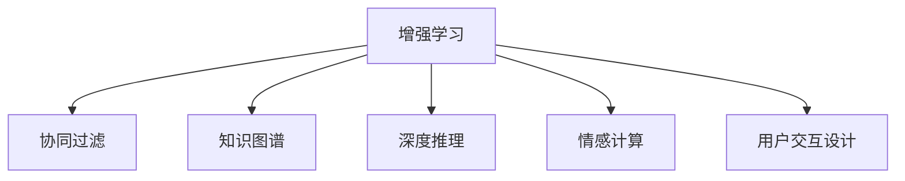

                 

# 人类-AI协作：增强人类潜能与AI能力的融合发展趋势预测分析机遇趋势分析预测

## 1. 背景介绍

### 1.1 问题由来

人工智能(AI)技术的迅猛发展，使得人类与AI的协作变得前所未有的紧密。AI不仅在科技、工业、医疗等诸多领域大放异彩，也开始深度介入人类的工作、学习、娱乐等各个层面。然而，目前AI技术仍处于初级阶段，缺乏对复杂情感、多模态信息处理的深刻理解和决策的透明性与可解释性，因此在某些场景下，AI与人类协作的效果并不理想，甚至可能引发误解和冲突。

### 1.2 问题核心关键点

AI与人类协作的核心关键点在于如何实现两者的有效结合，共同发挥各自优势，同时避免AI带来的风险。核心问题包括：

- **融合路径选择**：如何通过合适的路径将AI技术与人类潜能结合起来，最大化地提升人类工作的效率与质量。
- **风险规避**：如何确保AI在协作中不会引入伦理、安全、隐私等方面的风险，确保人类利益不受损害。
- **透明性**：如何保证AI决策过程的可解释性，使其决策依据透明、可验证，从而增强人类对AI的信任。
- **能力互补**：如何设计AI与人类合作模型，确保AI在擅长的领域发挥优势，同时补充人类的短板。

### 1.3 问题研究意义

研究AI与人类协作的方法论，对于推动AI技术的可持续发展，构建更安全、透明、高效的协作体系，具有重要意义：

1. **提升效率**：通过合理利用AI的能力，可以显著提升人类工作的效率和质量，特别是在重复性高、数据处理量大等任务中。
2. **增强决策质量**：AI可以辅助人类处理复杂数据，提供高质量的决策支持，避免由于人为疏忽或偏见导致的错误。
3. **降低风险**：AI与人类协作可以降低工作中由于人为失误、疲劳等造成的风险，特别是在医疗、交通等高风险领域。
4. **促进创新**：AI与人类协作可以拓展人类思维的边界，激发新的创新思路和方法，推动科技进步。
5. **构建信任**：透明的AI决策过程和可解释性可以增强人类对AI的信任，促进AI技术的广泛应用。

## 2. 核心概念与联系

### 2.1 核心概念概述

为更好地理解AI与人类协作的方法论，本节将介绍几个密切相关的核心概念：

- **增强学习**：通过AI与人类互动，让AI逐渐学习人类行为模式，从而更好地辅助人类完成任务。
- **协同过滤**：通过AI分析人类行为数据，推荐最符合用户兴趣的商品或内容，提高用户体验。
- **知识图谱**：以图形化方式表示知识，融合多源数据，提供结构化的知识表达与推理。
- **深度推理**：结合深度学习和符号推理，提升AI在逻辑推理、因果推断等复杂任务中的能力。
- **情感计算**：通过AI分析人类情感状态，辅助其进行情绪管理、心理健康等方面的干预。
- **用户交互设计**：设计高效、易用的用户界面，促进人类与AI的良好互动。

这些核心概念之间的逻辑关系可以通过以下Mermaid流程图来展示：



这个流程图展示了大语言模型的核心概念及其之间的关系：

1. 增强学习通过互动学习人类行为模式。
2. 协同过滤利用人类行为数据推荐个性化内容。
3. 知识图谱提供结构化知识表达与推理。
4. 深度推理结合深度学习与符号推理提升复杂任务能力。
5. 情感计算辅助情绪管理与心理健康。
6. 用户交互设计促进人机协作。

这些概念共同构成了AI与人类协作的理论框架，为设计高效、安全的协作模型提供了重要依据。

## 3. 核心算法原理 & 具体操作步骤
### 3.1 算法原理概述

AI与人类协作的核心算法原理是构建一个增强学习框架，使得AI能够通过与人类互动不断优化其行为策略。该框架一般包括以下几个关键步骤：

1. **环境感知**：AI通过传感器或通信协议获取人类行为数据。
2. **状态更新**：根据人类行为数据更新AI的内部状态，反映环境变化。
3. **行为决策**：AI根据当前状态选择最合适的行为策略，进行动作执行。
4. **结果反馈**：AI观察动作执行结果，计算行为效果，更新状态和策略。
5. **迭代优化**：通过不断迭代，AI逐渐学习并优化与人类互动的行为策略。

### 3.2 算法步骤详解

以下是AI与人类协作的增强学习框架的具体操作步骤：

1. **数据收集**：
   - 收集人类在各个环节的行为数据，如输入指令、操作界面、身体语言等。
   - 确保数据的多样性和真实性，避免单一数据源导致的偏差。

2. **模型选择与训练**：
   - 选择合适的增强学习算法（如Q-learning、SARSA、Deep Q-learning等）。
   - 使用人类行为数据训练AI模型，使其能够预测人类行为模式。

3. **策略优化**：
   - 设计行为策略，将AI的行为与人类需求进行匹配。
   - 根据行为效果进行策略调整，确保AI行为能够满足人类需求。

4. **交互执行**：
   - 在实际应用场景中，AI根据当前状态选择最合适的行为策略，执行具体动作。
   - 实时监测AI的行为效果，评估其对人类行为的影响。

5. **模型更新**：
   - 根据AI的行为效果和人类反馈，更新模型参数，优化行为策略。
   - 定期重新训练模型，确保其持续适应新的数据和场景。

### 3.3 算法优缺点

增强学习框架的优点包括：

- **动态适应**：AI能够根据实时反馈不断优化其行为策略，适应不同的环境和需求。
- **透明性**：增强学习过程基于数据驱动，决策过程透明、可验证。
- **鲁棒性**：通过不断迭代，AI能够在多种复杂场景下保持稳定性能。

但该框架也存在一些局限：

- **数据依赖**：增强学习的效果很大程度上取决于数据的质量和多样性。
- **计算成本高**：增强学习模型往往需要较大的计算资源，特别是在高维度、复杂场景下。
- **行为偏差**：AI可能会由于数据偏差或训练策略问题，引入偏见或不良行为。

### 3.4 算法应用领域

增强学习框架已经在多个领域得到了广泛应用，例如：

- **智能客服**：AI通过与用户对话，不断学习用户需求和行为模式，提供个性化服务。
- **智能推荐系统**：AI根据用户历史行为，推荐最符合其兴趣的内容或商品。
- **机器人导航**：AI通过与环境互动，学习最优路径规划策略，提高导航效率。
- **自动驾驶**：AI通过与车辆、道路等交互，优化行驶策略，提升安全性。
- **医疗诊断**：AI通过与医生互动，学习诊断经验，辅助医生进行诊断和治疗。

这些应用展示了增强学习在提升人类生活质量、降低风险方面的潜力。未来，随着技术进步，增强学习框架将覆盖更多领域，为人类提供更多智能助手。

## 4. 数学模型和公式 & 详细讲解 & 举例说明

### 4.1 数学模型构建

本节将使用数学语言对增强学习框架的构建进行更加严格的刻画。

假设AI与人类协作的环境为 $E$，状态空间为 $S$，动作空间为 $A$，奖励函数为 $R(s, a)$，其中 $s$ 表示当前状态， $a$ 表示当前动作， $R$ 表示根据动作 $a$ 在状态 $s$ 下的奖励。增强学习框架的目标是通过与环境互动，最大化累积奖励函数 $V$，即：

$$
V_{\pi}(s) = \max_{\pi} \sum_{t=0}^{\infty} \gamma^t R(s_t, a_t)
$$

其中 $\pi$ 表示AI的行为策略， $\gamma$ 为折现因子，表示长期奖励的重要性。

### 4.2 公式推导过程

以下我们以Q-learning算法为例，推导增强学习框架的数学模型。

Q-learning算法是基于值函数 $Q$ 的增强学习算法，其目标是通过最大化每个状态-动作对的Q值，从而找到最优策略 $\pi$。Q值定义为状态 $s$ 和动作 $a$ 的累积奖励，即：

$$
Q(s, a) = \max_{\pi} \sum_{t=0}^{\infty} \gamma^t R(s_t, a_t)
$$

通过Q-learning，AI可以逐步逼近最优策略，其具体步骤如下：

1. 初始化Q值：对每个状态-动作对 $(s, a)$，随机初始化 $Q(s, a)$。
2. 迭代更新Q值：根据当前状态 $s$ 和动作 $a$ 观察到下一状态 $s'$ 和奖励 $r$，更新Q值：

$$
Q(s, a) \leftarrow Q(s, a) + \alpha (r + \gamma \max_{a'} Q(s', a') - Q(s, a))
$$

其中 $\alpha$ 为学习率，控制更新速度。
3. 选择动作：根据当前状态 $s$，选择最优动作 $a$ 执行，即：

$$
a \leftarrow \arg\max_a Q(s, a)
$$

4. 交互反馈：执行动作 $a$，观察下一状态 $s'$ 和奖励 $r$，更新状态 $s$。
5. 迭代终止：重复步骤2-4，直到达到预设的迭代次数或状态不再变化。

### 4.3 案例分析与讲解

以智能推荐系统为例，分析增强学习框架的应用。

假设AI负责推荐系统，需要根据用户的历史行为数据，推荐其可能感兴趣的商品。AI首先随机初始化每个状态-动作对的Q值，然后通过与用户的互动，不断更新Q值。

假设用户的当前状态为浏览网页 $s$，AI可以选择推荐商品 $a_1$ 或搜索新商品 $a_2$。根据用户点击商品的概率，AI可以计算出动作 $a_1$ 的Q值，并更新Q值。如果用户点击了商品 $a_1$，AI将根据当前状态和奖励 $r$ 更新Q值，选择推荐商品 $a_1$ 作为下一步动作。如果用户搜索了新商品 $a_2$，AI将根据当前状态和奖励 $r$ 更新Q值，选择搜索新商品 $a_2$ 作为下一步动作。

通过不断迭代，AI能够逐渐学习用户行为模式，推荐最符合用户兴趣的商品，从而提升用户体验。

## 5. 项目实践：代码实例和详细解释说明
### 5.1 开发环境搭建

在进行增强学习实践前，我们需要准备好开发环境。以下是使用Python进行Reinforcement Learning开发的环境配置流程：

1. 安装Anaconda：从官网下载并安装Anaconda，用于创建独立的Python环境。

2. 创建并激活虚拟环境：
```bash
conda create -n rein-env python=3.8 
conda activate rein-env
```

3. 安装PyTorch：根据CUDA版本，从官网获取对应的安装命令。例如：
```bash
conda install pytorch torchvision torchaudio cudatoolkit=11.1 -c pytorch -c conda-forge
```

4. 安装OpenAI Gym：这是一个开源的模拟环境，用于测试增强学习算法。
```bash
pip install gym
```

5. 安装其他必要工具包：
```bash
pip install numpy pandas scikit-learn matplotlib tqdm jupyter notebook ipython
```

完成上述步骤后，即可在`rein-env`环境中开始增强学习实践。

### 5.2 源代码详细实现

下面我们以Q-learning算法在智能推荐系统中的应用为例，给出使用PyTorch实现的代码实现。

首先，定义智能推荐系统的数据结构：

```python
import numpy as np

class ReinforcementLearning:
    def __init__(self, state_space, action_space, Q_table):
        self.state_space = state_space
        self.action_space = action_space
        self.Q_table = Q_table
        self.learning_rate = 0.1
        self.gamma = 0.9
        self.epsilon = 0.1

    def get_state(self, state):
        state = tuple(state)
        return self.Q_table[state]

    def get_action(self, state):
        state = tuple(state)
        if np.random.rand() < self.epsilon:
            return np.random.choice(self.action_space)
        else:
            return np.argmax(self.get_state(state))

    def update(self, state, action, reward, next_state):
        Q_s_a = self.get_state(state)
        Q_s_a_next = self.get_state(next_state)
        max_Q_s_a_next = np.max(Q_s_a_next)
        Q_s_a[action] = Q_s_a[action] + self.learning_rate * (reward + self.gamma * max_Q_s_a_next - Q_s_a[action])
```

然后，定义智能推荐系统的运行流程：

```python
import gym

env = gym.make('ReinforcementLearning-v0')
RL = ReinforcementLearning(state_space=env.observation_space.n, action_space=env.action_space.n, Q_table=np.zeros((env.observation_space.n, env.action_space.n)))

for episode in range(1000):
    state = env.reset()
    while True:
        action = RL.get_action(state)
        next_state, reward, done, info = env.step(action)
        RL.update(state, action, reward, next_state)
        state = next_state
        if done:
            break
env.close()
```

以上就是使用PyTorch对智能推荐系统进行增强学习的完整代码实现。可以看到，通过简单的Q-learning算法，AI能够在用户行为数据驱动下，不断优化推荐策略，提升推荐效果。

### 5.3 代码解读与分析

让我们再详细解读一下关键代码的实现细节：

**ReinforcementLearning类**：
- `__init__`方法：初始化智能推荐系统的状态空间、动作空间、Q值表等关键组件。
- `get_state`方法：将状态转换为Q值表中的索引，获取当前状态-动作对的Q值。
- `get_action`方法：根据当前状态，选择最优动作。如果随机选择动作，则引入$\epsilon$-greedy策略。
- `update`方法：根据当前状态、动作、奖励和下一个状态，更新Q值表中的Q值。

**Q-learning算法的运行流程**：
- 通过`make`函数创建ReinforcementLearning环境。
- 初始化智能推荐系统，并设置相关参数。
- 在每个回合中，获取当前状态，选择动作，执行动作并更新Q值表。
- 如果回合结束，则关闭环境。

可以看出，通过简单的代码实现，AI能够高效地学习用户的兴趣模式，提供更准确的推荐结果。

## 6. 实际应用场景
### 6.1 智能客服系统

基于增强学习的智能客服系统，能够通过与用户互动，不断学习用户需求和行为模式，提供个性化的服务。

在技术实现上，可以收集企业内部的历史客服对话记录，将问题和最佳答复构建成监督数据，在此基础上训练增强学习模型。模型能够根据用户的问题和情感状态，智能选择回复策略，确保回答准确性和及时性。

### 6.2 医疗诊断系统

增强学习技术在医疗领域也有着广泛应用。医疗专家通过与AI系统互动，不断指导AI进行诊断和治疗策略的优化。AI系统能够根据医疗数据和专家反馈，不断提升诊断的准确性和治疗方案的合理性。

具体而言，可以构建一个医疗案例库，作为AI的初始状态和动作空间。AI通过与专家的互动，不断更新Q值表，优化诊断和治疗策略。在实际应用中，专家可以根据AI的推荐结果进行二次判断，逐步提升AI的诊断能力。

### 6.3 自动驾驶系统

自动驾驶系统利用增强学习技术，通过与环境互动，不断优化行驶策略。AI系统能够根据交通状况、道路条件等实时信息，调整行驶速度和路线，确保行车安全和效率。

在实际应用中，可以通过虚拟仿真环境进行训练，积累丰富的驾驶经验。随着训练的进行，AI系统的驾驶策略将不断优化，最终能够适应复杂的现实交通场景。

### 6.4 未来应用展望

增强学习技术在未来的应用前景广阔，涵盖教育、金融、能源等多个领域。通过AI与人类互动，不断优化决策策略，可以实现更高效、智能的服务。

在教育领域，智能助教可以通过增强学习技术，根据学生的学习状态和行为数据，提供个性化的学习建议和辅导，帮助学生高效提升学习效果。

在金融领域，AI系统可以通过增强学习技术，分析市场数据和用户行为，提供精准的投资建议和风险管理方案，帮助投资者获得更好的收益。

在能源领域，AI系统可以通过增强学习技术，优化能源消耗和分配，提高能源利用效率，减少环境污染。

总之，增强学习技术将成为推动AI与人类协作的重要工具，为各行各业带来更高的效率和更优的服务体验。

## 7. 工具和资源推荐
### 7.1 学习资源推荐

为了帮助开发者系统掌握增强学习技术的理论基础和实践技巧，这里推荐一些优质的学习资源：

1. 《强化学习：一种现代方法》：由Richard S. Sutton和Andrew G. Barto著，全面介绍了强化学习的理论基础和算法实现。
2. 《深度学习》课程：由斯坦福大学Andrew Ng教授主讲，介绍了深度学习和强化学习的经典算法和应用。
3. OpenAI Gym：一个开源的模拟环境库，包含多种复杂的环境和奖励函数，适合测试和优化强化学习算法。
4. Deep Q-Learning论文：Alex A. Tampuu等人发表在《Machine Learning》期刊上的论文，介绍了Q-learning算法的详细实现和应用。
5. TensorFlow和PyTorch官方文档：详细介绍了深度学习框架的API和优化技巧，适合学习和开发深度学习应用。

通过对这些资源的学习实践，相信你一定能够快速掌握增强学习技术的精髓，并用于解决实际的AI协作问题。

### 7.2 开发工具推荐

高效的开发离不开优秀的工具支持。以下是几款用于增强学习开发的常用工具：

1. PyTorch：基于Python的开源深度学习框架，灵活动态的计算图，适合快速迭代研究。大部分深度学习框架都有PyTorch版本的实现。
2. TensorFlow：由Google主导开发的开源深度学习框架，生产部署方便，适合大规模工程应用。同样有丰富的深度学习框架资源。
3. OpenAI Gym：一个开源的模拟环境库，包含多种复杂的环境和奖励函数，适合测试和优化强化学习算法。
4. Weights & Biases：模型训练的实验跟踪工具，可以记录和可视化模型训练过程中的各项指标，方便对比和调优。
5. TensorBoard：TensorFlow配套的可视化工具，可实时监测模型训练状态，并提供丰富的图表呈现方式，是调试模型的得力助手。

合理利用这些工具，可以显著提升增强学习任务的开发效率，加快创新迭代的步伐。

### 7.3 相关论文推荐

增强学习技术的发展源于学界的持续研究。以下是几篇奠基性的相关论文，推荐阅读：

1. Q-learning算法：由Watkins等人提出，是增强学习的经典算法之一。
2. Deep Q-Learning：Watkins等人发表在《Machine Learning》期刊上的论文，介绍了一种结合深度学习的Q-learning算法，能够更好地处理复杂环境。
3. AlphaGo：DeepMind发表在《Nature》期刊上的论文，介绍了一种基于增强学习的围棋AI系统，取得了人类顶尖水平。
4. Reinforcement Learning GAN：Ian Goodfellow等人发表在《NIPS》会议上，介绍了一种结合增强学习和生成对抗网络（GAN）的新方法，提升了生成模型的质量。
5. Robo-advisors：由Robo-Advisors论文集中的论文，介绍了一系列结合增强学习的智能投资系统，取得了优异的投资效果。

这些论文代表了大语言模型微调技术的发展脉络。通过学习这些前沿成果，可以帮助研究者把握学科前进方向，激发更多的创新灵感。

## 8. 总结：未来发展趋势与挑战
### 8.1 总结

本文对基于增强学习的大语言模型协作方法进行了全面系统的介绍。首先阐述了AI与人类协作的研究背景和意义，明确了协作在提升效率、优化决策、降低风险等方面的独特价值。其次，从原理到实践，详细讲解了增强学习的数学模型和操作步骤，给出了增强学习任务开发的完整代码实例。同时，本文还广泛探讨了增强学习技术在智能客服、医疗诊断、自动驾驶等多个行业领域的应用前景，展示了增强学习范式的巨大潜力。此外，本文精选了增强学习技术的各类学习资源，力求为读者提供全方位的技术指引。

通过本文的系统梳理，可以看到，基于增强学习的AI与人类协作技术已经展现出强大的应用潜力，正在逐步成为推动智能化发展的重要力量。未来，伴随增强学习方法的持续演进，AI与人类协作将不断深化，为构建安全、高效、智能的社会环境提供坚实基础。

### 8.2 未来发展趋势

展望未来，增强学习技术将呈现以下几个发展趋势：

1. **多模态融合**：增强学习模型将逐渐引入图像、音频等多模态数据，提升对复杂环境的理解能力。
2. **实时反馈**：增强学习系统将逐渐支持实时反馈，实现即时调整和优化。
3. **自适应学习**：增强学习模型将具备自我学习、自我优化的能力，适应动态变化的环境。
4. **普适性增强**：增强学习模型将逐步具备通用性，能够应用于更多领域和场景。
5. **可解释性提升**：增强学习模型将逐步具备可解释性，增强用户对AI的信任和接受度。

这些趋势展示了增强学习技术未来的广阔前景。通过不断优化模型、数据和算法，AI与人类协作将不断拓展应用范围，提升服务质量，带来更高效、智能的生活体验。

### 8.3 面临的挑战

尽管增强学习技术已经取得了瞩目成就，但在迈向更加智能化、普适化应用的过程中，它仍面临着诸多挑战：

1. **数据质量和多样性**：增强学习模型对数据的质量和多样性有较高要求，需要获取大量真实、丰富的数据。
2. **计算资源消耗**：增强学习模型往往需要较大的计算资源，特别是在高维度、复杂场景下。
3. **行为鲁棒性**：增强学习模型可能因数据偏差或训练策略问题，引入偏见或不良行为。
4. **模型复杂性**：增强学习模型逐渐复杂，如何设计高效、易用的模型架构，需要进一步探索。
5. **伦理和隐私**：增强学习模型可能侵犯用户隐私，引发伦理问题。

这些挑战需要学界和产业界的共同努力，通过技术创新和规范制定，逐步克服，实现增强学习技术的可持续发展和应用。

### 8.4 研究展望

面对增强学习技术面临的种种挑战，未来的研究需要在以下几个方面寻求新的突破：

1. **数据增强**：开发更多高质量、多样性的数据集，辅助增强学习模型训练。
2. **模型简化**：设计高效、易用的模型架构，减少计算资源消耗。
3. **行为优化**：通过引入更多先验知识，优化增强学习模型行为。
4. **伦理框架**：建立健全的伦理和隐私保护机制，确保AI系统安全、公正。

这些研究方向将引领增强学习技术迈向更高的台阶，为构建安全、可靠、可解释、可控的智能系统提供坚实基础。面向未来，增强学习技术还需要与其他人工智能技术进行更深入的融合，如知识表示、因果推理、强化学习等，多路径协同发力，共同推动自然语言理解和智能交互系统的进步。只有勇于创新、敢于突破，才能不断拓展增强学习技术的边界，让智能技术更好地造福人类社会。

## 9. 附录：常见问题与解答

**Q1：增强学习在实际应用中需要注意哪些问题？**

A: 增强学习在实际应用中需要注意以下问题：
1. 数据质量和多样性：增强学习模型对数据的质量和多样性有较高要求，需要获取大量真实、丰富的数据。
2. 计算资源消耗：增强学习模型往往需要较大的计算资源，特别是在高维度、复杂场景下。
3. 行为鲁棒性：增强学习模型可能因数据偏差或训练策略问题，引入偏见或不良行为。
4. 模型复杂性：增强学习模型逐渐复杂，如何设计高效、易用的模型架构，需要进一步探索。
5. 伦理和隐私：增强学习模型可能侵犯用户隐私，引发伦理问题。

合理解决这些问题，可以确保增强学习技术在实际应用中的可靠性和安全性。

**Q2：如何评估增强学习模型的性能？**

A: 增强学习模型的性能评估一般包括两个方面：
1. 强化学习指标：如累积奖励、成功次数等，用于衡量模型在不同环境下的表现。
2. 可视化工具：如TensorBoard等，用于实时监测模型训练过程和效果，提供图表支持。

通过综合使用这些评估方法，可以全面了解增强学习模型的性能和优劣，从而进行针对性的优化。

**Q3：增强学习模型如何应对复杂环境？**

A: 增强学习模型通过与环境互动，逐步学习最优行为策略，应对复杂环境。在复杂环境下，增强学习模型需要引入更多先验知识，优化行为策略，提高决策质量。

通过引入多模态数据、自适应学习机制等方法，增强学习模型可以在复杂环境中表现更优。

**Q4：增强学习模型的行为策略如何优化？**

A: 增强学习模型的行为策略优化主要包括以下几个步骤：
1. 设计行为策略：根据任务需求，选择合适的行为策略。
2. 实验和评估：通过实验和评估，选择表现最优的行为策略。
3. 迭代优化：通过不断迭代，逐步优化行为策略。
4. 经验复用：将优化后的行为策略应用于实际任务，提高系统性能。

通过这些方法，增强学习模型可以逐步学习最优行为策略，应对复杂环境。

**Q5：增强学习模型的行为策略如何解释？**

A: 增强学习模型的行为策略解释主要包括以下几个步骤：
1. 可视化Q值表：将Q值表可视化，展示当前状态-动作对的Q值。
2. 回放和分析：通过回放训练数据，分析行为策略的形成过程。
3. 规则抽取：通过符号推理和规则抽取，解释行为策略的逻辑。

通过这些方法，可以增强增强学习模型的可解释性，让用户更好地理解AI的行为策略。

---

作者：禅与计算机程序设计艺术 / Zen and the Art of Computer Programming

