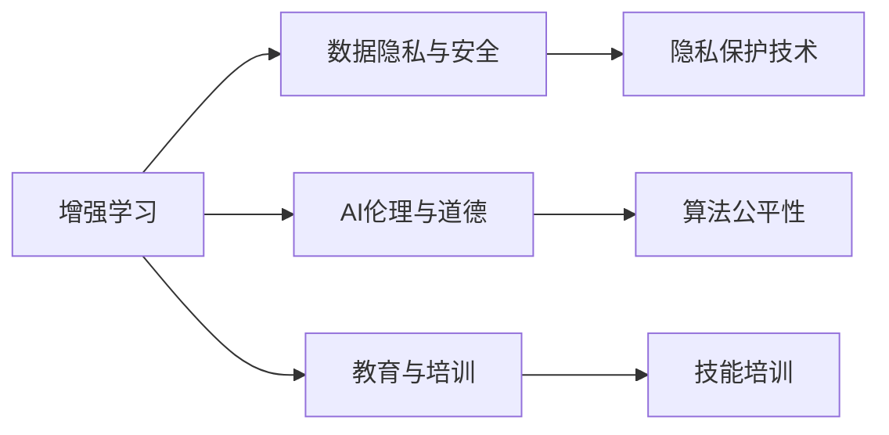

                 

## 1. 背景介绍

### 1.1 问题由来

在当今这个复杂多变的数字化时代，人工智能(AI)技术正以惊人的速度改变着各行各业的面貌。从制造业的自动化生产线，到医疗领域的智能诊断，再到客服行业的智能对话系统，AI的应用无所不在。然而，尽管AI在提升效率、降低成本、增强决策等方面表现出色，但它也引发了一些新的挑战，尤其是对于人类社会的韧性（Resilience）的考验。

AI技术的迅猛发展，一方面带来了诸多便利，提高了工作效率和生活质量；另一方面，也在一定程度上削弱了人类某些固有的能力，如判断力、同理心等。如何在充分利用AI技术的同时，增强人类自身的韧性，使其在未来的数字化时代中持续发展和适应，成为了一个亟待解决的问题。

### 1.2 问题核心关键点

增强人类韧性，涉及几个核心关键点：
1. **AI与人类协作**：如何通过AI技术，增强人类的决策能力、学习能力和适应能力，从而更好地应对复杂多变的环境。
2. **数据隐私与安全**：如何在充分利用数据资源的同时，保障个人隐私和数据安全，避免AI技术带来的潜在风险。
3. **伦理与道德**：如何确保AI技术的开发与应用符合伦理和道德标准，避免造成社会不公和伦理冲突。
4. **教育与培训**：如何通过教育和培训，提升人类对AI技术的理解和应用能力，使其成为AI技术的积极推动者。

## 2. 核心概念与联系

### 2.1 核心概念概述

增强人类韧性，本质上是利用AI技术与人类协作，提升人类的决策、学习、适应能力，增强其面对复杂环境和未知挑战的能力。这涉及多个核心概念：

1. **增强学习（Reinforcement Learning, RL）**：一种通过试错、奖励和惩罚机制，使AI和人类共同提升能力的训练方法。
2. **数据隐私与安全**：在AI技术应用中，如何保护个人隐私，避免数据泄露和滥用。
3. **AI伦理与道德**：AI技术的开发与应用应遵循的伦理原则，避免算法偏见、歧视等伦理问题。
4. **教育与培训**：通过教育与培训，提升人类对AI技术的理解和应用能力，培养AI技术的积极推动者。

这些核心概念之间相互联系，共同构成了一个完整的增强人类韧性的框架。通过理解这些概念，我们可以更好地把握人类-AI协作的方向和策略。

### 2.2 核心概念原理和架构的 Mermaid 流程图(Mermaid 流程节点中不要有括号、逗号等特殊字符)



这个流程图展示了增强人类韧性的核心概念及其相互关系：

1. **增强学习**：通过试错和反馈机制，使AI和人类共同提升能力。
2. **数据隐私与安全**：保护个人隐私，防止数据泄露和滥用。
3. **AI伦理与道德**：确保AI技术的开发与应用遵循伦理原则。
4. **教育与培训**：提升人类对AI技术的理解和应用能力。

## 3. 核心算法原理 & 具体操作步骤

### 3.1 算法原理概述

增强人类韧性，主要通过增强学习和数据隐私保护等算法实现。具体步骤如下：

1. **增强学习**：设计合理的奖励机制和反馈机制，使AI和人类通过互动和学习，共同提升决策和适应能力。
2. **数据隐私保护**：利用差分隐私、联邦学习等技术，保护个人隐私，确保数据安全。
3. **AI伦理与道德**：引入伦理导向的评估指标，确保AI技术符合伦理和道德标准。

### 3.2 算法步骤详解

**Step 1: 设计增强学习算法**

增强学习算法包括以下几个关键步骤：

1. **环境设计**：定义增强学习环境，包括状态、动作、奖励函数等。
2. **模型选择**：选择合适的模型，如Q-learning、Policy Gradient等。
3. **训练优化**：通过试错机制，优化模型参数，提升决策能力。

**Step 2: 实施数据隐私保护**

数据隐私保护技术主要包括：

1. **差分隐私**：通过加入噪声扰动，保护个人隐私，避免数据泄露。
2. **联邦学习**：在多节点分布式环境中，共享模型参数，避免数据集中存储。
3. **安全多方计算**：在多节点之间安全地计算结果，避免数据共享。

**Step 3: 构建AI伦理与道德框架**

构建AI伦理与道德框架包括以下几个关键步骤：

1. **伦理原则设计**：制定AI技术的伦理标准，如公平性、透明性等。
2. **伦理审核机制**：建立伦理审核委员会，对AI技术进行审核。
3. **伦理教育培训**：提升开发者和用户的伦理意识，确保AI技术的健康发展。

### 3.3 算法优缺点

增强人类韧性的算法优点包括：

1. **提升决策能力**：通过增强学习，使AI和人类共同提升决策能力，更好地应对复杂环境。
2. **保护隐私安全**：通过差分隐私、联邦学习等技术，保护个人隐私和数据安全。
3. **确保伦理道德**：通过伦理导向的评估指标和审核机制，确保AI技术符合伦理和道德标准。

缺点包括：

1. **实现难度高**：增强学习、隐私保护和伦理审核等技术实现复杂，需要跨学科合作。
2. **数据需求量大**：增强学习和隐私保护等技术需要大量数据支持，对数据质量和数量要求较高。
3. **伦理问题复杂**：AI伦理和道德问题复杂多变，需持续关注和改进。

### 3.4 算法应用领域

增强人类韧性算法广泛应用于以下几个领域：

1. **智能决策支持系统**：通过增强学习，使AI和人类共同提升决策能力，应用于金融、物流、医疗等领域。
2. **智能推荐系统**：利用增强学习，提升推荐系统的效果，推荐个性化内容。
3. **智能客服系统**：通过增强学习，使AI和人类共同提升客服体验，应用于电商、金融等行业。
4. **智能交通系统**：通过增强学习，提升交通管理效率，应用于城市交通、自动驾驶等领域。
5. **智能教育系统**：通过增强学习，提升教育质量，应用于在线教育、个性化学习等领域。

## 4. 数学模型和公式 & 详细讲解 & 举例说明

### 4.1 数学模型构建

增强学习模型的数学模型可以表示为：

$$
\max_{\theta} \sum_{t=0}^{\infty} \gamma^t R_t(\theta)
$$

其中 $\theta$ 为模型参数， $R_t$ 为在时间步 $t$ 的奖励函数， $\gamma$ 为折扣因子。

### 4.2 公式推导过程

增强学习的核心在于通过试错和反馈机制，优化模型参数。在时间步 $t$，模型根据当前状态 $s_t$ 选择动作 $a_t$，得到奖励 $R_t$ 和下一个状态 $s_{t+1}$。模型的目标是最小化累计奖励的期望值。

通过Q-learning算法，模型的参数更新公式为：

$$
Q_{t+1}(s_t,a_t) = Q_t(s_t,a_t) + \alpha [R_t + \gamma \max_{a'} Q_t(s_{t+1},a')]
$$

其中 $\alpha$ 为学习率。

### 4.3 案例分析与讲解

以智能推荐系统为例，展示增强学习在提升推荐效果中的应用：

1. **环境设计**：定义推荐系统环境，包括用户行为、物品属性、用户历史行为等。
2. **模型选择**：选择深度强化学习模型，如DQN、Actor-Critic等。
3. **训练优化**：通过用户反馈和行为数据，优化推荐模型参数，提升推荐效果。

## 5. 项目实践：代码实例和详细解释说明

### 5.1 开发环境搭建

增强人类韧性项目实践，需要选择合适的开发环境。以下是使用Python进行强化学习开发的环境配置流程：

1. 安装Anaconda：从官网下载并安装Anaconda，用于创建独立的Python环境。

2. 创建并激活虚拟环境：
```bash
conda create -n rl-env python=3.8 
conda activate rl-env
```

3. 安装PyTorch：根据CUDA版本，从官网获取对应的安装命令。例如：
```bash
conda install pytorch torchvision torchaudio cudatoolkit=11.1 -c pytorch -c conda-forge
```

4. 安装TensorFlow：
```bash
conda install tensorflow==2.5 -c pytorch -c conda-forge
```

5. 安装各类工具包：
```bash
pip install numpy pandas scikit-learn matplotlib tqdm jupyter notebook ipython
```

完成上述步骤后，即可在`rl-env`环境中开始增强学习实践。

### 5.2 源代码详细实现

以下是使用PyTorch实现Q-learning算法的Python代码：

```python
import torch
import torch.nn as nn
import torch.optim as optim
import torch.nn.functional as F
from torch.distributions import Categorical

class QNetwork(nn.Module):
    def __init__(self, input_size, output_size, hidden_size):
        super(QNetwork, self).__init__()
        self.fc1 = nn.Linear(input_size, hidden_size)
        self.fc2 = nn.Linear(hidden_size, hidden_size)
        self.fc3 = nn.Linear(hidden_size, output_size)

    def forward(self, x):
        x = F.relu(self.fc1(x))
        x = F.relu(self.fc2(x))
        return self.fc3(x)

class DQN:
    def __init__(self, state_size, action_size, learning_rate=0.01):
        self.state_size = state_size
        self.action_size = action_size
        self.learning_rate = learning_rate
        self.q_network = QNetwork(state_size, action_size, 128)
        self.target_q_network = QNetwork(state_size, action_size, 128)
        self.optimizer = optim.Adam(self.q_network.parameters(), lr=self.learning_rate)
        self.memory = []

    def act(self, state):
        state = torch.from_numpy(state).float()
        with torch.no_grad():
            q_values = self.q_network(state)
            action = Categorical(probs=q_values).Sample()
        return action.item()

    def replay(self, batch_size):
        if len(self.memory) < batch_size:
            return
        minibatch = random.sample(self.memory, batch_size)
        for state, action, reward, next_state, done in minibatch:
            q_values = self.q_network(torch.from_numpy(state)).detach().numpy()
            next_q_values = self.target_q_network(torch.from_numpy(next_state)).detach().numpy()
            q_values = q_values[0]
            next_q_values = next_q_values[0]
            target = reward + self.gamma * next_q_values.max()
            q_values[action] = target
            loss = F.mse_loss(torch.tensor(q_values), torch.tensor(self.memory[minibatch][1]))
            self.optimizer.zero_grad()
            loss.backward()
            self.optimizer.step()

    def update_target(self):
        self.target_q_network.load_state_dict(self.q_network.state_dict())
```

在代码中，`QNetwork`定义了Q-learning模型的结构，包括三个全连接层。`DQN`类实现了Q-learning算法的基本功能，包括状态动作映射、目标网络更新、批量数据更新等。

### 5.3 代码解读与分析

**QNetwork类**：
- `__init__`方法：初始化模型结构，包括三个全连接层。
- `forward`方法：前向传播，计算模型输出。

**DQN类**：
- `__init__`方法：初始化Q-learning算法，包括模型、优化器、记忆缓冲区等。
- `act`方法：根据当前状态，选择动作并返回动作编号。
- `replay`方法：从内存中随机抽样一批数据，更新模型参数。
- `update_target`方法：定期更新目标网络参数。

**增强学习实践**：
- 设计环境：定义状态、动作、奖励函数等。
- 训练模型：通过状态-动作映射和批量数据更新，优化模型参数。

## 6. 实际应用场景

### 6.1 智能决策支持系统

智能决策支持系统是增强人类韧性的重要应用之一。通过增强学习，使AI和人类共同提升决策能力，应用于金融、物流、医疗等领域。

在金融领域，智能决策支持系统可以通过增强学习，实时分析市场动态，提供精准的投资建议。在物流领域，智能决策支持系统可以优化运输路线，提升物流效率。在医疗领域，智能决策支持系统可以辅助医生诊断，提高诊断准确率。

### 6.2 智能推荐系统

智能推荐系统是增强人类韧性的另一个重要应用。通过增强学习，提升推荐系统的效果，推荐个性化内容。

在电商领域，智能推荐系统可以根据用户的历史行为和当前需求，推荐相关商品，提高用户满意度。在视频领域，智能推荐系统可以推荐用户感兴趣的视频内容，提高用户粘性。在新闻领域，智能推荐系统可以推荐用户感兴趣的新闻内容，提高用户参与度。

### 6.3 智能客服系统

智能客服系统通过增强学习，提升客服体验，应用于电商、金融等行业。

在电商领域，智能客服系统可以解答用户咨询，提高用户购物体验。在金融领域，智能客服系统可以解答用户疑问，提高用户满意度。在医疗领域，智能客服系统可以解答用户健康咨询，提高用户就医体验。

### 6.4 未来应用展望

随着增强学习等技术的不断进步，增强人类韧性的应用将更加广泛，带来更多行业变革。

在智慧医疗领域，增强学习可以应用于智能诊断、药物研发等，提升医疗服务智能化水平。在智能教育领域，增强学习可以应用于个性化学习、教育评估等，提高教育公平性。在智慧城市治理中，增强学习可以应用于城市事件监测、应急指挥等，提高城市管理自动化水平。

未来，增强人类韧性技术将在更多领域得到应用，为社会带来深刻变革。相信随着技术的不断成熟，AI技术与人类协作将更加紧密，共同提升社会韧性，迎接数字化时代的挑战。

## 7. 工具和资源推荐

### 7.1 学习资源推荐

为了帮助开发者系统掌握增强人类韧性的理论基础和实践技巧，这里推荐一些优质的学习资源：

1. 《强化学习》系列书籍：介绍强化学习的基本概念、算法和应用，适合初学者入门。
2. 《深度学习与强化学习》课程：斯坦福大学开设的课程，深入讲解深度学习和强化学习的融合应用。
3. 《AI伦理与道德》书籍：探讨AI技术的伦理和道德问题，帮助开发者设计符合伦理标准的AI系统。
4. 《数据隐私与安全》课程：学习数据隐私保护和数据安全的基本知识和实践技巧。
5. 《AI教育与培训》课程：介绍AI技术的教育与培训方法，提升人类对AI技术的理解和应用能力。

通过对这些资源的学习实践，相信你一定能够快速掌握增强人类韧性的精髓，并用于解决实际的AI应用问题。

### 7.2 开发工具推荐

高效的开发离不开优秀的工具支持。以下是几款用于增强学习开发的常用工具：

1. PyTorch：基于Python的开源深度学习框架，适合快速迭代研究。
2. TensorFlow：由Google主导开发的开源深度学习框架，生产部署方便，适合大规模工程应用。
3. OpenAI Gym：提供环境模拟和奖励函数设计，便于增强学习算法的实现。
4. Viola：集成多种强化学习算法和工具，方便算法实现和调试。
5. RLlib：PyTorch和TensorFlow的增强学习库，提供多种算法和工具支持。

合理利用这些工具，可以显著提升增强学习任务的开发效率，加快创新迭代的步伐。

### 7.3 相关论文推荐

增强人类韧性技术的发展源于学界的持续研究。以下是几篇奠基性的相关论文，推荐阅读：

1. Q-learning：提出基于Q函数的增强学习算法，为增强学习奠定基础。
2. SARSA：提出状态-动作-奖励-状态-动作算法，优化Q函数更新。
3. Actor-Critic算法：引入策略函数和价值函数，优化增强学习算法的性能。
4. DeepMind的AlphaGo：展示深度强化学习在复杂博弈游戏中的应用。
5. OpenAI的GPT系列：展示强化学习在自然语言生成任务中的应用。

这些论文代表了几十年来增强学习技术的发展脉络。通过学习这些前沿成果，可以帮助研究者把握学科前进方向，激发更多的创新灵感。

## 8. 总结：未来发展趋势与挑战

### 8.1 研究成果总结

增强人类韧性技术在过去几十年里取得了显著进展，主要体现在以下几个方面：

1. **算法优化**：通过深度强化学习、差分隐私等技术，提升了增强学习的效果和数据隐私保护能力。
2. **应用拓展**：增强学习技术在智能决策支持系统、智能推荐系统等领域得到广泛应用，取得了显著成效。
3. **伦理规范**：通过制定伦理标准和审核机制，确保AI技术符合伦理和道德标准，避免算法偏见和歧视。
4. **教育普及**：通过教育培训，提升人类对AI技术的理解和应用能力，培养AI技术的积极推动者。

### 8.2 未来发展趋势

展望未来，增强人类韧性技术将呈现以下几个发展趋势：

1. **算法复杂化**：未来的增强学习算法将更加复杂和高效，结合深度学习、生成对抗网络等技术，提升决策能力。
2. **数据泛化化**：增强学习算法将能够处理更多类型的数据，如文本、图像、声音等，提升数据泛化能力。
3. **伦理标准化**：增强学习算法将遵循更加严格的伦理标准，确保AI技术的公平性、透明性和安全性。
4. **教育全面化**：通过大规模的教育和培训项目，提升全社会对AI技术的理解和应用能力，培养更多AI技术的推动者。

### 8.3 面临的挑战

尽管增强人类韧性技术已经取得了显著进展，但在迈向更加智能化、普适化应用的过程中，仍面临诸多挑战：

1. **数据质量问题**：高质量的数据是增强学习的基础，但数据的获取和标注往往成本高、难度大。如何提升数据质量和数据量，仍是一个重要问题。
2. **模型鲁棒性不足**：增强学习模型在面对复杂环境和噪声干扰时，容易发生鲁棒性不足的问题。如何提高模型的鲁棒性和泛化能力，仍是一个需要解决的问题。
3. **伦理冲突频发**：AI技术的发展带来了伦理和道德冲突，如算法偏见、数据隐私等。如何制定和遵守伦理标准，确保AI技术的健康发展，仍是一个重要课题。
4. **技术普及难度大**：增强学习技术需要跨学科合作，涉及数据科学、计算机科学、伦理学等多个领域。如何降低技术普及难度，提升全社会对增强学习技术的理解和应用能力，仍是一个重要问题。

### 8.4 研究展望

未来的研究需要在以下几个方面寻求新的突破：

1. **跨领域融合**：结合多领域知识，提升增强学习模型的决策能力，如结合心理学、社会学等知识。
2. **算法创新**：开发更加高效和通用的增强学习算法，提升模型的适应能力和泛化能力。
3. **伦理规范**：制定更加完善的伦理标准和审核机制，确保AI技术符合伦理和道德标准。
4. **技术普及**：通过教育培训、开源项目等方式，提升全社会对增强学习技术的理解和应用能力，推动技术普及。

这些研究方向将引领增强人类韧性技术迈向更高的台阶，为构建安全、可靠、可解释、可控的智能系统铺平道路。面向未来，增强人类韧性技术还需要与其他人工智能技术进行更深入的融合，如知识表示、因果推理、强化学习等，多路径协同发力，共同推动自然语言理解和智能交互系统的进步。只有勇于创新、敢于突破，才能不断拓展人类对AI技术的理解和应用，让智能技术更好地造福人类社会。

## 9. 附录：常见问题与解答

**Q1：增强学习在智能推荐系统中的应用效果如何？**

A: 增强学习在智能推荐系统中的应用效果显著。通过增强学习，智能推荐系统可以更好地理解用户需求和行为，提高推荐准确率和用户满意度。具体而言，增强学习可以通过用户反馈数据和行为数据，实时调整推荐策略，提升个性化推荐效果。

**Q2：如何设计增强学习环境？**

A: 设计增强学习环境，需要明确以下几个关键要素：
1. **状态定义**：定义环境中的状态，如用户历史行为、物品属性、时间等。
2. **动作定义**：定义环境中的动作，如推荐商品、播放视频等。
3. **奖励函数**：定义奖励函数，衡量动作对环境的贡献，如用户满意度、点击率等。

**Q3：增强学习在医疗诊断中的应用效果如何？**

A: 增强学习在医疗诊断中的应用效果显著。通过增强学习，智能决策支持系统可以辅助医生进行精准诊断，提高诊断准确率和医疗服务质量。具体而言，增强学习可以通过医疗数据和专家反馈，不断优化诊断模型，提升诊断能力。

**Q4：增强学习在金融投资中的应用效果如何？**

A: 增强学习在金融投资中的应用效果显著。通过增强学习，智能决策支持系统可以实时分析市场动态，提供精准的投资建议，提高投资收益。具体而言，增强学习可以通过历史交易数据和市场行情，不断优化投资策略，提升投资效果。

**Q5：增强学习在智能客服中的应用效果如何？**

A: 增强学习在智能客服中的应用效果显著。通过增强学习，智能客服系统可以更好地理解用户需求和行为，提高客服体验和满意度。具体而言，增强学习可以通过用户反馈数据和行为数据，实时调整客服策略，提升服务质量。

---

作者：禅与计算机程序设计艺术 / Zen and the Art of Computer Programming

