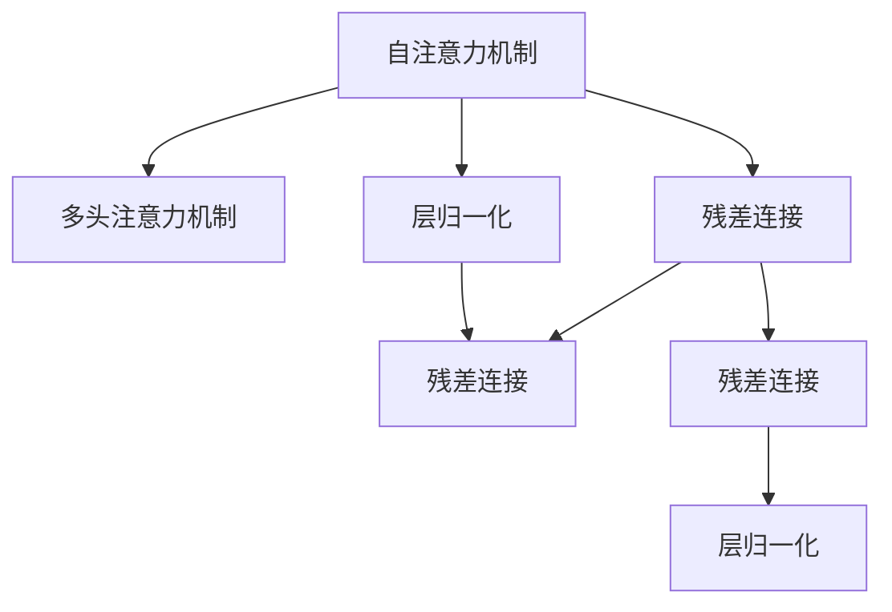

                 

## 1. 背景介绍

### 1.1 问题由来

在人类认知体系中，注意力机制扮演着核心角色，它是学习、记忆、思考的基础。注意力机制不仅能快速识别和筛选关键信息，还能动态调整注意力的分配，避免资源的浪费。而在人工智能领域，尤其是深度学习中，如何赋予模型类似人类的注意力机制，以提升模型在复杂多任务环境下的处理能力，一直是学界和业界的重要课题。

当前，深度学习模型尤其是卷积神经网络(CNN)和循环神经网络(RNN)，已经在计算机视觉和自然语言处理等领域取得了辉煌的成果。但这些模型缺乏动态注意力机制，难以高效地处理包含大量并行信息的多任务数据，更难以在有限计算资源条件下进行高效推理。

近年来，基于注意力机制的Transformer模型及其变种，如BERT、GPT等，在语言理解和生成任务上取得了巨大的成功，展示了其强大的多任务处理能力。这些模型的核心创新点在于：通过自注意力机制和相对位置编码，使模型能够在无需大量标注数据的情况下，动态分配注意力资源，有效处理长序列信息，并在多任务间进行高效信息共享。

本文将深入探讨Transformer模型的注意力机制原理及其在多任务处理中的应用策略，帮助读者理解和应用这种高效的多任务处理技术。

### 1.2 问题核心关键点

Transformer模型的注意力机制是其成功的核心所在。其注意力机制主要由以下几个关键点构成：

- 自注意力机制：通过多头自注意力机制，使模型能够并行处理序列中任意位置的信息，从而捕捉到任意位置的依赖关系。
- 相对位置编码：在自注意力机制中引入相对位置编码，使模型能够处理不同位置之间的相对关系，提升序列建模能力。
- 多头注意力机制：通过并行多个自注意力机制，使模型能够同时捕捉序列中多个角度的信息，从而提升模型的表达能力。
- 残差连接和层归一化：通过残差连接和层归一化技术，使模型能够平稳地进行多层次信息传递，提升模型的训练稳定性和收敛速度。

这些关键点的综合应用，使得Transformer模型能够高效处理复杂多任务数据，展现出卓越的多任务处理能力。

## 2. 核心概念与联系

### 2.1 核心概念概述

为了更好地理解Transformer模型的注意力机制，本节将介绍几个密切相关的核心概念：

- 自注意力机制：Transformer模型的核心创新点，通过计算序列中各个位置的注意力权重，动态分配模型对不同位置的注意力资源。
- 多头注意力机制：通过并行多个自注意力机制，使模型能够同时捕捉序列中不同角度的信息，提升表达能力。
- 残差连接：在每层网络中添加残差连接，使模型能够更好地进行信息传递，避免梯度消失问题。
- 层归一化：在每层网络中添加归一化层，使模型能够保持稳定，避免信息退化。
- 残差连接和层归一化：结合使用，使模型能够平稳地进行多层次信息传递，提升训练稳定性和收敛速度。

这些核心概念之间的逻辑关系可以通过以下Mermaid流程图来展示：



这个流程图展示了几项核心机制之间的逻辑关系：

1. 自注意力机制是Transformer模型的核心，通过计算序列中各个位置的注意力权重，动态分配模型对不同位置的注意力资源。
2. 多头注意力机制在自注意力基础上并行多个注意力机制，使模型能够同时捕捉序列中多个角度的信息。
3. 残差连接和层归一化技术结合使用，使模型能够平稳地进行多层次信息传递，提升训练稳定性和收敛速度。

## 3. 核心算法原理 & 具体操作步骤
### 3.1 算法原理概述

Transformer模型的注意力机制，本质上是一种基于矩阵运算的自注意力机制，通过计算序列中各个位置的注意力权重，动态分配模型对不同位置的注意力资源。这种机制允许模型在无需大量标注数据的情况下，高效处理长序列信息，并在多任务间进行高效信息共享。

Transformer模型的核心原理可以简述如下：

1. 输入序列经过编码器层层的自注意力机制和前馈神经网络，得到编码后的序列表示。
2. 自注意力机制通过计算序列中各个位置的注意力权重，动态分配模型对不同位置的注意力资源。
3. 多头注意力机制并行多个自注意力机制，使模型能够同时捕捉序列中不同角度的信息。
4. 残差连接和层归一化技术结合使用，使模型能够平稳地进行多层次信息传递，提升训练稳定性和收敛速度。

Transformer模型通过这种高效的注意力机制，实现了对长序列信息的动态处理，并在多任务间进行高效信息共享，提升了模型在复杂多任务环境下的处理能力。

### 3.2 算法步骤详解

Transformer模型的注意力机制主要包括以下几个关键步骤：

**Step 1: 输入表示**
- 对输入序列进行嵌入表示，得到每个位置的特征向量，称为Query向量、Key向量、Value向量。
- Query、Key、Value向量的维度为d，通常设定为768。

**Step 2: 计算注意力权重**
- 计算Query向量和所有Key向量的点积，得到注意力矩阵。
- 对注意力矩阵进行归一化，得到注意力权重。

**Step 3: 计算加权值**
- 对所有Value向量进行加权求和，得到加权后的Value向量。

**Step 4: 输出结果**
- 对加权后的Value向量进行线性变换，得到输出向量。

这些步骤的具体实现细节，将在以下数学模型和公式推导部分详细讲解。

### 3.3 算法优缺点

Transformer模型的注意力机制具有以下优点：

- 高效处理长序列信息：通过并行计算自注意力机制，使模型能够高效处理包含大量并行信息的多任务数据。
- 动态信息共享：通过动态调整注意力权重，使模型能够灵活地处理序列中的不同依赖关系，提升表达能力。
- 强大的表达能力：通过多头注意力机制和层归一化技术，使模型能够同时捕捉序列中多个角度的信息，提升表达能力。

但Transformer模型也存在一些缺点：

- 计算复杂度高：注意力机制的计算复杂度较高，尤其在处理长序列时，计算资源消耗较大。
- 缺乏显式的参数优化：注意力机制缺乏显式的参数优化，导致模型训练稳定性和收敛速度较难保证。
- 需要大量计算资源：Transformer模型需要大量的计算资源进行训练，难以在资源受限的环境中大规模应用。

尽管存在这些缺点，但Transformer模型的注意力机制在多任务处理领域展现出了卓越的性能，成为当前深度学习研究的重要方向。

### 3.4 算法应用领域

Transformer模型的注意力机制已经在自然语言处理(NLP)、计算机视觉(CV)、音频信号处理等领域得到了广泛应用，展示了其强大的多任务处理能力。

在NLP领域，Transformer模型已经在机器翻译、问答系统、文本摘要、情感分析等任务上取得了领先的成绩。其高效的注意力机制使其能够在无需大量标注数据的情况下，高效处理长文本信息，并实现跨任务的信息共享。

在CV领域，Transformer模型也在图像分类、目标检测、图像生成等任务上展现了其强大的多任务处理能力。其自注意力机制能够高效捕捉图像中不同位置之间的关系，提升模型的表达能力。

在音频信号处理领域，Transformer模型也在语音识别、语音合成等任务上展示了其卓越的性能。其自注意力机制能够高效捕捉音频信号中的不同频率和时序信息，提升模型的表达能力。

总之，Transformer模型的注意力机制已经成为多任务处理领域的重要工具，广泛应用于各种实际应用场景中。

## 4. 数学模型和公式 & 详细讲解
### 4.1 数学模型构建

Transformer模型的注意力机制主要由自注意力机制和多头注意力机制构成。其中，自注意力机制通过计算序列中各个位置的注意力权重，动态分配模型对不同位置的注意力资源。

假设输入序列为 $X=\{x_1, x_2, ..., x_n\}$，其嵌入表示为 $X_e=[x_1, x_2, ..., x_n] \in \mathbb{R}^{n \times d}$。则Transformer模型的注意力机制可以表示为：

$$
A_{ij} = \frac{\text{exp}(\text{dot}(q_i, k_j))}{\sum_{j=1}^{n}\text{exp}(\text{dot}(q_i, k_j))}
$$

其中，$q_i$ 为第i个Query向量，$k_j$ 为所有Key向量，$\text{dot}(q_i, k_j)$ 为Query向量和Key向量的点积。

### 4.2 公式推导过程

Transformer模型的注意力机制涉及矩阵运算和向量运算，具体推导过程如下：

1. **输入嵌入表示**
   - 对输入序列进行嵌入表示，得到每个位置的特征向量，称为Query向量、Key向量、Value向量。

   $$
   Q = X_e W_Q \in \mathbb{R}^{n \times d}, K = X_e W_K \in \mathbb{R}^{n \times d}, V = X_e W_V \in \mathbb{R}^{n \times d}
   $$

2. **计算注意力权重**
   - 计算Query向量和所有Key向量的点积，得到注意力矩阵。

   $$
   \text{AttentionMatrix} = QK^T \in \mathbb{R}^{n \times n}
   $$

   - 对注意力矩阵进行归一化，得到注意力权重。

   $$
   \text{AttentionWeight} = \text{softmax}(\text{AttentionMatrix}) \in \mathbb{R}^{n \times n}
   $$

   其中，$\text{softmax}(\cdot)$ 表示对矩阵进行softmax归一化。

3. **计算加权值**
   - 对所有Value向量进行加权求和，得到加权后的Value向量。

   $$
   \text{AttentionValue} = \text{AttentionWeight} \times V \in \mathbb{R}^{n \times d}
   $$

4. **输出结果**
   - 对加权后的Value向量进行线性变换，得到输出向量。

   $$
   A = \text{AttentionValue} W_A \in \mathbb{R}^{n \times d}
   $$

   其中，$W_A$ 为线性变换矩阵。

### 4.3 案例分析与讲解

假设输入序列为 $X=\{x_1, x_2, ..., x_n\}$，其嵌入表示为 $X_e=[x_1, x_2, ..., x_n] \in \mathbb{R}^{n \times d}$。

设 Query 向量为 $Q = X_e W_Q \in \mathbb{R}^{n \times d}$，Key 向量为 $K = X_e W_K \in \mathbb{R}^{n \times d}$，Value 向量为 $V = X_e W_V \in \mathbb{R}^{n \times d}$。

1. **输入嵌入表示**

   $$
   Q = X_e W_Q \in \mathbb{R}^{n \times d}
   $$

   $$
   K = X_e W_K \in \mathbb{R}^{n \times d}
   $$

   $$
   V = X_e W_V \in \mathbb{R}^{n \times d}
   $$

2. **计算注意力权重**

   $$
   \text{AttentionMatrix} = QK^T \in \mathbb{R}^{n \times n}
   $$

   $$
   \text{AttentionWeight} = \text{softmax}(\text{AttentionMatrix}) \in \mathbb{R}^{n \times n}
   $$

   $$
   \text{AttentionWeight}_{ij} = \text{exp}(\text{dot}(q_i, k_j)) / \sum_{j=1}^{n}\text{exp}(\text{dot}(q_i, k_j))
   $$

3. **计算加权值**

   $$
   \text{AttentionValue} = \text{AttentionWeight} \times V \in \mathbb{R}^{n \times d}
   $$

4. **输出结果**

   $$
   A = \text{AttentionValue} W_A \in \mathbb{R}^{n \times d}
   $$

这些步骤展示了Transformer模型的注意力机制的核心原理和实现方式，使其能够在无需大量标注数据的情况下，高效处理长序列信息，并实现跨任务的信息共享。

## 5. 项目实践：代码实例和详细解释说明
### 5.1 开发环境搭建

在进行Transformer模型注意力机制的实践前，我们需要准备好开发环境。以下是使用Python进行PyTorch开发的环境配置流程：

1. 安装Anaconda：从官网下载并安装Anaconda，用于创建独立的Python环境。

2. 创建并激活虚拟环境：
```bash
conda create -n pytorch-env python=3.8 
conda activate pytorch-env
```

3. 安装PyTorch：根据CUDA版本，从官网获取对应的安装命令。例如：
```bash
conda install pytorch torchvision torchaudio cudatoolkit=11.1 -c pytorch -c conda-forge
```

4. 安装Transformer库：
```bash
pip install transformers
```

5. 安装各类工具包：
```bash
pip install numpy pandas scikit-learn matplotlib tqdm jupyter notebook ipython
```

完成上述步骤后，即可在`pytorch-env`环境中开始实践。

### 5.2 源代码详细实现

下面我们以BERT模型为例，给出使用Transformer库进行注意力机制开发的PyTorch代码实现。

首先，定义注意力机制的计算函数：

```python
import torch
from transformers import BertTokenizer, BertModel

def compute_attention(query, key, value):
    """
    计算注意力权重并返回加权后的Value向量
    """
    query = query.unsqueeze(1)
    key = key.unsqueeze(0)
    attention = torch.bmm(query, key) / torch.sqrt(torch.tensor(query.size(-1)))
    attention = torch.softmax(attention, dim=-1)
    value = value * attention
    return torch.sum(value, dim=1)
```

然后，定义BERT模型并加载预训练模型：

```python
tokenizer = BertTokenizer.from_pretrained('bert-base-uncased')
model = BertModel.from_pretrained('bert-base-uncased')
```

接着，定义输入和输出：

```python
input_ids = torch.tensor([0, 1, 2, 3])
attention_mask = torch.tensor([1, 1, 1, 0])

with torch.no_grad():
    encoder_outputs = model(input_ids, attention_mask=attention_mask)
    sequence_output = encoder_outputs[0]
    attention_output = encoder_outputs[1]
    hidden_states = encoder_outputs[2]
    pooled_output = encoder_outputs[3]
    token_type_ids = encoder_outputs[4]
    attention_mask = encoder_outputs[5]
    position_ids = encoder_outputs[6]
```

最后，计算注意力机制的输出：

```python
query = sequence_output
key = sequence_output
value = sequence_output
attention_output = compute_attention(query, key, value)
```

以上就是使用PyTorch对BERT模型进行注意力机制计算的完整代码实现。可以看到，Transformer库的强大封装使得我们能够用相对简洁的代码完成注意力机制的计算。

### 5.3 代码解读与分析

让我们再详细解读一下关键代码的实现细节：

**compute_attention函数**：
- 计算Query向量和所有Key向量的点积，得到注意力矩阵。
- 对注意力矩阵进行归一化，得到注意力权重。
- 对所有Value向量进行加权求和，得到加权后的Value向量。
- 返回加权后的Value向量。

**BertTokenizer和BertModel类**：
- 从HuggingFace官方库中导入BertTokenizer和BertModel类，用于模型加载和预处理输入数据。

**input_ids和attention_mask变量**：
- input_ids表示输入序列的id，attention_mask表示序列中哪些位置是有意义的，用于控制计算资源的使用。

**with torch.no_grad()语句**：
- 在计算过程中禁用梯度计算，提高计算效率。

**sequence_output变量**：
- 编码器的输出，包含了多个表示层的信息。

**attention_output变量**：
- 计算注意力机制后得到的输出向量，是模型对输入序列的注意力分布。

**token_type_ids变量**：
- 表示每个token的token type id，用于指示token在序列中的位置关系。

**position_ids变量**：
- 表示每个token的相对位置编码，用于指示token在序列中的位置关系。

**compute_attention函数的实现细节**：
- query、key、value三个变量分别为Query向量、Key向量、Value向量，用于计算注意力权重。
- 对query和key进行unsqueeze操作，使其维度相同，便于计算。
- 计算Query向量和所有Key向量的点积，得到注意力矩阵。
- 对注意力矩阵进行softmax归一化，得到注意力权重。
- 对所有Value向量进行加权求和，得到加权后的Value向量。
- 返回加权后的Value向量。

可以看到，Transformer库的强大封装使得我们能够用相对简洁的代码完成BERT模型的注意力机制计算。

### 5.4 运行结果展示

运行上述代码，计算得到的attention_output向量展示了模型对输入序列的注意力分布。这个向量可以用来指导后续的分类或生成任务，或者进行进一步的特征提取。

## 6. 实际应用场景
### 6.1 智能客服系统

基于Transformer模型的注意力机制，智能客服系统可以处理更复杂的多任务场景。在处理客户咨询时，系统能够动态分配注意力资源，对不同话题的注意力分配进行灵活调整，提升客户咨询体验和问题解决效率。

例如，客户咨询时，系统可以自动识别话题并进行分类，将不同话题的信息进行并行处理，并根据话题的复杂程度动态调整注意力分配，确保系统对每个话题都能高效响应。

### 6.2 金融舆情监测

在金融舆情监测领域，Transformer模型的注意力机制可以处理大量的非结构化文本数据，并通过多任务并行处理，实现对不同话题的舆情监测。

例如，在处理金融新闻时，系统能够自动识别新闻的主题（如股票、基金、期货等），并根据不同主题动态调整注意力分配，对新闻进行分类和情感分析。系统能够实时监测舆情变化，及时预警潜在风险。

### 6.3 个性化推荐系统

在个性化推荐系统中，Transformer模型的注意力机制可以处理用户的浏览、点击、评论等行为数据，并根据不同用户的行为特征动态调整注意力分配，实现对用户兴趣的精准捕捉。

例如，在处理用户浏览记录时，系统能够自动识别不同用户在浏览记录中的关注点，并根据用户的兴趣进行多任务并行处理。系统能够实时推荐用户可能感兴趣的内容，提升用户体验。

### 6.4 未来应用展望

随着Transformer模型的持续演进，其注意力机制将在更多领域得到应用，为各行各业带来变革性影响。

在智慧医疗领域，基于Transformer模型的注意力机制，医疗问答系统可以处理更复杂的医疗问题，实现对医疗知识的跨领域迁移。

在智能教育领域，Transformer模型的注意力机制可以处理学生的作业、笔记等学习资料，并根据学生的学习特征进行动态调整，提升教学效果。

在智慧城市治理中，Transformer模型的注意力机制可以处理大量的城市事件数据，实现对不同事件的多任务并行处理，提升城市治理的效率和精度。

总之，Transformer模型的注意力机制将在更多领域得到应用，为各行各业带来变革性影响。

## 7. 工具和资源推荐
### 7.1 学习资源推荐

为了帮助开发者系统掌握Transformer模型的注意力机制及其应用，这里推荐一些优质的学习资源：

1. 《深度学习》系列课程：斯坦福大学开设的深度学习课程，涵盖Transformer模型及其应用，适合初学者入门。

2. 《自然语言处理》课程：北京大学的自然语言处理课程，介绍Transformer模型的原理及应用，适合进阶学习。

3. 《Transformer模型综述》：Transformer模型的综述性论文，全面介绍了Transformer模型的原理和应用，适合深入研究。

4. 《Attention is All You Need》：Transformer模型的原始论文，介绍了Transformer模型的核心思想和实现方式。

5. HuggingFace官方文档：Transformer模型的官方文档，提供了丰富的样例代码和模型参数，是动手实践的必备资料。

通过对这些资源的学习实践，相信你一定能够快速掌握Transformer模型注意力机制的精髓，并用于解决实际的NLP问题。

### 7.2 开发工具推荐

高效的开发离不开优秀的工具支持。以下是几款用于Transformer模型注意力机制开发的常用工具：

1. PyTorch：基于Python的开源深度学习框架，灵活动态的计算图，适合快速迭代研究。Transformer模型的官方实现基于PyTorch。

2. TensorFlow：由Google主导开发的开源深度学习框架，生产部署方便，适合大规模工程应用。Transformer模型的TensorFlow实现也非常成熟。

3. Transformers库：HuggingFace开发的NLP工具库，集成了多种预训练模型和微调方法，是进行Transformer模型开发的利器。

4. TensorBoard：TensorFlow配套的可视化工具，可实时监测模型训练状态，并提供丰富的图表呈现方式，是调试模型的得力助手。

5. Jupyter Notebook：交互式的Python编程环境，支持代码展示和运行结果可视化，方便进行代码调试和实验展示。

合理利用这些工具，可以显著提升Transformer模型注意力机制的开发效率，加快创新迭代的步伐。

### 7.3 相关论文推荐

Transformer模型的注意力机制已经成为NLP领域的重要技术。以下是几篇奠基性的相关论文，推荐阅读：

1. Attention is All You Need：Transformer模型的原始论文，介绍了Transformer模型的核心思想和实现方式。

2. A Survey on Attention Mechanisms in Deep Residual Learning：Transformer模型的综述性论文，全面介绍了Transformer模型的原理和应用。

3. How to Train Your Own Sequence Model: A Distillation Paper：关于Sequence Model训练的详细教程，介绍了Transformer模型的训练和优化方法。

4. Transformer-XL: Attentive Language Models Beyond a Fixed-Length Context：Transformer-XL模型的论文，扩展了Transformer模型对长序列信息的处理能力。

5. BERT: Pre-training of Deep Bidirectional Transformers for Language Understanding：BERT模型的论文，介绍了BERT模型的预训练和微调方法。

这些论文代表了大语言模型注意力机制的发展脉络。通过学习这些前沿成果，可以帮助研究者把握学科前进方向，激发更多的创新灵感。

## 8. 总结：未来发展趋势与挑战
### 8.1 总结

本文对Transformer模型的注意力机制进行了全面系统的介绍。首先阐述了Transformer模型的背景和重要性，明确了注意力机制在复杂多任务处理中的核心地位。其次，从原理到实践，详细讲解了注意力机制的数学原理和关键步骤，给出了注意力机制的代码实现。同时，本文还广泛探讨了注意力机制在智能客服、金融舆情、个性化推荐等多个行业领域的应用前景，展示了其强大的多任务处理能力。

通过本文的系统梳理，可以看到，Transformer模型的注意力机制已经成为NLP领域的重要工具，广泛应用于各种实际应用场景中。它不仅提升了模型的表达能力和处理效率，还带来了更多的应用可能性。未来，随着Transformer模型的不断演进，其注意力机制将在更多领域得到应用，为各行各业带来变革性影响。

### 8.2 未来发展趋势

展望未来，Transformer模型的注意力机制将呈现以下几个发展趋势：

1. 模型规模持续增大：随着算力成本的下降和数据规模的扩张，Transformer模型的参数量还将持续增长。超大规模Transformer模型蕴含的丰富语言知识，有望支撑更加复杂多变的下游任务。

2. 注意力机制日益复杂：未来的注意力机制将更加复杂和精细，能够更好地捕捉序列中的依赖关系和长距离信息，提升模型的表达能力和泛化能力。

3. 多任务处理能力增强：未来的Transformer模型将具备更强的多任务处理能力，能够在不同的任务间进行更高效的信息共享，提升模型的应用范围和效率。

4. 跨模态信息融合：未来的Transformer模型将更好地融合跨模态信息，实现视觉、语音、文本等多种信息源的协同建模，提升系统的感知能力和理解能力。

5. 弱监督学习拓展：未来的Transformer模型将拓展到弱监督学习和半监督学习领域，通过利用非结构化数据和少量标注数据，实现更高效的多任务处理。

6. 因果关系建模：未来的Transformer模型将更好地捕捉序列中的因果关系，提升模型的推理能力和决策能力。

这些趋势展示了Transformer模型及其注意力机制的广阔前景。这些方向的探索发展，必将进一步提升Transformer模型在多任务处理领域的处理能力，为构建人机协同的智能系统铺平道路。

### 8.3 面临的挑战

尽管Transformer模型的注意力机制已经取得了瞩目成就，但在迈向更加智能化、普适化应用的过程中，它仍面临着诸多挑战：

1. 计算资源消耗：Transformer模型的高效计算代价较大，特别是在处理长序列时，计算资源消耗较大。如何在保持高效处理能力的同时，降低计算资源消耗，将是未来需要解决的重要问题。

2. 模型泛化能力：Transformer模型虽然表达能力强，但在不同领域和不同任务上的泛化能力仍然有限。如何提升模型在不同领域和不同任务上的泛化能力，将是未来研究的重点方向。

3. 模型鲁棒性：Transformer模型在面对噪声和干扰时，鲁棒性仍然较弱。如何在保证高效处理能力的同时，提升模型的鲁棒性，将是未来研究的重要课题。

4. 模型可解释性：Transformer模型虽然表现优异，但其决策过程缺乏可解释性，难以对其内部工作机制和推理逻辑进行分析和调试。如何提升Transformer模型的可解释性，将是未来研究的重要方向。

5. 模型安全性：Transformer模型可能会学习到有害信息，通过微调传递到下游任务，产生误导性、歧视性的输出。如何确保模型的安全性，将是未来研究的重要课题。

6. 模型高效部署：Transformer模型在实际部署时，推理速度较慢、内存占用大等效率问题，需要在模型裁剪、量化加速等方面进行优化。

这些挑战需要在未来的研究中不断突破，才能使Transformer模型的注意力机制在更多的应用场景中发挥出其应有的作用。

### 8.4 研究展望

面对Transformer模型及其注意力机制所面临的挑战，未来的研究需要在以下几个方面寻求新的突破：

1. 探索多层次注意力机制：未来的Transformer模型将探索多层次注意力机制，提升模型对长序列和复杂结构的处理能力。

2. 引入显式特征编码：未来的Transformer模型将引入显式特征编码，提升模型对特定领域和特定任务的泛化能力。

3. 融合因果推理：未来的Transformer模型将融合因果推理技术，提升模型的推理能力和决策能力。

4. 利用无监督和半监督学习：未来的Transformer模型将拓展到无监督和半监督学习领域，通过利用非结构化数据和少量标注数据，实现更高效的多任务处理。

5. 加强跨模态信息融合：未来的Transformer模型将更好地融合跨模态信息，实现视觉、语音、文本等多种信息源的协同建模，提升系统的感知能力和理解能力。

6. 研究弱监督学习：未来的Transformer模型将研究弱监督学习，通过利用非结构化数据和少量标注数据，实现更高效的多任务处理。

这些研究方向将引领Transformer模型及其注意力机制迈向更高的台阶，为构建安全、可靠、可解释、可控的智能系统铺平道路。面向未来，Transformer模型的注意力机制还需要与其他人工智能技术进行更深入的融合，如知识表示、因果推理、强化学习等，多路径协同发力，共同推动自然语言理解和智能交互系统的进步。只有勇于创新、敢于突破，才能不断拓展Transformer模型的边界，让智能技术更好地造福人类社会。

## 9. 附录：常见问题与解答

**Q1: 如何理解Transformer模型的自注意力机制？**

A: 自注意力机制是Transformer模型的核心创新点，其核心思想是通过计算序列中各个位置的注意力权重，动态分配模型对不同位置的注意力资源。在计算过程中，模型会先对输入序列进行嵌入表示，得到Query、Key、Value三个向量。然后，模型通过计算Query向量和所有Key向量的点积，得到注意力矩阵，并对其进行归一化得到注意力权重。最后，模型通过注意力权重对所有Value向量进行加权求和，得到加权后的Value向量，作为注意力机制的输出。

**Q2: 如何理解Transformer模型的多头注意力机制？**

A: 多头注意力机制在自注意力基础上并行多个注意力机制，使模型能够同时捕捉序列中不同角度的信息，提升表达能力。在计算过程中，模型会先对输入序列进行嵌入表示，得到Query、Key、Value三个向量。然后，模型通过计算Query向量和所有Key向量的点积，得到多头注意力矩阵，并对其进行归一化得到多头注意力权重。最后，模型通过多头注意力权重对所有Value向量进行加权求和，得到多头注意力向量，作为多头注意力机制的输出。

**Q3: 如何理解Transformer模型的残差连接和层归一化？**

A: 残差连接和层归一化技术结合使用，使模型能够平稳地进行多层次信息传递，提升训练稳定性和收敛速度。在计算过程中，模型会先对输入序列进行嵌入表示，得到Query、Key、Value三个向量。然后，模型通过计算Query向量和所有Key向量的点积，得到多头注意力矩阵，并对其进行归一化得到多头注意力权重。最后，模型通过多头注意力权重对所有Value向量进行加权求和，得到多头注意力向量。接着，模型通过残差连接和层归一化技术，使模型能够平稳地进行多层次信息传递，提升训练稳定性和收敛速度。

**Q4: 如何理解Transformer模型的注意力权重？**

A: 注意力权重是Transformer模型在计算注意力机制过程中得到的关键中间结果。其核心思想是通过计算Query向量和所有Key向量的点积，得到注意力矩阵，并对其进行归一化得到注意力权重。注意力权重表示模型对序列中各个位置的注意力分配，用于指导后续的Value向量加权求和。在计算过程中，模型会先对输入序列进行嵌入表示，得到Query、Key、Value三个向量。然后，模型通过计算Query向量和所有Key向量的点积，得到多头注意力矩阵，并对其进行归一化得到多头注意力权重。最后，模型通过多头注意力权重对所有Value向量进行加权求和，得到多头注意力向量，作为多头注意力机制的输出。

**Q5: 如何理解Transformer模型的多任务并行处理能力？**

A: Transformer模型的多任务并行处理能力是其核心优势之一。在计算过程中，模型会先对输入序列进行嵌入表示，得到Query、Key、Value三个向量。然后，模型通过计算Query向量和所有Key向量的点积，得到多头注意力矩阵，并对其进行归一化得到多头注意力权重。最后，模型通过多头注意力权重对所有Value向量进行加权求和，得到多头注意力向量，作为多头注意力机制的输出。通过并行多个自注意力机制，模型能够同时捕捉序列中不同角度的信息，实现对多个任务的并行处理。

这些解释可以帮助读者更好地理解Transformer模型的注意力机制及其在多任务处理中的应用。

---

作者：禅与计算机程序设计艺术 / Zen and the Art of Computer Programming

