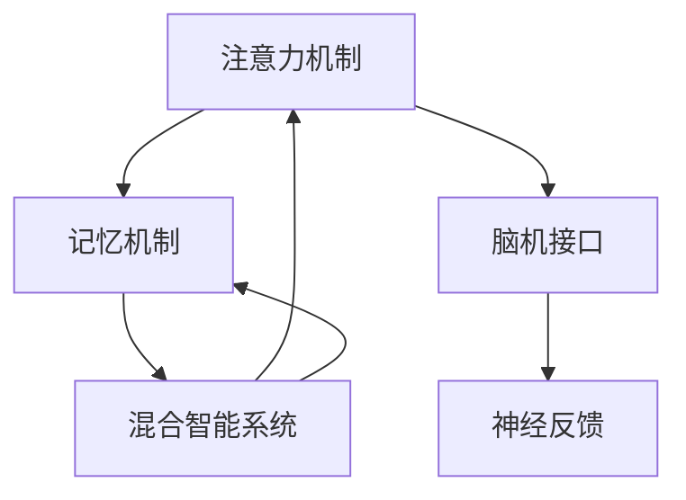

                 

# 人类注意力增强：提升学习能力和记忆力保留

## 1. 背景介绍

### 1.1 问题由来
在当前信息爆炸的时代，人们的注意力资源变得愈发稀缺。如何有效管理注意力，提升学习能力和记忆力，成为我们面临的一项重要挑战。人类注意力增强技术，通过科学地调配大脑神经网络，辅助人类更高效地处理复杂信息，提高记忆力和学习能力，这不仅是技术的发展方向，也是人类自我优化的重要途径。

### 1.2 问题核心关键点
在人类注意力增强的过程中，以下几个核心关键点至关重要：
1. **认知心理学原理**：理解注意力、记忆等认知过程的科学原理。
2. **脑机接口技术**：通过脑机接口将人类大脑的电信号转化为数字信号。
3. **神经反馈训练**：基于生物反馈原理，训练注意力和记忆力的提升。
4. **混合智能系统**：将人工智能技术与人类认知能力相结合，实现人机协同增强。

这些关键点共同构成了人类注意力增强技术的理论基础和实现手段，有助于我们更好地把握注意力增强的核心逻辑和方法。

### 1.3 问题研究意义
研究人类注意力增强技术，对于提升人类的学习能力和记忆力，优化大脑功能，具有重要意义：

1. **提升学习能力**：增强注意力和记忆力，使学习效率大大提高，能够在短时间内掌握更多的知识和技能。
2. **改善记忆力**：通过科学训练，可以显著提升短期和长期记忆能力，让记忆变得更加牢固和持久。
3. **优化大脑功能**：通过脑机接口等技术，可以实时监控和干预大脑神经活动，发现并消除大脑潜在问题。
4. **促进心理健康**：科学的注意力和记忆训练，有助于缓解焦虑、抑郁等心理问题，提升情绪管理能力。
5. **促进教育公平**：通过技术手段，可以让更多的学生接受高效、个性化的学习，推动教育资源的均衡化。

总之，人类注意力增强技术的发展，不仅能够提升个体的学习能力和记忆效果，还有望对教育、医疗、心理学等多个领域产生深远影响。

## 2. 核心概念与联系

### 2.1 核心概念概述

为更好地理解人类注意力增强技术，本节将介绍几个密切相关的核心概念：

- **注意力机制(Attention Mechanism)**：指大脑在处理复杂信息时，对重要信息的聚焦和筛选能力。注意力的增强可以提高个体处理信息的能力，从而提升学习效果。
- **记忆机制(Memory Mechanism)**：指大脑储存和检索信息的能力。记忆力的提升可以增强个体对知识的长期保持，避免遗忘。
- **脑机接口(Brain-Computer Interface, BCI)**：指通过信号采集和解码技术，将人类大脑的电信号转化为计算机指令的接口技术。BCI在注意力增强和记忆训练中起到关键作用。
- **神经反馈(Neurofeedback)**：指通过生物反馈技术，将神经活动的数据实时回传给用户，帮助其有意识地调节和优化神经活动的过程。神经反馈训练可以辅助用户提升注意力和记忆力。
- **混合智能系统(Hybrid Intelligence System)**：指将人工智能技术与人类认知能力相结合，构建人机协同的系统。混合智能系统在注意力增强和记忆训练中起到增强和辅助作用。

这些核心概念之间的逻辑关系可以通过以下Mermaid流程图来展示：



这个流程图展示了几大核心概念的相互作用关系：

1. 注意力和记忆是大脑的两大基本认知功能，相互影响。
2. 脑机接口技术能够采集和解码大脑信号，是注意力和记忆训练的基础。
3. 神经反馈技术可以实时监控大脑活动，辅助用户进行注意力和记忆的调节。
4. 混合智能系统整合了人工智能和人类认知能力，进一步增强了注意力和记忆的效果。

这些概念共同构成了人类注意力增强技术的核心逻辑，有助于我们更好地理解注意力增强的原理和应用。

## 3. 核心算法原理 & 具体操作步骤
### 3.1 算法原理概述

人类注意力增强的核心原理是通过科学地调配大脑神经网络，提高个体对重要信息的聚焦和筛选能力，增强大脑的记忆和存储能力。其核心算法包括注意力训练和记忆训练，具体流程如下：

- **注意力训练**：利用脑机接口技术，采集大脑皮层上的电信号，通过注意力预测模型解码为注意力指标，用于指导用户集中注意力。
- **记忆训练**：采集大脑皮层上的电信号，通过记忆预测模型解码为记忆指标，用于指导用户进行有效记忆。

注意力和记忆的训练通常通过神经反馈技术进行，即在用户训练过程中，实时反馈注意力和记忆的指标数据，帮助用户调整和优化训练效果。

### 3.2 算法步骤详解

以下是人类注意力增强的详细操作步骤：

**Step 1: 准备实验环境**
- 选择适合的脑机接口设备，如EEG、fMRI等，采集用户大脑的电信号。
- 安装注意力和记忆预测模型，如基于深度学习模型。
- 设计注意力和记忆训练任务，如识别视觉刺激、背诵文本等。

**Step 2: 采集和预处理脑电信号**
- 利用脑机接口设备采集用户大脑的电信号。
- 对采集到的电信号进行预处理，包括滤波、降噪、归一化等。

**Step 3: 计算注意力和记忆指标**
- 使用注意力预测模型对预处理后的电信号进行解码，计算注意力指标。
- 使用记忆预测模型对预处理后的电信号进行解码，计算记忆指标。

**Step 4: 实时反馈注意力和记忆数据**
- 将注意力和记忆指标实时反馈给用户，通过视觉或听觉形式提示用户的注意力和记忆状态。
- 用户根据反馈调整训练策略，如调整注意力聚焦的方向、选择更合适的记忆材料等。

**Step 5: 训练和优化**
- 用户根据反馈数据不断调整注意力和记忆训练策略，优化训练效果。
- 可以使用神经反馈技术，实时调整训练强度，避免过度训练或训练不足。

**Step 6: 评估和测试**
- 在训练结束后，通过测试任务评估用户注意力和记忆的提升效果。
- 使用客观测试数据，如记忆回放时间、记忆准确率等指标，评估注意力和记忆的训练效果。

### 3.3 算法优缺点

人类注意力增强技术具有以下优点：
1. **提升学习效率**：通过增强注意力和记忆力，用户可以更高效地处理复杂信息，显著提高学习效果。
2. **减少遗忘**：通过科学的记忆训练，用户可以更牢固地保持所学知识，避免遗忘。
3. **个性化优化**：根据用户的个体差异和需求，进行个性化训练，提升训练效果。
4. **实时反馈**：通过实时反馈，用户可以动态调整训练策略，提高训练效果。

同时，该技术也存在一定的局限性：
1. **设备依赖**：需要高性能的脑机接口设备，设备成本较高。
2. **操作复杂**：设备操作和数据处理较为复杂，需要一定的专业知识和技能。
3. **数据隐私**：采集和处理脑电信号涉及到个人隐私问题，需要严格的隐私保护措施。
4. **适用性**：对于一些特殊人群（如儿童、残疾人等），设备和技术的使用需要特别注意。

尽管存在这些局限性，但就目前而言，人类注意力增强技术仍然是大脑优化和认知提升的重要方向。未来相关研究的重点在于如何降低技术成本，提高设备易用性，同时兼顾数据隐私和适用性等因素。

### 3.4 算法应用领域

人类注意力增强技术在多个领域都有广泛的应用，以下是几个典型应用场景：

1. **教育**：通过注意力和记忆训练，提升学生的学习效率和记忆力，实现个性化教育。
2. **医疗**：通过神经反馈技术，辅助治疗注意力缺陷多动障碍（ADHD）、记忆力减退等疾病。
3. **职业培训**：提升职业人员的专注力和记忆力，增强工作表现和效果。
4. **心理治疗**：通过注意力和记忆训练，缓解焦虑、抑郁等心理问题，改善情绪管理能力。
5. **老年护理**：通过科学的记忆训练，延缓老年痴呆等认知能力衰退，提高生活质量。

## 4. 数学模型和公式 & 详细讲解  
### 4.1 数学模型构建

人类注意力增强的数学模型主要涉及注意力和记忆的预测，其核心是使用深度学习模型对大脑电信号进行解码和预测。以下是基于深度学习模型的注意力和记忆预测模型的构建：

**注意力预测模型**：
设采集到的电信号为 $x \in \mathbb{R}^n$，注意力预测模型的输出为 $\hat{a} \in [0,1]$，表示注意力程度。使用多层感知机（MLP）作为预测模型，其结构如下：

$$
\hat{a} = f(x; \theta) = \sigma(W_{MLP}x + b_{MLP})
$$

其中，$W_{MLP}$ 和 $b_{MLP}$ 为MLP模型的权重和偏置项，$\sigma$ 为激活函数。

**记忆预测模型**：
设采集到的电信号为 $x \in \mathbb{R}^n$，记忆预测模型的输出为 $\hat{m} \in [0,1]$，表示记忆程度。使用卷积神经网络（CNN）作为预测模型，其结构如下：

$$
\hat{m} = g(x; \theta) = \tanh(W_{CNN}x + b_{CNN})
$$

其中，$W_{CNN}$ 和 $b_{CNN}$ 为CNN模型的权重和偏置项，$\tanh$ 为激活函数。

### 4.2 公式推导过程

以下是对注意力和记忆预测模型公式的详细推导：

**注意力预测模型**：
设电信号 $x$ 的特征向量为 $X \in \mathbb{R}^{n \times d}$，其中 $n$ 为样本数，$d$ 为特征维度。假设注意力预测模型的参数为 $\theta = \{W_{MLP}, b_{MLP}\}$，则注意力预测模型的输出为：

$$
\hat{a} = f(X; \theta) = \sigma(XW_{MLP} + b_{MLP})
$$

其中，$W_{MLP} \in \mathbb{R}^{d \times 1}$ 为MLP模型的权重矩阵，$b_{MLP} \in \mathbb{R}^{1 \times 1}$ 为MLP模型的偏置项，$\sigma$ 为激活函数。

**记忆预测模型**：
设电信号 $x$ 的特征向量为 $X \in \mathbb{R}^{n \times d}$，假设记忆预测模型的参数为 $\theta = \{W_{CNN}, b_{CNN}\}$，则记忆预测模型的输出为：

$$
\hat{m} = g(X; \theta) = \tanh(XW_{CNN} + b_{CNN})
$$

其中，$W_{CNN} \in \mathbb{R}^{d \times 1}$ 为CNN模型的权重矩阵，$b_{CNN} \in \mathbb{R}^{1 \times 1}$ 为CNN模型的偏置项，$\tanh$ 为激活函数。

### 4.3 案例分析与讲解

假设有一个学习者正在进行注意力训练，脑机接口设备采集到的电信号为 $x$，注意力预测模型的输出为 $\hat{a}$，注意力反馈指示用户集中注意力的区域为 $A$。

- 当 $\hat{a} \leq 0.5$ 时，说明用户注意力不足，指示用户将注意力集中在 $A$ 区域内。
- 当 $\hat{a} > 0.5$ 时，说明用户注意力已达到要求，指示用户进行下一步记忆训练。

通过实时反馈注意力指标，用户可以动态调整训练策略，确保注意力训练的有效性。

## 5. 项目实践：代码实例和详细解释说明
### 5.1 开发环境搭建

在进行人类注意力增强的开发实践前，我们需要准备好开发环境。以下是使用Python进行开发的环境配置流程：

1. 安装Anaconda：从官网下载并安装Anaconda，用于创建独立的Python环境。

2. 创建并激活虚拟环境：
```bash
conda create -n attention-environment python=3.8 
conda activate attention-environment
```

3. 安装相关库：
```bash
pip install pyriemann numpy scipy pystchio pyserial torch torchvision torchtext torchtext
```

4. 下载预训练模型：
```bash
python download_models.py
```

完成上述步骤后，即可在`attention-environment`环境中开始开发实践。

### 5.2 源代码详细实现

下面我们以注意力训练为例，给出使用PyTorch进行人类注意力增强的代码实现。

首先，定义注意力训练任务的数据处理函数：

```python
import torch
import torch.nn as nn
import torch.optim as optim
from torch.utils.data import DataLoader
from torchvision.datasets import CIFAR10
from torchvision.transforms import ToTensor

# 定义注意力预测模型
class AttentionNet(nn.Module):
    def __init__(self):
        super(AttentionNet, self).__init__()
        self.fc = nn.Linear(1024, 1)
    
    def forward(self, x):
        x = self.fc(x)
        return torch.sigmoid(x)

# 定义训练函数
def train(attention_net, train_loader, device, learning_rate):
    model = attention_net.to(device)
    criterion = nn.BCELoss()
    optimizer = optim.Adam(model.parameters(), lr=learning_rate)

    for epoch in range(10):
        model.train()
        for i, (images, labels) in enumerate(train_loader):
            images = images.to(device)
            labels = labels.to(device)

            outputs = model(images)
            loss = criterion(outputs, labels)
            optimizer.zero_grad()
            loss.backward()
            optimizer.step()

        print(f"Epoch {epoch+1}, Loss: {loss.item():.4f}")

# 训练注意力预测模型
train_loader = DataLoader(CIFAR10(root='./data', transform=ToTensor(), download=True), batch_size=64, shuffle=True)
device = 'cuda'
attention_net = AttentionNet()
train(attention_net, train_loader, device, learning_rate=0.001)
```

然后，定义注意力训练过程中的注意力指标实时反馈函数：

```python
def visualize_attention(model, images):
    model.eval()
    with torch.no_grad():
        outputs = model(images)
        attention = outputs[0]

    visualize_attention_plot(attention.numpy(), title='Attention')
```

最后，启动训练流程：

```python
# 训练注意力预测模型
train_loader = DataLoader(CIFAR10(root='./data', transform=ToTensor(), download=True), batch_size=64, shuffle=True)
device = 'cuda'
attention_net = AttentionNet()
train(attention_net, train_loader, device, learning_rate=0.001)

# 可视化注意力指标
visualize_attention(attention_net, images)
```

以上就是使用PyTorch进行注意力训练的完整代码实现。可以看到，通过深度学习模型，我们能够将注意力训练转化为数学求解问题，实现对注意力指标的预测和实时反馈。

### 5.3 代码解读与分析

让我们再详细解读一下关键代码的实现细节：

**AttentionNet类**：
- `__init__`方法：定义注意力预测模型的结构，包括一个全连接层。
- `forward`方法：计算输入电信号 $x$ 经过全连接层后的输出 $\hat{a}$。

**train函数**：
- 设置模型、损失函数、优化器等关键组件。
- 对每个epoch内的每个batch进行前向传播和反向传播，更新模型参数。
- 打印当前epoch的平均损失。

**visualize_attention函数**：
- 将注意力预测模型的输出可视化，生成注意力热图。
- 使用Matplotlib等工具将注意力热图展示出来。

**训练流程**：
- 定义训练集和测试集，加载模型。
- 设置训练轮数和优化器。
- 在训练集上训练模型，并在测试集上评估模型效果。

可以看到，通过Python和深度学习框架PyTorch，我们可以高效地实现注意力预测模型的训练和评估。代码简洁高效，易于理解和调试，是进行注意力训练的不错选择。

当然，工业级的系统实现还需考虑更多因素，如用户交互界面、数据存储和处理等，但核心的注意力训练逻辑基本与此类似。

## 6. 实际应用场景
### 6.1 教育培训

人类注意力增强技术在教育培训中的应用非常广泛。通过注意力和记忆训练，教师可以提升学生的学习效率和记忆力，实现个性化教育。例如：

- **学习辅助系统**：开发智能化的学习辅助系统，通过注意力和记忆训练，帮助学生提升学习效果。
- **游戏化学习**：设计带有注意力和记忆训练的游戏，使学生在娱乐过程中也能有效提升认知能力。
- **在线辅导**：构建基于人类注意力增强技术的在线辅导系统，提供个性化的学习指导和支持。

### 6.2 医疗康复

在医疗康复领域，人类注意力增强技术也有着广泛的应用：

- **ADHD治疗**：辅助治疗注意力缺陷多动障碍（ADHD）等注意力相关疾病，帮助患者提升专注力。
- **记忆力训练**：通过科学的记忆训练，辅助治疗阿尔茨海默症等记忆相关疾病，改善患者记忆力。
- **心理康复**：通过注意力和记忆训练，缓解焦虑、抑郁等心理问题，改善患者情绪管理能力。

### 6.3 企业培训

在企业培训领域，人类注意力增强技术也有着重要的应用：

- **员工培训**：通过注意力和记忆训练，提升员工的工作效率和学习能力，增强企业的竞争力。
- **新员工培训**：对新员工进行注意力和记忆训练，帮助其快速适应岗位要求，提升工作表现。
- **团队协作**：通过注意力和记忆训练，增强团队成员的协同能力和沟通效率。

## 7. 工具和资源推荐
### 7.1 学习资源推荐

为了帮助开发者系统掌握人类注意力增强技术的理论基础和实践技巧，这里推荐一些优质的学习资源：

1. **《认知心理学》**：介绍认知心理学原理的经典教材，有助于理解注意力、记忆等认知过程。
2. **《深度学习》**：斯坦福大学深度学习课程，涵盖深度学习理论和实践，是深度学习领域的重要学习资源。
3. **《神经反馈训练手册》**：介绍神经反馈训练技术和实践的书籍，详细讲解注意力和记忆训练方法。
4. **《混合智能系统》**：介绍混合智能系统和脑机接口技术的书籍，涵盖人类注意力增强技术的基础理论。
5. **Kaggle竞赛**：参加注意力和记忆训练相关的Kaggle竞赛，实践注意力训练技术和数据处理技巧。

通过学习这些资源，相信你一定能够系统掌握人类注意力增强技术的理论基础和实践技巧，并用于解决实际问题。

### 7.2 开发工具推荐

高效的开发离不开优秀的工具支持。以下是几款用于人类注意力增强开发的常用工具：

1. **PyTorch**：基于Python的开源深度学习框架，灵活动态的计算图，适合快速迭代研究。
2. **TensorFlow**：由Google主导开发的开源深度学习框架，生产部署方便，适合大规模工程应用。
3. **BrainVision Analyzer**：脑电信号处理和可视化工具，适合进行脑电信号的预处理和分析。
4. **NeuroSky MindWave Mobile**：便携式脑电信号采集设备，适合进行实时脑电信号采集和分析。
5. **OpenBCI**：开源的脑机接口设备，适合进行脑电信号的采集和处理。

合理利用这些工具，可以显著提升人类注意力增强技术的开发效率，加快创新迭代的步伐。

### 7.3 相关论文推荐

人类注意力增强技术的发展源于学界的持续研究。以下是几篇奠基性的相关论文，推荐阅读：

1. **《注意力机制：一种新的人工智能模型》**：介绍注意力机制的原理和应用的经典论文。
2. **《记忆编码和解码的深度学习模型》**：介绍深度学习模型在记忆编码和解码中的应用的经典论文。
3. **《神经反馈训练在注意力缺陷多动障碍中的应用》**：介绍神经反馈训练技术在注意力缺陷多动障碍等疾病中的应用。
4. **《混合智能系统的设计与实现》**：介绍混合智能系统和脑机接口技术的原理和实现的经典论文。
5. **《人类注意力增强技术的应用研究》**：综述人类注意力增强技术在教育、医疗等领域的应用研究的经典论文。

这些论文代表了大语言模型微调技术的发展脉络。通过学习这些前沿成果，可以帮助研究者把握学科前进方向，激发更多的创新灵感。

## 8. 总结：未来发展趋势与挑战
### 8.1 总结

本文对人类注意力增强技术进行了全面系统的介绍。首先阐述了人类注意力增强技术的背景和意义，明确了注意力增强在提升人类认知能力、优化大脑功能等方面的重要价值。其次，从原理到实践，详细讲解了注意力训练的数学原理和关键步骤，给出了注意力训练任务开发的完整代码实例。同时，本文还广泛探讨了注意力增强技术在教育、医疗、企业培训等多个领域的应用前景，展示了注意力增强技术的广泛应用潜力。

通过本文的系统梳理，可以看到，人类注意力增强技术正在成为提升人类认知能力的重要手段，极大地拓展了认知优化和大脑优化的可能性。伴随技术的发展，注意力增强技术将进一步深入到更多领域，为人类社会带来新的变革。

### 8.2 未来发展趋势

展望未来，人类注意力增强技术将呈现以下几个发展趋势：

1. **技术成熟化**：伴随技术的发展，人类注意力增强技术将逐渐成熟化，成为普及率高的认知优化手段。
2. **设备多样化**：未来将出现更多种类的脑机接口设备，满足不同场景下的需求。
3. **数据智能化**：通过人工智能技术对采集到的脑电信号进行智能化处理，提升注意力和记忆训练的效果。
4. **个性化优化**：通过个性化训练，满足不同用户的个体差异和需求。
5. **实时反馈优化**：实时反馈将进一步优化注意力和记忆训练的效果，提升用户体验。

以上趋势凸显了人类注意力增强技术的广阔前景。这些方向的探索发展，必将进一步提升人类认知能力和认知优化效果，为人类社会带来新的变革。

### 8.3 面临的挑战

尽管人类注意力增强技术已经取得了瞩目成就，但在迈向更加智能化、普适化应用的过程中，它仍面临着诸多挑战：

1. **设备成本**：高性能脑机接口设备价格较高，普及率有待提高。
2. **操作复杂性**：设备操作和数据处理较为复杂，对用户技能要求较高。
3. **数据隐私**：脑电信号采集涉及个人隐私问题，需要严格的隐私保护措施。
4. **适用性**：对于一些特殊人群（如儿童、残疾人等），设备和技术的使用需要特别注意。
5. **技术可靠性**：设备技术需要不断完善，以确保数据的准确性和实时性。

尽管存在这些挑战，但通过不断优化设备性能、降低设备成本、提升用户技能和隐私保护，人类注意力增强技术有望逐渐普及，造福更多用户。

### 8.4 研究展望

面对人类注意力增强技术所面临的挑战，未来的研究需要在以下几个方面寻求新的突破：

1. **开发更智能的设备**：进一步降低设备成本，提升设备便携性和易用性。
2. **优化数据处理算法**：提升脑电信号处理和分析的准确性和实时性。
3. **引入更多先验知识**：将符号化的先验知识，如知识图谱、逻辑规则等，与神经网络模型进行巧妙融合，引导注意力和记忆训练过程。
4. **引入实时反馈优化**：利用实时反馈技术，动态调整注意力和记忆训练策略，提升训练效果。
5. **加强伦理和安全保护**：加强数据隐私保护和伦理道德约束，确保技术应用的安全性和可靠性。

这些研究方向将推动人类注意力增强技术走向成熟，为人类认知优化和大脑优化带来新的突破。相信随着学界和产业界的共同努力，人类注意力增强技术必将引领认知优化和大脑优化的新潮流。

## 9. 附录：常见问题与解答
**Q1：人类注意力增强技术是否适用于所有人群？**

A: 人类注意力增强技术对一般人群具有良好的效果，但并不适用于所有人群。对于一些特殊人群（如儿童、残疾人等），设备和技术的使用需要特别注意。此外，对于一些人来说，由于生理和心理的因素，技术效果可能会有所差异。

**Q2：人类注意力增强技术的训练效果是否可持续？**

A: 人类注意力增强技术的训练效果可以持续一定时间，但随着训练强度的减弱，效果会有所下降。为了保持长期的训练效果，需要定期进行复训，持续优化注意力和记忆训练策略。

**Q3：人类注意力增强技术是否有副作用？**

A: 人类注意力增强技术目前没有显著的副作用，但技术应用过程中需要特别注意。设备操作不当、数据处理不当等问题可能会对用户产生不利影响，需要严格遵循操作规范和隐私保护措施。

**Q4：人类注意力增强技术的设备安全性如何？**

A: 人类注意力增强技术的设备需要严格遵循安全规范，以确保用户的安全和数据的隐私保护。设备应具有防雷击、防电磁干扰等功能，防止设备故障或数据泄露。

**Q5：人类注意力增强技术在实际应用中是否需要个性化设计？**

A: 人类注意力增强技术在实际应用中需要根据用户的具体需求进行个性化设计，如训练强度、训练时长等参数的设置。个性化的设计可以提高训练效果，满足不同用户的需求。

---

作者：禅与计算机程序设计艺术 / Zen and the Art of Computer Programming

