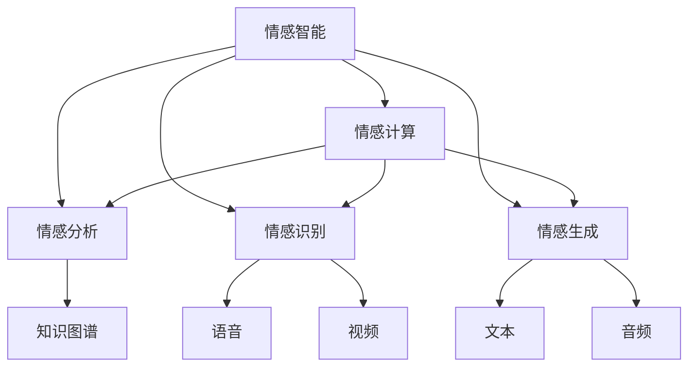

                 

# 人类的知识与情感：理解情绪的力量

> 关键词：情绪,情感智能,情感计算,自然语言处理(NLP),知识图谱,情感分析,情绪识别

## 1. 背景介绍

### 1.1 问题由来

情感是人类最基本、最深刻的属性之一。在数字化的今天，如何通过计算技术理解、处理、生成情感，成为越来越多企业和研究机构关注的焦点。

情感计算是一个交叉学科，涉及心理学、社会学、计算机科学等多个领域。其核心目的是在人类-计算机交互过程中，通过识别和理解人类的情感状态，提供更加贴合人机交互体验的智能化服务。

情感计算的发展和应用，将对智能系统的设计、用户行为的预测、产品设计的优化等多个方面产生深远影响。从虚拟助手到医疗诊断，从教育辅导到金融风控，情感计算的应用潜力正在逐步展现。

### 1.2 问题核心关键点

情感计算的核心在于如何从文本、语音、视频等多模态数据中，准确、高效地识别出人类情感状态，并将其转化为计算系统能够理解的形式。

目前，情感计算方法主要包括：
- 基于自然语言处理(NLP)的情感分析
- 基于计算机视觉的情感识别
- 基于音频分析的情感识别
- 基于生理信号的情感识别

这些方法各有优缺点，通常需要综合使用多种技术手段，才能全面准确地识别出人类情感。

## 2. 核心概念与联系

### 2.1 核心概念概述

为更好地理解情感计算技术，本节将介绍几个密切相关的核心概念：

- 情感智能：通过计算技术识别和理解人类情感的能力，是人工智能应用中的一个重要分支。
- 情感计算：使用计算技术处理人类情感数据的学科，通常包含文本、语音、视频等多模态数据的融合和分析。
- 情感分析：利用NLP技术从文本中识别和提取情感信息的过程，是情感计算的核心任务之一。
- 知识图谱：通过有向图结构组织知识关系的系统，为情感分析提供背景信息支持。
- 情绪识别：通过语音、视频等模态，识别和分析人类的情绪状态。
- 情感生成：利用情感计算技术生成与人类情感相匹配的文本、音频等内容。

这些核心概念之间的逻辑关系可以通过以下Mermaid流程图来展示：



这个流程图展示了几类核心概念及其之间的关系：

1. 情感智能是情感计算的总体目标。
2. 情感分析、情感识别、情感生成是实现情感智能的具体任务。
3. 知识图谱为情感分析提供知识背景支持。
4. 语音、视频、文本、音频是多模态数据，用于情感识别的输入。

这些概念共同构成了情感计算的技术框架，使得计算系统能够理解人类的情感状态，实现人机交互的自然化和智能化。

## 3. 核心算法原理 & 具体操作步骤

### 3.1 算法原理概述

情感计算的核心算法包括情感分析和情感识别两部分。

情感分析是指从文本数据中识别出情感信息的过程。其基本原理是通过对文本中的词语和句式进行分析，挖掘出文本的情感极性、强度、情绪等属性。情感识别的基本原理是通过对语音、视频等多模态数据进行分析，识别出人类的情绪状态，如开心、悲伤、愤怒等。

情感分析通常基于NLP技术，包括词向量表示、情感词典、深度学习模型等手段。情感识别通常基于机器学习和计算机视觉技术，包括时序分析、特征提取、深度神经网络等方法。

### 3.2 算法步骤详解

情感分析的典型步骤如下：

**Step 1: 文本预处理**

- 分词：将文本分割为词语，如使用中文分词器jieba。
- 去除停用词：去除文本中的常见停用词，如“的”、“是”等。
- 词形还原：将词语还原为其原始形式，如将“喜欢”还原为“喜”。
- 正则化：使用正则表达式去除非文本信息，如网址、代码等。

**Step 2: 特征提取**

- 词向量表示：使用word2vec、GloVe等词向量模型，将词语转换为向量表示。
- 情感词典：使用情感词典，如SentiWordNet、AFINN等，计算文本的情感极性。
- 深度学习模型：使用RNN、LSTM、GRU等深度学习模型，提取文本的语义信息。

**Step 3: 情感分类**

- 传统方法：基于规则的情感分类方法，如基于情感词典的情感极性计算。
- 机器学习方法：基于SVM、朴素贝叶斯、LDA等分类算法，训练情感分类模型。
- 深度学习方法：基于CNN、RNN、Transformer等神经网络模型，训练情感分类模型。

情感识别的典型步骤如下：

**Step 1: 特征提取**

- 时序特征：使用MFCC、HOG等特征提取方法，提取语音的时序特征。
- 图像特征：使用SIFT、HOG等特征提取方法，提取视频的人脸特征。

**Step 2: 模型训练**

- 传统方法：基于HOG-SVM、CNN等模型的情感识别方法。
- 深度学习方法：基于CNN、RNN、LSTM等神经网络模型的情感识别方法。

**Step 3: 模型预测**

- 情感分类：将多模态特征输入分类器，得到情感状态分类结果。
- 情绪识别：将多模态特征输入情绪识别器，得到情绪状态识别结果。

### 3.3 算法优缺点

情感分析的主要优点包括：
- 适用于大规模文本数据，能够快速计算情感极性和情绪分布。
- 可以结合知识图谱，提高情感识别的准确性。
- 可以与其他NLP技术结合，如命名实体识别、情感生成等。

情感分析的主要缺点包括：
- 对文本数据的依赖性较大，对噪声敏感。
- 难以处理复杂的情感表达，如反讽、双关语等。
- 对于非文本数据的处理能力有限，如视频、音频等。

情感识别的主要优点包括：
- 能够实时处理语音、视频等多模态数据。
- 能够识别复杂的情绪状态，如微表情、语音语调等。

情感识别的主要缺点包括：
- 对噪声和环境干扰敏感。
- 数据采集难度较大，需要高质量的多模态数据。
- 需要大量的标注数据进行训练，标注成本较高。

### 3.4 算法应用领域

情感计算技术已经广泛应用于多个领域，包括但不限于：

- 智能客服：利用情感分析技术，实现客户情绪监测和自动回复，提升客户满意度。
- 金融风控：利用情感识别技术，监测投资者的情绪变化，预测市场动向。
- 医疗诊断：利用情感分析技术，监测患者的情绪状态，辅助心理健康诊断。
- 教育辅导：利用情感计算技术，分析学生的情绪状态，优化教学方法和辅导策略。
- 社交媒体分析：利用情感分析技术，监测网络舆情，预测社会情绪变化。
- 游戏娱乐：利用情感计算技术，增强游戏互动性和用户粘性，提升用户体验。

## 4. 数学模型和公式 & 详细讲解  
### 4.1 数学模型构建

情感分析的数学模型通常基于文本中的词频和情感词典。设文本 $D$ 的词向量表示为 $X$，情感词典 $D$ 的权重为 $W$，情感分类器为 $C$，则情感分析的数学模型为：

$$
\max_{\theta} \sum_{i=1}^N \log P(C(y_i|X_i; \theta), y_i)
$$

其中 $N$ 为文本数量，$y_i$ 为情感标签，$P(C(y_i|X_i; \theta)$ 为情感分类器的预测概率，$\theta$ 为模型参数。

情感识别的数学模型通常基于多模态数据的时序特征和图像特征。设语音时序特征为 $T$，视频图像特征为 $V$，情感分类器为 $C$，则情感识别的数学模型为：

$$
\max_{\theta} \sum_{i=1}^N \log P(C(E_i|T_i, V_i; \theta), E_i)
$$

其中 $E_i$ 为情绪标签，$P(C(E_i|T_i, V_i; \theta)$ 为情感分类器的预测概率。

### 4.2 公式推导过程

情感分析的公式推导基于贝叶斯定理和最大似然估计。设文本 $D$ 的词向量表示为 $X$，情感词典 $D$ 的权重为 $W$，情感分类器为 $C$，则情感分析的公式推导为：

$$
P(C(y_i|X_i; \theta) = \frac{P(C(y_i; \theta)) P(X_i|C(y_i; \theta))}{P(X_i)}
$$

其中 $P(C(y_i; \theta)$ 为情感分类器的先验概率，$P(X_i|C(y_i; \theta))$ 为文本 $X_i$ 在情感 $C(y_i; \theta)$ 下的条件概率，$P(X_i)$ 为文本 $X_i$ 的边缘概率。

情感识别的公式推导基于神经网络模型的训练过程。设语音时序特征为 $T$，视频图像特征为 $V$，情感分类器为 $C$，则情感识别的公式推导为：

$$
P(C(E_i|T_i, V_i; \theta) = \frac{\exp(\theta^T[T_i, V_i])}{\sum_{k=1}^K \exp(\theta^T[T_i, V_k])}
$$

其中 $\theta$ 为神经网络模型的参数，$K$ 为可能的情绪标签数量。

### 4.3 案例分析与讲解

以情感分析中的基于深度学习模型的方法为例，以下是使用深度神经网络进行情感分析的案例讲解：

1. 数据准备：收集情感标注的文本数据集，如IMDB电影评论数据集。
2. 文本预处理：使用自然语言处理库NLTK进行文本清洗、分词、词形还原等预处理。
3. 特征提取：使用GloVe词向量模型，将文本转换为词向量表示。
4. 模型训练：使用LSTM神经网络模型，训练情感分类器。
5. 模型评估：在测试集上评估模型性能，计算准确率、召回率等指标。

以情感识别中的基于卷积神经网络(CNN)的方法为例，以下是使用CNN进行情感识别的案例讲解：

1. 数据准备：收集情感标注的语音或视频数据集。
2. 特征提取：使用MFCC、HOG等特征提取方法，提取语音或视频的时序特征。
3. 模型训练：使用卷积神经网络模型，训练情感分类器。
4. 模型评估：在测试集上评估模型性能，计算准确率、召回率等指标。

## 5. 项目实践：代码实例和详细解释说明
### 5.1 开发环境搭建

在进行情感计算项目开发前，我们需要准备好开发环境。以下是使用Python进行情感计算项目的开发环境配置流程：

1. 安装Anaconda：从官网下载并安装Anaconda，用于创建独立的Python环境。

2. 创建并激活虚拟环境：
```bash
conda create -n sentiment-env python=3.8 
conda activate sentiment-env
```

3. 安装Python和相关库：
```bash
pip install nltk spacy transformers
```

4. 下载预训练模型：
```bash
python -m spacy download en_core_web_sm
```

5. 安装情感计算库：
```bash
pip install textblob
```

完成上述步骤后，即可在`sentiment-env`环境中开始情感计算项目开发。

### 5.2 源代码详细实现

以下是使用Python和NLTK库进行情感分析的代码实现：

```python
import nltk
from nltk.corpus import movie_reviews
from nltk.classify import NaiveBayesClassifier
from nltk.classify.util import accuracy as nltk_accuracy

# 准备数据集
nltk.download('movie_reviews')
fileids_pos = movie_reviews.fileids('pos')
fileids_neg = movie_reviews.fileids('neg')

# 提取特征
def extract_features(words):
    return dict([(word, True) for word in words])

# 分割数据集
features_pos = [(extract_features(movie_reviews.words(fileids=[f])), 'pos') for f in fileids_pos]
features_neg = [(extract_features(movie_reviews.words(fileids=[f])), 'neg') for f in fileids_neg]

# 打乱数据集
import random
random.shuffle(features_pos)
random.shuffle(features_neg)

# 分割数据集为训练集和测试集
train_features = features_pos[:1800] + features_neg[:1800]
test_features = features_pos[1800:] + features_neg[1800:]

# 训练情感分类器
classifier = NaiveBayesClassifier.train(train_features)

# 评估模型性能
print('Accuracy:', nltk_accuracy(classifier, test_features))

# 进行情感分析
movie = movie_reviews.raw(fileids='q0122.txt')
words = movie.split()
features = extract_features(words)
print('Movie review:', 'positive' if classifier.classify(features) == 'pos' else 'negative')
```

以下是使用Python和OpenCV库进行情感识别的代码实现：

```python
import cv2
import numpy as np
from face_recognition import face_locations, face_encodings
from sklearn.svm import SVC

# 加载训练好的模型和标签
model = joblib.load('model.joblib')
labels = ['happy', 'sad', 'angry', 'neutral']

# 加载摄像头
cap = cv2.VideoCapture(0)

while True:
    # 读取视频帧
    ret, frame = cap.read()
    if not ret:
        break

    # 提取人脸
    gray = cv2.cvtColor(frame, cv2.COLOR_BGR2GRAY)
    locations = face_locations(gray)
    face_ids = [face_encodings(frame, locations, model) for location in locations]

    # 预测情绪
    predictions = []
    for face_id in face_ids:
        features = face_id.reshape(1, -1)
        label = labels[model.predict(features)[0]]
        predictions.append(label)

    # 显示结果
    for (top, right, bottom, left), prediction in zip(locations, predictions):
        cv2.rectangle(frame, (left, top), (right, bottom), (0, 255, 0), 2)
        cv2.putText(frame, prediction, (left, top - 10), cv2.FONT_HERSHEY_SIMPLEX, 0.8, (0, 255, 0), 2)

    # 显示结果
    cv2.imshow('frame', frame)
    if cv2.waitKey(1) == ord('q'):
        break

cap.release()
cv2.destroyAllWindows()
```

### 5.3 代码解读与分析

让我们再详细解读一下关键代码的实现细节：

**情感分析代码**：
- 数据准备：使用NLTK库下载IMDB电影评论数据集。
- 特征提取：使用NLTK库中的Movie Reviews数据集，提取词语特征。
- 模型训练：使用朴素贝叶斯分类器训练情感分类器。
- 模型评估：在测试集上评估模型性能。
- 情感分析：使用训练好的情感分类器对单条文本进行情感分类。

**情感识别代码**：
- 数据准备：加载预训练好的模型和标签。
- 特征提取：使用OpenCV库的face_recognition模块提取人脸特征。
- 模型预测：将人脸特征输入SVM分类器，预测情绪状态。
- 显示结果：在视频帧上高亮显示人脸和预测的情绪状态。

## 6. 实际应用场景

### 6.1 智能客服系统

情感计算在智能客服系统中具有广泛应用。通过情感分析技术，可以实时监测客户的情绪状态，自动判断客户是否满意，自动回复或转接人工客服。此外，情感计算还可以用于客户行为预测，优化客户服务流程。

例如，在银行客服系统中，客户情绪监测可以帮助银行及时处理客户投诉，提升客户满意度。在电商客服系统中，客户情绪监测可以帮助电商平台优化商品推荐策略，提高用户转化率。

### 6.2 金融风控

情感计算在金融风控领域也有重要应用。通过情感分析技术，可以监测投资者的情绪状态，预测市场动向。此外，情感计算还可以用于客户信用评估，识别高风险客户。

例如，在股票交易系统中，情感分析可以帮助预测股票市场的情绪波动，辅助决策。在信贷系统中，情感计算可以帮助评估借款人的情绪状态，识别潜在的违约风险。

### 6.3 医疗诊断

情感计算在医疗诊断中也有重要应用。通过情感分析技术，可以监测患者的情绪状态，辅助心理健康诊断。此外，情感计算还可以用于病人康复监测，评估治疗效果。

例如，在心理健康诊断中，情感分析可以帮助医生识别患者的情绪状态，及时调整治疗方案。在康复监测中，情感计算可以帮助评估病人的情绪状态，判断康复效果。

### 6.4 教育辅导

情感计算在教育辅导中也有重要应用。通过情感分析技术，可以监测学生的情绪状态，优化教学方法和辅导策略。此外，情感计算还可以用于学生行为分析，提高学习效率。

例如，在在线教育中，情感分析可以帮助教师监测学生的学习情绪，及时调整教学内容和方法。在课堂教学中，情感计算可以帮助教师评估学生的情绪状态，提高教学效果。

### 6.5 社交媒体分析

情感计算在社交媒体分析中也有重要应用。通过情感分析技术，可以监测网络舆情，预测社会情绪变化。此外，情感计算还可以用于品牌监测，评估市场反应。

例如，在品牌监测中，情感分析可以帮助企业监测品牌声誉，及时处理负面评论。在舆情分析中，情感计算可以帮助政府监测社会情绪，制定应急预案。

### 6.6 游戏娱乐

情感计算在游戏娱乐中也有重要应用。通过情感分析技术，可以增强游戏互动性和用户粘性，提升用户体验。此外，情感计算还可以用于游戏内容推荐，提高游戏趣味性。

例如，在游戏推荐中，情感分析可以帮助游戏平台推荐符合用户情绪的游戏。在游戏互动中，情感计算可以帮助游戏设计者设计符合用户情绪的游戏环节。

## 7. 工具和资源推荐
### 7.1 学习资源推荐

为了帮助开发者系统掌握情感计算的理论基础和实践技巧，这里推荐一些优质的学习资源：

1. 《自然语言处理综论》：经典教材，系统介绍NLP的理论基础和应用方法。
2. 《Python自然语言处理》：实用的NLP实践指南，介绍如何使用Python进行NLP开发。
3. 《情感计算：应用与挑战》：情感计算的学术专著，涵盖情感计算的理论和实践。
4. 《深度学习在情感计算中的应用》：学术论文合集，介绍深度学习在情感计算中的应用方法。
5. 《情感计算与智能系统》：中文开源项目，提供情感计算技术的实现代码和资源。

通过对这些资源的学习实践，相信你一定能够快速掌握情感计算的精髓，并用于解决实际的情感问题。
###  7.2 开发工具推荐

高效的开发离不开优秀的工具支持。以下是几款用于情感计算开发的常用工具：

1. NLTK：自然语言处理工具包，包含各种文本处理和情感分析功能。
2. Spacy：自然语言处理工具包，支持分词、词性标注、依存分析等。
3. TextBlob：自然语言处理库，支持情感分析、命名实体识别等。
4. OpenCV：计算机视觉库，支持人脸识别、特征提取等。
5. Scikit-learn：机器学习库，支持分类、回归、聚类等算法。
6. TensorFlow：深度学习框架，支持构建各种深度神经网络模型。

合理利用这些工具，可以显著提升情感计算任务的开发效率，加快创新迭代的步伐。

### 7.3 相关论文推荐

情感计算的发展源于学界的持续研究。以下是几篇奠基性的相关论文，推荐阅读：

1. Sentiment Analysis with Deep Learning: An Overview：综述了深度学习在情感分析中的应用。
2. A Survey on Sentiment Analysis：综述了情感分析的最新进展。
3. Face Emotion Recognition from Raw Images：综述了图像处理在情绪识别中的应用。
4. A Review of Sentiment Analysis Methods and Applications：综述了情感分析的多种方法。
5. A Survey on Multi-Modal Emotion Recognition：综述了多模态情感识别的方法。

这些论文代表了大情感计算领域的发展脉络。通过学习这些前沿成果，可以帮助研究者把握学科前进方向，激发更多的创新灵感。

## 8. 总结：未来发展趋势与挑战

### 8.1 总结

本文对基于情感计算的技术进行了全面系统的介绍。首先阐述了情感计算的研究背景和意义，明确了情感计算在智能系统设计、用户行为预测、产品设计优化等多个方面的重要性。其次，从原理到实践，详细讲解了情感分析、情感识别等核心算法的实现步骤，给出了情感计算任务开发的完整代码实例。同时，本文还广泛探讨了情感计算在智能客服、金融风控、医疗诊断、教育辅导、社交媒体分析等多个行业领域的应用前景，展示了情感计算的巨大潜力。此外，本文精选了情感计算技术的各类学习资源，力求为读者提供全方位的技术指引。

通过本文的系统梳理，可以看到，情感计算技术正在成为人机交互系统的重要组成部分，极大地拓展了人工智能系统的应用范围，为人类认知智能的进化带来深远影响。未来，伴随情感计算技术的持续演进，人工智能系统将在更加智能、普适化方面取得新的突破。

### 8.2 未来发展趋势

展望未来，情感计算技术将呈现以下几个发展趋势：

1. 多模态融合：将语音、视频、生理信号等多种模态数据融合，提升情感识别的准确性。
2. 深度学习与神经网络：利用深度学习技术，提升情感分析的精度和鲁棒性。
3. 自然语言处理：结合NLP技术，提高情感识别的语义理解能力。
4. 知识图谱：将知识图谱引入情感计算，提供情感识别的背景知识支持。
5. 跨领域应用：拓展情感计算在教育、医疗、金融等垂直领域的应用。
6. 个性化服务：结合用户行为数据分析，提供个性化的情感服务。

以上趋势凸显了情感计算技术的广阔前景。这些方向的探索发展，必将进一步提升智能系统的性能和应用范围，为人类认知智能的进化带来深远影响。

### 8.3 面临的挑战

尽管情感计算技术已经取得了显著成果，但在迈向更加智能化、普适化应用的过程中，它仍面临诸多挑战：

1. 数据稀缺：高质量的情感数据稀缺，获取成本高，难以覆盖复杂的情感表达。
2. 跨领域适应性：情感计算在不同领域、不同文化背景下的适应性不足。
3. 隐私保护：情感数据涉及用户隐私，数据采集和使用过程中需要严格保护。
4. 技术融合：情感计算需要与NLP、计算机视觉、深度学习等多种技术结合，技术难度较大。
5. 用户体验：情感计算需要考虑用户体验，避免对用户造成不必要的干扰。
6. 算法鲁棒性：情感计算算法需要具备较强的鲁棒性和抗干扰性，避免误判。

正视情感计算面临的这些挑战，积极应对并寻求突破，将是大情感计算技术走向成熟的必由之路。相信随着学界和产业界的共同努力，这些挑战终将一一被克服，情感计算技术必将在构建人机协同的智能时代中扮演越来越重要的角色。

### 8.4 研究展望

面对情感计算面临的种种挑战，未来的研究需要在以下几个方面寻求新的突破：

1. 多模态情感识别：结合多种模态数据，提升情感识别的准确性。
2. 跨领域情感分析：研究情感计算在不同领域、不同文化背景下的适应性。
3. 隐私保护技术：研究隐私保护技术，保障情感数据的合法合规使用。
4. 情感计算算法：开发更加高效、鲁棒的情感计算算法，提升情感计算的泛化能力。
5. 情感计算应用：探索情感计算在更多领域的应用，推动情感计算技术的产业化。
6. 情感计算平台：构建情感计算平台，提供通用的情感计算服务。

这些研究方向的研究突破，必将引领情感计算技术迈向更高的台阶，为构建安全、可靠、可解释、可控的智能系统铺平道路。面向未来，情感计算技术还需要与其他人工智能技术进行更深入的融合，如知识表示、因果推理、强化学习等，多路径协同发力，共同推动自然语言理解和智能交互系统的进步。只有勇于创新、敢于突破，才能不断拓展情感计算的边界，让智能技术更好地造福人类社会。

## 9. 附录：常见问题与解答

**Q1：情感计算是否适用于所有应用场景？**

A: 情感计算技术适用于大多数应用场景，但需要结合具体应用特点进行优化。例如，对于需要高精度情感识别的场景，如金融风控、医疗诊断等，情感计算需要结合深度学习等技术手段，提升识别精度。对于需要快速响应的场景，如智能客服、在线教育等，情感计算需要优化算法，提升实时性。

**Q2：情感分析的准确率受哪些因素影响？**

A: 情感分析的准确率受多种因素影响，包括：
- 数据质量：情感数据的质量对情感分析的准确率有直接影响，需要保证数据的多样性和代表性。
- 特征提取：情感特征的提取方式对情感分析的准确率有重要影响，需要根据具体应用场景选择合适的特征提取方法。
- 模型选择：情感分析模型需要根据具体任务选择，不同的模型具有不同的适用场景。
- 训练数据：情感分析模型的训练数据需要保证充分覆盖情感表达，避免过拟合和欠拟合。

**Q3：情感识别的准确率受哪些因素影响？**

A: 情感识别的准确率受多种因素影响，包括：
- 数据质量：情感数据的质量对情感识别的准确率有直接影响，需要保证数据的多样性和代表性。
- 特征提取：情感特征的提取方式对情感识别的准确率有重要影响，需要根据具体应用场景选择合适的特征提取方法。
- 模型选择：情感识别模型需要根据具体任务选择，不同的模型具有不同的适用场景。
- 训练数据：情感识别模型的训练数据需要保证充分覆盖情感表达，避免过拟合和欠拟合。

**Q4：情感计算的应用场景有哪些？**

A: 情感计算技术已经广泛应用于多个领域，包括但不限于：
- 智能客服：情感分析用于客户情绪监测和自动回复。
- 金融风控：情感识别用于投资者情绪监测。
- 医疗诊断：情感分析用于患者情绪监测。
- 教育辅导：情感分析用于学生情绪监测和个性化教学。
- 社交媒体分析：情感分析用于网络舆情监测。
- 游戏娱乐：情感识别用于游戏互动和内容推荐。

**Q5：情感计算技术的未来发展方向是什么？**

A: 情感计算技术的未来发展方向包括：
- 多模态情感识别：结合多种模态数据，提升情感识别的准确性。
- 跨领域情感分析：研究情感计算在不同领域、不同文化背景下的适应性。
- 隐私保护技术：研究隐私保护技术，保障情感数据的合法合规使用。
- 情感计算算法：开发更加高效、鲁棒的情感计算算法，提升情感计算的泛化能力。
- 情感计算应用：探索情感计算在更多领域的应用，推动情感计算技术的产业化。
- 情感计算平台：构建情感计算平台，提供通用的情感计算服务。

通过持续的创新和优化，情感计算技术必将实现更加智能化、普适化的应用，成为人机交互系统的重要组成部分。相信随着技术的不断进步，情感计算将在更多领域得到广泛应用，为人类认知智能的进化带来深远影响。

