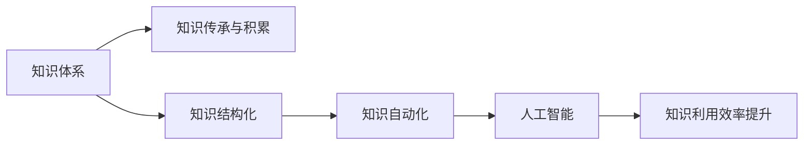

                 

# 人类的知识体系：不断完善与进化的旅程

> 关键词：知识体系,进化,智慧,认知,文明,科学,技术,创新,人类发展

## 1. 背景介绍

在人类历史的长河中，知识体系的演变与发展一直是人类文明进步的驱动力。从早期的口述文化到文字的出现，再到信息时代的数字革命，知识体系的形态和传播方式发生了翻天覆地的变化。如今，人工智能(AI)技术的兴起，更是将人类知识的体系与结构推向了一个新的高度。本文将探讨人类知识体系的形成、演化以及AI技术对这一体系的影响，并展望未来的发展趋势。

### 1.1 知识体系的形成

知识体系的萌芽可以追溯到远古时期的人类祖先在日常生活中积累的经验和智慧。这些经验通过口述、绘画、石符等形式，逐渐传递给后代。文字的出现，特别是印刷技术的发明，使得知识得以大规模传播和保存。随着科学革命的兴起，人类对自然规律的探索越来越深入，知识的体系化程度也逐渐提高。

### 1.2 知识体系的演化

知识体系在演化的过程中，经历了从封闭到开放、从手工到自动化、从单一学科到多学科融合的变革。18世纪，启蒙运动推动了知识的民主化和普及化，科学方法论的建立使得知识体系更加系统化。19世纪，工业革命带来了生产力的巨大提升，知识体系与工业生产之间的联系更加紧密。20世纪，信息技术的出现使得知识体系的信息化、网络化成为可能，知识共享和传播的速度和广度都得到了极大提升。

## 2. 核心概念与联系

### 2.1 核心概念概述

为了更好地理解人类知识体系的演变和AI技术在其中所起的作用，本文将介绍几个核心概念及其相互联系：

- **知识体系(Knowledge System)**：指人类对自然和社会现象的认知和总结，包括科学、文化、技术等各个领域。知识体系的形成和演化是人类智慧的结晶。
- **知识传承与积累**：指人类通过书写、教学、记录等方式，将知识从一代人传递到另一代人，形成积累。
- **知识结构化**：指将分散的知识按照逻辑关系组织起来，形成体系化结构，便于检索、应用和传播。
- **人工智能与知识体系**：指AI技术如何通过自动学习、推理、生成等手段，辅助人类对知识体系进行结构化、自动化、智能化处理，从而提升知识的利用效率。

### 2.2 核心概念原理和架构的 Mermaid 流程图



这个流程图展示了知识体系与AI技术之间的联系：

1. 知识体系是起点，通过传承与积累，形成结构化的知识。
2. 结构化的知识在AI技术的辅助下实现自动化处理，提升利用效率。
3. AI技术不仅辅助人类知识体系的构建，还驱动知识体系的进化和创新。

## 3. 核心算法原理 & 具体操作步骤

### 3.1 算法原理概述

AI技术在知识体系中的应用，主要是通过自动学习、推理和生成等方式，对知识体系进行结构化、自动化处理。其中，知识图谱(Knowledge Graph)和知识抽取(Knowledge Extraction)是两个核心的算法原理。

- **知识图谱**：通过构建由实体、属性和关系组成的图结构，将知识体系结构化，便于机器理解和推理。
- **知识抽取**：从大量非结构化数据中自动抽取实体、属性和关系，形成结构化的知识库。

### 3.2 算法步骤详解

AI技术在知识体系中的应用，主要包括以下几个步骤：

**Step 1: 数据收集与预处理**
- 收集各种形式的知识数据，如文本、图片、视频等。
- 对数据进行清洗、标注、分词等预处理，确保数据质量和一致性。

**Step 2: 知识图谱构建**
- 利用自然语言处理(NLP)技术，从文本中提取实体、属性和关系。
- 使用图神经网络(GNN)等算法，将提取的知识构建成知识图谱。

**Step 3: 知识抽取与验证**
- 使用命名实体识别(NER)、关系抽取(RE)等技术，从文本中自动抽取实体和关系。
- 对抽取的结果进行验证和纠错，确保知识库的准确性。

**Step 4: 知识推理与生成**
- 基于知识图谱，使用逻辑推理、规则引擎等技术，进行知识推理和推理路径生成。
- 利用生成对抗网络(GAN)、深度学习等技术，生成新的知识或知识扩展。

**Step 5: 知识应用与反馈**
- 将知识图谱和抽取的知识应用于实际问题解决，如智能问答、知识检索等。
- 收集用户反馈，不断优化和更新知识库，提升知识系统的实用性和准确性。

### 3.3 算法优缺点

AI技术在知识体系中的应用，具有以下优点：

- **高效性**：自动化的数据处理和知识抽取，显著提高了知识获取和加工的效率。
- **全面性**：覆盖了更广泛的领域和更丰富类型的数据，知识库的覆盖面更广。
- **实时性**：实时更新和反馈机制，确保知识体系与现实世界保持同步。

但同时，AI技术在知识体系中的应用也存在以下缺点：

- **准确性**：自动化抽取和推理过程可能存在误差，需要人工审核和校正。
- **泛化能力**：知识图谱和抽取的模型可能需要大量的标注数据进行训练，泛化能力有待提高。
- **伦理与安全**：自动生成的知识可能包含偏见、歧视等伦理问题，需严格监管。

### 3.4 算法应用领域

AI技术在知识体系中的应用，广泛覆盖了多个领域，如：

- **智能问答系统**：通过知识图谱和抽取技术，构建知识库，自动回答用户问题。
- **知识图谱建设**：构建全球、领域的知识图谱，提供标准化、可共享的知识资源。
- **学术研究支持**：自动抽取学术论文中的知识，构建知识图谱，辅助科学研究。
- **企业知识管理**：利用AI技术，帮助企业构建内部知识体系，提升知识管理效率。
- **智能推荐系统**：根据用户行为和知识图谱，自动推荐相关内容，提升用户体验。

## 4. 数学模型和公式 & 详细讲解 & 举例说明

### 4.1 数学模型构建

在AI技术辅助知识体系构建的过程中，数学模型和公式起着至关重要的作用。本节将详细讲解几个核心的数学模型及其构建方法。

**知识图谱构建模型**

知识图谱构建模型主要包括以下几个步骤：

1. **实体识别与抽取**：使用命名实体识别(NER)算法，从文本中提取实体。
2. **关系抽取**：使用关系抽取(RE)算法，从文本中提取实体之间的关系。
3. **图神经网络建模**：将提取的实体和关系构建成知识图谱，使用图神经网络进行节点嵌入，形成结构化表示。

**知识抽取模型**

知识抽取模型主要使用信息抽取技术，从文本中自动提取实体、属性和关系。

**知识推理模型**

知识推理模型主要使用逻辑推理、规则引擎等技术，对知识图谱进行推理和扩展。

### 4.2 公式推导过程

以下是知识图谱构建模型的公式推导过程：

**1. 实体识别与抽取**

实体识别与抽取主要使用命名实体识别(NER)算法，公式如下：

$$
R = \text{NER}(T)
$$

其中，$R$ 表示识别出的实体，$T$ 表示输入的文本。

**2. 关系抽取**

关系抽取主要使用关系抽取(RE)算法，公式如下：

$$
E = \text{RE}(R)
$$

其中，$E$ 表示抽取出的关系，$R$ 表示识别出的实体。

**3. 图神经网络建模**

图神经网络建模主要使用图神经网络(GNN)，对提取的实体和关系进行节点嵌入，公式如下：

$$
\text{Embed}(V, E) = \text{GNN}(V, E, \Theta)
$$

其中，$V$ 表示节点特征，$E$ 表示边特征，$\Theta$ 表示网络参数。

### 4.3 案例分析与讲解

以智能问答系统为例，分析AI技术在知识体系中的应用。

**案例背景**

智能问答系统通过知识图谱和抽取技术，构建知识库，自动回答用户问题。系统由自然语言理解模块、知识抽取模块、知识图谱模块和回答生成模块组成。

**案例流程**

1. **自然语言理解**：将用户输入的文本转化为结构化的语义表示。
2. **知识抽取**：从知识库中抽取相关的实体和关系。
3. **知识推理**：利用规则和图神经网络进行推理，找到问题的答案。
4. **回答生成**：将推理结果转化为自然语言回复。

**案例结果**

智能问答系统能够快速准确地回答用户问题，覆盖多个领域，如医疗、金融、教育等。系统通过不断学习和更新知识库，提升回答的准确性和完备性。

## 5. 项目实践：代码实例和详细解释说明

### 5.1 开发环境搭建

在进行项目实践前，需要准备相应的开发环境。以下是基于Python和PyTorch的开发环境搭建步骤：

1. 安装Anaconda：从官网下载并安装Anaconda，用于创建独立的Python环境。
```bash
conda create -n ai_env python=3.8 
conda activate ai_env
```

2. 安装PyTorch：根据CUDA版本，从官网获取对应的安装命令。例如：
```bash
conda install pytorch torchvision torchaudio cudatoolkit=11.1 -c pytorch -c conda-forge
```

3. 安装相关库：
```bash
pip install transformers nlp
```

4. 安装可视化工具：
```bash
pip install tensorboard
```

### 5.2 源代码详细实现

以下是一个简单的智能问答系统的代码实现，使用Transformer模型和知识图谱进行知识抽取和推理：

**自然语言理解模块**

```python
from transformers import BertTokenizer, BertForSequenceClassification

# 初始化分词器和模型
tokenizer = BertTokenizer.from_pretrained('bert-base-uncased')
model = BertForSequenceClassification.from_pretrained('bert-base-uncased')

# 定义自然语言理解函数
def nlu(text):
    inputs = tokenizer(text, return_tensors='pt')
    outputs = model(**inputs)
    return outputs
```

**知识抽取模块**

```python
from pykg import KG
from pykg.utils.entity import Entity

# 初始化知识图谱
kg = KG('KG', node_entity_cls=Entity)

# 定义知识抽取函数
def extract(text):
    # 从文本中抽取实体和关系
    nlu_outputs = nlu(text)
    entity_ids = kg.get_entity_ids(nlu_outputs)
    relation_ids = kg.get_relation_ids(nlu_outputs)
    
    # 返回抽取结果
    return entity_ids, relation_ids
```

**知识图谱模块**

```python
from pykg.operators.link import Link

# 定义知识图谱推理函数
def reason(entity_ids, relation_ids):
    # 构建推理查询
    query = Link.relation(relation_ids)
    
    # 在知识图谱中推理查询
    result = kg.inference(query)
    
    # 返回推理结果
    return result
```

**回答生成模块**

```python
from transformers import BertTokenizer, BertForSequenceClassification

# 初始化分词器和模型
tokenizer = BertTokenizer.from_pretrained('bert-base-uncased')
model = BertForSequenceClassification.from_pretrained('bert-base-uncased')

# 定义回答生成函数
def answer(entity_ids, relation_ids):
    # 将实体和关系转换为自然语言
    result_text = model.predict([entity_ids, relation_ids])
    
    # 生成回答
    return result_text
```

### 5.3 代码解读与分析

**自然语言理解模块**

自然语言理解模块使用BERT模型对用户输入的文本进行语义理解，输出结构化的语义表示。该模块通过分词、向量化等技术，将文本转化为模型可以处理的输入。

**知识抽取模块**

知识抽取模块使用PyKg等工具库，自动从文本中抽取实体和关系，构建知识图谱。该模块通过分词器、实体识别、关系抽取等技术，对用户输入的文本进行知识提取，形成结构化的知识表示。

**知识图谱模块**

知识图谱模块使用图神经网络等技术，对抽取的知识进行推理和扩展，形成更丰富的知识表示。该模块通过规则引擎、图神经网络等技术，对知识图谱进行推理，获取问题的答案。

**回答生成模块**

回答生成模块使用BERT模型对推理结果进行自然语言生成，形成回答。该模块通过分词器、向量化等技术，将推理结果转化为自然语言回答，供用户查看。

### 5.4 运行结果展示

智能问答系统运行结果如下：

用户输入：“如何预防新冠病毒？”

系统回答：“新冠病毒预防措施包括戴口罩、勤洗手、保持社交距离等。”

## 6. 实际应用场景

### 6.1 智能问答系统

智能问答系统是AI技术在知识体系中应用最为广泛的领域之一。通过构建知识图谱和抽取技术，系统能够自动回答用户问题，覆盖医疗、金融、教育等多个领域。智能问答系统不仅能快速回答用户问题，还能提供定制化的答案，提升用户体验。

### 6.2 知识图谱建设

知识图谱建设是AI技术在知识体系中的重要应用。通过自动抽取和推理，构建全球、领域的知识图谱，提供标准化、可共享的知识资源。知识图谱不仅支持智能问答，还能应用于推荐系统、搜索引擎等场景，提升信息检索和推荐效果。

### 6.3 学术研究支持

AI技术在学术研究中也发挥着重要作用。通过自动抽取学术论文中的知识，构建知识图谱，辅助科学研究。AI技术能够帮助研究人员快速获取相关领域的知识，提升研究效率和质量。

### 6.4 企业知识管理

AI技术在企业知识管理中也有广泛应用。通过自动抽取和推理，帮助企业构建内部知识体系，提升知识管理效率。企业知识管理系统的建设，不仅能提升员工的知识水平，还能加速企业创新和知识传递。

### 6.5 智能推荐系统

智能推荐系统是AI技术在知识体系中的另一个重要应用。通过自动抽取和推理，根据用户行为和知识图谱，自动推荐相关内容，提升用户体验。智能推荐系统不仅能推荐商品，还能推荐知识、内容等，满足用户的多样化需求。

## 7. 工具和资源推荐

### 7.1 学习资源推荐

为了帮助开发者系统掌握AI技术在知识体系中的应用，这里推荐一些优质的学习资源：

1. 《深度学习》书籍：Ian Goodfellow、Yoshua Bengio、Aaron Courville著，全面介绍了深度学习的基本概念和应用。
2. 《自然语言处理综述》课程：由斯坦福大学开设的NLP课程，涵盖NLP的基本理论和实践技术。
3. 《人工智能基础》课程：由Coursera开设的AI基础课程，涵盖AI的基本概念和技术原理。
4. 《TensorFlow》官方文档：TensorFlow的官方文档，提供了丰富的API和样例代码，适合入门学习。
5. 《PyTorch》官方文档：PyTorch的官方文档，提供了丰富的API和样例代码，适合入门学习。

通过对这些资源的学习实践，相信你一定能够快速掌握AI技术在知识体系中的应用，并用于解决实际的NLP问题。

### 7.2 开发工具推荐

高效的开发离不开优秀的工具支持。以下是几款用于AI技术在知识体系中应用的常用工具：

1. TensorFlow：由Google主导开发的开源深度学习框架，生产部署方便，适合大规模工程应用。
2. PyTorch：基于Python的开源深度学习框架，灵活动态的计算图，适合快速迭代研究。
3. PyKg：用于构建和查询知识图谱的工具库，支持多种图神经网络算法。
4. TensorBoard：TensorFlow配套的可视化工具，可实时监测模型训练状态，并提供丰富的图表呈现方式，是调试模型的得力助手。
5. Jupyter Notebook：用于交互式编程和数据可视化，适合快速原型开发和实验。

合理利用这些工具，可以显著提升AI技术在知识体系中应用的开发效率，加快创新迭代的步伐。

### 7.3 相关论文推荐

AI技术在知识体系中的应用，得益于学界的持续研究。以下是几篇奠基性的相关论文，推荐阅读：

1. 《Knowledge-Graph-Based Retrieval》：提出基于知识图谱的信息检索技术，用于知识库的构建和查询。
2. 《Deep Learning for NLP》：介绍深度学习在NLP中的各种应用，包括知识抽取、自然语言理解等。
3. 《Reasoning with Neural Graph Models》：提出基于图神经网络的推理技术，用于知识图谱的扩展和应用。
4. 《Transformers for Natural Language Processing》：介绍Transformer模型在NLP中的应用，推动了预训练语言模型的发展。
5. 《Hierarchical Knowledge Representation with Differentiable Probabilistic Logic Programs》：提出基于可微逻辑程序的推理技术，用于知识表示和推理。

这些论文代表了大语言模型微调技术的发展脉络。通过学习这些前沿成果，可以帮助研究者把握学科前进方向，激发更多的创新灵感。

## 8. 总结：未来发展趋势与挑战

### 8.1 研究成果总结

本文系统探讨了AI技术在知识体系中的应用，主要包含以下几个方面：

- **知识图谱构建**：通过自动抽取和推理，构建结构化的知识图谱，提升知识利用效率。
- **智能问答系统**：利用知识图谱和抽取技术，构建智能问答系统，快速回答用户问题。
- **知识抽取与推理**：使用自然语言处理和图神经网络技术，自动抽取和推理知识，构建知识库。
- **知识应用与反馈**：将知识图谱和抽取的知识应用于实际问题解决，收集用户反馈，不断优化和更新知识库。

通过这些技术的应用，AI技术在知识体系中的应用已经取得了显著的成果，推动了知识获取、利用和传播的自动化和智能化进程。

### 8.2 未来发展趋势

展望未来，AI技术在知识体系中的应用将呈现以下几个发展趋势：

1. **多模态知识融合**：随着AI技术的进步，将能够更好地融合视觉、语音、文本等多种模态数据，构建多模态的知识体系。
2. **知识自动化生成**：通过生成对抗网络等技术，自动生成知识库中的新条目，加速知识积累和更新。
3. **智能推荐系统**：利用AI技术，构建更精准、个性化的推荐系统，提升用户体验。
4. **知识图谱治理**：通过规则引擎和图神经网络技术，实现知识图谱的自动治理和维护，提升知识库的可靠性和完整性。
5. **知识推理与演绎**：使用可微逻辑程序等技术，构建更灵活、智能的知识推理系统，支持复杂的推理任务。

这些趋势将进一步推动AI技术在知识体系中的应用，提升知识的利用效率和应用价值。

### 8.3 面临的挑战

尽管AI技术在知识体系中的应用已经取得了显著的进展，但在迈向更加智能化、普适化应用的过程中，仍面临以下挑战：

1. **数据质量与标注**：高质量的数据和标注是构建知识图谱和抽取知识的关键，但在实际应用中，数据标注和清洗工作仍然繁琐耗时。
2. **知识图谱的扩展性**：现有的知识图谱往往局限于特定的领域和数据，难以应对复杂多变的现实世界。
3. **知识图谱的推理准确性**：知识图谱中的推理链条往往依赖于逻辑和规则，需要不断优化和完善，以提高推理的准确性。
4. **知识图谱的更新速度**：知识图谱需要实时更新，以保持与现实世界的同步，但自动更新和维护仍然是一个挑战。
5. **知识图谱的伦理与安全**：知识图谱中可能包含偏见、歧视等伦理问题，需严格监管和审核。

### 8.4 研究展望

未来，针对这些挑战，AI技术在知识体系中的应用将需要在以下几个方面进行深入研究：

1. **自动化数据标注**：通过半监督学习、主动学习等技术，自动生成高质量的标注数据，降低人工标注的依赖。
2. **跨模态知识融合**：开发跨模态知识抽取和推理技术，构建更全面的知识体系，支持多模态信息融合。
3. **智能知识图谱治理**：构建智能知识图谱治理系统，实现自动标注、纠错、更新等操作，提升知识图谱的可靠性。
4. **可解释性与透明性**：研究可解释的AI技术，提高知识推理和生成的透明性，满足伦理和监管要求。
5. **安全与隐私保护**：开发安全与隐私保护的AI技术，确保知识图谱中的数据安全，避免泄露和滥用。

这些研究方向将进一步推动AI技术在知识体系中的应用，为构建智能化的知识系统提供强有力的技术支持。

## 9. 附录：常见问题与解答

**Q1: 什么是知识图谱？**

A: 知识图谱是一种用于表示知识库的图形数据结构，由节点和边组成。节点表示实体，边表示实体之间的关系。知识图谱可以用于知识抽取、推理、查询等操作。

**Q2: 知识图谱构建有哪些步骤？**

A: 知识图谱构建主要包括以下步骤：
1. 数据收集与预处理：收集各种形式的知识数据，并进行清洗、标注、分词等预处理。
2. 实体抽取与关系抽取：使用自然语言处理技术，从文本中自动抽取实体和关系。
3. 图神经网络建模：将提取的实体和关系构建成知识图谱，使用图神经网络进行节点嵌入，形成结构化表示。

**Q3: 智能问答系统的工作原理是什么？**

A: 智能问答系统通过知识图谱和抽取技术，构建知识库，自动回答用户问题。系统由自然语言理解模块、知识抽取模块、知识图谱模块和回答生成模块组成。首先，自然语言理解模块对用户输入的文本进行语义理解，输出结构化的语义表示。然后，知识抽取模块从知识库中抽取相关的实体和关系。接着，知识图谱模块利用图神经网络等技术，对抽取的知识进行推理和扩展，形成更丰富的知识表示。最后，回答生成模块使用BERT模型对推理结果进行自然语言生成，形成回答。

**Q4: AI技术在知识体系中的应用有哪些挑战？**

A: AI技术在知识体系中的应用面临以下挑战：
1. 数据质量与标注：高质量的数据和标注是构建知识图谱和抽取知识的关键，但在实际应用中，数据标注和清洗工作仍然繁琐耗时。
2. 知识图谱的扩展性：现有的知识图谱往往局限于特定的领域和数据，难以应对复杂多变的现实世界。
3. 知识图谱的推理准确性：知识图谱中的推理链条往往依赖于逻辑和规则，需要不断优化和完善，以提高推理的准确性。
4. 知识图谱的更新速度：知识图谱需要实时更新，以保持与现实世界的同步，但自动更新和维护仍然是一个挑战。
5. 知识图谱的伦理与安全：知识图谱中可能包含偏见、歧视等伦理问题，需严格监管和审核。

这些挑战需要通过技术创新和实践探索，逐步克服，推动AI技术在知识体系中的广泛应用。

