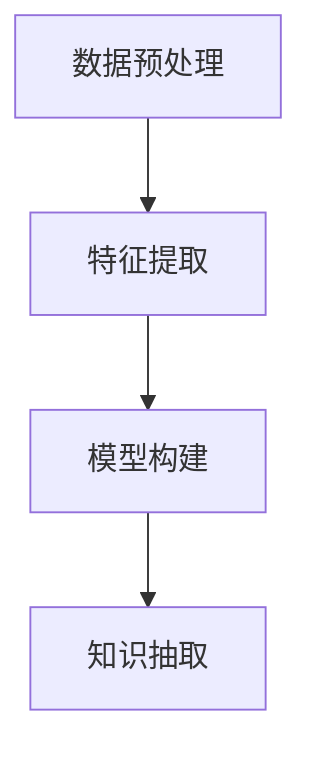

                 

# 人类知识的分类与组织：知识发现引擎的基础

## 1. 背景介绍

### 1.1 问题由来

随着互联网和数字技术的飞速发展，人类产生和积累的知识量急剧增加。从互联网上的无结构文本、多媒体数据到各类科学文献、政府报告，再到企业商业数据和社交网络信息，数据量呈现爆炸式增长。然而，如此海量的数据中，蕴含着无数未知的知识和洞见，如何从海量数据中挖掘出有价值的知识，是当前信息技术领域面临的重大挑战。

### 1.2 问题核心关键点

知识发现（Knowledge Discovery，KD）是指从数据中自动或半自动地发现、抽取、提炼和总结出有用知识和洞见的过程。核心任务包括数据预处理、特征提取、模型构建和知识抽取等多个环节。知识发现引擎（Knowledge Discovery Engine，KDE）作为知识发现的重要工具，在各个领域得到了广泛应用。

在医疗领域，知识发现引擎通过分析医学影像、基因序列等数据，挖掘出新药分子、疾病机理等知识；在金融领域，知识发现引擎利用历史交易数据，预测市场趋势、评估风险等；在零售领域，知识发现引擎分析顾客购买行为，进行商品推荐、价格优化等；在社交网络领域，知识发现引擎通过用户行为数据，挖掘出社交网络的结构和用户群体特征，进行用户兴趣预测和社区推荐。

### 1.3 问题研究意义

知识发现引擎对于高效提取和利用数据中的知识具有重要意义。其核心价值在于：

1. **高效自动化**：通过自动化技术，减少人工分析的时间和成本，加速知识发现过程。
2. **深度洞见**：发现数据中的潜在关联、模式和趋势，产生前所未有的知识洞见。
3. **业务决策**：通过数据驱动的决策支持，帮助企业更好地进行业务决策。
4. **智能应用**：在智能推荐、个性化服务、智能客服等应用中，提升用户体验。
5. **科学研究**：为科学研究提供数据支持和分析工具，推动知识创新。

## 2. 核心概念与联系

### 2.1 核心概念概述

为更好地理解知识发现引擎的基本原理和架构，本节将介绍几个关键核心概念：

- **知识发现引擎（KDE）**：通过自动化技术，从海量数据中抽取、提炼和总结知识的过程。核心任务包括数据预处理、特征提取、模型构建和知识抽取。

- **数据预处理**：对原始数据进行清洗、归一化、抽样、降维等处理，以提高数据质量，为后续的特征提取和模型训练提供基础。

- **特征提取**：从原始数据中提取出有意义的特征，以减少数据维度和提高模型泛化能力。

- **模型构建**：选择合适的机器学习模型进行知识发现。常见的模型包括分类、聚类、回归、关联规则等。

- **知识抽取**：通过模型从数据中抽取知识，如实体关系、模式、趋势等，形成可被应用的洞见。

这些核心概念之间存在紧密的联系和相互作用。数据预处理为特征提取提供基础，特征提取为模型构建提供输入，模型构建为知识抽取提供工具，知识抽取则将数据转化为知识洞见。

### 2.2 核心概念原理和架构的 Mermaid 流程图(Mermaid 流程节点中不要有括号、逗号等特殊字符)



这个流程图展示了知识发现引擎的基本流程：

1. 对原始数据进行预处理，提取特征。
2. 构建机器学习模型，对特征进行建模。
3. 通过模型抽取数据中的知识，形成可应用的知识洞见。

## 3. 核心算法原理 & 具体操作步骤

### 3.1 算法原理概述

知识发现引擎的算法原理主要包括以下几个步骤：

1. **数据预处理**：清洗、归一化、抽样、降维等处理，提高数据质量。
2. **特征提取**：从原始数据中提取出有意义的特征，减少数据维度和提高模型泛化能力。
3. **模型构建**：选择合适的机器学习模型进行知识发现。
4. **知识抽取**：通过模型从数据中抽取知识，形成可应用的洞见。

### 3.2 算法步骤详解

**Step 1: 数据预处理**

数据预处理是知识发现的重要第一步。其目的是清洗、归一化、抽样和降维，提高数据质量。具体步骤如下：

1. **数据清洗**：去除数据中的噪声和异常值，包括重复数据、缺失值、错误数据等。
2. **数据归一化**：将数据缩放到0-1或-1到1的范围内，以便于模型处理。
3. **数据抽样**：从原始数据中抽取一部分数据作为训练集，避免数据过拟合。
4. **数据降维**：通过PCA、SVD等技术，降低数据维度，提高模型训练效率。

**Step 2: 特征提取**

特征提取是从原始数据中提取出有意义的特征，以减少数据维度和提高模型泛化能力。常见的方法包括：

1. **词袋模型**：将文本数据转化为词频向量，用于文本分类和聚类。
2. **TF-IDF**：计算单词在文本中的重要程度，用于文本特征提取。
3. **主题模型**：如LDA、LAT，用于发现文本中的潜在主题。
4. **图像特征提取**：如SIFT、HOG，用于提取图像中的局部特征。
5. **时间序列特征提取**：如滑动窗口、指数平滑，用于时间序列数据的处理。

**Step 3: 模型构建**

模型构建是知识发现的核心步骤，选择合适的机器学习模型至关重要。常见的模型包括：

1. **分类模型**：如决策树、SVM、神经网络等，用于分类任务。
2. **聚类模型**：如K-means、DBSCAN等，用于发现数据中的自然聚类。
3. **回归模型**：如线性回归、随机森林等，用于预测连续数值。
4. **关联规则**：如Apriori算法，用于发现数据中的频繁项集和关联规则。

**Step 4: 知识抽取**

知识抽取是知识发现的最后一步，通过模型从数据中抽取知识，形成可应用的洞见。具体方法包括：

1. **实体抽取**：识别文本中的实体，如人名、地名、机构名等。
2. **关系抽取**：识别文本中的实体之间的关系，如因果关系、时间关系等。
3. **情感分析**：分析文本中的情感倾向，如正面、中性、负面。
4. **趋势分析**：发现数据中的时间趋势，如增长趋势、波动趋势等。

### 3.3 算法优缺点

知识发现引擎的算法具有以下优点：

1. **高效自动化**：通过自动化技术，减少人工分析的时间和成本，加速知识发现过程。
2. **深度洞见**：发现数据中的潜在关联、模式和趋势，产生前所未有的知识洞见。
3. **业务决策**：通过数据驱动的决策支持，帮助企业更好地进行业务决策。
4. **智能应用**：在智能推荐、个性化服务、智能客服等应用中，提升用户体验。
5. **科学研究**：为科学研究提供数据支持和分析工具，推动知识创新。

同时，该算法也存在一些缺点：

1. **数据依赖性强**：需要高质量、完备的数据集，数据获取成本较高。
2. **模型复杂度高**：选择合适的模型和参数设置复杂，需要丰富的领域知识和经验。
3. **计算资源需求高**：模型训练和特征提取需要较高的计算资源和存储资源。
4. **可解释性不足**：部分模型（如深度学习模型）缺乏可解释性，难以解释模型的决策逻辑。
5. **数据偏差问题**：数据偏差可能影响模型的泛化能力和可靠性。

尽管存在这些局限性，知识发现引擎仍然是大数据时代的重要工具，其应用前景广阔。未来需要进一步优化算法，降低对数据的依赖，提高算法的可解释性和可靠性。

### 3.4 算法应用领域

知识发现引擎在多个领域得到了广泛应用，具体如下：

1. **医疗领域**：通过分析医学影像、基因序列等数据，挖掘出新药分子、疾病机理等知识。
2. **金融领域**：利用历史交易数据，预测市场趋势、评估风险等。
3. **零售领域**：分析顾客购买行为，进行商品推荐、价格优化等。
4. **社交网络领域**：通过用户行为数据，挖掘出社交网络的结构和用户群体特征，进行用户兴趣预测和社区推荐。
5. **自然语言处理领域**：通过文本分析，发现语言中的规律和模式，进行文本分类、情感分析等。
6. **图像处理领域**：通过图像特征提取，识别图像中的对象和关系，进行图像分类、目标检测等。

## 4. 数学模型和公式 & 详细讲解 & 举例说明

### 4.1 数学模型构建

本节将使用数学语言对知识发现引擎的算法流程进行更加严格的刻画。

假设原始数据集为 $D=\{x_i\}_{i=1}^N$，其中 $x_i \in \mathcal{X}$ 表示第 $i$ 个样本，$\mathcal{X}$ 为输入空间。

定义特征提取函数为 $\phi: \mathcal{X} \rightarrow \mathcal{F}$，将样本 $x_i$ 映射为特征 $f_i \in \mathcal{F}$。

假设选择 $M$ 个特征 $\{f_j\}_{j=1}^M$ 作为模型的输入，构建机器学习模型 $M: \mathcal{F}^M \rightarrow \mathcal{Y}$，其中 $\mathcal{Y}$ 为输出空间。

模型的损失函数为 $\ell: \mathcal{Y} \times \mathcal{Y} \rightarrow \mathbb{R}$，用于衡量模型预测输出与真实标签之间的差异。

模型的训练目标为：

$$
\theta^* = \mathop{\arg\min}_{\theta} \frac{1}{N} \sum_{i=1}^N \ell(y_i, M(\phi(x_i)))
$$

其中 $\theta$ 为模型参数。

### 4.2 公式推导过程

以分类任务为例，假设模型为神经网络，输出层为softmax函数，则分类损失函数为交叉熵损失：

$$
\ell(y_i, \hat{y}_i) = -\sum_{j=1}^K y_i \log \hat{y}_i^j
$$

其中 $y_i$ 为真实标签，$\hat{y}_i$ 为模型预测输出，$K$ 为类别数。

将损失函数代入训练目标公式，得到：

$$
\theta^* = \mathop{\arg\min}_{\theta} \frac{1}{N} \sum_{i=1}^N \ell(y_i, M(\phi(x_i)))
$$

通过反向传播算法，计算损失函数对模型参数 $\theta$ 的梯度，并使用优化算法更新参数，最小化损失函数。

### 4.3 案例分析与讲解

以金融数据为例，假设要构建一个股票价格预测模型。原始数据集包括股票价格、交易量、公司财报等。

**数据预处理**：去除缺失值和异常值，将数据缩放到0-1范围内，采用滑动窗口技术进行特征提取。

**特征提取**：构建股票价格、交易量、市值、利润等特征向量，进行PCA降维。

**模型构建**：选择神经网络模型，输出层为softmax函数，进行交叉熵损失最小化。

**知识抽取**：通过模型预测股票价格，发现市场趋势和波动规律，进行投资决策。

## 5. 项目实践：代码实例和详细解释说明

### 5.1 开发环境搭建

在进行知识发现引擎的实践前，我们需要准备好开发环境。以下是使用Python进行Scikit-learn开发的开发环境配置流程：

1. 安装Anaconda：从官网下载并安装Anaconda，用于创建独立的Python环境。

2. 创建并激活虚拟环境：
```bash
conda create -n sklearn-env python=3.8 
conda activate sklearn-env
```

3. 安装Scikit-learn：
```bash
conda install scikit-learn
```

4. 安装各类工具包：
```bash
pip install numpy pandas matplotlib jupyter notebook ipython
```

完成上述步骤后，即可在`sklearn-env`环境中开始知识发现引擎的实践。

### 5.2 源代码详细实现

这里我们以K-means聚类为例，给出使用Scikit-learn进行知识发现引擎开发的Python代码实现。

首先，定义数据集和聚类模型：

```python
from sklearn import datasets
from sklearn.cluster import KMeans

# 加载数据集
iris = datasets.load_iris()
X = iris.data
y = iris.target

# 定义聚类模型
kmeans = KMeans(n_clusters=3)
```

然后，执行聚类操作并评估结果：

```python
# 拟合模型
kmeans.fit(X)

# 预测标签
y_pred = kmeans.predict(X)

# 评估结果
from sklearn.metrics import accuracy_score
accuracy = accuracy_score(y, y_pred)
print("Accuracy:", accuracy)
```

最后，可视化聚类结果：

```python
import matplotlib.pyplot as plt
plt.scatter(X[:, 0], X[:, 1], c=y_pred, cmap='viridis')
plt.show()
```

以上就是使用Scikit-learn进行K-means聚类的完整代码实现。可以看到，通过Scikit-learn，开发者可以轻松地实现各种机器学习模型和算法，进行知识发现和数据挖掘。

### 5.3 代码解读与分析

让我们再详细解读一下关键代码的实现细节：

**K-means聚类模型**：
- `datasets.load_iris()`：加载经典的鸢尾花数据集。
- `KMeans(n_clusters=3)`：定义K-means聚类模型，聚类数为3。
- `fit(X)`：拟合模型，对数据进行聚类。
- `predict(X)`：预测数据点所属的聚类类别。

**评估指标**：
- `accuracy_score(y, y_pred)`：计算预测结果与真实标签的准确率。

**可视化**：
- `plt.scatter(X[:, 0], X[:, 1], c=y_pred, cmap='viridis')`：使用matplotlib库绘制聚类结果，聚类结果用颜色表示。

可以看到，Scikit-learn提供了丰富的机器学习算法和工具，极大地方便了知识发现引擎的开发实践。

## 6. 实际应用场景

### 6.1 智能客服系统

知识发现引擎在智能客服系统中的应用非常广泛。传统客服系统依赖人工，响应速度慢，且无法提供24小时不间断服务。利用知识发现引擎，可以自动分析历史客服对话数据，提取常见问题和最佳回答，构建知识库，供智能客服系统调用。

**应用流程**：
1. 收集历史客服对话记录，构建标注数据集。
2. 使用知识发现引擎，如TF-IDF、LDA等，提取问题关键词和答案主题。
3. 构建知识库，包括问题描述和对应的最佳回答。
4. 使用智能客服系统，根据用户输入，匹配最合适的答案，提供即时回复。

**技术挑战**：
1. 数据获取：历史客服数据可能不完整，需要人工标注。
2. 数据质量：对话数据可能包含噪音和干扰，需要进行清洗和预处理。
3. 知识提取：需要构建高效的特征提取和模型训练流程，以提高知识抽取的准确性。

### 6.2 金融舆情监测

金融舆情监测是知识发现引擎的重要应用场景之一。利用知识发现引擎，可以分析社交媒体、新闻、博客等海量文本数据，挖掘市场情绪和舆情变化，预测市场趋势，辅助投资者决策。

**应用流程**：
1. 收集金融领域相关文本数据，进行自然语言处理和特征提取。
2. 使用情感分析、主题建模等技术，挖掘市场情绪和舆情变化。
3. 构建舆情监测系统，实时监测市场情绪变化，及时发出预警。

**技术挑战**：
1. 数据量庞大：金融数据涉及市场、政策、公司财报等多个方面，数据量庞大。
2. 数据分布变化：市场情绪和舆情变化频繁，需要实时更新模型。
3. 模型复杂性：金融领域涉及多种领域知识，模型构建和优化难度大。

### 6.3 个性化推荐系统

个性化推荐系统是知识发现引擎的重要应用领域之一。通过知识发现引擎，可以分析用户行为数据，提取用户兴趣和偏好，推荐相关商品或服务。

**应用流程**：
1. 收集用户行为数据，如浏览记录、购买记录等。
2. 使用知识发现引擎，如协同过滤、关联规则等，发现用户兴趣和行为规律。
3. 构建推荐系统，根据用户兴趣和历史行为，推荐相关商品或服务。

**技术挑战**：
1. 数据隐私：用户行为数据涉及隐私问题，需要保护用户隐私。
2. 数据分布变化：用户兴趣和行为变化频繁，需要实时更新推荐模型。
3. 模型复杂性：推荐模型需要考虑用户特征和商品特征，模型构建和优化难度大。

### 6.4 未来应用展望

随着知识发现引擎技术的不断发展，其在更多领域得到了广泛应用，为各行各业带来了深远影响。

1. **智慧医疗领域**：利用知识发现引擎，可以分析医学影像、基因序列等数据，挖掘新药分子、疾病机理等知识，辅助医生诊断和治疗。

2. **智能教育领域**：通过分析学生学习数据，发现学习规律和行为模式，进行个性化学习推荐，提升学习效果。

3. **智慧城市领域**：通过分析城市交通、环境、人口等数据，发现城市发展规律和趋势，辅助城市规划和管理。

4. **智能制造领域**：利用知识发现引擎，分析生产数据，发现设备故障和生产瓶颈，优化生产流程和设备维护。

5. **智能交通领域**：通过分析交通数据，发现交通规律和模式，优化交通流量和道路规划，减少交通拥堵。

6. **智能物流领域**：利用知识发现引擎，分析物流数据，发现物流规律和瓶颈，优化物流管理和运输路线。

未来，知识发现引擎将在更多领域发挥重要作用，为各行各业带来更高效、智能、精准的解决方案。

## 7. 工具和资源推荐

### 7.1 学习资源推荐

为了帮助开发者系统掌握知识发现引擎的理论基础和实践技巧，这里推荐一些优质的学习资源：

1. 《Pattern Recognition and Machine Learning》书籍：由Christopher Bishop所著，全面介绍了机器学习理论基础和实际应用，是学习知识发现引擎的经典教材。

2. Coursera《机器学习》课程：由Andrew Ng教授主讲，涵盖机器学习的基础和高级内容，是学习知识发现引擎的重要资源。

3. Kaggle竞赛平台：提供丰富的数据集和机器学习竞赛，帮助开发者实践和应用知识发现引擎。

4. GitHub代码库：提供大量开源的机器学习代码，包括数据预处理、特征提取、模型构建和知识抽取等。

通过对这些资源的学习实践，相信你一定能够快速掌握知识发现引擎的精髓，并用于解决实际的NLP问题。

### 7.2 开发工具推荐

高效的开发离不开优秀的工具支持。以下是几款用于知识发现引擎开发的常用工具：

1. Python：通用编程语言，拥有丰富的第三方库和工具，适用于各种数据处理和机器学习任务。

2. Scikit-learn：Python的机器学习库，提供了丰富的分类、聚类、回归、关联规则等算法和工具，适用于知识发现和数据挖掘。

3. TensorFlow：由Google开发的深度学习框架，提供了丰富的神经网络模型和工具，适用于复杂的机器学习任务。

4. PyTorch：由Facebook开发的深度学习框架，提供了灵活的计算图和动态图，适用于各种深度学习任务。

5. Jupyter Notebook：交互式编程工具，支持Python、R等多种编程语言，适用于数据预处理和机器学习实验。

合理利用这些工具，可以显著提升知识发现引擎的开发效率，加快创新迭代的步伐。

### 7.3 相关论文推荐

知识发现引擎的发展得益于学界的持续研究。以下是几篇奠基性的相关论文，推荐阅读：

1. A Framework for Knowledge Discovery (KDD 1998)：提出了知识发现的框架，包括数据预处理、特征提取、模型构建和知识抽取等多个环节。

2. K-Means Clustering Algorithm (IEEE 1977)：提出了K-means聚类算法，成为知识发现中常用的基础算法。

3. Association Rules in Large Databases: A Machine Learning Perspective (KDD 1993)：提出了关联规则学习算法，成为知识发现中的重要工具。

4. Text Mining and Statistical Learning (2009)：全面介绍了文本挖掘和统计学习的基础理论和实际应用，是学习知识发现引擎的重要资源。

5. Deep Learning for NLP (2015)：介绍了深度学习在自然语言处理中的应用，包括文本分类、情感分析、序列建模等任务。

这些论文代表了大数据时代知识发现引擎的发展脉络，帮助研究者掌握前沿知识和研究方法，激发更多的创新灵感。

## 8. 总结：未来发展趋势与挑战

### 8.1 总结

本文对知识发现引擎进行了全面系统的介绍。首先阐述了知识发现引擎的研究背景和意义，明确了其在数据分析和决策支持中的核心价值。其次，从原理到实践，详细讲解了知识发现引擎的算法流程和关键步骤，给出了知识发现引擎的完整代码实现。同时，本文还广泛探讨了知识发现引擎在智能客服、金融舆情、个性化推荐等多个领域的应用前景，展示了知识发现引擎的广阔前景。此外，本文精选了知识发现引擎的学习资源，力求为读者提供全方位的技术指引。

通过本文的系统梳理，可以看到，知识发现引擎在大数据时代具有重要应用价值。其高效自动化、深度洞见、业务决策支持等特点，使其成为各行各业的重要工具。未来，随着大数据技术的进一步发展，知识发现引擎必将在更多领域发挥重要作用，为人类社会带来深远影响。

### 8.2 未来发展趋势

展望未来，知识发现引擎的发展趋势主要包括以下几个方面：

1. **数据驱动的智能决策**：知识发现引擎将更加注重数据驱动的智能决策支持，提供更准确、更全面的决策参考。

2. **深度学习和复杂模型**：深度学习和大规模模型将成为知识发现引擎的重要工具，提高模型的泛化能力和性能。

3. **跨领域知识整合**：知识发现引擎将更加注重跨领域知识的整合，结合符号化的先验知识，形成更加全面、准确的知识模型。

4. **实时性和动态性**：知识发现引擎将更加注重实时性和动态性，能够快速适应数据分布的变化，提供实时的决策支持。

5. **可解释性和可解释性**：知识发现引擎将更加注重模型的可解释性和可解释性，提供透明、可解释的决策过程。

6. **多模态数据整合**：知识发现引擎将更加注重多模态数据的整合，结合视觉、语音、文本等多模态数据，提供更全面的知识发现和决策支持。

这些趋势凸显了知识发现引擎的重要价值，其应用前景广阔。未来，知识发现引擎将在大数据时代发挥更大作用，推动各行各业的智能化进程。

### 8.3 面临的挑战

尽管知识发现引擎已经取得了瞩目成就，但在迈向更加智能化、普适化应用的过程中，它仍面临着诸多挑战：

1. **数据质量问题**：知识发现引擎需要高质量、完备的数据集，数据获取成本较高，数据质量难以保证。

2. **模型复杂度问题**：选择合适的模型和参数设置复杂，需要丰富的领域知识和经验。

3. **计算资源问题**：模型训练和特征提取需要较高的计算资源和存储资源，超大规模数据集和复杂模型的处理难度大。

4. **可解释性问题**：部分模型（如深度学习模型）缺乏可解释性，难以解释模型的决策逻辑，模型透明性不足。

5. **伦理和隐私问题**：知识发现引擎涉及大量数据隐私和伦理问题，需要建立严格的隐私保护和伦理审查机制。

尽管面临这些挑战，知识发现引擎仍然是大数据时代的重要工具，其应用前景广阔。未来需要进一步优化算法，降低对数据的依赖，提高算法的可解释性和可靠性。

### 8.4 研究展望

面向未来，知识发现引擎需要在以下几个方面进行深入研究：

1. **深度学习和复杂模型**：开发更加高效的深度学习模型，提高模型的泛化能力和性能，降低计算资源消耗。

2. **多模态数据整合**：研究多模态数据整合技术，结合视觉、语音、文本等多模态数据，提供更全面的知识发现和决策支持。

3. **实时性和动态性**：研究实时性知识发现技术，能够快速适应数据分布的变化，提供实时的决策支持。

4. **可解释性和可解释性**：研究可解释性知识发现技术，提供透明、可解释的决策过程，增强模型的可信度和可接受性。

5. **隐私保护和伦理审查**：研究隐私保护和伦理审查技术，建立严格的隐私保护和伦理审查机制，确保知识发现引擎的应用合法合规。

这些研究方向的探索，将引领知识发现引擎技术迈向更高的台阶，为构建智能决策支持系统提供重要支撑。面向未来，知识发现引擎需要与其他人工智能技术进行更深入的融合，如知识图谱、因果推理、强化学习等，共同推动知识发现引擎技术的发展。

## 9. 附录：常见问题与解答

**Q1：知识发现引擎是否适用于所有领域？**

A: 知识发现引擎在各个领域都有广泛应用，但需要根据具体领域的特点进行优化。例如，医疗领域需要结合医学知识，金融领域需要考虑市场因素，零售领域需要考虑用户行为，社交网络领域需要考虑社交网络结构等。

**Q2：如何选择合适的特征提取方法？**

A: 选择合适的特征提取方法需要根据具体任务和数据特点进行优化。常见的方法包括词袋模型、TF-IDF、主题模型、图像特征提取等。需要根据数据类型和任务需求进行选择。

**Q3：知识发现引擎面临的主要技术挑战是什么？**

A: 知识发现引擎面临的主要技术挑战包括数据质量、模型复杂度、计算资源、可解释性、伦理和隐私问题等。需要综合考虑这些因素，进行全面优化。

**Q4：知识发现引擎的未来发展方向是什么？**

A: 知识发现引擎的未来发展方向包括深度学习、多模态数据整合、实时性、可解释性、隐私保护等。需要结合这些新技术和新方法，推动知识发现引擎技术的进步。

**Q5：知识发现引擎的应用场景有哪些？**

A: 知识发现引擎在医疗、金融、零售、社交网络、自然语言处理、图像处理等多个领域都有广泛应用，如智能客服、金融舆情监测、个性化推荐、文本分类、图像分类等。

总之，知识发现引擎在多个领域具有重要应用价值，其高效自动化、深度洞见、业务决策支持等特点，使其成为各行各业的重要工具。未来，随着大数据技术的进一步发展，知识发现引擎必将在更多领域发挥重要作用，为人类社会带来深远影响。

---

作者：禅与计算机程序设计艺术 / Zen and the Art of Computer Programming

