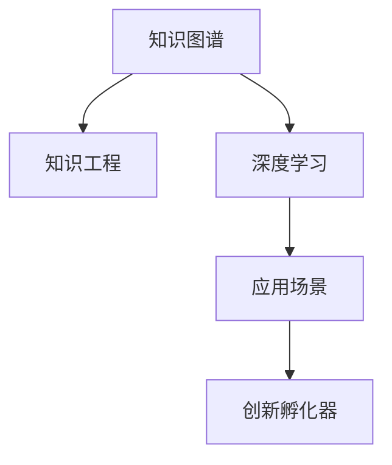

                 

# 人类知识的跨界融合：创新孵化器的作用

> 关键词：跨界融合,知识图谱,知识工程,深度学习,应用场景,创新孵化器

## 1. 背景介绍

### 1.1 问题由来
人类知识的积累和传承，经历了从口耳相传到书写传播、再到互联网普及的漫长历史。知识的融合与创造，一直是推动科技进步和社会发展的核心动力。随着人工智能和大数据技术的发展，人类知识的整合与利用，进入了一个全新的时代。

当前，信息爆炸与知识碎片化的矛盾愈发凸显，传统的知识获取与利用方式，难以满足日益增长的智能需求。如何高效融合各类知识，构建智能化的知识体系，成为迫切需要解决的问题。

### 1.2 问题核心关键点
在知识工程和人工智能的框架下，跨界融合知识、挖掘知识的潜在价值，形成知识网络，成为推动技术创新的重要方式。特别是通过深度学习、知识图谱等前沿技术，能够从海量数据中自动学习知识，构建更加全面、准确的知识体系。这些技术手段，正是知识融合和创新孵化的核心引擎。

### 1.3 问题研究意义
探索人类知识的跨界融合，推动创新孵化器的发展，对于提升科学研究的效率、加速技术创新、构建智能化的知识体系，具有深远的意义：

1. **提升研究效率**：跨界融合的知识能够使研究者快速获取所需信息，加速研究进程。
2. **加速技术创新**：跨界知识能够促进跨领域研究，产生新的技术突破和应用场景。
3. **构建智能知识体系**：通过深度学习等技术，自动构建知识图谱，形成智能化的知识库。
4. **推动知识工程应用**：知识融合能够为知识工程提供更丰富、更全面的知识源，增强知识工程的实际应用效果。
5. **促进跨学科交流**：跨界融合的知识，能够促进不同学科之间的交流和合作，拓展知识视野。

## 2. 核心概念与联系

### 2.1 核心概念概述

为更好地理解知识融合与创新孵化的过程，本节将介绍几个密切相关的核心概念：

- **知识图谱(Knowledge Graph)**：一种结构化的知识表示方式，通过节点和边来构建知识网络，能够直观展示知识间的关联关系。
- **知识工程(Knowledge Engineering)**：将专家知识与人工智能技术结合，构建智能化的知识体系，增强知识的应用价值。
- **深度学习(Deep Learning)**：一种基于神经网络的机器学习技术，通过多层神经网络，自动学习数据的高级特征，能够在复杂场景下取得优秀表现。
- **应用场景(Application Scenarios)**：知识融合与创新孵化，具体的应用场景包括智能问答、知识检索、个性化推荐、智能医疗、智能制造等。
- **创新孵化器(Innovation Incubators)**：通过提供技术、资源、网络等多方面的支持，帮助创新项目从构思到落地的平台和机制。

这些核心概念之间的逻辑关系可以通过以下Mermaid流程图来展示：



这个流程图展示了几类核心概念及其之间的关系：

1. 知识图谱通过构建知识网络，为知识工程提供直观的知识关联。
2. 深度学习通过自动学习特征，为知识工程提供强大的数据分析能力。
3. 应用场景通过具体实例，验证知识融合与创新的价值和效果。
4. 创新孵化器通过多方面支持，加速知识融合与创新项目的转化和落地。

## 3. 核心算法原理 & 具体操作步骤

### 3.1 算法原理概述

知识融合与创新孵化器，主要依赖深度学习、知识图谱等技术手段，构建智能化的知识体系，并在此基础上推动创新项目的孵化。其核心思想是：

- **知识抽取与融合**：利用自然语言处理(NLP)、图像识别、语音识别等技术，从海量数据中抽取知识片段，并利用知识图谱等方法，进行知识融合和关联。
- **深度学习建模**：使用深度学习模型对抽取的知识进行自动化处理，形成更加准确、全面的知识表示。
- **应用场景适配**：将融合后的知识应用于具体的业务场景中，通过微调、优化等方法，提升应用效果。
- **创新孵化**：通过创新孵化器的平台支持，帮助创新项目从概念验证到落地实施，提供技术、资金、市场等多方面的支持。

### 3.2 算法步骤详解

知识融合与创新孵化器的一般流程包括：

**Step 1: 数据采集与清洗**
- 采集各领域的原始数据，包括文本、图片、音频等。
- 进行数据清洗和预处理，去除噪声、填补缺失值等。

**Step 2: 知识抽取与表示**
- 利用NLP技术，对文本数据进行分词、实体识别、关系抽取等操作，形成知识片段。
- 利用知识图谱等工具，将知识片段转化为结构化的三元组。

**Step 3: 深度学习建模**
- 使用深度学习模型对知识图谱进行嵌入表示，形成稠密向量。
- 利用注意力机制、图神经网络等方法，对知识图谱进行结构建模。

**Step 4: 知识融合与关联**
- 对不同领域、不同类型的知识进行合并和融合，形成统一的知识体系。
- 利用跨领域嵌入、多模态融合等技术，提升知识的泛化能力和应用范围。

**Step 5: 应用场景适配**
- 针对具体的业务场景，设计合适的应用模型。
- 利用微调等方法，优化模型参数，提高模型性能。

**Step 6: 创新孵化**
- 在创新孵化器平台中，提供技术、资金、市场等多方面支持。
- 通过原型验证、项目评审等机制，帮助创新项目从概念到落地。

### 3.3 算法优缺点

知识融合与创新孵化器具有以下优点：

1. **高效准确**：深度学习与知识图谱等技术，能够自动学习知识和关联，大大提升知识融合的效率和准确性。
2. **全面覆盖**：跨领域、多模态的知识融合，能够构建更加全面、准确的智能化知识体系。
3. **应用广泛**：适配不同应用场景，能够产生多样化的创新应用，如智能问答、知识检索、个性化推荐等。

同时，该方法也存在一定的局限性：

1. **数据依赖性强**：知识融合与创新的效果很大程度上依赖高质量的数据采集和清洗。
2. **技术复杂度高**：深度学习、知识图谱等技术，需要较高的专业知识和实现难度。
3. **模型泛化能力有限**：深度学习模型在不同领域和场景中，可能存在泛化能力不足的问题。
4. **创新风险高**：知识融合与创新的成功率具有不确定性，失败的项目可能会带来资源浪费。

尽管存在这些局限性，但就目前而言，基于深度学习与知识图谱的知识融合与创新孵化器，仍是目前最先进和有效的方法。未来相关研究的重点在于如何进一步降低技术复杂度，提高模型的泛化能力，同时保障创新项目的成功率。

### 3.4 算法应用领域

知识融合与创新孵化器在多个领域都有广泛的应用：

- **智能问答**：通过知识图谱和深度学习模型，智能回答用户的查询，如IBM的Watson。
- **知识检索**：利用知识图谱和自然语言处理技术，从海量数据中快速检索相关知识，如Clarifai。
- **个性化推荐**：结合用户行为数据和知识图谱，提供个性化的推荐服务，如Amazon的推荐系统。
- **智能医疗**：通过整合医学知识库，辅助医生进行诊断和治疗，如IBM Watson Health。
- **智能制造**：结合制造领域的知识图谱，实现智能生产过程管理，如SAP的智能制造平台。

除了上述这些经典应用外，知识融合与创新孵化器还被应用于更多场景中，如智慧城市、金融风控、教育培训等，为各行各业带来新的变革和机遇。

## 4. 数学模型和公式 & 详细讲解 & 举例说明

### 4.1 数学模型构建

知识融合与创新孵化器涉及多种数学模型，包括知识图谱嵌入、深度学习网络、应用场景适配等。这里以知识图谱嵌入为例，进行详细讲解。

记知识图谱为 $\mathcal{G} = (\mathcal{V}, \mathcal{E}, \mathcal{R})$，其中 $\mathcal{V}$ 为节点集合，$\mathcal{E}$ 为边集合，$\mathcal{R}$ 为关系集合。假设知识图谱中节点的嵌入表示为 $\mathbf{e}_v \in \mathbb{R}^{d}$，边的嵌入表示为 $\mathbf{e}_e \in \mathbb{R}^{d}$。

知识图谱的嵌入表示目标是最小化节点嵌入和边嵌入的L2损失，即：

$$
\min_{\mathbf{e}_v, \mathbf{e}_e} \sum_{(v, e, v') \in \mathcal{G}} ||\mathbf{e}_v - \mathbf{e}_{v'}||^2
$$

常用的知识图谱嵌入模型包括TransE、DistMult、ComplEx等。以ComplEx模型为例，其目标函数可以表示为：

$$
\min_{\mathbf{e}_v, \mathbf{e}_e, \mathbf{e}_r} \sum_{(v, e, v') \in \mathcal{G}} ||\mathbf{e}_v - \mathbf{e}_{v'} - \mathbf{e}_e (\mathbf{e}_r^T \cdot \mathbf{e}_r)||^2
$$

其中 $\mathbf{e}_r$ 为关系嵌入，$\cdot$ 为点积运算。

### 4.2 公式推导过程

知识图谱嵌入的目标函数可以通过梯度下降等优化算法求解，其具体步骤如下：

1. 对于每条边 $(v, e, v')$，计算节点 $v$ 和 $v'$ 的嵌入表示误差：
   $$
   \delta_v = \mathbf{e}_v - \mathbf{e}_{v'} - \mathbf{e}_e (\mathbf{e}_r^T \cdot \mathbf{e}_r)
   $$
2. 计算梯度 $\frac{\partial \delta_v}{\partial \mathbf{e}_v}, \frac{\partial \delta_v}{\partial \mathbf{e}_e}, \frac{\partial \delta_v}{\partial \mathbf{e}_r}$，利用反向传播算法求得。
3. 根据梯度下降算法更新模型参数：
   $$
   \mathbf{e}_v \leftarrow \mathbf{e}_v - \eta \frac{\partial \delta_v}{\partial \mathbf{e}_v}
   $$
   $$
   \mathbf{e}_e \leftarrow \mathbf{e}_e - \eta \frac{\partial \delta_v}{\partial \mathbf{e}_e}
   $$
   $$
   \mathbf{e}_r \leftarrow \mathbf{e}_r - \eta \frac{\partial \delta_v}{\partial \mathbf{e}_r}
   $$

其中 $\eta$ 为学习率，需根据具体问题进行调整。

### 4.3 案例分析与讲解

以IBM Watson为例，其通过知识图谱嵌入和深度学习模型，实现了智能问答和诊断。具体步骤如下：

1. **数据采集**：采集医学领域的论文、报告、病例等数据。
2. **知识抽取**：利用NLP技术，从文本中抽取症状、疾病、治疗等信息，形成知识片段。
3. **知识融合**：将抽取的知识片段进行合并和关联，构建医学知识图谱。
4. **深度学习建模**：利用神经网络模型对知识图谱进行嵌入表示，形成稠密向量。
5. **应用场景适配**：针对医生和患者的咨询，设计合适的问答模型，通过微调优化模型参数，提高回答准确性。
6. **创新孵化**：通过Watson平台，为医疗机构提供技术支持和用户反馈，不断优化系统性能。

Watson的案例展示了知识融合与创新孵化器的强大应用潜力，能够极大地提升医疗服务的智能化水平。

## 5. 项目实践：代码实例和详细解释说明

### 5.1 开发环境搭建

在进行知识融合与创新孵化器的项目实践前，我们需要准备好开发环境。以下是使用Python进行PyTorch开发的环境配置流程：

1. 安装Anaconda：从官网下载并安装Anaconda，用于创建独立的Python环境。

2. 创建并激活虚拟环境：
```bash
conda create -n kg-env python=3.8 
conda activate kg-env
```

3. 安装PyTorch：根据CUDA版本，从官网获取对应的安装命令。例如：
```bash
conda install pytorch torchvision torchaudio cudatoolkit=11.1 -c pytorch -c conda-forge
```

4. 安装其他必要的库：
```bash
pip install numpy pandas scikit-learn tensorflow keras jupyter notebook ipython
```

完成上述步骤后，即可在`kg-env`环境中开始知识融合与创新孵化器的项目实践。

### 5.2 源代码详细实现

下面我们以医学领域的知识图谱嵌入为例，给出使用PyTorch进行深度学习建模的代码实现。

首先，定义知识图谱的数据结构：

```python
class GraphNode:
    def __init__(self, entity):
        self.entity = entity
        self.neighbors = []
        
class KnowledgeGraph:
    def __init__(self, nodes, edges, relations):
        self.nodes = nodes
        self.edges = edges
        self.relations = relations

    def add_edge(self, src, dst, rel):
        src.neighbors.append((dst, rel))
        dst.neighbors.append((src, rel))
```

然后，定义深度学习模型：

```python
from torch import nn
from torch.nn import functional as F

class KnowledgeGraphEmbedding(nn.Module):
    def __init__(self, embed_dim, num_entities, num_relations):
        super(KnowledgeGraphEmbedding, self).__init__()
        self.entity_embeddings = nn.Embedding(num_entities, embed_dim)
        self.relation_embeddings = nn.Embedding(num_relations, embed_dim)
        self.linear1 = nn.Linear(embed_dim, embed_dim)
        self.linear2 = nn.Linear(embed_dim, embed_dim)
        self.linear3 = nn.Linear(embed_dim, 1)

    def forward(self, node实体ID, relationID):
        entity_embeddings = self.entity_embeddings(node实体ID)
        relation_embeddings = self.relation_embeddings(relationID)
        h = F.relu(self.linear1(entity_embeddings + relation_embeddings))
        h = self.linear2(h)
        h = self.linear3(h)
        return h
```

接着，定义训练函数：

```python
from torch.utils.data import DataLoader
from tqdm import tqdm

def train(model, graph, num_epochs, batch_size, learning_rate):
    optimizer = torch.optim.Adam(model.parameters(), lr=learning_rate)
    for epoch in range(num_epochs):
        model.train()
        for batch in DataLoader(graph.edges, batch_size):
            node实体ID, relationID = batch
            optimizer.zero_grad()
            loss = model(node实体ID, relationID)
            loss.backward()
            optimizer.step()
        print(f"Epoch {epoch+1}, loss: {loss:.3f}")
```

最后，启动训练流程：

```python
num_entities = len(graph.nodes)
num_relations = len(graph.relations)
embed_dim = 128

model = KnowledgeGraphEmbedding(embed_dim, num_entities, num_relations)
train(model, graph, num_epochs=10, batch_size=16, learning_rate=1e-3)
```

以上就是使用PyTorch进行医学知识图谱嵌入的代码实现。可以看到，借助深度学习技术，我们可以自动学习知识图谱的嵌入表示，为知识融合与创新孵化器提供强有力的数据基础。

### 5.3 代码解读与分析

让我们再详细解读一下关键代码的实现细节：

**KnowledgeGraph类**：
- 定义知识图谱的数据结构，包括节点、边和关系。
- `add_edge`方法：添加边到知识图谱中，并更新源节点和目标节点的邻居关系。

**KnowledgeGraphEmbedding类**：
- 定义知识图谱的深度学习模型，使用多层神经网络进行知识嵌入。
- `forward`方法：定义前向传播过程，对每个节点和关系进行嵌入表示，并通过多层线性变换输出预测结果。

**train函数**：
- 定义训练过程，使用随机梯度下降法优化模型参数。
- `DataLoader`：批量加载数据，方便模型训练。
- `optimizer.zero_grad`：清空梯度，避免参数累积。
- `loss.backward`：反向传播计算梯度。
- `optimizer.step`：更新模型参数。

**训练流程**：
- 定义模型的初始参数，调用训练函数。
- 在每个epoch内，对数据集进行迭代训练，并打印损失值。
- 在训练结束后，保存模型的参数，准备应用到具体的业务场景中。

可以看到，PyTorch提供了一套灵活的框架，可以方便地实现深度学习模型，并进行训练和优化。知识融合与创新孵化器的项目实践，通过利用PyTorch的强大功能，能够高效地构建和优化知识图谱嵌入模型。

## 6. 实际应用场景

### 6.1 智能问答系统

智能问答系统是知识融合与创新孵化器的重要应用场景之一。通过知识图谱和深度学习模型，智能问答系统能够自动回答用户的问题，提升用户体验和系统效率。

在技术实现上，知识图谱负责存储领域知识，深度学习模型负责对用户查询进行理解和匹配。系统通过查询知识图谱，自动生成答案，并在用户体验层面进行优化。智能问答系统已被广泛应用于客服中心、教育培训、健康咨询等多个领域，成为智能化服务的核心。

### 6.2 知识检索系统

知识检索系统通过知识图谱和自然语言处理技术，从海量数据中快速检索相关信息。通过知识融合与创新孵化器，知识检索系统能够自动构建知识图谱，提升检索的准确性和相关性。

在实际应用中，知识检索系统被广泛用于搜索引擎、图书馆管理、资料库查询等场景。通过优化查询算法和知识表示，知识检索系统能够显著提升信息获取的速度和效率，减少用户查找信息的成本。

### 6.3 个性化推荐系统

个性化推荐系统利用知识图谱和深度学习模型，根据用户的历史行为和兴趣，推荐相关的物品或内容。通过知识融合与创新孵化器，推荐系统能够自动学习用户的兴趣和需求，提供更加精准和多样化的推荐服务。

在实际应用中，个性化推荐系统被广泛用于电商、新闻、视频等多个领域。通过融合用户行为数据和知识图谱，推荐系统能够提高用户的满意度和粘性，带来更高的转化率和收益。

### 6.4 未来应用展望

随着知识图谱和深度学习技术的不断进步，知识融合与创新孵化器将在更多领域得到应用，为各行各业带来新的变革和机遇。

在智慧城市治理中，知识融合与创新孵化器能够辅助城市管理者进行数据分析和决策，提升城市管理的智能化水平。在智能制造中，通过融合制造领域的知识图谱，能够实现智能生产过程管理，提高生产效率和质量。在金融风控中，知识融合与创新孵化器能够自动构建金融知识图谱，辅助进行风险评估和预测。

除了上述这些经典应用外，知识融合与创新孵化器还被应用于更多场景中，如智能教育、智能交通、智能农业等，为各行各业带来新的应用和突破。

## 7. 工具和资源推荐

### 7.1 学习资源推荐

为了帮助开发者系统掌握知识融合与创新孵化器的理论基础和实践技巧，这里推荐一些优质的学习资源：

1. 《Knowledge Graphs: Concepts, Technologies and Applications》书籍：系统介绍了知识图谱的基本概念、构建方法和应用场景。
2. 《Deep Learning for Knowledge Graphs》课程：斯坦福大学开设的深度学习课程，介绍了如何使用深度学习技术进行知识图谱嵌入和知识融合。
3. 《Knowledge Graphs for Industry and Science》论文：综述了知识图谱在工业和科学中的应用案例和最新研究成果。
4. 《Knowledge Graph Embeddings》论文：总结了知识图谱嵌入的多种算法和实现方法，具有很高的参考价值。
5. 《Knowledge Graphs: A Practical Introduction》视频：YouTube上的知识图谱系列视频，适合入门学习。

通过对这些资源的学习实践，相信你一定能够快速掌握知识融合与创新孵化器的精髓，并用于解决实际的NLP问题。

### 7.2 开发工具推荐

高效的知识融合与创新孵化器开发，离不开优秀的工具支持。以下是几款用于知识图谱和深度学习开发的常用工具：

1. PyTorch：基于Python的开源深度学习框架，灵活动态的计算图，适合快速迭代研究。大部分知识图谱和深度学习模型都有PyTorch版本的实现。
2. TensorFlow：由Google主导开发的开源深度学习框架，生产部署方便，适合大规模工程应用。同样有丰富的知识图谱和深度学习模型资源。
3. Neo4j：一款高性能的图数据库，支持丰富的图算法和可视化工具，适合构建大规模知识图谱。
4. Gephi：一款开源的网络分析软件，能够可视化知识图谱的结构和关系，帮助分析知识图谱中的关键节点和路径。
5. ELK Stack：包括Elasticsearch、Logstash和Kibana，适合构建基于知识图谱的搜索和分析系统。
6. Apache Jena：一款开源的知识管理系统，支持多种知识图谱标准和查询语言，适合构建知识图谱应用。

合理利用这些工具，可以显著提升知识融合与创新孵化器的开发效率，加快创新迭代的步伐。

### 7.3 相关论文推荐

知识融合与创新孵化器的研究源于学界的持续研究。以下是几篇奠基性的相关论文，推荐阅读：

1. "Semantic Accuracy in Large-Scale Knowledge Graphs"：分析了知识图谱在工业中的应用效果，提出了提升知识图谱准确性的方法。
2. "Knowledge Graph Embeddings"：总结了知识图谱嵌入的多种算法和实现方法，具有很高的参考价值。
3. "Knowledge-Graph-Based Recommender Systems"：介绍了知识图谱在推荐系统中的应用，展示了知识融合的强大潜力。
4. "Towards Knowledge-Driven Semantic Web"：探讨了知识图谱在语义网中的应用，提出了构建知识驱动的智能Web系统的方法。
5. "A Survey on Knowledge Graphs and Their Applications"：综述了知识图谱的基本概念、构建方法和应用场景，适合入门学习。

这些论文代表了大语言模型微调技术的发展脉络。通过学习这些前沿成果，可以帮助研究者把握学科前进方向，激发更多的创新灵感。

## 8. 总结：未来发展趋势与挑战

### 8.1 总结

本文对知识融合与创新孵化器进行了全面系统的介绍。首先阐述了知识图谱和深度学习的基本概念和融合方法，明确了知识融合与创新孵化的核心引擎。其次，从原理到实践，详细讲解了知识融合与创新孵化器的数学模型和操作步骤，给出了知识图谱嵌入的代码实现。同时，本文还广泛探讨了知识融合与创新孵化器在智能问答、知识检索、个性化推荐等多个领域的应用前景，展示了其巨大的应用潜力。

通过本文的系统梳理，可以看到，知识融合与创新孵化器在大规模数据和深度学习技术的基础上，能够高效构建和利用知识图谱，推动智能化应用的实现。未来，伴随知识图谱和深度学习技术的不断演进，知识融合与创新孵化器必将在更多领域得到应用，为各行各业带来新的变革和机遇。

### 8.2 未来发展趋势

展望未来，知识融合与创新孵化器将呈现以下几个发展趋势：

1. **知识图谱的自动化构建**：随着自动抽取、实体识别等技术的进步，知识图谱的构建将更加自动化和高效化。
2. **深度学习模型的可解释性**：知识图谱与深度学习模型的结合，将带来更好的可解释性，帮助用户理解模型的决策过程。
3. **多模态知识融合**：结合视觉、语音、文本等多种模态数据，构建更加全面、准确的知识图谱。
4. **知识图谱与大数据的结合**：通过知识图谱和大数据技术，构建更全面、实时更新的知识库。
5. **知识图谱的实时更新与维护**：通过增量学习等技术，知识图谱能够实时更新和维护，保持其时效性和准确性。

这些趋势凸显了知识融合与创新孵化器的广阔前景。这些方向的探索发展，必将进一步提升知识图谱和深度学习模型的应用效果，为构建智能化的知识体系提供更坚实的技术基础。

### 8.3 面临的挑战

尽管知识融合与创新孵化器技术已经取得了一定进展，但在迈向更加智能化、普适化应用的过程中，仍面临诸多挑战：

1. **数据依赖性强**：知识融合与创新的效果很大程度上依赖高质量的数据采集和清洗。如何获取并处理海量数据，仍是重要问题。
2. **技术复杂度高**：知识图谱和深度学习等技术，需要较高的专业知识和实现难度。如何降低技术门槛，普及知识融合与创新技术，仍需努力。
3. **模型泛化能力有限**：深度学习模型在不同领域和场景中，可能存在泛化能力不足的问题。如何提高模型的泛化能力和适应性，仍需进一步研究。
4. **资源消耗高**：知识图谱和深度学习模型对计算资源和存储资源的需求较高，如何降低计算和存储成本，仍需优化。
5. **隐私和安全问题**：知识图谱和深度学习模型的应用，涉及大量敏感数据和隐私信息，如何保障数据安全和隐私保护，仍需加强。

尽管存在这些挑战，但通过学界和产业界的共同努力，相信知识融合与创新孵化器必将在未来迈向更加成熟和普及，成为推动智能化应用的重要引擎。

### 8.4 研究展望

面对知识融合与创新孵化器所面临的种种挑战，未来的研究需要在以下几个方面寻求新的突破：

1. **自动化数据采集与清洗**：利用NLP、图像识别等技术，自动化采集和清洗数据，降低人工干预的复杂度。
2. **高效知识表示与推理**：结合逻辑推理、图神经网络等方法，提升知识图谱的推理能力和表示效率。
3. **多模态融合技术**：结合视觉、语音、文本等多种模态数据，构建更加全面、准确的智能知识体系。
4. **知识图谱的实时更新机制**：引入增量学习、在线学习等方法，实现知识图谱的实时更新和维护。
5. **隐私保护与数据安全**：采用差分隐私、联邦学习等技术，保障知识图谱和深度学习模型的隐私和安全。

这些研究方向的探索，必将引领知识融合与创新孵化器技术迈向更高的台阶，为构建智能化的知识体系提供更强大的技术支持。面向未来，知识融合与创新孵化器需要与其他人工智能技术进行更深入的融合，如知识表示、因果推理、强化学习等，共同推动人工智能技术的发展和应用。

## 9. 附录：常见问题与解答

**Q1：知识融合与创新孵化器的主要技术手段是什么？**

A: 知识融合与创新孵化器主要依赖深度学习、知识图谱等技术手段，构建智能化的知识体系，并在此基础上推动创新项目的孵化。深度学习用于自动学习知识特征，知识图谱用于构建知识网络，形成结构化的知识表示。

**Q2：知识融合与创新孵化器的主要应用场景有哪些？**

A: 知识融合与创新孵化器在多个领域都有广泛的应用，包括智能问答、知识检索、个性化推荐、智能医疗、智能制造等。具体应用场景如IBM Watson、Amazon推荐系统、Google知识图谱等。

**Q3：知识融合与创新孵化器在数据采集与清洗方面有哪些建议？**

A: 知识融合与创新孵化器对数据采集与清洗有较高要求。建议采用自动抽取、实体识别等技术，提高数据采集效率和质量。同时，对数据进行去重、标准化处理，去除噪声和冗余信息。

**Q4：如何提升知识图谱的推理能力？**

A: 提升知识图谱的推理能力，可以采用以下方法：
1. 结合逻辑推理，引入先验知识，提高推理的准确性。
2. 使用图神经网络等方法，学习节点和边的关系，增强推理能力。
3. 引入增量学习、在线学习等技术，实现知识图谱的实时更新和维护。

**Q5：如何保障知识图谱和深度学习模型的隐私与安全？**

A: 保障知识图谱和深度学习模型的隐私与安全，可以采用以下方法：
1. 差分隐私：对数据进行扰动处理，保护个人隐私。
2. 联邦学习：在分布式环境中，对模型进行联合训练，保护数据隐私。
3. 数据加密：对敏感数据进行加密存储和传输，保障数据安全。

这些方法可以有效保障知识图谱和深度学习模型的隐私与安全，确保数据应用的安全性。

