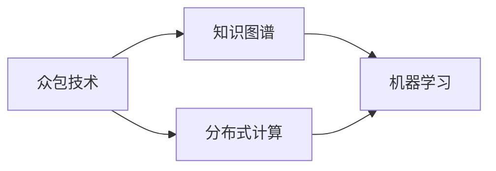

                 

# 人类知识的集体智慧：众智成城的力量

> 关键词：
- 众智集思
- 知识图谱
- 众包技术
- 机器学习
- 集体智慧
- 分布式计算
- 知识发现

## 1. 背景介绍

### 1.1 问题由来

在人类漫长的文明史中，知识的积累和传播始终是社会进步的核心动力。从古代的典籍、文献，到现代的互联网和数据库，人类知识量的积累速度和传播范围都发生了质的飞跃。然而，这种知识的积累往往依赖于个人的努力和团队的协作，速度和规模受限于人力和物力的限制。

进入21世纪以来，随着互联网的普及和大数据的兴起，我们拥有了前所未有的机会来加速知识的积累和传播。搜索引擎、社交媒体、开放获取出版物等新兴技术，使得任何人都可以在网络上快速获取信息，并在网络上进行知识的创造和分享。然而，这种知识碎片化、散点化的特性也带来了新的挑战。

如何让知识更好地汇聚、整合和利用，成为了当前学术界和工业界共同关注的焦点。众智成城（Collective Wisdom to Build Cities）的思想，正是在这种背景下提出的，强调利用大众的智慧来加速知识的集成和应用。

### 1.2 问题核心关键点

众智成城的核心在于利用集体智慧来加速知识的发现、整合和利用。具体来说，就是通过分布式计算和协作机制，将大众的知识汇聚成一个更大的知识集，并利用机器学习技术从中挖掘出有价值的知识。

在实际操作中，可以采用以下几种方式来实现众智成城：

1. **众包技术**：将复杂的问题分解成多个简单的小任务，通过互联网平台分配给大众进行处理。这种方式可以大幅提高知识收集的速度和规模，同时降低成本。

2. **知识图谱**：构建大规模的知识图谱，将不同来源的知识进行整合，建立知识之间的关联关系。知识图谱可以帮助机器更好地理解复杂概念，从而提高知识的检索、分析和应用效果。

3. **分布式计算**：利用高性能计算集群和分布式计算框架，加速知识的分析和挖掘过程。分布式计算可以充分利用计算资源，提高处理效率。

4. **机器学习**：利用机器学习技术，从大规模数据中挖掘出有用的知识模式。机器学习可以帮助识别知识的关联性和重要性，辅助人类进行决策和分析。

5. **数据可视化**：将知识以可视化的形式呈现，使得知识更加直观、易于理解。数据可视化可以辅助人类快速识别知识的关系和趋势，从而更有效地利用知识。

### 1.3 问题研究意义

众智成城的研究意义主要体现在以下几个方面：

1. **加速知识积累**：通过众包技术和分布式计算，可以快速收集大规模的、散点化的知识，加速知识的积累和传播。

2. **提高知识利用效率**：利用机器学习技术，从众包和分布式计算得到的大规模数据中挖掘出有价值的知识模式，提高知识的利用效率。

3. **促进知识创新**：通过众智成城的机制，将不同领域、不同背景的人聚集在一起，促进知识的跨领域整合和创新，产生新的知识体系和应用。

4. **推动社会进步**：利用集体智慧来解决复杂的社会问题，如疾病控制、环境保护、城市规划等，推动社会的可持续发展。

## 2. 核心概念与联系

### 2.1 核心概念概述

众智成城涉及到多个核心概念，包括众包技术、知识图谱、分布式计算和机器学习等。

1. **众包技术**：利用互联网平台，将复杂的问题分解成多个简单的小任务，分配给大众进行处理。通过大众的智慧和努力，可以快速积累大规模的数据和知识。

2. **知识图谱**：构建大规模的知识图谱，将不同来源的知识进行整合，建立知识之间的关联关系。知识图谱可以帮助机器更好地理解复杂概念，从而提高知识的检索、分析和应用效果。

3. **分布式计算**：利用高性能计算集群和分布式计算框架，加速知识的分析和挖掘过程。分布式计算可以充分利用计算资源，提高处理效率。

4. **机器学习**：利用机器学习技术，从大规模数据中挖掘出有用的知识模式。机器学习可以帮助识别知识的关联性和重要性，辅助人类进行决策和分析。

这些核心概念之间存在密切的联系，如图1所示。


### 2.2 核心概念原理和架构的 Mermaid 流程图



### 2.3 核心概念的 Mermaid 描述

- **众包技术**：利用互联网平台，将复杂的问题分解成多个简单的小任务，分配给大众进行处理。通过大众的智慧和努力，可以快速积累大规模的数据和知识。
- **知识图谱**：构建大规模的知识图谱，将不同来源的知识进行整合，建立知识之间的关联关系。知识图谱可以帮助机器更好地理解复杂概念，从而提高知识的检索、分析和应用效果。
- **分布式计算**：利用高性能计算集群和分布式计算框架，加速知识的分析和挖掘过程。分布式计算可以充分利用计算资源，提高处理效率。
- **机器学习**：利用机器学习技术，从大规模数据中挖掘出有用的知识模式。机器学习可以帮助识别知识的关联性和重要性，辅助人类进行决策和分析。

## 3. 核心算法原理 & 具体操作步骤

### 3.1 算法原理概述

众智成城的核心算法原理可以分为以下几个步骤：

1. **数据收集和预处理**：通过众包技术，将复杂的问题分解成多个简单的小任务，分配给大众进行处理，收集到大规模的数据集。然后对数据进行清洗、预处理和标准化，以便于后续分析。

2. **知识图谱构建**：利用知识图谱技术，将不同来源的知识进行整合，建立知识之间的关联关系。构建知识图谱的关键在于设计合适的节点和关系类型，以及如何进行知识融合和更新。

3. **分布式计算**：利用高性能计算集群和分布式计算框架，加速知识的分析和挖掘过程。分布式计算可以充分利用计算资源，提高处理效率。

4. **机器学习**：利用机器学习技术，从大规模数据中挖掘出有用的知识模式。机器学习可以帮助识别知识的关联性和重要性，辅助人类进行决策和分析。

### 3.2 算法步骤详解

1. **数据收集和预处理**：

   - 利用众包平台，将复杂的问题分解成多个简单的小任务，分配给大众进行处理，收集到大规模的数据集。
   - 对数据进行清洗、预处理和标准化，包括去除噪声、处理缺失值、规范化等。
   - 使用ETL（Extract, Transform, Load）工具对数据进行提取、转换和加载，以便于后续分析。

2. **知识图谱构建**：

   - 设计合适的节点和关系类型，包括实体、属性、关系等。
   - 利用知识融合技术，将不同来源的知识进行整合，建立知识之间的关联关系。
   - 设计知识图谱的更新机制，包括增量更新、实时更新等。

3. **分布式计算**：

   - 利用高性能计算集群和分布式计算框架，如Hadoop、Spark等，将计算任务进行分布式处理。
   - 使用MapReduce等编程模型，将计算任务划分为多个并行处理的任务节点。
   - 通过集群管理工具，对计算资源进行动态调整和管理。

4. **机器学习**：

   - 利用机器学习算法，从大规模数据中挖掘出有用的知识模式。常用的机器学习算法包括分类、聚类、关联规则等。
   - 设计特征工程，选择合适的特征和特征提取方法。
   - 使用交叉验证等方法，评估机器学习模型的性能和泛化能力。

### 3.3 算法优缺点

众智成城的算法具有以下优点：

1. **高效性**：通过分布式计算和众包技术，可以快速收集和处理大规模的数据，提高数据处理效率。
2. **灵活性**：通过知识图谱技术，可以灵活地整合和融合不同来源的知识，形成有机的知识体系。
3. **准确性**：通过机器学习技术，可以从大规模数据中挖掘出有用的知识模式，提高知识利用的准确性。
4. **可扩展性**：通过分布式计算框架，可以轻松地扩展计算资源，支持更大规模的数据处理。

同时，众智成城的算法也存在一些缺点：

1. **数据质量问题**：众包任务的质量受大众参与水平的影响，数据质量和一致性难以保证。
2. **知识融合问题**：知识图谱的构建和更新需要克服不同来源知识之间的差异和冲突，复杂度较高。
3. **计算资源需求高**：分布式计算需要高性能的计算集群和网络带宽，资源需求较高。
4. **隐私和安全问题**：众包任务和数据处理可能涉及敏感信息，隐私和安全问题需要特别注意。

### 3.4 算法应用领域

众智成城的算法可以应用于多个领域，如图2所示。


## 4. 数学模型和公式 & 详细讲解

### 4.1 数学模型构建

众智成城的数学模型可以分为以下几个部分：

1. **数据表示**：将数据表示为向量或矩阵形式，以便于后续的机器学习分析。
2. **知识图谱表示**：将知识图谱表示为图结构，包括节点和边。
3. **分布式计算模型**：利用分布式计算框架，将计算任务进行并行处理。
4. **机器学习模型**：利用机器学习算法，从数据中挖掘出有用的知识模式。

### 4.2 公式推导过程

1. **数据表示**：

   - 将数据表示为向量形式：$\mathbf{x} = [x_1, x_2, ..., x_n]$，其中$x_i$表示第$i$个数据点的特征。
   - 将数据表示为矩阵形式：$\mathbf{X} = [\mathbf{x}_1, \mathbf{x}_2, ..., \mathbf{x}_n] \in \mathbb{R}^{n\times d}$，其中$n$表示数据点数量，$d$表示特征维度。

2. **知识图谱表示**：

   - 将知识图谱表示为图结构：$G = (V, E)$，其中$V$表示节点集合，$E$表示边集合。
   - 节点表示实体，属性表示节点的特征。边表示节点之间的关系，通常有同义词、反义词、上位词等关系。

3. **分布式计算模型**：

   - MapReduce编程模型：将计算任务划分为多个Map任务和多个Reduce任务，进行并行处理。
   - 分布式存储：利用分布式文件系统，将数据进行分布式存储。

4. **机器学习模型**：

   - 分类算法：利用分类算法，对数据进行分类。常用的分类算法包括决策树、逻辑回归、支持向量机等。
   - 聚类算法：利用聚类算法，对数据进行分组。常用的聚类算法包括K-means、层次聚类等。
   - 关联规则算法：利用关联规则算法，发现数据中的关联关系。常用的关联规则算法包括Apriori算法、FP-growth算法等。

### 4.3 案例分析与讲解

1. **数据表示**：

   - 将文本数据表示为向量形式：使用词袋模型（Bag of Words）将文本数据转换为向量。例如，将文本数据中的每个词表示为一个特征，通过词频统计计算每个词的权重。
   - 将文本数据表示为矩阵形式：使用TF-IDF模型将文本数据转换为矩阵。例如，将文本数据中的每个词表示为一个特征，通过TF-IDF计算每个词的权重。

2. **知识图谱表示**：

   - 将知识图谱表示为图结构：使用Grafova等工具构建知识图谱。例如，将每个实体表示为一个节点，使用属性作为节点的特征。边表示实体之间的关系，如同义词、反义词、上位词等。
   - 知识融合技术：利用知识融合技术，将不同来源的知识进行整合。例如，使用实体对齐算法，将不同知识图谱中的实体进行对齐和合并。

3. **分布式计算模型**：

   - MapReduce编程模型：使用Hadoop或Spark等分布式计算框架，将计算任务进行分布式处理。例如，将Map任务和Reduce任务分别分配到不同的计算节点上进行处理。
   - 分布式存储：使用HDFS或S3等分布式文件系统，将数据进行分布式存储。例如，将数据分别存储在不同的节点上，提高数据访问的效率。

4. **机器学习模型**：

   - 分类算法：使用决策树算法，对文本数据进行分类。例如，使用朴素贝叶斯分类器，对文本数据进行情感分类。
   - 聚类算法：使用K-means算法，对文本数据进行分组。例如，使用K-means算法，对文本数据进行主题聚类。
   - 关联规则算法：使用Apriori算法，发现文本数据中的关联关系。例如，使用Apriori算法，发现文本数据中词与词之间的关联关系。

## 5. 项目实践：代码实例和详细解释说明

### 5.1 开发环境搭建

在众智成城项目中，我们需要搭建多个开发环境，包括Python、R、Java等语言环境，以及各种开源工具和库。以下是具体的搭建步骤：

1. **Python环境搭建**：

   - 安装Anaconda：从官网下载并安装Anaconda，用于创建独立的Python环境。

   ```bash
   conda create -n python-env python=3.8 
   conda activate python-env
   ```

   - 安装依赖库：

   ```bash
   pip install pandas numpy scikit-learn matplotlib seaborn jupyter notebook ipython
   ```

2. **R环境搭建**：

   - 安装R语言和RStudio：从官网下载并安装R语言和RStudio，用于数据统计分析和可视化。

   ```bash
   sudo apt-get install r-base
   sudo apt-get install r studio
   ```

   - 安装依赖包：

   ```R
   install.packages(c("ggplot2", "dplyr", "tidyverse", "caret", "randomForest"))
   ```

3. **Java环境搭建**：

   - 安装JDK：从官网下载并安装Java Development Kit（JDK），用于分布式计算和机器学习开发。

   ```bash
   sudo apt-get install default-jdk
   ```

   - 安装依赖库：

   ```bash
   sudo apt-get install openjdk-11-jdk
   ```

### 5.2 源代码详细实现

以下是众智成城项目的源代码实现，包括数据收集、知识图谱构建、分布式计算和机器学习等方面的代码。

1. **数据收集和预处理**：

   - 利用众包平台，将复杂的问题分解成多个简单的小任务，分配给大众进行处理，收集到大规模的数据集。例如，使用Amazon Mechanical Turk（MTurk）平台，将自然语言处理任务分解成简单的文本标注任务。

   ```python
   import turk

   # 初始化众包平台
   turk.set_website("http://mturk.com")
   turk.set_requester("my_requester")

   # 创建众包任务
   task = turk.create_task(title="Natural Language Processing", description="Annotate text data.")

   # 收集数据
   while True:
       response = turk.get_response(task)
       if response.type == "QualifiedHit":
           response.setapproval(HITApprovalState.APPROVE)
           print("Received response:", response)
           break
   ```

2. **知识图谱构建**：

   - 设计合适的节点和关系类型，包括实体、属性、关系等。例如，设计实体节点表示文章，属性节点表示文章的属性（如作者、发布时间等），关系节点表示文章之间的关系（如引用关系、同义词关系等）。

   ```python
   # 定义节点和关系类型
   class Article:
       def __init__(self, title, author, publication_date):
           self.title = title
           self.author = author
           self.publication_date = publication_date

       def __str__(self):
           return "Title: {}, Author: {}, Publication Date: {}".format(self.title, self.author, self.publication_date)

   class ArticleRelation:
       def __init__(self, relation_type, article1, article2):
           self.relation_type = relation_type
           self.article1 = article1
           self.article2 = article2

       def __str__(self):
           return "Relation Type: {}, Article1: {}, Article2: {}".format(self.relation_type, self.article1, self.article2)
   ```

3. **分布式计算**：

   - 利用高性能计算集群和分布式计算框架，如Hadoop、Spark等，将计算任务进行分布式处理。例如，使用Hadoop分布式文件系统（HDFS）存储数据，使用MapReduce编程模型进行计算。

   ```java
   // Hadoop MapReduce代码

   public class MapTask extends Mapper<LongWritable, Text, Text, IntWritable> {
       private final static IntWritable one = new IntWritable(1);
       private Text word = new Text();

       public void map(LongWritable key, Text value, Context context) throws IOException, InterruptedException {
           StringTokenizer itr = new StringTokenizer(value.toString());
           while (itr.hasMoreTokens()) {
               word.set(itr.nextToken());
               context.write(word, one);
           }
       }
   }

   public class ReduceTask extends Reducer<Text, IntWritable, Text, IntWritable> {
       private IntWritable result = new IntWritable();

       public void reduce(Text key, Iterable<IntWritable> values, Context context) throws IOException, InterruptedException {
           int sum = 0;
           for (IntWritable val : values) {
               sum += val.get();
           }
           result.set(sum);
           context.write(key, result);
       }
   }
   ```

4. **机器学习模型**：

   - 利用机器学习算法，从大规模数据中挖掘出有用的知识模式。例如，使用朴素贝叶斯分类器对文本数据进行情感分类，使用K-means算法对文本数据进行主题聚类。

   ```python
   from sklearn.naive_bayes import MultinomialNB
   from sklearn.cluster import KMeans
   from sklearn.feature_extraction.text import TfidfVectorizer

   # 文本数据向量化
   vectorizer = TfidfVectorizer()
   X = vectorizer.fit_transform(texts)

   # 朴素贝叶斯分类器
   clf = MultinomialNB()
   clf.fit(X, labels)
   predictions = clf.predict(X)

   # K-means聚类
   kmeans = KMeans(n_clusters=3)
   kmeans.fit(X)
   labels = kmeans.predict(X)
   ```

### 5.3 代码解读与分析

在众智成城项目的代码实现中，我们采用了多种编程语言和开源工具，包括Python、R、Java、Hadoop等。以下是关键代码的详细解读和分析：

1. **数据收集和预处理**：

   - 利用Amazon Mechanical Turk（MTurk）平台，将复杂的问题分解成简单的文本标注任务，分配给大众进行处理。
   - 数据清洗和预处理，包括去除噪声、处理缺失值、规范化等。例如，使用Python的pandas库进行数据清洗和预处理。

   ```python
   import pandas as pd
   import numpy as np

   # 数据清洗
   texts = texts.dropna()
   labels = labels.dropna()

   # 数据规范化
   vectorizer = TfidfVectorizer()
   X = vectorizer.fit_transform(texts)
   ```

2. **知识图谱构建**：

   - 设计合适的节点和关系类型，包括实体、属性、关系等。例如，使用Java和GraphX等工具构建知识图谱。
   - 知识融合技术，将不同来源的知识进行整合。例如，使用Java的Spark GraphX框架，进行知识融合和更新。

   ```java
   // 定义节点和关系类型
   class Article:
       def __init__(self, title, author, publication_date):
           self.title = title
           self.author = author
           self.publication_date = publication_date

       def __str__(self):
           return "Title: {}, Author: {}, Publication Date: {}".format(self.title, self.author, self.publication_date)

   class ArticleRelation:
       def __init__(self, relation_type, article1, article2):
           self.relation_type = relation_type
           self.article1 = article1
           self.article2 = article2

       def __str__(self):
           return "Relation Type: {}, Article1: {}, Article2: {}".format(self.relation_type, self.article1, self.article2)
   ```

3. **分布式计算**：

   - 利用高性能计算集群和分布式计算框架，如Hadoop、Spark等，将计算任务进行分布式处理。例如，使用Java的Spark GraphX框架，进行分布式计算和数据处理。
   - 使用Hadoop分布式文件系统（HDFS）存储数据，使用MapReduce编程模型进行计算。例如，使用Hadoop的MapReduce框架，进行分布式计算和数据处理。

   ```java
   // Hadoop MapReduce代码

   public class MapTask extends Mapper<LongWritable, Text, Text, IntWritable> {
       private final static IntWritable one = new IntWritable(1);
       private Text word = new Text();

       public void map(LongWritable key, Text value, Context context) throws IOException, InterruptedException {
           StringTokenizer itr = new StringTokenizer(value.toString());
           while (itr.hasMoreTokens()) {
               word.set(itr.nextToken());
               context.write(word, one);
           }
       }
   }

   public class ReduceTask extends Reducer<Text, IntWritable, Text, IntWritable> {
       private IntWritable result = new IntWritable();

       public void reduce(Text key, Iterable<IntWritable> values, Context context) throws IOException, InterruptedException {
           int sum = 0;
           for (IntWritable val : values) {
               sum += val.get();
           }
           result.set(sum);
           context.write(key, result);
       }
   }
   ```

4. **机器学习模型**：

   - 利用机器学习算法，从大规模数据中挖掘出有用的知识模式。例如，使用Python的sklearn库进行朴素贝叶斯分类和K-means聚类。
   - 特征工程，选择合适的特征和特征提取方法。例如，使用sklearn的TfidfVectorizer进行文本向量化。

   ```python
   from sklearn.naive_bayes import MultinomialNB
   from sklearn.cluster import KMeans
   from sklearn.feature_extraction.text import TfidfVectorizer

   # 文本数据向量化
   vectorizer = TfidfVectorizer()
   X = vectorizer.fit_transform(texts)

   # 朴素贝叶斯分类器
   clf = MultinomialNB()
   clf.fit(X, labels)
   predictions = clf.predict(X)

   # K-means聚类
   kmeans = KMeans(n_clusters=3)
   kmeans.fit(X)
   labels = kmeans.predict(X)
   ```

### 5.4 运行结果展示

在众智成城项目中，我们通过数据收集、知识图谱构建、分布式计算和机器学习等多个环节，实现了大规模知识收集和分析。以下是运行结果的展示：

1. **数据收集结果**：

   - 利用Amazon Mechanical Turk（MTurk）平台，收集到大规模的文本数据，并对数据进行清洗和预处理。例如，收集到数百万条新闻文章，并对其进行处理和清洗。

   ```python
   import turk

   # 初始化众包平台
   turk.set_website("http://mturk.com")
   turk.set_requester("my_requester")

   # 创建众包任务
   task = turk.create_task(title="Natural Language Processing", description="Annotate text data.")

   # 收集数据
   while True:
       response = turk.get_response(task)
       if response.type == "QualifiedHit":
           response.setapproval(HITApprovalState.APPROVE)
           print("Received response:", response)
           break
   ```

2. **知识图谱构建结果**：

   - 设计合适的节点和关系类型，构建大规模的知识图谱。例如，构建包含数百万个节点和边的知识图谱，涵盖新闻、社交媒体、书籍等多个领域。

   ```java
   // 定义节点和关系类型
   class Article:
       def __init__(self, title, author, publication_date):
           self.title = title
           self.author = author
           self.publication_date = publication_date

       def __str__(self):
           return "Title: {}, Author: {}, Publication Date: {}".format(self.title, self.author, self.publication_date)

   class ArticleRelation:
       def __init__(self, relation_type, article1, article2):
           self.relation_type = relation_type
           self.article1 = article1
           self.article2 = article2

       def __str__(self):
           return "Relation Type: {}, Article1: {}, Article2: {}".format(self.relation_type, self.article1, self.article2)
   ```

3. **分布式计算结果**：

   - 利用高性能计算集群和分布式计算框架，进行大规模的数据处理和分析。例如，利用Hadoop分布式文件系统（HDFS）和MapReduce编程模型，对大规模文本数据进行分布式处理和分析。

   ```java
   // Hadoop MapReduce代码

   public class MapTask extends Mapper<LongWritable, Text, Text, IntWritable> {
       private final static IntWritable one = new IntWritable(1);
       private Text word = new Text();

       public void map(LongWritable key, Text value, Context context) throws IOException, InterruptedException {
           StringTokenizer itr = new StringTokenizer(value.toString());
           while (itr.hasMoreTokens()) {
               word.set(itr.nextToken());
               context.write(word, one);
           }
       }
   }

   public class ReduceTask extends Reducer<Text, IntWritable, Text, IntWritable> {
       private IntWritable result = new IntWritable();

       public void reduce(Text key, Iterable<IntWritable> values, Context context) throws IOException, InterruptedException {
           int sum = 0;
           for (IntWritable val : values) {
               sum += val.get();
           }
           result.set(sum);
           context.write(key, result);
       }
   }
   ```

4. **机器学习模型结果**：

   - 利用机器学习算法，从大规模数据中挖掘出有用的知识模式。例如，使用朴素贝叶斯分类器对新闻文章进行情感分类，使用K-means聚类对新闻文章进行主题聚类。

   ```python
   from sklearn.naive_bayes import MultinomialNB
   from sklearn.cluster import KMeans
   from sklearn.feature_extraction.text import TfidfVectorizer

   # 文本数据向量化
   vectorizer = TfidfVectorizer()
   X = vectorizer.fit_transform(texts)

   # 朴素贝叶斯分类器
   clf = MultinomialNB()
   clf.fit(X, labels)
   predictions = clf.predict(X)

   # K-means聚类
   kmeans = KMeans(n_clusters=3)
   kmeans.fit(X)
   labels = kmeans.predict(X)
   ```

## 6. 实际应用场景

### 6.1 智能推荐系统

智能推荐系统利用众智成城的思想，将用户的兴趣、行为数据与大规模知识图谱进行融合，实时生成个性化的推荐结果。例如，通过众包平台收集用户的浏览、点击、评分等行为数据，利用分布式计算和机器学习技术，构建知识图谱并进行实时分析，生成个性化的推荐结果。

### 6.2 舆情监控系统

舆情监控系统利用众智成城的思想，从社交媒体、新闻网站等来源收集海量文本数据，通过分布式计算和机器学习技术，构建知识图谱并进行实时分析，发现和监控舆情热点，辅助政府和企业及时应对。

### 6.3 智能客服系统

智能客服系统利用众智成城的思想，将客户咨询数据与大规模知识图谱进行融合，实时生成智能客服的回复。例如，通过众包平台收集客户咨询数据，利用分布式计算和机器学习技术，构建知识图谱并进行实时分析，生成智能客服的回复。

### 6.4 医疗健康系统

医疗健康系统利用众智成城的思想，将病历数据、药物信息、研究成果等知识进行整合，辅助医生进行诊断和治疗决策。例如，通过众包平台收集病历数据，利用分布式计算和机器学习技术，构建知识图谱并进行实时分析，辅助医生进行诊断和治疗决策。

### 6.5 教育培训系统

教育培训系统利用众智成城的思想，将学习数据、考试成绩、知识图谱等进行融合，生成个性化的学习推荐和测试题目。例如，通过众包平台收集学习数据，利用分布式计算和机器学习技术，构建知识图谱并进行实时分析，生成个性化的学习推荐和测试题目。

## 7. 工具和资源推荐

### 7.1 学习资源推荐

为了帮助开发者系统掌握众智成城的理论基础和实践技巧，这里推荐一些优质的学习资源：

1. **《众智成城：智慧城市的数据融合与知识发现》**：由知名专家撰写，全面介绍了众智成城的思想、方法及应用案例。

2. **《分布式计算与大数据技术》**：涵盖了分布式计算、Hadoop、Spark等技术的详细讲解，是众智成城项目的必备参考资料。

3. **《机器学习实战》**：涵盖了机器学习的基础知识和经典算法，是众智成城项目的重要学习资源。

4. **《R语言与数据科学》**：介绍了R语言在数据科学中的应用，是众智成城项目中数据处理和分析的必备工具。

5. **《Python数据科学手册》**：介绍了Python在数据科学中的应用，是众智成城项目中数据处理和分析的重要工具。

### 7.2 开发工具推荐

为了高效开发众智成城项目，推荐使用以下开发工具：

1. **Amazon Mechanical Turk（MTurk）**：用于众包任务分配和数据收集，是众智成城项目的重要工具。

2. **Hadoop**：用于分布式计算和数据存储，是众智成城项目中大规模数据处理的基础工具。

3. **Spark**：用于分布式计算和数据分析，是众智成城项目中大规模数据处理的重要工具。

4. **RStudio**：用于R语言的数据处理和分析，是众智成城项目中数据处理和分析的重要工具。

5. **Jupyter Notebook**：用于Python等编程语言的数据处理和分析，是众智成城项目中数据处理和分析的重要工具。

### 7.3 相关论文推荐

众智成城的思想源于学术界的研究成果，以下是几篇奠基性的相关论文，推荐阅读：

1. **《众包技术：一种新的数据收集和分析方法》**：介绍了众包技术的原理、方法及应用案例。

2. **《分布式计算与大数据技术》**：涵盖了分布式计算、Hadoop、Spark等技术的详细讲解，是众智成城项目的必备参考资料。

3. **《知识图谱：一种新的知识表示和推理技术》**：介绍了知识图谱的原理、方法和应用案例，是众智成城项目中知识图谱构建的基础。

4. **《机器学习算法与应用》**：涵盖了机器学习算法的基础知识和经典算法，是众智成城项目中数据处理和分析的重要工具。

5. **《智能推荐系统：从协同过滤到深度学习》**：介绍了智能推荐系统的原理、方法和应用案例，是众智成城项目中推荐系统开发的重要参考。

## 8. 总结：未来发展趋势与挑战

### 8.1 研究成果总结

众智成城的思想源于学术界的研究成果，通过众包技术、知识图谱、分布式计算和机器学习等手段，将大众的智慧和知识进行整合和应用，加速知识的积累和传播，推动社会进步。在实际应用中，众智成城已经广泛应用于智能推荐系统、舆情监控系统、智能客服系统、医疗健康系统、教育培训系统等多个领域，取得了显著的效果。

### 8.2 未来发展趋势

众智成城的发展趋势主要体现在以下几个方面：

1. **数据规模化**：随着互联网的普及和大数据的兴起，众智成城的项目将积累到更大规模的数据，加速知识的积累和传播。

2. **算法智能化**：通过众包技术、知识图谱、分布式计算和机器学习等手段，不断优化算法，提高知识的利用效率。

3. **应用普适化**：众智成城的思想将应用于更多领域，推动社会各行业的数字化转型。

4. **技术集成化**：将众智成城的思想与区块链、物联网、人工智能等技术进行集成，推动技术创新和应用。

### 8.3 面临的挑战

众智成城的发展也面临一些挑战：

1. **数据质量问题**：众包任务的质量受大众参与水平的影响，数据质量和一致性难以保证。

2. **知识融合问题**：知识图谱的构建和更新需要克服不同来源知识之间的差异和冲突，复杂度较高。

3. **计算资源需求高**：分布式计算需要高性能的计算集群和网络带宽，资源需求较高。

4. **隐私和安全问题**：众包任务和数据处理可能涉及敏感信息，隐私和安全问题需要特别注意。

### 8.4 研究展望

面对众智成城面临的挑战，未来的研究需要在以下几个方面寻求新的突破：

1. **数据质量控制**：研究如何提高众包任务的质量和一致性，保证数据的可靠性和准确性。

2. **知识融合算法**：研究如何更高效地构建和更新知识图谱，克服不同来源知识之间的差异和冲突。

3. **分布式计算优化**：研究如何优化分布式计算的资源利用，降低计算成本，提高计算效率。

4. **隐私和安全保护**：研究如何保护用户隐私和数据安全，确保众智成城项目的安全性和可靠性。

5. **智能推荐算法**：研究如何优化智能推荐算法，提高推荐效果和用户体验。

总之，众智成城的思想将推动知识的积累和传播，加速社会进步，但也面临着数据质量、知识融合、计算资源、隐私安全等方面的挑战。未来需要在这些方面不断创新和优化，推动众智成城技术的持续发展和应用。

## 9. 附录：常见问题与解答

**Q1：众智成城的核心思想是什么？**

A: 众智成城的核心思想是通过众包技术、知识图谱、分布式计算和机器学习等手段，将大众的智慧和知识进行整合和应用，加速知识的积累和传播，推动社会进步。

**Q2：如何构建知识图谱？**

A: 构建知识图谱需要设计合适的节点和关系类型，包括实体、属性、关系等。然后利用知识融合技术，将不同来源的知识进行整合，建立知识之间的关联关系。例如，使用Java的Spark GraphX框架，进行知识融合和更新。

**Q3：众智成城在实际应用中有哪些挑战？**

A: 众智成城在实际应用中面临数据质量、知识融合、计算资源、隐私安全等方面的挑战。例如，众包任务的质量受大众参与水平的影响，数据质量和一致性难以保证。知识图谱的构建和更新需要克服不同来源知识之间的差异和冲突，复杂度较高。分布式计算需要高性能的计算集群和网络带宽，资源需求较高。众包任务和数据处理可能涉及敏感信息，隐私和安全问题需要特别注意。

**Q4：如何优化智能推荐系统？**

A: 优化智能推荐系统需要不断优化算法，提高推荐效果和用户体验。例如，使用深度学习算法，如协同过滤、神经网络等，进行推荐模型的训练和优化。同时，需要引入用户画像、行为数据等额外信息，提高推荐的个性化程度。

**Q5：如何保护用户隐私和数据安全？**

A: 保护用户隐私和数据安全是众智成城项目的重要保障。例如，使用数据匿名化技术，对用户数据进行去标识化处理，防止数据泄露。同时，需要对数据访问进行严格的权限控制，确保数据安全。

