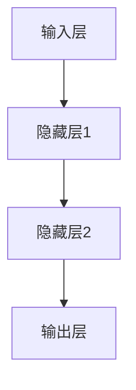
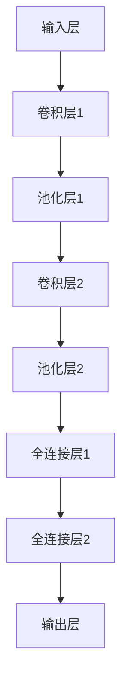

                 

# 人类计算的未来：趋势、机遇与挑战

## 1. 背景介绍

### 1.1 问题由来
随着人工智能(AI)技术的飞速发展，人类计算的方式正在经历一场深刻的变革。从简单的自动化任务到复杂的数据分析、决策支持，AI在各行各业的应用日益广泛，极大地提升了效率和准确性。然而，AI也带来了新的挑战，诸如数据隐私、模型可解释性、伦理安全等问题日益凸显。

### 1.2 问题核心关键点
未来人类计算的发展趋势可以从以下几个方面来探讨：

- **自动化程度提升**：越来越多的繁琐、重复性工作将被自动化系统取代，从而释放人类劳动力的潜力。
- **数据驱动决策**：AI将利用海量数据进行深度学习和预测，辅助人类在决策过程中更准确、更全面地理解复杂问题。
- **跨领域融合**：AI技术将在医疗、教育、金融、制造业等多个领域深度融合，带来新的业务模式和技术突破。
- **伦理和社会影响**：AI的普及将对就业、隐私保护、伦理决策等方面产生深远影响，需要相应的法律和伦理框架来规范。

## 2. 核心概念与联系

### 2.1 核心概念概述

为了更好地理解未来人类计算的发展方向，本节将介绍几个关键概念及其相互关系：

- **人工智能(AI)**：利用计算机模拟人类智能过程的技术，包括学习、推理、规划、知识表示等能力。AI技术正在逐步渗透到各个行业，推动产业智能化升级。

- **机器学习(ML)**：通过数据驱动的算法训练模型，使机器能够从经验中学习和改进。是AI技术的重要组成部分，广泛应用于数据分析、预测、分类、聚类等任务。

- **深度学习(Deep Learning, DL)**：一种基于神经网络的机器学习方法，通过多层次的特征提取和抽象，解决复杂的非线性问题。深度学习在大规模数据上表现出色，成为当前AI研究的热点。

- **增强学习(Reinforcement Learning, RL)**：通过智能体与环境的交互，学习最优决策策略的机器学习方法。广泛应用于自动驾驶、游戏AI等领域。

- **自然语言处理(NLP)**：研究计算机如何理解和生成人类语言的技术。NLP在智能客服、翻译、情感分析、文本生成等方面应用广泛。

- **计算机视觉(CV)**：研究如何让计算机“看”的任务，包括图像识别、目标检测、图像生成等。CV技术在自动驾驶、安防监控、医疗影像分析等领域具有重要应用。

这些核心概念共同构成了人工智能的基石，推动了AI技术在不同领域的应用和创新。

### 2.2 核心概念原理和架构的 Mermaid 流程图

```mermaid
graph TB
    A[人工智能(AI)] --> B[机器学习(ML)]
    A --> C[深度学习(DL)]
    A --> D[增强学习(RL)]
    A --> E[自然语言处理(NLP)]
    A --> F[计算机视觉(CV)]
```

此图展示了人工智能的核心组成部分及其相互关系。机器学习、深度学习、增强学习、自然语言处理和计算机视觉分别构成了AI技术的不同分支，它们在实际应用中相互协同，共同推动AI技术的发展。

## 3. 核心算法原理 & 具体操作步骤
### 3.1 算法原理概述

未来人类计算的核心在于如何利用AI技术进行自动化和智能化决策。其基本原理是通过算法对海量数据进行分析和建模，从中提取有用信息，辅助人类做出更准确的决策。

具体来说，基于AI的未来计算流程包括数据收集、预处理、模型训练、推理预测等步骤。以深度学习模型为例，其工作原理可以概括为：

1. **数据收集与预处理**：从各种来源获取数据，并进行清洗、归一化、特征提取等预处理工作，准备模型训练所需的数据集。
2. **模型构建与训练**：选择适当的模型架构和损失函数，使用训练数据对模型进行优化，使其能够捕捉数据中的规律和模式。
3. **模型推理与评估**：将待预测数据输入训练好的模型，通过前向传播计算预测结果，并评估模型性能，调整模型参数以提高预测准确性。

### 3.2 算法步骤详解

以下是对深度学习模型的具体训练和推理过程的详细介绍：

#### 3.2.1 模型选择与架构设计
- **网络结构设计**：选择合适的深度神经网络架构，如卷积神经网络(CNN)、循环神经网络(RNN)、变分自编码器(VAE)等，根据任务特点设计输入层、隐藏层和输出层。
- **超参数调优**：确定学习率、批量大小、迭代轮数等超参数，使用网格搜索、随机搜索等方法寻找最佳参数组合。

#### 3.2.2 数据准备与预处理
- **数据收集**：从数据库、API、日志文件等来源收集数据。
- **数据清洗**：处理缺失值、异常值，进行归一化、标准化等预处理。
- **特征工程**：提取、选择、构建特征，如文本中的词向量表示、图像中的卷积特征图等。

#### 3.2.3 模型训练
- **损失函数选择**：根据任务类型选择适当的损失函数，如均方误差、交叉熵、分类误差等。
- **优化器选择**：选择合适的优化器，如SGD、Adam、Adagrad等，并设置学习率、批大小等参数。
- **训练过程**：使用批量随机梯度下降(Batch Stochastic Gradient Descent, SGD)等优化算法，交替进行前向传播、损失计算和反向传播，更新模型参数。
- **模型评估**：在验证集上评估模型性能，调整超参数，避免过拟合。

#### 3.2.4 模型推理与预测
- **模型部署**：将训练好的模型部署到生产环境，使用高效的推理框架如TensorFlow、PyTorch等进行推理计算。
- **预测输出**：将新数据输入模型，通过前向传播计算预测结果。
- **结果评估**：使用测试集或实际数据评估模型预测准确性，调整模型参数以优化性能。

### 3.3 算法优缺点

基于AI的未来计算方法具有以下优点：

1. **高效性**：AI技术能够快速处理和分析海量数据，提高决策效率。
2. **准确性**：通过深度学习和机器学习算法，AI能够捕捉数据中的复杂模式和规律，提高预测准确性。
3. **可扩展性**：AI系统可以并行计算，支持大规模分布式部署，适应不同规模的计算需求。
4. **自适应性**：AI系统能够根据新数据和反馈信息不断学习和改进，适应不断变化的业务场景。

然而，AI计算也存在一些缺点：

1. **数据依赖**：AI系统的性能依赖于数据的质量和量，高质量数据的获取成本较高。
2. **复杂性**：模型设计、超参数调优、数据预处理等步骤复杂，需要专业知识。
3. **可解释性不足**：AI模型往往是“黑盒”系统，难以解释其决策过程和内部工作机制。
4. **伦理风险**：AI系统的决策可能存在偏见和歧视，需要考虑伦理和安全问题。

### 3.4 算法应用领域

AI计算技术在多个领域具有广泛的应用前景，例如：

- **智能制造**：通过机器视觉、深度学习等技术，实现自动化的质量检测、故障诊断、设备维护等。
- **智能交通**：利用计算机视觉、深度学习等技术，实现自动驾驶、交通流量分析、智慧出行等。
- **智慧医疗**：通过自然语言处理、深度学习等技术，实现医疗影像分析、病历分析、药物研发等。
- **金融科技**：利用机器学习、增强学习等技术，实现风险评估、信用评分、自动化交易等。
- **智慧城市**：通过物联网、机器学习等技术，实现智能安防、智慧能源、环境监测等。

## 4. 数学模型和公式 & 详细讲解  
### 4.1 数学模型构建

深度学习模型的数学模型可以表示为：

$$
\hat{y} = f_\theta(x)
$$

其中 $\hat{y}$ 为预测输出，$f_\theta(x)$ 为模型，$\theta$ 为模型参数，$x$ 为输入数据。

以多层感知器(Multilayer Perceptron, MLP)为例，其网络结构如下：



### 4.2 公式推导过程

以二分类问题为例，模型的输出为：

$$
\hat{y} = \sigma(\theta^T z)
$$

其中 $z$ 为输入数据经过线性变换和激活函数得到的特征向量，$\theta$ 为模型参数，$\sigma$ 为激活函数（如sigmoid、ReLU等）。

假设模型在训练集上的损失函数为交叉熵损失：

$$
\mathcal{L}(\theta) = -\frac{1}{N}\sum_{i=1}^N[y_i\log \hat{y_i} + (1-y_i)\log(1-\hat{y_i})]
$$

其中 $N$ 为样本数量，$y_i$ 为真实标签，$\hat{y_i}$ 为模型预测输出。

模型的梯度更新公式为：

$$
\theta \leftarrow \theta - \eta \nabla_\theta \mathcal{L}(\theta)
$$

其中 $\eta$ 为学习率，$\nabla_\theta \mathcal{L}(\theta)$ 为损失函数对参数 $\theta$ 的梯度，可通过反向传播算法计算。

### 4.3 案例分析与讲解

以图像分类任务为例，数据集包括训练集和测试集，模型为卷积神经网络(CNN)，其结构如下：



训练过程包括数据预处理、模型训练和模型评估。预处理步骤包括数据增强、归一化等。训练步骤包括损失计算、梯度更新和模型保存。评估步骤包括在测试集上计算模型准确率、精度等指标。

## 5. 项目实践：代码实例和详细解释说明
### 5.1 开发环境搭建

在进行AI项目开发前，需要准备好开发环境。以下是使用Python进行TensorFlow开发的环境配置流程：

1. 安装Anaconda：从官网下载并安装Anaconda，用于创建独立的Python环境。

2. 创建并激活虚拟环境：
```bash
conda create -n tensorflow-env python=3.8 
conda activate tensorflow-env
```

3. 安装TensorFlow：根据CUDA版本，从官网获取对应的安装命令。例如：
```bash
pip install tensorflow==2.8.0
```

4. 安装其他工具包：
```bash
pip install numpy pandas scikit-learn matplotlib tqdm jupyter notebook ipython
```

完成上述步骤后，即可在`tensorflow-env`环境中开始AI项目开发。

### 5.2 源代码详细实现

下面以图像分类任务为例，给出使用TensorFlow对卷积神经网络进行训练的代码实现。

```python
import tensorflow as tf
from tensorflow.keras import layers

# 定义模型
model = tf.keras.Sequential([
    layers.Conv2D(32, (3, 3), activation='relu', input_shape=(28, 28, 1)),
    layers.MaxPooling2D((2, 2)),
    layers.Flatten(),
    layers.Dense(64, activation='relu'),
    layers.Dense(10, activation='softmax')
])

# 编译模型
model.compile(optimizer='adam',
              loss=tf.keras.losses.SparseCategoricalCrossentropy(from_logits=True),
              metrics=['accuracy'])

# 训练模型
model.fit(train_images, train_labels, epochs=10, validation_data=(test_images, test_labels))

# 评估模型
test_loss, test_acc = model.evaluate(test_images, test_labels)
print('Test accuracy:', test_acc)
```

### 5.3 代码解读与分析

**数据预处理**：
- `train_images`和`test_images`是图像数据，分别表示训练集和测试集。
- `train_labels`和`test_labels`是图像标签，分别表示训练集和测试集的类别标签。

**模型构建**：
- `layers.Conv2D`定义卷积层，`(3, 3)`为卷积核大小，`32`为卷积核数量。
- `layers.MaxPooling2D`定义池化层，`(2, 2)`为池化窗口大小。
- `layers.Flatten`将池化后的特征图展开为一维向量。
- `layers.Dense`定义全连接层，`64`为神经元数量。
- `layers.Dense`定义输出层，`10`为类别数量。

**模型编译**：
- `optimizer='adam'`定义优化器。
- `loss=tf.keras.losses.SparseCategoricalCrossentropy(from_logits=True)`定义损失函数。
- `metrics=['accuracy']`定义评估指标。

**模型训练**：
- `epochs=10`表示训练10个epoch。
- `validation_data=(test_images, test_labels)`表示在验证集上进行评估。

**模型评估**：
- `test_loss, test_acc = model.evaluate(test_images, test_labels)`计算测试集的损失和准确率。

可以看到，TensorFlow提供了非常便捷的API接口，方便开发者快速构建和训练模型。开发者可以通过修改模型架构、调整超参数等方法，优化模型性能。

## 6. 实际应用场景
### 6.1 智能制造

在智能制造领域，AI计算技术可以广泛应用于质量检测、故障诊断、设备维护等环节，极大地提升生产效率和产品质量。例如，通过图像识别技术，实现对产品缺陷的自动识别和分类；通过预测性维护，实现对设备的预测性维护和故障诊断；通过语音识别技术，实现对操作人员的语音指令控制。

### 6.2 智能交通

在智能交通领域，AI计算技术可以应用于自动驾驶、交通流量分析、智慧出行等场景，提升交通系统的智能化水平。例如，通过计算机视觉技术，实现对道路环境的实时感知和理解；通过强化学习技术，优化交通信号控制策略；通过自然语言处理技术，实现智能语音助手和驾驶辅助。

### 6.3 智慧医疗

在智慧医疗领域，AI计算技术可以应用于医疗影像分析、病历分析、药物研发等环节，提升医疗服务的智能化水平。例如，通过深度学习技术，实现对医学影像的自动诊断；通过自然语言处理技术，实现对病历的自动摘要和分类；通过增强学习技术，优化药物配方和剂量设计。

### 6.4 金融科技

在金融科技领域，AI计算技术可以应用于风险评估、信用评分、自动化交易等环节，提升金融服务的智能化水平。例如，通过机器学习技术，实现对信用风险的预测和评估；通过深度学习技术，实现对市场行情的预测和分析；通过自然语言处理技术，实现对金融产品的自动化定价。

### 6.5 智慧城市

在智慧城市领域，AI计算技术可以应用于智能安防、智慧能源、环境监测等环节，提升城市管理的智能化水平。例如，通过计算机视觉技术，实现对公共安全的实时监控和分析；通过自然语言处理技术，实现对市民意见的自动化处理和反馈；通过增强学习技术，优化城市交通和能源管理。

## 7. 工具和资源推荐
### 7.1 学习资源推荐

为了帮助开发者系统掌握AI计算技术的理论基础和实践技巧，这里推荐一些优质的学习资源：

1. 《深度学习》系列书籍：由Yoshua Bengio、Ian Goodfellow、Aaron Courville所著，全面介绍了深度学习的原理、算法和应用。

2. 《TensorFlow实战》系列书籍：由Google工程师编写，详细介绍了TensorFlow的搭建、训练和部署过程，适合初学者和实战开发者。

3. Coursera和edX等在线课程：提供系统化的AI课程，包括机器学习、深度学习、计算机视觉等领域的经典课程，适合各类学习者。

4. Kaggle数据科学竞赛平台：提供丰富的数据集和竞赛任务，通过实践学习提升AI技能。

5. GitHub开源项目：收集了大量的AI项目代码和资源，适合参考和学习。

通过对这些资源的学习实践，相信你一定能够快速掌握AI计算技术的精髓，并用于解决实际的AI问题。
###  7.2 开发工具推荐

高效的开发离不开优秀的工具支持。以下是几款用于AI计算开发的常用工具：

1. PyTorch：基于Python的开源深度学习框架，灵活动态的计算图，适合快速迭代研究。大多数预训练语言模型都有PyTorch版本的实现。

2. TensorFlow：由Google主导开发的开源深度学习框架，生产部署方便，适合大规模工程应用。同样有丰富的预训练语言模型资源。

3. JAX：由Google开发的自动微分和深度学习库，支持Python和Numpy等语言，支持高效的分布式训练和自动代码生成。

4. Weights & Biases：模型训练的实验跟踪工具，可以记录和可视化模型训练过程中的各项指标，方便对比和调优。与主流深度学习框架无缝集成。

5. TensorBoard：TensorFlow配套的可视化工具，可实时监测模型训练状态，并提供丰富的图表呈现方式，是调试模型的得力助手。

6. Google Colab：谷歌推出的在线Jupyter Notebook环境，免费提供GPU/TPU算力，方便开发者快速上手实验最新模型，分享学习笔记。

合理利用这些工具，可以显著提升AI计算任务的开发效率，加快创新迭代的步伐。

### 7.3 相关论文推荐

AI计算技术的发展源于学界的持续研究。以下是几篇奠基性的相关论文，推荐阅读：

1. Deep Learning（即《深度学习》）：Yoshua Bengio、Ian Goodfellow、Aaron Courville著，全面介绍了深度学习的原理和应用。

2. ImageNet Classification with Deep Convolutional Neural Networks（ImageNet大规模视觉识别挑战）：Alex Krizhevsky、Ilya Sutskever、Geoffrey Hinton著，介绍了卷积神经网络的架构和训练方法。

3. Attention is All You Need（即Transformer原论文）：Ashish Vaswani等著，提出了Transformer结构，开启了NLP领域的预训练大模型时代。

4. BERT: Pre-training of Deep Bidirectional Transformers for Language Understanding：雅各布·唐伯劳（Jacob Devlin）等人所著，提出BERT模型，引入基于掩码的自监督预训练任务，刷新了多项NLP任务SOTA。

5. Natural Language Processing with Transformers（Transformer 2.0）：Jacob Devlin、Ming-Wei Chang等人所著，详细介绍了Transformer及其变体在NLP任务中的应用。

这些论文代表了大语言模型微调技术的发展脉络。通过学习这些前沿成果，可以帮助研究者把握学科前进方向，激发更多的创新灵感。

## 8. 总结：未来发展趋势与挑战

### 8.1 研究成果总结

未来人类计算的发展方向主要体现在以下几个方面：

- **自动化程度提升**：越来越多的繁琐、重复性工作将被自动化系统取代，从而释放人类劳动力的潜力。
- **数据驱动决策**：AI将利用海量数据进行深度学习和预测，辅助人类在决策过程中更准确、更全面地理解复杂问题。
- **跨领域融合**：AI技术将在医疗、教育、金融、制造业等多个领域深度融合，带来新的业务模式和技术突破。
- **伦理和社会影响**：AI的普及将对就业、隐私保护、伦理决策等方面产生深远影响，需要相应的法律和伦理框架来规范。

### 8.2 未来发展趋势

展望未来，AI计算技术将呈现以下几个发展趋势：

1. **算法创新**：AI算法将不断创新，新的模型架构、优化方法、学习范式将涌现。例如，强化学习、生成对抗网络（GANs）、元学习等方向。
2. **计算资源优化**：AI计算将充分利用各类计算资源，如GPU、TPU、云计算等，提升计算效率和模型性能。
3. **多模态融合**：AI计算将融合视觉、听觉、语言等多种模态信息，实现更全面、更精准的建模和推理。
4. **AI与实际应用深度融合**：AI将深入各行各业，辅助决策、优化流程、提升效率，带来新的业务模式和技术变革。
5. **AI伦理和社会责任**：AI的普及将引发广泛的伦理和社会讨论，需要制定相关政策和法规，保障AI技术的安全和可控。

### 8.3 面临的挑战

尽管AI计算技术发展迅速，但也面临诸多挑战：

1. **数据质量**：高质量数据获取和标注成本高，限制了AI模型性能的提升。需要探索无监督学习和半监督学习等方法。
2. **模型复杂性**：深度学习模型复杂，超参数调优难度大，需要更高效的模型压缩和优化方法。
3. **可解释性**：AI模型往往是“黑盒”系统，难以解释其决策过程和内部工作机制。需要探索可解释AI和模型可解释性技术。
4. **伦理和安全**：AI系统可能存在偏见和歧视，需要考虑伦理和安全问题。
5. **计算资源需求**：AI模型需要大量计算资源，高昂的算力成本限制了AI技术的普及。

### 8.4 研究展望

未来AI计算技术的研究方向可以从以下几个方面展开：

1. **自动化数据处理**：探索自动化数据清洗、标注和预处理技术，提高数据处理效率。
2. **模型压缩和优化**：研究高效的模型压缩、量化和优化方法，提升模型计算效率和性能。
3. **多模态融合**：研究多模态信息融合技术，实现更全面、更精准的建模和推理。
4. **可解释性AI**：探索可解释AI和模型可解释性技术，提高AI系统的透明性和可信度。
5. **AI伦理和安全**：研究AI伦理和安全问题，制定相关政策和法规，保障AI技术的安全和可控。

## 9. 附录：常见问题与解答

**Q1：AI计算是否适用于所有业务场景？**

A: AI计算技术适用于多种业务场景，但并不是所有场景都适合使用AI技术。例如，对于一些需要高度人工理解和决策的业务场景，AI技术可能难以完全替代人工。此外，AI技术本身也需要高质量的数据和算力支持，对于数据量和计算资源有限的情况，可能需要结合人工处理。

**Q2：AI计算如何保证模型性能？**

A: 保证AI模型性能的关键在于高质量的数据、合适的模型架构和超参数调优。数据需要经过预处理和清洗，保证数据质量和一致性。模型需要根据任务特点选择合适的架构和算法，并使用验证集进行调优。超参数调优可以通过网格搜索、随机搜索等方法进行。

**Q3：AI计算是否会导致就业岗位减少？**

A: AI计算技术的发展将取代一些重复性和低价值的岗位，但也会创造更多新的就业岗位，如AI工程师、数据科学家、AI系统维护等。AI技术的应用将提高生产效率和质量，创造更多的经济价值。

**Q4：AI计算是否会带来伦理和安全问题？**

A: AI计算技术在应用过程中确实可能带来伦理和安全问题，如数据隐私、偏见和歧视等。需要制定相关政策和法规，确保AI系统的透明性和可控性。同时，开发可解释性AI和隐私保护技术，提升AI系统的可信度。

通过系统地探讨AI计算的未来趋势和挑战，我们能够更全面地认识AI技术的发展潜力和应用前景，为未来的研究和实践提供参考和指导。相信在学界和产业界的共同努力下，AI计算技术将不断取得突破，为人类社会带来更多的福祉。

---

作者：禅与计算机程序设计艺术 / Zen and the Art of Computer Programming

