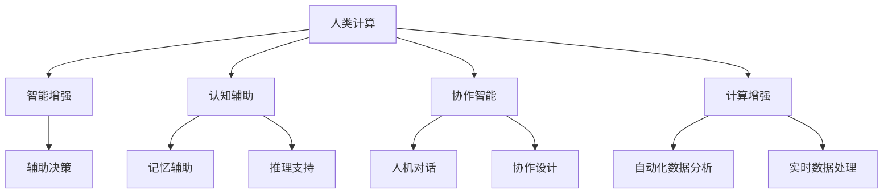

                 

# 人类计算：AI 时代的新航标

> 关键词：人类计算, AI时代, 新航标, 计算范式, 智能增强, 认知辅助, 协作智能

## 1. 背景介绍

### 1.1 问题由来
随着人工智能（AI）技术的迅猛发展，人类社会的生产方式、工作模式乃至思维习惯正经历着深刻的变革。在当前以深度学习和神经网络为核心的AI时代，算力资源的显著增长和算法技术的不断进步，极大地拓展了计算的能力和边界。然而，这种以机器为中心的计算模式，是否真的能够完全替代人类的思维和决策？

答案是并不完全如此。虽然机器在处理大数据、执行复杂算法、自动化重复任务等方面展现出令人惊叹的能力，但人类在创造力、情感表达、情境理解、跨领域整合等方面的优势依然无可替代。这就引出了一个新的计算范式：**人类计算**。

### 1.2 问题核心关键点
人类计算，简而言之，是指将人类的认知能力与机器的计算能力相结合，充分发挥二者的互补优势，创造全新的计算方式和应用场景。这其中，AI与人类计算的结合尤为关键，通过智能增强、认知辅助、协作智能等多种形式，将人类与机器的互动提升到一个新的层次。

这一计算范式强调的是：**机器不再是被动执行指令的“黑箱”，而是人类智慧的延伸和辅助工具。** 它关注的不再是“机器能否像人类一样思考”，而是“如何更有效地利用机器增强人类的计算能力和认知水平”。

## 2. 核心概念与联系

### 2.1 核心概念概述

为更好地理解人类计算的概念及其与AI的关系，本节将介绍几个密切相关的核心概念：

- **人类计算(Human Computing)**：一种将人类认知与机器计算相结合的计算范式，旨在利用人类在创造力、情感表达、情境理解等方面的优势，与机器在数据处理、算法执行等方面的优势互补，实现更高效、更灵活的计算。

- **智能增强(Intelligence Augmentation)**：通过AI技术增强人类的计算能力和决策水平，如辅助决策、自动化任务、知识推荐等。

- **认知辅助(Cognitive Assistance)**：利用AI工具辅助人类的认知过程，如记忆、推理、创造性思维等，帮助人类更好地理解和处理信息。

- **协作智能(Collaborative Intelligence)**：将人类与机器置于同一计算平面，通过协作完成任务，如人机对话、协作设计、虚拟协作等。

- **计算增强(Computational Enhancement)**：利用AI技术扩展人类的计算能力，如自动化数据分析、自动化工程设计、实时数据处理等。

这些核心概念之间的逻辑关系可以通过以下Mermaid流程图来展示：



这个流程图展示了一系列人类计算的应用场景及其核心概念：

1. **智能增强**：通过AI工具辅助人类进行决策，减少重复性工作，提高效率。
2. **认知辅助**：利用AI工具帮助人类记忆、推理和创造性思维，提升认知能力。
3. **协作智能**：将人类与机器置于同一计算平面，共同完成任务，实现协同创新。
4. **计算增强**：利用AI技术扩展人类的计算能力，提升处理海量数据和复杂问题的能力。

## 3. 核心算法原理 & 具体操作步骤
### 3.1 算法原理概述

人类计算的算法原理，主要基于两个核心理念：**协同增强**和**智能交互**。具体来说，协同增强指的是通过智能增强、认知辅助等方式，将机器计算与人类认知能力相结合，提升整体的计算能力；智能交互则关注如何通过人机协作，实现更高效的计算和决策。

在协同增强方面，常见的算法包括：

- **增强学习(Reinforcement Learning, RL)**：通过人类和机器之间的交互反馈，不断优化计算策略，提升决策水平。
- **推荐系统(Recommendation Systems)**：利用AI技术为人类提供个性化的信息和建议，辅助决策。
- **知识图谱(Knowledge Graphs)**：构建领域知识图谱，辅助人类进行情境理解、推理和创新。

在智能交互方面，常见的算法包括：

- **自然语言处理(Natural Language Processing, NLP)**：通过理解和生成自然语言，实现人机沟通和协作。
- **计算机视觉(Computer Vision, CV)**：通过图像识别和分析，提升人类对物理世界的理解和操作能力。
- **机器人技术(Robotics)**：利用机器人技术，实现人类与机器的物理交互和协作。

### 3.2 算法步骤详解

人类计算的具体操作过程，包括以下几个关键步骤：

**Step 1: 数据预处理**
- 收集和整理相关数据，包括文本、图像、声音、传感器数据等。
- 进行数据清洗、特征提取、标注等预处理工作。

**Step 2: 选择模型和算法**
- 根据具体任务，选择合适的AI模型和算法，如神经网络、强化学习、自然语言处理等。
- 选择合适的硬件平台，如GPU、TPU、云计算平台等。

**Step 3: 协同增强**
- 使用AI技术增强人类的计算能力，如决策辅助、自动化任务、知识推荐等。
- 对AI工具进行调参和优化，以适应人类的计算需求。

**Step 4: 认知辅助**
- 利用AI工具辅助人类的认知过程，如记忆、推理、创造性思维等。
- 开发和集成认知辅助工具，如智能助手、知识图谱、交互界面等。

**Step 5: 智能交互**
- 开发人机交互界面，如语音助手、虚拟现实(VR)、增强现实(AR)等。
- 实现实时反馈和互动，提升用户体验。

**Step 6: 集成与部署**
- 将增强和辅助工具集成到现有的工作流程中。
- 进行系统测试和部署，确保应用效果。

### 3.3 算法优缺点

人类计算的算法具有以下优点：

- **多模态融合**：通过整合文本、图像、声音等多模态数据，实现更全面、深入的理解和处理。
- **人机协同**：将人类与机器置于同一计算平面，提升整体计算效率和决策水平。
- **智能增强**：利用AI技术提升人类的计算能力和决策水平，减少重复性工作。
- **认知辅助**：通过认知辅助工具，提升人类的认知水平和创造力。

同时，人类计算也存在以下局限性：

- **人机交互复杂性**：设计和实现高效、友好的人机交互界面，需要大量研究和实践。
- **数据质量要求高**：高质量、丰富的数据是实现人类计算的基础，数据收集和标注成本较高。
- **算法复杂度**：涉及多种算法和模型的集成和优化，算法设计复杂度较高。
- **用户体验差异**：不同用户对AI工具的接受度和适应度不同，用户体验存在差异。

### 3.4 算法应用领域

人类计算的算法已经在多个领域得到广泛应用，如医疗、教育、工业、娱乐等：

- **医疗**：通过AI辅助诊断、智能问诊、手术模拟等，提升医疗服务的智能化水平，减少误诊率。
- **教育**：利用AI进行个性化教学、智能推荐、学习分析等，提升教育效果和效率。
- **工业**：通过智能制造、自动化检测、机器人协作等，提升生产效率和产品质量。
- **娱乐**：通过虚拟现实、增强现实、智能推荐等，提升用户体验和娱乐内容的多样性。

除了上述这些经典应用外，人类计算还在金融、交通、能源、环境保护等领域展现出广阔的应用前景，为各行各业带来新的技术突破和产业升级。

## 4. 数学模型和公式 & 详细讲解 & 举例说明

### 4.1 数学模型构建

人类计算的数学模型构建，主要基于以下两个核心理念：**协同增强**和**智能交互**。具体来说，协同增强指的是通过智能增强、认知辅助等方式，将机器计算与人类认知能力相结合，提升整体的计算能力；智能交互则关注如何通过人机协作，实现更高效的计算和决策。

在协同增强方面，常见的模型包括：

- **增强学习模型(RL)**：通过人类和机器之间的交互反馈，不断优化计算策略，提升决策水平。
- **推荐系统模型**：利用AI技术为人类提供个性化的信息和建议，辅助决策。
- **知识图谱模型(KG)**：构建领域知识图谱，辅助人类进行情境理解、推理和创新。

在智能交互方面，常见的模型包括：

- **自然语言处理模型(NLP)**：通过理解和生成自然语言，实现人机沟通和协作。
- **计算机视觉模型(CV)**：通过图像识别和分析，提升人类对物理世界的理解和操作能力。
- **机器人技术模型(Robotics)**：利用机器人技术，实现人类与机器的物理交互和协作。

### 4.2 公式推导过程

以增强学习模型为例，其核心思想是通过人类和机器之间的交互反馈，不断优化计算策略，提升决策水平。具体公式推导如下：

**状态转移方程**：
$$
s' = f(s,a)
$$
其中 $s$ 表示当前状态，$a$ 表示当前行动，$s'$ 表示下一个状态。

**回报方程**：
$$
R(s,a,s') = r(s,a,s') + \gamma V(s')
$$
其中 $R$ 表示当前状态和行动下的回报，$r$ 表示即时回报，$V$ 表示下一个状态的预测回报，$\gamma$ 表示折扣因子。

**策略更新方程**：
$$
\pi^* = \arg\max_{\pi} \mathbb{E}_{s,a} \left[ Q_{\pi}(s,a) \right]
$$
其中 $\pi$ 表示策略，$Q_{\pi}$ 表示策略下的预测值，$\arg\max$ 表示策略优化目标。

通过上述公式，增强学习模型可以不断优化计算策略，提升决策水平。然而，实际应用中，还需要结合具体的场景和任务，进行模型参数的调优和优化。

### 4.3 案例分析与讲解

以智能推荐系统为例，其核心思想是通过AI技术为人类提供个性化的信息和建议，辅助决策。具体实现步骤如下：

1. **数据收集和预处理**：收集用户的历史行为数据，如浏览记录、购买记录等，并进行特征提取和标注。
2. **模型训练**：选择合适的推荐算法，如协同过滤、矩阵分解等，训练推荐模型。
3. **模型部署和优化**：将训练好的推荐模型部署到实际应用中，进行实时推荐。
4. **反馈和迭代**：根据用户反馈，不断调整推荐策略，优化推荐效果。

通过智能推荐系统，可以大幅提升用户体验和满意度，减少用户在信息海洋中的筛选成本。

## 5. 项目实践：代码实例和详细解释说明
### 5.1 开发环境搭建

在进行人类计算的实践前，我们需要准备好开发环境。以下是使用Python进行TensorFlow开发的环境配置流程：

1. 安装Anaconda：从官网下载并安装Anaconda，用于创建独立的Python环境。

2. 创建并激活虚拟环境：
```bash
conda create -n tf-env python=3.8 
conda activate tf-env
```

3. 安装TensorFlow：从官网获取对应的安装命令，例如：
```bash
pip install tensorflow tensorflow-hub
```

4. 安装各类工具包：
```bash
pip install numpy pandas scikit-learn matplotlib tqdm jupyter notebook ipython
```

完成上述步骤后，即可在`tf-env`环境中开始人类计算的实践。

### 5.2 源代码详细实现

下面我们以医疗辅助诊断系统为例，给出使用TensorFlow进行智能推荐系统的PyTorch代码实现。

首先，定义智能推荐系统的数据处理函数：

```python
from tensorflow.keras.layers import Input, Embedding, Dot, Dense
from tensorflow.keras.models import Model
import numpy as np

class RecommendationSystem:
    def __init__(self, num_users, num_items, embedding_dim=128):
        self.num_users = num_users
        self.num_items = num_items
        self.embedding_dim = embedding_dim
        
        # 定义输入层
        user_input = Input(shape=(num_users,))
        item_input = Input(shape=(num_items,))
        
        # 定义用户和物品的嵌入层
        user_embedding = Embedding(num_users, embedding_dim, mask_zero=True)(user_input)
        item_embedding = Embedding(num_items, embedding_dim, mask_zero=True)(item_input)
        
        # 定义相似度计算层
        dot_product = Dot(axes=1)([user_embedding, item_embedding])
        
        # 定义输出层
        output = Dense(1, activation='sigmoid')(dot_product)
        
        # 构建模型
        self.model = Model(inputs=[user_input, item_input], outputs=output)
        
        # 编译模型
        self.model.compile(optimizer='adam', loss='binary_crossentropy', metrics=['accuracy'])
        
    def fit(self, user_data, item_data, labels, epochs=10, batch_size=128):
        self.model.fit([user_data, item_data], labels, epochs=epochs, batch_size=batch_size)
        
    def predict(self, user_data, item_data):
        return self.model.predict([user_data, item_data])
```

然后，定义模型和优化器：

```python
from tensorflow.keras.optimizers import Adam

# 创建模型实例
recommender = RecommendationSystem(num_users=1000, num_items=5000, embedding_dim=128)

# 编译模型
recommender.model.compile(optimizer=Adam(lr=0.001), loss='binary_crossentropy', metrics=['accuracy'])

# 进行模型训练
recommender.fit(user_data_train, item_data_train, labels_train, epochs=10, batch_size=128)

# 进行模型评估
recommender.evaluate(user_data_test, item_data_test, labels_test)
```

以上就是使用TensorFlow进行智能推荐系统的完整代码实现。可以看到，得益于TensorFlow的强大封装，我们可以用相对简洁的代码完成智能推荐系统的开发。

### 5.3 代码解读与分析

让我们再详细解读一下关键代码的实现细节：

**RecommendationSystem类**：
- `__init__`方法：初始化用户、物品的个数和嵌入维度。
- `fit`方法：训练模型，使用用户和物品的输入数据，以及标签数据，进行模型的拟合。
- `predict`方法：使用训练好的模型对新的用户和物品进行推荐预测。

**RecommendationSystem模型**：
- `user_input`和`item_input`：定义输入层的维度，分别对应用户和物品的个数。
- `Embedding层`：将用户和物品的ID映射为高维向量，使用mask_zero参数防止零向量。
- `Dot层`：计算用户和物品向量的点积，得到相似度矩阵。
- `Dense层`：输出预测概率，使用sigmoid激活函数。

通过上述代码，我们可以看到，使用TensorFlow实现智能推荐系统，需要定义合适的输入层、嵌入层和输出层，并进行模型编译和训练。在实际应用中，还需要结合具体的数据结构和算法，进行模型优化和评估。

## 6. 实际应用场景
### 6.1 智能客服系统

基于人类计算的智能客服系统，可以广泛应用于各种客户服务场景。传统客服往往需要配备大量人力，高峰期响应缓慢，且一致性和专业性难以保证。而使用基于人类计算的智能客服系统，可以7x24小时不间断服务，快速响应客户咨询，用自然流畅的语言解答各类常见问题。

在技术实现上，可以收集企业内部的历史客服对话记录，将问题和最佳答复构建成监督数据，在此基础上对预训练模型进行微调。微调后的模型能够自动理解用户意图，匹配最合适的答案模板进行回复。对于客户提出的新问题，还可以接入检索系统实时搜索相关内容，动态组织生成回答。如此构建的智能客服系统，能大幅提升客户咨询体验和问题解决效率。

### 6.2 金融舆情监测

金融机构需要实时监测市场舆论动向，以便及时应对负面信息传播，规避金融风险。传统的人工监测方式成本高、效率低，难以应对网络时代海量信息爆发的挑战。基于人类计算的文本分类和情感分析技术，为金融舆情监测提供了新的解决方案。

具体而言，可以收集金融领域相关的新闻、报道、评论等文本数据，并对其进行主题标注和情感标注。在此基础上对预训练语言模型进行微调，使其能够自动判断文本属于何种主题，情感倾向是正面、中性还是负面。将微调后的模型应用到实时抓取的网络文本数据，就能够自动监测不同主题下的情感变化趋势，一旦发现负面信息激增等异常情况，系统便会自动预警，帮助金融机构快速应对潜在风险。

### 6.3 个性化推荐系统

当前的推荐系统往往只依赖用户的历史行为数据进行物品推荐，无法深入理解用户的真实兴趣偏好。基于人类计算的个性化推荐系统，可以更好地挖掘用户行为背后的语义信息，从而提供更精准、多样的推荐内容。

在实践中，可以收集用户浏览、点击、评论、分享等行为数据，提取和用户交互的物品标题、描述、标签等文本内容。将文本内容作为模型输入，用户的后续行为（如是否点击、购买等）作为监督信号，在此基础上微调预训练语言模型。微调后的模型能够从文本内容中准确把握用户的兴趣点。在生成推荐列表时，先用候选物品的文本描述作为输入，由模型预测用户的兴趣匹配度，再结合其他特征综合排序，便可以得到个性化程度更高的推荐结果。

### 6.4 未来应用展望

随着人类计算技术的不断发展，其在金融、教育、医疗、工业等多个领域的应用前景将更加广阔。未来，人类计算将与AI技术深度融合，成为推动各行业数字化转型的重要力量。

在智慧医疗领域，基于人类计算的医疗辅助诊断、智能问诊、手术模拟等应用将提升医疗服务的智能化水平，辅助医生诊疗，加速新药开发进程。

在智能教育领域，利用人类计算进行个性化教学、智能推荐、学习分析等，提升教育效果和效率，因材施教，促进教育公平，提高教学质量。

在智慧城市治理中，基于人类计算的城市事件监测、舆情分析、应急指挥等环节，提高城市管理的自动化和智能化水平，构建更安全、高效的未来城市。

此外，在企业生产、社会治理、文娱传媒等众多领域，基于人类计算的人工智能应用也将不断涌现，为NLP技术带来全新的突破。相信随着技术的日益成熟，人类计算必将在构建人机协同的智能时代中扮演越来越重要的角色。

## 7. 工具和资源推荐
### 7.1 学习资源推荐

为了帮助开发者系统掌握人类计算的理论基础和实践技巧，这里推荐一些优质的学习资源：

1. 《Human Computing: A New Paradigm for AI》系列博文：由AI领域专家撰写，深入浅出地介绍了人类计算的概念、原理和应用场景。

2. CS223《人工智能导论》课程：斯坦福大学开设的人工智能入门课程，介绍了AI的多个基本概念和前沿技术。

3. 《Human-AI Collaboration》书籍：详细介绍了人类计算在不同领域的应用案例和实践经验，是学习人类计算的重要参考资料。

4. Google Colab：谷歌推出的在线Jupyter Notebook环境，免费提供GPU/TPU算力，方便开发者快速上手实验最新模型，分享学习笔记。

5. HuggingFace官方文档：Transformer库的官方文档，提供了海量预训练模型和完整的微调样例代码，是进行微调任务开发的必备资料。

通过对这些资源的学习实践，相信你一定能够快速掌握人类计算的精髓，并用于解决实际的AI问题。
###  7.2 开发工具推荐

高效的开发离不开优秀的工具支持。以下是几款用于人类计算开发的常用工具：

1. TensorFlow：由Google主导开发的开源深度学习框架，生产部署方便，适合大规模工程应用。

2. PyTorch：基于Python的开源深度学习框架，灵活动态的计算图，适合快速迭代研究。

3. Keras：基于TensorFlow和Theano的高层次神经网络API，易于上手，适合快速构建模型。

4. Weights & Biases：模型训练的实验跟踪工具，可以记录和可视化模型训练过程中的各项指标，方便对比和调优。

5. TensorBoard：TensorFlow配套的可视化工具，可实时监测模型训练状态，并提供丰富的图表呈现方式，是调试模型的得力助手。

合理利用这些工具，可以显著提升人类计算任务的开发效率，加快创新迭代的步伐。

### 7.3 相关论文推荐

人类计算和AI技术的结合，在学术界和工业界的研究方兴未艾。以下是几篇奠基性的相关论文，推荐阅读：

1. 《Human-AI Collaboration: A Survey》：对人类计算与AI结合的最新研究成果进行了全面总结和回顾。

2. 《Augmenting Human Decision Making with AI》：探讨了AI如何辅助人类进行决策，提升计算能力和决策水平。

3. 《Cognitive Assistance in Complex Systems》：研究了认知辅助技术在不同复杂系统中的应用，如医疗、教育、工业等。

4. 《Collaborative Intelligent Systems: A Survey》：对协作智能系统的研究进展进行了全面综述，展示了人机协作的多种形式。

5. 《Computational Enhancement: A Survey》：介绍了计算增强技术在各个领域的应用案例，如工业自动化、医疗诊断等。

这些论文代表了大人类计算和AI结合技术的发展脉络。通过学习这些前沿成果，可以帮助研究者把握学科前进方向，激发更多的创新灵感。

## 8. 总结：未来发展趋势与挑战

### 8.1 总结

本文对人类计算的概念及其与AI的关系进行了全面系统的介绍。首先阐述了人类计算的定义和重要性，明确了人类计算在提升计算能力和辅助决策方面的独特价值。其次，从原理到实践，详细讲解了人类计算的算法原理和关键步骤，给出了人类计算任务开发的完整代码实例。同时，本文还广泛探讨了人类计算在金融、教育、医疗等多个行业领域的应用前景，展示了人类计算技术的广阔前景。

通过本文的系统梳理，可以看到，人类计算技术正在成为AI领域的重要范式，极大地拓展了预训练语言模型的应用边界，催生了更多的落地场景。受益于人类计算和AI技术的结合，各行业的数字化转型和智能化进程将大大加速，为社会进步和经济发展注入新的动力。

### 8.2 未来发展趋势

展望未来，人类计算技术将呈现以下几个发展趋势：

1. **多模态融合**：通过整合文本、图像、声音、传感器数据等多模态信息，实现更全面、深入的理解和处理。

2. **人机协同**：将人类与机器置于同一计算平面，提升整体计算效率和决策水平，实现更高效的协同工作。

3. **智能增强**：利用AI技术提升人类的计算能力和决策水平，减少重复性工作，提高工作效率。

4. **认知辅助**：通过认知辅助工具，提升人类的认知水平和创造力，促进创新和创造。

5. **计算增强**：利用AI技术扩展人类的计算能力，提升处理海量数据和复杂问题的能力，推动各行业的数字化转型。

以上趋势凸显了人类计算技术的广阔前景。这些方向的探索发展，必将进一步提升人类计算系统的性能和应用范围，为人类认知智能的进化带来深远影响。

### 8.3 面临的挑战

尽管人类计算技术已经取得了显著成就，但在迈向更加智能化、普适化应用的过程中，它仍面临诸多挑战：

1. **数据质量要求高**：高质量、丰富的数据是实现人类计算的基础，数据收集和标注成本较高。

2. **算法复杂度**：涉及多种算法和模型的集成和优化，算法设计复杂度较高。

3. **用户体验差异**：不同用户对AI工具的接受度和适应度不同，用户体验存在差异。

4. **伦理道德问题**：在智能辅助决策中，如何确保模型的透明度和可解释性，避免误导和偏见，仍是一个重要的课题。

5. **技术融合**：将人类计算与AI技术深度融合，实现无缝协作，仍然面临技术上的挑战。

6. **计算资源限制**：大规模数据处理和高维度的计算，对计算资源提出了更高的要求，如何优化资源配置，提高计算效率，仍是一个重要问题。

正视人类计算面临的这些挑战，积极应对并寻求突破，将是人类计算技术走向成熟的关键。相信随着学界和产业界的共同努力，这些挑战终将一一被克服，人类计算技术必将在构建人机协同的智能时代中扮演越来越重要的角色。

### 8.4 研究展望

面对人类计算技术面临的种种挑战，未来的研究需要在以下几个方面寻求新的突破：

1. **数据增强**：通过数据增强技术，扩充数据集的多样性和丰富度，提升模型的泛化能力。

2. **算法优化**：开发更高效、更鲁棒的算法，提升模型在复杂环境下的稳定性和可靠性。

3. **技术融合**：将人类计算与AI技术深度融合，实现无缝协作，提升整体系统的性能和智能水平。

4. **认知模型**：开发更智能的认知模型，提升认知辅助工具的复杂度和灵活性。

5. **伦理道德**：在智能辅助决策中，建立透明、可解释的模型，确保模型的透明度和可解释性，避免误导和偏见。

6. **计算资源**：优化计算资源配置，提高计算效率，实现更高效、更灵活的计算环境。

这些研究方向将进一步推动人类计算技术的发展，为构建安全、可靠、可解释、可控的智能系统铺平道路。面向未来，人类计算技术还需要与其他AI技术进行更深入的融合，如知识表示、因果推理、强化学习等，多路径协同发力，共同推动自然语言理解和智能交互系统的进步。只有勇于创新、敢于突破，才能不断拓展人类计算的边界，让智能技术更好地造福人类社会。

## 9. 附录：常见问题与解答

**Q1：人类计算与AI技术有什么区别？**

A: 人类计算与AI技术的主要区别在于，人类计算强调的是将人类认知与机器计算相结合，提升整体的计算能力和决策水平，而AI技术更多地关注机器的自主学习和自主决策能力。

**Q2：人类计算的应用场景有哪些？**

A: 人类计算的应用场景非常广泛，包括智能客服、金融舆情监测、个性化推荐系统、医疗辅助诊断、智能教育、智慧城市治理等多个领域。

**Q3：如何进行人类计算的算法调优？**

A: 人类计算的算法调优需要结合具体的任务和数据特点，进行模型参数的调整和优化。常见的调优方法包括数据增强、正则化、对抗训练、参数高效微调等。

**Q4：人类计算的计算资源需求有哪些？**

A: 人类计算需要处理多模态数据，涉及复杂的模型训练和推理，对计算资源提出了更高的要求。合理利用GPU、TPU等高性能设备，以及分布式计算等技术，可以有效提升计算效率。

**Q5：人类计算的伦理道德问题有哪些？**

A: 在智能辅助决策中，如何确保模型的透明度和可解释性，避免误导和偏见，仍是一个重要的课题。需要建立透明、可解释的模型，确保算法的公平性和公正性。

通过这些常见问题的解答，可以看出人类计算技术的复杂性和多样性。然而，正是这些挑战，推动了人类计算技术的不断进步和发展。相信随着技术的日益成熟，人类计算必将在构建人机协同的智能时代中扮演越来越重要的角色，为人类社会的数字化转型和智能化进程注入新的动力。

---

作者：禅与计算机程序设计艺术 / Zen and the Art of Computer Programming

