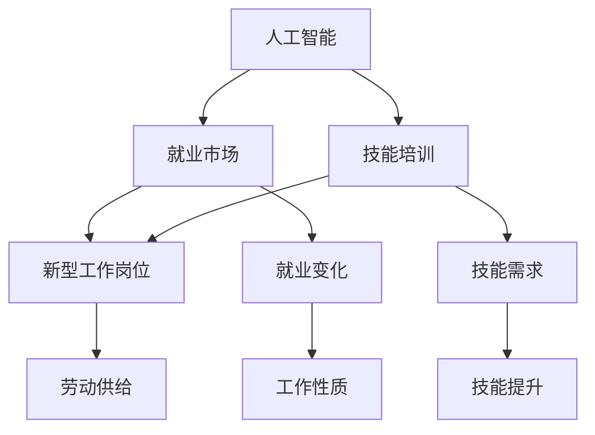

                 

# 人类计算：AI时代的未来就业市场与技能培训发展趋势分析机遇挑战机遇趋势分析

## 1. 背景介绍

### 1.1 问题由来
随着人工智能(AI)技术的快速发展，尤其是深度学习、自然语言处理(NLP)、计算机视觉等领域的研究突破，AI正逐渐渗透到各个行业，引领新的产业变革。然而，AI的快速发展也带来了巨大的就业市场变化，对人力资源需求、工作性质和技能培训等产生了深远影响。

### 1.2 问题核心关键点
本文聚焦于AI时代下的就业市场和技能培训趋势，分析了AI技术对传统行业的影响，探讨了新型工作岗位的兴起，以及技能培训发展的方向和挑战。

## 2. 核心概念与联系

### 2.1 核心概念概述

1. **人工智能**：涵盖机器学习、深度学习、自然语言处理、计算机视觉等多个领域的先进技术，能够模拟、延伸和扩展人的智能能力。
2. **就业市场**：指各类经济活动中的劳动岗位需求与供给关系的总和。AI时代的就业市场受技术进步、产业结构调整、政策环境等多重因素影响。
3. **技能培训**：旨在提升劳动者技能水平，适应技术发展趋势，满足未来岗位需求的教育与培训活动。
4. **人类计算**：指结合AI和人类智慧，进行高效、精准、创造性工作的能力提升。

### 2.2 核心概念原理和架构的 Mermaid 流程图



## 3. 核心算法原理 & 具体操作步骤

### 3.1 算法原理概述

AI技术的快速发展对就业市场和技能培训产生了多方面的影响：

- **替代效应**：AI在特定任务上的高效性，可能替代传统人力工作岗位。
- **补充效应**：AI在辅助人类完成复杂任务、优化决策等方面的作用，创造新的工作岗位。
- **提升效应**：AI技术的应用提升了劳动生产率，促使企业对高技能劳动力的需求增加。

### 3.2 算法步骤详解

1. **数据分析与市场调研**：收集就业市场数据，分析AI技术对不同行业的影响，预测未来就业趋势。
2. **岗位分析与技能需求**：基于AI技术的应用，分析新兴岗位的技能需求，确定技能培训重点。
3. **培训设计**：根据岗位需求，设计有针对性的培训课程，包括课程内容、教学方法、评估标准等。
4. **培训实施**：通过线上线下结合的方式，实施技能培训，包括理论知识、实践操作、项目实战等环节。
5. **效果评估与反馈**：定期评估培训效果，收集受训者反馈，持续改进培训方案。

### 3.3 算法优缺点

**优点**：
- **效率提升**：AI技术能够大规模、高效地进行数据分析和任务执行，提升培训效果。
- **个性化教学**：利用AI技术可以针对个体差异进行定制化教学，提升学习效果。
- **动态更新**：AI技术可以实时监测市场变化，动态调整培训内容，确保培训的有效性和时效性。

**缺点**：
- **成本高**：开发和维护AI系统需要大量资源和资金。
- **数据隐私**：AI系统需要大量数据进行训练和优化，涉及隐私保护和数据安全问题。
- **过度依赖**：过度依赖AI可能导致人类能力的退化，需要找到平衡点。

### 3.4 算法应用领域

基于AI的技能培训技术已广泛应用于教育、医疗、金融、制造等多个行业，推动了各领域的数字化转型和人才需求变革。未来，AI技术在技能培训中的应用将进一步扩展，涵盖更多新型工作岗位和复杂技能要求。

## 4. 数学模型和公式 & 详细讲解 & 举例说明

### 4.1 数学模型构建

本节将构建一个简单的数学模型，用于分析AI技术对就业市场的影响。

设 $L$ 为当前劳动市场的就业总量，$L_{\text{AI}}$ 为AI技术应用带来的新岗位数量，$L_{\text{E}}$ 为AI技术取代的岗位数量，$S$ 为AI技术引入前后的劳动生产率提升比例。则AI对就业市场的影响模型为：

$$
L_{\text{新}} = L + S(L - L_{\text{E}}) - L_{\text{E}} + L_{\text{AI}}
$$

其中，$L_{\text{新}}$ 表示引入AI技术后的新就业总量。

### 4.2 公式推导过程

由上述模型，可以推导出AI技术对就业市场的影响：

$$
L_{\text{新}} = L \times S - L_{\text{E}} + L_{\text{AI}}
$$

- 当 $S > 1$ 且 $L_{\text{AI}} > L_{\text{E}}$ 时，AI技术总体上促进就业市场的发展。
- 当 $S < 1$ 且 $L_{\text{AI}} < L_{\text{E}}$ 时，AI技术导致就业市场的萎缩。

### 4.3 案例分析与讲解

以医疗行业为例，分析AI技术对就业市场的影响：

- **影像诊断**：AI辅助医生进行影像诊断，减少误诊，提升诊断效率。
- **患者管理**：AI分析患者数据，提供个性化治疗方案，减少医疗资源浪费。
- **药物研发**：AI加速新药发现，缩短研发周期，创造新的医疗岗位。

## 5. 项目实践：代码实例和详细解释说明

### 5.1 开发环境搭建

1. **安装Python**：
   ```bash
   sudo apt-get update
   sudo apt-get install python3-pip
   ```

2. **安装必要的库**：
   ```bash
   pip install pandas numpy scikit-learn matplotlib seaborn
   ```

3. **搭建Jupyter Notebook**：
   ```bash
   pip install jupyter notebook
   jupyter notebook
   ```

### 5.2 源代码详细实现

以下是一个简单的Python代码实例，用于分析AI技术对就业市场的影响：

```python
import pandas as pd
import numpy as np
import matplotlib.pyplot as plt

# 设置数据
L = 100  # 当前劳动市场就业总量
S = 1.2  # 劳动生产率提升比例
L_E = 20  # 被AI取代的岗位数量
L_AI = 30  # AI引入的新岗位数量

# 计算新就业总量
L_new = L * S - L_E + L_AI

# 输出结果
print(f"引入AI技术后的新就业总量为：{L_new}")
```

### 5.3 代码解读与分析

这段代码展示了如何使用简单的数学模型计算AI技术对就业市场的影响。通过设置就业总量、劳动生产率提升比例、被取代的岗位数量和新岗位数量，可以计算出引入AI技术后的新就业总量。

## 6. 实际应用场景

### 6.1 智能制造

AI技术在智能制造中的应用，推动了传统制造业向智能工厂转型。这不仅提升了生产效率，还创造了大量的新型岗位，如智能设备维护、数据采集与分析、生产过程优化等。

### 6.2 金融科技

金融行业通过AI技术在风险控制、客户服务、投资分析等方面实现了数字化转型。金融科技公司大量招聘数据科学家、算法工程师、AI系统运维人员等高技能人才，满足市场需求。

### 6.3 医疗健康

AI技术在医疗领域的应用，如影像诊断、个性化治疗、医疗机器人等，创造了大量新型岗位。同时，AI技术的需求也推动了数据科学家、AI开发工程师等高技能人才的培养。

### 6.4 未来应用展望

未来，随着AI技术的不断进步，新型工作岗位将持续涌现。跨学科技能、AI伦理与法律、数据分析与处理等将成为未来职场的热门技能。企业需不断更新培训内容，满足市场变化。

## 7. 工具和资源推荐

### 7.1 学习资源推荐

1. **Coursera**：提供大量AI和数据分析课程，涵盖从入门到高级的多个层次。
2. **edX**：提供全球顶尖大学和机构的AI课程，包括深度学习、自然语言处理等领域。
3. **Udacity**：提供AI和机器学习项目导向的课程，包括人工智能纳米学位和专业证书。
4. **Kaggle**：提供数据科学竞赛和实战项目，帮助学习者提升实战能力。
5. **GitHub**：提供丰富的开源项目和代码库，学习者可以通过参与项目实践学习新技能。

### 7.2 开发工具推荐

1. **Python**：作为AI领域的主流编程语言，Python拥有丰富的AI库和框架，如TensorFlow、PyTorch、Scikit-learn等。
2. **Jupyter Notebook**：用于数据分析和模型开发的交互式编程环境，支持代码和文本的混合编写。
3. **Git**：用于版本控制和协作开发，可以帮助学习者跟踪项目进度，分享代码。

### 7.3 相关论文推荐

1. **Deep Learning**：Ian Goodfellow、Yoshua Bengio 和 Aaron Courville 著。
2. **Programming Large-Scale Machine Learning Systems**：Jeff Dean、Ilya Sutskever、Quoc V. Le 著。
3. **AI Superpowers**：Kai-Fu Lee 著。

## 8. 总结：未来发展趋势与挑战

### 8.1 研究成果总结

AI技术的发展正在深刻改变就业市场和技能培训的现状，带来了前所未有的机遇和挑战。AI的广泛应用创造了新的工作岗位，但同时也对传统岗位提出了新的要求。

### 8.2 未来发展趋势

1. **跨学科融合**：AI与大数据、区块链、物联网等技术的融合，将创造更多新型工作岗位。
2. **终身学习**：终身学习将成为未来职场的常态，不断更新和提升技能将是保持竞争力的关键。
3. **人性化设计**：AI技术的广泛应用需要注重人性化设计，提高用户体验，满足多样化的需求。

### 8.3 面临的挑战

1. **技能差距**：AI技术的快速发展使得人才供需差距加剧，部分岗位技能要求提升。
2. **就业不平等**：AI技术的引入可能导致就业机会不均衡，需要关注弱势群体的技能提升。
3. **伦理与法律**：AI技术的应用需要遵循伦理和法律规范，确保技术的公正性和安全性。

### 8.4 研究展望

未来，需进一步探索AI技术在技能培训中的应用，如个性化学习路径、动态课程更新等，提升培训效果。同时，关注AI技术的伦理和法律问题，制定相应的政策框架和行业标准。

## 9. 附录：常见问题与解答

**Q1: 如何应对AI对就业市场的影响？**

**A1:** 企业应积极调整人力资源结构，培训员工掌握AI相关技能，提升整体竞争力。同时，政府和社会应提供职业培训和再就业支持，帮助受影响群体顺利转型。

**Q2: AI技能培训应如何设计？**

**A2:** AI技能培训应结合市场需求和企业需求，设计实用课程。应注重理论与实践结合，培养学生的创新能力和解决问题的能力。

**Q3: 如何确保AI培训的质量和效果？**

**A3:** 引入AI技术进行个性化教学和效果评估，实时监测学习进度和效果。建立反馈机制，持续改进培训方案。

**Q4: 如何平衡AI技术和人类劳动力的关系？**

**A4:** 引入AI技术应注重与人类劳动力的互补，提升而非替代。同时，培养复合型人才，提升人类的创造力和创新能力。

**Q5: AI技能培训的资源如何获取？**

**A5:** 利用在线教育平台、开源项目、学术资源等，获取丰富的学习材料和实践机会。同时，建立校企合作，推动产学研结合。

---

作者：禅与计算机程序设计艺术 / Zen and the Art of Computer Programming

