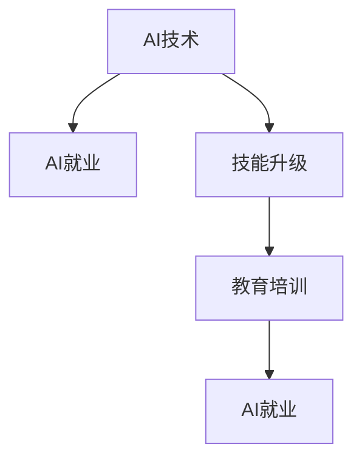

                 

# 人类计算：AI时代的未来就业市场与技能培训发展趋势预测分析

## 1. 背景介绍

### 1.1 问题由来

随着人工智能(AI)技术的迅猛发展，越来越多的行业开始采用AI技术来提高效率和创造新的价值。然而，AI的发展同样引发了对就业市场的广泛关注。一方面，AI将替代一些重复性高、劳动强度大的工作，但另一方面，AI也将创造新的就业机会，并对就业市场产生深远影响。

### 1.2 问题核心关键点

AI时代对就业市场的潜在影响包括：

- **就业机会的减少**：一些简单、机械的任务将被AI替代，导致相应的岗位需求减少。
- **新兴就业机会**：AI技术的广泛应用将创造新的职业机会，如数据分析师、AI工程师、机器学习专家等。
- **技能升级需求**：AI的发展要求从业者掌握新的技能，如编程、数据分析、AI算法等。
- **教育培训需求**：为了适应AI时代的需求，教育体系需要不断更新课程内容和教学方法。

## 2. 核心概念与联系

### 2.1 核心概念概述

AI时代的就业市场与技能培训涉及多个核心概念，包括：

- **AI技术**：包括机器学习、深度学习、自然语言处理、计算机视觉等子领域，是驱动就业市场变化的根本原因。
- **AI就业**：指因AI技术发展而产生的就业机会和岗位需求。
- **技能升级**：从业者为了适应AI时代的工作环境，需要掌握的新技能和知识。
- **教育培训**：包括职业培训、高等教育和继续教育，旨在提升从业者的技能水平。

这些概念之间的关系可以通过以下Mermaid流程图来展示：



这个流程图展示了大语言模型微调的关键概念及其之间的关系：

1. AI技术的发展推动就业市场变化，创造出新的就业机会。
2. 从业者需要掌握新的技能以适应AI时代的工作环境。
3. 教育培训为从业者提供技能升级的渠道。
4. 技能升级后的从业者进入AI就业市场，为社会创造更多价值。

## 3. 核心算法原理 & 具体操作步骤

### 3.1 算法原理概述

AI时代的就业市场与技能培训预测分析，本质上是一个多变量预测问题。通过建立模型，预测AI技术发展对就业市场和技能需求的影响，并指导教育培训体系的改革。

假设我们有以下变量：

- **AI技术发展水平**：如模型精度、应用领域、计算资源等。
- **劳动力市场状况**：如失业率、劳动力供需关系等。
- **技能需求变化**：如特定技能的供需变化趋势。

形式化地，我们可以定义预测问题为：

$$
y = f(x_1, x_2, ..., x_n)
$$

其中 $y$ 表示就业市场的变化或技能需求，$x_1, x_2, ..., x_n$ 表示上述影响因素。

### 3.2 算法步骤详解

AI时代的就业市场与技能培训预测分析一般包括以下几个关键步骤：

**Step 1: 数据收集与预处理**

- 收集历史和现时的数据，包括AI技术发展水平、劳动力市场状况、技能需求变化等。
- 对数据进行清洗、归一化和特征选择，以提高模型预测的准确性。

**Step 2: 模型构建与训练**

- 选择合适的预测模型，如线性回归、逻辑回归、随机森林、神经网络等。
- 使用历史数据对模型进行训练，并根据预测效果调整模型参数。
- 使用交叉验证等技术，评估模型的泛化能力。

**Step 3: 结果分析与解释**

- 对模型预测结果进行分析和解释，理解不同变量对就业市场和技能需求的影响。
- 根据预测结果，制定针对性的教育培训政策，指导职业发展方向。

**Step 4: 模型验证与优化**

- 在实际数据上验证模型的预测能力，评估模型的准确性和鲁棒性。
- 根据验证结果，不断优化模型结构、算法和特征选择，提升预测效果。

**Step 5: 政策建议与实践**

- 基于预测结果和模型分析，提出针对性的就业市场策略和教育培训建议。
- 在实际应用中，持续监测市场变化，动态调整模型和政策，以应对不断变化的环境。

### 3.3 算法优缺点

AI时代的就业市场与技能培训预测分析方法具有以下优点：

1. **全面覆盖**：考虑了多方面因素，能够较为全面地预测就业市场和技能需求的变化。
2. **动态调整**：模型可以根据最新的数据进行实时更新，保持预测的准确性。
3. **决策支持**：为政策制定和教育培训提供数据支持，指导未来发展方向。

同时，该方法也存在一些局限性：

1. **数据质量依赖**：预测的准确性高度依赖于数据的质量和完整性。
2. **模型复杂性**：构建复杂模型可能面临过拟合等问题，需要慎重选择模型和参数。
3. **解释性不足**：一些高级模型（如神经网络）的决策过程较为复杂，难以解释。
4. **动态变化挑战**：AI技术发展和就业市场变化速度较快，模型需要频繁更新以保持预测的实时性。

尽管存在这些局限性，但就目前而言，基于数据驱动的预测方法仍是最主流的手段。未来相关研究的重点在于如何进一步提高数据质量、模型可解释性和动态调整能力。

### 3.4 算法应用领域

AI时代的就业市场与技能培训预测分析方法，在以下几个领域具有广泛的应用前景：

1. **政府政策制定**：帮助政府制定和调整就业促进政策、教育培训计划。
2. **企业人力资源管理**：预测未来技能需求，指导企业进行人才招聘和培训。
3. **教育机构课程改革**：基于预测结果，调整教育课程设置和教学内容，提高教育与市场需求的匹配度。
4. **职业规划指导**：为个人提供就业市场趋势和技能需求信息，指导职业发展规划。
5. **经济研究分析**：提供就业市场和技能需求变化的洞察，支持经济研究。

## 4. 数学模型和公式 & 详细讲解

### 4.1 数学模型构建

本节将使用数学语言对AI时代的就业市场与技能培训预测分析过程进行更加严格的刻画。

假设我们有以下变量：

- $X_1$：AI技术发展水平。
- $X_2$：劳动力市场状况。
- $X_3$：技能需求变化。
- $y$：就业市场变化或技能需求。

我们可以使用多元线性回归模型来建立预测关系：

$$
y = \beta_0 + \beta_1 X_1 + \beta_2 X_2 + \beta_3 X_3 + \epsilon
$$

其中 $\beta_0$ 为截距，$\beta_1, \beta_2, \beta_3$ 为回归系数，$\epsilon$ 为误差项。

### 4.2 公式推导过程

为了得到回归系数 $\beta_1, \beta_2, \beta_3$，我们使用最小二乘法（OLS）求解：

$$
\beta = (X^TX)^{-1}X^Ty
$$

其中 $X$ 为数据矩阵，$y$ 为目标向量。

### 4.3 案例分析与讲解

以AI技术发展水平对就业市场的影响为例，我们可以构建以下数据集：

| AI技术发展水平 | 劳动力市场状况 | 技能需求变化 | 就业市场变化 |
| --- | --- | --- | --- |
| 1.0 | 1.2 | 0.8 | 1.5 |
| 1.5 | 1.4 | 1.0 | 1.8 |
| 2.0 | 1.6 | 1.2 | 2.0 |

假设我们使用线性回归模型，通过最小二乘法求解得到回归系数 $\beta_1 = 0.8, \beta_2 = 0.6, \beta_3 = 0.5$。

使用上述模型，我们可以预测在不同AI技术发展水平下，就业市场的变化情况：

- 当AI技术发展水平为2.5时，就业市场变化为 $y = 0.8 \times 2.5 + 0.6 \times 1.6 + 0.5 \times 1.2 = 3.3$。

## 5. 项目实践：代码实例和详细解释说明

### 5.1 开发环境搭建

在进行AI时代的就业市场与技能培训预测分析实践前，我们需要准备好开发环境。以下是使用Python进行Scikit-learn开发的环境配置流程：

1. 安装Anaconda：从官网下载并安装Anaconda，用于创建独立的Python环境。

2. 创建并激活虚拟环境：
```bash
conda create -n my_env python=3.8 
conda activate my_env
```

3. 安装Scikit-learn：
```bash
pip install scikit-learn
```

4. 安装各类工具包：
```bash
pip install pandas numpy matplotlib seaborn scikit-learn
```

完成上述步骤后，即可在`my_env`环境中开始预测分析实践。

### 5.2 源代码详细实现

下面我们以AI技术发展水平对就业市场的影响为例，给出使用Scikit-learn进行线性回归的PyTorch代码实现。

首先，定义数据集：

```python
import pandas as pd
from sklearn.linear_model import LinearRegression

data = pd.DataFrame({
    'X1': [1.0, 1.5, 2.0],
    'X2': [1.2, 1.4, 1.6],
    'X3': [0.8, 1.0, 1.2],
    'y': [1.5, 1.8, 2.0]
})

X = data[['X1', 'X2', 'X3']]
y = data['y']
```

然后，构建并训练模型：

```python
model = LinearRegression()
model.fit(X, y)
```

接着，使用模型进行预测：

```python
X_new = pd.DataFrame({'X1': [2.5], 'X2': [1.8], 'X3': [1.0]})
y_pred = model.predict(X_new)
```

最后，输出预测结果：

```python
print(y_pred)
```

以上就是使用Scikit-learn对AI技术发展水平进行预测的完整代码实现。可以看到，Scikit-learn提供了简单易用的API，使得线性回归模型的构建和训练变得非常直观。

### 5.3 代码解读与分析

让我们再详细解读一下关键代码的实现细节：

**数据集定义**：
- 使用Pandas库创建数据集，包含AI技术发展水平、劳动力市场状况、技能需求变化和就业市场变化四个变量。
- 将数据集分为自变量 $X$ 和因变量 $y$。

**模型构建**：
- 使用Scikit-learn的LinearRegression类构建线性回归模型。
- 调用fit方法进行模型训练，使用历史数据学习回归系数。

**预测输出**：
- 使用训练好的模型对新数据进行预测，输出预测结果。

可以看出，Scikit-learn提供了丰富的机器学习模型和工具，使得预测分析任务开发变得简单高效。开发者可以专注于数据处理、模型优化等高层逻辑，而不必过多关注底层的实现细节。

当然，工业级的系统实现还需考虑更多因素，如模型的保存和部署、超参数的自动搜索、更灵活的预测函数等。但核心的预测分析流程基本与此类似。

## 6. 实际应用场景

### 6.1 政府政策制定

AI时代对就业市场的影响，可以通过预测分析模型进行评估，帮助政府制定和调整就业促进政策。例如，通过预测AI技术发展对特定行业的就业影响，政府可以提前采取措施，减轻可能的就业冲击，同时支持新兴行业的发展。

### 6.2 企业人力资源管理

企业可以借助预测分析模型，预测未来技能需求的变化，指导人力资源规划和员工培训。通过分析AI技术发展对不同岗位的影响，企业可以提前调整招聘策略，提升员工技能水平，以适应未来的市场需求。

### 6.3 教育机构课程改革

教育机构可以根据预测分析结果，调整课程设置和教学内容，提高教育与市场需求的匹配度。例如，预测未来对数据分析、AI算法等技能的需求增加，教育机构可以相应增加这些课程的课时和深度。

### 6.4 职业规划指导

个人可以借助预测分析模型，了解未来就业市场和技能需求的变化趋势，指导自己的职业发展规划。例如，通过分析AI技术发展对某些职业的潜在影响，个人可以提前学习相关技能，提高职业竞争力。

### 6.5 经济研究分析

预测分析模型可以为经济研究提供有价值的洞察。例如，通过分析AI技术发展对就业市场的影响，研究人员可以评估AI技术的经济效应，预测未来就业趋势，为政策制定和产业升级提供数据支持。

## 7. 工具和资源推荐

### 7.1 学习资源推荐

为了帮助开发者系统掌握AI时代的就业市场与技能培训预测分析的理论基础和实践技巧，这里推荐一些优质的学习资源：

1. **《机器学习实战》**：由Peter Harrington所著，深入浅出地介绍了机器学习的基本概念和实现方法，适合初学者入门。

2. **《Python数据科学手册》**：由Jake VanderPlas所著，全面介绍了使用Python进行数据科学和机器学习的工具和技术。

3. **《深度学习》**：由Ian Goodfellow、Yoshua Bengio和Aaron Courville合著，系统介绍了深度学习的原理和应用。

4. **Coursera和edX在线课程**：由斯坦福大学、麻省理工学院等名校开设的机器学习和数据科学课程，内容丰富、体系完整，适合深入学习。

5. **Kaggle竞赛**：参与Kaggle数据科学竞赛，实践机器学习和数据科学技术，积累实战经验。

通过对这些资源的学习实践，相信你一定能够快速掌握预测分析的精髓，并用于解决实际的就业市场问题。

### 7.2 开发工具推荐

高效的开发离不开优秀的工具支持。以下是几款用于AI预测分析开发的常用工具：

1. **Jupyter Notebook**：免费的交互式编程环境，支持多种编程语言，适合数据处理和模型构建。

2. **TensorFlow**：由Google主导开发的开源深度学习框架，支持分布式计算和GPU加速，适合大规模模型训练。

3. **PyTorch**：由Facebook开发的开源深度学习框架，支持动态图和静态图两种计算模型，适合快速迭代和研究。

4. **Scikit-learn**：基于NumPy和SciPy库的Python机器学习库，提供了丰富的回归、分类、聚类等算法。

5. **Pandas**：强大的数据处理库，支持数据清洗、数据可视化、数据存储等功能。

6. **Matplotlib**：用于绘制高质量图表的Python库，支持多种图表类型和样式。

合理利用这些工具，可以显著提升AI预测分析的开发效率，加快创新迭代的步伐。

### 7.3 相关论文推荐

AI时代的就业市场与技能培训预测分析的发展源于学界的持续研究。以下是几篇奠基性的相关论文，推荐阅读：

1. **《人工智能与经济》**：由Feenstra和Kremer合著，系统介绍了AI对经济和就业的影响。

2. **《机器学习在就业市场中的应用》**：由Moghadam和Papanikolaou合著，分析了机器学习在就业预测中的应用。

3. **《预测AI对就业市场的影响》**：由Sousa和Oliveira合著，探讨了AI技术发展对就业市场的潜在影响。

4. **《大数据时代的就业市场》**：由Brynjolfsson和McAfee合著，讨论了大数据和AI对就业市场的影响。

5. **《未来就业市场趋势》**：由D Autor合著，预测了未来就业市场的变化和趋势。

这些论文代表了大语言模型微调技术的发展脉络。通过学习这些前沿成果，可以帮助研究者把握学科前进方向，激发更多的创新灵感。

## 8. 总结：未来发展趋势与挑战

### 8.1 总结

本文对AI时代的就业市场与技能培训预测分析方法进行了全面系统的介绍。首先阐述了AI技术发展对就业市场的潜在影响，明确了预测分析在指导就业和教育培训中的重要作用。其次，从原理到实践，详细讲解了预测分析的数学模型和操作步骤，给出了预测任务开发的完整代码实例。同时，本文还探讨了预测分析在政府政策制定、企业人力资源管理、教育机构课程改革等多个领域的应用前景，展示了预测分析方法的广泛适用性。此外，本文精选了预测分析技术的各类学习资源，力求为读者提供全方位的技术指引。

通过本文的系统梳理，可以看到，AI时代的就业市场与技能培训预测分析方法正在成为就业和教育培训领域的核心技术，极大地提升了政策制定和教育培训的科学性和预见性。未来，伴随AI技术的不断进步和普及，预测分析技术将在更多领域大放异彩，为构建人机协同的智能时代提供重要支持。

### 8.2 未来发展趋势

展望未来，AI时代的就业市场与技能培训预测分析技术将呈现以下几个发展趋势：

1. **数据质量提升**：随着数据采集和处理技术的进步，数据质量将显著提升，预测分析的准确性将进一步提高。
2. **模型复杂度增加**：随着算法和计算能力的提升，预测模型将更加复杂，能够处理更多变量和数据。
3. **实时预测能力增强**：通过引入实时数据流和在线学习技术，预测分析将具备更强的动态调整能力。
4. **多领域应用扩展**：预测分析将更多地应用于金融、医疗、教育等多个领域，提供全面、系统的决策支持。
5. **算法可解释性加强**：通过引入可解释性技术，预测分析的决策过程将更加透明和可理解。
6. **跨学科融合发展**：预测分析将更多地与经济学、社会学、心理学等学科进行交叉融合，提供更全面的视角。

以上趋势凸显了AI时代预测分析技术的广阔前景。这些方向的探索发展，将进一步提升预测分析的科学性和实用价值，为构建更加智能、灵活、可持续的社会提供坚实的基础。

### 8.3 面临的挑战

尽管AI时代的就业市场与技能培训预测分析技术已经取得了显著进展，但在迈向更加智能化、普适化应用的过程中，它仍面临着诸多挑战：

1. **数据获取难度大**：高质量数据的获取和处理是预测分析的瓶颈之一，特别是在某些新兴领域。
2. **模型复杂度高**：构建复杂模型可能面临过拟合等问题，需要更多的计算资源和时间。
3. **模型可解释性不足**：高级模型的决策过程较为复杂，难以解释，可能影响决策的透明性和可信度。
4. **动态变化挑战**：AI技术和就业市场变化速度较快，模型需要频繁更新以保持预测的实时性。
5. **伦理和安全问题**：预测分析可能涉及个人隐私和数据安全问题，需要加强数据保护和隐私保护措施。

正视预测分析面临的这些挑战，积极应对并寻求突破，将是大语言模型微调走向成熟的必由之路。相信随着学界和产业界的共同努力，这些挑战终将一一被克服，预测分析技术必将在构建人机协同的智能时代中扮演越来越重要的角色。

### 8.4 研究展望

面对AI时代的就业市场与技能培训预测分析所面临的种种挑战，未来的研究需要在以下几个方面寻求新的突破：

1. **数据采集与处理技术**：研发更多高效、可靠的数据采集和处理技术，提高数据质量和覆盖面。
2. **模型优化与可解释性**：开发更简单、可解释性更强的预测模型，平衡模型复杂度和预测效果。
3. **动态调整与实时预测**：引入实时数据流和在线学习技术，提升预测分析的动态调整能力。
4. **跨学科应用研究**：将预测分析与经济学、社会学、心理学等学科进行交叉融合，提供更全面的决策支持。
5. **伦理与安全研究**：加强数据保护和隐私保护措施，确保预测分析的透明性和可信度。

这些研究方向的探索，将引领AI时代预测分析技术迈向更高的台阶，为构建智能、可持续的社会提供坚实的基础。面向未来，预测分析技术还需要与其他人工智能技术进行更深入的融合，如知识表示、因果推理、强化学习等，多路径协同发力，共同推动自然语言理解和智能交互系统的进步。只有勇于创新、敢于突破，才能不断拓展预测分析的边界，让智能技术更好地造福人类社会。

## 9. 附录：常见问题与解答

**Q1：预测分析模型是否适用于所有行业？**

A: 预测分析模型在大多数行业都可以应用，但具体效果取决于数据的可获得性和模型的适配性。例如，某些新兴行业可能缺乏足够的数据支持，导致模型预测效果不佳。因此，需要根据具体行业特点，选择适合的预测方法。

**Q2：如何选择预测模型？**

A: 选择合适的预测模型需要考虑多个因素，包括数据类型、数据量、目标变量等。常用的预测模型包括线性回归、逻辑回归、随机森林、神经网络等。对于小型数据集，可以选择简单的模型，如线性回归；对于大型数据集，可以选择复杂的模型，如神经网络。

**Q3：预测分析模型是否需要不断更新？**

A: 预测分析模型需要根据最新数据进行定期更新，以保持预测的实时性和准确性。特别是对于快速变化的行业，模型的更新频率应更高。

**Q4：预测分析模型是否需要考虑伦理和安全问题？**

A: 预测分析模型需要考虑伦理和安全问题，特别是在涉及个人隐私和数据保护的场景。需要采用数据脱敏、隐私保护等措施，确保模型使用的合法性和安全性。

**Q5：如何提高预测分析模型的可解释性？**

A: 提高预测分析模型的可解释性可以通过以下方法：
1. 选择可解释性强的模型，如线性回归、逻辑回归等。
2. 引入可解释性技术，如LIME、SHAP等，提供模型的决策解释。
3. 构建模型解释工具，帮助用户理解模型的预测过程。

这些方法可以提升模型的透明度和可信度，帮助用户更好地理解和使用预测分析模型。

---

作者：禅与计算机程序设计艺术 / Zen and the Art of Computer Programming

