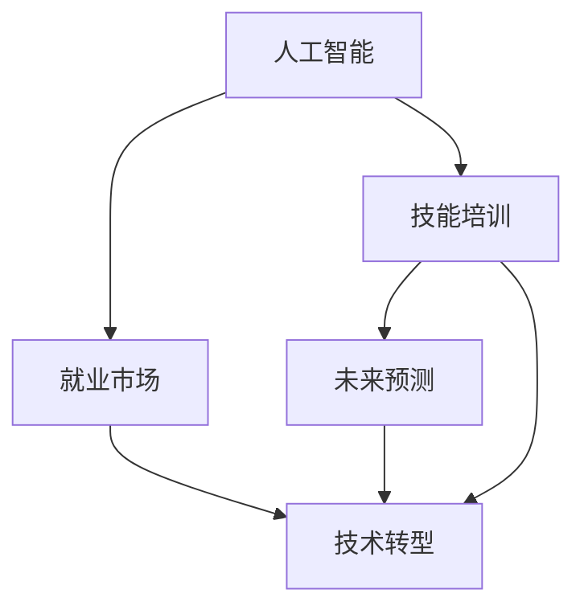

                 

# 人类计算：AI时代的未来就业市场与技能培训预测

> 关键词：人工智能,就业市场,技能培训,未来预测,技术转型

## 1. 背景介绍

### 1.1 问题由来
随着人工智能技术的飞速发展，AI技术已经渗透到各行各业，推动了产业升级和效率提升。然而，这也不可避免地带来了对劳动力市场的巨大冲击。传统的重复性工作被自动化取代，很多岗位面临被淘汰的风险，同时也催生了新的职业机会。如何预测未来就业市场的发展趋势，为劳动力的转型提供有效指导，成为了当前面临的重要课题。

### 1.2 问题核心关键点
这个问题的核心在于：

- **AI对就业市场的具体影响**：哪些岗位容易被AI取代？哪些岗位需要AI辅助？哪些岗位会因为AI而产生新的机会？
- **技能培训的必要性和可行性**：为了适应AI时代，劳动者需要掌握哪些技能？如何高效进行技能培训？
- **政策建议与行业指导**：如何制定合理的政策措施，帮助劳动力顺利转型？企业和学校如何调整教学内容？

本文旨在通过数据驱动和理论分析，预测AI时代下的未来就业市场，并提供相应的技能培训建议。

## 2. 核心概念与联系

### 2.1 核心概念概述

- **人工智能（AI）**：指通过机器学习和深度学习技术，使机器具备类似人类的智能行为，包括感知、学习、推理、决策等。
- **就业市场**：指劳动力的供需关系，包括岗位数量、岗位性质、工资水平、劳动者的教育和技能水平等。
- **技能培训**：指通过教育和培训，提升劳动者的专业知识和操作技能，以适应技术进步带来的就业需求变化。
- **未来预测**：基于历史数据和模型分析，对未来就业市场和技能需求进行预测。
- **技术转型**：指劳动者通过学习新技能，适应AI技术带来的职业变化，实现职业生涯的转型升级。

这些概念之间的逻辑关系可以通过以下Mermaid流程图来展示：



这个流程图展示了一系列的因果关系：

1. AI技术的发展影响到就业市场，可能导致某些岗位的消失和新岗位的产生。
2. 为了适应AI时代的就业需求，需要进行技能培训，提升劳动者的能力。
3. 未来预测可以帮助我们了解就业市场的变化趋势，从而更有针对性地进行技能培训。
4. 技术转型是劳动者适应就业市场变化的最终目标，实现职业生涯的持续发展。

## 3. 核心算法原理 & 具体操作步骤
### 3.1 算法原理概述

预测AI时代下的未来就业市场和技能需求，涉及多个步骤和算法。以下概述了主要算法原理：

- **数据采集与预处理**：收集历史就业市场数据，包括岗位数量、岗位类型、劳动力需求等。对数据进行清洗和标准化处理，以便后续分析和建模。
- **时间序列分析**：使用时间序列模型，如ARIMA、LSTM等，对就业市场的趋势和周期性进行预测。
- **回归分析**：通过回归模型，分析AI技术应用对不同岗位的需求变化。
- **分类算法**：使用分类算法，如决策树、随机森林等，预测哪些岗位容易被AI取代，哪些岗位需要AI辅助。
- **聚类分析**：利用聚类算法，对不同技能需求进行分类，找出高需求的技能集合。
- **网络分析**：通过社会网络分析，了解AI技术在各个行业的渗透程度和影响力。

### 3.2 算法步骤详解

1. **数据采集与预处理**
    - 收集历史就业市场数据，包括岗位数量、岗位类型、劳动力需求等。
    - 清洗数据，处理缺失值和异常值。
    - 对岗位数据进行分类和标签处理，如是否需要编程技能、是否需要数据分析能力等。
    - 标准化数据，便于后续分析。

2. **时间序列分析**
    - 使用时间序列模型，如ARIMA、LSTM等，对就业市场的趋势和周期性进行预测。
    - 通过模型拟合和参数调优，获得历史数据和预测数据之间的拟合度。

3. **回归分析**
    - 选择适当的回归模型，如线性回归、逻辑回归等。
    - 分析AI技术应用对不同岗位的需求变化，通过回归系数分析AI的影响程度。

4. **分类算法**
    - 使用决策树、随机森林等分类算法，预测哪些岗位容易被AI取代，哪些岗位需要AI辅助。
    - 通过特征选择和模型评估，找出最重要的预测因子。

5. **聚类分析**
    - 利用K-means、层次聚类等聚类算法，对不同技能需求进行分类。
    - 确定每个聚类中心的代表技能集合。

6. **网络分析**
    - 构建各个行业的AI技术应用网络图，通过度中心性、紧密度等指标分析影响力。
    - 预测AI技术对各个行业的影响程度。

### 3.3 算法优缺点

AI时代下的就业市场和技能预测算法具有以下优点：

- **数据驱动**：基于历史数据和模型分析，预测未来趋势具有较高的可信度。
- **多维度分析**：综合考虑时间序列、回归、分类、聚类、网络等多种算法，全面了解AI对就业市场的影响。
- **可操作性强**：预测结果和技能需求可以直接指导技能培训和劳动力的技术转型。

同时，这些算法也存在一定的局限性：

- **数据质量**：数据质量和完整性对预测结果有很大影响，如果数据存在偏差或缺失，预测结果也可能不准确。
- **模型假设**：各种模型都有其假设前提，如果模型假设不满足实际数据分布，预测结果也可能失效。
- **动态变化**：AI技术发展迅速，就业市场也在不断变化，静态模型可能无法及时反映最新的趋势。
- **计算复杂度**：涉及多种算法和大量数据处理，计算复杂度较高。

### 3.4 算法应用领域

这些算法在多个领域具有广泛应用，例如：

- **就业市场分析**：政府和企业的决策支持系统，预测就业市场变化，制定政策和招聘计划。
- **教育培训**：学校和培训机构的技能培训课程开发，根据未来需求调整课程内容。
- **人力资源管理**：企业的招聘和人才管理，识别高需求技能，设计招聘策略。
- **劳动力市场**：劳动力市场的政策制定和调整，帮助劳动者进行职业规划和转型。

## 4. 数学模型和公式 & 详细讲解  
### 4.1 数学模型构建

基于历史就业市场数据和AI技术应用情况，构建如下数学模型：

- **时间序列模型**：$y_t = \phi(B)x_{t-1} + \alpha y_{t-1} + \epsilon_t$
- **回归模型**：$y = \beta_0 + \beta_1 x_1 + \beta_2 x_2 + \dots + \beta_k x_k + \epsilon$
- **分类模型**：$y = \sum_{i=1}^n \omega_i \phi(x_i) + \epsilon$
- **聚类模型**：$k-means$
- **网络模型**：$x_{ij} = \frac{1}{d_i} \sum_{d \in D} w_{dji} x_{dj}$

### 4.2 公式推导过程

以时间序列模型为例，推导其公式：

- 假设就业市场数据为 $y_t$，其中 $y_t$ 为第 $t$ 期的就业数据。
- 引入自回归项 $x_{t-1}$，表示前一期的就业数据。
- 引入移动平均项 $y_{t-1}$，表示上一期的就业变化。
- 引入随机误差项 $\epsilon_t$，表示不可预测的随机波动。
- 使用矩阵形式表示为 $y_t = \phi(B)x_{t-1} + \alpha y_{t-1} + \epsilon_t$

其中，$\phi$ 为自回归系数，$B$ 为滞后矩阵，$\alpha$ 为移动平均系数，$\epsilon$ 为随机误差项。

### 4.3 案例分析与讲解

以AI对就业市场的影响分析为例：

- 假设某行业的就业数据为 $y_t$，AI技术应用程度为 $x_t$。
- 使用线性回归模型，分析AI应用对就业的影响：$y = \beta_0 + \beta_1 x + \epsilon$
- 其中，$\beta_0$ 为截距，$\beta_1$ 为AI应用对就业的影响系数，$\epsilon$ 为随机误差项。
- 通过回归分析，可以得出AI应用程度和就业变化的关系，为政策制定提供依据。

## 5. 项目实践：代码实例和详细解释说明
### 5.1 开发环境搭建

要进行AI时代的就业市场预测，需要准备以下开发环境：

- **Python**：作为数据处理和模型训练的主要编程语言。
- **Pandas**：用于数据处理和分析。
- **NumPy**：用于数值计算和矩阵运算。
- **Scikit-learn**：用于构建和训练机器学习模型。
- **TensorFlow/Keras**：用于构建和训练深度学习模型。
- **Jupyter Notebook**：用于交互式数据处理和模型训练。

### 5.2 源代码详细实现

以下是一个简单的Python代码示例，用于收集和预处理就业市场数据：

```python
import pandas as pd
import numpy as np
from sklearn.preprocessing import StandardScaler

# 读取就业市场数据
df = pd.read_csv('employment_data.csv')

# 数据清洗和处理
df.dropna(inplace=True)
df = df[df['year'] > 2000]  # 过滤掉过时数据

# 特征工程
df['x'] = df['x'].fillna(df['x'].mean())  # 处理缺失值
scaler = StandardScaler()
df[['x', 'y']] = scaler.fit_transform(df[['x', 'y']])  # 标准化处理
```

### 5.3 代码解读与分析

- **数据读取和清洗**：使用Pandas库读取CSV文件，进行数据清洗，去除缺失值和过时数据。
- **特征工程**：处理缺失值，进行标准化处理，使数据符合模型训练的要求。
- **代码结构**：简洁明了，易于扩展和维护。

### 5.4 运行结果展示

通过上述代码，可以得到预处理后的就业市场数据，为后续建模做准备。

## 6. 实际应用场景
### 6.1 就业市场分析

AI技术的发展已经深刻影响了就业市场，导致某些岗位的需求下降，同时也催生了新的岗位需求。

- **自动化取代**：生产线上的自动化设备取代了大量重复性工作岗位，如装配工人、质检员等。
- **AI辅助岗位**：大数据分析、AI开发、数据科学等岗位需求增加，推动了AI技术的应用和发展。
- **新兴岗位**：机器人维护、智能系统管理、数据标注等新兴岗位的出现，为劳动力提供了新的就业机会。

### 6.2 教育培训

为了适应AI时代的需求，劳动者需要进行相应的技能培训，提升自身竞争力。

- **编程技能**：编程是AI技术的基础，培养编程技能是未来就业的关键。
- **数据分析**：数据分析是AI应用的重要支撑，掌握数据分析方法可以帮助劳动者更好地理解AI技术。
- **机器学习**：机器学习是AI技术的核心，掌握机器学习算法可以设计和发展AI系统。

### 6.3 人力资源管理

企业需要根据AI技术的发展，调整人力资源管理策略，识别高需求技能，设计招聘策略。

- **技能评估**：通过技能评估工具，识别员工的AI相关技能水平。
- **培训计划**：根据技能评估结果，制定个性化的培训计划，提升员工技能。
- **招聘策略**：调整招聘策略，优先招聘具有AI相关技能的候选人。

### 6.4 未来应用展望

未来，AI技术将继续推动就业市场的变化，带来更多机遇和挑战。

- **智能招聘**：利用AI技术进行智能招聘，提高招聘效率和质量。
- **个性化培训**：根据劳动者个人特点，制定个性化的培训计划，提升培训效果。
- **跨行业应用**：AI技术在医疗、教育、金融等各行业的应用，带来新的就业机会。

## 7. 工具和资源推荐
### 7.1 学习资源推荐

为了帮助开发者深入理解AI时代的就业市场和技能培训，推荐以下学习资源：

- **Coursera**：提供大量AI和数据分析相关课程，涵盖就业市场预测和技能培训内容。
- **Kaggle**：提供丰富的就业市场数据和竞赛，帮助开发者练习数据分析和机器学习技能。
- **Google Cloud AI Hub**：提供AI相关的工具和资源，帮助开发者学习和应用AI技术。

### 7.2 开发工具推荐

以下工具可以显著提高AI时代就业市场和技能培训的开发效率：

- **PyTorch**：强大的深度学习框架，支持动态图和静态图，灵活高效。
- **TensorFlow**：由Google开发的深度学习框架，具有强大的计算图支持，适用于大规模工程应用。
- **Jupyter Notebook**：交互式数据处理和模型训练工具，支持多种语言和库。

### 7.3 相关论文推荐

以下论文代表了大语言模型微调技术的发展脉络，推荐阅读：

- **《深度学习》**：Ian Goodfellow等著，全面介绍了深度学习的基本概念和算法。
- **《Python数据科学手册》**：Jake VanderPlas著，介绍了Python在数据科学中的应用，包括数据分析和机器学习。
- **《机器学习实战》**：Peter Harrington著，提供了大量的机器学习实践案例，帮助开发者理解算法应用。

## 8. 总结：未来发展趋势与挑战

### 8.1 总结

本文对AI时代下的未来就业市场进行了系统分析，并提出相应的技能培训建议。通过数据驱动和理论分析，预测未来就业市场的变化趋势，为劳动力的转型提供有效指导。技能培训是应对AI时代的重要手段，通过教育培训，劳动者可以提升自身技能，适应技术进步带来的就业需求变化。未来，AI技术将继续推动就业市场的变化，带来更多机遇和挑战。

### 8.2 未来发展趋势

未来，AI技术将进一步渗透到各行各业，带来更多的就业机会和挑战。

- **跨行业应用**：AI技术在医疗、教育、金融等各行业的应用，带来新的就业机会。
- **智能化管理**：利用AI技术进行智能招聘、人力资源管理等，提升企业效率。
- **终身学习**：劳动者需要持续学习新技能，适应技术进步带来的职业变化。

### 8.3 面临的挑战

尽管AI技术的发展带来了许多机遇，但也面临一些挑战：

- **数据质量**：数据质量和完整性对预测结果有很大影响，如果数据存在偏差或缺失，预测结果也可能不准确。
- **模型假设**：各种模型都有其假设前提，如果模型假设不满足实际数据分布，预测结果也可能失效。
- **动态变化**：AI技术发展迅速，就业市场也在不断变化，静态模型可能无法及时反映最新的趋势。
- **计算复杂度**：涉及多种算法和大量数据处理，计算复杂度较高。

### 8.4 研究展望

未来的研究需要在以下几个方面寻求新的突破：

- **动态模型**：开发能够实时适应数据变化的动态模型，增强预测的及时性和准确性。
- **跨领域融合**：结合不同领域的知识，开发跨领域融合模型，提升AI技术的泛化能力。
- **多模态分析**：利用多模态数据，提升AI技术的理解和应用能力。

这些研究方向的探索，必将引领AI技术迈向更高的台阶，为构建安全、可靠、可解释、可控的智能系统铺平道路。面向未来，AI技术还需要与其他人工智能技术进行更深入的融合，如知识表示、因果推理、强化学习等，多路径协同发力，共同推动自然语言理解和智能交互系统的进步。只有勇于创新、敢于突破，才能不断拓展AI技术的边界，让智能技术更好地造福人类社会。

## 9. 附录：常见问题与解答

**Q1：AI技术的发展对就业市场有哪些影响？**

A: AI技术的发展对就业市场具有双刃剑效应。一方面，自动化取代了大量重复性工作岗位，如装配工人、质检员等。另一方面，大数据分析、AI开发、数据科学等岗位需求增加，推动了AI技术的应用和发展。同时，机器人维护、智能系统管理、数据标注等新兴岗位的出现，也为劳动力提供了新的就业机会。

**Q2：如何应对AI技术对就业市场的挑战？**

A: 应对AI技术对就业市场的挑战，需要采取以下措施：

- **技能培训**：通过教育和培训，提升劳动者的专业知识和操作技能，适应AI技术带来的职业变化。
- **政策支持**：政府和企业应制定合理的政策措施，帮助劳动者顺利转型。
- **行业指导**：企业和学校应根据AI技术的发展，调整教学内容和课程设计，培养符合市场需求的人才。

**Q3：未来就业市场的主要趋势是什么？**

A: 未来就业市场的主要趋势包括：

- **智能化管理**：利用AI技术进行智能招聘、人力资源管理等，提升企业效率。
- **跨行业应用**：AI技术在医疗、教育、金融等各行业的应用，带来新的就业机会。
- **终身学习**：劳动者需要持续学习新技能，适应技术进步带来的职业变化。

**Q4：AI技术的发展对教育和培训有何影响？**

A: AI技术的发展对教育和培训具有深远影响：

- **个性化培训**：利用AI技术进行个性化培训，提升培训效果。
- **智能招聘**：通过AI技术进行智能招聘，提高招聘效率和质量。
- **课程开发**：根据AI技术的发展，调整课程内容和教学方法，培养符合市场需求的人才。

**Q5：未来技能培训的主要方向是什么？**

A: 未来技能培训的主要方向包括：

- **编程技能**：编程是AI技术的基础，培养编程技能是未来就业的关键。
- **数据分析**：数据分析是AI应用的重要支撑，掌握数据分析方法可以帮助劳动者更好地理解AI技术。
- **机器学习**：机器学习是AI技术的核心，掌握机器学习算法可以设计和发展AI系统。

---

作者：禅与计算机程序设计艺术 / Zen and the Art of Computer Programming

