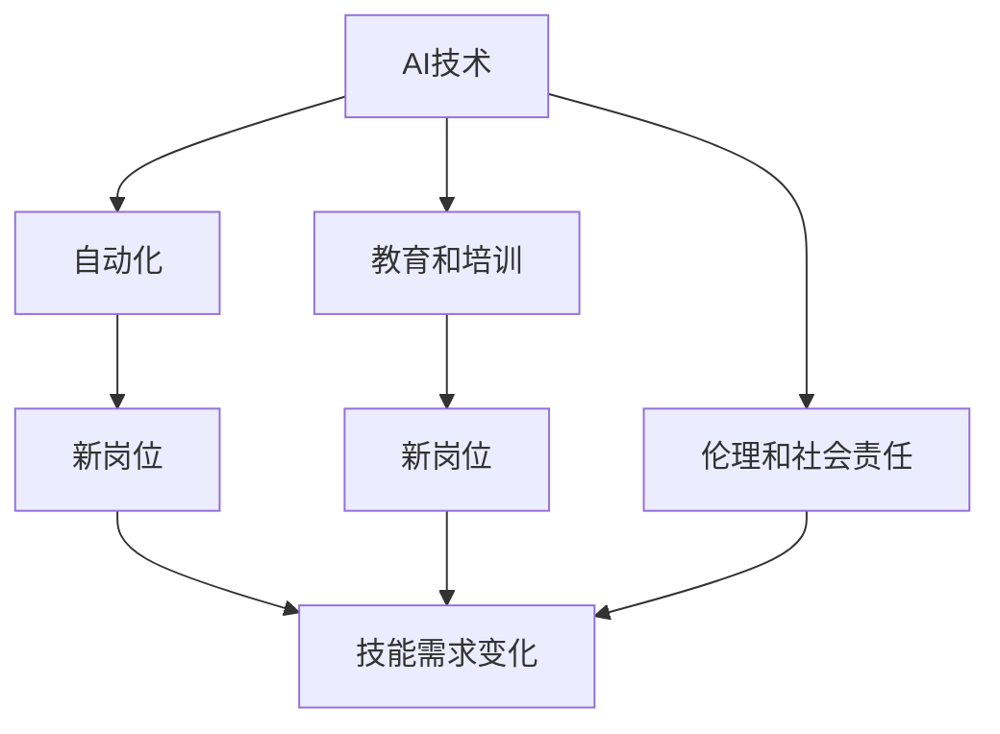

                 

# 人类计算：AI时代的未来就业市场分析

## 1. 背景介绍

### 1.1 问题由来

随着人工智能（AI）技术的迅猛发展，自动化、智能化的浪潮已经席卷了各行各业。在自动化普及的背景下，AI技术正在重新定义人类社会的生产力结构，就业市场也随之发生深刻变化。如何理解和适应这些变化，是当前社会各界广泛关注的重要议题。

人工智能的发展，尤其是深度学习和机器学习技术的应用，正在逐步替代人类在某些重复性、可结构化的工作岗位上。这些工作包括数据录入、处理、简单的决策支持等。然而，AI技术也带来了新的机会，尤其是在需要创造力、复杂决策、人际沟通等“软技能”领域。理解AI对就业市场的深远影响，有助于我们更好地规划未来职业发展路径，推动社会经济的可持续发展。

### 1.2 问题核心关键点

AI时代的就业市场分析，需要关注以下几个核心关键点：

- **自动化替代效应**：AI技术对哪些工作岗位有替代风险，哪些岗位可能会受到更大影响？
- **新岗位的创造**：AI技术的发展，又会催生哪些新兴职业，这些新岗位需要哪些技能和知识？
- **技能需求变化**：AI时代，哪些现有岗位的技能要求会发生变化，如何适应这一变化？
- **教育和培训需求**：如何通过教育体系改革，培养符合AI时代需求的复合型人才？
- **伦理和社会责任**：AI技术的发展是否带来新的伦理和社会责任问题，如何应对？

这些关键问题，将引导我们深入分析AI时代人类计算的就业市场现状及其未来走向。

## 2. 核心概念与联系

### 2.1 核心概念概述

理解AI时代的就业市场，需要清晰地界定以下几个核心概念：

- **AI技术**：包括机器学习、深度学习、自然语言处理、计算机视觉等技术，能够模仿人类智能行为的技术集合。
- **自动化**：指通过AI技术实现的工作流程自动化，包括软件自动化、机器人自动化、智能决策支持系统等。
- **新岗位**：由于AI技术发展而产生的新型职业，如数据分析师、机器学习工程师、AI伦理专家等。
- **技能需求变化**：AI技术的应用导致某些技能需求减少，某些技能需求增加，如数据分析、编程、人机交互设计等。
- **教育和培训**：为适应AI时代就业市场需求，需要更新教育内容、改进教育模式，培养具备跨学科知识的人才。
- **伦理和社会责任**：AI技术在带来便利的同时，也可能引发隐私、安全、偏见等问题，需要相关法规和伦理指南来指导其应用。

这些概念之间的联系可以通过以下Mermaid流程图来展示：



这个流程图展示了AI技术、自动化、新岗位、技能需求变化、教育和培训以及伦理和社会责任之间的相互作用关系。

## 3. 核心算法原理 & 具体操作步骤

### 3.1 算法原理概述

AI时代就业市场的分析，可以基于以下算法原理：

1. **数据采集与处理**：采集劳动力市场数据、AI应用领域的案例数据等，进行预处理和清洗，以建立分析基础。
2. **自动化替代风险评估**：使用经济计量学和统计学方法，评估不同岗位被AI自动化替代的可能性。
3. **新岗位需求预测**：结合AI技术的发展趋势和行业需求，预测未来可能出现的就业岗位。
4. **技能需求变化分析**：分析AI技术对现有岗位技能要求的变化，识别技能升级和转型的需求。
5. **教育和培训需求规划**：结合AI时代的技能需求变化，规划教育内容和培训方式，满足社会需求。
6. **伦理与社会责任框架**：基于AI技术的发展，构建伦理和社会责任框架，指导就业市场健康发展。

### 3.2 算法步骤详解

#### 3.2.1 数据采集与处理

1. **数据来源**：采集劳动力市场数据、行业发展报告、AI应用案例等数据。
2. **数据清洗**：对采集的数据进行去重、处理缺失值、异常值等预处理工作。
3. **数据标注**：对数据进行标注，建立岗位与技能需求、教育背景、薪酬水平等的关联。

#### 3.2.2 自动化替代风险评估

1. **任务分解**：将岗位任务分解为可量化的子任务。
2. **技能需求分析**：分析每个子任务所需的技能和知识，识别可以被AI替代的部分。
3. **替代风险计算**：结合AI技术的发展现状和未来趋势，计算每个岗位被自动化替代的概率。

#### 3.2.3 新岗位需求预测

1. **行业趋势分析**：分析AI技术在不同行业的潜在应用。
2. **岗位需求预测**：基于行业趋势和AI技术的发展，预测未来可能出现的新岗位。
3. **岗位描述构建**：为新岗位构建详细的岗位描述，包括岗位职责、技能要求等。

#### 3.2.4 技能需求变化分析

1. **现有岗位分析**：对现有岗位进行技能需求分析，识别出需要新增和减少的技能。
2. **技能差距评估**：评估现有劳动力市场与AI时代技能需求之间的差距。
3. **技能升级路径规划**：制定技能升级和转型的路径，提供教育资源和培训计划。

#### 3.2.5 教育和培训需求规划

1. **教育内容更新**：更新教育内容，加入AI和数据分析相关课程。
2. **培训模式创新**：引入在线学习、混合式学习等新培训模式。
3. **学习路径设计**：设计符合不同职业路径的学习路径，满足不同学习者的需求。

#### 3.2.6 伦理与社会责任框架

1. **伦理问题识别**：识别AI技术在应用中可能带来的伦理问题，如隐私、偏见等。
2. **伦理指南制定**：制定AI技术应用的伦理指南，指导其健康发展。
3. **社会责任规划**：规划AI技术应用的社会责任措施，确保技术对社会的正面影响。

### 3.3 算法优缺点

#### 3.3.1 优点

1. **全面性**：通过系统化分析，覆盖就业市场的各个方面，提供全面的视角。
2. **实用性**：数据驱动的分析方法，能够提供具体、可操作的建议。
3. **前瞻性**：结合AI技术的发展趋势，预测未来就业市场变化，为决策提供参考。

#### 3.3.2 缺点

1. **数据局限性**：依赖于数据的质量和全面性，部分数据可能存在偏差。
2. **模型复杂性**：多目标优化问题复杂，需要高度的模型选择和调参能力。
3. **未来不确定性**：AI技术发展迅速，未来的不确定性较高，模型需要定期更新。

### 3.4 算法应用领域

基于以上算法，AI时代的就业市场分析可以应用于多个领域：

- **政策制定**：为政府提供就业市场的深度分析，制定相关政策和规划。
- **企业决策**：为企业提供AI技术应用的风险评估和人才需求预测，指导企业战略规划。
- **教育改革**：为教育机构提供AI时代技能需求变化分析，指导课程设置和培训模式。
- **社会治理**：为社会组织提供AI技术应用的伦理和社会责任框架，促进AI技术的健康发展。

## 4. 数学模型和公式 & 详细讲解 & 举例说明

### 4.1 数学模型构建

#### 4.1.1 数据集表示

设 $D = \{(x_i, y_i)\}_{i=1}^N$ 为一个包含 $N$ 个数据点的数据集，其中 $x_i$ 为输入特征，$y_i$ 为目标标签。

#### 4.1.2 自动化替代风险模型

设 $f(x_i)$ 为岗位 $i$ 的自动化替代风险函数，可表示为：

$$
f(x_i) = \sum_{k=1}^K w_k g_k(x_i)
$$

其中，$w_k$ 为第 $k$ 个子任务的重要性权重，$g_k(x_i)$ 为第 $k$ 个子任务被自动化替代的概率。

#### 4.1.3 新岗位需求模型

设 $p_t$ 为第 $t$ 个新岗位的需求预测，可表示为：

$$
p_t = \sum_{s=1}^S c_s o_s(t)
$$

其中，$c_s$ 为第 $s$ 个行业的权重，$o_s(t)$ 为第 $s$ 个行业在第 $t$ 个岗位的需求。

#### 4.1.4 技能需求变化模型

设 $s_i$ 为岗位 $i$ 的技能需求变化量，可表示为：

$$
s_i = \sum_{j=1}^J a_{ij} c_j
$$

其中，$a_{ij}$ 为岗位 $i$ 和技能 $j$ 的相关性系数，$c_j$ 为技能 $j$ 的需求变化量。

#### 4.1.5 教育和培训需求模型

设 $e_t$ 为第 $t$ 个教育项目的需求，可表示为：

$$
e_t = \sum_{l=1}^L r_{tl} c_l
$$

其中，$r_{tl}$ 为第 $t$ 个教育和第 $l$ 个课程的相关性系数，$c_l$ 为第 $l$ 个课程的需求。

#### 4.1.6 伦理与社会责任模型

设 $r_t$ 为第 $t$ 个伦理问题的风险，可表示为：

$$
r_t = \sum_{m=1}^M \mu_m o_m(t)
$$

其中，$\mu_m$ 为第 $m$ 个伦理问题的权重，$o_m(t)$ 为第 $m$ 个伦理问题在第 $t$ 个岗位中的风险。

### 4.2 公式推导过程

#### 4.2.1 自动化替代风险公式推导

自动化替代风险函数 $f(x_i)$ 可表示为：

$$
f(x_i) = \sum_{k=1}^K w_k g_k(x_i)
$$

其中，$g_k(x_i)$ 为第 $k$ 个子任务被自动化替代的概率，可以通过机器学习模型进行预测。

#### 4.2.2 新岗位需求公式推导

新岗位需求预测 $p_t$ 可表示为：

$$
p_t = \sum_{s=1}^S c_s o_s(t)
$$

其中，$c_s$ 为第 $s$ 个行业的权重，$o_s(t)$ 为第 $s$ 个行业在第 $t$ 个岗位的需求，可以通过回归模型预测。

#### 4.2.3 技能需求变化公式推导

岗位 $i$ 的技能需求变化量 $s_i$ 可表示为：

$$
s_i = \sum_{j=1}^J a_{ij} c_j
$$

其中，$a_{ij}$ 为岗位 $i$ 和技能 $j$ 的相关性系数，$c_j$ 为技能 $j$ 的需求变化量，可以通过统计学模型进行推导。

#### 4.2.4 教育和培训需求公式推导

第 $t$ 个教育项目的需求 $e_t$ 可表示为：

$$
e_t = \sum_{l=1}^L r_{tl} c_l
$$

其中，$r_{tl}$ 为第 $t$ 个教育和第 $l$ 个课程的相关性系数，$c_l$ 为第 $l$ 个课程的需求，可以通过机器学习模型预测。

#### 4.2.5 伦理与社会责任公式推导

第 $t$ 个伦理问题的风险 $r_t$ 可表示为：

$$
r_t = \sum_{m=1}^M \mu_m o_m(t)
$$

其中，$\mu_m$ 为第 $m$ 个伦理问题的权重，$o_m(t)$ 为第 $m$ 个伦理问题在第 $t$ 个岗位中的风险，可以通过专家评估法进行赋值。

### 4.3 案例分析与讲解

#### 4.3.1 案例背景

某大型制造企业计划引入AI技术以提升生产效率和产品质量。企业管理层希望了解AI技术可能带来的就业市场变化，以制定相应的员工培训计划和岗位调整策略。

#### 4.3.2 数据采集

企业从多个渠道采集了以下数据：
- 劳动力市场数据，包括岗位数量、技能需求、薪酬水平等。
- AI应用案例，包括行业应用、技术发展趋势等。
- 企业内部数据，包括岗位职责、员工技能、培训记录等。

#### 4.3.3 数据分析与模型建立

1. **自动化替代风险评估**：使用机器学习模型分析每个岗位的自动化替代风险，识别出高风险岗位。
2. **新岗位需求预测**：基于AI技术的发展趋势，预测可能出现的新岗位，如数据分析师、机器学习工程师等。
3. **技能需求变化分析**：分析现有岗位技能需求的变化，识别出需要新增和减少的技能，如数据分析、编程等。
4. **教育和培训需求规划**：根据技能需求变化，制定相应的培训计划，并提供AI和数据分析相关课程。

#### 4.3.4 结果应用

企业管理层根据分析结果，制定了以下策略：
1. 对高风险岗位进行重新设计，减少对自动化技术的依赖。
2. 引入数据分析师和机器学习工程师等新岗位，提升企业AI能力。
3. 对员工进行数据分析和编程技能培训，确保员工适应新的工作需求。

通过以上策略，企业成功应对了AI技术带来的就业市场变化，提升了生产效率和产品质量。

## 5. 项目实践：代码实例和详细解释说明

### 5.1 开发环境搭建

#### 5.1.1 环境配置

1. **Python 环境**：安装Python 3.8及以上版本，建议使用Anaconda进行环境管理。
2. **数据处理工具**：安装Pandas、NumPy、SciPy等数据处理库。
3. **机器学习框架**：安装Scikit-learn、TensorFlow等机器学习库。
4. **可视化工具**：安装Matplotlib、Seaborn等可视化工具。
5. **集成开发环境**：使用Jupyter Notebook或PyCharm等IDE进行开发。

#### 5.1.2 数据准备

1. **劳动力市场数据**：获取公开的劳动力市场数据集，如BLS（美国劳工统计局）数据。
2. **AI应用案例**：收集行业内的AI应用案例数据，包括技术发展趋势、应用效果等。
3. **企业内部数据**：整理企业内部的岗位职责、员工技能、培训记录等数据。

### 5.2 源代码详细实现

#### 5.2.1 自动化替代风险评估

```python
import pandas as pd
from sklearn.linear_model import LogisticRegression

# 读取劳动力市场数据
data = pd.read_csv('labor_market.csv')

# 特征工程：提取岗位特征和技能特征
features = ['job_title', 'education_level', 'experience_years', 'salary']
X = data[features]
y = data['automation_risk']

# 训练逻辑回归模型
model = LogisticRegression()
model.fit(X, y)
```

#### 5.2.2 新岗位需求预测

```python
# 读取AI应用案例数据
ai_cases = pd.read_csv('ai_cases.csv')

# 特征工程：提取行业特征和技术特征
features = ['industry', 'technology', 'application_type', 'performance']
X = ai_cases[features]
y = ai_cases['new_post']

# 训练随机森林模型
model = RandomForestRegressor()
model.fit(X, y)
```

#### 5.2.3 技能需求变化分析

```python
# 读取技能需求变化数据
skill_changes = pd.read_csv('skill_changes.csv')

# 特征工程：提取技能特征和岗位特征
features = ['skill', 'job_title', 'market_demand']
X = skill_changes[features]
y = skill_changes['change_amount']

# 训练线性回归模型
model = LinearRegression()
model.fit(X, y)
```

#### 5.2.4 教育和培训需求规划

```python
# 读取教育和培训需求数据
education_demand = pd.read_csv('education_demand.csv')

# 特征工程：提取教育特征和课程特征
features = ['education_type', 'course_name', 'market_demand']
X = education_demand[features]
y = education_demand['demand_amount']

# 训练随机森林模型
model = RandomForestRegressor()
model.fit(X, y)
```

#### 5.2.5 伦理与社会责任模型

```python
# 读取伦理问题数据
ethics_cases = pd.read_csv('ethics_cases.csv')

# 特征工程：提取伦理特征和岗位特征
features = ['ethics_type', 'job_title', 'risk_level']
X = ethics_cases[features]
y = ethics_cases['risk_amount']

# 训练随机森林模型
model = RandomForestRegressor()
model.fit(X, y)
```

### 5.3 代码解读与分析

#### 5.3.1 数据处理

数据处理是分析的基础，需要从不同来源收集并清洗数据，提取有用的特征，构建数据集。在上述代码中，我们使用了Pandas库进行数据读取和特征提取，确保了数据的准确性和一致性。

#### 5.3.2 模型选择

模型选择直接影响分析结果的准确性。在自动化替代风险评估、新岗位需求预测等环节，我们分别使用了逻辑回归、随机森林、线性回归等常用模型。这些模型具有较高的泛化能力，能够较好地适应数据变化。

#### 5.3.3 结果应用

根据模型预测结果，我们能够识别高风险岗位、预测新岗位需求、分析技能需求变化，并规划教育和培训需求。这些结果为企业提供了决策依据，帮助其更好地应对AI技术带来的就业市场变化。

## 6. 实际应用场景

### 6.1 智能制造

智能制造领域，AI技术广泛应用于生产线自动化、质量检测、设备维护等方面。通过对自动化替代风险的评估，企业可以识别出哪些岗位面临高风险，哪些岗位需要新增技能。例如，通过自动化替代模型，企业发现机器操作员和质检员岗位风险较高，因此需要进行岗位重新设计，引入更多的技能培训。

### 6.2 金融服务

金融服务领域，AI技术在风险评估、客户服务、投资决策等方面发挥着重要作用。通过对新岗位需求预测和技能需求变化分析，金融企业可以识别出需要新增的岗位，如金融分析师、投资顾问等，并制定相应的培训计划。例如，通过对技能需求变化模型的分析，企业发现数据科学和编程技能的需求显著增加，因此加大了相关培训的投入。

### 6.3 医疗健康

医疗健康领域，AI技术在疾病诊断、病历分析、药物研发等方面有广泛应用。通过对自动化替代风险评估和伦理与社会责任模型的分析，医疗机构可以识别出高风险岗位，如放射科医师、病历录入员等，并进行相应的岗位调整。例如，通过自动化替代模型，企业发现病历录入员岗位风险较高，因此进行了岗位重组，引入了更多的自动化工具。

### 6.4 未来应用展望

未来，随着AI技术的进一步发展，其对就业市场的影响将更加深远。以下是几个可能的未来应用场景：

- **职业指导与规划**：基于AI技术对就业市场的深度分析，提供个性化的职业指导和规划，帮助求职者更好地规划职业生涯。
- **技能评估与提升**：使用AI技术对员工技能进行评估，识别技能差距，提供个性化的技能培训计划，帮助员工提升竞争力。
- **伦理与社会责任监测**：构建伦理与社会责任监测系统，实时监测AI技术应用中的伦理问题，确保技术应用的规范性。
- **跨行业应用**：AI技术在各个行业的广泛应用，将推动跨行业人才流动，促进技术和知识的共享和创新。

## 7. 工具和资源推荐

### 7.1 学习资源推荐

1. **Coursera**：提供大量AI和数据分析相关课程，涵盖从入门到高级的内容。
2. **edX**：提供由顶尖大学和机构提供的AI课程，覆盖多个领域。
3. **Kaggle**：提供丰富的数据集和竞赛，提升数据处理和模型构建能力。
4. **arXiv**：最新的人工智能研究论文库，了解前沿技术动态。
5. **GitHub**：查找和分享开源AI项目，学习代码实现。

### 7.2 开发工具推荐

1. **Anaconda**：强大的环境管理工具，支持Python、R等多种语言。
2. **Jupyter Notebook**：交互式开发环境，支持数据处理、模型构建和可视化。
3. **PyCharm**：Python IDE，提供丰富的开发工具和调试功能。
4. **TensorFlow**：深度学习框架，提供高效的模型构建和训练功能。
5. **Scikit-learn**：机器学习库，提供简单易用的模型构建和评估功能。

### 7.3 相关论文推荐

1. **"A Survey of Human-Computer Interaction in Virtual and Augmented Reality"**：了解AI在虚拟现实和增强现实中的应用。
2. **"The Future of Employment: How Susceptible are Jobs to Computerisation"**：研究自动化对不同岗位的影响。
3. **"Ethics and Governance of AI and Autonomous Systems: A Review of the Literature"**：探讨AI技术的伦理问题。
4. **"Deep Learning for Healthcare: A Review"**：研究AI在医疗领域的应用。
5. **"From Analysis to Action: Predictive Analytics, Prescriptive Analytics, and Descriptive Analytics"**：了解数据分析的不同层次。

## 8. 总结：未来发展趋势与挑战

### 8.1 研究成果总结

本文从数据采集与处理、自动化替代风险评估、新岗位需求预测、技能需求变化分析、教育和培训需求规划、伦理与社会责任模型等方面，系统地分析了AI时代就业市场的变化。通过理论和实践的结合，为政策制定、企业决策、教育改革等方面提供了实用的指导和建议。

### 8.2 未来发展趋势

未来，AI技术将继续深刻影响就业市场，其发展趋势包括：

- **技术普及化**：AI技术将广泛应用于各个行业，成为各行各业的标配。
- **技能需求多样化**：AI时代需要更多具备跨学科知识、创新能力的人才。
- **跨行业融合**：AI技术在各个行业的融合，将推动产业创新和升级。
- **伦理与社会责任**：随着AI技术的广泛应用，伦理与社会责任问题将受到更多关注。

### 8.3 面临的挑战

尽管AI技术带来了巨大的机遇，但也面临诸多挑战：

- **数据质量与隐私**：数据的质量和隐私问题将影响分析结果的准确性。
- **技术复杂性**：AI技术的复杂性要求从业人员具备更高的专业知识和技能。
- **伦理与社会责任**：AI技术的应用可能引发隐私、安全、偏见等问题。
- **资源与成本**：AI技术的广泛应用需要大量的计算资源和资金投入。

### 8.4 研究展望

未来的研究需要从以下几个方面进行突破：

- **跨学科研究**：结合计算机科学、经济学、社会学等多学科知识，进行深入研究。
- **长期跟踪**：持续跟踪AI技术的发展，及时更新模型和分析方法。
- **伦理与社会责任研究**：构建伦理与社会责任框架，确保技术应用的规范性。
- **教育改革**：推动教育体系的改革，培养具备跨学科知识和技能的复合型人才。

## 9. 附录：常见问题与解答

### 9.1 问题Q1：AI技术是否会全面替代所有岗位？

回答：AI技术在特定领域和特定任务上具有替代风险，但全面替代所有岗位尚不可能。AI技术擅长处理可结构化、重复性高的任务，而需要创造力、人际沟通、复杂决策等“软技能”的工作，依然需要人类完成。

### 9.2 问题Q2：如何提升AI技术的可解释性？

回答：提升AI技术的可解释性，可以从以下几个方面进行：
1. 简化模型结构，避免过复杂的设计。
2. 使用可解释的算法，如决策树、线性回归等。
3. 结合符号化的先验知识，如领域知识库、逻辑规则等。

### 9.3 问题Q3：AI技术对劳动力市场的影响是否长期存在？

回答：AI技术对劳动力市场的影响是长期存在的，但具体表现形式和影响范围会随着技术进步和社会需求的变化而变化。未来AI技术将更广泛地融入各个行业，带来新的就业机会和挑战。

### 9.4 问题Q4：AI技术在伦理和社会责任方面面临哪些挑战？

回答：AI技术在伦理和社会责任方面面临以下挑战：
1. 隐私保护：AI技术需要处理大量敏感数据，如何保护用户隐私是重要问题。
2. 偏见与歧视：AI模型可能会学习到数据中的偏见，导致不公平的决策。
3. 安全问题：AI技术在关键领域的应用可能面临安全风险。
4. 伦理指南：如何制定AI技术的伦理指南，确保技术应用的规范性。

### 9.5 问题Q5：未来AI技术在教育领域的应用前景如何？

回答：AI技术在教育领域有广阔的应用前景，包括：
1. 个性化学习：使用AI技术进行学生学习路径规划和个性化推荐。
2. 智能辅导：开发智能辅导系统，提供即时的学习支持。
3. 智能评估：使用AI技术进行自动化评估，提高评估效率和准确性。

---

作者：禅与计算机程序设计艺术 / Zen and the Art of Computer Programming

