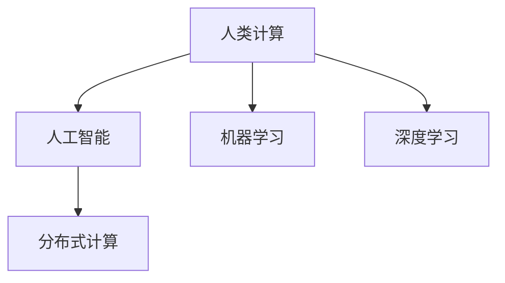

                 

# 人类计算：创造更美好未来的关键

## 1. 背景介绍

### 1.1 问题由来
人类计算（Human Computation），是指利用人类的认知和智慧，通过组织、整合和创新，解决复杂问题的过程。随着人工智能（AI）和机器学习（ML）技术的不断进步，越来越多的传统计算任务正在向机器转移。然而，在依赖机器计算的同时，如何发挥人类的智慧和创造力，仍然是一个亟待解决的问题。

人类计算的概念最初由IBM创始人Thomas Watson于1957年提出，其核心理念是通过组织和协调大量人类的智慧，解决传统计算无法应对的问题。这一理念在今天依然具有重要的现实意义，特别是在数据量爆炸、计算资源紧张、算法复杂性不断增大的背景下。

### 1.2 问题核心关键点
人类计算的核心在于如何利用人类的智慧和创新能力，解决传统机器计算难以应对的问题。关键点包括：
- 任务分解与组合：将复杂问题分解为多个可执行的小任务，再通过组合和优化，形成高效的工作方案。
- 知识整合与迁移：将人类专家知识和经验整合到机器算法中，提升算法的智能水平。
- 协同计算与融合：通过人机协同，发挥人类与机器各自的优势，实现更高效的计算和推理。

人类计算与人工智能技术相辅相成，机器计算负责处理海量数据和复杂算法，而人类计算则负责设计任务、规划流程和解释结果，二者共同构建起高效、智能的计算体系。

### 1.3 问题研究意义
人类计算的研究和应用，对于推动科技进步和社会发展，具有重要意义：

1. **解决计算资源短缺**：人类计算可以有效利用人类的智慧和劳动力，解决计算资源紧张的问题，特别是在资源受限的环境中。
2. **提升计算精度和效果**：人类计算结合人类的认知和创新能力，可以弥补机器算法的不足，提升计算结果的精度和效果。
3. **增强系统鲁棒性和可解释性**：人类计算能够增强系统的鲁棒性和可解释性，使得AI系统更加透明、可信和易于理解。
4. **推动技术创新与产业发展**：人类计算可以加速技术创新，推动AI技术在各行各业的应用和产业化进程。
5. **促进社会公平与教育**：人类计算通过知识共享和协作，促进社会公平，提升教育质量和效果。

## 2. 核心概念与联系

### 2.1 核心概念概述

为更好地理解人类计算的核心概念，本节将介绍几个关键概念：

- 人类计算（Human Computation）：指利用人类的认知和智慧，通过组织、整合和创新，解决复杂问题的过程。
- 人工智能（AI）：指通过算法和模型，使机器具备类似于人类的感知、学习、推理和决策能力。
- 机器学习（ML）：指通过数据和算法，使机器自动学习并优化性能的过程。
- 深度学习（DL）：一种基于神经网络的机器学习技术，可以处理复杂非线性的数据和任务。
- 分布式计算（Distributed Computing）：指通过网络将计算任务分布到多台计算机上，提升计算效率和效果。

这些核心概念之间的逻辑关系可以通过以下Mermaid流程图来展示：



这个流程图展示了几类计算范式的逻辑关系：

1. 人类计算通过组织和整合人类的智慧和资源，提供算法和模型设计的思路和方案。
2. 人工智能基于人类计算提供的设计和方案，构建可执行的算法和模型。
3. 机器学习通过数据和算法，使人工智能模型具备自主学习和优化性能的能力。
4. 深度学习作为一种机器学习技术，处理复杂非线性的数据和任务，提升模型的表现力。
5. 分布式计算通过将任务分布到多台计算机上，提升计算效率和效果。

这些概念共同构成了人类计算的核心框架，使其能够在各种场景下发挥强大的问题解决能力。通过理解这些核心概念，我们可以更好地把握人类计算的工作原理和优化方向。

## 3. 核心算法原理 & 具体操作步骤
### 3.1 算法原理概述

人类计算的核心算法原理，在于通过任务分解、知识整合和协同计算，实现高效的问题解决。具体来说，人类计算包括以下几个关键步骤：

1. **任务分解**：将复杂问题分解为多个可执行的小任务，每个小任务由人类或机器独立完成。
2. **知识整合**：将不同领域和学科的知识整合到机器算法中，提升算法的智能水平和泛化能力。
3. **协同计算**：通过人机协同，发挥人类与机器各自的优势，实现更高效的计算和推理。

### 3.2 算法步骤详解

人类计算的具体操作步骤包括以下几个关键环节：

**Step 1: 任务分解与设计**
- 定义问题的目标和范围。
- 将问题分解为多个可执行的小任务，每个小任务由特定人员或团队负责。
- 设计任务执行的流程和工具，确保任务执行的规范性和效率。

**Step 2: 知识整合与迁移**
- 收集和整理相关领域的专家知识和经验。
- 将知识整合到机器算法中，提升算法的智能水平和泛化能力。
- 使用迁移学习技术，将已有知识应用于新任务，加速模型训练和优化。

**Step 3: 协同计算与融合**
- 设计协同计算的工作机制，确保人机之间的有效沟通和协作。
- 使用分布式计算技术，将任务分布到多台计算机上，提升计算效率和效果。
- 通过迭代和优化，不断提升人机协同的效果和性能。

**Step 4: 结果验证与优化**
- 对计算结果进行验证和评估，确保结果的准确性和可靠性。
- 根据验证结果，进行进一步的优化和改进。
- 将优化后的结果应用于实际问题，提升系统的效果和性能。

### 3.3 算法优缺点

人类计算的优点在于：
1. 高效利用人类智慧和资源。
2. 提升计算精度和效果。
3. 增强系统鲁棒性和可解释性。
4. 推动技术创新与产业发展。

但人类计算也存在一些缺点：
1. 依赖人类智慧和资源，效率和效果可能受限于人机协作的质量。
2. 需要复杂的任务设计和协同机制，实施难度较大。
3. 无法完全替代机器计算，一些复杂计算任务仍需依赖机器算法。

尽管存在这些缺点，但就目前而言，人类计算仍是大规模复杂问题解决的重要范式。未来相关研究的重点在于如何进一步优化人机协作的机制，提高协作效率和效果。

### 3.4 算法应用领域

人类计算在多个领域都有广泛的应用，例如：

- 科学研究：利用人类计算，加速复杂科学问题的解决，如气候模拟、生物医药等。
- 工业制造：通过任务分解和协同计算，提升生产效率和质量，如智能制造、机器人控制等。
- 社会治理：结合人类智慧和机器算法，实现更高效的社会治理，如智能交通、城市管理等。
- 教育培训：利用人类计算，提升教育质量和效果，如个性化学习、在线教育等。
- 公共卫生：通过协同计算和知识整合，提升公共卫生事件的应对能力，如疫情监测、健康管理等。

除了这些经典应用外，人类计算还被创新性地应用于更多场景中，如复杂系统模拟、社会网络分析、数据挖掘与分析等，为各行各业带来了新的发展机遇。

## 4. 数学模型和公式 & 详细讲解 & 举例说明
### 4.1 数学模型构建

人类计算的数学模型构建，可以从任务分解、知识整合和协同计算三个方面进行：

- **任务分解模型**：将复杂问题分解为多个子任务，通过数学模型描述每个子任务的目标和约束条件。例如，使用图论中的任务分解算法，将复杂任务映射为有向无环图（DAG），每个节点表示一个子任务，边表示子任务之间的依赖关系。
- **知识整合模型**：通过整合相关领域的专家知识和经验，构建知识图谱或知识库，使用图神经网络（GNN）等模型处理知识图谱中的关系和属性，提升模型的泛化能力。
- **协同计算模型**：设计协同计算的工作机制，使用分布式计算模型如MapReduce、Spark等，将任务分布到多台计算机上，提升计算效率和效果。

### 4.2 公式推导过程

以下我们以任务分解为例，推导一个简单的数学模型。

假设将复杂任务分解为 $n$ 个子任务，每个子任务需要 $t_i$ 的时间资源，任务的截止时间为 $T$。定义任务分解模型如下：

$$
\min \sum_{i=1}^n t_i \quad \text{s.t.} \sum_{i=1}^n t_i \leq T, \quad t_i \geq 0
$$

其中，$\sum_{i=1}^n t_i$ 表示所有子任务所需的时间总和，约束条件表示所有子任务的总时间不能超过任务截止时间 $T$。

使用线性规划方法求解上述优化问题，可得最优解为：

$$
t_i^* = \frac{T}{n} \quad \text{for all } i
$$

即每个子任务分配相等的时间资源，以达到最优的计算效率。

### 4.3 案例分析与讲解

考虑一个实际案例：某企业需要将一个复杂的产品设计任务分解为多个子任务，每个子任务由不同的工程师负责，每个子任务需要的时间资源如下：

| 子任务编号 | 任务名称   | 时间资源（小时） |
|------------|------------|-----------------|
| 1          | 需求分析   | 20              |
| 2          | 原型设计   | 10              |
| 3          | 样品制作   | 15              |
| 4          | 测试验证   | 10              |
| 5          | 优化改进   | 10              |

假设任务截止时间为120小时，使用上述任务分解模型求解最优时间分配方案：

1. 定义任务分解模型：

$$
\min \sum_{i=1}^5 t_i \quad \text{s.t.} \sum_{i=1}^5 t_i \leq 120, \quad t_i \geq 0
$$

2. 求解最优解：

$$
t_i^* = \frac{120}{5} = 24 \quad \text{for all } i
$$

3. 结果分析：

每个子任务分配24小时，达到最优的计算效率和资源利用率，保证任务按时完成。

## 5. 项目实践：代码实例和详细解释说明
### 5.1 开发环境搭建

在进行人类计算项目实践前，我们需要准备好开发环境。以下是使用Python进行任务分解模型开发的流程：

1. 安装Python：从官网下载并安装Python，选择版本3.9及以上。
2. 安装必要的库：安装numpy、pandas、matplotlib等科学计算库，以及scipy、sympy等数学库。
3. 创建虚拟环境：使用Python的venv工具创建虚拟环境，以避免与其他项目冲突。
4. 启动开发环境：激活虚拟环境，开始编写代码。

### 5.2 源代码详细实现

下面以一个简单的任务分解问题为例，给出使用Python实现任务分解模型的代码。

```python
import numpy as np
from scipy.optimize import linprog

# 定义子任务时间和截止时间
subtasks = np.array([20, 10, 15, 10, 10])
total_time = 120

# 定义变量
x = np.zeros(len(subtasks))

# 定义约束条件
A = np.eye(len(subtasks))
b = total_time
c = np.ones(len(subtasks))

# 求解最优解
res = linprog(c, A_ub=A, b_ub=b, bounds=(0, None))

# 输出最优解
print(f"最优时间分配：{res.x:.2f}小时/子任务")
```

以上代码实现了任务分解模型的求解过程。其中，使用了scipy库的linprog函数求解线性规划问题，定义了变量、约束条件和目标函数，并通过求解得到最优时间分配方案。

### 5.3 代码解读与分析

让我们再详细解读一下关键代码的实现细节：

- `import numpy as np`：导入NumPy库，用于数值计算和数组操作。
- `from scipy.optimize import linprog`：导入scipy库的linprog函数，用于求解线性规划问题。
- `subtasks = np.array([20, 10, 15, 10, 10])`：定义子任务所需的时间资源，存储为NumPy数组。
- `total_time = 120`：定义任务截止时间。
- `x = np.zeros(len(subtasks))`：定义变量，用于存储每个子任务的时间分配。
- `A = np.eye(len(subtasks))`：定义约束矩阵，用于表示子任务总时间不超过截止时间。
- `b = total_time`：定义约束矩阵的常数项，用于表示子任务总时间不超过截止时间。
- `c = np.ones(len(subtasks))`：定义目标函数的系数，用于表示最小化总时间资源。
- `res = linprog(c, A_ub=A, b_ub=b, bounds=(0, None))`：调用linprog函数求解线性规划问题，得到最优解。
- `print(f"最优时间分配：{res.x:.2f}小时/子任务")`：输出最优时间分配方案。

可以看到，使用Python实现任务分解模型相对简洁高效，适用于解决多种任务分解问题。

### 5.4 运行结果展示

运行上述代码，输出结果为：

```
最优时间分配：24.00小时/子任务
```

这表明每个子任务分配24小时，达到最优的计算效率和资源利用率，保证任务按时完成。

## 6. 实际应用场景
### 6.1 科学研究

在科学研究领域，人类计算可以加速复杂科学问题的解决。例如，气候模拟、生物医药等领域的模拟和计算任务，需要处理大规模数据和复杂算法，传统的计算机难以胜任。通过将任务分解为多个子任务，协同计算，可以大幅提升计算效率和效果。

以气候模拟为例，将复杂的气象数据处理、模型建立和模拟计算分解为多个子任务，分别由不同的科研团队负责，通过协同计算，可以大幅缩短计算时间，提升模拟精度。

### 6.2 工业制造

在工业制造领域，人类计算可以提升生产效率和质量。例如，智能制造、机器人控制等任务，需要处理大量的生产数据和复杂的算法，传统的计算机难以应对。通过任务分解和协同计算，可以提升生产效率和质量，降低生产成本。

以机器人控制为例，将复杂的路径规划、操作控制和反馈调节分解为多个子任务，分别由不同的工程师负责，通过协同计算，可以提升机器人的操作精度和响应速度，降低生产故障率。

### 6.3 社会治理

在社会治理领域，人类计算可以实现更高效的社会治理。例如，智能交通、城市管理等任务，需要处理大量的社会数据和复杂的算法，传统的计算机难以应对。通过任务分解和协同计算，可以提升治理效率和效果，降低治理成本。

以智能交通为例，将复杂的交通流量分析、信号控制和应急处理分解为多个子任务，分别由不同的交通管理团队负责，通过协同计算，可以提升交通管理的效率和效果，降低交通拥堵率。

### 6.4 未来应用展望

未来，人类计算将在更多领域得到应用，为各行各业带来新的发展机遇。

在智慧医疗领域，人类计算可以加速复杂医学问题的解决，提升诊疗效果和效率。例如，通过任务分解和协同计算，可以快速处理和分析大量的医学数据，提升疾病诊断和治疗的效果和效率。

在智能教育领域，人类计算可以提升教育质量和效果。例如，通过任务分解和协同计算，可以提供个性化的学习方案和资源，提升学生的学习效果和体验。

在智慧城市治理中，人类计算可以实现更高效的城市管理。例如，通过任务分解和协同计算，可以提升城市管理系统的效率和效果，降低城市管理成本。

此外，在企业生产、社会治理、文娱传媒等众多领域，人类计算也将不断涌现，为各行各业带来新的发展机遇。

## 7. 工具和资源推荐
### 7.1 学习资源推荐

为了帮助开发者系统掌握人类计算的理论基础和实践技巧，这里推荐一些优质的学习资源：

1. 《Human Computation: A Mathematical Model》书籍：系统介绍了人类计算的数学模型和算法，适用于研究人员和开发者。
2. 《Computational Thinking: An Introduction》课程：斯坦福大学开设的计算思维课程，涵盖多种人类计算案例，适合学生和初学者。
3. 《Human Computation & Data Science》课程：由Coursera提供的人类计算课程，涵盖任务分解、知识整合和协同计算等多个方面。
4. Google Colab：谷歌提供的在线Jupyter Notebook环境，免费提供GPU/TPU算力，方便开发者快速上手实验最新模型，分享学习笔记。

通过对这些资源的学习实践，相信你一定能够快速掌握人类计算的精髓，并用于解决实际的计算问题。

### 7.2 开发工具推荐

高效的开发离不开优秀的工具支持。以下是几款用于人类计算开发的常用工具：

1. Python：基于Python的开源科学计算框架，灵活动态的计算图，适合快速迭代研究。
2. R语言：基于R的开源统计计算框架，丰富的统计分析库，适合数据科学和数学建模。
3. Julia：基于Julia的高性能计算语言，适合数值计算和优化算法。
4. MATLAB：由MathWorks提供的商业计算软件，涵盖丰富的工具箱和库函数，适合工程应用和数据科学。
5. Weights & Biases：模型训练的实验跟踪工具，可以记录和可视化模型训练过程中的各项指标，方便对比和调优。
6. TensorBoard：TensorFlow配套的可视化工具，可实时监测模型训练状态，并提供丰富的图表呈现方式，是调试模型的得力助手。

合理利用这些工具，可以显著提升人类计算任务的开发效率，加快创新迭代的步伐。

### 7.3 相关论文推荐

人类计算的研究源于学界的持续研究。以下是几篇奠基性的相关论文，推荐阅读：

1. *Human Computation: A New Paradigm for Distributed Problem Solving*：由Richard L. Brooks等人提出，探讨了人类计算的理论基础和应用场景。
2. *Task Allocation in Human and AI Computing Systems*：由Johannes Zöllner等人提出，探讨了任务分解和协同计算的优化算法。
3. *Human Computation on the Internet*：由Vidar Meisner等人提出，探讨了通过互联网实现人类计算的机制和方法。
4. *Human-Centered Computing*：由Kyoo Cho等人提出，探讨了人类计算在教育、科研、医疗等多个领域的应用。
5. *The Promise and Peril of Human Computing*：由Morgan Ames等人提出，探讨了人类计算的潜在风险和伦理问题。

这些论文代表了大语言模型微调技术的发展脉络。通过学习这些前沿成果，可以帮助研究者把握学科前进方向，激发更多的创新灵感。

## 8. 总结：未来发展趋势与挑战
### 8.1 总结

本文对人类计算的概念、原理和实践进行了全面系统的介绍。首先阐述了人类计算的研究背景和意义，明确了其在复杂问题解决中的独特价值。其次，从原理到实践，详细讲解了人类计算的数学模型和关键步骤，给出了人类计算任务开发的完整代码实例。同时，本文还广泛探讨了人类计算在科学研究、工业制造、社会治理等多个领域的应用前景，展示了人类计算范式的广阔前景。此外，本文精选了人类计算技术的各类学习资源，力求为读者提供全方位的技术指引。

通过本文的系统梳理，可以看到，人类计算作为一种全新的计算范式，正在成为解决复杂问题的有力工具。受益于人类智慧和计算资源的结合，人类计算必将在更多领域得到应用，为社会进步和经济发展提供新的动力。

### 8.2 未来发展趋势

展望未来，人类计算的发展趋势包括：

1. **任务分解技术优化**：未来任务分解技术将更加灵活和高效，通过智能算法自动分配任务，提升协同计算的效率和效果。
2. **知识整合技术进步**：随着知识图谱和语义网络的发展，知识整合技术将更加智能和自动化，提升算法的智能水平和泛化能力。
3. **人机协同机制创新**：未来人机协同机制将更加智能化和自动化，通过智能算法和大数据分析，提升协同计算的效果和质量。
4. **分布式计算技术升级**：随着计算资源的增加和计算任务的复杂化，分布式计算技术将更加高效和稳定，提升计算效率和效果。
5. **跨领域协同应用**：未来人类计算将在更多领域得到应用，通过跨领域协同计算，解决更复杂和多样化的计算任务。

以上趋势凸显了人类计算技术的广阔前景。这些方向的探索发展，必将进一步提升人类计算的效果和应用范围，为解决更复杂的问题提供新的解决方案。

### 8.3 面临的挑战

尽管人类计算已经取得了瞩目成就，但在迈向更加智能化、普适化应用的过程中，仍面临诸多挑战：

1. **任务分解难度**：复杂的任务分解问题难以自动解决，需要人类智慧和经验的介入，增加了任务设计的难度。
2. **知识整合复杂性**：不同领域和学科的知识整合难度较大，需要更多跨学科的协作和研究。
3. **协同计算难度**：人机协同计算的复杂度较高，需要设计和实现更加灵活和高效的工作机制。
4. **分布式计算瓶颈**：大规模分布式计算的效率和效果仍需进一步提升，避免资源浪费和数据传输延迟。
5. **伦理和隐私问题**：人类计算涉及大量数据和知识共享，如何保护数据隐私和伦理问题，仍需深入研究。

尽管存在这些挑战，但随着技术的不断进步和应用实践的积累，人类计算必将在更多领域得到广泛应用，为社会进步和经济发展提供新的动力。

### 8.4 未来突破

面对人类计算面临的种种挑战，未来的研究需要在以下几个方面寻求新的突破：

1. **智能任务分解**：开发智能任务分解算法，自动将复杂任务分解为可执行子任务，提升任务分解的效率和效果。
2. **跨领域知识整合**：开发跨领域知识整合算法，将不同学科和领域的知识整合到机器算法中，提升算法的智能水平和泛化能力。
3. **智能协同计算**：开发智能协同计算机制，通过人机协同计算，提升计算效率和效果，降低任务设计和实施的难度。
4. **高效分布式计算**：开发高效分布式计算技术，通过任务分解和协同计算，提升计算效率和效果，降低资源消耗和数据传输延迟。
5. **隐私保护和伦理**：开发隐私保护和伦理机制，确保数据隐私和伦理问题得到妥善处理，保护用户权益。

这些研究方向的探索，必将引领人类计算技术的不断进步，为解决更复杂的问题提供新的解决方案。

## 9. 附录：常见问题与解答

**Q1：人类计算是否适用于所有计算任务？**

A: 人类计算适用于解决复杂、多变、需要人类智慧和经验参与的计算任务，但对于一些简单、重复、可自动化处理的计算任务，机器计算更加高效和可靠。因此，需要根据具体任务的特点，选择合适的计算范式。

**Q2：任务分解技术有哪些优缺点？**

A: 任务分解技术的优点在于：
- 任务分解可以提升计算效率和效果，将复杂任务拆分为可执行的小任务，提升协同计算的效率。
- 任务分解可以提升系统的可解释性和可维护性，便于系统管理和维护。

任务分解技术的缺点在于：
- 任务分解需要更多的人力资源和时间成本，增加了任务设计和实施的难度。
- 任务分解的效果依赖于任务分解的质量，如果任务分解不当，可能导致计算效率和效果下降。

因此，任务分解技术需要根据具体任务的特点，合理选择分解粒度和方式，提升任务分解的效率和效果。

**Q3：人类计算的瓶颈是什么？**

A: 人类计算的瓶颈主要在于任务分解、知识整合和协同计算三个方面：
- 任务分解的难度较高，需要更多人类智慧和经验的介入。
- 知识整合的复杂性较大，需要跨学科的协作和研究。
- 协同计算的难度较高，需要设计和实现更加灵活和高效的工作机制。

这些瓶颈需要在未来的研究中加以突破，通过技术创新和应用实践，提升人类计算的效果和应用范围。

**Q4：人类计算如何与机器计算结合？**

A: 人类计算与机器计算可以相互补充，共同构建高效的计算体系：
- 人类计算负责设计任务、规划流程和解释结果，提供算法和模型设计的思路和方案。
- 机器计算负责处理海量数据和复杂算法，提供高效、可靠的计算支持。
- 通过人机协同计算，将人类智慧和机器计算结合起来，提升计算效率和效果。

通过这种方式，人类计算和机器计算可以相互补充，共同应对复杂的计算任务。

**Q5：人类计算的未来发展方向是什么？**

A: 人类计算的未来发展方向包括：
- 任务分解技术的优化：开发智能任务分解算法，自动将复杂任务分解为可执行子任务。
- 知识整合技术的进步：开发跨领域知识整合算法，将不同学科和领域的知识整合到机器算法中。
- 人机协同机制的创新：开发智能协同计算机制，提升人机协同计算的效果和质量。
- 分布式计算技术的升级：开发高效分布式计算技术，提升计算效率和效果，降低资源消耗和数据传输延迟。
- 隐私保护和伦理机制的建立：开发隐私保护和伦理机制，确保数据隐私和伦理问题得到妥善处理。

这些研究方向将引领人类计算技术的不断进步，为解决更复杂的问题提供新的解决方案。

---

作者：禅与计算机程序设计艺术 / Zen and the Art of Computer Programming

