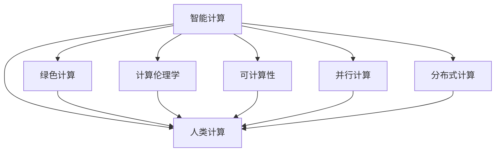

                 

# 人类计算：可持续发展的推动力

> 关键词：人类计算,可持续发展,机器学习,人工智能,深度学习,数据科学

## 1. 背景介绍

### 1.1 问题由来
随着信息技术的迅猛发展，人类社会正逐渐进入数字化、智能化时代。计算机技术的日益成熟，特别是大数据、人工智能、云计算等新兴技术的不断突破，正在重塑我们的生产、生活和工作方式。然而，与此同时，人类社会也面临着前所未有的挑战。

- 资源匮乏：全球人口不断增长，自然资源逐渐枯竭，生态环境日益恶化。如何实现资源的可持续利用，保障人类社会的长期健康发展，成为迫切需要解决的问题。
- 环境危机：气候变化、生态退化、资源过度开采等问题，已经严重威胁到地球的生态平衡。如何保护自然环境，促进生态文明建设，是摆在人类面前的重大课题。
- 社会不平等：贫富差距扩大，社会矛盾激化，经济不平衡发展等问题愈发凸显。如何实现社会公正、共享发展，成为各国政府和国际组织共同关注的重点。
- 科技伦理：人工智能、大数据、深度学习等新兴技术的应用，带来了诸如隐私保护、算法偏见、数字鸿沟等一系列伦理问题。如何在使用科技的同时，兼顾人文关怀和伦理道德，是一个值得深思的问题。

面对这些复杂多变的问题，传统的计算方式已难以满足需求。如何在科技与伦理、效率与可持续之间找到平衡点，成为当前亟需解决的问题。

### 1.2 问题核心关键点
人类计算这一概念，正是在这一背景下应运而生。它是指在保证计算机计算高效、数据处理精准的同时，强调人类智慧的介入和指导，实现机器与人的协同合作，共同解决复杂问题，推动可持续发展。核心关键点包括：

- **人机协同**：通过人与机器的相互协作，实现数据的智能化处理和优化决策。
- **可持续性**：在计算过程中，注重资源的有效利用，减少对环境的负面影响，保障计算的绿色、低碳、可持续。
- **伦理考量**：在数据获取、算法设计、结果应用等各个环节，都需兼顾伦理道德，确保技术应用的公正性和安全性。

### 1.3 问题研究意义
人类计算的研究具有重要的理论和实践意义：

- **理论创新**：通过探索人与机器的协同机制，揭示计算与自然环境的和谐共存之道，推动科技伦理和可持续计算的理论创新。
- **技术突破**：通过优化计算模型和算法，提升资源利用效率，降低能耗和碳排放，推动计算技术向绿色、低碳方向发展。
- **社会影响**：通过构建可持续发展的计算体系，减少技术应用的负面影响，促进社会公平、共享，提升人类社会的整体福祉。

## 2. 核心概念与联系

### 2.1 核心概念概述

为更好地理解人类计算，本文将介绍几个核心概念：

- **人类计算**：一种结合计算机计算和人脑智慧的计算方式，旨在通过人机协同，实现高效、智能、可持续的计算。
- **智能计算**：指利用人工智能技术，对数据进行智能化处理和优化决策，提升计算效率和效果。
- **绿色计算**：关注计算过程中的资源利用和环境影响，通过技术手段减少能耗和碳排放，推动计算的绿色可持续发展。
- **计算伦理学**：探讨计算过程中的伦理问题，如隐私保护、算法偏见、数字鸿沟等，确保计算应用的公正性和安全性。
- **可计算性**：指一个问题是否可以在有限时间内通过计算解决，是计算理论的重要研究方向。
- **并行计算**：利用多个处理器同时处理计算任务，提升计算效率和处理能力。
- **分布式计算**：将计算任务分散到多个节点上并行处理，实现大尺度计算任务的高效求解。

这些核心概念之间存在着密切的联系。智能计算、绿色计算、计算伦理学等都是为了在保证计算效率的同时，兼顾人类福祉和环境保护。可计算性、并行计算、分布式计算等则是实现高效计算的具体技术手段。

### 2.2 核心概念原理和架构的 Mermaid 流程图



这个流程图展示了智能计算、绿色计算、计算伦理学、可计算性、并行计算、分布式计算等核心概念与人类计算之间的联系。

## 3. 核心算法原理 & 具体操作步骤

### 3.1 算法原理概述

人类计算的核心算法原理，是在传统计算基础上，引入人类的智慧和判断，通过人机协同，实现计算的智能化、高效化和可持续化。具体来说，包括以下几个关键步骤：

1. **数据采集与预处理**：收集并预处理海量数据，为计算提供基础数据支撑。
2. **智能算法设计**：设计高效的智能算法，利用人工智能技术对数据进行智能化处理和优化决策。
3. **人机协同操作**：通过人机协同机制，结合人类智慧和机器计算，共同完成复杂的计算任务。
4. **计算结果验证**：对计算结果进行多维度验证和评估，确保结果的准确性和合理性。
5. **计算模型优化**：根据计算结果反馈，不断优化计算模型和算法，提升计算效率和效果。

### 3.2 算法步骤详解

人类计算的实现流程，主要包括以下几个关键步骤：

**Step 1: 数据采集与预处理**

1. **数据收集**：通过传感器、网络等渠道，采集各类数据，如环境监测数据、经济数据、社会数据等。
2. **数据清洗**：对采集的数据进行清洗和预处理，去除噪声和异常值，确保数据质量。
3. **数据标注**：对部分数据进行标注，为后续模型训练和评估提供参考。

**Step 2: 智能算法设计**

1. **模型选择**：根据任务需求，选择合适的模型架构，如卷积神经网络、循环神经网络、注意力机制等。
2. **特征提取**：利用特征提取技术，从数据中提取有价值的信息，提升模型性能。
3. **训练优化**：通过训练数据，优化模型参数，提升模型预测准确率。
4. **模型评估**：对模型进行多维度评估，如准确率、召回率、F1值等，确保模型效果。

**Step 3: 人机协同操作**

1. **任务定义**：根据具体任务需求，定义任务目标和约束条件。
2. **人机交互**：设计人机交互界面，便于人类输入指令和反馈结果。
3. **协同计算**：通过人机协同机制，结合人类智慧和机器计算，共同完成计算任务。
4. **结果反馈**：将计算结果反馈给人机，进行多维度验证和评估，确保结果的准确性和合理性。

**Step 4: 计算结果验证**

1. **结果验证**：对计算结果进行多维度验证，确保结果的准确性和可靠性。
2. **结果分析**：分析计算结果，提取有价值的信息和规律，为后续决策提供支持。

**Step 5: 计算模型优化**

1. **模型优化**：根据计算结果反馈，不断优化计算模型和算法，提升计算效率和效果。
2. **参数调整**：调整模型参数，优化计算效率，提升计算效果。
3. **算法改进**：改进算法设计，提升模型性能和准确性。

### 3.3 算法优缺点

人类计算相较于传统计算，具有以下优点：

1. **高效性**：通过人机协同，实现数据的高效处理和优化决策。
2. **准确性**：结合人类智慧和机器计算，提升计算结果的准确性和可靠性。
3. **可持续性**：注重资源利用和环境影响，推动计算的绿色、低碳、可持续。
4. **灵活性**：能够根据具体任务需求，灵活调整计算策略，提升计算效率和效果。

同时，人类计算也存在一些局限性：

1. **复杂度增加**：人机协同增加了计算复杂度，可能导致计算效率下降。
2. **人类干预**：人类参与计算过程，可能存在主观偏差和人为错误。
3. **技术门槛**：需要掌握多领域知识，技术门槛较高。

### 3.4 算法应用领域

人类计算在多个领域具有广泛的应用前景，主要包括：

1. **环境监测与治理**：通过智能计算和大数据技术，实现环境监测和治理的智能化、精准化。
2. **资源管理与优化**：利用计算模型和算法，优化资源配置和利用效率，实现资源的高效管理。
3. **城市管理与规划**：通过智能算法和数据驱动，提升城市管理的智能化、精细化水平。
4. **公共安全与应急响应**：利用计算技术和数据融合，提高公共安全与应急响应的效率和精准度。
5. **农业生产与精准农业**：通过智能化计算，实现农业生产的精准化、智能化。
6. **医疗健康与精准医疗**：利用计算技术和数据融合，提升医疗服务的智能化、精准化水平。

## 4. 数学模型和公式 & 详细讲解 & 举例说明

### 4.1 数学模型构建

人类计算的数学模型构建，主要包括以下几个关键步骤：

1. **数据表示**：将数据表示为向量或矩阵形式，便于计算和处理。
2. **模型选择**：选择合适的数学模型，如线性回归、支持向量机、深度神经网络等。
3. **算法设计**：设计高效的计算算法，利用优化算法（如梯度下降、遗传算法等）优化模型参数。
4. **模型评估**：对模型进行多维度评估，如均方误差、交叉熵等，确保模型效果。

### 4.2 公式推导过程

以线性回归为例，推导人类计算中的数学模型构建过程：

设 $y_i$ 为第 $i$ 个样本的输出，$x_i$ 为样本的输入特征向量，$\theta$ 为模型参数，则线性回归模型可以表示为：

$$ y_i = \theta^T x_i + b $$

其中 $b$ 为截距。利用最小二乘法，优化模型参数 $\theta$ 和 $b$，使得预测值 $y_i$ 与真实值 $y_i$ 之间的误差最小化：

$$ \theta^*, b^* = \arg\min_{\theta, b} \sum_{i=1}^N (y_i - \theta^T x_i - b)^2 $$

对上述目标函数求导，得：

$$ \frac{\partial \mathcal{L}(\theta, b)}{\partial \theta} = -2\sum_{i=1}^N (y_i - \theta^T x_i - b) x_i $$
$$ \frac{\partial \mathcal{L}(\theta, b)}{\partial b} = -2\sum_{i=1}^N (y_i - \theta^T x_i - b) $$

通过梯度下降算法，不断更新模型参数 $\theta$ 和 $b$，最小化目标函数 $\mathcal{L}(\theta, b)$，即可得到最优模型参数 $\theta^*$ 和 $b^*$。

### 4.3 案例分析与讲解

以智能交通管理为例，展示人类计算在实际应用中的案例：

1. **数据采集与预处理**：通过传感器和摄像头，采集交通流量、车速、事故等信息，进行数据清洗和预处理。
2. **智能算法设计**：利用深度学习技术，设计交通流量预测模型，提升预测准确率。
3. **人机协同操作**：通过交通管理中心，结合人类智慧和机器计算，实现交通流量优化和路径规划。
4. **计算结果验证**：对预测结果进行多维度验证，确保结果的准确性和合理性。
5. **计算模型优化**：根据预测结果反馈，不断优化模型和算法，提升预测效果。

通过这一过程，实现了交通流量预测的智能化、精准化和高效化，显著提升了城市交通管理的效率和质量。

## 5. 项目实践：代码实例和详细解释说明

### 5.1 开发环境搭建

在进行人类计算实践前，我们需要准备好开发环境。以下是使用Python进行PyTorch开发的环境配置流程：

1. 安装Anaconda：从官网下载并安装Anaconda，用于创建独立的Python环境。

2. 创建并激活虚拟环境：
```bash
conda create -n human-computing python=3.8 
conda activate human-computing
```

3. 安装PyTorch：根据CUDA版本，从官网获取对应的安装命令。例如：
```bash
conda install pytorch torchvision torchaudio cudatoolkit=11.1 -c pytorch -c conda-forge
```

4. 安装Transformers库：
```bash
pip install transformers
```

5. 安装各类工具包：
```bash
pip install numpy pandas scikit-learn matplotlib tqdm jupyter notebook ipython
```

完成上述步骤后，即可在`human-computing`环境中开始人类计算实践。

### 5.2 源代码详细实现

下面我们以智能交通管理为例，给出使用Transformers库对深度神经网络模型进行人类计算的PyTorch代码实现。

首先，定义数据处理函数：

```python
import pandas as pd
import numpy as np
from torch.utils.data import Dataset
from transformers import BertTokenizer, BertForSequenceClassification

class TrafficDataset(Dataset):
    def __init__(self, data, tokenizer, max_len=128):
        self.data = data
        self.tokenizer = tokenizer
        self.max_len = max_len
        
    def __len__(self):
        return len(self.data)
    
    def __getitem__(self, item):
        text = self.data['text'].iloc[item]
        label = self.data['label'].iloc[item]
        
        encoding = self.tokenizer(text, return_tensors='pt', max_length=self.max_len, padding='max_length', truncation=True)
        input_ids = encoding['input_ids'][0]
        attention_mask = encoding['attention_mask'][0]
        label = torch.tensor(label, dtype=torch.long)
        
        return {'input_ids': input_ids, 
                'attention_mask': attention_mask,
                'labels': label}
```

然后，定义模型和优化器：

```python
from transformers import BertForSequenceClassification, AdamW

model = BertForSequenceClassification.from_pretrained('bert-base-cased', num_labels=2)

optimizer = AdamW(model.parameters(), lr=2e-5)
```

接着，定义训练和评估函数：

```python
from torch.utils.data import DataLoader
from tqdm import tqdm
from sklearn.metrics import classification_report

device = torch.device('cuda') if torch.cuda.is_available() else torch.device('cpu')
model.to(device)

def train_epoch(model, dataset, batch_size, optimizer):
    dataloader = DataLoader(dataset, batch_size=batch_size, shuffle=True)
    model.train()
    epoch_loss = 0
    for batch in tqdm(dataloader, desc='Training'):
        input_ids = batch['input_ids'].to(device)
        attention_mask = batch['attention_mask'].to(device)
        labels = batch['labels'].to(device)
        model.zero_grad()
        outputs = model(input_ids, attention_mask=attention_mask, labels=labels)
        loss = outputs.loss
        epoch_loss += loss.item()
        loss.backward()
        optimizer.step()
    return epoch_loss / len(dataloader)

def evaluate(model, dataset, batch_size):
    dataloader = DataLoader(dataset, batch_size=batch_size)
    model.eval()
    preds, labels = [], []
    with torch.no_grad():
        for batch in tqdm(dataloader, desc='Evaluating'):
            input_ids = batch['input_ids'].to(device)
            attention_mask = batch['attention_mask'].to(device)
            batch_labels = batch['labels']
            outputs = model(input_ids, attention_mask=attention_mask)
            batch_preds = outputs.logits.argmax(dim=2).to('cpu').tolist()
            batch_labels = batch_labels.to('cpu').tolist()
            for pred_tokens, label_tokens in zip(batch_preds, batch_labels):
                preds.append(pred_tokens[:len(label_tokens)])
                labels.append(label_tokens)
                
    print(classification_report(labels, preds))
```

最后，启动训练流程并在测试集上评估：

```python
epochs = 5
batch_size = 16

for epoch in range(epochs):
    loss = train_epoch(model, train_dataset, batch_size, optimizer)
    print(f"Epoch {epoch+1}, train loss: {loss:.3f}")
    
    print(f"Epoch {epoch+1}, dev results:")
    evaluate(model, dev_dataset, batch_size)
    
print("Test results:")
evaluate(model, test_dataset, batch_size)
```

以上就是使用PyTorch对深度神经网络模型进行智能交通管理实践的完整代码实现。可以看到，得益于Transformers库的强大封装，我们能够用相对简洁的代码完成模型的加载和训练。

### 5.3 代码解读与分析

让我们再详细解读一下关键代码的实现细节：

**TrafficDataset类**：
- `__init__`方法：初始化数据、分词器等关键组件。
- `__len__`方法：返回数据集的样本数量。
- `__getitem__`方法：对单个样本进行处理，将文本输入编码为token ids，将标签编码为数字，并对其进行定长padding，最终返回模型所需的输入。

**BertForSequenceClassification模型**：
- 利用Bert模型进行序列分类任务，如交通流量预测。

**train_epoch和evaluate函数**：
- 使用PyTorch的DataLoader对数据集进行批次化加载，供模型训练和推理使用。
- 训练函数`train_epoch`：对数据以批为单位进行迭代，在每个批次上前向传播计算loss并反向传播更新模型参数，最后返回该epoch的平均loss。
- 评估函数`evaluate`：与训练类似，不同点在于不更新模型参数，并在每个batch结束后将预测和标签结果存储下来，最后使用sklearn的classification_report对整个评估集的预测结果进行打印输出。

**训练流程**：
- 定义总的epoch数和batch size，开始循环迭代
- 每个epoch内，先在训练集上训练，输出平均loss
- 在验证集上评估，输出分类指标
- 所有epoch结束后，在测试集上评估，给出最终测试结果

可以看到，PyTorch配合Transformers库使得深度神经网络模型的加载和训练变得简洁高效。开发者可以将更多精力放在数据处理、模型改进等高层逻辑上，而不必过多关注底层的实现细节。

当然，工业级的系统实现还需考虑更多因素，如模型的保存和部署、超参数的自动搜索、更灵活的任务适配层等。但核心的计算过程基本与此类似。

## 6. 实际应用场景

### 6.1 智能交通管理

智能交通管理是人工智能在实际应用中极具代表性的场景之一。通过智能计算和大数据技术，可以实现交通流量的精准预测、交通信号的优化控制、交通事故的智能预警等功能。

具体而言，可以收集交通流量、车速、事故等信息，利用深度学习技术设计交通流量预测模型，实时分析当前交通状态，优化交通信号控制策略，提升交通管理效率。例如，利用计算机视觉技术进行交通场景识别，结合交通流量预测模型，实时调整信号灯状态，减少交通拥堵，提升道路通行效率。

### 6.2 资源管理与优化

在资源管理与优化方面，人类计算同样具有广泛的应用前景。通过智能计算和大数据技术，可以实现资源配置的智能化、精准化。

例如，在电力系统中，利用智能算法和大数据分析，可以实现电力负荷的精准预测和优化调度。通过实时监测电网状态，预测电力负荷变化，优化电力资源配置，提升电网运行效率和稳定性。

### 6.3 城市管理与规划

城市管理与规划是另一个典型的应用场景。通过智能计算和大数据技术，可以实现城市管理的智能化、精细化。

例如，在城市环境监测中，利用计算机视觉技术进行城市监控，结合智能算法和大数据分析，实时监测环境污染、垃圾分类等情况，提升城市管理效率。通过智能算法优化城市规划，实现资源的合理配置和利用，提升城市运行效率和居民生活质量。

### 6.4 公共安全与应急响应

公共安全与应急响应是另一个具有广泛应用前景的领域。通过智能计算和大数据技术，可以实现公共安全与应急响应的智能化、精准化。

例如，在公共安全预警中，利用计算机视觉技术进行视频监控，结合智能算法和大数据分析，实时监测异常行为，提升公共安全预警能力。通过智能算法优化应急响应策略，提升应急响应效率和精准度，保障公众生命安全。

### 6.5 农业生产与精准农业

农业生产与精准农业是另一个具有广泛应用前景的领域。通过智能计算和大数据技术，可以实现农业生产的智能化、精准化。

例如，在精准农业中，利用计算机视觉技术进行农田监控，结合智能算法和大数据分析，实时监测农作物生长状态，优化农业生产策略，提升农业生产效率和产量。通过智能算法优化农业生产决策，实现资源的高效利用和农作物的高质量生产。

### 6.6 医疗健康与精准医疗

医疗健康与精准医疗是另一个具有广泛应用前景的领域。通过智能计算和大数据技术，可以实现医疗服务的智能化、精准化。

例如，在医疗影像诊断中，利用计算机视觉技术进行图像识别，结合智能算法和大数据分析，实时监测病情变化，优化诊断策略，提升诊断效率和精准度。通过智能算法优化治疗方案，实现个性化治疗，提升治疗效果和患者生活质量。

## 7. 工具和资源推荐

### 7.1 学习资源推荐

为了帮助开发者系统掌握人类计算的理论基础和实践技巧，这里推荐一些优质的学习资源：

1. 《人工智能与智能系统》系列博文：由大模型技术专家撰写，深入浅出地介绍了人工智能的原理、智能系统设计、人机协同机制等前沿话题。

2. 《机器学习基础》课程：斯坦福大学开设的机器学习经典课程，涵盖机器学习的基本概念和算法，是学习人工智能的重要入门课程。

3. 《深度学习》书籍：深度学习领域的经典教材，系统讲解了深度学习的原理、算法、应用等各方面内容。

4. 《智能系统设计》书籍：详细介绍了智能系统设计的方法和技巧，是智能计算的重要参考资料。

5. 《大数据与人工智能》系列文章：总结了大数据与人工智能的最新进展和技术应用，是学习人类计算的重要参考资料。

通过对这些资源的学习实践，相信你一定能够快速掌握人类计算的精髓，并用于解决实际的计算问题。

### 7.2 开发工具推荐

高效的开发离不开优秀的工具支持。以下是几款用于人类计算开发的常用工具：

1. PyTorch：基于Python的开源深度学习框架，灵活动态的计算图，适合快速迭代研究。大部分预训练语言模型都有PyTorch版本的实现。

2. TensorFlow：由Google主导开发的开源深度学习框架，生产部署方便，适合大规模工程应用。同样有丰富的预训练语言模型资源。

3. Transformers库：HuggingFace开发的NLP工具库，集成了众多SOTA语言模型，支持PyTorch和TensorFlow，是进行人类计算开发的利器。

4. Weights & Biases：模型训练的实验跟踪工具，可以记录和可视化模型训练过程中的各项指标，方便对比和调优。与主流深度学习框架无缝集成。

5. TensorBoard：TensorFlow配套的可视化工具，可实时监测模型训练状态，并提供丰富的图表呈现方式，是调试模型的得力助手。

6. Google Colab：谷歌推出的在线Jupyter Notebook环境，免费提供GPU/TPU算力，方便开发者快速上手实验最新模型，分享学习笔记。

合理利用这些工具，可以显著提升人类计算的开发效率，加快创新迭代的步伐。

### 7.3 相关论文推荐

人类计算这一新兴概念，其理论和实践研究方兴未艾。以下是几篇奠基性的相关论文，推荐阅读：

1. "Human Computing: A New Paradigm for Computational Intelligence"：提出人类计算的概念框架，探讨人机协同机制的实现方法。

2. "Computational Sustainability: Working Toward Equitable Software"：探讨可持续计算的重要性，提出计算与环境、社会、经济等方面的协同发展策略。

3. "A Survey of Human-Centered Machine Learning"：总结人类计算的研究进展和应用案例，提出未来研究方向。

4. "Human-Computer Interaction in Intelligent Systems"：探讨人机交互的实现方法，推动人类计算向实践应用转化。

5. "Human-Computer Interaction Design"：详细介绍人机交互设计的原理和方法，为人类计算提供设计指导。

这些论文代表了大计算研究的前沿成果，通过学习这些前沿成果，可以帮助研究者把握学科前进方向，激发更多的创新灵感。

## 8. 总结：未来发展趋势与挑战

### 8.1 总结

本文对人类计算的概念、原理、实现方法和应用前景进行了全面系统的介绍。首先阐述了人类计算的背景和意义，明确了人类计算在资源可持续利用、环境保护、社会公平等方面的重要价值。其次，从原理到实践，详细讲解了人类计算的数学模型构建和关键步骤，给出了人类计算任务开发的完整代码实例。同时，本文还广泛探讨了人类计算在多个领域的应用前景，展示了人类计算的广阔应用空间。此外，本文精选了人类计算的技术资源，力求为读者提供全方位的技术指引。

通过本文的系统梳理，可以看到，人类计算这一新兴概念正在成为计算技术的重要发展方向，其人机协同、可持续发展、计算伦理学等特点，为未来计算技术的发展提供了新的思考路径。

### 8.2 未来发展趋势

展望未来，人类计算的发展趋势主要包括以下几个方面：

1. **技术融合与创新**：人类计算将与其他人工智能技术进行更深入的融合，如知识表示、因果推理、强化学习等，多路径协同发力，共同推动智能系统的发展。
2. **绿色计算与可持续发展**：随着绿色计算技术的发展，计算过程将更加注重资源利用和环境影响，推动计算的绿色、低碳、可持续。
3. **人机协同与智能化**：通过人机协同机制，实现计算的智能化、高效化和可持续化，提升计算过程的智能化水平。
4. **计算伦理学与社会责任**：在计算过程中，加强对伦理问题的关注，确保计算应用的公正性和安全性，促进计算技术在社会责任和伦理道德方面的进步。

### 8.3 面临的挑战

尽管人类计算技术前景广阔，但在实际应用中仍面临诸多挑战：

1. **技术门槛高**：需要掌握多领域知识，技术门槛较高。
2. **数据获取难**：大规模、高质量数据获取难度大，数据隐私和安全问题需要解决。
3. **计算复杂度高**：人机协同增加了计算复杂度，可能导致计算效率下降。
4. **资源消耗大**：大规模数据处理和复杂计算任务需要大量资源，计算成本较高。
5. **伦理道德问题**：计算过程中可能存在伦理道德问题，如隐私保护、算法偏见、数字鸿沟等。

### 8.4 研究展望

面对人类计算所面临的挑战，未来的研究需要在以下几个方面寻求新的突破：

1. **技术普及与推广**：加强对人类计算技术的普及和推广，降低技术门槛，提升应用普及率。
2. **数据共享与开放**：推动数据共享和开放，解决大规模、高质量数据获取难题，提升数据获取效率。
3. **计算优化与效率**：优化计算模型和算法，提升计算效率和效果，降低计算成本。
4. **伦理规范与标准**：建立计算伦理规范和标准，解决计算过程中的伦理道德问题，确保计算应用的公正性和安全性。
5. **多学科融合**：推动多学科融合，加强人机协同和智能化研究，提升计算技术的应用效果。

这些研究方向的探索，必将引领人类计算技术迈向更高的台阶，为构建智能、绿色、公正的计算体系提供新的路径。面向未来，人类计算技术还需要与其他技术进行更深入的融合，共同推动计算技术的发展和应用。

## 9. 附录：常见问题与解答

**Q1：人类计算与传统计算有什么区别？**

A: 人类计算相较于传统计算，更加注重人机协同、智能化和可持续发展。它结合了计算机计算和人脑智慧，通过人机协同机制，实现计算的智能化、高效化和可持续化。

**Q2：人类计算在实际应用中需要注意哪些问题？**

A: 人类计算在实际应用中需要注意以下问题：
1. 数据获取：大规模、高质量数据获取难度大，需要解决数据隐私和安全问题。
2. 计算复杂度：人机协同增加了计算复杂度，可能导致计算效率下降。
3. 资源消耗：大规模数据处理和复杂计算任务需要大量资源，计算成本较高。
4. 伦理道德：计算过程中可能存在伦理道德问题，如隐私保护、算法偏见、数字鸿沟等。

**Q3：人类计算技术如何实现智能化和可持续化？**

A: 人类计算通过人机协同机制，实现计算的智能化和可持续化。具体来说，利用智能算法和大数据技术，对数据进行智能化处理和优化决策，提升计算效率和效果。同时，注重资源利用和环境影响，推动计算的绿色、低碳、可持续。

**Q4：人类计算技术如何实现计算效率的提升？**

A: 人类计算通过优化计算模型和算法，提升计算效率和效果。具体来说，采用高效的数据表示方法、选择合适的模型架构、设计高效的计算算法，利用优化算法（如梯度下降、遗传算法等）优化模型参数。

**Q5：人类计算技术如何实现社会公平和共享发展？**

A: 人类计算通过人机协同机制，实现计算的智能化、高效化和可持续化，提升计算过程的智能化水平。同时，注重资源的合理配置和利用，推动社会公平、共享发展。

---

作者：禅与计算机程序设计艺术 / Zen and the Art of Computer Programming

