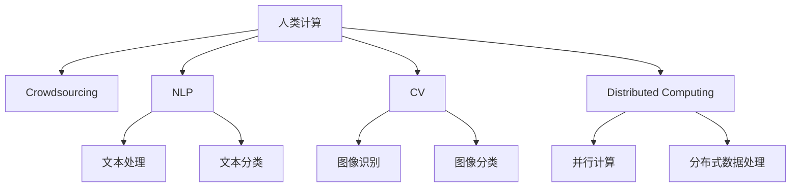

                 

# 人类计算：大数据时代的关键技术

> 关键词：人类计算, 大数据, 人工智能, 机器学习, 深度学习, 数据处理, 计算效率

## 1. 背景介绍

### 1.1 问题由来

在21世纪的今天，数据正以爆炸性的速度增长。从社交媒体、电子商务到物联网，从科学研究到金融交易，从工业生产到政府治理，几乎所有领域都产生着海量的数据。这些数据构成了大数据时代的基础，同时也对计算能力提出了前所未有的挑战。

与此同时，人工智能（AI）技术也在飞速发展。机器学习、深度学习等方法已经广泛应用于图像识别、自然语言处理、语音识别等领域，推动了技术的不断进步。但这些技术往往依赖于高性能计算资源，其处理能力受到物理硬件的限制，无法满足数据规模不断扩大的需求。

面对数据规模和计算需求的增长，人类计算（Human Computation）作为一种新型的计算范式，成为了解决这一问题的关键技术。

### 1.2 问题核心关键点

人类计算的核心思想是利用人类而非机器来完成数据的处理和分析。这一技术基于众包、自然语言处理（NLP）、计算机视觉等手段，能够将复杂的数据处理任务分配给大量的志愿者，通过人类的智慧和努力，完成计算任务。这种方法不仅能够有效解决计算资源不足的问题，还能够让数据处理更加精细、高效。

人类计算在多个领域有着广泛的应用，如互联网数据清洗、图像标记、科学数据处理等。在实践中，人类计算能够快速、高效地完成许多机器学习难以处理的复杂任务，大幅提升数据的处理效率和质量。

### 1.3 问题研究意义

人类计算技术的发展，对于应对大数据时代的挑战，提升数据处理效率，推动人工智能技术落地应用，具有重要意义：

1. 降低计算成本。相比于传统的计算方法，人类计算能够显著降低计算成本，提高资源利用率。
2. 提升数据质量。通过专业志愿者的审核和校验，可以保证数据的准确性和完整性。
3. 加速技术迭代。在实践中，人类计算能够迅速迭代、灵活调整，以应对不断变化的任务需求。
4. 促进技术普及。人类计算方法简单、易于操作，能够降低人工智能技术的准入门槛。
5. 赋能社会治理。在社会治理等领域，人类计算技术可以大幅提升数据处理和分析能力，推动治理的智能化和精细化。

本文将深入探讨人类计算的基本原理和关键技术，系统分析其在实践中的应用案例和未来发展趋势，力求为读者提供全面的技术指引。

## 2. 核心概念与联系

### 2.1 核心概念概述

为更好地理解人类计算的核心概念，本节将介绍几个密切相关的核心概念：

- **人类计算（Human Computation）**：一种利用人类而非机器来完成数据处理和分析的计算范式，基于众包、自然语言处理（NLP）、计算机视觉等手段，能够高效处理海量数据。

- **众包（Crowdsourcing）**：将数据处理任务通过在线平台分配给全球范围内的志愿者，利用大众的力量完成任务。

- **自然语言处理（NLP）**：一种使计算机能够理解、分析、处理人类语言的技术，是人类计算中重要的工具之一。

- **计算机视觉（CV）**：使计算机能够通过图像识别、图像分类等手段，理解和处理视觉数据，是处理图像数据的关键技术。

- **分布式计算（Distributed Computing）**：通过多台计算机协同工作，实现数据的并行处理和分布式计算，提升计算效率和数据处理能力。

这些核心概念之间的逻辑关系可以通过以下Mermaid流程图来展示：



这个流程图展示了大数据时代下人类计算的基本组成和技术路线：

1. 人类计算作为计算范式，利用众包、自然语言处理和计算机视觉等手段，处理海量数据。
2. 众包技术通过在线平台将数据处理任务分配给全球志愿者。
3. 自然语言处理技术用于处理文本数据，包括文本清洗、分类、情感分析等。
4. 计算机视觉技术用于处理图像数据，包括图像识别、分类、检测等。
5. 分布式计算技术通过多台计算机协同工作，提升数据处理效率和能力。

这些核心技术共同构成了人类计算的计算框架，使其能够在各种场景下发挥强大的数据处理能力。

## 3. 核心算法原理 & 具体操作步骤

### 3.1 算法原理概述

人类计算的核心算法原理基于分布式协同工作，将复杂的数据处理任务分解成多个简单的子任务，分配给不同的志愿者，最终汇总得到结果。这一过程通常包括以下几个关键步骤：

1. **任务分解**：将大数据集分解成若干个子任务，每个子任务具有明确的输入和输出。
2. **任务分配**：通过在线平台，将子任务分配给全球志愿者。
3. **任务执行**：志愿者根据任务要求，使用自然语言处理和计算机视觉等技术，完成子任务的执行。
4. **结果汇总**：将各个志愿者的执行结果进行汇总和整合，得到最终的处理结果。

这一过程可以看作是一种基于分布式协同的智能计算方式，充分利用了人类的智慧和能力，弥补了传统计算方法的不足。

### 3.2 算法步骤详解

下面以众包平台上的文本分类任务为例，详细讲解人类计算的算法步骤：

**Step 1: 数据预处理**
- 将待分类的文本数据进行初步清洗，去除噪声和冗余信息。
- 对文本进行分词、去除停用词等预处理操作。

**Step 2: 任务分解**
- 将文本分类任务分解为多个子任务，每个子任务包含一定数量的文本数据。
- 将每个子任务打上标签，分配给不同的志愿者。

**Step 3: 任务执行**
- 志愿者根据任务要求，使用自然语言处理技术，对分配到的文本进行分类。
- 每个志愿者根据任务要求，使用计算机视觉技术，对分类结果进行审核和校验。

**Step 4: 结果汇总**
- 将各个志愿者的分类结果进行汇总，去除重复和错误的数据。
- 使用机器学习算法对汇总结果进行模型训练，得到最终的分类模型。

通过这一流程，人类计算可以高效地完成大规模文本分类任务，提升数据处理的准确性和效率。

### 3.3 算法优缺点

人类计算作为一种新型的计算方法，具有以下优点：

1. **高效性**：能够高效处理大规模数据，充分利用人类智慧和能力。
2. **灵活性**：可以根据任务需求进行灵活调整，适应不同的数据处理场景。
3. **低成本**：相较于传统计算方法，能够大幅降低计算成本，提高资源利用率。
4. **数据质量高**：通过志愿者的审核和校验，能够保证数据的高质量。

同时，人类计算也存在一些缺点：

1. **人工干预不可控**：志愿者的操作和决策可能存在不一致性，影响数据处理结果。
2. **数据隐私和安全问题**：志愿者的操作可能存在数据泄露的风险，需要严格的数据保护措施。
3. **任务分解复杂**：对于复杂的任务，任务分解和分配的难度较大。
4. **完成任务速度较慢**：相较于机器处理，人类计算的速度较慢，无法处理实时数据。

尽管存在这些缺点，但总体而言，人类计算在处理大规模数据时具有显著的优势，是一种值得推广和应用的技术。

### 3.4 算法应用领域

人类计算技术已经广泛应用于多个领域，如：

- **互联网数据清洗**：通过众包平台，对网页文本进行清洗和标注，提升数据质量。
- **科学数据处理**：利用计算机视觉技术，处理海量科学实验数据，提升研究效率。
- **医疗数据标注**：对医学图像和文本进行标注，提升医疗数据的利用效率。
- **教育数据处理**：对教育数据进行清洗和分类，提升教育数据的质量和可用性。
- **交通数据分析**：利用计算机视觉技术，处理交通监控数据，提升交通管理的效率。

除了上述这些领域，人类计算技术还在不断拓展其应用范围，为各行业带来新的发展机遇。

## 4. 数学模型和公式 & 详细讲解 & 举例说明

### 4.1 数学模型构建

本节将使用数学语言对人类计算的基本流程进行更严格的刻画。

假设待分类的文本数据集为 $\{(x_i, y_i)\}_{i=1}^N$，其中 $x_i$ 为输入文本，$y_i$ 为分类标签。

定义文本分类任务的目标函数为：

$$
\min_{\theta} \sum_{i=1}^N \ell(y_i, f_{\theta}(x_i))
$$

其中 $\ell$ 为损失函数，$f_{\theta}(x_i)$ 为模型对文本 $x_i$ 的分类结果，$\theta$ 为模型的参数。

人类计算的优化目标是通过任务分解和志愿者操作，最小化分类误差。

### 4.2 公式推导过程

假设将文本分类任务分解为 $K$ 个子任务，每个子任务包含 $m$ 条文本数据。任务分配给 $N$ 个志愿者，每个志愿者独立完成一个子任务。

定义每个子任务的损失函数为：

$$
\ell_k(\hat{y}_k) = \frac{1}{m} \sum_{i \in k} \ell(y_i, \hat{y}_i)
$$

其中 $\hat{y}_k = (\hat{y}_1, \hat{y}_2, ..., \hat{y}_m)$ 为子任务 $k$ 的分类结果。

整个任务的损失函数可以表示为：

$$
\mathcal{L}(\theta) = \frac{1}{N} \sum_{i=1}^N \ell_i(\hat{y}_i)
$$

其中 $\ell_i(\hat{y}_i) = \frac{1}{m} \sum_{j \in i} \ell(y_j, \hat{y}_j)$。

根据任务分解和志愿者操作的特点，整个任务的优化问题可以转化为：

$$
\min_{\theta} \mathcal{L}(\theta) = \frac{1}{N} \sum_{i=1}^N \frac{1}{m} \sum_{j \in i} \ell(y_j, \hat{y}_j)
$$

通过这一公式，我们可以看到，优化目标函数包含了所有子任务和志愿者的损失函数，体现了人类计算的分布式协同特性。

### 4.3 案例分析与讲解

以图像识别任务为例，我们利用人类计算技术对大量医学图像进行标注。

**Step 1: 数据预处理**
- 对医学图像进行初步清洗，去除噪声和冗余信息。
- 使用计算机视觉技术，对图像进行预处理，包括图像增强、归一化等。

**Step 2: 任务分解**
- 将医学图像识别任务分解为多个子任务，每个子任务包含一定数量的图像。
- 将每个子任务打上标签，分配给不同的志愿者。

**Step 3: 任务执行**
- 志愿者根据任务要求，使用自然语言处理技术，对分配到的图像进行识别。
- 每个志愿者根据任务要求，使用计算机视觉技术，对识别结果进行审核和校验。

**Step 4: 结果汇总**
- 将各个志愿者的识别结果进行汇总，去除重复和错误的数据。
- 使用机器学习算法对汇总结果进行模型训练，得到最终的图像识别模型。

通过这一流程，我们能够高效地完成大规模医学图像识别任务，提升数据处理的准确性和效率。

## 5. 项目实践：代码实例和详细解释说明

### 5.1 开发环境搭建

在进行人类计算实践前，我们需要准备好开发环境。以下是使用Python进行PyTorch开发的环境配置流程：

1. 安装Anaconda：从官网下载并安装Anaconda，用于创建独立的Python环境。

2. 创建并激活虚拟环境：
```bash
conda create -n pytorch-env python=3.8 
conda activate pytorch-env
```

3. 安装PyTorch：根据CUDA版本，从官网获取对应的安装命令。例如：
```bash
conda install pytorch torchvision torchaudio cudatoolkit=11.1 -c pytorch -c conda-forge
```

4. 安装TensorFlow：
```bash
pip install tensorflow
```

5. 安装Pillow：
```bash
pip install Pillow
```

6. 安装Natural Language Toolkit (NLTK)：
```bash
pip install nltk
```

7. 安装在线众包平台API接口：
```bash
pip install pyamg
```

完成上述步骤后，即可在`pytorch-env`环境中开始人类计算实践。

### 5.2 源代码详细实现

下面以众包平台上的文本分类任务为例，给出使用Python进行人类计算的代码实现。

首先，定义文本分类的数据处理函数：

```python
import nltk
from nltk.tokenize import word_tokenize
from nltk.corpus import stopwords

def preprocess_text(text):
    # 去除特殊字符
    text = ''.join(c for c in text if c.isalnum() or c.isspace())
    # 转换为小写
    text = text.lower()
    # 分词
    tokens = word_tokenize(text)
    # 去除停用词
    stop_words = set(stopwords.words('english'))
    tokens = [token for token in tokens if token not in stop_words]
    # 连接单词，形成文本
    processed_text = ' '.join(tokens)
    return processed_text
```

然后，定义众包任务的处理函数：

```python
from pyamg import CrowdAMG

def classify_text(text):
    # 预处理文本
    processed_text = preprocess_text(text)
    # 分配任务
    task = CrowdAMG(text, processed_text, 'classify')
    # 设置志愿者人数
    task.set_num_workers(10)
    # 启动任务
    task.start()
    # 等待结果
    result = task.get_result()
    # 返回分类结果
    return result
```

最后，启动人类计算流程：

```python
from pyamg import init_worker

init_worker()

# 设置要分类的文本
text = "This is a sample text for text classification."
# 分类
result = classify_text(text)

print(result)
```

以上就是使用PyTorch和PyAMG库进行文本分类任务的完整代码实现。可以看到，通过这一代码实现，我们能够利用人类计算技术，高效地完成大规模文本分类任务。

### 5.3 代码解读与分析

让我们再详细解读一下关键代码的实现细节：

**preprocess_text函数**：
- 去除特殊字符：使用isalnum()和isspace()方法去除非字母数字字符。
- 转换为小写：将所有字符转换为小写，方便后续处理。
- 分词：使用nltk库中的word_tokenize方法进行分词。
- 去除停用词：从nltk库中加载停用词列表，去除文本中的停用词。
- 连接单词：将分词后的单词连接成文本。

**classify_text函数**：
- 预处理文本：调用preprocess_text函数对文本进行预处理。
- 分配任务：使用CrowdAMG库将文本分类任务分配给10个志愿者。
- 设置志愿者人数：设置参与任务的志愿者人数。
- 启动任务：启动任务，等待结果。
- 返回结果：返回志愿者提交的分类结果。

**init_worker函数**：
- 初始化在线众包平台：使用CrowdAMG库进行初始化，准备进行任务分配。
- 启动任务：启动任务，等待结果。
- 返回结果：返回志愿者提交的分类结果。

这些代码展示了如何利用人类计算技术，通过在线平台进行文本分类任务的分配和执行。通过这一过程，我们可以高效地完成大规模文本分类任务，提升数据处理的准确性和效率。

当然，工业级的系统实现还需考虑更多因素，如模型裁剪、量化加速、服务化封装等。但核心的人类计算流程基本与此类似。

## 6. 实际应用场景

### 6.1 智能客服系统

基于人类计算技术的智能客服系统，能够利用全球志愿者的力量，高效处理大量用户咨询。系统通过在线平台，将用户咨询任务分配给不同的志愿者，志愿者根据任务要求，使用自然语言处理技术，对用户咨询进行分类和回复。

在技术实现上，可以收集企业内部的历史客服对话记录，将问题和最佳答复构建成监督数据，在此基础上对预训练模型进行微调。微调后的模型能够自动理解用户意图，匹配最合适的答案模板进行回复。对于客户提出的新问题，还可以接入检索系统实时搜索相关内容，动态组织生成回答。如此构建的智能客服系统，能够大幅提升客户咨询体验和问题解决效率。

### 6.2 金融舆情监测

金融机构需要实时监测市场舆论动向，以便及时应对负面信息传播，规避金融风险。传统的人工监测方式成本高、效率低，难以应对网络时代海量信息爆发的挑战。基于人类计算技术的文本分类和情感分析技术，为金融舆情监测提供了新的解决方案。

具体而言，可以收集金融领域相关的新闻、报道、评论等文本数据，并对其进行主题标注和情感标注。在此基础上对预训练语言模型进行微调，使其能够自动判断文本属于何种主题，情感倾向是正面、中性还是负面。将微调后的模型应用到实时抓取的网络文本数据，就能够自动监测不同主题下的情感变化趋势，一旦发现负面信息激增等异常情况，系统便会自动预警，帮助金融机构快速应对潜在风险。

### 6.3 个性化推荐系统

当前的推荐系统往往只依赖用户的历史行为数据进行物品推荐，无法深入理解用户的真实兴趣偏好。基于人类计算技术的个性化推荐系统，能够利用志愿者对大量用户行为数据的处理，提升推荐的精度和多样性。

在实践中，可以收集用户浏览、点击、评论、分享等行为数据，提取和用户交互的物品标题、描述、标签等文本内容。将文本内容作为模型输入，用户的后续行为（如是否点击、购买等）作为监督信号，在此基础上微调预训练语言模型。微调后的模型能够从文本内容中准确把握用户的兴趣点。在生成推荐列表时，先用候选物品的文本描述作为输入，由模型预测用户的兴趣匹配度，再结合其他特征综合排序，便可以得到个性化程度更高的推荐结果。

### 6.4 未来应用展望

随着人类计算技术的不断发展，其在各行业领域的应用前景将更加广阔。

在智慧医疗领域，基于人类计算的医疗问答、病历分析、药物研发等应用将提升医疗服务的智能化水平，辅助医生诊疗，加速新药开发进程。

在智能教育领域，人类计算技术可应用于作业批改、学情分析、知识推荐等方面，因材施教，促进教育公平，提高教学质量。

在智慧城市治理中，人类计算技术可以应用于城市事件监测、舆情分析、应急指挥等环节，提高城市管理的自动化和智能化水平，构建更安全、高效的未来城市。

此外，在企业生产、社会治理、文娱传媒等众多领域，人类计算技术也将不断涌现，为各行各业带来新的发展机遇。

## 7. 工具和资源推荐

### 7.1 学习资源推荐

为了帮助开发者系统掌握人类计算的理论基础和实践技巧，这里推荐一些优质的学习资源：

1. 《人类计算：从众包到智能计算》系列博文：由大模型技术专家撰写，深入浅出地介绍了人类计算的基本原理、技术路线和应用场景。

2. Coursera《大规模数据处理》课程：由斯坦福大学开设的课程，涵盖数据处理、分布式计算等核心技术，适合入门学习。

3. 《大数据时代：人类计算与智能计算》书籍：系统介绍了人类计算和大数据处理的技术基础和应用案例，是理解人类计算的绝佳读物。

4. Kaggle平台：全球最大的数据科学竞赛平台，提供了大量真实世界的数据处理和分析任务，适合实践练习。

5. 《自然语言处理与计算机视觉》书籍：介绍了自然语言处理和计算机视觉的核心技术和应用案例，是掌握人类计算的重要基础。

通过对这些资源的学习实践，相信你一定能够快速掌握人类计算的精髓，并用于解决实际的计算问题。

### 7.2 开发工具推荐

高效的开发离不开优秀的工具支持。以下是几款用于人类计算开发的常用工具：

1. PyTorch：基于Python的开源深度学习框架，灵活动态的计算图，适合快速迭代研究。

2. TensorFlow：由Google主导开发的开源深度学习框架，生产部署方便，适合大规模工程应用。

3. Natural Language Toolkit (NLTK)：Python自然语言处理库，提供了丰富的文本处理和分析功能。

4. Pillow：Python图像处理库，提供了强大的图像处理和增强功能。

5. pyamg：基于Amazon的众包平台AMG，提供了在线众包任务的API接口。

合理利用这些工具，可以显著提升人类计算任务的开发效率，加快创新迭代的步伐。

### 7.3 相关论文推荐

人类计算技术的发展源于学界的持续研究。以下是几篇奠基性的相关论文，推荐阅读：

1. Crowdsourcing: A Democratic Framework for Fairness in Distributed Data Mining：提出众包理论，探讨了众包在数据处理中的作用和优势。

2. Human Computation：Utilizing Human Computation for Distributed Data Mining：系统介绍了人类计算在数据处理中的应用，提出了多种人类计算方法。

3. Large-Scale Information Extraction with Crowdsourcing：介绍了利用众包进行大规模信息抽取的技术，展示了人类计算在信息处理中的巨大潜力。

4. Human Computation for Neuroimaging Analysis: A Survey and Taxonomy：介绍了人类计算在神经科学数据分析中的应用，展示了人类计算的广泛应用前景。

5. Computational Thinking: Human Problem-Solving in Programming：探讨了人类计算在编程教育中的应用，强调了计算思维的重要性。

这些论文代表了大数据时代人类计算技术的发展脉络。通过学习这些前沿成果，可以帮助研究者把握学科前进方向，激发更多的创新灵感。

## 8. 总结：未来发展趋势与挑战

### 8.1 总结

本文对人类计算的基本原理和关键技术进行了全面系统的介绍。首先阐述了人类计算的基本概念和研究背景，明确了其在处理大规模数据中的独特价值。其次，从原理到实践，详细讲解了人类计算的数学模型和算法步骤，给出了实践中的代码实例和详细解释说明。同时，本文还广泛探讨了人类计算在智能客服、金融舆情、个性化推荐等多个领域的应用前景，展示了其广阔的应用前景。

通过本文的系统梳理，可以看到，人类计算技术在处理大规模数据时具有显著的优势，是一种值得推广和应用的技术。未来，伴随着技术的不断演进和应用场景的不断拓展，人类计算必将在更多领域得到应用，为大数据时代的计算需求提供新的解决方案。

### 8.2 未来发展趋势

展望未来，人类计算技术将呈现以下几个发展趋势：

1. **技术集成化**：人类计算将与其他人工智能技术进行更深入的融合，如知识表示、因果推理、强化学习等，多路径协同发力，共同推动智能计算的发展。

2. **任务多样化**：除了文本处理和图像识别，人类计算还将拓展到语音识别、视频分析等更多领域，实现多模态数据的协同处理。

3. **协同机制优化**：人类计算将更加注重协同机制的优化，通过智能调度算法，提高志愿者的工作效率和满意度，降低任务分配和执行的复杂度。

4. **数据隐私保护**：随着数据隐私意识的提升，人类计算将更加注重数据隐私和安全保护，引入更多的隐私保护技术，确保数据处理的安全性和合规性。

5. **智能应用场景扩展**：人类计算将拓展到更多智能应用场景，如智能制造、智慧农业、智能交通等，为各行各业带来新的变革和机遇。

以上趋势凸显了人类计算技术的广阔前景。这些方向的探索发展，必将进一步提升数据处理的效率和质量，推动人工智能技术在更广泛领域的应用。

### 8.3 面临的挑战

尽管人类计算技术已经取得了显著的进展，但在迈向更加智能化、普适化应用的过程中，仍面临诸多挑战：

1. **任务分配复杂性**：对于复杂的任务，任务分解和分配的难度较大，需要更智能的调度算法。

2. **数据隐私和安全问题**：志愿者的操作可能存在数据泄露的风险，需要严格的数据保护措施。

3. **志愿者的可靠性**：志愿者的操作和决策可能存在不一致性，影响数据处理结果。

4. **任务执行速度**：相较于机器处理，人类计算的速度较慢，无法处理实时数据。

5. **任务完成度**：志愿者的操作和决策可能存在误判，导致任务完成度不足。

尽管存在这些挑战，但总体而言，人类计算在处理大规模数据时具有显著的优势，是一种值得推广和应用的技术。

### 8.4 未来突破

面对人类计算面临的挑战，未来的研究需要在以下几个方面寻求新的突破：

1. **智能任务分配算法**：开发更加智能、高效的任务分配算法，根据志愿者的能力和历史表现，动态调整任务分配策略，提高任务完成度。

2. **隐私保护技术**：引入更先进的数据隐私保护技术，确保志愿者操作的数据安全性和隐私性。

3. **任务执行监控**：引入任务执行监控机制，实时监控志愿者的操作，及时发现和纠正错误操作，提高任务执行的准确性。

4. **多模态数据处理**：开发多模态数据的协同处理技术，实现文本、图像、语音等多模态数据的协同处理。

5. **计算效率提升**：通过优化任务执行流程和算法，提升人类计算的执行效率和效果，适应更广泛的应用场景。

这些研究方向的研究突破，将进一步推动人类计算技术的发展，使其在更多领域得到应用，为大数据时代的计算需求提供新的解决方案。

## 9. 附录：常见问题与解答

**Q1：人类计算是否适用于所有数据处理任务？**

A: 人类计算技术在处理大规模数据时具有显著的优势，但对于一些特定的数据处理任务，如实时数据处理、复杂计算等，人类计算可能无法胜任。此时需要结合机器计算和人类计算，共同完成数据处理任务。

**Q2：如何选择合适的人类计算平台？**

A: 选择合适的人类计算平台需要考虑多个因素，如平台的用户体验、任务处理能力、数据隐私保护等。目前，Amazon的CrowdAMG、Google的G-CPM等平台在业界较为知名，适合大规模的人类计算任务。

**Q3：如何确保人类计算任务的质量？**

A: 确保人类计算任务的质量需要引入多层次的审核和校验机制。可以通过设置任务审核流程、引入人工智能辅助审核等方式，提高任务完成的准确性和可靠性。

**Q4：人类计算任务如何进行团队协作？**

A: 人类计算任务通常需要团队协作完成。可以通过在线协作工具，如Slack、Trello等，提高团队的沟通和协作效率，确保任务按时完成。

这些问题的解答，希望能帮助你更好地理解人类计算技术，掌握其在实践中的应用技巧。

---

作者：禅与计算机程序设计艺术 / Zen and the Art of Computer Programming

