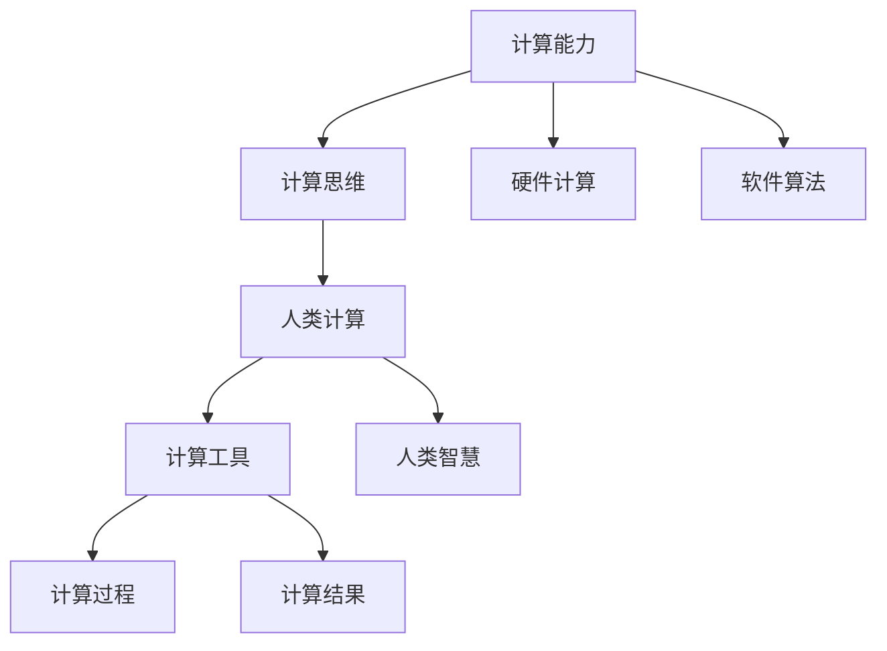

                 

# 人类计算：应用与案例分析

> 关键词：人类计算, 计算能力, 计算思维, 计算机科学, 案例分析

## 1. 背景介绍

### 1.1 问题由来

随着计算技术的发展，人类对计算的依赖日益加深。从最初的简单计数，到复杂的算法设计和程序编写，计算已经成为现代社会不可或缺的一部分。然而，计算能力不仅仅限于机器的运行，还包括人类的计算思维和计算能力。本文将从人类计算的角度出发，探讨其在各个领域的应用，并通过具体案例分析展示其潜力和价值。

### 1.2 问题核心关键点

- **计算能力**：人类和机器在处理信息和解决问题的能力上各有优势，如何结合两者的优势，最大化利用计算资源。
- **计算思维**：指解决问题时的系统性思考和逻辑推理能力，是计算能力的重要组成部分。
- **人类计算**：结合人类计算思维和计算工具，通过人类与机器的协作，提升问题的解决效率和质量。

这些关键点构成了人类计算的核心，强调了计算不仅仅是机器的任务，更是人类思维和能力的体现。

### 1.3 问题研究意义

研究人类计算的应用与案例，对于提升人类的计算能力、推动科学和技术的发展、增强社会的信息化水平具有重要意义。通过深入理解人类计算的机制和应用，我们可以：

- 发现新问题并提出解决方案，促进科学研究和技术创新。
- 提高教育和培训水平，培养更多具有计算思维的人才。
- 改善决策过程，增强社会管理和公共服务的效率和质量。
- 推动产业升级和经济转型，促进信息技术的广泛应用。

## 2. 核心概念与联系

### 2.1 核心概念概述

- **计算能力**：指处理和执行计算任务的能力，包括硬件计算能力和软件算法能力。
- **计算思维**：指在解决问题时采用系统性、逻辑性和抽象性的思维方式。
- **人类计算**：指将人类计算思维与计算工具相结合，通过人类与机器协作提升计算效率和效果。

这些概念共同构成了一个完整的计算框架，展示了计算不仅仅是机器的任务，更是人类思维和能力的体现。

### 2.2 核心概念原理和架构的 Mermaid 流程图



该流程图展示了计算能力、计算思维、人类计算之间的关系和流程。硬件计算和软件算法是计算能力的基石，而计算思维则是人类计算的核心。通过计算工具，人类智慧与机器计算紧密结合，最终实现高效和高质量的计算结果。

## 3. 核心算法原理 & 具体操作步骤

### 3.1 算法原理概述

人类计算的核心在于将人类智慧与计算工具相结合，通过系统性、逻辑性和抽象性的思维方式，提升计算效率和效果。其原理可以概括为：

- **系统性**：将问题分解为多个子问题，通过分步计算逐步求解。
- **逻辑性**：采用严格的逻辑推理和数学模型，确保计算的准确性和可靠性。
- **抽象性**：将具体问题抽象为更一般的形式，便于分析和处理。

### 3.2 算法步骤详解

基于上述原理，人类计算的步骤可以分解为：

1. **问题抽象**：将实际问题抽象为数学模型或逻辑模型。
2. **分解计算**：将模型分解为多个子问题，分别进行计算。
3. **逻辑推理**：采用数学推导或逻辑推理，求解子问题的解。
4. **结果整合**：将各子问题的解整合成最终结果。
5. **反馈迭代**：根据结果反馈调整计算过程，迭代优化。

### 3.3 算法优缺点

- **优点**：结合人类智慧与计算工具，可以灵活应对各种复杂问题，提升计算效率和效果。
- **缺点**：人类计算的效率较低，难以处理大规模和高精度的计算任务。

### 3.4 算法应用领域

人类计算的应用领域广泛，涉及科学研究、工程设计、医疗诊断、金融分析、教育培训等多个领域。其特点在于：

- **多学科融合**：结合多学科知识和方法，解决跨领域问题。
- **创新思维**：鼓励创新和创造性思维，推动技术进步。
- **社会价值**：提升社会管理和公共服务的效率和质量，促进社会信息化发展。

## 4. 数学模型和公式 & 详细讲解 & 举例说明

### 4.1 数学模型构建

人类计算的数学模型通常包括：

- **线性方程组**：如高斯消元法，用于求解方程组。
- **优化问题**：如拉格朗日乘子法，用于求解最优解。
- **统计分析**：如回归分析、假设检验等，用于数据分析和预测。

### 4.2 公式推导过程

以线性方程组为例，高斯消元法的公式推导如下：

$$
\begin{aligned}
\left[
\begin{matrix}
a_{11} & a_{12} & \dots & a_{1n} \\
a_{21} & a_{22} & \dots & a_{2n} \\
\dots & \dots & \dots & \dots \\
a_{m1} & a_{m2} & \dots & a_{mn}
\end{matrix}
\right]
\left[
\begin{matrix}
x_1 \\
x_2 \\
\dots \\
x_n
\end{matrix}
\right]
=
\left[
\begin{matrix}
b_1 \\
b_2 \\
\dots \\
b_m
\end{matrix}
\right]
\end{aligned}
$$

通过一系列矩阵变换，将系数矩阵转化为上三角矩阵或行阶梯矩阵，最终求解出未知向量。

### 4.3 案例分析与讲解

以医疗诊断为例，通过结合医学知识和人机交互，利用计算机辅助诊断系统进行疾病预测。具体步骤如下：

1. **数据收集**：收集患者的病历、症状等信息，建立数据集。
2. **问题抽象**：将诊断问题抽象为分类或回归问题。
3. **模型选择**：选择合适的机器学习模型，如随机森林、支持向量机等。
4. **特征提取**：提取有用的特征，如病情严重程度、病史等。
5. **训练模型**：在训练集上训练模型，调整参数。
6. **结果验证**：在测试集上验证模型的性能，如准确率、召回率等。
7. **应用部署**：将模型部署到实际应用中，辅助医生进行诊断。

## 5. 项目实践：代码实例和详细解释说明

### 5.1 开发环境搭建

- **Python**：安装Python 3.x版本，建议使用Anaconda环境。
- **库文件**：安装必要的库文件，如NumPy、Pandas、Scikit-learn等。
- **开发工具**：使用Jupyter Notebook或PyCharm等工具进行开发。

### 5.2 源代码详细实现

以线性回归模型为例，代码实现如下：

```python
import numpy as np
from sklearn.linear_model import LinearRegression

# 构建数据集
X = np.array([[1, 2], [3, 4], [5, 6]])
y = np.array([2, 4, 6])

# 构建模型
model = LinearRegression()
model.fit(X, y)

# 预测结果
y_pred = model.predict(np.array([[7, 8]]))
print(y_pred)
```

### 5.3 代码解读与分析

- **数据准备**：使用NumPy库构建训练数据集。
- **模型选择**：选择线性回归模型。
- **模型训练**：使用Scikit-learn库进行模型训练，调整参数。
- **结果预测**：在测试集上预测新的数据点。

## 6. 实际应用场景

### 6.1 科学研究

在科学研究中，人类计算通过结合实验数据和理论模型，提升科学研究的准确性和效率。例如，通过计算分子结构，预测化学反应结果；通过统计分析，揭示自然界中的规律。

### 6.2 工程设计

在工程设计中，人类计算通过优化设计方案，提升产品的性能和可靠性。例如，通过计算流体力学，优化飞机设计；通过优化算法，提升机器人路径规划效率。

### 6.3 医疗诊断

在医疗诊断中，人类计算通过结合医学知识和人工智能技术，提升疾病预测和诊断的准确性。例如，通过计算基因序列，预测疾病风险；通过机器学习，辅助医生进行疾病诊断。

### 6.4 金融分析

在金融分析中，人类计算通过优化投资策略，提升投资回报率。例如，通过计算股票价格变化，预测市场趋势；通过优化算法，提升交易效率。

### 6.5 教育培训

在教育培训中，人类计算通过结合学习理论和智能技术，提升教学效果和学习效率。例如，通过计算学习路径，个性化推荐学习内容；通过智能评估，实时反馈学习效果。

### 6.6 社会管理

在社会管理中，人类计算通过优化资源分配和决策过程，提升社会管理的效率和质量。例如，通过计算交通流量，优化交通管理；通过优化算法，提升公共服务效率。

### 6.7 未来应用展望

未来，人类计算的应用将更加广泛和深入。随着计算技术和人工智能的发展，人类计算将与机器计算、量子计算等技术相结合，推动社会信息化和智能化水平的提升。例如：

- **多模态计算**：结合视觉、声音、触觉等多模态信息，提升计算的全面性和准确性。
- **量子计算**：通过量子计算技术，提升计算速度和效率，解决大规模和高精度计算问题。
- **智能系统**：通过结合人工智能技术，提升计算的智能化和自主化水平，推动人工智能的广泛应用。

## 7. 工具和资源推荐

### 7.1 学习资源推荐

- **《计算机科学导论》**：经典教材，涵盖计算机科学的基础知识和核心概念。
- **Coursera**：提供多门计算机科学相关课程，包括算法、数据结构、人工智能等。
- **Kaggle**：提供大量数据集和竞赛平台，用于实践和验证计算模型。

### 7.2 开发工具推荐

- **Python**：通用编程语言，具有丰富的库和工具支持。
- **Jupyter Notebook**：交互式编程工具，方便代码编写和调试。
- **PyCharm**：Python IDE，提供代码编写和调试支持。

### 7.3 相关论文推荐

- **《计算思维：构建计算能力的基础》**：介绍计算思维的原理和应用。
- **《人工智能：现状与未来》**：分析人工智能的发展现状和未来趋势。
- **《线性代数及其应用》**：经典教材，涵盖线性代数的原理和应用。

## 8. 总结：未来发展趋势与挑战

### 8.1 研究成果总结

本文系统介绍了人类计算的应用与案例，通过具体案例展示了其潜力和价值。研究表明，人类计算在科学研究、工程设计、医疗诊断、金融分析、教育培训等多个领域具有广泛的应用前景。

### 8.2 未来发展趋势

未来，人类计算的发展将呈现以下趋势：

- **多学科融合**：结合多学科知识和技术，提升计算的全面性和应用范围。
- **智能化发展**：结合人工智能技术，提升计算的智能化和自主化水平。
- **普适化应用**：推动计算技术的广泛应用，提升社会信息化和智能化水平。

### 8.3 面临的挑战

人类计算面临的挑战包括：

- **计算资源瓶颈**：大规模计算任务需要高性能计算资源，难以处理高精度和高速度的计算需求。
- **数据质量问题**：数据的不准确性和不完整性，会影响计算结果的可靠性和有效性。
- **技术复杂性**：计算方法和技术的复杂性，需要专业的知识和技能支持。

### 8.4 研究展望

未来，研究人类计算的重点在于：

- **计算资源优化**：开发更高效和强大的计算工具，提升计算能力和效率。
- **数据质量提升**：改善数据收集和处理方法，提高数据质量。
- **技术普及推广**：推广和普及计算技术和方法，提升社会计算水平。

## 9. 附录：常见问题与解答

**Q1：人类计算与机器计算有什么区别？**

A: 人类计算强调结合人类智慧和计算工具，通过系统性、逻辑性和抽象性的思维方式，提升计算效率和效果。机器计算则主要依赖计算机硬件和算法，自动处理数据和解决问题。两者结合可以实现优势互补，提升整体计算能力。

**Q2：人类计算的应用场景有哪些？**

A: 人类计算在科学研究、工程设计、医疗诊断、金融分析、教育培训等多个领域具有广泛的应用前景。通过结合人类智慧和计算工具，提升计算的全面性和准确性，解决复杂问题。

**Q3：人类计算面临的主要挑战是什么？**

A: 人类计算面临的主要挑战包括计算资源瓶颈、数据质量问题和技术复杂性。需要通过技术创新和普及推广，解决这些挑战，提升整体计算能力。

**Q4：未来人类计算的发展方向是什么？**

A: 未来人类计算的发展方向包括多学科融合、智能化发展和普适化应用。结合多学科知识和人工智能技术，提升计算的全面性和智能化水平，推动社会信息化和智能化发展。

**Q5：如何提升人类计算的效率和效果？**

A: 提升人类计算的效率和效果需要优化计算资源、改善数据质量和技术方法。通过结合人类智慧和计算工具，采用系统性、逻辑性和抽象性的思维方式，提升计算的全面性和准确性。

**Q6：人类计算在科学研究中的应用有哪些？**

A: 人类计算在科学研究中的应用包括通过计算分子结构，预测化学反应结果；通过统计分析，揭示自然界中的规律。通过结合实验数据和理论模型，提升科学研究的准确性和效率。

---

作者：禅与计算机程序设计艺术 / Zen and the Art of Computer Programming

