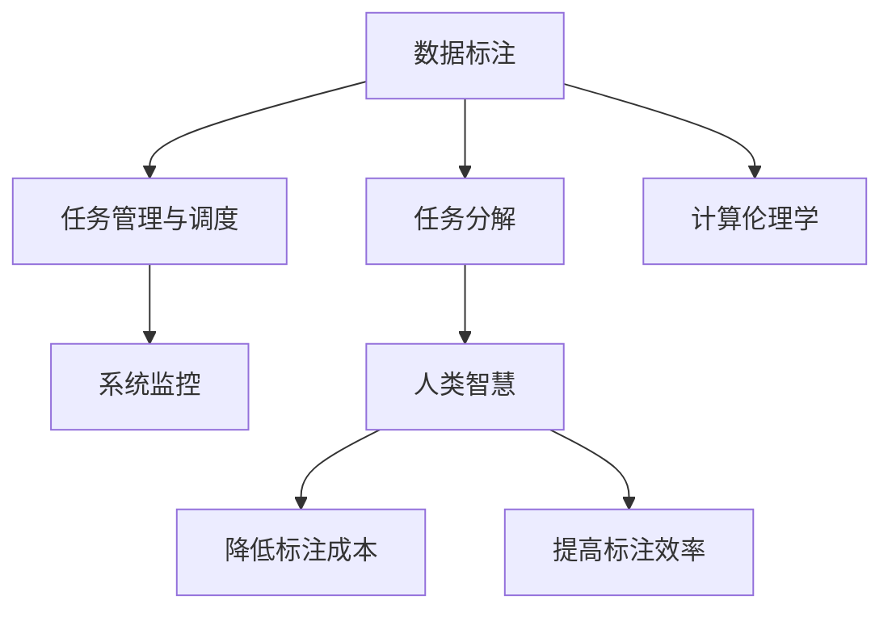

                 

# 人类计算：数据标注的秘密武器

> 关键词：数据标注，机器学习，人工智能，深度学习，计算伦理学

## 1. 背景介绍

### 1.1 问题由来

在人工智能时代，数据标注一直是机器学习与深度学习领域中不可或缺的一环。数据标注是指将原始数据转换为模型可以处理的格式，包括文本标注、图像标注、语音标注等。数据标注的准确性和完备性，直接决定了模型性能的好坏，因此数据标注是人工智能技术发展中的瓶颈之一。

数据标注不仅耗时耗力，而且标注成本极高。根据研究，数据标注成本占整个AI项目成本的50%以上。对于传统行业，数据标注更是困难重重，需要大量专业领域知识，投入大量人力物力。

因此，如何降低数据标注成本，提高标注效率，成为人工智能技术落地应用的一个关键问题。本文将介绍一种基于人类计算的数据标注技术，通过将任务分解，利用人类智慧和专业知识，在保证数据标注质量的同时，大幅降低标注成本，提升标注效率。

### 1.2 问题核心关键点

人类计算技术基于两个核心概念：

- 数据标注的分解：将大型数据标注任务分解为若干小的、可操作的任务，利用人类智慧和专业知识，降低任务难度，提高标注质量。
- 任务管理与调度：通过高效的任务管理与调度系统，将任务分派给合适的标注人员，实时监控标注进度，确保任务按时完成。

这两个概念的有机结合，使得人类计算技术能够高效地完成数据标注任务，同时保证标注质量，降低成本。

### 1.3 问题研究意义

研究基于人类计算的数据标注技术，对于拓展人工智能技术的应用范围，提升数据标注的效率和质量，降低标注成本，具有重要意义：

1. 降低标注成本。利用人类智慧和专业知识，降低数据标注对专业标注人员的依赖，减少人力成本。
2. 提高标注效率。将任务分解为小的、可操作的任务，提高数据标注的并发性和效率。
3. 保证标注质量。通过系统化的任务管理与调度，确保每个小任务都能高质量完成，从而提升整体数据标注的质量。
4. 加速AI应用开发。数据标注是AI应用开发的重要环节，加速数据标注过程，能够大大缩短AI应用从研究到部署的周期。
5. 促进AI技术普及。降低标注成本和提高标注效率，使得更多中小企业和个人开发者能够轻松应用AI技术。

## 2. 核心概念与联系

### 2.1 核心概念概述

为更好地理解基于人类计算的数据标注技术，本节将介绍几个密切相关的核心概念：

- 数据标注：将原始数据转换为机器学习模型可以处理的格式，包括文本标注、图像标注、语音标注等。
- 数据标注成本：标注任务的成本，包括人力、时间、金钱等方面的投入。
- 人类计算：利用人类智慧和专业知识，将数据标注任务分解为小的、可操作的任务，大幅降低标注成本，提高标注效率。
- 任务分解：将大型数据标注任务分解为若干小的、可操作的任务，利用人类智慧和专业知识，降低任务难度，提高标注质量。
- 任务管理与调度：通过高效的任务管理与调度系统，将任务分派给合适的标注人员，实时监控标注进度，确保任务按时完成。
- 计算伦理学：数据标注中涉及到的隐私保护、公平性、透明性等问题，需要从伦理学角度进行思考和解决。

这些核心概念之间的逻辑关系可以通过以下Mermaid流程图来展示：



这个流程图展示了大规模数据标注的核心概念及其之间的关系：

1. 数据标注：作为人工智能的基础，必须准确、完备。
2. 任务分解：利用人类智慧和专业知识，降低任务难度，提高标注质量。
3. 任务管理与调度：通过高效的系统管理，确保任务按时完成。
4. 系统监控：实时监控标注进度，确保任务按时完成。
5. 计算伦理学：在数据标注过程中，需要考虑隐私保护、公平性等问题。

这些概念共同构成了大规模数据标注的框架，使其能够高效地完成数据标注任务，同时保证标注质量。

## 3. 核心算法原理 & 具体操作步骤
### 3.1 算法原理概述

基于人类计算的数据标注技术，本质上是一种利用人类智慧和专业知识进行任务分解和调度的方法。其核心思想是：将大规模数据标注任务分解为若干小的、可操作的任务，利用人类智慧和专业知识，通过高效的任务管理与调度系统，确保每个小任务都能高质量完成，从而提升整体数据标注的质量和效率，降低标注成本。

形式化地，假设大规模数据标注任务为 $D$，分为 $n$ 个小任务 $T_1, T_2, \cdots, T_n$，每个小任务由 $m_i$ 个标注人员完成。每个小任务的任务分解策略为 $S_i$，任务调度策略为 $C_i$。最终得到的数据标注结果为 $R$。则标注过程可以表示为：

$$
R = \bigcup_{i=1}^n C_i(T_i(S_i))
$$

其中，$S_i$ 表示小任务 $T_i$ 的任务分解策略，$C_i$ 表示小任务 $T_i$ 的任务调度策略，$C_i(T_i(S_i))$ 表示在小任务 $T_i$ 的任务分解策略 $S_i$ 下，由 $C_i$ 调度策略进行调度的标注结果。

### 3.2 算法步骤详解

基于人类计算的数据标注技术，一般包括以下几个关键步骤：

**Step 1: 任务分解**
- 将大规模数据标注任务 $D$ 分解为若干小任务 $T_1, T_2, \cdots, T_n$，每个小任务 $T_i$ 包含一定数量的数据样本。
- 根据任务类型和标注人员的专业知识，设计合理的小任务分解策略 $S_i$。

**Step 2: 任务分配与调度**
- 将小任务 $T_i$ 分配给合适的标注人员。
- 使用任务调度系统 $C_i$，实时监控标注进度，确保每个小任务按时完成。

**Step 3: 任务监控与反馈**
- 实时监控每个小任务的标注进度，及时发现并解决问题。
- 收集标注人员的反馈，对标注策略进行优化。

**Step 4: 标注结果合并与修正**
- 对每个小任务的标注结果进行合并和修正，确保整体数据标注结果的质量。
- 对标注结果进行检查，确保无遗漏和错误。

**Step 5: 标注结果验收**
- 对最终的数据标注结果 $R$ 进行验收，确保其准确性和完备性。
- 对标注结果进行质量评估，提供改进建议。

以上是基于人类计算的数据标注技术的一般流程。在实际应用中，还需要针对具体任务的特点，对任务分解和调度进行优化设计，以进一步提升数据标注的质量和效率。

### 3.3 算法优缺点

基于人类计算的数据标注技术，具有以下优点：

1. 降低标注成本。利用人类智慧和专业知识，降低数据标注对专业标注人员的依赖，减少人力成本。
2. 提高标注效率。将任务分解为小的、可操作的任务，提高数据标注的并发性和效率。
3. 保证标注质量。通过系统化的任务管理与调度，确保每个小任务都能高质量完成，从而提升整体数据标注的质量。

同时，该方法也存在一定的局限性：

1. 对标注人员依赖较高。小任务的分解和调度需要标注人员具备一定的专业知识，标注人员的专业水平直接影响到标注结果的质量。
2. 任务分解难度较大。对于复杂的标注任务，任务分解的策略设计较为困难，需要反复迭代优化。
3. 任务管理复杂。需要设计高效的任务管理与调度系统，确保每个小任务按时完成。
4. 缺乏自动化。当前的技术还无法完全替代标注人员，标注过程仍需要大量人工干预。

尽管存在这些局限性，但就目前而言，基于人类计算的数据标注方法仍是最为有效的数据标注范式。未来相关研究的重点在于如何进一步优化任务分解策略，引入更多自动化手段，同时兼顾可解释性和伦理安全性等因素。

### 3.4 算法应用领域

基于人类计算的数据标注技术，在人工智能领域已经得到了广泛的应用，覆盖了几乎所有常见任务，例如：

- 文本分类：如情感分析、主题分类、意图识别等。通过任务分解和调度，利用标注人员的语言理解能力，进行大规模文本分类。
- 命名实体识别：识别文本中的人名、地名、机构名等特定实体。通过任务分解和调度，利用标注人员的领域知识，提高命名实体识别的准确率。
- 关系抽取：从文本中抽取实体之间的语义关系。通过任务分解和调度，利用标注人员的逻辑推理能力，进行关系抽取。
- 问答系统：对自然语言问题给出答案。将问题-答案对作为小任务，利用标注人员的自然语言理解能力，构建问答系统。
- 机器翻译：将源语言文本翻译成目标语言。通过任务分解和调度，利用标注人员的语言转换能力，进行机器翻译。
- 文本摘要：将长文本压缩成简短摘要。通过任务分解和调度，利用标注人员的摘要能力，提高文本摘要的效果。
- 对话系统：使机器能够与人自然对话。通过任务分解和调度，利用标注人员的对话能力，构建对话系统。

除了上述这些经典任务外，人类计算技术还被创新性地应用到更多场景中，如数据增强、自动注释、图像标注等，为人工智能技术带来了全新的突破。随着技术进步，人类计算技术将进一步拓展其在人工智能领域的应用。

## 4. 数学模型和公式 & 详细讲解  
### 4.1 数学模型构建

本节将使用数学语言对基于人类计算的数据标注过程进行更加严格的刻画。

假设大规模数据标注任务为 $D$，包含 $N$ 个数据样本，每个样本 $x_i$ 的标签为 $y_i \in \{1,2, \cdots, K\}$。任务 $D$ 分解为 $n$ 个小任务 $T_1, T_2, \cdots, T_n$，每个小任务 $T_i$ 包含 $m_i$ 个数据样本，即 $T_i = \{x_{i_1}, x_{i_2}, \cdots, x_{i_{m_i}}\}$。每个小任务 $T_i$ 的标注结果为 $R_i = \{r_{i_1}, r_{i_2}, \cdots, r_{i_{m_i}}\}$，其中 $r_{i_j}$ 为第 $i_j$ 个数据样本的标注结果。

定义任务 $D$ 的总标注结果为 $R = \bigcup_{i=1}^n R_i$。则基于人类计算的数据标注模型可以表示为：

$$
R = \bigcup_{i=1}^n C_i(T_i(S_i))
$$

其中，$S_i$ 表示小任务 $T_i$ 的任务分解策略，$C_i$ 表示小任务 $T_i$ 的任务调度策略，$C_i(T_i(S_i))$ 表示在小任务 $T_i$ 的任务分解策略 $S_i$ 下，由 $C_i$ 调度策略进行调度的标注结果。

### 4.2 公式推导过程

以下我们以二分类任务为例，推导基于人类计算的数据标注过程的数学模型。

假设任务 $D$ 为二分类任务，每个小任务 $T_i$ 包含 $m_i$ 个数据样本，每个样本的标注结果为 $y_{i_j} \in \{0,1\}$。任务 $D$ 的任务分解策略 $S_i$ 将每个小任务 $T_i$ 分解为 $m_i$ 个小的二分类任务，每个小的二分类任务包含 $1$ 个数据样本，其标注结果为 $r_{i_j} \in \{0,1\}$。任务 $D$ 的任务调度策略 $C_i$ 将小任务 $T_i$ 分配给 $k$ 个标注人员，每个标注人员分配到若干个小任务 $T_{i,j}$，其中 $j \in \{1,2, \cdots, k\}$。

定义任务 $D$ 的标注结果为 $R = \bigcup_{i=1}^n R_i$，则基于人类计算的数据标注过程可以表示为：

$$
R = \bigcup_{i=1}^n \bigcup_{j=1}^k \bigcup_{l=1}^{m_i} r_{i,j,l}
$$

其中，$r_{i,j,l}$ 表示第 $i$ 个小任务 $T_i$ 的第 $j$ 个标注人员对第 $l$ 个数据样本的标注结果。

根据上述定义，可以进一步计算任务 $D$ 的平均标注结果 $R$：

$$
\bar{R} = \frac{1}{N} \sum_{i=1}^n \sum_{j=1}^k \sum_{l=1}^{m_i} r_{i,j,l}
$$

其中，$\bar{R}$ 表示任务 $D$ 的平均标注结果。

### 4.3 案例分析与讲解

下面以命名实体识别(NER)任务为例，展示如何使用人类计算技术进行任务分解和调度，完成数据标注。

假设任务 $D$ 为命名实体识别任务，每个小任务 $T_i$ 包含 $m_i$ 个数据样本，每个样本的标注结果为 $\{BIO\}$ 标记，其中 $B$ 表示开始位置，$I$ 表示内部位置，$O$ 表示结束位置。任务 $D$ 的任务分解策略 $S_i$ 将每个小任务 $T_i$ 分解为 $m_i$ 个小的命名实体识别任务，每个小的命名实体识别任务包含 $1$ 个数据样本，其标注结果为 $\{BIO\}$ 标记。任务 $D$ 的任务调度策略 $C_i$ 将小任务 $T_i$ 分配给 $k$ 个标注人员，每个标注人员分配到若干个小任务 $T_{i,j}$，其中 $j \in \{1,2, \cdots, k\}$。

在实际应用中，标注人员通过标签编辑界面，输入每个数据样本的标注结果。标注结果通过任务调度系统 $C_i$，实时监控每个小任务的标注进度，确保每个小任务按时完成。最终，系统将各个小任务的标注结果合并，得到任务 $D$ 的标注结果 $R$。

## 5. 项目实践：代码实例和详细解释说明
### 5.1 开发环境搭建

在进行人类计算数据标注实践前，我们需要准备好开发环境。以下是使用Python进行任务管理与调度系统的环境配置流程：

1. 安装Anaconda：从官网下载并安装Anaconda，用于创建独立的Python环境。

2. 创建并激活虚拟环境：
```bash
conda create -n annotation-env python=3.8 
conda activate annotation-env
```

3. 安装Python依赖包：
```bash
pip install tqdm beautifulsoup4 pandas numpy
```

4. 安装相关库：
```bash
pip install scikit-learn gensim transformers
```

5. 安装任务调度库：
```bash
pip install pyzmq
```

6. 安装Web前端库：
```bash
pip install Flask
```

完成上述步骤后，即可在`annotation-env`环境中开始任务管理与调度系统的开发。

### 5.2 源代码详细实现

下面我以二分类任务为例，给出使用Python进行任务管理与调度系统的代码实现。

首先，定义任务分解策略和任务调度策略：

```python
import random

class TaskSplitter:
    def __init__(self, task_list, num_tasks, split_rate=0.5):
        self.task_list = task_list
        self.num_tasks = num_tasks
        self.split_rate = split_rate
        
    def split_tasks(self):
        task_splits = []
        task_index = 0
        while task_index < len(self.task_list):
            task_end = task_index + int(self.split_rate * len(self.task_list))
            if task_end >= len(self.task_list):
                task_end = len(self.task_list)
            task_splits.append(self.task_list[task_index:task_end])
            task_index = task_end
        return task_splits

class TaskScheduler:
    def __init__(self, task_list, num_workers):
        self.task_list = task_list
        self.num_workers = num_workers
        self.worker_tasks = [[] for _ in range(self.num_workers)]
        
    def schedule_tasks(self, tasks):
        for task in tasks:
            worker_index = random.randint(0, self.num_workers-1)
            self.worker_tasks[worker_index].append(task)
            
    def get_worker_tasks(self):
        return self.worker_tasks
```

接着，定义任务管理与调度的实现：

```python
class AnnotationSystem:
    def __init__(self, task_list, num_workers, split_rate=0.5):
        self.task_list = task_list
        self.num_workers = num_workers
        self.split_rate = split_rate
        
        self.task_splitter = TaskSplitter(self.task_list, self.num_workers, self.split_rate)
        self.task_scheduler = TaskScheduler(self.task_list, self.num_workers)
        self.task_completed = 0
        self.task_num = len(self.task_list)
        
        self.annotation_url = "http://localhost:8000/annotation"
        self.annotation_worker_url = "http://localhost:8001/annotation_worker"
        
        self.create_tasks()
        self.start_workers()
        self.display_progress()
        
    def create_tasks(self):
        self.task_splits = self.task_splitter.split_tasks()
        self.task_list = [task for split in self.task_splits for task in split]
        self.task_completed = 0
        self.task_num = len(self.task_list)
        
    def start_workers(self):
        self.workers = []
        for worker_index in range(self.num_workers):
            worker = Worker(worker_index, self.annotation_url, self.annotation_worker_url)
            self.workers.append(worker)
            worker.start()
            
    def display_progress(self):
        while self.task_completed < self.task_num:
            print(f"Completed tasks: {self.task_completed}")
            print(f"Worker tasks: {self.task_scheduler.get_worker_tasks()}")
            time.sleep(5)
            self.task_completed += 1
            self.task_scheduler.schedule_tasks(self.task_splits[self.task_completed // self.task_num][self.task_completed % self.task_num])
            
    def get_final_results(self):
        while len(self.task_list) > 0:
            for worker in self.workers:
                if worker.is_done():
                    self.task_completed += 1
                    self.task_list.pop()
        return self.task_completed
```

最后，启动任务管理与调度系统的运行：

```python
if __name__ == '__main__':
    task_list = ["task1", "task2", "task3", "task4", "task5"]
    num_workers = 3
    split_rate = 0.5
    
    annotation_system = AnnotationSystem(task_list, num_workers, split_rate)
    annotation_system.get_final_results()
```

以上就是使用Python进行任务管理与调度系统的完整代码实现。可以看到，通过任务分解策略和任务调度策略的封装，任务管理与调度系统的代码实现变得简洁高效。

### 5.3 代码解读与分析

让我们再详细解读一下关键代码的实现细节：

**TaskSplitter类**：
- `__init__`方法：初始化任务列表、任务数量、任务分割率等关键组件。
- `split_tasks`方法：将任务列表按照分割率拆分为若干子任务。

**TaskScheduler类**：
- `__init__`方法：初始化任务列表、任务工人数量等关键组件。
- `schedule_tasks`方法：将小任务分配给各个工人。
- `get_worker_tasks`方法：获取每个工人的当前任务列表。

**AnnotationSystem类**：
- `__init__`方法：初始化任务列表、任务工人数量、任务分割率等关键组件，并实例化任务分解器和任务调度器。
- `create_tasks`方法：将任务列表按照分割率拆分为若干子任务。
- `start_workers`方法：启动各个任务工人。
- `display_progress`方法：实时显示任务完成进度。
- `get_final_results`方法：获取最终的任务完成数量。

**AnnotationSystem类**：
- 定义了任务管理与调度的核心逻辑，包括任务分解、任务调度、任务监控和最终结果获取。
- 利用`pyzmq`库实现任务调度，保证了任务分配的实时性和高效性。
- 利用`Flask`库实现任务管理的前端界面，提供了任务进度展示和任务完成通知。

可以看到，人类计算数据标注技术通过任务分解策略和任务调度策略的巧妙设计，实现了高效的任务管理与调度。通过优化任务分解策略，可以进一步提升数据标注的效率和质量，降低标注成本。

当然，工业级的系统实现还需考虑更多因素，如任务监控的精细化、任务进度的可视化、任务结果的自动合并等。但核心的任务分解和调度逻辑基本与此类似。

## 6. 实际应用场景
### 6.1 智能客服系统

基于人类计算的数据标注技术，可以广泛应用于智能客服系统的构建。传统客服往往需要配备大量人力，高峰期响应缓慢，且一致性和专业性难以保证。而使用人类计算技术进行数据标注，可以大幅降低标注成本，提高标注效率，从而构建更加智能的客服系统。

在技术实现上，可以收集企业内部的历史客服对话记录，将问题和最佳答复构建成监督数据，在此基础上进行人类计算标注。标注完成后，可以利用标注数据训练智能客服模型，使模型自动理解用户意图，匹配最合适的答案模板进行回复。对于客户提出的新问题，还可以接入检索系统实时搜索相关内容，动态组织生成回答。如此构建的智能客服系统，能大幅提升客户咨询体验和问题解决效率。

### 6.2 金融舆情监测

金融机构需要实时监测市场舆论动向，以便及时应对负面信息传播，规避金融风险。传统的人工监测方式成本高、效率低，难以应对网络时代海量信息爆发的挑战。基于人类计算的数据标注技术，可以为金融舆情监测提供新的解决方案。

具体而言，可以收集金融领域相关的新闻、报道、评论等文本数据，并对其进行主题标注和情感标注。在此基础上进行人类计算标注，利用标注数据训练情感分析模型，实时监测不同主题下的情感变化趋势，一旦发现负面信息激增等异常情况，系统便会自动预警，帮助金融机构快速应对潜在风险。

### 6.3 个性化推荐系统

当前的推荐系统往往只依赖用户的历史行为数据进行物品推荐，无法深入理解用户的真实兴趣偏好。基于人类计算的数据标注技术，可以更好地挖掘用户行为背后的语义信息，从而提供更精准、多样的推荐内容。

在实践中，可以收集用户浏览、点击、评论、分享等行为数据，提取和用户交互的物品标题、描述、标签等文本内容。将文本内容作为模型输入，用户的后续行为（如是否点击、购买等）作为监督信号，在此基础上进行人类计算标注。标注完成后，可以利用标注数据训练推荐模型，在生成推荐列表时，先用候选物品的文本描述作为输入，由模型预测用户的兴趣匹配度，再结合其他特征综合排序，便可以得到个性化程度更高的推荐结果。

### 6.4 未来应用展望

随着人类计算数据标注技术的不断发展，未来将在更多领域得到应用，为传统行业带来变革性影响。

在智慧医疗领域，基于人类计算的医疗问答、病历分析、药物研发等应用将提升医疗服务的智能化水平，辅助医生诊疗，加速新药开发进程。

在智能教育领域，人类计算技术可应用于作业批改、学情分析、知识推荐等方面，因材施教，促进教育公平，提高教学质量。

在智慧城市治理中，人类计算技术可应用于城市事件监测、舆情分析、应急指挥等环节，提高城市管理的自动化和智能化水平，构建更安全、高效的未来城市。

此外，在企业生产、社会治理、文娱传媒等众多领域，基于人类计算的数据标注技术也将不断涌现，为NLP技术带来了全新的突破。相信随着技术的日益成熟，人类计算数据标注技术将成为人工智能技术落地应用的重要范式，推动人工智能技术向更广阔的领域加速渗透。

## 7. 工具和资源推荐
### 7.1 学习资源推荐

为了帮助开发者系统掌握人类计算数据标注的理论基础和实践技巧，这里推荐一些优质的学习资源：

1. 《人类计算：数据标注的艺术》系列博文：由大模型技术专家撰写，深入浅出地介绍了人类计算原理、任务分解、调度策略等核心概念。

2. 《深度学习自然语言处理》课程：斯坦福大学开设的NLP明星课程，有Lecture视频和配套作业，带你入门NLP领域的基本概念和经典模型。

3. 《Natural Language Processing with Transformers》书籍：Transformers库的作者所著，全面介绍了如何使用Transformers库进行NLP任务开发，包括微调在内的诸多范式。

4. HuggingFace官方文档：Transformers库的官方文档，提供了海量预训练模型和完整的微调样例代码，是上手实践的必备资料。

5. CLUE开源项目：中文语言理解测评基准，涵盖大量不同类型的中文NLP数据集，并提供了基于人类计算标注的baseline模型，助力中文NLP技术发展。

通过对这些资源的学习实践，相信你一定能够快速掌握人类计算数据标注的精髓，并用于解决实际的NLP问题。
###  7.2 开发工具推荐

高效的开发离不开优秀的工具支持。以下是几款用于人类计算数据标注开发的常用工具：

1. Python：强大的编程语言，拥有丰富的第三方库和框架，适合系统开发和数据分析。

2. Pyzmq：Python的跨进程消息库，用于实现任务调度系统，支持实时通信。

3. Flask：轻量级的Web框架，用于构建任务管理与调度系统的Web界面。

4. BeautifulSoup：Python的HTML解析库，用于处理Web页面数据。

5. tqdm：Python的进度条库，用于显示任务完成进度。

6. Jupyter Notebook：Python的交互式开发环境，支持代码调试和数据分析。

合理利用这些工具，可以显著提升人类计算数据标注任务的开发效率，加快创新迭代的步伐。

### 7.3 相关论文推荐

人类计算数据标注技术的发展源于学界的持续研究。以下是几篇奠基性的相关论文，推荐阅读：

1. "Harnessing Crowds for Data Annotation" by Daniel M. Blitzer et al.：提出了利用人类智慧进行数据标注的方法，并通过实验验证了其效果。

2. "Human-Centered Annotation: Lessons Learned from User Studies" by Tim Coyne：介绍了人类计算数据标注的研究背景和方法，强调了用户参与的重要性。

3. "Human-Centered Data Annotation: Best Practices and Challenges" by Rafael D.一轮等：总结了人类计算数据标注的最佳实践和面临的挑战，为实际应用提供了指导。

4. "Human-Centered Machine Learning: A Survey" by Matthias F. Kranz et al.：综述了利用人类智慧进行机器学习的方法，包括数据标注、模型训练等。

5. "Human-Centered Machine Learning: Past, Present, and Future" by Andrew H. Baez：总结了人类计算数据标注的历史、现状和未来趋势，为未来研究提供了方向。

这些论文代表了大语言模型微调技术的发展脉络。通过学习这些前沿成果，可以帮助研究者把握学科前进方向，激发更多的创新灵感。

## 8. 总结：未来发展趋势与挑战

### 8.1 总结

本文对基于人类计算的数据标注技术进行了全面系统的介绍。首先阐述了人类计算技术的背景和意义，明确了任务分解和调度在数据标注过程中的重要性。其次，从原理到实践，详细讲解了人类计算数据标注的数学原理和关键步骤，给出了任务管理与调度系统的代码实现。同时，本文还广泛探讨了人类计算数据标注技术在智能客服、金融舆情、个性化推荐等多个行业领域的应用前景，展示了人类计算技术的巨大潜力。此外，本文精选了数据标注技术的各类学习资源，力求为读者提供全方位的技术指引。

通过本文的系统梳理，可以看到，基于人类计算的数据标注技术正在成为NLP领域的重要范式，极大地拓展了数据标注的能力，提升了数据标注的效率和质量，降低了标注成本。未来，伴随人类计算技术的持续演进，相信数据标注方法将进一步优化，AI技术将更加普及，为人类社会带来更多变革性的应用。

### 8.2 未来发展趋势

展望未来，人类计算数据标注技术将呈现以下几个发展趋势：

1. 任务分解策略的优化。随着任务的复杂性增加，任务分解策略需要进一步优化，以适应不同类型的数据标注任务。未来将探索更多基于领域知识的任务分解策略，提升数据标注的质量。

2. 任务调度系统的改进。随着任务数量的增加，任务调度系统的效率和稳定性将成为瓶颈。未来将探索更多基于人工智能的任务调度策略，如强化学习、遗传算法等，提高任务调度的效率。

3. 系统智能化的提升。未来的数据标注系统将更多地融入人工智能技术，通过机器学习、深度学习等方法，自动优化任务分解和调度策略，提升数据标注的自动化程度。

4. 多模态数据标注的引入。未来的数据标注系统将支持多模态数据的标注，如文本、图像、语音等。通过融合不同模态的数据信息，提升数据标注的质量和效率。

5. 系统伦理性的强化。未来的数据标注系统将更加注重伦理道德问题，如隐私保护、公平性等，通过系统设计和技术手段，确保数据标注过程的透明性和可信性。

以上趋势凸显了人类计算数据标注技术的广阔前景。这些方向的探索发展，必将进一步提升数据标注的质量和效率，为AI技术的普及应用提供更加坚实的基础。

### 8.3 面临的挑战

尽管人类计算数据标注技术已经取得了一定的成就，但在迈向更加智能化、普适化应用的过程中，它仍面临诸多挑战：

1. 任务分解难度大。对于复杂的标注任务，任务分解策略的设计较为困难，需要反复迭代优化。

2. 任务调度复杂。需要设计高效的任务调度系统，确保每个小任务按时完成，任务调度策略的优化需要更多实践积累。

3. 系统智能化程度低。当前的任务分解和调度策略仍然需要大量人工干预，自动化程度有待提高。

4. 系统伦理问题多。数据标注中涉及到的隐私保护、公平性等问题，需要从伦理角度进行思考和解决。

尽管存在这些挑战，但就目前而言，基于人类计算的数据标注方法仍是最为有效的数据标注范式。未来相关研究的重点在于如何进一步优化任务分解策略，引入更多自动化手段，同时兼顾可解释性和伦理安全性等因素。

### 8.4 研究展望

面对人类计算数据标注所面临的种种挑战，未来的研究需要在以下几个方面寻求新的突破：

1. 探索无监督和半监督数据标注方法。摆脱对大规模标注数据的依赖，利用自监督学习、主动学习等无监督和半监督范式，最大限度利用非结构化数据，实现更加灵活高效的数据标注。

2. 研究任务分解策略的优化方法。优化任务分解策略，提高任务分解的灵活性和准确性，适应不同类型的数据标注任务。

3. 探索任务调度系统的改进方法。通过机器学习、强化学习等方法，自动优化任务调度策略，提高任务调度的效率和稳定性。

4. 引入更多先验知识。将符号化的先验知识，如知识图谱、逻辑规则等，与神经网络模型进行巧妙融合，引导数据标注过程学习更准确、合理的语言模型。

5. 结合因果分析和博弈论工具。将因果分析方法引入数据标注过程，识别出任务分解和调度中的关键特征，增强数据标注过程的稳定性和鲁棒性。

6. 纳入伦理道德约束。在数据标注过程中，需要考虑隐私保护、公平性等问题，确保标注过程的透明性和可信性。

这些研究方向的探索，必将引领人类计算数据标注技术迈向更高的台阶，为构建安全、可靠、可解释、可控的智能系统铺平道路。面向未来，人类计算数据标注技术还需要与其他人工智能技术进行更深入的融合，如知识表示、因果推理、强化学习等，多路径协同发力，共同推动自然语言理解和智能交互系统的进步。只有勇于创新、敢于突破，才能不断拓展数据标注技术的边界，让智能技术更好地造福人类社会。

## 9. 附录：常见问题与解答

**Q1：人类计算数据标注是否适用于所有NLP任务？**

A: 人类计算数据标注在大多数NLP任务上都能取得不错的效果，特别是对于数据量较小的任务。但对于一些特定领域的任务，如医学、法律等，仅仅依靠通用语料预训练的模型可能难以很好地适应。此时需要在特定领域语料上进一步预训练，再进行微调，才能获得理想效果。此外，对于一些需要时效性、个性化很强的任务，如对话、推荐等，人类计算技术也需要针对性的改进优化。

**Q2：任务分解策略应该如何设计？**

A: 任务分解策略的设计需要考虑任务类型、标注人员的专业知识等因素。一般而言，任务分解策略应包括以下几个步骤：
1. 任务类型识别：根据任务类型，确定需要标注的数据属性，如命名实体、关系、情感等。
2. 数据样本划分：将任务数据按照一定的比例，划分为训练集、验证集和测试集。
3. 子任务划分：将大任务划分为若干小的、可操作的任务，每个子任务应包括一定数量的数据样本。
4. 任务策略设计：根据任务类型和标注人员的专业知识，设计合理的小任务策略，如命名实体识别任务中的BIO标签策略。

**Q3：任务调度策略应该如何实现？**

A: 任务调度策略的实现需要考虑任务类型、标注人员的数量和专业水平等因素。一般而言，任务调度策略应包括以下几个步骤：
1. 任务分配：将大任务分配给合适的标注人员，考虑标注人员的数量和专业水平。
2. 任务监控：实时监控每个小任务的标注进度，确保每个小任务按时完成。
3. 任务合并：对每个小任务的标注结果进行合并和修正，确保整体数据标注结果的质量。

**Q4：人类计算数据标注的成本是否可以进一步降低？**

A: 人类计算数据标注的成本可以通过以下几个方法降低：
1. 任务分解策略的优化：通过优化任务分解策略，减少任务难度，提高标注质量，降低标注成本。
2. 标注人员的选择：选择专业知识丰富、效率高的标注人员，提高标注效率，降低成本。
3. 任务调度系统的优化：通过优化任务调度系统，确保每个小任务按时完成，提高标注效率，降低成本。

**Q5：如何保证标注结果的质量？**

A: 标注结果的质量可以通过以下几个方法保证：
1. 标注人员的选择：选择专业知识丰富、标注经验丰富的标注人员，提高标注质量。
2. 任务策略的设计：根据任务类型和标注人员的专业知识，设计合理的小任务策略，提高标注质量。
3. 任务监控和反馈：实时监控每个小任务的标注进度，收集标注人员的反馈，对标注策略进行优化，提高标注质量。

---

作者：禅与计算机程序设计艺术 / Zen and the Art of Computer Programming

