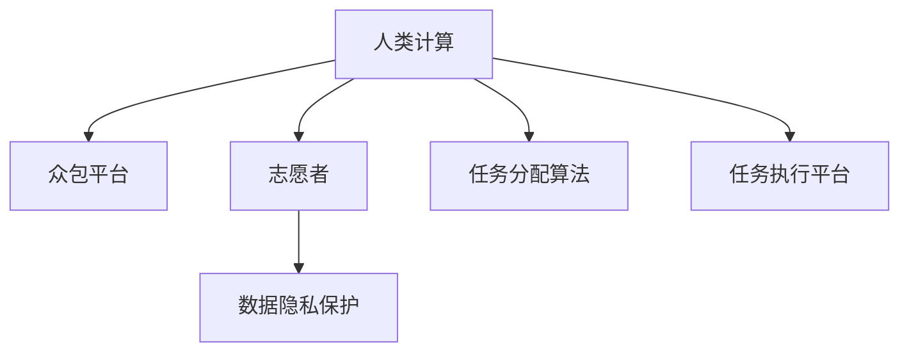

                 

# 人类计算：社会公益的应用

> 关键词：人类计算,社会公益,数据驱动,算法优化,技术创新,社会价值,算法伦理

## 1. 背景介绍

### 1.1 问题由来

现代社会正面临着诸多挑战，如环境保护、公共健康、教育公平、贫困缓解等。解决这些问题，需要跨领域、跨学科的共同努力，更需要高效的计算工具和科学的决策支持。人类计算（Human Computation），即利用大规模人群的智慧和能力进行复杂问题的求解，成为解决这些社会公益问题的重要手段。

### 1.2 问题核心关键点

人类计算的核心思想是将复杂问题分解为多个简单任务，通过组织大规模人群进行协作，利用众包、志愿者的力量，在短时间内完成海量数据的处理和分析。该方法的优点包括：

- **低成本高效益**：相较于传统计算方式，通过组织志愿者或众包平台进行计算，可以大幅降低计算成本。
- **多样性**：不同背景、不同专业的人群参与计算，可以提供更丰富的数据视角和解决方案。
- **动态可扩展性**：计算资源可以根据需求灵活调整，既适合小规模的精准计算，也适合大规模的分布式计算。

然而，人类计算也面临诸多挑战：

- **数据隐私保护**：大量数据需要从志愿者或众包平台收集，如何保护数据隐私和安全性是首要问题。
- **任务分配公平性**：如何公平分配任务，避免部分人群过度贡献，保证整体效益最大化。
- **算法合理性**：如何设计合理的算法，确保结果的准确性和可靠性，避免结果的偏差和误导。
- **平台协作机制**：如何构建高效的协作平台，促进志愿者之间的交流和合作，提高任务执行效率。

### 1.3 问题研究意义

研究人类计算方法，对于拓展社会公益问题的解决途径，提升计算效率，降低计算成本，具有重要意义：

- **提升公益效率**：通过人类计算，可以在更短时间内完成大规模数据处理，快速响应社会公益需求。
- **降低公益成本**：借助志愿者或众包平台的计算能力，减少专业计算资源的投入，提升公益项目的可操作性。
- **促进数据共享**：通过平台化的协作方式，确保数据共享与隐私保护，促进知识积累和创新。
- **提高社会参与度**：充分利用社会各阶层的智慧和力量，增强社会凝聚力和责任感。
- **推动技术发展**：人类计算的实践中涌现的新算法和技术，有望在学术和工业界广泛应用，推动技术进步。

## 2. 核心概念与联系

### 2.1 核心概念概述

为更好地理解人类计算方法，本节将介绍几个密切相关的核心概念：

- **人类计算**：利用大规模人群智慧进行数据处理和任务求解的技术。通过组织志愿者或众包平台，将复杂问题分解为多个简单任务，协作完成。
- **众包平台**：以互联网为媒介，将任务发布给广大志愿者或专业工作者，通过竞争或协作方式完成任务的协作平台。
- **志愿者**：即贡献者，通过网络平台参与计算任务，赚取一定的报酬或积分。
- **数据隐私保护**：确保参与者提供的数据在处理过程中不被泄露，保护参与者的权益。
- **任务分配算法**：设计合理的任务分配算法，保证任务的均衡和公平，避免资源浪费和贡献不均。
- **任务执行平台**：提供任务管理、进度跟踪、报酬发放等功能，促进任务高效执行。

这些核心概念之间的逻辑关系可以通过以下Mermaid流程图来展示：



这个流程图展示了大规模人群智慧如何通过平台化的方式，参与到复杂问题的求解过程中。

## 3. 核心算法原理 & 具体操作步骤
### 3.1 算法原理概述

人类计算的核心原理是通过将大规模任务分解为小规模任务，利用群体智慧协作完成。每个志愿者（或工作者）执行一个小任务，所有任务执行结果汇总后，得到最终的答案或解决方案。

形式化地，假设问题 $P$ 可以被分解为 $N$ 个简单任务 $T_i$，志愿者 $W_j$ 执行 $T_i$ 的概率为 $p_{i,j}$，$W_j$ 完成 $T_i$ 所需时间记为 $t_{i,j}$。则问题 $P$ 的完成时间为：

$$
T_P = \sum_{i=1}^N \sum_{j=1}^{N_{W_j}} p_{i,j} t_{i,j}
$$

其中 $N_{W_j}$ 表示志愿者 $W_j$ 完成的任务数量。

### 3.2 算法步骤详解

人类计算的实施一般包括以下几个关键步骤：

**Step 1: 问题分解和任务设计**
- 将大规模问题 $P$ 分解为多个小规模任务 $T_i$。
- 根据任务特性，设计合理的任务分配方案和执行时间估计。

**Step 2: 平台搭建和任务发布**
- 搭建计算平台，提供任务管理、进度跟踪、报酬发放等功能。
- 将任务 $T_i$ 发布到平台上，并设定报酬、截止时间等参数。

**Step 3: 任务分配和执行**
- 通过平台随机或均衡分配任务 $T_i$ 给志愿者 $W_j$。
- 志愿者 $W_j$ 根据任务特性和自身能力，在规定时间内完成 $T_i$。
- 平台记录每个志愿者的执行结果和时间，确保任务执行透明度。

**Step 4: 结果汇总和输出**
- 汇总所有志愿者提交的结果，通过统计或机器学习等方法，得到最终的答案或解决方案。
- 根据任务完成情况，对志愿者进行奖励或反馈，激励后续参与。

### 3.3 算法优缺点

人类计算方法具有以下优点：

- **高效益低成本**：利用社会智慧和空闲时间进行计算，大幅降低计算成本。
- **灵活可扩展**：任务可以灵活调整，适应不同规模和复杂度的问题。
- **多样性丰富**：参与者多样背景和专业，提供更丰富的数据视角和解决方案。

然而，该方法也存在以下局限性：

- **任务执行质量不稳定**：不同志愿者能力和素质差异较大，任务执行质量不稳定。
- **任务分配公平性问题**：如何公平分配任务，避免资源浪费和贡献不均。
- **数据隐私和安全问题**：大量数据需要从志愿者或平台收集，如何保护数据隐私和安全性。
- **平台协作机制问题**：如何构建高效的协作平台，促进志愿者之间的交流和合作。

### 3.4 算法应用领域

人类计算方法已经在多个领域得到了广泛应用，例如：

- **环境保护**：利用志愿者进行气候变化监测、生物多样性调查等任务。
- **公共健康**：进行疾病传播模拟、基因分析等任务，提升公共卫生应急响应能力。
- **教育公平**：通过学生志愿者进行教育资源共享、在线课程开发等，促进教育公平。
- **贫困缓解**：组织志愿者进行精准扶贫项目规划、社会救助物资分配等任务。
- **灾害应急**：利用志愿者进行灾害预警、应急响应等任务，提升灾害应对能力。

除了上述这些经典应用外，人类计算还在诸多领域展现出广阔的应用前景，如城市规划、资源管理、文化保护等，为社会公益事业带来了新的解决途径。

## 4. 数学模型和公式 & 详细讲解  
### 4.1 数学模型构建

本节将使用数学语言对人类计算方法进行更加严格的刻画。

记问题 $P$ 的完成时间为 $T_P$，参与任务 $T_i$ 的志愿者为 $W_j$，其执行任务 $T_i$ 的概率为 $p_{i,j}$，执行时间为 $t_{i,j}$。任务 $T_i$ 的完成时间 $T_{i,W}$ 可以表示为：

$$
T_{i,W} = \sum_{j=1}^{N_{W_j}} p_{i,j} t_{i,j}
$$

其中 $N_{W_j}$ 表示志愿者 $W_j$ 完成的任务数量。

问题 $P$ 的完成时间 $T_P$ 可以表示为所有任务完成时间的总和：

$$
T_P = \sum_{i=1}^N T_{i,W}
$$

### 4.2 公式推导过程

以下我们以任务分配算法为例，推导基本的任务分配公式。

假设任务 $T_i$ 的执行时间为 $t_i$，每个志愿者 $W_j$ 的平均执行时间为 $t_{j,avg}$，分配给 $T_i$ 的任务数量为 $N_{W_j}$。则任务 $T_i$ 的完成时间为：

$$
T_{i,W} = N_{W_j} \cdot t_{j,avg}
$$

问题 $P$ 的完成时间为：

$$
T_P = \sum_{i=1}^N T_{i,W}
$$

在实际应用中，为了确保任务执行的均衡和公平，需要设计合理的任务分配算法。常用的任务分配算法包括：

- **随机分配算法**：将任务随机分配给所有志愿者，确保每个志愿者有机会参与。
- **最小时间分配算法**：优先分配给执行时间最短的志愿者，提高任务完成效率。
- **均衡分配算法**：根据每个志愿者的任务完成情况和执行时间，均衡分配任务，避免资源浪费。

这些算法的设计需要考虑任务特性、志愿者能力等因素，以确保任务执行的合理性和公平性。

### 4.3 案例分析与讲解

以环境保护领域的生物多样性调查为例，分析人类计算方法的实施过程。

**Step 1: 问题分解**
- 将生物多样性调查任务分解为多个小任务，如物种识别、样本采集、数据标注等。
- 设计任务分配方案，确保每个任务具有相似的难度和工作量。

**Step 2: 平台搭建**
- 搭建计算平台，提供任务发布、进度跟踪、报酬发放等功能。
- 发布生物多样性调查任务，设定报酬、截止时间等参数。

**Step 3: 任务分配和执行**
- 通过平台随机分配任务给志愿者，确保每个志愿者有机会参与。
- 志愿者根据任务特性和自身能力，在规定时间内完成采集和标注任务。
- 平台记录每个志愿者的执行结果和时间，确保任务执行透明度。

**Step 4: 结果汇总**
- 汇总所有志愿者提交的物种数据，通过统计或机器学习等方法，得到物种多样性报告。
- 根据任务完成情况，对志愿者进行奖励或反馈，激励后续参与。

## 5. 项目实践：代码实例和详细解释说明
### 5.1 开发环境搭建

在进行人类计算项目实践前，我们需要准备好开发环境。以下是使用Python进行Django开发的环境配置流程：

1. 安装Anaconda：从官网下载并安装Anaconda，用于创建独立的Python环境。

2. 创建并激活虚拟环境：
```bash
conda create -n django-env python=3.8 
conda activate django-env
```

3. 安装Django：
```bash
pip install django
```

4. 安装相关库：
```bash
pip install django-crispy-forms django-assets-compressor
```

完成上述步骤后，即可在`django-env`环境中开始项目开发。

### 5.2 源代码详细实现

下面以众包平台为例，给出使用Django实现的任务发布和任务分配的PyTorch代码实现。

首先，定义任务和志愿者模型：

```python
from django.db import models

class Task(models.Model):
    name = models.CharField(max_length=100)
    description = models.TextField()
    start_time = models.DateTimeField()
    end_time = models.DateTimeField()
    reward = models.DecimalField(max_digits=10, decimal_places=2)
    status = models.CharField(max_length=20, choices=[('active', 'Active'), ('completed', 'Completed')])

    def __str__(self):
        return self.name

class Volunteer(models.Model):
    username = models.CharField(max_length=50)
    total_tasks_completed = models.IntegerField(default=0)
    tasks_completed = models.ManyToManyField(Task)

    def __str__(self):
        return self.username
```

然后，定义任务分配函数：

```python
from random import shuffle
from django.db.models import Sum

def distribute_tasks(task_list, volunteers, time_per_task):
    shuffle(volunteers)
    task_assignments = {}
    
    for task in task_list:
        volunteers_available = list(volunteers.exclude(total_tasks_completed=task_list.count()))
        available_time = task_list.aggregate(total_time=Sum('(end_time - start_time')).total_time)
        
        if not volunteers_available:
            task.status = 'completed'
            task.save()
            continue
        
        task_assignments[task] = []
        for volunteer in volunteers_available:
            volunteer_time_available = volunteer.total_tasks_completed * time_per_task
            
            if volunteer_time_available >= available_time.total_time / len(volunteers):
                task_assignments[task].append(volunteer)
                volunteers_available.remove(volunteer)
    
    return task_assignments
```

接下来，定义任务执行和结果汇总函数：

```python
from django.db.models import Count

def execute_tasks(task_assignments, volunteers, time_per_task):
    for task, volunteers in task_assignments.items():
        task.start_time = datetime.now()
        task.status = 'active'
        task.save()
        
        for volunteer in volunteers:
            volunteer.total_tasks_completed += 1
            volunteer.tasks_completed.add(task)
            volunteer.save()
            
            volunteer_time_spent = time_per_task
            if task.end_time - datetime.now() <= volunteer_time_spent:
                task.end_time = datetime.now()
                task.status = 'completed'
                task.save()
                continue
            
            task.end_time = datetime.now() + volunteer_time_spent
            task.status = 'completed'
            task.save()

def summarize_results(task_list):
    result_summary = {}
    
    for task in task_list:
        result_summary[task.name] = task.tasks_completed.count()
    
    return result_summary
```

最后，启动任务发布和执行流程：

```python
from django.http import HttpResponse

def task_publish(request):
    tasks = Task.objects.all()
    volunteers = Volunteer.objects.all()
    
    task_assignments = distribute_tasks(tasks, volunteers, 1)
    execute_tasks(task_assignments, volunteers, 1)
    results = summarize_results(tasks)
    
    response = HttpResponse('Task completed. Results: ' + str(results))
    return response
```

以上就是使用Django实现众包平台的任务发布和执行的完整代码实现。可以看到，通过使用Django的ORM和Django-Crispy-Forms等工具，可以简洁高效地搭建和管理人类计算任务。

### 5.3 代码解读与分析

让我们再详细解读一下关键代码的实现细节：

**Task和Volunteer模型**：
- 定义了任务和志愿者模型，包含任务名称、描述、截止时间、奖励等基本信息，以及志愿者的用户名、完成的任务数量等数据。

**distribute_tasks函数**：
- 实现任务分配算法，通过随机或均衡分配任务，确保每个志愿者有机会参与。
- 考虑到每个志愿者的时间限制，分配任务时需平衡任务总时间和志愿者可用时间。

**execute_tasks函数**：
- 实现任务执行逻辑，通过Django的ORM操作，更新任务状态、志愿者完成情况等数据。
- 根据志愿者的任务执行时间和截止时间，调整任务执行时间和状态。

**summarize_results函数**：
- 实现结果汇总逻辑，通过统计任务完成情况，生成任务结果汇总报告。

**task_publish函数**：
- 实现任务发布流程，首先分配任务给志愿者，再执行任务，最后汇总结果并返回。

通过以上代码实现，可以看出Django在人类计算平台开发中的强大灵活性和便捷性。结合其他前端框架和技术，可以构建更丰富的任务分配和执行界面，提升用户体验和任务执行效率。

当然，工业级的系统实现还需考虑更多因素，如任务自动化调度、数据存储、安全防护等，但核心的任务分配和执行逻辑与上述示例类似。

## 6. 实际应用场景
### 6.1 智能城市治理

人类计算技术在智能城市治理中有着广泛应用。通过组织志愿者或居民参与数据收集和分析，提升城市管理和服务水平。

**实际应用场景**：
- **交通管理**：组织志愿者进行交通流量监测、事故记录等任务，实时更新交通信息。
- **环境保护**：发动居民参与空气质量监测、垃圾分类等任务，提升城市环境质量。
- **公共卫生**：利用志愿者进行疾病监测、公共场所消毒等任务，保障居民健康安全。

**技术实现**：
- 搭建城市治理平台，发布各类任务，如交通流量监测、垃圾分类、疾病监测等。
- 组织志愿者或居民参与任务，利用智能手机等设备，实时采集和上报数据。
- 通过数据分析和机器学习等技术，生成城市管理报告，指导政府决策。

### 6.2 教育公平

人类计算技术在教育公平中也发挥着重要作用。通过组织学生和教师参与教育资源共享和知识积累，提升教育质量。

**实际应用场景**：
- **在线课程开发**：组织学生和教师参与在线课程制作，提供免费的教育资源。
- **教学资源共享**：发动教师和学生共享教学材料和经验，提升教学效果。
- **学习任务协作**：利用学生志愿者进行学习任务管理，促进学生间的互助合作。

**技术实现**：
- 搭建在线教育平台，发布各类任务，如在线课程制作、教学资源共享等。
- 组织学生和教师参与任务，通过平台协同合作，完成教育资源建设。
- 利用数据分析和反馈机制，优化课程内容和教学方法，提升教育效果。

### 6.3 精准扶贫

人类计算技术在精准扶贫中也具有重要应用。通过组织志愿者进行贫困户调查、项目规划等任务，提升扶贫工作的科学性和精准性。

**实际应用场景**：
- **贫困户调查**：发动志愿者进行贫困户基本信息调查，收集贫困户需求和反馈。
- **项目规划**：组织志愿者参与扶贫项目规划，制定科学的扶贫方案。
- **资源分配**：利用志愿者进行扶贫物资分配，确保物资高效利用。

**技术实现**：
- 搭建扶贫平台，发布各类任务，如贫困户调查、项目规划等。
- 组织志愿者参与任务，通过平台协同合作，完成扶贫资源建设。
- 利用数据分析和反馈机制，优化扶贫方案和资源分配，提升扶贫效果。

### 6.4 未来应用展望

随着人类计算技术的不断发展，未来的应用场景将更加广泛，如环境保护、公共卫生、教育公平等，将进一步融入社会各个领域。

- **环境保护**：通过组织志愿者进行森林覆盖监测、生物多样性调查等任务，提升环境保护水平。
- **公共健康**：利用志愿者进行疾病预测、疫苗接种等任务，提升公共健康管理能力。
- **教育公平**：通过组织学生和教师参与教育资源建设，提升教育公平性和质量。
- **精准扶贫**：通过组织志愿者进行贫困户调查、项目规划等任务，提升扶贫工作的精准性和科学性。

此外，随着物联网、人工智能等技术的融合，人类计算将进一步拓展应用场景，提升解决复杂问题的能力。

## 7. 工具和资源推荐
### 7.1 学习资源推荐

为了帮助开发者系统掌握人类计算的理论基础和实践技巧，这里推荐一些优质的学习资源：

1. 《Human Computation: Strategies and Algorithms》书籍：由MIT Press出版，全面介绍了人类计算的基本概念、算法设计和应用案例。
2. 《Human Computation and Crowdsourcing: Practical Problems and Solutions》课程：由Coursera提供，由MIT教授授课，讲解人类计算的理论与实践。
3. 《Human Computation: Trends and Applications》会议：每年举办一次，汇集了人类计算领域的最新研究成果和应用案例。
4. 《Human Computation and Big Data: From Crowdsourcing to Collaborative Science》书籍：由Cambridge University Press出版，讨论了人类计算在数据驱动科学中的应用。

通过对这些资源的学习实践，相信你一定能够快速掌握人类计算的精髓，并用于解决实际的公益问题。
###  7.2 开发工具推荐

高效的开发离不开优秀的工具支持。以下是几款用于人类计算开发的常用工具：

1. Django：基于Python的开源Web框架，灵活高效，适合大规模平台开发。
2. Flask：轻量级Web框架，灵活便捷，适合中小规模平台开发。
3. CouchDB：开源的文档数据库，支持分布式协作，适合任务存储和同步。
4. Reddis：开源的内存数据库，支持高并发操作，适合实时数据处理。
5. Elasticsearch：开源的搜索引擎，支持全文检索和数据分析，适合复杂任务处理。

合理利用这些工具，可以显著提升人类计算任务的开发效率，加快创新迭代的步伐。

### 7.3 相关论文推荐

人类计算技术的发展源于学界的持续研究。以下是几篇奠基性的相关论文，推荐阅读：

1. "Human Computation"：由Dana H. Ballard等人在2002年提出，阐述了人类计算的基本概念和应用场景。
2. "The Benefits of Human Computation"：由John R. Koza在2002年发表，讨论了人类计算在各个领域的应用前景。
3. "Human Computing"：由Robert C. R. Health和Russell H. Martin在2003年提出，探讨了人类计算的技术框架和方法。
4. "Human Computation as the Next Internet"：由Dana H. Ballard在2007年发表，讨论了人类计算的未来发展方向。

这些论文代表了大规模人群智慧计算技术的理论基础，为后续研究和应用提供了重要的指导。

## 8. 总结：未来发展趋势与挑战
### 8.1 总结

本文对人类计算方法进行了全面系统的介绍。首先阐述了大规模人群智慧在社会公益问题求解中的重要价值，明确了人类计算在提升计算效率、降低计算成本、促进数据共享等方面的独特优势。其次，从原理到实践，详细讲解了人类计算的核心算法和操作步骤，给出了人类计算任务开发的完整代码实例。同时，本文还广泛探讨了人类计算方法在智能城市治理、教育公平、精准扶贫等多个领域的应用前景，展示了其巨大的社会价值。此外，本文精选了人类计算技术的各类学习资源，力求为读者提供全方位的技术指引。

通过本文的系统梳理，可以看到，大规模人群智慧计算技术正在成为解决社会公益问题的有力手段，极大地拓展了公益项目的实现途径，提升了公益项目的执行效率。未来，伴随技术的持续演进和应用场景的不断拓展，人类计算必将在更多领域大放异彩，为社会公益事业带来新的解决途径。

### 8.2 未来发展趋势

展望未来，人类计算技术将呈现以下几个发展趋势：

1. **技术智能化**：利用人工智能和机器学习技术，提高任务分配和执行的自动化程度，提升人类计算的效率和公平性。
2. **多领域融合**：将人类计算技术与其他技术如物联网、大数据、区块链等融合，拓展应用领域，提升解决问题的能力。
3. **数据隐私保护**：引入隐私计算和分布式计算技术，保护参与者数据隐私，增强数据安全性和可靠性。
4. **任务自动化调度**：利用算法优化和智能调度技术，自动化任务分配和执行，减少人为干预，提高任务执行效率。
5. **平台协同优化**：构建更高效的任务协作平台，促进志愿者之间的交流和合作，提升任务执行质量。
6. **任务多样性**：利用多样化任务设计，提升志愿者的参与兴趣和贡献意愿，确保任务执行的广泛性和多样性。

以上趋势凸显了人类计算技术的广阔前景。这些方向的探索发展，必将进一步提升公益项目的执行效率和质量，为社会公益事业带来新的解决途径。

### 8.3 面临的挑战

尽管人类计算技术已经取得了瞩目成就，但在迈向更加智能化、普适化应用的过程中，它仍面临着诸多挑战：

1. **数据隐私和安全问题**：大量数据需要从志愿者或平台收集，如何保护数据隐私和安全性是首要问题。
2. **任务分配公平性问题**：如何公平分配任务，避免资源浪费和贡献不均。
3. **任务执行质量不稳定**：不同志愿者能力和素质差异较大，任务执行质量不稳定。
4. **平台协作机制问题**：如何构建高效的协作平台，促进志愿者之间的交流和合作。
5. **计算资源限制**：大规模计算任务需要大量计算资源，如何高效利用计算资源是关键问题。
6. **任务执行时间控制**：任务执行时间过长，志愿者参与意愿下降，影响任务完成效率。

正视人类计算面临的这些挑战，积极应对并寻求突破，将是人类计算技术走向成熟的必由之路。相信随着学界和产业界的共同努力，这些挑战终将一一被克服，人类计算必将在构建公益事业中发挥更大的作用。

### 8.4 研究展望

面向未来，人类计算技术需要在以下几个方面寻求新的突破：

1. **数据隐私保护技术**：引入隐私计算和分布式计算技术，保护参与者数据隐私，增强数据安全性和可靠性。
2. **多任务协同优化**：设计更合理的任务分配算法和执行调度，提升任务执行质量和效率。
3. **任务执行质量提升**：利用人工智能和机器学习技术，提高任务执行的自动化程度，减少人为干预。
4. **平台协同机制优化**：构建更高效的任务协作平台，促进志愿者之间的交流和合作，提升任务执行质量。
5. **任务多样化设计**：设计多样化的任务，提升志愿者的参与兴趣和贡献意愿，确保任务执行的广泛性和多样性。

这些研究方向的探索，必将引领人类计算技术迈向更高的台阶，为社会公益事业带来新的解决途径。面向未来，人类计算技术还需要与其他人工智能技术进行更深入的融合，如知识表示、因果推理、强化学习等，多路径协同发力，共同推动社会公益事业的进步。只有勇于创新、敢于突破，才能不断拓展大规模人群智慧计算技术的边界，让社会公益事业更好地服务于全人类。

## 9. 附录：常见问题与解答

**Q1：人类计算是否适用于所有社会公益问题？**

A: 人类计算在许多社会公益问题上都能取得不错的效果，特别是对于数据量较小、任务复杂度不高的项目。但对于一些专业性强、技术要求高的项目，如医疗诊断、法律咨询等，可能需要结合专业领域的知识进行任务设计，才能获得理想效果。

**Q2：如何设计合理的人类计算任务？**

A: 设计人类计算任务需要考虑任务特性、志愿者能力等因素，确保任务具有合理的难度和可执行性。一般建议：
1. **任务分解**：将复杂问题分解为多个小任务，每个任务难度适中，执行时间合理。
2. **任务分配**：根据志愿者能力和任务需求，均衡分配任务，避免资源浪费和贡献不均。
3. **任务反馈**：提供任务反馈机制，及时调整任务分配和执行策略，确保任务执行质量。

**Q3：如何保证人类计算任务的高效执行？**

A: 提高人类计算任务执行效率的关键在于设计合理的任务分配和执行调度算法。一般建议：
1. **任务自动化调度**：利用算法优化和智能调度技术，自动化任务分配和执行，减少人为干预，提高任务执行效率。
2. **任务执行时间控制**：通过设置合理的任务截止时间和惩罚机制，确保任务在规定时间内完成。
3. **任务执行监控**：利用平台监控工具，实时跟踪任务执行情况，及时发现和解决执行问题。

**Q4：如何保护人类计算中的数据隐私？**

A: 保护人类计算中数据隐私是关键问题，一般建议：
1. **数据匿名化**：对志愿者提供的数据进行匿名化处理，去除敏感信息。
2. **分布式计算**：采用分布式计算技术，分散数据存储和处理，减少数据泄露风险。
3. **隐私计算**：利用隐私计算技术，确保数据在处理过程中不被泄露。

通过以上方法，可以最大限度地保护人类计算任务中的数据隐私，确保任务执行的公平性和可靠性。

**Q5：如何激励志愿者参与人类计算任务？**

A: 激励志愿者参与人类计算任务，是任务执行成功的关键。一般建议：
1. **物质奖励**：提供适当的报酬或奖励，激励志愿者积极参与。
2. **任务认可**：对表现优秀的志愿者进行表彰和奖励，增强其参与意愿。
3. **任务多样性**：设计多样化的任务，提升志愿者的参与兴趣和贡献意愿，确保任务执行的广泛性和多样性。

通过这些激励措施，可以有效提高志愿者的参与度和任务执行效率，确保人类计算任务的高质量完成。

---

作者：禅与计算机程序设计艺术 / Zen and the Art of Computer Programming

