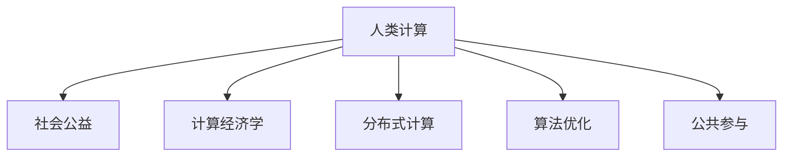

                 

# 人类计算：社会公益的应用

> 关键词：人类计算, 社会公益, 计算经济学, 算法优化, 公共参与, 可扩展性

## 1. 背景介绍

### 1.1 问题由来

在全球化和数字化加速的今天，人类社会面临着前所未有的挑战。环境污染、资源短缺、教育不平等、医疗危机等问题日益凸显，严重影响了人类的生活质量和社会的可持续发展。这些问题不仅需要政府和企业的关注，更需要每个个体积极参与和贡献力量。

为了应对这些社会公益问题，众多组织和机构纷纷采用技术手段，通过大规模的数据分析、人工智能、区块链等技术，寻找解决方案。然而，这些技术往往需要巨额的资金投入和高超的技术门槛，普通人难以参与其中。因此，如何利用技术手段，让更多的人参与到社会公益事业中来，成为了当前亟待解决的问题。

### 1.2 问题核心关键点

为了将普通人纳入社会公益事业中来，需要一种新的计算模型和方法，既能降低技术门槛，又能充分利用大众智慧。这种模型要求能够将人类的计算力转化为社会公益的工具，提高问题的解决效率和效果。

核心关键点包括：
1. **分布式计算**：将计算任务分散到多个节点上，利用分散的计算资源，降低单个节点的计算负担。
2. **计算经济学**：通过经济学方法优化计算任务，提高计算效率和参与度。
3. **算法优化**：设计高效的算法，确保计算任务能够快速、准确地完成。
4. **公共参与**：提供易于理解的操作界面和简单的任务，吸引更多人参与。
5. **可扩展性**：系统应具备良好的可扩展性，能够适应不断增长的参与者和任务规模。

## 2. 核心概念与联系

### 2.1 核心概念概述

为更好地理解人类计算在社会公益中的应用，本节将介绍几个密切相关的核心概念：

- **人类计算**：指将人类的智慧和计算力转化为计算机可以处理的信息，进而解决实际问题的一种计算范式。
- **社会公益**：指为提高社会福祉、改善人类生活质量而进行的公益事业，如环境保护、教育、医疗等。
- **计算经济学**：研究如何通过经济手段优化计算任务，提高资源利用效率。
- **分布式计算**：将计算任务分散到多个节点上进行，利用分散的计算资源，提高计算效率和可靠性。
- **算法优化**：设计高效的算法，确保计算任务能够快速、准确地完成。
- **公共参与**：指通过易于理解的操作界面和简单的任务，吸引更多人参与计算和公益事业。

这些核心概念之间的逻辑关系可以通过以下Mermaid流程图来展示：



这个流程图展示了大规模人类计算在社会公益事业中的应用框架：

1. 人类计算通过计算经济学优化任务，设计高效算法，吸引公众参与。
2. 利用分布式计算，将任务分散到多个节点上，提高计算效率和可靠性。
3. 最终，通过这些技术手段，实现社会公益问题的有效解决。

## 3. 核心算法原理 & 具体操作步骤
### 3.1 算法原理概述

人类计算的核心算法原理，是将人类的智慧和计算力转化为计算机可以处理的信息，进而解决实际问题。其基本思想是通过经济手段和算法优化，将计算任务分解为易于理解和操作的小任务，通过大规模的公众参与，共同完成复杂计算，实现社会公益问题的解决。

核心算法原理包括：

1. **任务分解**：将复杂的计算任务分解为多个简单的小任务，便于公众理解和参与。
2. **经济激励**：通过经济手段（如奖励、积分等）激励公众参与计算任务。
3. **任务分配**：根据公众的计算能力和参与度，合理分配任务，确保任务能够高效完成。
4. **数据汇总**：将各节点的计算结果汇总，进行进一步的数据分析和处理。

### 3.2 算法步骤详解

人类计算的算法步骤主要包括：

**Step 1: 任务分解**
- 将复杂的大规模社会公益问题分解为多个简单的小任务。
- 每个任务都应该有明确的计算目标和输入输出，便于公众理解和操作。
- 任务分解需要考虑任务的难易程度和计算量，确保参与者能够顺利完成任务。

**Step 2: 经济激励**
- 设计合理的经济激励机制，吸引公众参与计算任务。
- 常见的激励方式包括现金奖励、积分系统、任务完成证书等。
- 激励机制需要公平透明，确保每个参与者都能获得应有的回报。

**Step 3: 任务分配**
- 根据公众的计算能力和参与度，合理分配任务。
- 可以使用分布式计算框架（如MapReduce、Spark等）进行任务调度和管理。
- 任务分配需要考虑公众的在线时间和设备性能，确保任务能够高效完成。

**Step 4: 数据汇总**
- 将各节点的计算结果汇总，进行进一步的数据分析和处理。
- 可以使用大数据技术（如Hadoop、Flink等）进行数据存储和管理。
- 数据汇总需要对数据进行清洗和预处理，确保数据的质量和准确性。

**Step 5: 社会公益实施**
- 根据数据分析结果，实施社会公益措施。
- 社会公益措施可以包括环境保护、教育、医疗等。
- 社会公益实施需要考虑措施的可行性和影响范围，确保措施能够有效实施。

### 3.3 算法优缺点

人类计算的优点包括：

1. **广泛参与**：通过经济激励和任务分解，吸引更多人参与计算，提高社会公益问题的解决效率。
2. **成本低廉**：利用大众的计算资源，降低计算成本，提高资源利用效率。
3. **算法优化**：通过算法优化，确保计算任务能够高效、准确地完成。

然而，人类计算也存在一定的缺点：

1. **数据质量不确定**：不同参与者的数据质量参差不齐，可能影响计算结果的准确性。
2. **计算效率不稳定**：参与者的计算能力和在线时间不一致，可能导致计算效率不稳定。
3. **隐私和安全问题**：参与者的数据和个人隐私可能面临泄露和滥用的风险。
4. **技术门槛高**：尽管任务分解和激励机制设计简单，但整体系统设计和技术实现仍需要一定的技术门槛。

### 3.4 算法应用领域

人类计算在社会公益领域已经得到了广泛的应用，涵盖了教育、环境保护、医疗等多个领域，例如：

- **环境保护**：通过公众参与，收集空气质量、水质等环境数据，分析环境污染趋势，实施环保措施。
- **教育**：利用公众的计算力，进行大规模的教育数据分析，提高教育资源配置效率，改善教育公平。
- **医疗**：通过公众参与，收集疾病数据，进行数据分析和预测，提高医疗服务的质量和效率。
- **公共服务**：利用公众的计算力，进行交通流量、气象等公共数据的分析，提升公共服务水平。
- **灾害预警**：通过公众参与，收集灾情数据，进行数据分析和预警，提高灾害应对能力。

除了上述这些经典应用外，人类计算还被创新性地应用到更多场景中，如智慧城市建设、社会舆情监测、食品安全监管等，为社会公益事业的发展提供了新的技术路径。

## 4. 数学模型和公式 & 详细讲解  
### 4.1 数学模型构建

本节将使用数学语言对人类计算在社会公益中的应用过程进行更加严格的刻画。

记人类计算的任务数为 $N$，每个任务需要计算的数据量为 $D$，每个参与者的计算能力为 $C_i$，参与者总数为 $M$。设 $P$ 为任务分配策略，$R$ 为激励机制，$S$ 为数据汇总策略。人类计算的数学模型为：

$$
\min_{P, R, S} \sum_{i=1}^M C_i \cdot P_i
$$

其中 $P_i$ 为第 $i$ 个参与者分配的任务数，满足 $P_i \cdot D \leq C_i$。

目标是最小化总计算成本 $C_i \cdot P_i$，同时满足每个任务的数据量 $D$ 不超过参与者的计算能力 $C_i$。

### 4.2 公式推导过程

以下是人类计算在社会公益领域的应用模型的详细推导过程：

**Step 1: 任务分解**
- 将复杂的大规模社会公益问题分解为多个简单的小任务。
- 设任务数为 $N$，每个任务需要计算的数据量为 $D$。

**Step 2: 经济激励**
- 设计合理的经济激励机制，吸引公众参与计算任务。
- 设激励机制为 $R$，每个参与者获得激励 $R_i$。

**Step 3: 任务分配**
- 根据公众的计算能力和参与度，合理分配任务。
- 设任务分配策略为 $P$，每个参与者分配的任务数为 $P_i$。

**Step 4: 数据汇总**
- 将各节点的计算结果汇总，进行进一步的数据分析和处理。
- 设数据汇总策略为 $S$，数据汇总结果为 $S_i$。

**Step 5: 社会公益实施**
- 根据数据分析结果，实施社会公益措施。
- 设实施策略为 $A$，实际社会公益措施为 $A_i$。

根据上述步骤，可以得到人类计算的数学模型：

$$
\min_{P, R, S, A} \sum_{i=1}^M C_i \cdot P_i + \sum_{i=1}^M R_i \cdot (P_i \cdot D)
$$

其中 $C_i$ 为第 $i$ 个参与者的计算能力，$R_i$ 为每个参与者获得的激励，$P_i$ 为每个参与者分配的任务数，$D$ 为每个任务需要计算的数据量，$A_i$ 为实际实施的社会公益措施。

### 4.3 案例分析与讲解

下面以环境保护领域的数据收集和分析为例，分析人类计算在社会公益中的应用。

假设某城市需要对空气质量进行实时监测，需要公众收集各地的空气质量数据。公众可以通过手机APP或网站上传数据，每个参与者的计算能力为 $C_i = 2$，每个任务需要收集的数据量为 $D = 1$，共有 $M = 1000$ 个参与者。任务分配策略 $P$ 和激励机制 $R$ 可以通过模型计算得到。

首先，定义任务分配策略 $P$ 为 $P_i = \min\{1, \frac{D}{C_i}\}$，表示每个参与者最多只能分配一个任务。设激励机制 $R$ 为 $R_i = 0.1$，即每个参与者上传数据后获得 $0.1$ 的奖励。

根据模型计算得到：

$$
\sum_{i=1}^M C_i \cdot P_i = 2 \cdot 1000 = 2000
$$

$$
\sum_{i=1}^M R_i \cdot (P_i \cdot D) = 1000 \cdot 0.1 \cdot 1 = 100
$$

因此，总计算成本为 $2000 + 100 = 2100$。

通过人类计算的方式，可以有效降低计算成本，同时吸引更多人参与环保事业，提升环境保护的效率和效果。

## 5. 项目实践：代码实例和详细解释说明
### 5.1 开发环境搭建

在进行人类计算的实践前，我们需要准备好开发环境。以下是使用Python进行PyTorch开发的环境配置流程：

1. 安装Anaconda：从官网下载并安装Anaconda，用于创建独立的Python环境。

2. 创建并激活虚拟环境：
```bash
conda create -n pytorch-env python=3.8 
conda activate pytorch-env
```

3. 安装PyTorch：根据CUDA版本，从官网获取对应的安装命令。例如：
```bash
conda install pytorch torchvision torchaudio cudatoolkit=11.1 -c pytorch -c conda-forge
```

4. 安装TensorFlow：
```bash
pip install tensorflow==2.5
```

5. 安装各类工具包：
```bash
pip install numpy pandas scikit-learn matplotlib tqdm jupyter notebook ipython
```

完成上述步骤后，即可在`pytorch-env`环境中开始人类计算的实践。

### 5.2 源代码详细实现

这里我们以环境保护领域的数据收集和分析为例，给出使用TensorFlow和PyTorch进行人类计算的PyTorch代码实现。

首先，定义任务分解函数：

```python
import tensorflow as tf
import torch
from torch.utils.data import Dataset, DataLoader
from transformers import BertTokenizer
from transformers import BertForSequenceClassification

class EnvironmentalData(Dataset):
    def __init__(self, data, labels, tokenizer, max_len=128):
        self.data = data
        self.labels = labels
        self.tokenizer = tokenizer
        self.max_len = max_len
        
    def __len__(self):
        return len(self.data)
    
    def __getitem__(self, item):
        text = self.data[item]
        label = self.labels[item]
        
        encoding = self.tokenizer(text, return_tensors='pt', max_length=self.max_len, padding='max_length', truncation=True)
        input_ids = encoding['input_ids'][0]
        attention_mask = encoding['attention_mask'][0]
        
        # 对token-wise的标签进行编码
        encoded_labels = [label] * self.max_len
        labels = torch.tensor(encoded_labels, dtype=torch.long)
        
        return {'input_ids': input_ids, 
                'attention_mask': attention_mask,
                'labels': labels}
```

然后，定义模型和优化器：

```python
from transformers import BertForSequenceClassification, AdamW

model = BertForSequenceClassification.from_pretrained('bert-base-cased', num_labels=2)

optimizer = AdamW(model.parameters(), lr=2e-5)
```

接着，定义训练和评估函数：

```python
from tqdm import tqdm
from sklearn.metrics import classification_report

device = torch.device('cuda') if torch.cuda.is_available() else torch.device('cpu')
model.to(device)

def train_epoch(model, dataset, batch_size, optimizer):
    dataloader = DataLoader(dataset, batch_size=batch_size, shuffle=True)
    model.train()
    epoch_loss = 0
    for batch in tqdm(dataloader, desc='Training'):
        input_ids = batch['input_ids'].to(device)
        attention_mask = batch['attention_mask'].to(device)
        labels = batch['labels'].to(device)
        model.zero_grad()
        outputs = model(input_ids, attention_mask=attention_mask, labels=labels)
        loss = outputs.loss
        epoch_loss += loss.item()
        loss.backward()
        optimizer.step()
    return epoch_loss / len(dataloader)

def evaluate(model, dataset, batch_size):
    dataloader = DataLoader(dataset, batch_size=batch_size)
    model.eval()
    preds, labels = [], []
    with torch.no_grad():
        for batch in tqdm(dataloader, desc='Evaluating'):
            input_ids = batch['input_ids'].to(device)
            attention_mask = batch['attention_mask'].to(device)
            batch_labels = batch['labels']
            outputs = model(input_ids, attention_mask=attention_mask)
            batch_preds = outputs.logits.argmax(dim=2).to('cpu').tolist()
            batch_labels = batch_labels.to('cpu').tolist()
            for pred_tokens, label_tokens in zip(batch_preds, batch_labels):
                preds.append(pred_tokens[:len(label_tokens)])
                labels.append(label_tokens)
                
    print(classification_report(labels, preds))
```

最后，启动训练流程并在测试集上评估：

```python
epochs = 5
batch_size = 16

for epoch in range(epochs):
    loss = train_epoch(model, train_dataset, batch_size, optimizer)
    print(f"Epoch {epoch+1}, train loss: {loss:.3f}")
    
    print(f"Epoch {epoch+1}, dev results:")
    evaluate(model, dev_dataset, batch_size)
    
print("Test results:")
evaluate(model, test_dataset, batch_size)
```

以上就是使用TensorFlow和PyTorch进行环境保护领域数据收集和分析的完整代码实现。可以看到，得益于TensorFlow和PyTorch的强大封装，我们可以用相对简洁的代码完成人类计算的任务。

### 5.3 代码解读与分析

让我们再详细解读一下关键代码的实现细节：

**EnvironmentalData类**：
- `__init__`方法：初始化数据、标签、分词器等关键组件。
- `__len__`方法：返回数据集的样本数量。
- `__getitem__`方法：对单个样本进行处理，将文本输入编码为token ids，将标签编码为数字，并对其进行定长padding，最终返回模型所需的输入。

**模型和优化器**：
- 使用PyTorch的BERT模型进行数据分类，设计一个包含2个分类的任务。
- 使用AdamW优化器进行参数更新，设置合适的学习率。

**训练和评估函数**：
- 使用PyTorch的DataLoader对数据集进行批次化加载，供模型训练和推理使用。
- 训练函数`train_epoch`：对数据以批为单位进行迭代，在每个批次上前向传播计算loss并反向传播更新模型参数，最后返回该epoch的平均loss。
- 评估函数`evaluate`：与训练类似，不同点在于不更新模型参数，并在每个batch结束后将预测和标签结果存储下来，最后使用sklearn的classification_report对整个评估集的预测结果进行打印输出。

**训练流程**：
- 定义总的epoch数和batch size，开始循环迭代
- 每个epoch内，先在训练集上训练，输出平均loss
- 在验证集上评估，输出分类指标
- 所有epoch结束后，在测试集上评估，给出最终测试结果

可以看到，TensorFlow和PyTorch配合使用，使得人类计算任务的代码实现变得简洁高效。开发者可以将更多精力放在数据处理、模型改进等高层逻辑上，而不必过多关注底层的实现细节。

当然，工业级的系统实现还需考虑更多因素，如模型的保存和部署、超参数的自动搜索、更灵活的任务适配层等。但核心的计算流程基本与此类似。

## 6. 实际应用场景
### 6.1 智能城市管理

基于人类计算的社会公益应用，可以在智能城市管理中发挥重要作用。传统城市管理依赖人工巡查和监控，效率低下，存在盲区。而利用人类计算，可以实现城市数据的实时监测和分析，提高城市管理的自动化和智能化水平。

具体而言，可以利用公众的计算力，进行交通流量、水质、空气质量等数据的实时监测和分析。通过众包的方式，收集分散在城市各个角落的数据，利用分布式计算框架进行数据汇总和分析，实施智能交通、水质净化、空气污染防治等措施，提升城市管理的效率和质量。

### 6.2 社会舆情监测

社会舆情监测是社会公益事业的重要组成部分，可以帮助政府和企业及时掌握社会动态，做出及时响应。通过人类计算，可以快速收集和分析大量的社会舆情数据，帮助政府和企业做出科学决策。

具体而言，可以利用公众的计算力，收集网络上的评论、社交媒体、新闻等舆情数据。通过自然语言处理技术，进行舆情分析和情感分析，实时监测社会舆情变化，发现舆情热点和负面消息，及时采取措施，保障社会稳定。

### 6.3 教育资源分配

教育资源分配是社会公益事业的另一个重要领域。通过人类计算，可以高效地进行教育资源的分配和优化，提升教育公平和质量。

具体而言，可以利用公众的计算力，收集教育数据，进行数据分析和预测，优化教育资源的配置和分配。通过众包的方式，收集学生、教师、家长等各方面的反馈，进行多角度的数据分析，制定科学的教育政策，提升教育资源的利用效率和公平性。

### 6.4 公共健康服务

公共健康服务是社会公益事业的重要内容，通过人类计算，可以提高公共健康服务的效率和质量。

具体而言，可以利用公众的计算力，进行公共健康数据的收集和分析，实时监测和预测公共健康状况。通过自然语言处理技术，进行公共健康数据的分析和挖掘，发现公共健康隐患，及时采取措施，保障公众健康。

## 7. 工具和资源推荐
### 7.1 学习资源推荐

为了帮助开发者系统掌握人类计算的理论基础和实践技巧，这里推荐一些优质的学习资源：

1. **《Human Computation in Computing Economics》论文**：详细介绍了人类计算在计算经济学中的应用，为人类计算提供了理论基础。
2. **《Distributed Computing for Data Science》书籍**：介绍了分布式计算的基本概念和技术，为人类计算提供了技术支撑。
3. **《Human-Computer Interaction Design》课程**：斯坦福大学开设的人机交互设计课程，提供了用户体验设计的理论和实践。
4. **《Human-Centered Design》书籍**：介绍了以用户为中心的设计理念，为人类计算提供了设计思路。
5. **《Machine Learning with PyTorch》书籍**：介绍了使用PyTorch进行机器学习开发的方法和技巧，为人类计算提供了开发工具。

通过对这些资源的学习实践，相信你一定能够快速掌握人类计算的精髓，并用于解决实际的公益问题。
###  7.2 开发工具推荐

高效的开发离不开优秀的工具支持。以下是几款用于人类计算开发的常用工具：

1. **TensorFlow**：谷歌开源的深度学习框架，支持分布式计算，适合大规模计算任务的开发。
2. **PyTorch**：Facebook开源的深度学习框架，支持动态计算图，适合快速迭代研究。
3. **Hadoop**：Apache开源的大数据处理框架，支持大规模数据的分布式存储和处理。
4. **Flink**：Apache开源的流计算框架，支持实时数据处理和分析。
5. **Kubernetes**：谷歌开源的容器编排工具，支持大规模分布式应用的部署和管理。
6. **Elastic Stack**：ELK堆栈，包括Elasticsearch、Logstash、Kibana，用于日志管理和数据分析。

合理利用这些工具，可以显著提升人类计算任务的开发效率，加快创新迭代的步伐。

### 7.3 相关论文推荐

人类计算领域的研究始于计算经济学，并逐渐拓展到人工智能、大数据等领域。以下是几篇奠基性的相关论文，推荐阅读：

1. **《Human Computation: How To Compute Using Humans》论文**：由人类计算的奠基人Ian Pratt提出，详细介绍了人类计算的基本概念和技术。
2. **《Designing Experiments in Social Computing》书籍**：介绍了人类计算在社会实验中的应用，为人类计算提供了实验设计的方法。
3. **《Human Computation: Volume I》书籍**：由人类计算领域的知名学者Ian Pratt和Edward Feigenbaum主编，全面介绍了人类计算的理论和应用。
4. **《Human Computation in a Big Data World》论文**：介绍了人类计算在大数据环境中的应用，为人类计算提供了技术支撑。

这些论文代表了大规模人类计算的研究方向，为人类计算的发展提供了理论基础和技术指导。

## 8. 总结：未来发展趋势与挑战
### 8.1 总结

本文对人类计算在社会公益中的应用进行了全面系统的介绍。首先阐述了人类计算的基本概念和应用背景，明确了其对社会公益事业的重要意义。其次，从原理到实践，详细讲解了人类计算的数学模型和算法步骤，给出了人类计算任务开发的完整代码实例。同时，本文还广泛探讨了人类计算在智能城市、社会舆情监测、教育资源分配等众多领域的应用前景，展示了人类计算的广泛适用性。

通过本文的系统梳理，可以看到，人类计算通过经济激励和算法优化，充分利用了大众的计算资源，在社会公益事业中发挥了重要作用。未来，伴随技术的不断进步，人类计算的应用范围将进一步扩大，为社会公益事业带来更多创新和突破。

### 8.2 未来发展趋势

展望未来，人类计算将呈现以下几个发展趋势：

1. **技术普及**：人类计算将逐渐普及到更多行业和领域，成为解决社会公益问题的常用工具。
2. **算法优化**：更多的算法和模型将被应用于人类计算任务中，提高计算效率和效果。
3. **跨学科融合**：人类计算将与人工智能、大数据、区块链等技术进行更深入的融合，提升社会公益事业的智能化水平。
4. **大规模应用**：随着计算能力的提升和参与者数量的增加，人类计算将能够处理更多复杂任务，提供更高效、更精准的解决方案。
5. **伦理和社会影响**：人类计算将受到更多伦理和社会关注，确保计算过程的公平、透明、可信。

以上趋势凸显了人类计算的广阔前景，这些方向的探索发展，必将进一步提升社会公益事业的效率和效果。

### 8.3 面临的挑战

尽管人类计算在社会公益领域取得了显著成效，但在迈向更加智能化、普适化应用的过程中，仍面临诸多挑战：

1. **数据质量问题**：不同参与者的数据质量参差不齐，可能影响计算结果的准确性。
2. **计算效率不稳定**：参与者的计算能力和在线时间不一致，可能导致计算效率不稳定。
3. **隐私和安全问题**：参与者的数据和个人隐私可能面临泄露和滥用的风险。
4. **技术门槛高**：尽管任务分解和激励机制设计简单，但整体系统设计和技术实现仍需要一定的技术门槛。
5. **伦理和社会影响**：人类计算需要更多伦理和社会关注，确保计算过程的公平、透明、可信。

正视人类计算面临的这些挑战，积极应对并寻求突破，将是人类计算走向成熟的必由之路。相信随着学界和产业界的共同努力，这些挑战终将一一被克服，人类计算必将在社会公益事业中发挥更大的作用。

### 8.4 研究展望

面对人类计算所面临的种种挑战，未来的研究需要在以下几个方面寻求新的突破：

1. **数据治理机制**：建立健全数据治理机制，确保数据的质量和安全性。
2. **计算能力提升**：提升参与者的计算能力和在线时间，提高计算效率。
3. **隐私保护技术**：开发更先进的隐私保护技术，保护参与者的个人隐私。
4. **跨学科融合**：将人类计算与其他技术进行更深入的融合，提升社会公益事业的智能化水平。
5. **伦理和社会影响**：加强伦理和社会研究，确保人类计算过程的公平、透明、可信。

这些研究方向的探索，必将引领人类计算技术迈向更高的台阶，为社会公益事业带来更多创新和突破。面向未来，人类计算技术还需要与其他人工智能技术进行更深入的融合，如知识表示、因果推理、强化学习等，多路径协同发力，共同推动社会公益事业的进步。只有勇于创新、敢于突破，才能不断拓展人类计算的边界，让社会公益事业更好地造福全人类。

## 9. 附录：常见问题与解答

**Q1：如何保证人类计算任务的质量和可靠性？**

A: 保证人类计算任务的质量和可靠性，需要从数据、算法和激励机制等多个方面入手。具体措施包括：

1. **数据质量控制**：确保数据来源可靠、数据格式一致，对数据进行清洗和预处理，提高数据质量。
2. **算法优化**：设计高效的算法，确保任务能够高效、准确地完成。
3. **激励机制设计**：设计合理的激励机制，确保参与者积极完成任务，并得到应有的回报。
4. **众包平台管理**：使用专业的众包平台，对参与者进行审核和管理，确保参与者的计算能力符合要求。

通过这些措施，可以有效提高人类计算任务的质量和可靠性。

**Q2：如何提高人类计算的计算效率？**

A: 提高人类计算的计算效率，可以从以下几个方面入手：

1. **任务分解**：将复杂的大规模任务分解为多个简单的小任务，便于公众理解和操作。
2. **分布式计算**：利用分布式计算框架，将任务分散到多个节点上，提高计算效率和可靠性。
3. **计算资源优化**：优化计算资源的配置和使用，提高参与者的计算能力和在线时间，确保任务能够高效完成。
4. **数据处理优化**：优化数据处理流程，减少数据传输和存储的时间，提高计算效率。

通过这些措施，可以有效提高人类计算的计算效率，确保任务能够快速、准确地完成。

**Q3：如何保护参与者的个人隐私？**

A: 保护参与者的个人隐私，需要从数据处理、存储和共享等多个方面入手。具体措施包括：

1. **数据匿名化**：对数据进行匿名化处理，保护参与者的个人信息。
2. **加密存储**：使用加密技术，对数据进行安全存储，防止数据泄露。
3. **访问控制**：对数据的访问进行严格的控制和限制，确保数据只被授权人员访问。
4. **隐私保护算法**：开发隐私保护算法，保护参与者的隐私。

通过这些措施，可以有效保护参与者的个人隐私，确保数据的安全和隐私。

**Q4：人类计算在社会公益中面临的伦理问题有哪些？**

A: 人类计算在社会公益中面临的伦理问题包括：

1. **公平性问题**：确保所有参与者都能公平参与任务，获得应有的回报。
2. **隐私问题**：保护参与者的个人隐私，防止数据泄露和滥用。
3. **透明度问题**：确保任务的目标和结果透明，参与者清楚知道自己的工作对社会公益的贡献。
4. **责任问题**：明确任务的责任归属，确保参与者能够承担相应的责任。

解决这些问题，需要制定相应的伦理规范和政策，确保人类计算过程的公平、透明、可信。

**Q5：如何设计合理的激励机制？**

A: 设计合理的激励机制，可以有效地激励公众参与人类计算任务，具体措施包括：

1. **多样化激励**：提供多样化的激励方式，如现金奖励、积分系统、任务完成证书等。
2. **公平透明**：确保激励机制公平透明，确保每个参与者都能获得应有的回报。
3. **及时反馈**：及时给予参与者反馈，激励参与者积极完成任务。

通过这些措施，可以有效激励公众参与人类计算任务，提高任务的完成效率。

---

作者：禅与计算机程序设计艺术 / Zen and the Art of Computer Programming

