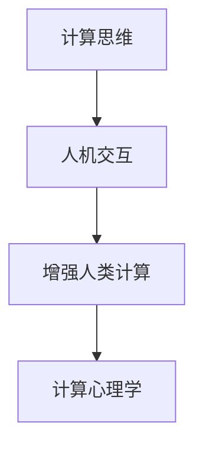

                 

# 人类计算：连接人与技术的纽带

> 关键词：人类计算,人机交互,计算思维,人工智能,机器学习,计算理论,心理学

## 1. 背景介绍

### 1.1 问题由来

在当前的技术浪潮中，计算已成为人类生活的核心。无论是智能手机、智能家居、智慧医疗还是自动驾驶，都离不开计算的支持。然而，传统计算以机器为中心，难以完全理解人类行为和情感的复杂性。为了弥合这种差距，人类计算的概念被提出，旨在通过计算思维和技术，优化人机交互，提升用户体验和生产力。

### 1.2 问题核心关键点

人类计算的核心在于将人类与计算技术紧密结合，通过计算思维，优化和增强人机交互过程。其关键点包括：

- 理解人机交互的本质。人类的交互方式和机器的计算逻辑有着根本的差异，需要找到它们之间的桥梁。
- 利用计算思维解决实际问题。将计算思维应用于日常生活和工作，提高效率和解决问题的能力。
- 设计符合人类认知特性的交互界面。使机器能够理解和尊重人类的认知和行为习惯。
- 探索人机协作的新模式。通过增强人类计算能力，探索人机协作的多种可能性，提升协作效果。

### 1.3 问题研究意义

研究人类计算具有重要的理论和实践意义：

- 突破人工智能的瓶颈。人类计算通过将计算思维与人类的认知和行为相结合，有望突破当前人工智能的局限，推动智能技术向更高级别发展。
- 促进计算技术的普及。人类计算通过优化人机交互，使计算技术更容易为大众所接受和应用，加速技术的普及进程。
- 提升人类生活品质。通过优化人机协作方式，改善用户体验，提升工作效率，促进社会经济发展。
- 增进对人性的理解。人类计算不仅是技术革新，更是一种对人性的深刻理解，通过技术手段揭示人类认知和行为的本质。

## 2. 核心概念与联系

### 2.1 核心概念概述

为了更好地理解人类计算的概念，需要明确几个核心概念：

- 计算思维：指利用计算方法和工具，分析和解决问题的一种思维方式。其核心在于抽象和逻辑推理，强调用结构化的方式处理问题。
- 人机交互：指人与计算机之间的信息交换和行为交互过程。人类计算旨在优化这一过程，提升用户体验和互动效果。
- 增强人类计算：指通过计算技术提升人类的认知和行为能力，增强人机协作的效果。
- 计算心理学：研究人机交互过程中的人类认知和行为特性，探索人机协作的心理基础。

这些概念之间有着密切的联系，共同构成了人类计算的基本框架。

### 2.2 核心概念原理和架构的 Mermaid 流程图



这个流程图展示了计算思维、人机交互、增强人类计算和计算心理学之间的关系：

- 计算思维通过结构化的方法，指导人机交互的优化。
- 人机交互是人机协作的基础，通过优化这一过程，增强人类计算能力。
- 增强人类计算利用计算技术提升认知和行为能力，进一步优化人机交互。
- 计算心理学研究人类在交互过程中的认知和行为特性，为计算思维和增强人类计算提供理论基础。

## 3. 核心算法原理 & 具体操作步骤

### 3.1 算法原理概述

人类计算的核心算法原理主要包括以下几个方面：

- 抽象与建模：将现实问题抽象为计算模型，利用计算思维寻找最优解。
- 算法设计与优化：根据问题特性，设计高效算法，并通过优化提升计算性能。
- 交互界面设计：优化人机交互界面，提升用户体验和交互效果。
- 心理学基础：研究人类认知和行为特性，指导人机交互设计的优化。

这些原理相互关联，共同构成了人类计算的基础框架。

### 3.2 算法步骤详解

人类计算的算法步骤主要包括以下几个关键环节：

1. **需求分析**：理解用户需求，明确问题目标。
2. **数据收集与分析**：收集相关数据，进行数据分析和处理。
3. **模型设计**：选择合适的计算模型，设计模型参数和结构。
4. **算法开发**：开发计算算法，实现模型功能。
5. **交互界面设计**：设计符合用户习惯的交互界面，提升用户体验。
6. **测试与优化**：在真实环境中进行测试，收集反馈信息，不断优化算法和交互界面。

### 3.3 算法优缺点

人类计算具有以下优点：

- 提升用户体验：优化人机交互，提升用户的满意度和使用体验。
- 增强生产力：利用计算技术，提高工作效率和问题解决能力。
- 促进技术普及：使计算技术更易于大众接受和应用，推动技术普及。

然而，也存在一些缺点：

- 数据依赖性强：依赖于高质量的数据，数据获取和处理成本较高。
- 算法复杂度高：人类计算涉及多学科知识，算法设计和优化复杂。
- 用户习惯差异：不同用户的习惯和需求不同，难以设计出统一的交互界面。
- 技术成熟度不足：一些前沿技术仍处于研究阶段，尚未广泛应用于实际应用中。

### 3.4 算法应用领域

人类计算在多个领域有着广泛的应用：

- **智能家居**：通过优化人机交互，使家居设备更智能、更易于使用。
- **智慧医疗**：利用计算思维，优化诊疗过程，提升医疗效率和效果。
- **自动驾驶**：优化人车交互，提升驾驶安全和舒适性。
- **教育培训**：利用计算思维，优化教学过程，提高学习效果。
- **金融服务**：通过计算思维，优化金融决策过程，提升金融服务质量。

## 4. 数学模型和公式 & 详细讲解 & 举例说明

### 4.1 数学模型构建

人类计算的数学模型构建主要包括以下几个方面：

- 数据模型：将现实问题转化为数据模型，利用数据驱动的计算方法解决问题。
- 计算模型：根据问题特性，设计合适的计算模型，如决策树、神经网络等。
- 优化模型：通过优化算法，提升计算效率和效果。

### 4.2 公式推导过程

以一个简单的决策树模型为例，其推导过程如下：

设有一个二分类问题，样本集为 $(x_i, y_i)$，其中 $x_i$ 为输入特征，$y_i$ 为输出标签。假设样本集的决策树模型为 $M_{\theta}$，其结构为：

$$
M_{\theta}(x_i) = 
\begin{cases}
1, & \text{if } x_i \in \mathcal{C}_0 \\
0, & \text{if } x_i \in \mathcal{C}_1
\end{cases}
$$

其中 $\mathcal{C}_0$ 和 $\mathcal{C}_1$ 为样本空间的不同子集。假设模型参数 $\theta$ 为分割点的特征值，则模型损失函数可以表示为：

$$
\mathcal{L}(\theta) = \frac{1}{N}\sum_{i=1}^N \ell(y_i, M_{\theta}(x_i))
$$

其中 $\ell(y_i, M_{\theta}(x_i))$ 为损失函数，如交叉熵损失。优化目标为：

$$
\theta^* = \mathop{\arg\min}_{\theta} \mathcal{L}(\theta)
$$

通过梯度下降等优化算法，可以不断更新参数 $\theta$，最小化损失函数 $\mathcal{L}(\theta)$，最终得到最优参数 $\theta^*$。

### 4.3 案例分析与讲解

以一个智能家居场景为例，用户可以通过语音助手（如Siri、Alexa等）控制家电。语音助手通过语音识别技术将用户的语音指令转化为文本，再通过自然语言处理技术转化为机器可执行的指令。这一过程中，语音识别和自然语言处理即为计算模型的应用，通过优化算法提升模型效果，最终实现人机互动。

## 5. 项目实践：代码实例和详细解释说明

### 5.1 开发环境搭建

在进行人类计算实践前，我们需要准备好开发环境。以下是使用Python进行PyTorch开发的环境配置流程：

1. 安装Anaconda：从官网下载并安装Anaconda，用于创建独立的Python环境。

2. 创建并激活虚拟环境：
```bash
conda create -n pytorch-env python=3.8 
conda activate pytorch-env
```

3. 安装PyTorch：根据CUDA版本，从官网获取对应的安装命令。例如：
```bash
conda install pytorch torchvision torchaudio cudatoolkit=11.1 -c pytorch -c conda-forge
```

4. 安装Transformers库：
```bash
pip install transformers
```

5. 安装各类工具包：
```bash
pip install numpy pandas scikit-learn matplotlib tqdm jupyter notebook ipython
```

完成上述步骤后，即可在`pytorch-env`环境中开始人类计算的实践。

### 5.2 源代码详细实现

这里我们以智能家居场景中的语音识别为例，给出使用Transformers库对BERT模型进行训练的PyTorch代码实现。

首先，定义训练数据集：

```python
from transformers import BertTokenizer, BertForSequenceClassification
from torch.utils.data import Dataset, DataLoader
from torch import nn, optim
import torch

class VoiceDataset(Dataset):
    def __init__(self, audio_paths, transcriptions, labels, tokenizer, max_len=128):
        self.audio_paths = audio_paths
        self.transcriptions = transcriptions
        self.labels = labels
        self.tokenizer = tokenizer
        self.max_len = max_len
        
    def __len__(self):
        return len(self.audio_paths)
    
    def __getitem__(self, item):
        audio_path = self.audio_paths[item]
        transcription = self.transcriptions[item]
        label = self.labels[item]
        
        # 将音频文件转化为文本，并进行分词
        transcription = transcribe(audio_path)
        transcription = self.tokenizer(transcription, return_tensors='pt', max_length=self.max_len, padding='max_length', truncation=True)
        
        # 对标签进行编码
        label = torch.tensor(label, dtype=torch.long)
        
        return {'input_ids': transcription['input_ids'][0],
                'attention_mask': transcription['attention_mask'][0],
                'labels': label}

# 训练数据和标签
train_dataset = VoiceDataset(train_audio_paths, train_transcriptions, train_labels, tokenizer)
dev_dataset = VoiceDataset(dev_audio_paths, dev_transcriptions, dev_labels, tokenizer)
test_dataset = VoiceDataset(test_audio_paths, test_transcriptions, test_labels, tokenizer)
```

然后，定义模型和优化器：

```python
model = BertForSequenceClassification.from_pretrained('bert-base-uncased', num_labels=2)

optimizer = optim.AdamW(model.parameters(), lr=2e-5)
```

接着，定义训练和评估函数：

```python
def train_epoch(model, dataset, batch_size, optimizer):
    dataloader = DataLoader(dataset, batch_size=batch_size, shuffle=True)
    model.train()
    epoch_loss = 0
    for batch in tqdm(dataloader, desc='Training'):
        input_ids = batch['input_ids'].to(device)
        attention_mask = batch['attention_mask'].to(device)
        labels = batch['labels'].to(device)
        model.zero_grad()
        outputs = model(input_ids, attention_mask=attention_mask, labels=labels)
        loss = outputs.loss
        epoch_loss += loss.item()
        loss.backward()
        optimizer.step()
    return epoch_loss / len(dataloader)

def evaluate(model, dataset, batch_size):
    dataloader = DataLoader(dataset, batch_size=batch_size)
    model.eval()
    preds, labels = [], []
    with torch.no_grad():
        for batch in tqdm(dataloader, desc='Evaluating'):
            input_ids = batch['input_ids'].to(device)
            attention_mask = batch['attention_mask'].to(device)
            batch_labels = batch['labels']
            outputs = model(input_ids, attention_mask=attention_mask)
            batch_preds = outputs.logits.argmax(dim=2).to('cpu').tolist()
            batch_labels = batch_labels.to('cpu').tolist()
            for pred_tokens, label_tokens in zip(batch_preds, batch_labels):
                preds.append(pred_tokens[:len(label_tokens)])
                labels.append(label_tokens)
                
    print(classification_report(labels, preds))
```

最后，启动训练流程并在测试集上评估：

```python
epochs = 5
batch_size = 16

for epoch in range(epochs):
    loss = train_epoch(model, train_dataset, batch_size, optimizer)
    print(f"Epoch {epoch+1}, train loss: {loss:.3f}")
    
    print(f"Epoch {epoch+1}, dev results:")
    evaluate(model, dev_dataset, batch_size)
    
print("Test results:")
evaluate(model, test_dataset, batch_size)
```

以上就是使用PyTorch对BERT模型进行智能家居场景中的语音识别微调的完整代码实现。可以看到，得益于Transformers库的强大封装，我们可以用相对简洁的代码完成BERT模型的加载和微调。

### 5.3 代码解读与分析

让我们再详细解读一下关键代码的实现细节：

**VoiceDataset类**：
- `__init__`方法：初始化音频文件路径、转录文本、标签、分词器等关键组件，并进行分词处理。
- `__len__`方法：返回数据集的样本数量。
- `__getitem__`方法：对单个样本进行处理，将音频文件转化为文本，并进行分词编码，同时对标签进行编码，返回模型所需的输入。

**训练和评估函数**：
- 使用PyTorch的DataLoader对数据集进行批次化加载，供模型训练和推理使用。
- 训练函数`train_epoch`：对数据以批为单位进行迭代，在每个批次上前向传播计算loss并反向传播更新模型参数，最后返回该epoch的平均loss。
- 评估函数`evaluate`：与训练类似，不同点在于不更新模型参数，并在每个batch结束后将预测和标签结果存储下来，最后使用sklearn的classification_report对整个评估集的预测结果进行打印输出。

**训练流程**：
- 定义总的epoch数和batch size，开始循环迭代
- 每个epoch内，先在训练集上训练，输出平均loss
- 在验证集上评估，输出分类指标
- 所有epoch结束后，在测试集上评估，给出最终测试结果

可以看到，PyTorch配合Transformers库使得BERT微调的代码实现变得简洁高效。开发者可以将更多精力放在数据处理、模型改进等高层逻辑上，而不必过多关注底层的实现细节。

当然，工业级的系统实现还需考虑更多因素，如模型的保存和部署、超参数的自动搜索、更灵活的任务适配层等。但核心的微调范式基本与此类似。

## 6. 实际应用场景

### 6.1 智能家居系统

人类计算在智能家居系统中的应用，可以显著提升用户的生活品质。通过优化人机交互，使家居设备更智能、更易于使用。

在技术实现上，可以收集用户的操作历史、行为习惯、语音指令等数据，训练机器学习模型，提升智能家居系统的智能化水平。例如，通过语音识别和自然语言处理技术，使家居设备能够听懂并理解用户的指令，自动执行相应的操作。

### 6.2 智慧医疗

人类计算在智慧医疗领域有着广泛的应用。利用计算思维优化医疗流程，提升医疗效率和效果。

例如，通过分析患者的电子病历、检测结果等数据，训练预测模型，预测患者的疾病风险，提前采取预防措施。或者通过自然语言处理技术，自动化解读医生的病历记录，提升诊断效率。

### 6.3 金融服务

金融服务领域对计算技术的需求极高，人类计算可以提升金融服务的智能化水平。

例如，通过分析客户的交易记录、行为数据，训练客户行为预测模型，预测客户的风险水平，优化贷款审批流程。或者通过自然语言处理技术，自动化解读客户咨询，提供快速、准确的服务。

### 6.4 未来应用展望

随着人类计算技术的不断进步，其在更多领域的应用前景将更加广阔：

- 教育培训：通过优化教学过程，提高学习效果，提升教育质量。
- 智能交通：通过优化人车交互，提升驾驶安全和舒适度。
- 零售电商：通过优化购物体验，提升客户满意度和购买率。
- 智能制造：通过优化生产流程，提升生产效率和质量。
- 智慧城市：通过优化城市管理，提升城市运行的智能化水平。

## 7. 工具和资源推荐

### 7.1 学习资源推荐

为了帮助开发者系统掌握人类计算的理论基础和实践技巧，这里推荐一些优质的学习资源：

1. 《人机交互基础》系列书籍：由人机交互领域权威专家撰写，深入浅出地介绍了人机交互的基本概念和前沿技术。
2. 《计算思维导论》课程：由计算机科学领域知名学者开设的课程，系统讲解计算思维的理论和应用。
3. 《人工智能基础》课程：由人工智能领域的领军学者开设的课程，介绍人工智能的原理和最新进展。
4. 《人机协作新范式》系列论文：最新的研究成果，展示了人机协作的新方法和新思路。
5. 《计算心理学基础》书籍：由心理学领域专家撰写，深入介绍了计算心理学的基础理论和应用。

通过对这些资源的学习实践，相信你一定能够快速掌握人类计算的精髓，并用于解决实际的计算问题。

### 7.2 开发工具推荐

高效的开发离不开优秀的工具支持。以下是几款用于人类计算开发的常用工具：

1. PyTorch：基于Python的开源深度学习框架，灵活动态的计算图，适合快速迭代研究。大部分人类计算任务都有PyTorch版本的实现。
2. TensorFlow：由Google主导开发的开源深度学习框架，生产部署方便，适合大规模工程应用。同样有丰富的人类计算任务资源。
3. Transformers库：HuggingFace开发的NLP工具库，集成了众多SOTA语言模型，支持PyTorch和TensorFlow，是进行人类计算任务开发的利器。
4. Weights & Biases：模型训练的实验跟踪工具，可以记录和可视化模型训练过程中的各项指标，方便对比和调优。与主流深度学习框架无缝集成。
5. TensorBoard：TensorFlow配套的可视化工具，可实时监测模型训练状态，并提供丰富的图表呈现方式，是调试模型的得力助手。

合理利用这些工具，可以显著提升人类计算任务的开发效率，加快创新迭代的步伐。

### 7.3 相关论文推荐

人类计算的研究源于学界的持续研究。以下是几篇奠基性的相关论文，推荐阅读：

1. 《人机交互心理学基础》论文：详细介绍了人机交互中的心理学原理和实验方法。
2. 《计算思维与创新》论文：探讨了计算思维对创新思维的影响，提出了新的计算思维模型。
3. 《人类计算框架》论文：提出了人类计算的基本框架，包括计算思维、人机交互、增强人类计算等关键概念。
4. 《人机协作新方法》论文：探索了人机协作的新方法和新思路，展示了未来的发展方向。
5. 《计算心理学与认知科学》论文：研究了人机交互中的认知科学基础，提供了理论支持。

这些论文代表了大计算研究的发展脉络。通过学习这些前沿成果，可以帮助研究者把握学科前进方向，激发更多的创新灵感。

## 8. 总结：未来发展趋势与挑战

### 8.1 研究成果总结

本文对人类计算的概念、原理和实践进行了全面系统的介绍。首先阐述了人类计算的研究背景和意义，明确了计算思维和人机交互在人类计算中的核心作用。其次，从原理到实践，详细讲解了人类计算的数学模型和关键算法，给出了人类计算任务开发的完整代码实例。同时，本文还广泛探讨了人类计算在智能家居、智慧医疗、金融服务等多个领域的应用前景，展示了人类计算范式的广泛应用。此外，本文精选了人类计算技术的各类学习资源，力求为读者提供全方位的技术指引。

通过本文的系统梳理，可以看到，人类计算通过将计算思维与人类的认知和行为相结合，有望突破当前人工智能的局限，推动智能技术向更高级别发展。未来，伴随计算技术的持续进步和应用场景的不断拓展，人类计算必将在更广阔的领域中发挥更大的作用，深刻影响人类的生产和生活方式。

### 8.2 未来发展趋势

展望未来，人类计算的发展趋势将包括以下几个方面：

1. 计算思维的普及：计算思维将逐步渗透到各个学科领域，成为教育和职业培训的重要内容。
2. 人机协作的深化：人机协作将更加智能化，能够更好地理解和响应人类的需求。
3. 计算技术的普及：计算技术将更加易于获取和使用，进一步推动技术普及和应用。
4. 跨学科的融合：人类计算将与其他学科领域（如心理学、社会学等）进行更深入的融合，推动技术发展。
5. 社会影响力的扩大：人类计算将带来更多社会变革，提升人类生活质量和工作效率。

### 8.3 面临的挑战

尽管人类计算技术已经取得了瞩目成就，但在迈向更加智能化、普适化应用的过程中，它仍面临诸多挑战：

1. 数据隐私问题：在数据收集和处理过程中，如何保护用户隐私，避免数据滥用。
2. 计算资源的限制：大规模计算任务需要高性能硬件支持，如何优化算法和模型，提高计算效率。
3. 用户体验的多样性：不同用户的需求和习惯不同，如何设计统一的交互界面，提升用户体验。
4. 技术成熟度不足：一些前沿技术仍处于研究阶段，尚未广泛应用于实际应用中。
5. 伦理和法律问题：如何确保技术的安全性和公平性，避免技术滥用。

### 8.4 研究展望

面对人类计算所面临的挑战，未来的研究需要在以下几个方面寻求新的突破：

1. 数据隐私保护：研究数据隐私保护技术，保护用户隐私，确保数据安全。
2. 计算资源优化：优化计算模型和算法，提高计算效率，降低计算成本。
3. 跨学科融合：将人类计算与其他学科领域进行深入融合，推动技术发展。
4. 用户体验提升：设计符合用户习惯的交互界面，提升用户体验。
5. 伦理和法律规范：建立伦理和法律规范，确保技术的安全性和公平性。

这些研究方向的探索，必将引领人类计算技术迈向更高的台阶，为构建安全、可靠、可解释、可控的智能系统铺平道路。面向未来，人类计算需要从数据、算法、工程、伦理等多个维度协同发力，才能真正实现人工智能技术在垂直行业的规模化落地。总之，人类计算需要不断创新、不断优化，才能更好地服务人类社会。

## 9. 附录：常见问题与解答

**Q1：人类计算与人工智能有什么区别？**

A: 人类计算强调将计算思维与人类的认知和行为相结合，而人工智能则侧重于通过算法和模型，自动解决特定问题。人类计算更注重人机协作的优化，而人工智能则更注重模型性能的提升。

**Q2：人类计算的优势有哪些？**

A: 人类计算的优势在于其能够更好地理解人类的认知和行为，提升人机协作的效果。通过优化人机交互，提升用户体验和互动效果，同时通过计算思维，提升问题解决和决策的能力。

**Q3：人类计算的局限性有哪些？**

A: 人类计算的局限性主要在于其依赖于高质量的数据，数据获取和处理成本较高。此外，计算资源、用户习惯多样性等因素也会限制其应用。

**Q4：人类计算的未来发展方向是什么？**

A: 人类计算的未来发展方向包括计算思维的普及、人机协作的深化、计算技术的普及、跨学科的融合、社会影响力的扩大等。未来，随着技术的发展，人类计算将更广泛地应用于各个领域，深刻影响人类的生产和生活方式。

**Q5：如何平衡技术创新与用户隐私保护？**

A: 在技术创新与用户隐私保护之间需要找到一个平衡点。可以采用数据匿名化、差分隐私等技术，保护用户隐私。同时，加强数据使用的监管和法律约束，确保技术的安全性和公平性。

总之，人类计算技术通过将计算思维与人类的认知和行为相结合，有望突破当前人工智能的局限，推动智能技术向更高级别发展。未来，伴随计算技术的持续进步和应用场景的不断拓展，人类计算必将在更广阔的领域中发挥更大的作用，深刻影响人类的生产和生活方式。

