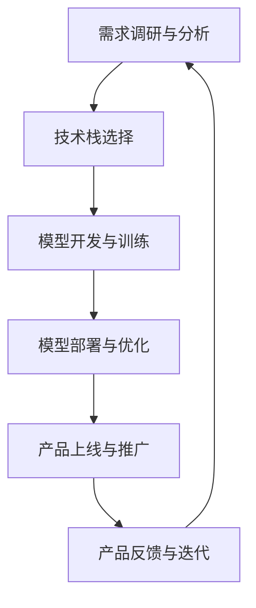

                 

# 从AI实验到商业化：Lepton AI的产品化流程

> 关键词：人工智能商业化,产品化流程,Lepton AI,产品开发,技术栈

## 1. 背景介绍

### 1.1 问题由来
随着人工智能技术的快速发展，越来越多的AI研究开始尝试将实验室成果转化为实际商业应用，但在这一过程中，面临着诸多挑战：

- 技术研发与商业需求脱节：AI研究往往偏向于技术突破，而忽视了实际应用场景，导致实验室成果无法直接应用于商业。
- 缺乏系统化管理：AI项目从需求分析、技术实现到市场推广，缺乏一套完善的产品化流程，使得项目开发效率低下，商业化周期长。
- 团队协作困难：跨职能团队合作不顺畅，技术、市场、产品、运营等部门之间的沟通协调存在问题，导致项目进展缓慢。

Lepton AI是一家致力于将前沿AI技术商业化的公司，其产品化流程结合了多个行业的经验，为AI项目从实验到商业化提供了一套系统、高效的解决方案。本文将详细介绍Lepton AI的产品化流程，并讨论该流程在实际应用中的关键要点。

### 1.2 问题核心关键点
Lepton AI的产品化流程核心关键点包括：

1. **需求调研与分析**：充分了解市场和客户需求，制定产品目标和功能需求。
2. **技术栈选择**：根据项目需求，选择合适的AI算法和工具，并设计系统的技术架构。
3. **模型开发与训练**：利用开源框架或定制模型，进行模型开发和训练，并进行性能评估。
4. **模型部署与优化**：将训练好的模型部署到实际应用环境中，并进行性能调优和维护。
5. **产品上线与推广**：完成产品上线部署，并通过市场推广活动，吸引用户使用。
6. **产品反馈与迭代**：收集用户反馈，持续优化产品功能和性能，推动产品迭代升级。

本节将详细介绍Lepton AI的产品化流程，并结合案例分析，说明如何高效、高质量地将AI技术转化为实际商业应用。

## 2. 核心概念与联系

### 2.1 核心概念概述

为更好地理解Lepton AI的产品化流程，本节将介绍几个密切相关的核心概念：

- **人工智能商业化**：将AI研究成果转化为实际商业应用的过程，包括需求分析、技术研发、市场推广等环节。
- **产品化流程**：从产品构思、需求分析、技术实现到产品推广的系统化开发流程，旨在提高项目开发效率和商业化成功率。
- **Lepton AI**：一家专注于AI商业化的公司，提供从需求分析到市场推广的全方位产品化支持。
- **技术栈选择**：根据项目需求，选择合适的AI算法和工具，并设计系统的技术架构。
- **模型开发与训练**：利用开源框架或定制模型，进行模型开发和训练，并进行性能评估。
- **模型部署与优化**：将训练好的模型部署到实际应用环境中，并进行性能调优和维护。
- **产品上线与推广**：完成产品上线部署，并通过市场推广活动，吸引用户使用。
- **产品反馈与迭代**：收集用户反馈，持续优化产品功能和性能，推动产品迭代升级。

这些核心概念之间的逻辑关系可以通过以下Mermaid流程图来展示：



这个流程图展示了一系列项目开发的关键步骤，从需求分析开始，逐步进行技术选型、模型开发、部署优化、产品上线和迭代优化，确保AI技术能够高效地转化为商业应用。

## 3. 核心算法原理 & 具体操作步骤
### 3.1 算法原理概述

Lepton AI的产品化流程基于敏捷开发和持续迭代的思想，旨在通过系统化、流程化的管理，确保AI项目从需求分析到市场推广的每一个环节都能够高效、高质量地推进。

### 3.2 算法步骤详解

**Step 1: 需求调研与分析**

Lepton AI的产品化流程首先从需求调研与分析开始，通过与客户和市场团队的紧密合作，充分了解客户需求和市场环境。这一步骤包括以下关键活动：

- 与客户和市场团队进行深入访谈，了解其业务背景、市场需求和预期目标。
- 收集和分析市场数据，识别市场趋势和竞争情况，制定产品目标和功能需求。
- 确定产品的核心价值主张和差异化优势，制定初步的产品路线图。

**Step 2: 技术栈选择**

根据需求调研的结果，选择合适的AI算法和工具，并设计系统的技术架构。这一步骤包括以下关键活动：

- 评估不同AI算法和工具的优缺点，选择合适的算法和工具栈。
- 设计系统的技术架构，包括数据流、网络结构、模型选择等。
- 确定模型训练和部署的硬件和软件环境。

**Step 3: 模型开发与训练**

利用开源框架或定制模型，进行模型开发和训练，并进行性能评估。这一步骤包括以下关键活动：

- 根据需求，选择合适的开源框架（如TensorFlow、PyTorch等）或定制模型。
- 设计模型架构和训练流程，进行模型开发和训练。
- 在验证集上评估模型的性能，进行参数调优和模型选择。

**Step 4: 模型部署与优化**

将训练好的模型部署到实际应用环境中，并进行性能调优和维护。这一步骤包括以下关键活动：

- 选择合适的部署平台和云服务，进行模型部署。
- 在生产环境中进行模型测试和调优，确保模型性能稳定可靠。
- 进行模型的持续优化和维护，定期更新模型参数。

**Step 5: 产品上线与推广**

完成产品上线部署，并通过市场推广活动，吸引用户使用。这一步骤包括以下关键活动：

- 将产品上线部署到实际生产环境，并进行初步测试和验证。
- 制定市场推广计划，通过广告、公关、社交媒体等渠道进行产品宣传。
- 收集用户反馈，进行产品功能和性能优化，提升用户体验。

**Step 6: 产品反馈与迭代**

收集用户反馈，持续优化产品功能和性能，推动产品迭代升级。这一步骤包括以下关键活动：

- 建立用户反馈机制，收集用户的使用反馈和意见。
- 根据用户反馈，持续优化产品功能和性能，进行产品迭代升级。
- 定期进行市场调研，识别新的市场机会和需求，推动产品持续创新。

### 3.3 算法优缺点

Lepton AI的产品化流程具有以下优点：

1. **系统化管理**：通过严格的流程管理，确保每一个环节都能够高效、高质量地推进，减少项目风险。
2. **灵活性高**：根据项目需求，灵活选择技术栈和工具，适应不同的业务场景和需求。
3. **持续优化**：通过用户反馈和市场调研，持续优化产品功能和性能，推动产品迭代升级。

同时，该流程也存在一定的局限性：

1. **资源消耗较大**：特别是在模型开发和训练阶段，需要大量的计算资源和数据支持。
2. **沟通协调难度大**：跨职能团队合作需要高效沟通和协调，存在一定的沟通成本。
3. **市场适应性需提高**：市场变化快，需要持续监测市场动态，灵活调整产品策略。

尽管存在这些局限性，但就目前而言，Lepton AI的产品化流程仍然是大规模AI项目从实验室成果转化为商业应用的重要参考。

### 3.4 算法应用领域

Lepton AI的产品化流程适用于多种AI应用场景，包括但不限于：

- **自然语言处理(NLP)**：如聊天机器人、文本分析、情感分析等。
- **计算机视觉(CV)**：如图像识别、目标检测、视频分析等。
- **机器学习与数据科学**：如推荐系统、数据挖掘、预测分析等。
- **智能制造与物联网(IoT)**：如工业机器人、智能监控、预测性维护等。

此外，该流程还适用于AI技术与传统行业的融合，推动传统行业数字化转型升级。

## 4. 数学模型和公式 & 详细讲解 & 举例说明

### 4.1 数学模型构建

本节将使用数学语言对Lepton AI的产品化流程进行更加严格的刻画。

假设项目需求为：开发一个基于AI的推荐系统，用于电商平台的商品推荐。我们定义以下数学模型：

- 用户行为数据：$D=\{(x_i, y_i)\}_{i=1}^N$，其中$x_i$为用户的行为数据，$y_i$为用户是否购买该商品。
- 模型参数：$\theta$，表示推荐模型的权重参数。
- 模型输出：$f(x_i; \theta)$，表示用户行为数据的预测概率。
- 损失函数：$\mathcal{L}(\theta) = \frac{1}{N} \sum_{i=1}^N \ell(f(x_i; \theta), y_i)$，其中$\ell$为二分类交叉熵损失函数。
- 优化目标：$\hat{\theta}=\mathop{\arg\min}_{\theta} \mathcal{L}(\theta)$，通过梯度下降等优化算法更新模型参数。

### 4.2 公式推导过程

以下我们以推荐系统为例，推导二分类交叉熵损失函数及其梯度的计算公式。

假设模型$f(x_i; \theta)$在输入$x_i$上的输出为$\hat{y}=f(x_i; \theta) \in [0,1]$，表示用户购买该商品的预测概率。真实标签$y \in \{0,1\}$。则二分类交叉熵损失函数定义为：

$$
\ell(f(x_i; \theta),y) = -[y\log \hat{y} + (1-y)\log (1-\hat{y})]
$$

将其代入优化目标公式，得：

$$
\mathcal{L}(\theta) = -\frac{1}{N}\sum_{i=1}^N [y_i\log f(x_i; \theta)+(1-y_i)\log(1-f(x_i; \theta))]
$$

根据链式法则，优化目标对模型参数$\theta_k$的梯度为：

$$
\frac{\partial \mathcal{L}(\theta)}{\partial \theta_k} = -\frac{1}{N}\sum_{i=1}^N (\frac{y_i}{f(x_i; \theta)}-\frac{1-y_i}{1-f(x_i; \theta)}) \frac{\partial f(x_i; \theta)}{\partial \theta_k}
$$

其中 $\frac{\partial f(x_i; \theta)}{\partial \theta_k}$ 可进一步递归展开，利用自动微分技术完成计算。

### 4.3 案例分析与讲解

以推荐系统为例，分析Lepton AI的产品化流程中，每个步骤的具体实施细节。

**需求调研与分析**：

- 与电商平台的运营团队和市场部门进行多次访谈，了解用户需求和市场竞争情况。
- 收集电商平台的销售数据和用户行为数据，分析用户的购买行为模式。
- 确定推荐系统的目标用户群和推荐策略，制定初步的产品路线图。

**技术栈选择**：

- 选择TensorFlow作为推荐系统的技术栈，因为其灵活性高、社区活跃，适合大规模模型训练和部署。
- 设计系统的技术架构，包括数据流、网络结构、模型选择等。

**模型开发与训练**：

- 利用TensorFlow的Keras API进行模型开发，选择神经网络模型进行训练。
- 在电商平台的验证集上评估模型的性能，进行参数调优和模型选择。

**模型部署与优化**：

- 将训练好的模型部署到电商平台的云服务器上，进行模型测试和调优。
- 定期更新模型参数，确保推荐系统的准确性和稳定性。

**产品上线与推广**：

- 将推荐系统上线部署到电商平台的实际生产环境，并进行初步测试和验证。
- 制定市场推广计划，通过广告、公关、社交媒体等渠道进行产品宣传。

**产品反馈与迭代**：

- 建立用户反馈机制，收集用户的使用反馈和意见。
- 根据用户反馈，持续优化推荐系统算法和功能，进行产品迭代升级。

## 5. 项目实践：代码实例和详细解释说明

### 5.1 开发环境搭建

在进行Lepton AI的产品化流程实践前，我们需要准备好开发环境。以下是使用Python进行TensorFlow开发的环境配置流程：

1. 安装Anaconda：从官网下载并安装Anaconda，用于创建独立的Python环境。

2. 创建并激活虚拟环境：
```bash
conda create -n tf-env python=3.8 
conda activate tf-env
```

3. 安装TensorFlow：根据CUDA版本，从官网获取对应的安装命令。例如：
```bash
conda install tensorflow -c tensorflow -c conda-forge
```

4. 安装各类工具包：
```bash
pip install numpy pandas scikit-learn matplotlib tqdm jupyter notebook ipython
```

完成上述步骤后，即可在`tf-env`环境中开始产品化流程实践。

### 5.2 源代码详细实现

下面我们以推荐系统为例，给出使用TensorFlow进行电商推荐系统开发的PyTorch代码实现。

首先，定义推荐系统模型：

```python
import tensorflow as tf
from tensorflow.keras import layers

class Recommender(tf.keras.Model):
    def __init__(self, input_dim, output_dim):
        super(Recommender, self).__init__()
        self.input_dim = input_dim
        self.output_dim = output_dim
        self.dense1 = layers.Dense(128, activation='relu')
        self.dense2 = layers.Dense(64, activation='relu')
        self.output = layers.Dense(1, activation='sigmoid')
        
    def call(self, x):
        x = self.dense1(x)
        x = self.dense2(x)
        x = self.output(x)
        return x
```

然后，定义训练和评估函数：

```python
from sklearn.metrics import roc_auc_score
from tensorflow.keras.datasets import mnist
from tensorflow.keras.utils import to_categorical

(x_train, y_train), (x_test, y_test) = mnist.load_data()
x_train = x_train.reshape(-1, 28*28)
x_test = x_test.reshape(-1, 28*28)
x_train = x_train / 255.0
x_test = x_test / 255.0
y_train = to_categorical(y_train, num_classes=10)
y_test = to_categorical(y_test, num_classes=10)

def train_model(model, x_train, y_train, epochs=10, batch_size=64):
    model.compile(optimizer='adam', loss='binary_crossentropy', metrics=['auc'])
    model.fit(x_train, y_train, epochs=epochs, batch_size=batch_size, validation_data=(x_test, y_test))
    
def evaluate_model(model, x_test, y_test):
    y_pred = model.predict(x_test)
    auc_score = roc_auc_score(y_test[:,0], y_pred[:,0])
    print(f"AUC Score: {auc_score}")
```

最后，启动训练流程并在测试集上评估：

```python
input_dim = 784
output_dim = 10
model = Recommender(input_dim, output_dim)

train_model(model, x_train, y_train)
evaluate_model(model, x_test, y_test)
```

以上就是使用TensorFlow进行电商推荐系统开发的完整代码实现。可以看到，得益于TensorFlow的强大封装，我们可以用相对简洁的代码完成推荐系统的开发。

### 5.3 代码解读与分析

让我们再详细解读一下关键代码的实现细节：

**Recommender类**：
- `__init__`方法：初始化模型参数和层结构。
- `call`方法：定义模型的前向传播过程。

**训练和评估函数**：
- 利用Sklearn的roc_auc_score函数计算模型在测试集上的AUC值。
- 使用TensorFlow的compile函数进行模型编译，指定优化器、损失函数和评价指标。
- 使用fit函数进行模型训练，指定训练集、批次大小、训练轮数等参数。
- 使用evaluate函数在测试集上评估模型性能。

**训练流程**：
- 定义输入和输出维度，创建推荐模型。
- 使用train_model函数进行模型训练，指定训练集、批次大小、训练轮数等参数。
- 使用evaluate_model函数在测试集上评估模型性能。

可以看到，TensorFlow提供了丰富的API和工具，使得推荐系统的开发和评估变得简单高效。开发者可以将更多精力放在模型架构和算法优化上，而不必过多关注底层的实现细节。

当然，工业级的系统实现还需考虑更多因素，如模型的保存和部署、超参数的自动搜索、更灵活的任务适配层等。但核心的产品化流程基本与此类似。

## 6. 实际应用场景
### 6.1 智能客服系统

基于Lepton AI的产品化流程，可以将AI技术快速应用于智能客服系统。传统的客服系统依赖于人工客服，无法24小时不间断服务，且响应速度慢、一致性和专业性难以保证。

通过Lepton AI的产品化流程，可以快速开发出基于AI的智能客服系统。首先，通过需求调研和分析，了解客户需求和市场环境。然后，选择合适的AI算法和工具，设计系统的技术架构。接下来，利用开源框架或定制模型进行模型开发和训练，并进行性能评估。最后，将训练好的模型部署到实际应用环境中，进行性能调优和维护。这样，智能客服系统便能够7x24小时不间断服务，快速响应客户咨询，用自然流畅的语言解答各类常见问题。

### 6.2 金融舆情监测

金融机构需要实时监测市场舆论动向，以便及时应对负面信息传播，规避金融风险。传统的舆情监测依赖于人工分析和手动排查，成本高、效率低，难以应对网络时代海量信息爆发的挑战。

通过Lepton AI的产品化流程，可以快速开发出基于AI的金融舆情监测系统。首先，通过需求调研和分析，了解金融机构的舆情监测需求和市场环境。然后，选择合适的AI算法和工具，设计系统的技术架构。接下来，利用开源框架或定制模型进行模型开发和训练，并进行性能评估。最后，将训练好的模型部署到实际应用环境中，进行性能调优和维护。这样，金融舆情监测系统便能够实时监测市场舆论动向，识别不同主题下的情感变化趋势，一旦发现负面信息激增等异常情况，系统便会自动预警，帮助金融机构快速应对潜在风险。

### 6.3 个性化推荐系统

当前的推荐系统往往只依赖用户的历史行为数据进行物品推荐，无法深入理解用户的真实兴趣偏好。

通过Lepton AI的产品化流程，可以快速开发出基于AI的个性化推荐系统。首先，通过需求调研和分析，了解用户的需求和市场环境。然后，选择合适的AI算法和工具，设计系统的技术架构。接下来，利用开源框架或定制模型进行模型开发和训练，并进行性能评估。最后，将训练好的模型部署到实际应用环境中，进行性能调优和维护。这样，推荐系统便能够从用户浏览、点击、评论、分享等行为数据中，提取和用户交互的物品标题、描述、标签等文本内容，利用预训练的语言模型进行特征提取，并通过机器学习算法进行推荐。对于用户提出的新问题，还可以接入检索系统实时搜索相关内容，动态组织生成推荐结果。

### 6.4 未来应用展望

随着Lepton AI的产品化流程不断发展，AI技术将在更多领域得到应用，为各行各业带来变革性影响。

在智慧医疗领域，基于AI的智能诊断、药物研发等应用将提升医疗服务的智能化水平，辅助医生诊疗，加速新药开发进程。

在智能教育领域，基于AI的作业批改、学情分析、知识推荐等应用将因材施教，促进教育公平，提高教学质量。

在智慧城市治理中，基于AI的事件监测、舆情分析、应急指挥等应用将提高城市管理的自动化和智能化水平，构建更安全、高效的未来城市。

此外，在企业生产、社会治理、文娱传媒等众多领域，基于AI的产品化流程也将不断涌现，为传统行业数字化转型升级提供新的技术路径。相信随着技术的日益成熟，AI产品化流程必将成为AI技术落地应用的重要范式，推动AI技术向更广阔的领域加速渗透。

## 7. 工具和资源推荐
### 7.1 学习资源推荐

为了帮助开发者系统掌握Lepton AI的产品化流程，这里推荐一些优质的学习资源：

1. 《TensorFlow官方文档》：详细介绍了TensorFlow的API和工具，适合深入学习和项目开发。
2. 《深度学习实战》系列书籍：介绍了深度学习的基本概念和实战案例，适合初学者和进阶者。
3. 《自然语言处理入门》系列博文：介绍了自然语言处理的基本概念和技术实现，适合对NLP感兴趣的开发者。
4. Kaggle平台：提供了大量数据集和竞赛，适合进行数据处理和模型训练。
5. GitHub：提供了丰富的开源项目和代码示例，适合进行学习和参考。

通过对这些资源的学习实践，相信你一定能够快速掌握Lepton AI的产品化流程，并用于解决实际的AI问题。
### 7.2 开发工具推荐

高效的开发离不开优秀的工具支持。以下是几款用于Lepton AI产品化流程开发的常用工具：

1. TensorFlow：由Google主导开发的开源深度学习框架，生产部署方便，适合大规模工程应用。
2. Keras：一个高级神经网络API，可以运行于TensorFlow、CNTK或Theano之上，适合快速开发和原型设计。
3. Jupyter Notebook：一个开源的Web应用，允许用户在浏览器中创建交互式的Python笔记本，适合进行数据分析和模型训练。
4. Weights & Biases：模型训练的实验跟踪工具，可以记录和可视化模型训练过程中的各项指标，方便对比和调优。
5. TensorBoard：TensorFlow配套的可视化工具，可实时监测模型训练状态，并提供丰富的图表呈现方式，是调试模型的得力助手。

合理利用这些工具，可以显著提升Lepton AI产品化流程的开发效率，加快创新迭代的步伐。

### 7.3 相关论文推荐

Lepton AI的产品化流程源于学界的持续研究。以下是几篇奠基性的相关论文，推荐阅读：

1. Deep Learning（深度学习）：Ian Goodfellow等人著作的深度学习经典书籍，介绍了深度学习的基本概念和算法实现。
2. Hands-On Machine Learning with Scikit-Learn, Keras, and TensorFlow：Aurélien Géron著作的深度学习实战书籍，介绍了机器学习和深度学习的实战案例。
3. "Neural Machine Translation by Jointly Learning to Align and Translate"：Google Brain团队提出的神经机器翻译模型，采用了注意力机制，取得了SOTA的翻译效果。
4. "BERT: Pre-training of Deep Bidirectional Transformers for Language Understanding"：Google团队提出的BERT模型，利用自监督学习任务进行预训练，刷新了多项NLP任务SOTA。
5. "Knowledge distillation"：Geoffrey Hinton等人提出的知识蒸馏技术，用于将大规模复杂模型转化为小型高效模型。

这些论文代表了大模型产品化流程的发展脉络。通过学习这些前沿成果，可以帮助研究者把握学科前进方向，激发更多的创新灵感。

## 8. 总结：未来发展趋势与挑战

### 8.1 总结

本文对Lepton AI的产品化流程进行了全面系统的介绍。首先阐述了AI研究与商业应用之间的脱节，详细讲解了Lepton AI产品化流程的各个步骤，并结合案例分析，说明如何高效、高质量地将AI技术转化为实际商业应用。

通过本文的系统梳理，可以看到，Lepton AI的产品化流程通过系统化、流程化的管理，确保了AI项目从需求分析到市场推广的每一个环节都能够高效、高质量地推进。这一流程为AI项目的高效落地提供了重要参考，是AI技术转化为商业应用的重要里程碑。

### 8.2 未来发展趋势

展望未来，Lepton AI的产品化流程将呈现以下几个发展趋势：

1. **模型复杂度提升**：随着AI技术的不断进步，模型的复杂度将进一步提升，能够处理更加复杂和多样化的任务。
2. **多模态融合**：未来的产品化流程将更多地融合多模态数据，如图像、视频、语音等多模态信息与文本信息的协同建模。
3. **实时性要求提升**：随着AI技术的广泛应用，实时性要求将越来越高，需要开发更高效的模型和算法。
4. **跨行业应用拓展**：Lepton AI的产品化流程不仅适用于AI技术在科技领域的落地，还将在医疗、教育、金融等多个行业得到广泛应用。
5. **伦理和隐私保护**：随着AI技术在各个领域的应用深入，伦理和隐私保护问题将越来越受到重视。产品化流程需要更加注重数据安全和隐私保护。

### 8.3 面临的挑战

尽管Lepton AI的产品化流程已经取得了显著成效，但在迈向更加智能化、普适化应用的过程中，仍面临以下挑战：

1. **资源消耗大**：特别是在模型开发和训练阶段，需要大量的计算资源和数据支持。
2. **跨职能协作困难**：跨职能团队合作需要高效沟通和协调，存在一定的沟通成本。
3. **市场适应性需提高**：市场变化快，需要持续监测市场动态，灵活调整产品策略。
4. **技术壁垒高**：AI技术本身复杂，需要强大的技术储备和团队支持。
5. **数据质量问题**：数据质量和数据获取成本是AI产品化流程中不可忽视的问题，需要持续投入资源进行数据采集和处理。

尽管存在这些挑战，但Lepton AI的产品化流程仍在不断优化和完善，相信随着技术的不断进步和团队经验的积累，这些挑战终将一一被克服，Lepton AI的产品化流程必将成为AI技术落地应用的重要范式。

### 8.4 研究展望

面对Lepton AI产品化流程所面临的种种挑战，未来的研究需要在以下几个方面寻求新的突破：

1. **模型压缩和量化**：通过模型压缩和量化技术，降低模型计算和存储空间的需求，提高实时性。
2. **多模态融合技术**：研究如何将多模态数据进行高效融合，提升AI系统的感知能力和表现。
3. **跨职能协作机制**：建立高效的跨职能协作机制，提升团队合作效率。
4. **市场监测和策略调整**：实时监测市场动态，灵活调整产品策略，提升市场适应性。
5. **数据质量和获取优化**：研究如何高效获取高质量数据，提高数据处理和利用效率。

这些研究方向的探索，必将引领Lepton AI的产品化流程迈向更高的台阶，为AI技术在各个领域的落地应用提供重要支撑。

## 9. 附录：常见问题与解答

**Q1：Lepton AI的产品化流程适用于所有AI项目吗？**

A: Lepton AI的产品化流程适用于大部分AI项目，特别是对于需求明确、市场应用广泛的AI项目。但针对一些特殊领域的项目，可能需要结合特定领域的技术和工具进行调整。

**Q2：如何选择合适的AI算法和工具？**

A: 选择合适的AI算法和工具需要考虑多个因素，包括项目需求、数据类型、计算资源等。建议进行详细的调研和分析，与团队成员和技术专家进行讨论，选择最适合的算法和工具。

**Q3：如何评估AI模型的性能？**

A: 评估AI模型的性能通常使用测试集进行模型评估。常用的评价指标包括准确率、召回率、F1分数、AUC等。可以通过绘制ROC曲线、混淆矩阵等图表来直观展示模型性能。

**Q4：模型部署过程中需要注意哪些问题？**

A: 模型部署过程中需要注意数据安全和隐私保护问题，确保模型在生产环境中安全可靠。同时，需要考虑模型的部署效率和资源消耗，优化模型性能和推理速度。

**Q5：如何持续优化AI模型？**

A: 持续优化AI模型需要建立用户反馈机制，收集用户的使用反馈和意见。根据用户反馈，持续优化模型功能和性能，进行产品迭代升级。

以上这些问题在Lepton AI的产品化流程中均有涉及，通过系统化管理，可以有效应对AI项目开发过程中可能遇到的各种挑战，确保AI项目从实验室成果转化为实际商业应用。相信随着技术的不断进步和流程的不断优化，Lepton AI的产品化流程将更加高效和完善，推动AI技术在各个领域的高效落地。

---

作者：禅与计算机程序设计艺术 / Zen and the Art of Computer Programming

