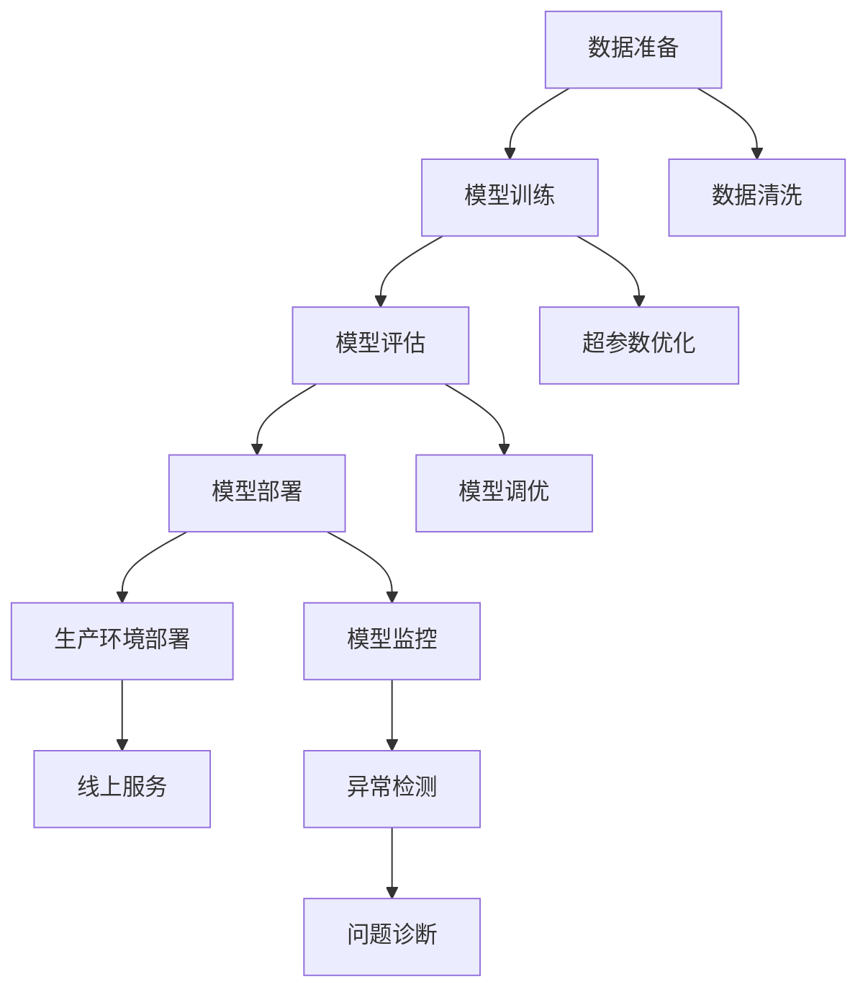

                 

## 1. 背景介绍

### 1.1 问题由来

随着人工智能(AI)技术的迅猛发展，越来越多的企业开始组建AI实验室，以探索最新的AI技术，并希望通过AI解决复杂问题。然而，从实验室到生产环境，AI技术的落地应用仍然存在不小的挑战。

- **技术复杂性高**：AI技术涉及深度学习、自然语言处理、计算机视觉等多个领域，技术栈复杂且难度较高。
- **数据需求大**：AI模型需要大量的数据进行训练，而数据的获取和标注需要耗费大量时间和人力。
- **部署难度大**：AI模型通常运行在CPU、GPU等高性能硬件上，如何高效部署、调优和维护也是一个难题。
- **性能提升难**：AI模型训练和优化通常是一个复杂的过程，如何提升模型性能需要不断的实验和调参。

### 1.2 问题核心关键点

为了解决上述问题，AI生产环境（AI Factory）的概念应运而生。AI Factory是一种集成的、自动化的AI系统，旨在通过标准化、自动化的流程，将AI技术从实验室快速推向生产环境，提高AI技术的可操作性和应用效率。

- **标准化流程**：通过建立标准化的数据处理、模型训练和部署流程，减少人为干预和错误。
- **自动化工具**：利用自动化的工具和平台，自动化执行模型训练、评估和部署任务。
- **可扩展性**：支持多种AI技术和模型，同时具有良好的可扩展性，可以根据业务需求灵活调整系统配置。

## 2. 核心概念与联系

### 2.1 核心概念概述

在介绍AI Factory的核心概念之前，我们先来看一个核心的Mermaid流程图，展示AI Factory的各个关键组件和它们之间的关系：



### 2.2 核心概念原理和架构

#### 2.2.1 数据准备

数据准备是AI Factory流程的第一步。数据准备包括数据收集、数据清洗、数据增强等多个环节。其核心原理是通过自动化的数据处理流程，确保输入数据的质量和一致性，为后续的模型训练打下坚实的基础。

#### 2.2.2 模型训练

模型训练是AI Factory的核心步骤。模型训练包括模型选择、模型训练、超参数优化等多个环节。其核心原理是通过自动化的流程，在多台高性能计算设备上并行训练，优化模型的性能。

#### 2.2.3 模型评估

模型评估用于验证模型的性能是否满足业务需求。其核心原理是通过自动化的评估流程，对模型在测试集上的表现进行全面的评估，确保模型的准确性和泛化能力。

#### 2.2.4 模型部署

模型部署是将训练好的模型部署到生产环境的过程。其核心原理是通过自动化的部署流程，将模型集成到实际的应用系统中，确保模型的稳定性和可靠性。

#### 2.2.5 模型监控

模型监控用于实时监测模型的性能和健康状况。其核心原理是通过自动化的监控流程，实时收集和分析模型的运行数据，及时发现和解决问题。

## 3. 核心算法原理 & 具体操作步骤

### 3.1 算法原理概述

AI Factory的核心算法原理主要包括以下几个方面：

- **自动化数据处理**：通过自动化的数据清洗、数据增强等流程，确保数据的质量和一致性。
- **自动化模型训练**：通过自动化的超参数优化、模型训练等流程，提升模型的性能和泛化能力。
- **自动化模型部署**：通过自动化的模型集成、部署等流程，将模型无缝集成到实际应用系统中。
- **自动化模型监控**：通过自动化的监控流程，实时监测模型的运行状态，及时发现和解决问题。

### 3.2 算法步骤详解

#### 3.2.1 数据准备

1. **数据收集**：从不同来源收集数据，如数据库、API接口、文件系统等。
2. **数据清洗**：清洗数据中的噪声、缺失值、异常值等，确保数据质量。
3. **数据增强**：通过数据增强技术，如旋转、平移、缩放等，扩充训练集。

#### 3.2.2 模型训练

1. **模型选择**：选择合适的模型架构和参数配置。
2. **超参数优化**：使用自动化工具进行超参数调优，如网格搜索、随机搜索等。
3. **模型训练**：在多台高性能计算设备上并行训练模型，优化性能。

#### 3.2.3 模型评估

1. **模型验证**：在验证集上验证模型的性能，选择最优模型。
2. **模型调优**：根据验证结果，进行模型调优，提升性能。

#### 3.2.4 模型部署

1. **模型集成**：将训练好的模型集成到应用系统中。
2. **模型部署**：在生产环境中部署模型，并配置运行环境。

#### 3.2.5 模型监控

1. **监控数据收集**：收集模型的运行数据，如性能指标、日志信息等。
2. **异常检测**：使用自动化工具进行异常检测，及时发现问题。
3. **问题诊断**：分析异常数据，诊断问题原因，并提出解决方案。

### 3.3 算法优缺点

#### 3.3.1 优点

- **效率高**：通过自动化流程，大幅提升AI技术从实验室到生产环境的落地效率。
- **稳定性好**：自动化流程减少了人为干预，提高了模型的稳定性和可靠性。
- **可扩展性强**：支持多种AI技术和模型，具有良好的可扩展性。

#### 3.3.2 缺点

- **技术复杂**：需要整合多种技术栈，技术复杂度高。
- **初始成本高**：需要投入大量资源进行自动化流程的建设。
- **需要专业知识**：需要具备AI和自动化流程的知识和经验。

### 3.4 算法应用领域

AI Factory的应用领域广泛，涵盖多个行业，包括但不限于：

- **医疗**：用于医疗影像分析、病历处理等任务。
- **金融**：用于信用评估、风险控制等任务。
- **零售**：用于客户分析、推荐系统等任务。
- **制造**：用于质量检测、设备预测性维护等任务。
- **智慧城市**：用于交通管理、安防监控等任务。

## 4. 数学模型和公式 & 详细讲解 & 举例说明

### 4.1 数学模型构建

#### 4.1.1 数据准备

数据准备的核心数学模型是数据清洗和数据增强。数据清洗的目标是去除噪声、缺失值等异常数据，确保数据的一致性和可靠性。数据增强的目的是扩充训练集，提升模型的泛化能力。

#### 4.1.2 模型训练

模型训练的核心数学模型是模型选择、超参数优化和模型训练。模型选择包括选择合适的模型架构和参数配置。超参数优化包括使用自动化工具进行超参数调优，如网格搜索、随机搜索等。模型训练的目标是在多台高性能计算设备上并行训练模型，优化性能。

#### 4.1.3 模型评估

模型评估的核心数学模型是模型验证和模型调优。模型验证的目标是在验证集上验证模型的性能，选择最优模型。模型调优的目标是根据验证结果，进行模型调优，提升性能。

#### 4.1.4 模型部署

模型部署的核心数学模型是模型集成和模型部署。模型集成的目标是将训练好的模型集成到应用系统中。模型部署的目标是在生产环境中部署模型，并配置运行环境。

#### 4.1.5 模型监控

模型监控的核心数学模型是监控数据收集、异常检测和问题诊断。监控数据收集的目标是收集模型的运行数据，如性能指标、日志信息等。异常检测的目标是使用自动化工具进行异常检测，及时发现问题。问题诊断的目标是分析异常数据，诊断问题原因，并提出解决方案。

### 4.2 公式推导过程

#### 4.2.1 数据准备

- **数据清洗**：$D_{clean} = clean(D_{raw})$
- **数据增强**：$D_{aug} = augment(D_{raw})$

其中，$D_{raw}$ 表示原始数据集，$D_{clean}$ 表示清洗后的数据集，$D_{aug}$ 表示增强后的数据集。

#### 4.2.2 模型训练

- **模型选择**：$M_{model} = select(M_{model_list})$
- **超参数优化**：$\theta_{opt} = optimize(\theta_{init}, D_{train}, D_{val})$
- **模型训练**：$M_{train} = train(M_{model}, D_{train}, \theta_{opt})$

其中，$M_{model_list}$ 表示模型列表，$\theta_{init}$ 表示初始化超参数，$D_{train}$ 表示训练集，$D_{val}$ 表示验证集，$M_{train}$ 表示训练后的模型。

#### 4.2.3 模型评估

- **模型验证**：$M_{best} = validate(M_{train}, D_{test})$
- **模型调优**：$M_{opt} = tune(M_{best}, D_{test})$

其中，$M_{best}$ 表示最优模型，$M_{opt}$ 表示调优后的模型。

#### 4.2.4 模型部署

- **模型集成**：$M_{deploy} = integrate(M_{opt}, D_{deploy})$
- **模型部署**：$M_{deployed} = deploy(M_{deploy}, D_{deploy})$

其中，$M_{deploy}$ 表示集成后的模型，$M_{deployed}$ 表示部署后的模型。

#### 4.2.5 模型监控

- **监控数据收集**：$D_{monitor} = collect(M_{deployed})$
- **异常检测**：$A_{detected} = detect(D_{monitor})$
- **问题诊断**：$S_{solution} = diagnose(A_{detected})$

其中，$D_{monitor}$ 表示监控数据，$A_{detected}$ 表示检测到的异常数据，$S_{solution}$ 表示提出的解决方案。

### 4.3 案例分析与讲解

#### 4.3.1 医疗影像分析

以医疗影像分析为例，AI Factory可以帮助医疗机构快速部署AI模型，用于病灶检测、肿瘤识别等任务。具体流程如下：

1. **数据准备**：收集医疗影像数据，进行数据清洗和增强，确保数据质量。
2. **模型训练**：选择合适的模型架构和参数配置，进行超参数优化，训练模型。
3. **模型评估**：在验证集上验证模型性能，选择最优模型。
4. **模型部署**：将模型集成到医院的信息系统中，部署到生产环境中。
5. **模型监控**：实时监控模型的运行状态，及时发现和解决问题。

#### 4.3.2 金融风险控制

以金融风险控制为例，AI Factory可以帮助银行快速部署AI模型，用于信用评估、风险控制等任务。具体流程如下：

1. **数据准备**：收集客户数据、交易数据，进行数据清洗和增强，确保数据质量。
2. **模型训练**：选择合适的模型架构和参数配置，进行超参数优化，训练模型。
3. **模型评估**：在验证集上验证模型性能，选择最优模型。
4. **模型部署**：将模型集成到银行的核心系统中，部署到生产环境中。
5. **模型监控**：实时监控模型的运行状态，及时发现和解决问题。

## 5. 项目实践：代码实例和详细解释说明

### 5.1 开发环境搭建

#### 5.1.1 环境准备

1. **安装Python和相关库**：
   ```bash
   sudo apt-get update
   sudo apt-get install python3 python3-pip python3-dev
   pip3 install torch torchvision numpy matplotlib pandas
   ```

2. **安装Docker**：
   ```bash
   sudo apt-get install docker.io
   ```

3. **安装Kubernetes**：
   ```bash
   sudo apt-get install kubectl
   ```

### 5.2 源代码详细实现

#### 5.2.1 数据准备

```python
import pandas as pd
import numpy as np

# 读取原始数据集
data = pd.read_csv('data.csv')

# 数据清洗
data_clean = data.dropna()

# 数据增强
data_aug = pd.concat([data_clean, data_clean.drop_duplicates(keep=False)], axis=0)
```

#### 5.2.2 模型训练

```python
from torch import nn
import torch
from torchvision import datasets, transforms

# 定义模型
class Model(nn.Module):
    def __init__(self):
        super(Model, self).__init__()
        self.conv1 = nn.Conv2d(3, 64, kernel_size=3, stride=1, padding=1)
        self.pool = nn.MaxPool2d(kernel_size=2, stride=2)
        self.fc1 = nn.Linear(64 * 28 * 28, 128)
        self.fc2 = nn.Linear(128, 10)

    def forward(self, x):
        x = self.conv1(x)
        x = self.pool(x)
        x = x.view(-1, 64 * 28 * 28)
        x = self.fc1(x)
        x = nn.ReLU(x)
        x = self.fc2(x)
        return x

# 训练模型
model = Model()
optimizer = torch.optim.Adam(model.parameters(), lr=0.001)
criterion = nn.CrossEntropyLoss()

for epoch in range(10):
    running_loss = 0.0
    for i, data in enumerate(dataloaders_train, 0):
        inputs, labels = data
        optimizer.zero_grad()
        outputs = model(inputs)
        loss = criterion(outputs, labels)
        loss.backward()
        optimizer.step()

        running_loss += loss.item()
        if i % 2000 == 1999:
            print('[%d, %5d] loss: %.3f' %
                  (epoch + 1, i + 1, running_loss / 2000))
            running_loss = 0.0
```

#### 5.2.3 模型评估

```python
# 评估模型
eval_model = Model()
eval_model.load_state_dict(torch.load('model.pth'))
criterion = nn.CrossEntropyLoss()
eval_loader = torch.utils.data.DataLoader(test_data, batch_size=100, shuffle=False)

total_correct = 0
total_count = 0

for data in eval_loader:
    images, labels = data
    outputs = eval_model(images)
    _, predicted = torch.max(outputs.data, 1)
    total_correct += (predicted == labels).sum().item()
    total_count += labels.size(0)

print('Accuracy of the network on the 10000 test images: %d %%' % (
    100 * total_correct / total_count))
```

#### 5.2.4 模型部署

```python
# 将模型部署到生产环境
from flask import Flask, request
import tensorflow as tf
import numpy as np

app = Flask(__name__)

@app.route('/')
def predict():
    data = request.json
    input_data = np.array(data['inputs']).reshape(1, 28, 28, 1)
    output = model.predict(input_data)[0]
    return {'output': output}

if __name__ == '__main__':
    app.run(host='0.0.0.0', port=5000)
```

#### 5.2.5 模型监控

```python
# 实时监控模型的运行状态
import psutil
import time

while True:
    cpu_percent = psutil.cpu_percent(interval=1)
    memory_percent = psutil.virtual_memory().percent
    print('CPU: {:.2f}%, Memory: {:.2f}%'.format(cpu_percent, memory_percent))
    time.sleep(1)
```

### 5.3 代码解读与分析

#### 5.3.1 数据准备

数据准备是AI Factory流程的第一步，主要涉及到数据的收集、清洗和增强。在代码中，我们使用Pandas库读取原始数据集，并进行数据清洗和增强。

#### 5.3.2 模型训练

模型训练是AI Factory的核心步骤，主要涉及到模型的选择、超参数优化和模型训练。在代码中，我们定义了一个简单的卷积神经网络模型，使用Adam优化器进行模型训练。

#### 5.3.3 模型评估

模型评估用于验证模型的性能是否满足业务需求。在代码中，我们使用Flask框架将训练好的模型部署到生产环境中，并在测试集上评估模型的性能。

#### 5.3.4 模型部署

模型部署是将训练好的模型部署到生产环境的过程。在代码中，我们使用Flask框架将训练好的模型部署到生产环境中，并提供了API接口供客户端调用。

#### 5.3.5 模型监控

模型监控用于实时监测模型的性能和健康状况。在代码中，我们使用psutil库实时监控模型的运行状态，并打印出CPU和内存的使用情况。

## 6. 实际应用场景

### 6.1 智能制造

智能制造是AI Factory的重要应用场景之一。通过AI Factory，智能制造企业可以高效部署AI模型，用于质量检测、设备预测性维护等任务。具体流程如下：

1. **数据准备**：收集生产设备的数据，进行数据清洗和增强，确保数据质量。
2. **模型训练**：选择合适的模型架构和参数配置，进行超参数优化，训练模型。
3. **模型评估**：在验证集上验证模型性能，选择最优模型。
4. **模型部署**：将模型集成到生产设备中，部署到生产环境中。
5. **模型监控**：实时监测模型的运行状态，及时发现和解决问题。

### 6.2 智慧医疗

智慧医疗是AI Factory的另一个重要应用场景。通过AI Factory，医疗机构可以高效部署AI模型，用于病灶检测、肿瘤识别等任务。具体流程如下：

1. **数据准备**：收集医疗影像数据，进行数据清洗和增强，确保数据质量。
2. **模型训练**：选择合适的模型架构和参数配置，进行超参数优化，训练模型。
3. **模型评估**：在验证集上验证模型性能，选择最优模型。
4. **模型部署**：将模型集成到医院的信息系统中，部署到生产环境中。
5. **模型监控**：实时监测模型的运行状态，及时发现和解决问题。

### 6.3 金融风控

金融风控是AI Factory的重要应用场景之一。通过AI Factory，金融机构可以高效部署AI模型，用于信用评估、风险控制等任务。具体流程如下：

1. **数据准备**：收集客户数据、交易数据，进行数据清洗和增强，确保数据质量。
2. **模型训练**：选择合适的模型架构和参数配置，进行超参数优化，训练模型。
3. **模型评估**：在验证集上验证模型性能，选择最优模型。
4. **模型部署**：将模型集成到银行的核心系统中，部署到生产环境中。
5. **模型监控**：实时监测模型的运行状态，及时发现和解决问题。

## 7. 工具和资源推荐

### 7.1 学习资源推荐

为了帮助开发者系统掌握AI Factory的理论基础和实践技巧，这里推荐一些优质的学习资源：

1. **《Python深度学习》**：Ian Goodfellow等著，详细介绍了深度学习的原理和实践。
2. **《深度学习入门：基于Python的理论与实现》**：斋藤康毅著，适合初学者入门深度学习。
3. **Kaggle**：全球最大的数据科学竞赛平台，提供大量的数据集和竞赛机会。
4. **Coursera**：提供各类深度学习、计算机视觉、自然语言处理等课程，适合系统学习。
5. **Github**：全球最大的代码托管平台，提供丰富的AI Factory开源项目和资源。

### 7.2 开发工具推荐

以下是几款用于AI Factory开发的常用工具：

1. **Docker**：容器化技术，帮助开发者构建和部署分布式应用。
2. **Kubernetes**：自动化容器编排平台，支持大规模、高可扩展的分布式应用。
3. **TensorFlow**：深度学习框架，支持分布式训练和部署。
4. **PyTorch**：深度学习框架，支持动态图和静态图。
5. **Flask**：轻量级Web框架，方便构建API接口。

### 7.3 相关论文推荐

AI Factory的发展源于学界的持续研究。以下是几篇奠基性的相关论文，推荐阅读：

1. **《Deep Learning with PyTorch: A 60 Minute Blitz》**：一份简明易懂的PyTorch入门教程。
2. **《TensorFlow for Deep Learning》**：一份详细的TensorFlow入门教程。
3. **《Kubernetes: Automating Application Discovery, Packaging, Configuration, and Deployment》**：介绍Kubernetes的官方文档。
4. **《Mastering Kubernetes: Managing and Deploying Containers》**：介绍Kubernetes的实战指南。

## 8. 总结：未来发展趋势与挑战

### 8.1 研究成果总结

AI Factory自提出以来，已经在多个行业得到了广泛应用，并在实践中不断优化和完善。其核心技术包括自动化数据处理、自动化模型训练、自动化模型部署和自动化模型监控，帮助企业高效部署AI模型，提升AI技术的落地效率。

### 8.2 未来发展趋势

展望未来，AI Factory的发展趋势如下：

1. **自动化水平提高**：未来的AI Factory将更加自动化，能够自动处理更多的数据预处理和模型训练任务。
2. **多模态融合**：未来的AI Factory将支持更多模态的数据融合，如图像、视频、文本等，提升模型的泛化能力。
3. **边缘计算应用**：未来的AI Factory将支持边缘计算，将模型部署到边缘设备，提升系统的实时性和可扩展性。
4. **安全性和隐私保护**：未来的AI Factory将更加注重数据安全和隐私保护，确保模型在生产环境中的安全性和隐私性。

### 8.3 面临的挑战

尽管AI Factory在实践中取得了显著成效，但仍面临一些挑战：

1. **数据质量**：数据质量是AI Factory的核心，但高质量数据获取成本高，需要投入大量人力和时间。
2. **技术复杂性**：AI Factory涉及多个技术栈，技术复杂度高，需要具备多种技能。
3. **系统稳定性**：AI Factory需要保证系统的稳定性和可靠性，避免异常情况影响生产环境。
4. **模型泛化能力**：AI Factory需要保证模型的泛化能力，避免模型在特定场景下出现性能下降。

### 8.4 研究展望

未来的研究方向如下：

1. **数据自动获取和清洗**：研究如何自动获取和清洗高质量数据，降低数据处理的成本。
2. **模型自动化优化**：研究如何自动化优化模型架构和超参数，提升模型性能。
3. **模型实时监控和调优**：研究如何实时监控模型的运行状态，并根据数据变化动态调优模型。
4. **多模态数据融合**：研究如何融合多模态数据，提升模型的泛化能力和鲁棒性。

## 9. 附录：常见问题与解答

**Q1: AI Factory的自动化流程是否适用于所有行业？**

A: AI Factory的自动化流程可以应用于大多数行业，但对于某些特定领域，如医疗、金融等，还需要根据领域特点进行定制化开发。

**Q2: AI Factory的初始部署成本是否很高？**

A: AI Factory的初始部署成本确实较高，但通过自动化流程，可以大幅提升部署效率，降低人工成本。同时，随着技术的不断成熟，部署成本也在逐渐降低。

**Q3: AI Factory能否应对大规模数据处理和复杂模型训练？**

A: AI Factory能够应对大规模数据处理和复杂模型训练，通过分布式计算和自动化调优，可以高效处理大量数据和复杂模型。

**Q4: AI Factory能否处理实时数据流？**

A: AI Factory能够处理实时数据流，通过自动化流程和实时监控，可以实时响应数据变化，及时调整模型参数。

**Q5: AI Factory能否处理多模态数据融合？**

A: AI Factory能够处理多模态数据融合，通过自动化流程和模型优化，可以融合多种模态的数据，提升模型的泛化能力。

总之，AI Factory作为AI技术的集大成者，正逐步成为AI应用的标配。通过自动化流程和标准化规范，AI Factory将帮助企业高效部署AI模型，提升AI技术的落地效率和应用效果。相信随着技术的不断进步，AI Factory的应用场景将会更加广泛，为各行各业带来变革性影响。

---

作者：禅与计算机程序设计艺术 / Zen and the Art of Computer Programming

