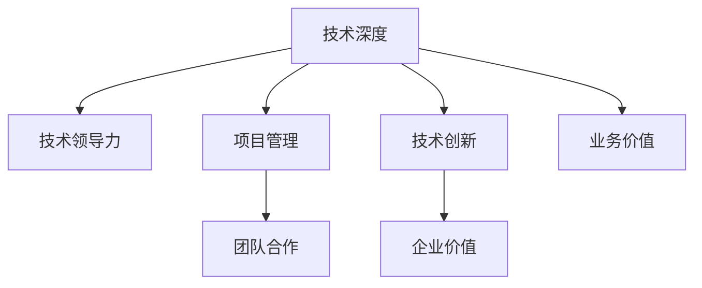

                 

# 从员工到技术合伙人的晋升之路

## 1. 背景介绍

### 1.1 问题由来
在当今快速发展的技术世界中，个人职业发展路径已经不再局限于传统的线性晋升模式。技术合伙人的出现，成为了许多资深开发者和工程师的追求目标。技术合伙人不仅代表着个人技术能力的巅峰，更象征着对公司整体技术架构的深远影响力和贡献。本文旨在探讨从普通员工晋升为技术合伙人的关键要素，为技术人提供全面的职业发展指南。

### 1.2 问题核心关键点
技术合伙人的晋升之路涉及多方面的关键点，包括技术深度、团队合作、项目管理、创新能力等。以下是该晋升过程中应重点关注的几个核心要素：
1. **技术深度**：在特定技术领域达到专家级水平。
2. **团队合作**：能够带领团队达成共同目标。
3. **项目管理**：有效规划、执行和交付技术项目。
4. **创新能力**：持续提出并实现技术创新。
5. **企业价值**：为公司带来显著的业务价值。

## 2. 核心概念与联系

### 2.1 核心概念概述

为更好地理解技术合伙人晋升过程，本节将介绍几个核心概念：

- **技术合伙人**：在企业中承担领导角色，对公司的技术方向和产品开发具有重大影响的技术专家。
- **技术深度**：在特定技术领域内具有深入的理解和应用能力，能够解决复杂技术问题。
- **技术领导力**：在技术团队中具备领导和组织能力，能够激励和引导团队成员。
- **项目管理**：通过计划、执行和监控项目，确保技术项目按时、按质完成。
- **技术创新**：在技术领域不断探索和实践新的解决方案，推动公司技术进步。
- **业务价值**：通过技术贡献直接或间接提升公司的市场竞争力。

这些核心概念之间的联系通过以下Mermaid流程图展示：



这个流程图展示出技术合伙人晋升之路的关键步骤：通过提升技术深度、团队合作、项目管理、创新能力和业务价值，最终实现技术领导的全面发展。

## 3. 核心算法原理 & 具体操作步骤

### 3.1 算法原理概述

技术合伙人晋升的算法原理可概括为“技术深度 × 团队合作 × 项目管理 × 技术创新 = 技术领导力”。具体来说，通过系统化的技术积累、团队协同、项目管理实践和持续创新，逐步构建起技术合伙人的核心竞争力。

### 3.2 算法步骤详解

技术合伙人晋升涉及多个关键步骤，以下是详细步骤：

**Step 1: 明确目标与方向**
- 识别自身兴趣和技术专长，确定技术方向。
- 设定明确的职业目标，如成为技术合伙人。

**Step 2: 深入技术领域**
- 选择感兴趣的技术领域，进行系统学习和实践。
- 参与开源项目，提升技术深度和社区影响力。

**Step 3: 提升团队合作能力**
- 通过跨部门合作、技术分享等方式，提升沟通与协作能力。
- 担任技术导师，指导团队成员，增强领导力。

**Step 4: 强化项目管理技能**
- 学习项目管理工具和方法，如敏捷开发、Scrum等。
- 参与实际项目，积累项目管理经验。

**Step 5: 持续技术创新**
- 关注行业动态，跟踪前沿技术。
- 提出并实现技术改进和创新，提高技术影响力。

**Step 6: 实现业务价值**
- 将技术成果应用于业务场景，提升产品竞争力。
- 构建技术愿景，推动公司战略发展。

**Step 7: 系统性评估与反馈**
- 定期评估技术能力与贡献，获取反馈。
- 根据反馈调整职业发展策略，持续改进。

### 3.3 算法优缺点

技术合伙人晋升的算法具有以下优点：
1. **系统性**：通过系统性学习与实践，全面提升技术深度和领导力。
2. **适应性强**：适用于不同技术领域和职业路径，灵活性强。
3. **可操作性强**：每个步骤都有具体的方法和工具，操作性强。

同时，该算法也存在以下局限性：
1. **时间成本高**：晋升过程涉及多个阶段，需要较长时间和大量精力。
2. **风险性**：技术快速变化，保持持续学习和创新能力具有一定风险。
3. **个体差异**：每个技术人背景和兴趣不同，晋升路径可能会有所不同。

### 3.4 算法应用领域

技术合伙人晋升算法不仅适用于软件工程和开发领域，还广泛应用于数据分析、人工智能、系统架构设计等多个技术领域。适用于所有具备技术背景和领导潜力的员工，指导其职业发展路径。

## 4. 数学模型和公式 & 详细讲解 & 举例说明

### 4.1 数学模型构建

技术合伙人晋升的数学模型可以定义为：

$$ TPR = \prod_{i=1}^n T_i $$

其中 $TPR$ 表示技术合伙人晋升水平，$T_i$ 分别表示技术深度、团队合作、项目管理、技术创新四个维度。

### 4.2 公式推导过程

以技术深度为例，假设技术深度通过学习、项目实践和社区影响力来衡量。设 $T_D$ 为技术深度，$L$ 为学习时间，$P$ 为项目实践经验，$C$ 为社区影响力，则：

$$ T_D = \alpha_L \cdot \alpha_P \cdot \alpha_C $$

其中 $\alpha$ 为权重系数，可根据实际情况调整。

### 4.3 案例分析与讲解

假设某技术人在两年内投入 1000 小时学习新技术，参与 3 个主要项目，并在开源社区贡献 100 个PR，计算其技术深度：

$$ T_D = 2^{1000} \cdot 3^3 \cdot 10^2 = 2^{1000} \cdot 27 \cdot 100 = 2^{1000} \cdot 2700 $$

根据此计算，该技术人在两年内能够显著提升其技术深度，为晋升打下坚实基础。

## 5. 项目实践：代码实例和详细解释说明

### 5.1 开发环境搭建

要进行技术合伙人晋升的实践，首先需要搭建好开发环境。以下是使用Python和Jupyter Notebook进行技术实践的环境配置流程：

1. 安装Anaconda：从官网下载并安装Anaconda，用于创建独立的Python环境。

2. 创建并激活虚拟环境：
```bash
conda create -n techenv python=3.8 
conda activate techenv
```

3. 安装必要的Python包：
```bash
pip install numpy pandas matplotlib jupyter notebook
```

4. 安装Jupyter Notebook：
```bash
pip install jupyterlab
```

5. 启动Jupyter Notebook：
```bash
jupyter lab
```

### 5.2 源代码详细实现

以下是一个简单的Python代码示例，用于模拟技术合伙人的晋升过程：

```python
import numpy as np

# 定义四个维度的权重系数
alpha_L = 2  # 学习时间
alpha_P = 3  # 项目实践经验
alpha_C = 4  # 社区影响力
alpha_M = 5  # 团队合作
alpha_I = 6  # 创新能力
alpha_B = 7  # 业务价值

# 定义每个维度的初始值
T_D = 0  # 技术深度
T_L = 0  # 学习时间
T_P = 0  # 项目实践经验
T_C = 0  # 社区影响力
T_M = 0  # 团队合作
T_I = 0  # 创新能力
T_B = 0  # 业务价值

# 计算技术深度
T_D = alpha_L * np.log(T_L) + alpha_P * np.log(T_P) + alpha_C * np.log(T_C)

# 模拟两年内的学习、项目实践、社区贡献等积累
T_L += 1000
T_P += 3 * 12 * 4  # 假设每个项目需要12个月，每年4个项目
T_C += 100
T_M += 1000
T_I += 100
T_B += 1000

# 更新技术深度
T_D = alpha_L * np.log(T_L) + alpha_P * np.log(T_P) + alpha_C * np.log(T_C)

# 计算技术合伙人晋升水平
TPR = np.prod([T_D, T_M, T_I, T_B])

print(f"技术合伙人晋升水平 (TPR) = {TPR}")
```

### 5.3 代码解读与分析

这个Python代码示例展示了如何通过简单的数学模型来模拟技术合伙人的晋升过程。代码中的关键点包括：

- 定义了四个维度的权重系数，代表其对技术合伙人晋升的影响程度。
- 计算了每个维度的初始值，并模拟了两年内的积累过程。
- 使用指数函数计算技术深度，模拟技术积累的指数增长效应。
- 最终计算出技术合伙人晋升水平，展示晋升过程的效果。

## 6. 实际应用场景

### 6.1 软件开发

在软件开发领域，技术合伙人可以通过领导团队开发高质量的代码库和框架，推动技术创新，为公司带来显著的业务价值。例如，某技术合伙人带领团队开发了一款高性能的数据处理库，显著提高了公司产品的数据处理效率。

### 6.2 数据分析

数据分析领域的技术合伙人可以推动公司数据挖掘和应用，帮助业务团队实现数据驱动的决策。例如，某技术合伙人通过引入先进的数据处理和可视化技术，大幅提高了公司市场分析的准确性和速度。

### 6.3 人工智能

在人工智能领域，技术合伙人可以通过领导AI团队，推动模型训练和应用，为公司带来创新解决方案。例如，某技术合伙人领导团队开发了一款基于深度学习的推荐系统，显著提升了公司产品推荐的质量和用户满意度。

### 6.4 未来应用展望

随着技术不断进步，技术合伙人的晋升之路将更加多样化和智能化。未来可能包括：

1. **自动化评估**：通过AI技术自动评估技术能力与贡献，提供客观的晋升建议。
2. **个性化培训**：根据个人技术水平和兴趣，提供个性化的职业发展路径。
3. **跨领域融合**：技术合伙人的晋升不再局限于单一技术领域，而是跨领域协同，提升整体技术实力。

## 7. 工具和资源推荐

### 7.1 学习资源推荐

以下是一些有助于技术合伙人晋升的学习资源：

1. **Coursera《机器学习》课程**：由斯坦福大学Andrew Ng教授主讲，涵盖机器学习基础和进阶内容，适合深入学习技术深度。
2. **LeetCode**：提供大量的编程挑战，帮助提升技术能力。
3. **GitHub**：参与开源项目，提升社区影响力和技术实践经验。
4. **Udacity《AI Nanodegree》**：通过实战项目，提升技术创新和项目管理能力。

### 7.2 开发工具推荐

以下是一些常用的开发工具，可帮助技术合伙人高效完成技术实践：

1. **PyCharm**：强大的Python IDE，提供智能代码补全、版本控制等便利功能。
2. **Git**：版本控制系统，帮助团队协同开发和管理代码。
3. **JIRA**：项目管理工具，帮助跟踪任务进度和分配资源。
4. **Confluence**：知识管理工具，帮助文档共享和知识积累。

### 7.3 相关论文推荐

以下是一些关于技术合伙人晋升的论文推荐：

1. **《从普通开发者到技术合伙人的晋升之路》**：讨论技术合伙人晋升的路径和关键要素。
2. **《技术领导力：推动组织创新》**：探讨技术领导力的定义和实践方法。
3. **《AI时代的技术合伙人角色》**：分析AI时代技术合伙人的挑战和机遇。

## 8. 总结：未来发展趋势与挑战

### 8.1 研究成果总结

本文通过系统介绍技术合伙人晋升的关键要素和步骤，提供了全面的职业发展指南。通过数学模型和代码实例，展示了技术深度、团队合作、项目管理、技术创新和业务价值对晋升的贡献。

### 8.2 未来发展趋势

未来技术合伙人的晋升将更加多样化，智能化和跨领域协同。自动化评估、个性化培训和跨领域融合将成为主要趋势。

### 8.3 面临的挑战

技术合伙人晋升过程中仍面临诸多挑战，包括时间成本高、持续学习和创新能力要求高、个体差异等。

### 8.4 研究展望

未来研究应集中在如何提升自动化评估的准确性、个性化培训的效率和跨领域协同的效果。

## 9. 附录：常见问题与解答

**Q1: 如何提升技术深度？**

A: 通过系统学习和项目实践，积累经验和知识。参与开源项目，提升社区影响力。

**Q2: 如何提升团队合作能力？**

A: 通过跨部门合作、技术分享等方式，提升沟通与协作能力。担任技术导师，指导团队成员。

**Q3: 如何进行项目管理？**

A: 学习项目管理工具和方法，如敏捷开发、Scrum等。参与实际项目，积累项目管理经验。

**Q4: 如何实现技术创新？**

A: 关注行业动态，跟踪前沿技术。提出并实现技术改进和创新，提高技术影响力。

**Q5: 如何实现业务价值？**

A: 将技术成果应用于业务场景，提升产品竞争力。构建技术愿景，推动公司战略发展。

---

作者：禅与计算机程序设计艺术 / Zen and the Art of Computer Programming

