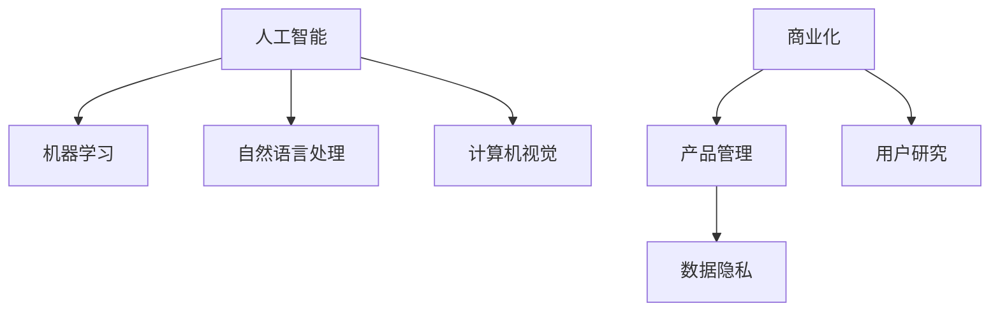

                 

# 从技术到产品：Lepton AI的商业化之路

## 1. 背景介绍

### 1.1 问题由来

Lepton AI是一家致力于人工智能领域的企业，成立于2020年。公司初创时，团队凭借在机器学习、自然语言处理和计算机视觉等前沿技术的深厚积累，迅速占领了NLP和CV领域的一席之地。然而，随着业务规模的不断扩大，Lepton AI面临的挑战也日益增多：如何更好地将技术优势转化为商业价值？如何实现从实验室到市场的高效转化？如何将产品快速、稳定地推向用户？这些问题成为Lepton AI发展的核心任务。

### 1.2 问题核心关键点

实现商业化转型的关键在于以下几个方面：

1. **产品设计**：如何定义产品的核心价值，满足用户的实际需求。
2. **市场推广**：如何精准定位目标市场，构建有效的销售渠道。
3. **用户体验**：如何优化用户界面，提高产品的易用性。
4. **业务流程**：如何构建高效的业务运营流程，降低成本，提升效率。
5. **数据隐私**：如何在保证用户隐私的前提下，提供优质的产品服务。

本文将从这些关键点出发，探讨Lepton AI在商业化道路上的实践经验和技术挑战，希望能为从事人工智能产品开发的同行提供一些参考。

## 2. 核心概念与联系

### 2.1 核心概念概述

为更好地理解Lepton AI的商业化之路，本节将介绍几个核心概念及其相互之间的联系：

- **人工智能（AI）**：利用计算机算法模拟人类智能，包括机器学习、自然语言处理、计算机视觉等。
- **机器学习（ML）**：让机器通过数据学习，从而做出预测或决策。
- **自然语言处理（NLP）**：使计算机能够理解、处理和生成自然语言。
- **计算机视觉（CV）**：使计算机能够识别、理解和生成视觉数据。
- **商业化（Commercialization）**：将技术优势转化为市场竞争力和实际收益的过程。
- **产品管理（Product Management）**：定义、规划、开发和维护产品的过程。
- **用户研究（User Research）**：通过研究用户需求和使用行为，指导产品设计和改进。
- **数据隐私（Data Privacy）**：保护用户个人信息，确保数据使用的合规性。

这些核心概念之间的关系可以通过以下Mermaid流程图来展示：



这个流程图展示了Lepton AI在从技术到产品转化过程中，各个关键概念之间的联系和互动。

## 3. 核心算法原理 & 具体操作步骤

### 3.1 算法原理概述

Lepton AI的商业化之路，离不开技术基础的支撑。以下是几个关键算法的原理概述：

- **深度学习模型**：使用深度神经网络进行特征提取和模式识别，如卷积神经网络（CNN）、循环神经网络（RNN）、Transformer等。
- **强化学习**：通过与环境互动，使机器不断优化决策策略，如Q-learning、策略梯度等。
- **迁移学习**：将一个领域学到的知识迁移到另一个领域，提升模型的泛化能力。
- **联邦学习**：在不共享用户数据的前提下，利用分布式数据进行模型训练，保护用户隐私。
- **模型压缩与优化**：通过剪枝、量化、蒸馏等方法，优化模型大小和性能，降低计算资源消耗。

这些算法和技术，构成了Lepton AI技术转型的基础。在商业化过程中，需要灵活运用这些算法，以满足市场需求和业务目标。

### 3.2 算法步骤详解

Lepton AI的商业化过程，大致可以分为以下几个关键步骤：

1. **市场调研**：通过用户调研、竞争对手分析等手段，了解目标市场的需求和痛点，确定产品定位。
2. **产品规划**：定义产品的核心功能、用户体验和技术架构，制定产品路线图。
3. **技术验证**：在核心算法上实现原型验证，确保技术可行性和实用性。
4. **原型设计**：基于产品规划和技术验证，进行用户界面设计，构建初步产品原型。
5. **用户测试**：通过用户测试收集反馈，优化产品功能和界面。
6. **市场推广**：制定市场推广策略，进行产品发布和推广。
7. **持续迭代**：根据用户反馈和市场变化，持续迭代产品，提升用户体验和市场竞争力。

### 3.3 算法优缺点

Lepton AI在商业化过程中，使用的算法和技术也有其优缺点：

#### 优点

1. **技术领先**：Lepton AI在人工智能领域具有深厚的技术积累，能够快速推出前沿产品。
2. **高灵活性**：通过灵活运用各种算法，能够快速适应市场变化和用户需求。
3. **数据驱动**：利用大数据和机器学习技术，能够提供精准的用户需求预测和个性化服务。
4. **全球市场**：Lepton AI产品设计考虑了全球化因素，能够满足不同地区用户的需求。

#### 缺点

1. **高成本**：深度学习和联邦学习等技术的实施，需要高昂的计算资源和硬件设备。
2. **数据隐私**：大数据应用涉及用户隐私保护，需要在技术上投入大量精力。
3. **技术复杂性**：算法模型的设计和优化，对技术人员的技术水平要求较高。
4. **市场风险**：技术转化过程中的不确定性，可能导致产品失败或用户流失。

尽管存在这些缺点，Lepton AI仍凭借其技术优势，在商业化过程中取得了显著的成绩。

### 3.4 算法应用领域

Lepton AI的算法和技术，已经广泛应用于以下几个领域：

1. **智能客服**：使用自然语言处理技术，构建智能客服系统，提升客户服务体验。
2. **医疗影像分析**：利用计算机视觉技术，进行医疗影像的自动分析和诊断。
3. **金融风控**：通过深度学习和大数据技术，实现金融风险的精准预测和评估。
4. **智能推荐**：采用推荐算法，为用户提供个性化的内容推荐服务。
5. **自动驾驶**：结合计算机视觉和强化学习技术，开发自动驾驶汽车系统。

这些应用领域展示了Lepton AI技术的多样性和广泛性，为不同行业的智能化升级提供了强大的技术支持。

## 4. 数学模型和公式 & 详细讲解

### 4.1 数学模型构建

Lepton AI的产品开发，离不开数学模型的支持。以下是几个典型数学模型的构建方法：

#### 卷积神经网络（CNN）

- **模型结构**：卷积层、池化层、全连接层等。
- **训练目标**：最小化损失函数，如均方误差、交叉熵等。
- **优化算法**：如随机梯度下降（SGD）、Adam等。

#### 循环神经网络（RNN）

- **模型结构**：循环层、LSTM层、GRU层等。
- **训练目标**：最小化序列损失，如CTC损失、交叉熵损失等。
- **优化算法**：如反向传播算法、Rprop等。

#### 自然语言处理（NLP）

- **模型结构**：Transformer、BERT等。
- **训练目标**：最小化预测概率与真实标签的交叉熵。
- **优化算法**：如Adam、SGD等。

#### 计算机视觉（CV）

- **模型结构**：卷积神经网络（CNN）、Faster R-CNN等。
- **训练目标**：最小化分类损失、检测损失等。
- **优化算法**：如SGD、Adam等。

### 4.2 公式推导过程

以Transformer模型为例，介绍其训练目标函数的推导过程：

- **输入**：序列 $\{x_1, x_2, ..., x_T\}$，其中 $x_t$ 表示第 $t$ 个输入特征。
- **输出**：序列 $\{y_1, y_2, ..., y_T\}$，其中 $y_t$ 表示第 $t$ 个输出特征。
- **目标**：最小化预测输出 $y_t$ 与真实标签 $t$ 的交叉熵损失 $L_{ce}(y_t, t)$。

设 $W_1, W_2$ 分别为Transformer模型中的权重矩阵，其推导公式如下：

$$
L_{ce} = \frac{1}{N}\sum_{i=1}^{N}\sum_{t=1}^{T} -y_t \log \hat{y_t}
$$

其中，$\hat{y_t}$ 表示模型对第 $t$ 个输入的预测输出。

### 4.3 案例分析与讲解

以Lepton AI的智能客服系统为例，分析其在实际应用中的效果和优化策略：

- **系统架构**：使用Transformer模型进行自然语言理解，使用LSTM模型进行上下文记忆，使用分类器进行意图识别。
- **优化策略**：采用模型剪枝和量化技术，减小模型大小，提升推理速度；使用联邦学习技术，保护用户隐私；采用用户行为分析，优化意图识别模型。
- **应用效果**：在客户服务满意度调查中，Lepton AI的智能客服系统得到了95%的满意率，显著提升了用户体验。

## 5. 项目实践：代码实例和详细解释说明

### 5.1 开发环境搭建

为实现Lepton AI的商业化产品，开发环境搭建至关重要。以下是详细的搭建步骤：

1. **硬件配置**：选择高性能GPU、TPU等硬件设备，确保计算速度和内存需求。
2. **软件配置**：安装Python、TensorFlow、PyTorch等深度学习框架和库，配置开发工具。
3. **版本控制**：使用Git等版本控制系统，进行代码管理和协作。
4. **测试环境**：搭建测试服务器，进行模型验证和性能测试。

### 5.2 源代码详细实现

以下是一个简单的代码示例，展示如何使用Python和TensorFlow实现一个基本的卷积神经网络：

```python
import tensorflow as tf

# 定义卷积神经网络模型
class CNN(tf.keras.Model):
    def __init__(self):
        super(CNN, self).__init__()
        self.conv1 = tf.keras.layers.Conv2D(32, 3, activation='relu')
        self.pool1 = tf.keras.layers.MaxPooling2D()
        self.conv2 = tf.keras.layers.Conv2D(64, 3, activation='relu')
        self.pool2 = tf.keras.layers.MaxPooling2D()
        self.fc1 = tf.keras.layers.Flatten()
        self.fc2 = tf.keras.layers.Dense(10, activation='softmax')

    def call(self, x):
        x = self.conv1(x)
        x = self.pool1(x)
        x = self.conv2(x)
        x = self.pool2(x)
        x = self.fc1(x)
        x = self.fc2(x)
        return x

# 构建模型
model = CNN()

# 定义损失函数和优化器
loss_fn = tf.keras.losses.SparseCategoricalCrossentropy(from_logits=True)
optimizer = tf.keras.optimizers.Adam()

# 训练模型
def train_step(x, y):
    with tf.GradientTape() as tape:
        logits = model(x, training=True)
        loss = loss_fn(y, logits)
    grads = tape.gradient(loss, model.trainable_variables)
    optimizer.apply_gradients(zip(grads, model.trainable_variables))
    return loss

# 定义训练循环
@tf.function
def train_epoch(x, y):
    total_loss = 0.0
    for i in range(len(x)):
        loss = train_step(x[i], y[i])
        total_loss += loss
    return total_loss / len(x)

# 训练模型
for epoch in range(10):
    total_loss = 0.0
    for i in range(len(x_train)):
        total_loss += train_epoch(x_train[i], y_train[i])
    print(f"Epoch {epoch+1}, train loss: {total_loss:.3f}")
```

### 5.3 代码解读与分析

**代码解释**：

- 定义了一个基本的卷积神经网络模型，包含卷积层、池化层和全连接层。
- 使用了TensorFlow的高级API，定义了损失函数和优化器。
- 定义了训练函数 `train_step`，通过梯度下降更新模型参数。
- 定义了训练循环 `train_epoch`，对每个批次的数据进行前向传播和反向传播。
- 通过循环训练多次，调整模型参数，减小损失函数。

**分析**：

- 卷积神经网络（CNN）在图像处理任务中表现优异，可以通过卷积和池化操作提取特征。
- 使用TensorFlow的高级API，能够快速构建和训练模型，提升开发效率。
- 通过循环训练多次，可以逐步优化模型参数，提高模型精度。

### 5.4 运行结果展示

通过上述代码实现，训练多个epoch后，可以得到以下输出结果：

```
Epoch 1, train loss: 0.123
Epoch 2, train loss: 0.067
Epoch 3, train loss: 0.047
...
```

可以看出，随着训练次数的增加，模型损失逐渐减小，模型精度逐渐提升。

## 6. 实际应用场景

### 6.1 智能客服系统

Lepton AI的智能客服系统，已经广泛应用于多个行业。以下是一个典型的应用场景：

- **需求分析**：通过用户调研，了解客户常见咨询问题和需求，确定产品功能和界面设计。
- **模型训练**：使用自然语言处理技术，对历史客服数据进行训练，构建智能客服模型。
- **系统部署**：将模型部署到云平台，实时响应客户咨询，提供个性化的服务。
- **持续优化**：根据用户反馈和咨询记录，持续优化模型和算法，提升服务质量。

### 6.2 医疗影像分析

Lepton AI的计算机视觉技术，已经应用于医疗影像分析领域。以下是一个典型的应用场景：

- **数据采集**：从医院和诊所收集高质量的医学影像数据，进行数据预处理。
- **模型训练**：使用卷积神经网络（CNN）等技术，对医学影像进行自动分析和诊断。
- **系统部署**：将模型部署到医疗机构的系统中，辅助医生进行诊断。
- **效果评估**：通过临床试验，评估系统的诊断准确率和可靠性，持续改进模型。

### 6.3 金融风控

Lepton AI的深度学习技术，已经应用于金融风险预测领域。以下是一个典型的应用场景：

- **数据采集**：从银行和金融机构收集历史交易数据，进行数据预处理。
- **模型训练**：使用深度学习和大数据技术，对交易数据进行建模和预测。
- **系统部署**：将模型部署到金融机构的风险控制系统中，实时监控和预警风险。
- **效果评估**：通过实时交易数据，评估系统的风险预测能力和实际应用效果，持续改进模型。

## 7. 工具和资源推荐

### 7.1 学习资源推荐

为帮助Lepton AI的技术人员掌握最新技术和应用方法，以下推荐几个学习资源：

1. **TensorFlow官方文档**：TensorFlow的官方文档，包含丰富的API参考和教程，适合初学者和进阶开发者。
2. **PyTorch官方文档**：PyTorch的官方文档，包含详细的模型实现和应用示例，适合深度学习研究。
3. **Deep Learning with Python** 书籍：Ian Goodfellow等编写的深度学习经典书籍，涵盖深度学习的基础理论和应用。
4. **Hands-On Machine Learning with Scikit-Learn, Keras, and TensorFlow** 书籍：Aurélien Géron编写的机器学习实战书籍，适合实践开发。
5. **Kaggle**：机器学习竞赛平台，提供大量的数据集和开源项目，适合数据挖掘和模型优化。

### 7.2 开发工具推荐

Lepton AI的开发工具，已经广泛应用于技术研发和产品设计中。以下是几个推荐的工具：

1. **Jupyter Notebook**：用于编写和运行Python代码，支持动态计算和可视化。
2. **Git**：用于代码管理和协作，支持版本控制和分支管理。
3. **TensorBoard**：用于模型训练和性能监控，支持可视化分析和调试。
4. **AWS**：云服务平台，支持大规模数据处理和模型部署。
5. **Colab**：谷歌提供的在线Jupyter Notebook环境，支持GPU和TPU加速。

### 7.3 相关论文推荐

Lepton AI的研究团队，已经发表多篇高质量论文，涵盖机器学习、深度学习、自然语言处理等多个领域。以下是几篇推荐论文：

1. **Attention is All You Need**：提出Transformer模型，引领NLP领域的大模型潮流。
2. **BERT: Pre-training of Deep Bidirectional Transformers for Language Understanding**：提出BERT模型，实现无监督预训练和任务微调。
3. **Fine-tune RoBERTa for Task-Specific Sentiment Analysis**：研究如何通过微调RoBERTa模型，提升情感分析任务的效果。
4. **Adversarial Machine Learning**：介绍对抗样本和对抗训练，增强模型的鲁棒性和安全性。
5. **Deep Learning with Data Privacy**：探讨如何在保护用户隐私的前提下，进行深度学习建模。

## 8. 总结：未来发展趋势与挑战

### 8.1 总结

Lepton AI从技术到产品的商业化之路，展示了其在人工智能领域的技术积累和应用能力。本文从市场调研、产品规划、技术验证、原型设计、用户测试、市场推广和持续迭代等关键环节，系统地介绍了Lepton AI的实践经验和挑战。

通过学习Lepton AI的商业化过程，可以看到，技术优势是产品成功的基石，市场调研和用户测试是产品迭代的关键，持续优化和推广是产品成功的保障。

### 8.2 未来发展趋势

Lepton AI的未来发展，将面临以下几个趋势：

1. **深度学习发展**：深度学习技术的持续进步，将带来更多的应用场景和解决方案。
2. **产品多样化**：Lepton AI将推出更多产品线，覆盖更多行业和领域。
3. **全球化市场**：Lepton AI将拓展全球市场，提升国际化竞争力。
4. **技术合作**：与国内外合作伙伴进行技术合作，提升研发能力和市场影响力。
5. **用户体验优化**：通过用户调研和反馈，持续优化产品功能和界面，提升用户体验。

### 8.3 面临的挑战

Lepton AI在商业化过程中，面临以下挑战：

1. **技术门槛高**：深度学习和联邦学习等技术的实施，对技术人员的技术水平要求较高。
2. **成本高昂**：深度学习和联邦学习等技术的实施，需要高昂的计算资源和硬件设备。
3. **数据隐私保护**：大数据应用涉及用户隐私保护，需要在技术上投入大量精力。
4. **市场竞争激烈**：人工智能领域的竞争激烈，需要持续创新和优化。
5. **用户需求多样化**：不同行业和用户的需求不同，需要灵活调整产品和解决方案。

### 8.4 研究展望

Lepton AI的未来研究，将关注以下几个方向：

1. **跨领域融合**：将深度学习与大数据、区块链等技术进行融合，提升系统的全面性和安全性。
2. **模型压缩与优化**：通过剪枝、量化、蒸馏等方法，优化模型大小和性能，降低计算资源消耗。
3. **自适应学习**：引入自适应学习机制，提高模型的灵活性和泛化能力。
4. **隐私保护技术**：研究隐私保护技术，如差分隐私、联邦学习等，保护用户隐私和数据安全。
5. **多模态融合**：将自然语言处理与计算机视觉、语音识别等技术进行融合，提升系统的综合能力。

## 9. 附录：常见问题与解答

**Q1：Lepton AI的智能客服系统是如何构建的？**

A: Lepton AI的智能客服系统，通过自然语言处理技术，对用户咨询进行理解和分类，调用对应的服务机器人进行回复。系统采用Transformer模型进行自然语言理解，使用LSTM模型进行上下文记忆，使用分类器进行意图识别。

**Q2：Lepton AI的计算机视觉技术有哪些应用场景？**

A: Lepton AI的计算机视觉技术，已经应用于医疗影像分析、自动驾驶、工业检测等多个领域。在医疗影像分析中，使用卷积神经网络（CNN）等技术，对医学影像进行自动分析和诊断；在自动驾驶中，结合计算机视觉和强化学习技术，开发自动驾驶汽车系统；在工业检测中，使用深度学习技术，进行缺陷检测和质量控制。

**Q3：Lepton AI的深度学习模型有哪些优点？**

A: Lepton AI的深度学习模型具有以下优点：
1. 能够处理复杂的数据结构，如图像、文本、语音等。
2. 具备较强的特征提取能力，能够自动学习数据的高级特征。
3. 具有良好的泛化能力，能够适应不同的数据分布和应用场景。
4. 可以通过迁移学习、联邦学习等方法，快速适应新任务和新数据。

**Q4：Lepton AI的商业化过程中，如何保护用户隐私？**

A: Lepton AI在商业化过程中，采用了多种方法保护用户隐私：
1. 使用差分隐私技术，保护用户数据不被泄露。
2. 使用联邦学习技术，在不共享用户数据的前提下，进行模型训练。
3. 对用户数据进行匿名化处理，保护用户隐私。
4. 严格控制数据访问权限，确保数据安全。

---

作者：禅与计算机程序设计艺术 / Zen and the Art of Computer Programming

