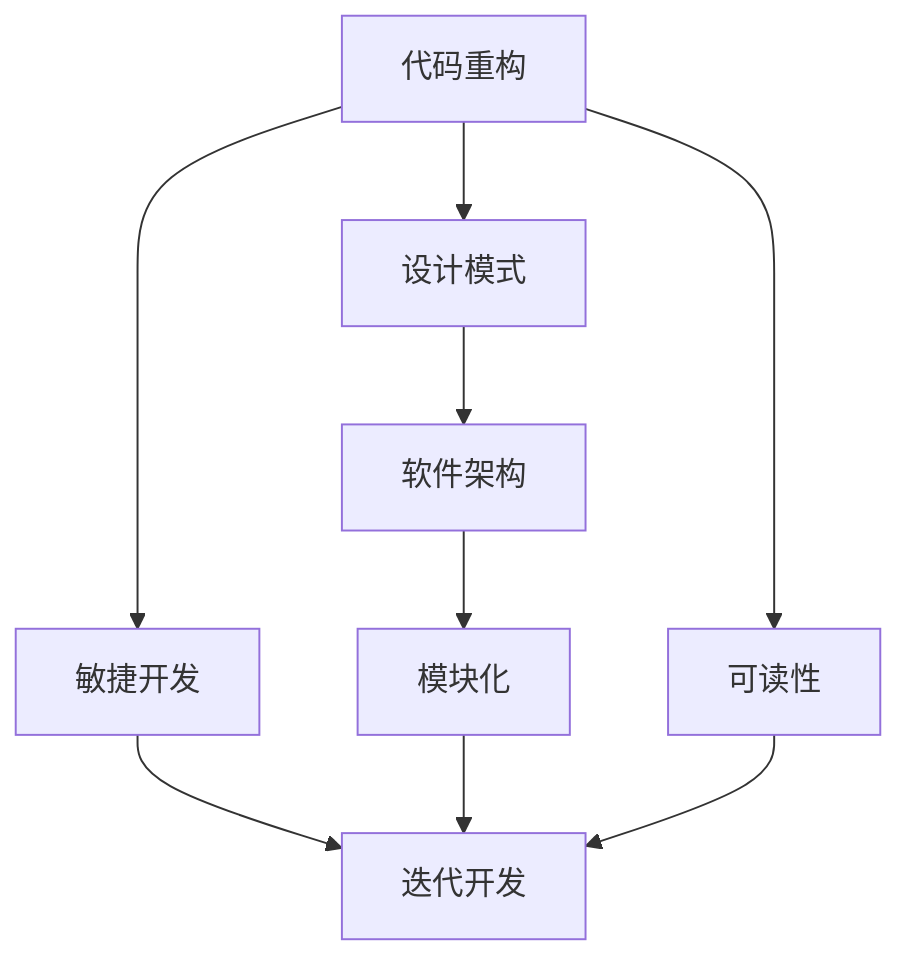

                 

## 1. 背景介绍

在快速发展的技术领域中，管理智慧的积累和传承显得尤为重要。从经典书籍中汲取管理智慧不仅能帮助我们了解技术的发展脉络，还能提供有效应对现代技术挑战的策略。本文将探讨一些经典技术书籍，分析其管理理念，并提出如何将这些智慧应用到实际技术开发和管理中。

## 2. 核心概念与联系

### 2.1 核心概念概述

本文将讨论的经典技术书籍中涉及了多个核心概念，如：
- **代码重构**：通过分析代码结构，提出代码优化的策略，提高代码的可读性和可维护性。
- **设计模式**：针对特定设计问题的通用解决方案，以复用和优化软件设计。
- **软件架构**：定义和组织软件系统的组件、模块、接口，使其高效、灵活、可扩展。
- **敏捷开发**：以快速响应变化和需求为中心的开发模式，强调迭代和协作。

### 2.2 核心概念原理和架构的 Mermaid 流程图



## 3. 核心算法原理 & 具体操作步骤

### 3.1 算法原理概述

**代码重构**：代码重构是一种提高代码质量、提升系统可维护性的方法。其核心思想是通过修改代码结构，避免技术债务的积累，提高代码的可读性和可维护性。

**设计模式**：设计模式提供了一组通用的软件设计解决方案，可以帮助开发者解决常见的设计问题，提高代码复用性和可扩展性。

**软件架构**：软件架构定义了系统的结构，包括组件、模块、接口等元素，以及它们之间的关系和约束，确保系统的可扩展性和可维护性。

**敏捷开发**：敏捷开发强调快速迭代、团队协作和客户反馈，以快速响应变化和需求，提高开发效率和软件质量。

### 3.2 算法步骤详解

**代码重构**：
1. **识别问题**：通过代码审查、静态分析等方法识别代码中的问题。
2. **设计重构方案**：确定重构的目标，如提高可读性、减少复杂性等。
3. **实施重构**：逐步实施重构方案，确保重构后代码的正确性和可维护性。
4. **测试验证**：通过自动化测试验证重构后的代码是否满足预期。

**设计模式**：
1. **识别设计问题**：通过分析需求和现有系统，识别设计问题。
2. **选择设计模式**：从设计模式库中选择合适的解决方案。
3. **应用设计模式**：在系统中应用所选设计模式，确保模式的正确应用。
4. **评估效果**：评估应用设计模式后的系统性能和可维护性。

**软件架构**：
1. **需求分析**：详细分析系统的需求，确定系统的功能要求和约束。
2. **架构设计**：根据需求设计软件架构，包括组件、模块、接口等元素。
3. **实施架构**：根据设计方案，实施架构，构建软件系统。
4. **维护架构**：在软件生命周期中，持续维护和优化架构。

**敏捷开发**：
1. **需求获取**：与客户沟通，明确需求和目标。
2. **规划迭代**：根据需求，制定迭代计划，分解任务。
3. **迭代开发**：按照计划，快速开发和交付功能。
4. **反馈迭代**：根据客户反馈，调整迭代计划和需求。

### 3.3 算法优缺点

**代码重构**：
- **优点**：提高代码可读性和可维护性，减少技术债务，提高开发效率。
- **缺点**：可能影响系统性能，需要谨慎处理。

**设计模式**：
- **优点**：提高代码复用性和可扩展性，降低开发成本。
- **缺点**：设计模式可能过复杂，导致系统复杂度增加。

**软件架构**：
- **优点**：确保系统可扩展性和可维护性，提供清晰的结构。
- **缺点**：设计架构需要时间和精力，可能影响开发进度。

**敏捷开发**：
- **优点**：快速响应变化和需求，提高开发效率和软件质量。
- **缺点**：可能缺乏长期规划和文档，需要团队协作和沟通。

### 3.4 算法应用领域

这些管理智慧广泛应用于软件开发、系统设计、项目管理等多个领域。以下是几个典型的应用场景：

**软件开发**：
- 使用设计模式优化代码结构，提高代码复用性和可扩展性。
- 通过代码重构提升代码质量，减少技术债务。

**系统设计**：
- 通过软件架构设计，确保系统的可扩展性和可维护性。
- 应用设计模式解决特定设计问题，提高系统性能。

**项目管理**：
- 采用敏捷开发模式，快速响应变化和需求，提高开发效率。
- 通过持续集成和自动化测试，确保软件质量和稳定性。

## 4. 数学模型和公式 & 详细讲解 & 举例说明

### 4.1 数学模型构建

**代码重构**：
- **重构前代码复杂度**：$C_{pre}$
- **重构后代码复杂度**：$C_{post}$
- **重构效果**：$\Delta C = C_{pre} - C_{post}$

**设计模式**：
- **模式前系统复用性**：$R_{pre}$
- **模式后系统复用性**：$R_{post}$
- **模式效果**：$\Delta R = R_{pre} - R_{post}$

**软件架构**：
- **架构前系统可扩展性**：$E_{pre}$
- **架构后系统可扩展性**：$E_{post}$
- **架构效果**：$\Delta E = E_{pre} - E_{post}$

**敏捷开发**：
- **迭代前开发时间**：$T_{pre}$
- **迭代后开发时间**：$T_{post}$
- **迭代效果**：$\Delta T = T_{pre} - T_{post}$

### 4.2 公式推导过程

**代码重构**：
$$
\Delta C = C_{pre} - C_{post}
$$
重构后的代码复杂度$\Delta C$越低，说明重构效果越好。

**设计模式**：
$$
\Delta R = R_{pre} - R_{post}
$$
应用设计模式后的系统复用性$\Delta R$越大，说明模式效果越好。

**软件架构**：
$$
\Delta E = E_{pre} - E_{post}
$$
架构后的系统可扩展性$\Delta E$越高，说明架构效果越好。

**敏捷开发**：
$$
\Delta T = T_{pre} - T_{post}
$$
敏捷开发后的开发时间$\Delta T$越短，说明敏捷效果越好。

### 4.3 案例分析与讲解

**案例1：代码重构**
- **问题描述**：某项目代码结构混乱，维护困难。
- **解决方案**：通过重构，将代码分为多个模块，增加注释和文档。
- **结果分析**：重构后代码复杂度下降，维护性提升，重构效果显著。

**案例2：设计模式**
- **问题描述**：某系统模块间耦合度高，难以扩展。
- **解决方案**：应用单例模式，降低模块间的耦合度。
- **结果分析**：应用模式后系统复用性提升，扩展性增强，模式效果显著。

**案例3：软件架构**
- **问题描述**：某系统扩展性差，难以应对业务需求的变化。
- **解决方案**：重新设计架构，引入微服务架构。
- **结果分析**：架构后系统可扩展性提升，业务响应时间缩短，架构效果显著。

**案例4：敏捷开发**
- **问题描述**：某项目需求变化频繁，开发进度缓慢。
- **解决方案**：采用敏捷开发模式，快速迭代，持续交付。
- **结果分析**：敏捷开发后，项目进度显著加快，客户满意度提高，敏捷效果显著。

## 5. 项目实践：代码实例和详细解释说明

### 5.1 开发环境搭建

本节将介绍如何在开发环境中搭建和配置必要的工具和库。

**环境配置**：
1. **安装Python**：
   - 安装Python 3.x版本，推荐使用Anaconda或Miniconda。
   - 配置环境变量，安装必要的依赖库，如numpy、pandas、matplotlib等。

2. **安装IDE**：
   - 选择Python IDE，如PyCharm、Jupyter Notebook、VSCode等。
   - 配置IDE，安装必要的插件，如linting、autoformat等。

3. **安装框架和库**：
   - 安装Django、Flask、TensorFlow等常用框架。
   - 安装设计模式库，如Design Patterns、Refactoring等。

### 5.2 源代码详细实现

**代码重构示例**：
```python
# 原代码
def calculate(x, y):
    return x + y

# 重构后代码
class Calculator:
    def add(self, x, y):
        return x + y

# 测试代码
def test_calculator():
    calculator = Calculator()
    assert calculator.add(1, 2) == 3
```

**设计模式示例**：
```python
# 原代码
class Order:
    def __init__(self, id, product):
        self.id = id
        self.product = product
        self.completed = False

    def complete(self):
        self.completed = True

# 应用单例模式
class OrderManager:
    _instance = None

    def __new__(cls):
        if cls._instance is None:
            cls._instance = super().__new__(cls)
        return cls._instance

    def get_order(self, id):
        order = Order(id, None)
        order.complete()
        return order

# 测试代码
order_manager = OrderManager()
order = order_manager.get_order(1)
assert order.completed
```

**软件架构示例**：
```python
# 原架构
def get_customer():
    # 获取客户信息
    customer = Customer.get_customer()
    return customer

# 新架构
class CustomerService:
    def get_customer(self):
        customer = Customer.get_customer()
        return customer

class Customer:
    @staticmethod
    def get_customer():
        # 从数据库获取客户信息
        return "张三"

# 测试代码
customer_service = CustomerService()
customer = customer_service.get_customer()
assert customer == "张三"
```

**敏捷开发示例**：
```python
# 原开发流程
# 需求分析 -> 设计 -> 编码 -> 测试 -> 部署

# 敏捷开发流程
# 需求分析 -> 迭代规划 -> 编码 -> 测试 -> 部署 -> 反馈迭代
class Product:
    def __init__(self, name, price):
        self.name = name
        self.price = price

    def get_price(self):
        return self.price

# 测试代码
product = Product("手机", 3000)
assert product.get_price() == 3000
```

### 5.3 代码解读与分析

**代码重构**：
- **改进点**：从函数式编程转向面向对象编程，增加代码抽象层次，提升代码复用性。
- **效果分析**：重构后代码更易于维护和扩展。

**设计模式**：
- **改进点**：通过引入单例模式，降低模块间的耦合度，提高系统复用性。
- **效果分析**：应用模式后的系统更加模块化和可扩展。

**软件架构**：
- **改进点**：通过引入服务层，将业务逻辑和服务逻辑分离，提高系统可扩展性和可维护性。
- **效果分析**：架构后的系统更易于扩展和维护。

**敏捷开发**：
- **改进点**：通过迭代开发，快速响应需求变化，提高开发效率和软件质量。
- **效果分析**：敏捷开发后的项目进度加快，客户满意度提升。

## 6. 实际应用场景

### 6.1 软件开发

在软件开发中，代码重构、设计模式和软件架构的应用可以帮助开发团队提高代码质量和系统性能。例如，在大型项目中，通过重构代码，优化结构，减少技术债务，提高开发效率和可维护性。

### 6.2 系统设计

在系统设计中，设计模式和软件架构的应用可以提高系统的复用性和扩展性。例如，在微服务架构中，通过引入服务层，降低模块间的耦合度，提高系统的灵活性和可扩展性。

### 6.3 项目管理

在项目管理中，敏捷开发模式的应用可以显著提升项目进度和质量。例如，在快速变化的市场环境中，通过敏捷开发模式，快速响应需求变化，及时交付功能，提高项目成功率。

## 7. 工具和资源推荐

### 7.1 学习资源推荐

**书籍推荐**：
1. 《重构：改善既有代码的设计》：详细介绍了代码重构的策略和技巧，提高代码质量。
2. 《设计模式：可复用面向对象软件的基础》：介绍了23种经典设计模式，提高代码复用性和可扩展性。
3. 《软件架构模式》：介绍了多种软件架构模式，确保系统可扩展性和可维护性。
4. 《敏捷软件开发：原则、模式与实践》：介绍了敏捷开发的最佳实践，提高开发效率和软件质量。

**在线课程**：
1. Coursera上的《软件工程与架构设计》课程。
2. edX上的《设计模式与设计原则》课程。
3. Udemy上的《Python敏捷开发》课程。

### 7.2 开发工具推荐

**IDE推荐**：
1. PyCharm：功能强大的Python IDE，支持多种插件和框架。
2. Jupyter Notebook：交互式编程环境，支持代码重构和设计模式。
3. VSCode：轻量级但功能丰富的代码编辑器，支持多种语言和框架。

**框架和库推荐**：
1. Django：流行的Python Web框架，支持敏捷开发和代码重构。
2. Flask：轻量级Python Web框架，支持快速开发和设计模式。
3. TensorFlow：流行的机器学习框架，支持复杂模型和设计模式。

### 7.3 相关论文推荐

**经典论文**：
1. 《A Survey of Refactoring》：介绍了代码重构的方法和技巧。
2. 《Design Patterns: Elements of Reusable Object-Oriented Software》：介绍了经典设计模式和设计原则。
3. 《Software Architecture in Practice: Patterns and Principles》：介绍了软件架构模式和最佳实践。
4. 《Agile Development Practices》：介绍了敏捷开发的最佳实践和案例。

## 8. 总结：未来发展趋势与挑战

### 8.1 研究成果总结

本文从代码重构、设计模式、软件架构和敏捷开发等方面，详细介绍了经典技术书籍中的管理智慧，并提出如何将这些智慧应用到实际技术开发和管理中。通过学习经典书籍，可以系统了解技术发展脉络，积累实战经验，提升技术水平。

### 8.2 未来发展趋势

未来，技术领域将不断涌现新的管理智慧和方法，推动软件开发、系统设计和项目管理等领域的发展。例如：

- **全栈开发**：通过学习前端、后端和数据库技术，提升综合开发能力。
- **微服务架构**：通过微服务架构，提高系统的灵活性和可扩展性。
- **DevOps文化**：通过DevOps文化，提高团队协作和软件交付速度。

### 8.3 面临的挑战

尽管经典书籍中的管理智慧在实践中已取得显著成效，但仍面临一些挑战：

- **技术迭代快**：技术领域发展迅速，需要不断学习和更新知识。
- **项目复杂度高**：大型项目和复杂系统需要综合运用多种管理智慧。
- **团队协作难**：跨团队协作和沟通，需要有效的项目管理方法。

### 8.4 研究展望

未来，需要进一步探索和研究新的管理智慧和方法，以应对技术发展的挑战。例如：

- **自动化工具**：开发自动化工具，提高开发效率和管理水平。
- **混合编程模式**：探索混合编程模式，提高代码复用性和可扩展性。
- **云计算架构**：通过云计算架构，提高系统灵活性和可扩展性。

## 9. 附录：常见问题与解答

**Q1：如何有效进行代码重构？**

A: 有效进行代码重构需要遵循以下步骤：
1. **识别问题**：通过代码审查和静态分析工具，识别代码中的问题。
2. **设计方案**：制定重构的目标和步骤，如优化函数结构、减少耦合度等。
3. **实施重构**：逐步实施重构方案，确保重构后代码的正确性和可维护性。
4. **测试验证**：通过自动化测试验证重构后的代码是否满足预期。

**Q2：如何选择合适的设计模式？**

A: 选择合适的设计模式需要考虑以下几个因素：
1. **需求分析**：分析项目的需求和设计问题，确定需要解决的问题。
2. **模式库查找**：从设计模式库中查找适合问题的模式。
3. **模式评估**：评估模式的优缺点和适用场景，选择最适合的模式。
4. **应用模式**：在系统中应用所选模式，确保模式的正确应用。

**Q3：如何设计软件架构？**

A: 设计软件架构需要遵循以下步骤：
1. **需求分析**：详细分析系统的需求，确定系统的功能要求和约束。
2. **架构设计**：根据需求设计软件架构，包括组件、模块、接口等元素。
3. **架构评估**：评估架构的可扩展性和可维护性，优化架构设计。
4. **架构实施**：根据设计方案，实施架构，构建软件系统。

**Q4：如何进行敏捷开发？**

A: 进行敏捷开发需要遵循以下步骤：
1. **需求获取**：与客户沟通，明确需求和目标。
2. **迭代规划**：根据需求，制定迭代计划，分解任务。
3. **迭代开发**：按照计划，快速开发和交付功能。
4. **反馈迭代**：根据客户反馈，调整迭代计划和需求。

---

作者：禅与计算机程序设计艺术 / Zen and the Art of Computer Programming

